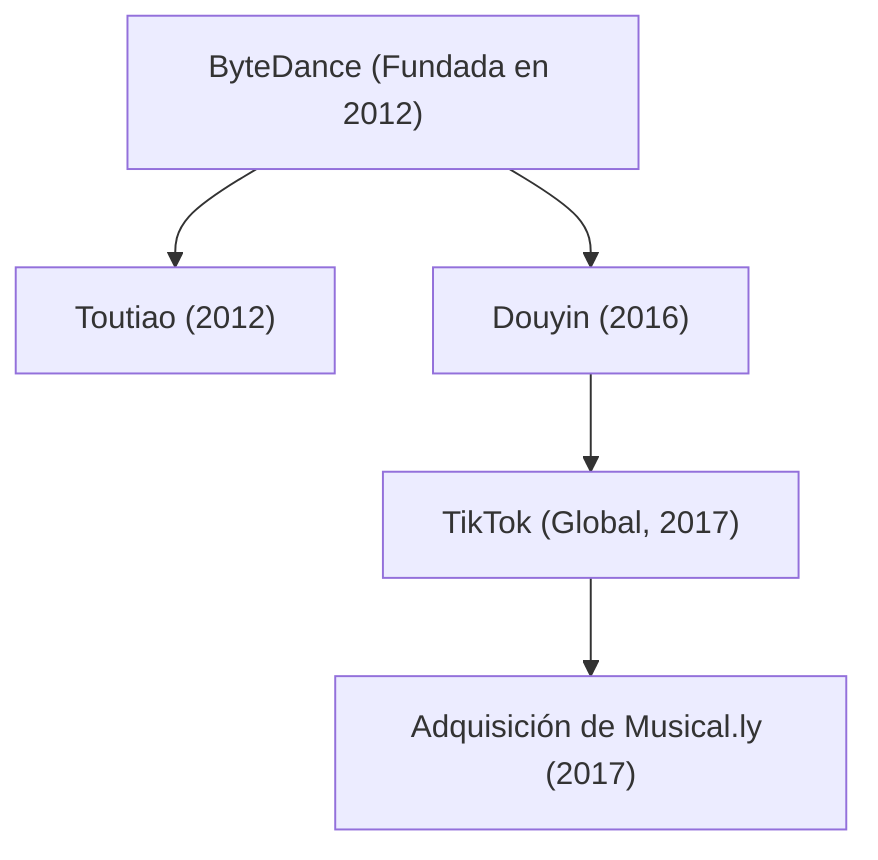

## 1. Introducción: El unicornio que redefinió el mapa tecnológico global

En el panorama tecnológico del siglo XXI, muy pocas empresas han crecido con la celeridad, la audacia disruptiva y la repercusión cultural de ByteDance (字节跳动). En menos de una década, la compañía pasó de ser una modesta empresa emergente nacida en un apartamento de Pekín al decacornio privado más valioso del planeta. Su producto estrella internacional, TikTok, cautivó a cientos de millones de usuarios de la Generación Z y mileniales en todo el mundo, dinamitando el histórico duopolio de gigantes de Silicon Valley como Meta (Facebook/Instagram) y Alphabet (Google/YouTube).

Este artículo examina de forma minuciosa la trayectoria de ByteDance: desde sus inicios algorítmicos y su peculiar estructura organizativa hasta el surgimiento de Douyin y TikTok, la adquisición estratégica de Musical.ly y su resistencia frente a las tensiones geopolíticas internacionales.

## 2. Los orígenes: La visión de Zhang Yiming sobre la distribución algorítmica

La historia de ByteDance arrancó a comienzos de 2012 en un piso de Pekín de la mano de Zhang Yiming, un ingeniero de software de 29 años graduado en la Universidad de Nankai. Tras acumular experiencia en varios proyectos pioneros de internet (como el portal de viajes Kuxun y la plataforma de microblogueo Fanfou), Zhang llegó a una conclusión visionaria: *la explosión del teléfono inteligente estaba a punto de transformar para siempre la forma en que los seres humanos descubren información.*

En 2012, el acceso a la información digital dependía de dos esquemas hegemónicos:
1. **Búsqueda activa (modelo Pull)**: El usuario introduce conscientemente términos en buscadores como Google o Baidu.
2. **Red social (modelo Push)**: El usuario consume contenidos publicados por sus amigos o cuentas seguidas en redes como Facebook, Twitter o Weibo.

Zhang Yiming ideó una tercera vía: **la personalización algorítmica pura sin grafo social**. Planteó que los usuarios no necesitaban molestarse en buscar ni en gestionar listas de amigos; bastaba con que algoritmos avanzados de aprendizaje automático aprendieran de sus comportamientos cotidianos para recomendarles, de forma continua e hiperpersonalizada, contenidos ajustados a sus intereses latentes.

### El nacimiento de Toutiao (Titulares de Hoy)

En agosto de 2012, ByteDance lanzó su primera aplicación emblemática: «Jinri Toutiao» (Titulares de Hoy). Sin contratar a redactores tradicionales, Toutiao descansaba por entero en la inteligencia artificial. Sus algoritmos recopilaban, clasificaban y etiquetaban contenidos de la web, evaluando señales en tiempo real como tasas de clics, tiempo de lectura, velocidad de desplazamiento, comentarios y franjas horarias.

En cuestión de meses, Toutiao demostró niveles de retención y fidelidad sin precedentes, convirtiéndose en uno de los portales informativos más populares de China y generando los flujos de caja necesarios para acometer la posterior expansión de la firma.

## 3. El giro decisivo: El auge del vídeo corto y la eclosión de Douyin (2016)

Hacia 2015, con el despliegue de las redes móviles 4G y la mejora de las pantallas y cámaras de los teléfonos, Zhang Yiming previó el siguiente gran cambio: el consumo de contenidos en internet migraría del texto y las fotos hacia vídeos verticales breves y dinámicos.

En septiembre de 2016, ByteDance presentó una aplicación interna llamada A.me, rebautizada casi de inmediato como **Douyin (抖音)**. Douyin se diseñó como una plataforma intuitiva de vídeos verticales de 15 segundos con herramientas que reducían drásticamente las barreras de producción: ofrecía un vasto catálogo de música comercial con licencia, filtros sincronizados con el compás y algoritmos de estabilización óptica.

Douyin revolucionó las costumbres de los internautas chinos. Frente a los sitios de vídeo tradicionales donde el usuario debía examinar miniaturas antes de hacer clic, Douyin introdujo el **desplazamiento vertical infinito a pantalla completa con reproducción automática**. Al abrir la aplicación, el vídeo comienza de inmediato; basta un leve deslizamiento del pulgar para que el algoritmo muestre el siguiente hallazgo sin fricción cognitiva alguna.

## 4. La ofensiva internacional: El lanzamiento de TikTok y la compra de Musical.ly (2017)

A diferencia de muchos gigantes tecnológicos chinos que consolidaron su mercado interno antes de mirar al exterior, ByteDance adoptó desde su nacimiento la filosofía «Global from Day One». En mayo de 2017 lanzó **TikTok**, la versión gemela de Douyin para el mercado internacional.

Sin embargo, captar usuarios orgánicamente en los mercados occidentales resultaba lento ante la presencia de competidores afianzados. En noviembre de 2017, Zhang Yiming dio un audaz golpe de timón: ByteDance adquirió por cerca de 1.000 millones de dólares **Musical.ly**, una aplicación de vídeos de sincronización labial fundada en Shanghái y California que contaba con una masa fiel de 60 millones de adolescentes en Estados Unidos y Europa.

En agosto de 2018, ByteDance culminó una maniobra maestra: clausuró la marca Musical.ly y fusionó todas sus cuentas de usuario, vídeos y creadores directamente en TikTok.

Aquella integración dio a TikTok la masa crítica requerida en Occidente. Respaldada por una agresiva inversión publicitaria y el motor de recomendación más afinado del mundo, TikTok se convirtió en 2018 en la aplicación más descargada del planeta y superó en 2021 los 1.000 millones de usuarios activos mensuales, democratizando la viralidad a escala planetaria.

## 5. El motor algorítmico: La verdadera ventaja competitiva de ByteDance

La razón por la que ByteDance sorprendió a gigantes consolidados como Meta o Google reside en una profunda **disrupción conceptual en la filosofía del algoritmo**:

- **Grafo Social (Meta, Twitter/X)**: La circulación del contenido depende de las relaciones interpersonales. El usuario solo ve lo que comparten sus contactos o seguidos, provocando estancamiento y rigidez en la distribución.
- **Grafo de Intereses / Contenido (TikTok)**: La distribución es totalmente independiente de los vínculos sociales. El algoritmo juzga cada vídeo por su propio atractivo intrínseco y lo presenta a las personas con mayor probabilidad de conectar con esa temática.

En términos matemáticos, la probabilidad $P(E)$ de que un usuario interactúe positivamente con un vídeo (completar visionado, dar me gusta, comentar o compartir) se formula mediante redes neuronales profundas:

$$ P(E) = \sigma(W^T X + b) $$

Donde:
- $X$ es un vector multidimensional que recopila los rasgos del usuario (historial de consumo, retención por temáticas), del vídeo (ritmo musical, etiquetas semánticas visuales) y del entorno (tipo de dispositivo, horario y ubicación).
- $W$ es la matriz de pesos entrenada continuamente mediante macrodatos.
- $\sigma$ representa una función de activación (como Sigmoid) que devuelve la probabilidad estimada.

El motor de TikTok no se fija únicamente en los comentarios o me gusta, sino que mide microseñales a escala de milisegundos:
- ¿Dudó el usuario una fracción de segundo antes de deslizar la pantalla?
- ¿Vio el vídeo hasta el último fotograma (tasa de finalización)?
- ¿Reprodujo el vídeo en bucle varias veces consecutivas?
- ¿Cuántos segundos exactos transcurrieron antes del descarte?

Este sistema ultrasensible permite que un creador sin un solo seguidor pueda alcanzar de la noche a la mañana decenas de millones de visualizaciones si su contenido genera una retención excelente, consagrando la auténtica democratización de la viralidad.

## 6. Organización interna: El modelo de la «Fábrica de Apps»

El secreto de la asombrosa rapidez de ByteDance para concebir nuevos productos reside en su estructura operativa centralizada, conocida como la **«Fábrica de Apps» (Middle Platform / 中台)**. En lugar de dividir la empresa en unidades de negocio aisladas, ByteDance centraliza sus tres motores fundamentales en una plataforma compartida:
1. **Infraestructura algorítmica y tecnológica común**
2. **Equipo centralizado de adquisición de tráfico y crecimiento de usuarios**
3. **Sistemas unificados de monetización publicitaria**

Bajo este esquema, pequeños equipos de producto ensayan y lanzan aplicaciones en pocas semanas. Si un proyecto demuestra una tracción algorítmica sobresaliente, la plataforma central le inyecta enormes recursos de capital y publicidad; si no alcanza los objetivos, el equipo se disuelve y se reubica de inmediato, minimizando los costes de ensayo y error.

Este engranaje industrial ha hecho posible una diversificación integral:
- **Software colaborativo empresarial (SaaS)**: Lanzamiento de «Lark» (Feishu), una plataforma unificada que aúna mensajería, documentos en línea y videoconferencias.
- **Comercio electrónico social**: Despliegue de «TikTok Shop», que cierra el círculo entre el descubrimiento espontáneo de productos en vídeo y la compra instantánea en la aplicación, con un éxito rotundo en el sudeste asiático y expansión en Occidente.
- **Sector de videojuegos**: Creación del sello «Nuverse» para publicar títulos competitivos y casuales en dispositivos móviles.
- **Hardware y metaverso**: Compra en 2021 del fabricante de visores de realidad virtual Pico, posicionándose en la computación espacial.

## 7. Fricciones geopolíticas y batallas regulatorias

El fulgurante éxito internacional de TikTok situó a ByteDance en el epicentro de la pugna tecnológica y geoestratégica entre Estados Unidos y China.

En 2020, tras escaramuzas fronterizas entre India y China, el gobierno indio decretó la prohibición fulminante de TikTok y decenas de aplicaciones chinas por motivos de seguridad nacional, evaporando de golpe el mayor mercado internacional de la plataforma (unos 200 millones de usuarios).

Simultáneamente, en Estados Unidos arreciaron los recelos sobre privacidad y soberanía de los datos:
- El temor a que la legislación china pudiera obligar a la entrega de datos de usuarios extranjeros.
- La inquietud ante la hipotética manipulación algorítmica para moldear la opinión pública o difundir propaganda.

En respuesta, ByteDance destinó miles de millones de dólares a desarrollar el **«Project Texas»** en Estados Unidos, almacenando todos los datos de los usuarios estadounidenses en servidores gestionados por Oracle y sometidos a estrictas auditorías externas. En Europa, se puso en marcha una iniciativa análoga llamada **«Project Clover»**.

Pese a estos esfuerzos, en abril de 2024 el Congreso de Estados Unidos aprobó una histórica ley que conmina a ByteDance a vender las operaciones de TikTok en el país a una empresa no extranjera adversaria en un plazo tasado, bajo apercibimiento de veto nacional absoluto. ByteDance recurrió la medida ante los tribunales federales invocando la Primera Enmienda, entablando una batalla legal decisiva para el porvenir de internet.

## 8. Conclusión: El porvenir del algoritmo y la sociedad moderna

La trayectoria de ByteDance demuestra que la excelencia en inteligencia artificial combinada con una ejecución de producto milimétrica puede superar barreras culturales, idiomáticas y fronterizas con una rapidez inaudita. El ideal de Zhang Yiming de conectar a las personas con el contenido idóneo se ha hecho realidad a escala planetaria.

Al mismo tiempo, la colosal magnitud alcanzada por la plataforma plantea dilemas profundos en torno a la seguridad de los Estados, el bienestar psicológico de los jóvenes y la preservación de una internet abierta frente a las fracturas geopolíticas.

Independientemente del desenlace de las tensiones regulatorias, ByteDance ha cambiado para siempre los cimientos de la industria mediática global. Su audaz periplo perdurará como uno de los capítulos más fascinantes e influyentes de la historia de los negocios contemporáneos.
