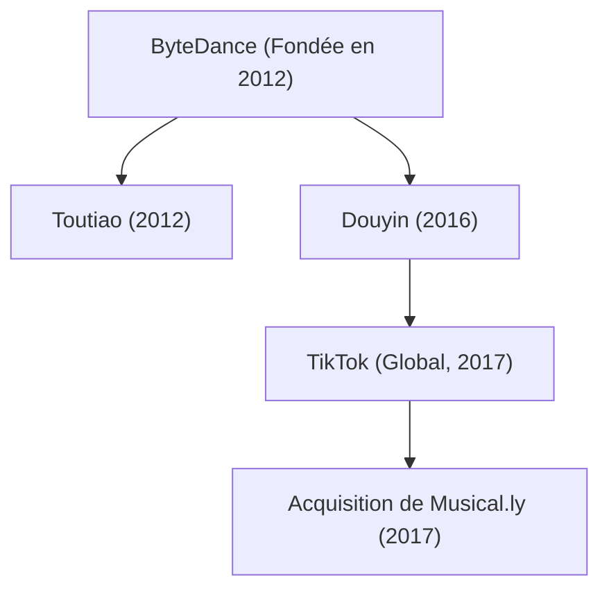

## 1. Introduction : La licorne qui a redessiné la scène technologique mondiale

Dans l'histoire technologique du XXIe siècle, peu d'entreprises ont connu une expansion aussi vertigineuse et un impact culturel aussi foudroyant que ByteDance (字节跳动). En l'espace d'une décennie, cette start-up née dans un modeste appartement pékinois est devenue la plus précieuse décacorne non cotée de la planète. Son joyau international, TikTok, a séduit des centaines de millions d'utilisateurs de la génération Z et de milléniaux, brisant l'hégémonie historique des géants de la Silicon Valley comme Meta (Facebook/Instagram) et Alphabet (Google/YouTube).

Cet article décortique la trajectoire passionnante de ByteDance : depuis ses fondements algorithmiques et son modèle organisationnel unique jusqu'à l'ascension de Douyin et TikTok, le rachat audacieux de Musical.ly et ses démêlés au cœur des tempêtes géopolitiques mondiales.

## 2. Les origines : La vision de Zhang Yiming sur la distribution algorithmique

La saga ByteDance s'ouvre au début de l'année 2012 dans un appartement de Pékin sous la houlette de Zhang Yiming, un ingénieur logiciel de 29 ans diplômé de l'université de Nankai. Fort de son expérience au sein de plusieurs jeunes pousses numériques (comme le portail de voyage Kuxun et la plateforme de micro-messages Fanfou), Zhang acquit une certitude absolue : *l'avènement des smartphones allait balayer les modes traditionnels de circulation de l'information.*

En 2012, l'accès au contenu reposait sur deux grands piliers :
1. **La recherche active (modèle Pull)** : L'internaute saisit délibérément des requêtes dans un moteur de recherche tel que Google ou Baidu.
2. **Le réseau relationnel (modèle Push)** : L'utilisateur consulte les publications de ses amis ou des comptes auxquels il est abonné sur Facebook, Twitter ou Weibo.

Zhang Yiming conceptualisa une troisième approche : **la personnalisation algorithmique intégrale sans graphe social**. Son postulat était simple : nul besoin de chercher manuellement ou de gérer des listes de contacts ; des algorithmes d'apprentissage automatique sophistiqués peuvent analyser en temps réel les comportements fins de l'utilisateur pour lui proposer en continu les contenus les plus captivants.

### La naissance de Toutiao (À la Une aujourd'hui)

En août 2012, ByteDance lança sa première application majeure : « Jinri Toutiao » (À la Une aujourd'hui). Sans aucune équipe de journalistes traditionnels, Toutiao reposait exclusivement sur le machine learning. Le moteur explorait et indexait les publications du web, entraînant ses modèles sur des micro-signaux en temps réel : taux de clic, temps de lecture, vitesse de défilement, commentaires et localisation.

En quelques mois, Toutiao afficha des taux d'engagement records, devenant l'un des agrégateurs d'actualités les plus consultés de Chine et générant les flux de trésorerie qui financèrent la fulgurante diversification de ByteDance.

## 3. Le grand tournant : L'explosion de la vidéo courte et l'envol de Douyin (2016)

Dès 2015, devant la généralisation de la 4G et la montée en puissance des écrans et caméras mobiles, Zhang Yiming comprit que les formats textuels atteignaient leurs limites et que l'avenir appartenait aux courtes vidéos verticales immersives.

En septembre 2016, ByteDance lança l'application A.me, rapidement rebaptisée **Douyin (抖音)**. Douyin fut pensée comme une plateforme intuitive de clips musicaux de 15 secondes conçue pour abolir les freins à la création : elle fournissait une immense bibliothèque musicale officielle, des effets visuels synchronisés au rythme sonore et des outils d'embellissement intelligents.

Douyin bouleversa les usages. Délaissant les catalogues traditionnels où l'internaute devait cliquer sur une vignette, Douyin introduisit le **défilement vertical infini plein écran avec lecture instantanée**. Dès l'ouverture de l'application, le flux audiovisuel s'anime sans nécessiter la moindre décision ; un simple glissement du doigt vers le haut révèle la surprise suivante, créant une boucle de gratification immédiate inédite.

## 4. L'expansion internationale : L'avènement de TikTok et l'achat de Musical.ly (2017)

Contrairement à la majorité des entreprises asiatiques qui attendent d'avoir saturé leur marché domestique avant d'exporter leurs produits, ByteDance adopta d'emblée la doctrine « Global from Day One ». En mai 2017 fut inaugurée **TikTok**, la réplique internationale de Douyin.

Toutefois, la conquête des marchés occidentaux s'avérait complexe face aux bastions établis. C'est alors que Zhang Yiming réalisa un coup d'éclat : en novembre 2017, ByteDance racheta pour environ 1 milliard de dollars **Musical.ly**, une application de play-back vidéo sino-américaine forte de 60 millions d'adolescents ultra-actifs aux États-Unis et en Europe.

En août 2018, ByteDance opéra une bascule magistrale : elle éteignit la marque Musical.ly et transféra l'ensemble des profils, vidéos et utilisateurs vers TikTok.

Cette fusion offrit à TikTok la masse critique indispensable pour s'imposer en Occident. Portée par des investissements promotionnels colossaux et un moteur de recommandation sans équivalent, TikTok devint en 2018 l'application la plus téléchargée au monde et franchit le cap du milliard d'utilisateurs actifs mensuels en 2021, démocratisant la viralité par-delà les frontières et les langues.

## 5. L'algorithme roi : Le véritable trésor technologique de ByteDance

La raison fondamentale pour laquelle ByteDance a pris de vitesse les géants américains tient à une rupture épistémologique dans la **philosophie de son algorithme** :

- **Le graphe social (Meta, Twitter/X)** : La diffusion est prisonnière des relations d'amitié ou d'abonnement. L'accès aux contenus reste conditionné par le réseau social de l'internaute.
- **Le graphe d'intérêt / de contenu (TikTok)** : La diffusion s'affranchit des relations humaines. L'algorithme évalue chaque vidéo de manière isolée selon son pouvoir de rétention et la sert directement aux utilisateurs les plus susceptibles de l'apprécier.

Mathématiquement, la probabilité $P(E)$ qu'un utilisateur interagisse positivement avec une vidéo (taux de complétion, mention j'aime, partage) s'exprime au moyen d'un modèle neuronal de recommandation :

$$ P(E) = \sigma(W^T X + b) $$

Où :
- $X$ est un vecteur multidimensionnel agrégeant les signaux de l'utilisateur (historique d'écoute, rétention thématique), de la vidéo (rythme musical, analyse visuelle par ordinateur) et du contexte (type d'appareil, heure de consultation).
- $W$ est la matrice des pondérations optimisée en continu par le traitement massif des données.
- $\sigma$ représente une fonction d'activation produisant une probabilité d'engagement.

L'intelligence artificielle de TikTok ne se borne pas à enregistrer des mentions j'aime ; elle capture des micro-signaux à l'échelle de la milliseconde :
- Le doigt de l'utilisateur a-t-il marqué une hésitation avant de glisser ?
- La vidéo a-t-elle été visionnée jusqu'au bout (taux de complétion) ?
- A-t-elle été regardée en boucle plusieurs fois ?
- Combien de secondes se sont écoulées avant le rejet ?

Grâce à cette boucle de rétroaction instantanée, un créateur inconnu sans aucun abonné peut voir sa vidéo diffusée à des dizaines de millions de personnes du jour au lendemain si son contenu captive l'audience, réalisant ainsi une véritable démocratisation de la viralité.

## 6. Structure interne : Le modèle de « l'usine à applications »

L'agilité stupéfiante de ByteDance repose sur une organisation matricielle appelée la **« Fábrique d'applications » (Middle Platform / 中台)**. Plutôt que de bâtir des divisions étanches pour chaque projet, l'entreprise mutualise trois piliers technologiques majeurs :
1. **L'infrastructure algorithmique et d'IA partagée**
2. **L'équipe transversale de croissance et d'acquisition de trafic**
3. **Les technologies intégrées de monétisation et de régie publicitaire**

Grâce à ce socle, de petites équipes pluridisciplinaires peuvent concevoir et tester une nouvelle application en quelques semaines. Si les métriques s'avèrent prometteuses, la plateforme centrale déploie des moyens colossaux pour l'internationaliser ; dans le cas contraire, le projet est interrompu sans affecter le reste de l'organisation.

Cette efficacité industrielle a favorisé une diversification tous azimuts :
- **Bureautique d'entreprise (SaaS)** : Déploiement de « Lark » (Feishu), suite unifiée combinant messagerie, édition collaborative de documents et visioconférence.
- **Commerce électronique** : Lancement de « TikTok Shop », reliant la découverte audiovisuelle à l'achat direct au sein de l'application, avec un succès éclatant en Asie du Sud-Est et un déploiement massif en Occident.
- **Jeux vidéo** : Création de la branche « Nuverse » pour concevoir et éditer des titres mobiles.
- **Réalité virtuelle et matériels** : Rachat en 2021 de la marque de casques immersifs Pico, amorçant son positionnement dans l'informatique spatiale.

## 7. Turbulences géopolitiques et batailles juridiques

Le triomphe planétaire de TikTok a propulsé ByteDance au premier rang des tensions technologiques entre Washington et Pékin.

En 2020, sur fond de tensions frontalières, l'Inde bannit subitement TikTok et des dizaines d'applications d'origine chinoise pour des raisons de sécurité nationale, privant l'application de son plus grand vivier international (environ 200 millions d'utilisateurs).

Dans le même temps, les autorités américaines manifestèrent de vives inquiétudes quant à la confidentialité des données :
- La crainte que la législation chinoise permette d'exiger l'accès aux données des citoyens américains.
- Le risque potentiel d'une manipulation algorithmique à des fins d'influence ou de propagande.

Pour apaiser ces craintes, ByteDance a investi des milliards de dollars dans le **« Project Texas »** aux États-Unis, confiant l'hébergement de ses données locales aux serveurs de l'américain Oracle sous contrôle strict d'auditeurs indépendants. En Europe, un dispositif similaire baptisé **« Project Clover »** a été mis en œuvre.

Malgré ces gages d'indépendance, le Congrès américain a adopté en avril 2024 une loi sans précédent contraignant ByteDance à céder les activités américaines de TikTok sous peine d'interdiction totale sur le territoire national. ByteDance a aussitôt contesté cette loi devant la justice fédérale au titre du Premier amendement sur la liberté d'expression, engageant un bras de fer juridique et diplomatique déterminant pour l'avenir du réseau mondial.

## 8. Conclusion : L'avenir de l'algorithme et la société moderne

L'épopée de ByteDance atteste avec éclat qu'une technologie algorithmique avant-gardiste couplée à une conception produit irréprochable peut renverser les monopoles les plus solides et abolir les frontières culturelles. Le rêve initial de Zhang Yiming de fluidifier la circulation de l'information s'est concrétisé à l'échelle planétaire.

Cependant, alors que l'application s'est hissée au cœur de la vie numérique de milliards d'êtres humains, les interrogations relatives à la souveraineté numérique, à la sécurité des nations et au bien-être psychologique de la jeunesse constituent pour ByteDance une mise à l'épreuve existentielle.

Quel que soit le sort réservé à TikTok dans les tourments géopolitiques actuels, ByteDance a profondément et définitivement réinventé les canons des médias contemporains. Sa trajectoire restera gravée comme l'un des chapitres les plus fascinants et audacieux de l'histoire industrielle moderne.
