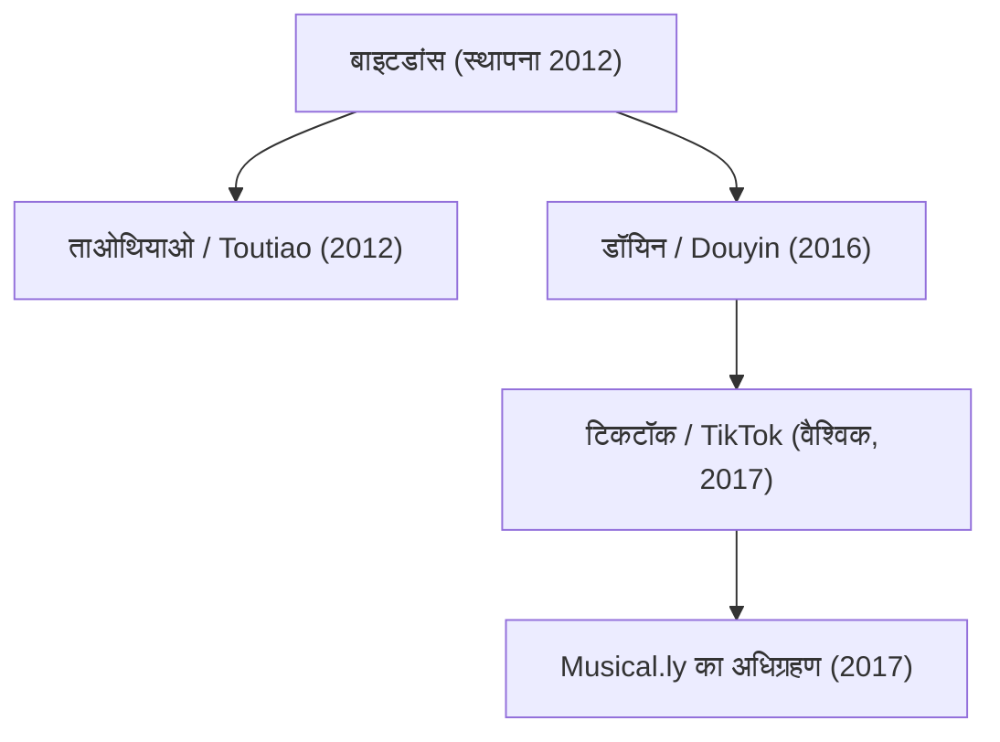

## 1. प्रस्तावना: वैश्विक तकनीक के नियम बदलने वाला सबसे बड़ा यूनिकॉर्न

21वीं सदी के तकनीकी इतिहास में ऐसी बहुत कम कंपनियाँ हैं जिनका विस्तार बाइटडांस (ByteDance - 字节跳动) जितनी गति, प्रभाव और सांस्कृतिक गहराई के साथ हुआ हो। एक दशक से भी कम समय में यह कंपनी बीजिंग के एक साधारण चार कमरों के अपार्टमेंट से निकलकर दुनिया की सबसे मूल्यवान गैर-सूचीबद्ध (private) टेक दिग्गज बन गई। इसके अंतरराष्ट्रीय उत्पाद टिकटॉक (TikTok) ने दुनिया भर के करोड़ों युवाओं को अपना दीवाना बनाया और मेटा (Facebook/Instagram) तथा अल्फाबेट (Google/YouTube) जैसे सिलिकॉन वैली के दिग्गजों के दशकों पुराने एकाधिकार को तोड़ दिया।

यह लेख बाइटडांस के संपूर्ण इतिहास का विस्तृत विश्लेषण प्रस्तुत करता है: इसकी एल्गोरिदम-आधारित शुरुआत, अनूठी संगठनात्मक संरचना, डॉयिन (Douyin) और टिकटॉक का उदय, म्यूज़िकली (Musical.ly) का ऐतिहासिक अधिग्रहण और भू-राजनीतिक तूफानों के बीच इसकी लड़ाई।

## 2. स्थापना की पृष्ठभूमि: झांग यिमिंग की दृष्टि और एल्गोरिदम का कमाल

बाइटडांस की यात्रा 2012 की शुरुआत में बीजिंग में 29 वर्षीय सॉफ्टवेयर इंजीनियर झांग यिमिंग (Zhang Yiming) द्वारा शुरू हुई। नानकाई विश्वविद्यालय से सॉफ्टवेयर इंजीनियरिंग में स्नातक झांग ने कई इंटरनेट स्टार्टअप्स जैसे कुक्सुन (Kuxun) और शुरुआती माइक्रोब्लॉगिंग साइट फानफाउ (Fanfou) में काम किया था। इन अनुभवों से झांग को एक क्रांतिकारी अहसास हुआ: *स्मार्टफोन क्रांति सूचनाओं को खोजने और उपभोग करने के पुराने तरीकों को पूरी तरह खत्म करने जा रही थी।*

वर्ष 2012 में डिजिटल सामग्री खोजने के दो मुख्य तरीके थे:
1. **सर्च मॉडल (Pull-based)**: उपयोगकर्ता गूगल या बायडू जैसे सर्च इंजनों पर खुद कीवर्ड लिखकर जानकारी खोजते थे।
2. **सोशल मॉडल (Push-based)**: उपयोगकर्ता फेसबुक, ट्विटर या वीबो पर अपने दोस्तों और फॉलो किए गए खातों द्वारा साझा की गई सामग्री देखते थे।

झांग यिमिंग ने तीसरा और अधिक शक्तिशाली मॉडल सोचा: **बिना किसी सोशल ग्राफ के शुद्ध मशीन लर्निंग पर आधारित वैयक्तिकरण (Personalization)**। उनका मानना था कि उपयोगकर्ताओं को खुद जानकारी खोजने या दोस्तों की सूची बनाने की आवश्यकता नहीं होनी चाहिए। इसके बजाय, कृत्रिम बुद्धिमत्ता (AI) को उपयोगकर्ता के सूक्ष्म व्यवहारों का विश्लेषण करके सीधे उनकी रुचि के अनुसार सामग्री उपलब्ध करानी चाहिए।

### तोतियाओ (Toutiao - आज की सुर्खियां) का उदय

अगस्त 2012 में बाइटडांस ने अपना पहला प्रमुख ऐप लॉन्च किया: "जिनरी तोतियाओ" (Today's Headlines)। इस ऐप में कोई भी पारंपरिक संपादक या पत्रकार नहीं था; इसका पूरा नियंत्रण एल्गोरिदम के हाथों में था। यह इंजन इंटरनेट से लाखों लेखों को इकट्ठा कर उन्हें वर्गीकृत करता था और उपयोगकर्ता के क्लिक, पढ़ने के समय, स्क्रॉल गति, टिप्पणियों और समय के आधार पर रीयल-टाइम में सुझाव देता था।

कुछ ही महीनों में तोतियाओ चीन का सबसे लोकप्रिय समाचार ऐप बन गया। इसने बाइटडांस को भारी राजस्व और मजबूत कैश फ्लो प्रदान किया, जिससे आगे चलकर वीडियो के क्षेत्र में विस्तार करना संभव हुआ।

## 3. शॉर्ट वीडियो क्रांति और डॉयिन का जन्म (2016)

2015 तक झांग यिमिंग ने भांप लिया था कि मोबाइल इंटरनेट सस्ता और तेज हो रहा था, स्मार्टफोन्स के कैमरे बेहतर हो रहे थे और उपयोगकर्ताओं का ध्यान टेक्स्ट से हटकर वर्टिकल वीडियो की ओर बढ़ रहा था।

सितंबर 2016 में बाइटडांस ने "A.me" नाम से एक ऐप लॉन्च किया, जिसे जल्द ही **डॉयिन (Douyin - 抖音)** नाम दिया गया। डॉयिन को 15-सेकंड के वर्टिकल वीडियो बनाने के लिए बेहद आसान टूल के रूप में विकसित किया गया था। इसमें लोकप्रिय संगीत की विशाल लाइब्रेरी, बीट-सिंक्ड इफेक्ट्स और वीडियो स्टेबलाइजेशन की सुविधा दी गई।

डॉयिन ने चीन के शहरी युवाओं के बीच तहलका मचा दिया। पारंपरिक वीडियो प्लेटफॉर्म्स के विपरीत, जहाँ वीडियो पर क्लिक करना पड़ता था, डॉयिन ने **अनंत वर्टिकल स्वाइप (Infinite Vertical Swipe)** की शुरुआत की। ऐप खोलते ही फुल-स्क्रीन वीडियो चलने लगता था और अगला वीडियो देखने के लिए केवल एक स्वाइप की आवश्यकता होती थी।

## 4. वैश्विक विस्तार: टिकटॉक की शुरुआत और Musical.ly का अधिग्रहण (2017)

अधिकांश चीनी कंपनियों के विपरीत, जो केवल घरेलू बाजार पर ध्यान देती थीं, बाइटडांस ने शुरुआत से ही "ग्लोबल फर्स्ट" नीति अपनाई। मई 2017 में बाइटडांस ने डॉयिन का अंतरराष्ट्रीय संस्करण **टिकटॉक (TikTok)** लॉन्च किया।

लेकिन पश्चिमी बाजारों में स्थापित सोशल मीडिया दिग्गजों के सामने तेजी से बढ़ना आसान नहीं था। नवंबर 2017 में झांग यिमिंग ने एक बड़ा दांव खेला: बाइटडांस ने लगभग 1 अरब डॉलर में **Musical.ly** का अधिग्रहण कर लिया—यह अमेरिका और यूरोप के 6 करोड़ से अधिक किशोरों में लोकप्रिय लिप-सिंक ऐप था।

अगस्त 2018 में बाइटडांस ने एक साहसिक कदम उठाते हुए Musical.ly ऐप को बंद कर दिया और उसके सभी उपयोगकर्ताओं, वीडियो और प्रोफाइल को सीधे टिकटॉक में मिला दिया।

इस कदम से टिकटॉक को रातों-रात पश्चिमी देशों में भारी बढ़त मिल गई। जबरदस्त मार्केटिंग और बेजोड़ अनुशंसा प्रणाली के दम पर टिकटॉक 2018 में दुनिया का सबसे अधिक डाउनलोड किया जाने वाला ऐप बन गया और 2021 तक इसके 1 अरब से अधिक मासिक सक्रिय उपयोगकर्ता हो गए।

## 5. एल्गोरिदम का जादू: बाइटडांस का सबसे बड़ा हथियार

सिलिकॉन वैली की कंपनियों को पछाड़ने में बाइटडांस की सबसे बड़ी ताकत उसकी अनुशंसा प्रणाली (Recommendation Architecture) रही है:

- **सोशल ग्राफ (Meta, Twitter/X)**: यहाँ सामग्री का प्रसार इस बात पर निर्भर करता है कि आप किसे जानते हैं और किसे फॉलो करते हैं।
- **इंटरेस्ट ग्राफ / कंटेंट ग्राफ (TikTok)**: यहाँ सामग्री का प्रसार पूरी तरह उसकी गुणवत्ता और आकर्षण पर निर्भर करता है। एल्गोरिदम हर वीडियो का स्वतंत्र मूल्यांकन करता है और उसे सीधे उन लोगों तक पहुँचाता है जो उसे पसंद कर सकते हैं।

गणितीय रूप से किसी उपयोगकर्ता द्वारा किसी वीडियो को पसंद करने की संभावना $P(E)$ को डीप न्यूरल नेटवर्क मॉडल द्वारा आंका जाता है:

$$ P(E) = \sigma(W^T X + b) $$

यहाँ:
- $X$ एक बहु-आयामी फीचर वेक्टर है जिसमें उपयोगकर्ता का डेटा (पिछला इतिहास, देखने का समय), वीडियो की विशेषताएँ (ऑडियो ताल, कंप्यूटर विजन टैग्स) और संदर्भ (डिवाइस, स्थान, समय) शामिल होते हैं।
- $W$ मॉडल के भार (weights) का मैट्रिक्स है जो लगातार अपडेट होता है।
- $\sigma$ एक्टिवेशन फ़ंक्शन (जैसे सिग्मॉइड) है जो जुड़ाव की संभावना दर्शाता है।

टिकटॉक का एआई मिलीसेकंड के स्तर पर उपयोगकर्ता के व्यवहार को मापता है:
- क्या उपयोगकर्ता ने स्वाइप करते समय थोड़ा विराम लिया?
- क्या उसने वीडियो पूरा देखा (completion rate)?
- क्या उसने वीडियो दोबारा देखा (loop rate)?
- वह कितने सेकंड बाद अगले वीडियो पर गया?

इसीलिए शून्य फॉलोअर्स वाला कोई भी नया क्रिएटर रातों-रात लाखों दर्शकों तक पहुँच सकता है, बशर्ते उसका वीडियो लोगों को आकर्षित करे।

## 6. संगठनात्मक नवाचार: "ऐप फैक्ट्री" मॉडल

बाइटडांस की तेज गति के पीछे उसकी अनूठी आंतरिक संरचना है जिसे **"ऐप फैक्ट्री" (Middle Platform / 中台)** कहा जाता है। अलग-अलग उत्पाद टीमों के बजाय कंपनी तीन केंद्रीय स्तंभों पर काम करती है:
1. **साझा एआई और एल्गोरिदम इंफ्रास्ट्रक्चर**
2. **केंद्रीय उपयोगकर्ता वृद्धि और मार्केटिंग टीम**
3. **एकीकृत विज्ञापन और मुद्रीकरण प्रणाली**

इस व्यवस्था के तहत छोटी और स्वतंत्र टीमें कुछ ही हफ्तों में नया ऐप बनाकर टेस्ट कर सकती हैं। यदि कोई नया उत्पाद अच्छा प्रदर्शन करता है, तो केंद्रीय टीम तुरंत उसे वैश्विक स्तर पर बड़ा बनाने के लिए भारी संसाधन लगा देती है। यदि उत्पाद विफल होता है, तो उसे तुरंत बंद कर दिया जाता है।

इसी मॉडल के सहारे बाइटडांस ने कई क्षेत्रों में विस्तार किया:
- **कॉर्पोरेट टूल्स (SaaS)**: "Lark" (Feishu) की शुरुआत, जो मैसेजिंग, वीडियो मीटिंग्स और दस्तावेजों को एक साथ जोड़ता है।
- **सोशल कॉमर्स**: "TikTok Shop" का शुभारंभ, जिसने वीडियो देखते-देखते सीधे खरीदारी को संभव बनाया और दक्षिण-पूर्व एशिया तथा पश्चिमी बाजारों में तेजी से पैर पसारे।
- **गेमिंग**: उच्च गुणवत्ता वाले गेम्स के निर्माण के लिए "Nuverse" डिवीजन की स्थापना।
- **हार्डवेयर और वीआर**: वर्चुअल रियलिटी हार्डवेयर के लिए 2021 में "Pico" का अधिग्रहण।

## 7. भू-राजनीतिक चुनौतियाँ और अस्तित्व की लड़ाई

बाइटडांस की अभूतपूर्व अंतरराष्ट्रीय सफलता ने इसे अमेरिका और चीन के बीच तकनीकी प्रतिस्पर्धा के केंद्र में ला खड़ा किया।

2020 में सीमा विवाद के बाद भारत सरकार ने राष्ट्रीय सुरक्षा का हवाला देते हुए टिकटॉक सहित सैकड़ों चीनी ऐप्स पर प्रतिबंध लगा दिया, जिससे टिकटॉक ने अपना सबसे बड़ा विदेशी बाजार (लगभग 20 करोड़ उपयोगकर्ता) खो दिया।

वहीं अमेरिका में डेटा गोपनीयता और राष्ट्रीय सुरक्षा को लेकर गंभीर चिंताएं उठीं:
- क्या चीनी कानून के तहत अमेरिकी नागरिकों का डेटा साझा किया जा सकता है?
- क्या एल्गोरिदम का उपयोग विदेशी जनमत को प्रभावित करने के लिए किया जा सकता है?

इन चिंताओं को दूर करने के लिए बाइटडांस ने **"Project Texas"** शुरू किया और अमेरिकी उपयोगकर्ताओं का डेटा ओरेकल (Oracle) के घरेलू सर्वरों पर सुरक्षित रखने का समझौता किया। यूरोप में भी इसी तरह का **"Project Clover"** लागू किया गया।

इसके बावजूद, अप्रैल 2024 में अमेरिकी संसद ने एक कानून पारित किया जिसके तहत बाइटडांस को टिकटॉक का अमेरिकी कारोबार बेचने या देश भर में पूर्ण प्रतिबंध झेलने का आदेश दिया गया। बाइटडांस ने इसे अभिव्यक्ति की स्वतंत्रता के अधिकार का उल्लंघन बताते हुए अमेरिकी अदालत में चुनौती दी, जिससे एक ऐतिहासिक कानूनी लड़ाई शुरू हुई।

## 8. निष्कर्ष: एल्गोरिदम का भविष्य और आधुनिक समाज

बाइटडांस की कहानी इस बात का प्रमाण है कि कैसे आधुनिक कृत्रिम बुद्धिमत्ता पारंपरिक तकनीकी दिग्गजों को चुनौती दे सकती है। झांग यिमिंग का यह विश्वास कि एल्गोरिदम इंसानी सोशल नेटवर्क से कहीं बेहतर तरीके से लोगों को जोड़ सकते हैं, पूरी दुनिया में सच साबित हुआ।

हालाँकि, इस सफलता ने एल्गोरिदम की लत, युवाओं के मानसिक स्वास्थ्य और इंटरनेट के भू-राजनीतिक विभाजन जैसी गंभीर चुनौतियाँ भी खड़ी की हैं।

राजनीतिक विवादों के बावजूद, बाइटडांस ने वैश्विक मीडिया और डिजिटल संस्कृति के स्वरूप को हमेशा के लिए बदल दिया है और आधुनिक तकनीक के इतिहास में एक अमिट अध्याय दर्ज किया है।
