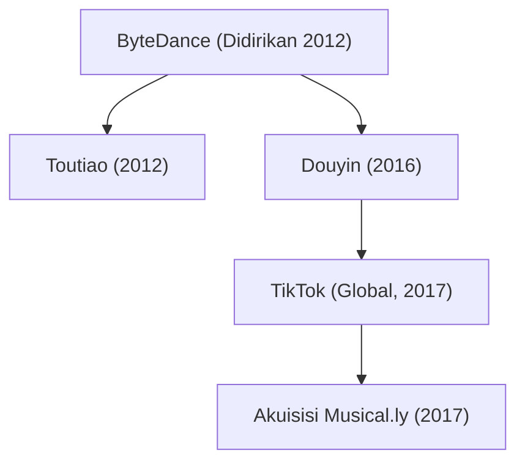

## 1. Pendahuluan: Unicorn yang Mengubah Peta Teknologi Dunia

Dalam sejarah lanskap teknologi abad ke-21, sangat sedikit perusahaan yang tumbuh dengan kecepatan, daya dobrak, dan pengaruh budaya sedahsyat ByteDance (字节跳动). Hanya dalam waktu kurang dari satu dekade, perusahaan ini bertransformasi dari sebuah startup sederhana di apartemen empat kamar di Beijing menjadi decacorn privat paling bernilai di muka bumi. Produk andalan internasionalnya, TikTok, berhasil memikat ratusan juta generasi muda di seluruh dunia dan meruntuhkan dominasi puluhan tahun raksasa Silicon Valley seperti Meta (Facebook/Instagram) dan Alphabet (Google/YouTube).

Artikel ini menyajikan ulasan menyeluruh tentang perjalanan ByteDance: mulai dari filosofi distribusi algoritmik, arsitektur organisasi internal yang unik, kelahiran Douyin dan TikTok, akuisisi cerdas Musical.ly, hingga perjuangan kerasnya di tengah badai geopolitik global.

## 2. Awal Mula Pendirian: Visi Zhang Yiming tentang Distribusi Berbasis Algoritma

Kisah ByteDance bermula pada awal tahun 2012 di Beijing melalui pemikiran seorang insinyur perangkat lunak berusia 29 tahun bernama Zhang Yiming. Lulusan rekayasa perangkat lunak dari Universitas Nankai ini telah menimba pengalaman di berbagai startup internet, termasuk mesin pencari perjalanan Kuxun dan platform microblogging awal Tiongkok, Fanfou. Dari berbagai pengalaman tersebut, Zhang sampai pada kesimpulan penting: *ledakan penggunaan smartphone akan menghancurkan cara-cara tradisional dalam mencari dan mengonsumsi informasi.*

Pada tahun 2012, penemuan konten digital bertumpu pada dua model konvensional:
1. **Model Pencarian (Pull-based)**: Pengguna secara manual mengetik kata kunci pada mesin pencari seperti Google atau Baidu.
2. **Model Relasi Sosial (Push-based)**: Pengguna membaca konten yang dibagikan oleh teman atau akun yang mereka ikuti di jejaring sosial seperti Facebook, Twitter, dan Sina Weibo.

Zhang Yiming memprakarsai paradigma ketiga yang revolusioner: **personalisasi murni berbasis machine learning tanpa ketergantungan pada grafik sosial**. Ia meyakini bahwa pengguna tidak perlu repot mencari atau memilih akun yang harus diikuti. Kecerdasan buatan harus secara otomatis mempelajari sinyal mikro dari perilaku pengguna secara real-time dan menyajikan konten yang dirancang khusus untuk memuaskan minat laten masing-masing individu.

### Kelahiran Toutiao (Today's Headlines)

Pada Agustus 2012, ByteDance meluncurkan produk pertamanya: "Jinri Toutiao" (Today's Headlines). Menariknya, platform berita ini sama sekali tidak mempekerjakan editor atau jurnalis internal. Seluruh seleksi konten dijalankan sepenuhnya oleh algoritma. Mesin ini mengikis, mengelompokkan, dan memberi skor pada jutaan artikel dari seluruh web, kemudian melatih model rekomendasinya berdasarkan data real-time: rasio klik-tayang (CTR), durasi membaca, kecepatan scroll, komentar, hingga waktu akses.

Dalam beberapa bulan, Toutiao mencatat tingkat keterlibatan pengguna yang luar biasa tinggi dan menjelma menjadi salah satu pusat informasi mobile terbesar di Tiongkok. Keberhasilan ini menghasilkan arus kas melimpah yang menjadi bahan bakar ekspansi ByteDance ke ranah video.

## 3. Manuver ke Video Pendek: Lahirnya Douyin (2016)

Menjelang tahun 2015, Zhang Yiming melihat tren besar berikutnya: konektivitas internet seluler semakin cepat dan murah, layar serta kamera smartphone kian canggih, dan minat audiens mulai bergeser drastis dari teks dan foto statis ke video vertikal yang imersif.

Pada September 2016, ByteDance meluncurkan aplikasi "A.me", yang tak lama kemudian dinamai ulang sebagai **Douyin (抖音)**. Douyin dirancang sebagai platform video vertikal berdurasi 15 detik yang mempermudah proses pembuatan konten bagi siapa saja. Aplikasi ini membekali para kreator dengan koleksi musik pop berlisensi, filter visual yang tersinkronisasi dengan ketukan lagu, dan teknologi stabilisasi video cerdas.

Douyin langsung meledak di kalangan generasi muda perkotaan Tiongkok. Berbeda dengan platform video konvensional yang mengharuskan pengguna mengeklik thumbnail video, Douyin memelopori **infinite vertical swipe feed**. Pengalaman menonton menjadi sangat mulus: begitu aplikasi dibuka, video layar penuh langsung berputar dengan audio menyala, dan beralih ke klip berikutnya hanya membutuhkan satu geseran jari tanpa jeda berpikir.

## 4. Strategi Globalisasi: Peluncuran TikTok dan Akuisisi Cerdas Musical.ly (2017)

Tidak seperti kebanyakan raksasa teknologi Tiongkok yang hanya fokus pada pasar domestik sebelum melangkah ke luar negeri, ByteDance menerapkan filosofi "Global sejak Hari Pertama". Pada Mei 2017, ByteDance meluncurkan **TikTok** sebagai kembaran internasional dari Douyin.

Namun, menumbuhkan basis pengguna di luar negeri secara organik membutuhkan waktu lama di tengah hadangan raksasa media sosial Barat. Pada November 2017, Zhang Yiming mengambil keputusan berani: ByteDance mengakuisisi **Musical.ly**, aplikasi video sinkronisasi bibir berbasis Shanghai dan California yang telah memiliki lebih dari 60 juta pengguna remaja aktif di Amerika Serikat dan Eropa, dengan nilai transaksi sekitar 1 miliar dolar AS.

Pada Agustus 2018, ByteDance melakukan langkah spektakuler: aplikasi terpisah Musical.ly resmi ditutup, dan seluruh akun, database video, serta jutaan kreatornya dilebur langsung ke dalam TikTok.

Peleburan ini langsung memberikan lonjakan basis pengguna instan bagi TikTok di pasar Barat. Dipadukan dengan investasi pemasaran masif serta algoritma rekomendasi yang sangat adiktif, TikTok menjadi aplikasi paling banyak diunduh di dunia pada tahun 2018 dan melampaui 1 miliar pengguna aktif bulanan pada 2021.

## 5. Mesin Algoritma: Parit Pertahanan Utama ByteDance

Keberhasilan ByteDance mengungguli para raksasa Silicon Valley bertumpu pada perbedaan filosofis mendasar dalam mendistribusikan konten:

- **Grafik Sosial (Meta, Twitter/X)**: Distribusi konten dibatasi oleh siapa yang Anda kenal dan siapa yang Anda ikuti. Linimasa terikat pada hubungan personal.
- **Grafik Minat / Grafik Konten (TikTok)**: Distribusi ditentukan semata-mata oleh daya tarik dan kualitas intrinsik dari konten itu sendiri. Algoritma mengevaluasi setiap video secara independen dan menyajikannya kepada audiens yang paling cocok dengan topik tersebut.

Secara matematis, probabilitas keterlibatan $P(E)$ seorang pengguna terhadap sebuah video dapat dimodelkan melalui jaringan saraf tiruan prediksi rasio klik dan durasi tonton:

$$ P(E) = \sigma(W^T X + b) $$

Di mana:
- $X$ adalah vektor fitur berdimensi tinggi yang merepresentasikan data pengguna (riwayat interaksi, tingkat penyelesaian video), data video (ritme musik, tag penglihatan komputer, representasi semantik visual), dan konteks (tipe perangkat, lokasi geografis, waktu).
- $W$ adalah matriks bobot model yang terus diperbarui secara otomatis.
- $\sigma$ adalah fungsi aktivasi (seperti sigmoid atau softmax) yang menghasilkan estimasi probabilitas keterlibatan.

Sistem kecerdasan buatan TikTok memantau reaksi pengguna dalam skala milidetik:
- Apakah pengguna sempat berhenti sejenak saat menggulir layar?
- Apakah mereka menonton video hingga selesai (completion rate)?
- Apakah video ditonton berulang kali (loop rate)?
- Pada detik ke berapa pengguna menggeser ke video berikutnya?

Mekanisme ini memungkinkan seorang kreator yang tidak memiliki pengikut sama sekali untuk menghasilkan video yang ditonton puluhan juta kali dalam semalam, asalkan kontennya memikat sekelompok kecil penonton awal.

## 6. Model Organisasi: Konsep "Pabrik Aplikasi" (Middle Platform)

Di balik kelincahan ByteDance meluncurkan produk-produk baru terdapat struktur korporat unik yang dikenal sebagai **"Pabrik Aplikasi" (Middle Platform / 中台)**. Alih-alih membentuk divisi bisnis yang terisolasi, ByteDance memusatkan tiga kekuatan intinya:
1. **Infrastruktur Algoritma & Komputasi AI Terpusat**
2. **Mesin Akuisisi Pengguna dan Pemasaran Global Terpadu**
3. **Sistem Monetisasi dan Teknologi Iklan Bersama**

Dengan arsitektur ini, tim produk yang kecil dan mandiri dapat merancang, mengembangkan, dan menguji aplikasi baru hanya dalam hitungan pekan. Apabila sebuah aplikasi baru menunjukkan traksi algoritmik yang kuat, platform pusat akan segera mengalirkan modal dan sumber daya promosi raksasa untuk memperluasnya ke skala global. Sebaliknya, jika perkembangannya lambat, proyek tersebut akan langsung dihentikan tanpa membebani organisasi.

Struktur ini memfasilitasi diversifikasi cepat ke berbagai sektor:
- **Perangkat Lunak Kolaborasi Kerja (SaaS)**: Meluncurkan "Lark" (Feishu), suite produktivitas terintegrasi yang mencakup pesan instan, dokumen kolaboratif, rapat video, dan manajemen alur kerja.
- **Social Commerce**: Menghadirkan "TikTok Shop" dan Douyin E-commerce yang menggabungkan hiburan video dengan transaksi belanja langsung di dalam aplikasi.
- **Industri Game**: Membentuk divisi "Nuverse" untuk memproduksi dan menerbitkan game berkualitas tinggi.
- **Perangkat Keras & Realitas Virtual**: Mengakuisisi produsen headset VR "Pico" pada tahun 2021 untuk memperkuat fondasi komputasi spasial masa depan.

## 7. Badai Geopolitik dan Perjuangan Mempertahankan Eksistensi

Keberhasilan internasional ByteDance yang belum pernah terjadi sebelumnya menempatkan perusahaan tepat di garis depan rivalitas teknologi antara Amerika Serikat dan Tiongkok.

Pada tahun 2020, menyusul ketegangan militer di perbatasan, pemerintah India secara mendadak memblokir TikTok bersama ratusan aplikasi asal Tiongkok lainnya, yang membuat TikTok kehilangan pasar luar negeri terbesarnya (sekitar 200 juta pengguna) dalam sekejap.

Di Amerika Serikat, muncul kekhawatiran bipartisan mengenai keamanan data pribadi dan pengaruh algoritma:
- Apakah pemerintah Tiongkok dapat meminta akses terhadap data pengguna AS berdasarkan undang-undang keamanan nasional setempat?
- Mungkinkah algoritma rekomendasi dimanipulasi secara rahasia untuk memengaruhi opini publik atau menyebarkan propaganda asing?

Guna menjawab kekhawatiran tersebut, ByteDance meluncurkan inisiatif bernilai miliaran dolar bernama **"Project Texas"**, bermitra dengan Oracle untuk menyimpan seluruh data pengguna Amerika Serikat di server cloud domestik yang diaudit secara ketat. Di Eropa, langkah serupa dilakukan melalui **"Project Clover"**.

Meskipun demikian, pada April 2024, Kongres AS mengesahkan undang-undang yang mewajibkan ByteDance untuk mendivestasi atau menjual TikTok di AS kepada pihak non-Tiongkok, atau menghadapi larangan beroperasi secara nasional. ByteDance segera mengajukan gugatan hukum ke pengadilan federal AS atas dasar pelanggaran Amandemen Pertama tentang kebebasan berekspresi, memicu pertarungan hukum bersejarah yang akan menentukan masa depan tata kelola internet global.

## 8. Kesimpulan: Masa Depan Algoritma dan Transformasi Media Global

Perjalanan ByteDance membuktikan bagaimana kecerdasan buatan dan analisis data mampu meruntuhkan monopoli korporasi teknologi mapan. Visi Zhang Yiming bahwa algoritma dapat menghubungkan manusia dengan informasi dan hiburan secara jauh lebih efisien dibandingkan jejaring sosial konvensional telah terbukti di panggung dunia.

Namun demikian, kesuksesan ByteDance juga memunculkan tantangan besar bagi peradaban modern: kecanduan dopamin algoritmik, dampak media sosial terhadap kesehatan mental generasi muda, serta ancaman fragmentasi internet global (splinternet) akibat benturan geopolitik.

Terlepas dari dinamika politik yang melingkupinya, ByteDance telah mengubah secara permanen lanskap media dan teknologi digital dunia, mencatatkan diri sebagai salah satu kisah bisnis paling berani dan menarik di era modern.
