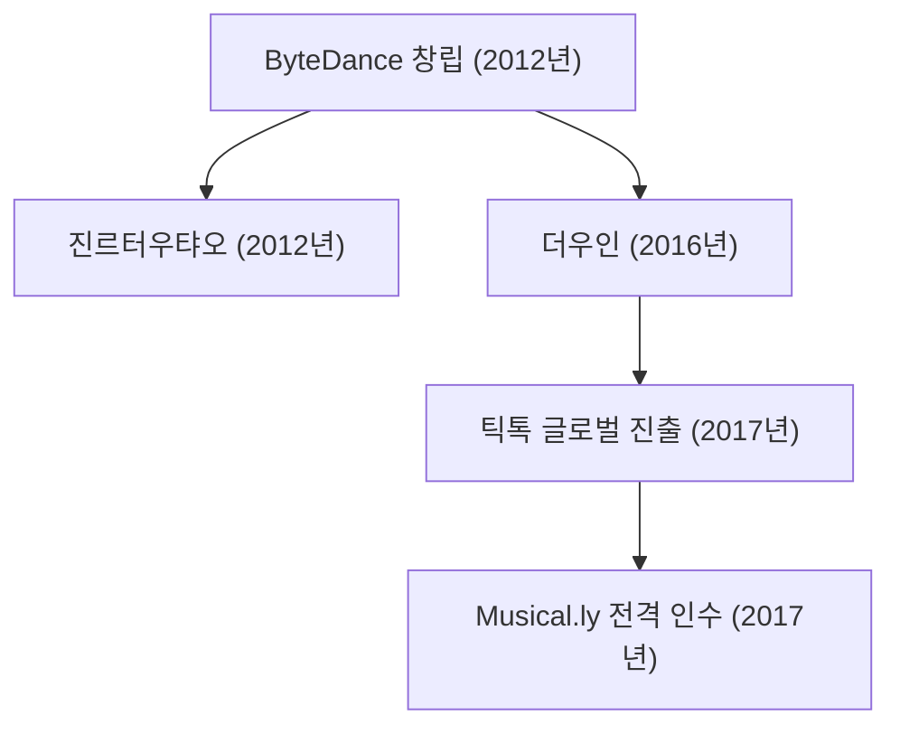

## 1. 서론: 글로벌 테크 지형도를 재편한 슈퍼 유니콘

21세기 글로벌 테크 산업에서 바이트댄스(ByteDance, 字節跳動)만큼 전광석화 같은 속도로 기존 질서를 파괴하며 성장한 기업은 찾아보기 어렵습니다. 불과 10여 년 전 베이징의 허름한 4구짜리 아파트에서 출발한 이 스타트업은 순식간에 세계에서 가장 기업 가치가 높은 비상장 데카콘으로 변모했습니다. 특히 글로벌 플래그십 서비스인 '틱톡(TikTok)'은 전 세계 Z세대를 열광시키며 메타(페이스북, 인스타그램)와 알파벳(구글, 유튜브)이 수십 년간 양분해 온 글로벌 소셜 미디어 제국을 뿌리째 뒤흔들었습니다.

본 기사에서는 바이트댄스가 어떻게 탄생하였고, 인공지능(AI) 알고리즘을 무기로 어떻게 기존 미디어를 파괴했으며, 틱톡을 통해 전 세계를 정복하고 거대한 지정학적 격랑을 돌파하고 있는지 그 내막을 심층 분석합니다.

## 2. 창업의 배경: 장이밍(Zhang Yiming)의 알고리즘 유통 비전

바이트댄스의 역사는 2012년 베이징 중관춘 인근의 작은 아파트에서 장이밍에 의해 시작되었습니다. 난카이 대학교에서 소프트웨어 공학을 전공한 장이밍은 여행 검색 사이트인 쿠쉰(Kuxun)과 마이크로블로그 판포우(Fanfou) 등 여러 스타트업을 거치며, 스마트폰의 급속한 대중화가 "인류의 정보 유통 구조를 근본적으로 뒤바꿀 것"이라는 확신을 갖게 되었습니다.

당시 전 세계 인터넷 정보 유통은 두 가지 방식에 완전히 갇혀 있었습니다:
1. **검색 모델(Pull 방식)**: 구글이나 바이두의 검색창에 사용자가 직접 키워드를 입력해 찾아내는 방식.
2. **소셜 그래프 모델(Push 방식)**: 페이스북, 트위터, 웨이보처럼 친구 관계나 팔로우 관계를 맺고 지인이 공유하는 피드를 받아보는 방식.

장이밍은 완전히 새로운 제3의 패러다임을 구상했습니다. 바로 **인간관계망(소셜 그래프)이 배제된 순수 AI 머신러닝 기반의 개인화 추천** 이었습니다. 사용자가 번거롭게 검색할 필요도, 팔로우 목록을 관리할 필요도 없이, AI가 사용자의 행동 데이터를 실시간으로 정밀 학습하여 각 개인의 잠재적 취향에 최적화된 콘텐츠를 자동으로 끝없이 배달해 주는 시대의 개막이었습니다.

### '진르터우탸오(Toutiao)'의 탄생

2012년 8월, 바이트댄스는 최초의 히트작인 뉴스 추천 앱 '진르터우탸오(今日頭條)'를 출시했습니다. 터우탸오에는 기사를 쓰는 기자가 단 한 명도 없었습니다. 모든 것은 머신러닝 알고리즘이 맡았습니다. 알고리즘은 웹상의 방대한 콘텐츠를 수집하고 태그를 붙인 뒤, 사용자의 클릭률, 스크롤 속도, 기사 체류 시간, 댓글 등의 미세 신호를 실시간 분석하여 초개인화된 맞춤형 뉴스를 배급했습니다.

터우탸오는 경이적인 사용자 몰입도를 기록하며 단숨에 수억 명의 이용자를 사로잡았고, 바이트댄스가 향후 글로벌 확장을 도모할 수 있는 막대한 현금 흐름과 독보적인 알고리즘 기술 기반을 마련해 주었습니다.

## 3. 기민한 피벗: 숏폼 영상과 '더우인(Douyin)'의 등장 (2016년)

2015년 무렵, 4G 이동통신의 보급과 스마트폰 카메라 및 디스플레이의 급격한 발전 속에서 장이밍은 다음 미디어 혁명의 파도를 감지했습니다. 텍스트와 이미지의 시대는 저물고, 직관적이고 역동적인 세로형 숏폼 동영상이 모바일 미디어의 표준이 될 것이라는 통찰이었습니다.

2016년 9월, 바이트댄스는 15초 세로형 음악 동영상 플랫폼인 **더우인(抖音, Douyin)** 을 선보였습니다. 더우인은 창작의 장벽을 대폭 낮췄습니다. 방대한 정식 음원 라이브러리, 박자에 맞춰 편집되는 템플릿, 화려한 필터 효과와 보정 기술을 통해 누구나 스마트폰 하나로 전문가 수준의 숏폼 영상을 제작할 수 있게 했습니다.

무엇보다 혁신적이었던 것은 기존 동영상 플랫폼의 썸네일 클릭 방식을 버리고 도입한 **'단일 세로 화면 즉시 재생 + 상하 스와이프'** UX였습니다. 앱을 켜는 순간 생각할 틈도 없이 전체 화면으로 영상과 음악이 쏟아져 나오고, 손가락을 위로 튕기기만 하면 다음 영상이 매끄럽게 재생되었습니다. 이 극도로 낮은 인지적 마찰력은 인간의 도파민 보상 회로를 극한으로 자극했습니다.

## 4. 글로벌 대항해: 틱톡의 출범과 뮤지컬리(Musical.ly) 인수 (2017년)

국내 시장을 완전히 장악한 뒤에야 해외로 눈을 돌리던 기존 아시아 테크 기업들과 달리, 바이트댄스는 창업 초기부터 '본 투 비 글로벌(Global from Day One)' 원칙을 견지했습니다. 2017년 5월, 더우인의 해외 쌍둥이 버전인 **틱톡(TikTok)** 이 글로벌 무대에 정식 출시되었습니다.

하지만 서구권 시장의 기성 소셜 네트워크 장벽을 자력으로 돌파하기는 쉽지 않았습니다. 이때 장이밍은 세기의 승부수를 던집니다. 2017년 11월, 상하이와 캘리포니아에 기반을 두고 미국과 유럽 10대 청소년들 사이에서 6,000만 명의 충성도 높은 이용자를 확보하고 있던 숏폼 립싱크 앱 **뮤지컬리(Musical.ly)** 를 약 10억 달러(약 1조 1천억 원)에 전격 인수한 것입니다.

2018년 8월, 바이트댄스는 뮤지컬리를 폐쇄하고 모든 사용자 계정과 데이터, 크리에이터 풀을 틱톡 단일 플랫폼으로 통합하는 과감한 마이그레이션을 단행했습니다.

이 전략적 통합은 틱톡이 서구 주류 시장으로 직행하는 로켓 엔진이 되었습니다. 바이트댄스의 과감한 글로벌 마케팅 투입과 최강의 추천 알고리즘이 결합되면서, 틱톡은 2018년 전 세계에서 가장 많이 다운로드된 앱 중 하나가 되었고, 2021년에는 월간 활성 사용자 수(MAU) 10억 명을 돌파하며 전 세계 팝 컬처의 발신지로 자리매김했습니다.

## 5. 알고리즘 혁신: 바이트댄스를 지탱하는 진정한 해자

바이트댄스가 페이스북이나 구글 같은 거인들을 제치고 소셜 미디어 시장을 재편할 수 있었던 본질적인 힘은 **'알고리즘 철학의 패러다임 전환'** 에 있습니다:

- **소셜 그래프(Social Graph, 메타/X 등)**: 인간관계 중심. 내가 누구를 팔로우하고 친구를 맺었는지가 피드를 결정하므로 유명인이나 기존 인플루언서에게 트래픽이 쏠리고 유통 효율이 정체됨.
- **인터레스트 그래프(Interest/Content Graph, 틱톡)**: 콘텐츠 자체의 흥미 중심. 관계망과 무관하게 알고리즘이 각 영상의 매력도를 독립 평가하여, 해당 주제에 반응할 확률이 가장 높은 유저에게 직접 배달함.

수학적으로 볼 때, 특정 사용자가 주어진 영상에 긍정적인 상호작용(완청, 좋아요, 댓글, 공유 등)을 보일 확률 $P(E)$는 다음과 같은 딥러닝 추천 모델로 표현될 수 있습니다:

$$ P(E) = \sigma(W^T X + b) $$

여기서:
- $X$는 사용자의 이전 행동 이력, 영상의 멀티모달 특성(오디오 리듬, 컴퓨터 비전 태그, 텍스트), 그리고 환경적 맥락(시간대, 네트워크 등)을 포괄하는 초고차원 벡터입니다.
- $W$는 방대한 병렬 데이터를 통해 실시간 학습되는 가중치 행렬입니다.
- $\sigma$는 상호작용 확률을 산출하는 활성화 함수(Sigmoid 등)입니다.

틱톡의 AI 엔진은 단순한 좋아요 클릭을 넘어 밀리초 단위의 미세 행동 신호를 실시간 추적합니다:
- 화면을 넘기려다 손가락을 멈칫했는가?
- 영상을 끝까지 시청했는가(완청률)?
- 영상을 몇 번이나 반복 재생(루프)했는가?
- 스킵하기까지 몇 초가 걸렸는가?

이 정밀하고 즉각적인 피드백 루프 덕분에, 팔로워가 단 1명도 없는 신규 크리에이터라 할지라도 영상이 재미있기만 하면 하룻밤 사이에 수천만 뷰를 기록하는 '바이럴의 민주화'가 실현되었습니다.

## 6. 조직 체계의 비밀: '앱 팩토리(대중태)' 모델

바이트댄스의 가공할 만한 제품 출시 속도는 **'앱 팩토리(App Factory, 대중태)'** 라는 독특한 조직 구조에서 비롯됩니다. 사업부별로 인프라가 쪼개져 있는 전통 기업과 달리, 바이트댄스는 회사의 핵심 역량을 3대 공용 중앙 조직(중태)에 집중시켰습니다:
1. **공통 AI 알고리즘 기술 엔진**
2. **중앙 집중형 유저 그로스(Growth) 및 트래픽 운영팀**
3. **통합 광고 테크 및 수익화 시스템**

이 강력한 중태 위에서 가벼운 소규모 프로젝트 팀들이 몇 주 만에 새로운 앱을 개발하고 시장에 테스트합니다. 지표가 터지면 중태의 자본과 트래픽을 쏟아부어 전 세계로 스케일업하고, 실패하면 즉시 정리하여 매몰비용을 최소화하는 산업화된 실험 체계입니다.

이 구조를 바탕으로 바이트댄스는 다각적인 사업 확장을 전개해 왔습니다:
- **엔터프라이즈 협업(SaaS)**: 메신저, 화상회의, 클라우드 문서를 결합한 올인원 협업 툴 '라크(Lark / 飛書)' 서비스 전개.
- **소셜 커머스**: 영상 시청과 쇼핑을 매끄럽게 연결한 '틱톡 샵(TikTok Shop)'을 론칭하여 동남아 및 영미권 이커머스 시장에서 폭발적 성장 견인.
- **게임 사업**: '뉴버스(Nuverse)' 브랜드를 설립하여 모바일 게임 시장 진출 및 전략적 재편 단행.
- **메타버스 및 하드웨어**: 2021년 VR 헤드셋 제조사 피코(Pico)를 인수하여 차세대 공간 컴퓨팅 디바이스 영역 확보.

## 7. 거센 역풍과 지정학적 생존 투쟁

그러나 틱톡의 눈부신 글로벌 성공은 바이트댄스를 21세기 미·중 패권 경쟁의 한복판이라는 거대한 지정학적 소용돌이로 몰아넣었습니다.

2020년 국경 분쟁 이후 인도 정부가 국가 안보를 이유로 틱톡을 전격 금지하면서, 당시 2억 명에 달하던 세계 최대의 단일 시장을 하룻밤 사이에 잃었습니다.

이어 미국에서도 국가 안보와 데이터 프라이버시를 둘러싼 초당적 우려가 거세게 일어났습니다:
- 중국 정부가 안보 법령을 근거로 미국인 사용자 데이터에 접근할 수 있는가?
- 추천 알고리즘을 조작하여 여론을 왜곡하거나 프로파간다를 확산시킬 수 있는가?

이에 대응하여 바이트댄스는 오라클(Oracle)과 협력하여 미국 사용자 데이터를 미국 내 서버에 전량 격리 보관하고 제3자 감사를 받는 수조 원 규모의 **'프로젝트 텍사스(Project Texas)'** 를 추진했습니다. 유럽에서도 유사한 데이터 보호 프로젝트인 **'프로젝트 클로버(Project Clover)'** 를 가동했습니다.

하지만 미국 의회의 전방위적 압박 끝에 2024년 4월, 틱톡의 미국 사업권을 비(非)중국계 기업에 강제 매각하지 않을 경우 전면 퇴출하는 이른바 '틱톡 금지법'이 통과되었습니다. 이에 바이트댄스는 미국 헌법 제1조(표현의 자유) 침해를 이유로 연방 법원에 소송을 제기하며 회사의 명운을 건 법적·외교적 공방을 이어가고 있습니다.

## 8. 맺음말: 알고리즘의 미래와 인류 사회의 과제

바이트댄스의 여정은 순수한 기술 혁신(특히 AI 추천 알고리즘)과 압도적인 제품 경쟁력이 결합되었을 때, 얼마나 빠른 속도로 국가와 문화, 언어의 장벽을 허물고 전 인류를 매혹시킬 수 있는지를 입증했습니다. "적절한 정보를 적절한 사람에게 전달한다"는 장이밍의 창업 비전은 전 세계적인 현실이 되었습니다.

그러나 플랫폼이 수십억 명의 일상을 지배하게 된 지금, 국가 안보, 데이터 주권, 알고리즘 중독과 청소년 정신 건강이라는 무거운 사회적 책임은 바이트댄스가 반드시 풀어내야 할 세기의 숙제입니다.

틱톡이 앞으로도 글로벌 팝 컬처와 디지털 경제의 심장으로 남을 것인지, 아니면 지정학적 분열 속에서 파편화될 것인지, 바이트댄스의 다음 행보는 21세기 테크놀로지와 인류 사회의 관계를 규정하는 가장 결정적인 시금석이 될 것입니다.
