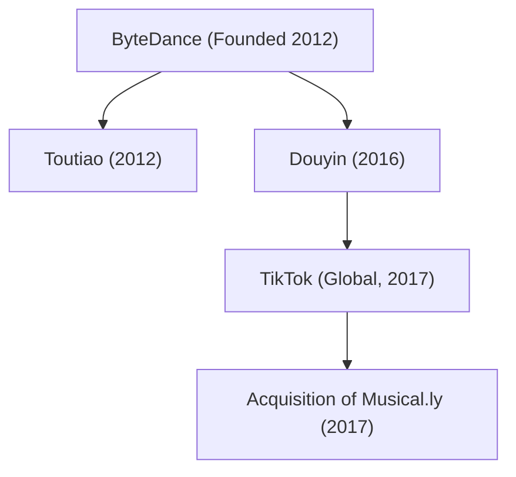

## 1. はじめに：世界を塗り替えたユニコーン企業

21世紀のテクノロジー業界において、最も劇的かつ急速に成長を遂げた企業のひとつが「ByteDance（バイトダンス、字節跳動）」です。わずか数年のうちに、同社は中国のローカルなスタートアップから、世界で最も価値のある未上場企業（ユニコーン企業）へと変貌を遂げました。特にその象徴とも言えるショート動画アプリ「TikTok（ティックトック）」は、Z世代を中心に爆発的な人気を博し、FacebookやGoogle（YouTube）といったシリコンバレーの巨人が支配してきた世界のソーシャルメディア勢力図を完全に塗り替えました。

本記事では、ByteDanceがどのようにして誕生し、いかにしてAI（人工知能）を武器に成長し、そしてTikTokを通じて世界を席巻するに至ったのか、その歴史と戦略を非常に詳細に紐解いていきます。

## 2. 創業の背景：張一鳴（Zhang Yiming）のビジョン

ByteDanceの物語は、2012年に北京で張一鳴（Zhang Yiming）によって始まりました。南開大学でソフトウェアエンジニアリングを学んだ張一鳴は、いくつかのスタートアップでの経験（旅行検索サイトKuxunや、マイクロブログのFanfouなど）を経て、スマートフォンの普及に伴い「情報の流通構造が根本的に変わる」という確信を抱きました。

当時の情報収集は、Baidu（百度）やGoogleのような検索エンジンで自ら検索するか、Sina Weibo（新浪微博）やFacebook、Twitterなどのソーシャルメディアで友人から流れてくる情報を受け取るのが主流でした。しかし、張一鳴は「ユーザーが自ら探さなくても、AIがユーザーの行動や好みを学習し、最適な情報を自動的に推薦する」という新しいパラダイムを構想しました。検索（プル型）でもソーシャル（共有型）でもない、純粋な「AIによるパーソナライズドリコメンド」の時代の幕開けです。

### 「今日頭条（Toutiao）」の誕生

2012年8月、ByteDanceはニュース推薦アプリ「今日頭条（Toutiao、トウティャオ）」をリリースしました。このアプリは、ユーザーの閲覧履歴、スクロールの速度、記事の滞在時間、クリックした箇所などのデータをAIがリアルタイムで解析し、ユーザー一人ひとりにパーソナライズされたニュースフィードを提供するものでした。

Toutiaoは瞬く間に中国国内で大ヒットし、数億人の月間アクティブユーザーを獲得しました。この成功により、ByteDanceは「優れたコンテンツ推薦アルゴリズムこそが最強の競争力になる」ということを証明したのです。Toutiaoの成功は、ByteDanceにとって豊富な資金をもたらしただけでなく、のちのプロダクトを支える強力な機械学習インフラを構築する土台となりました。

## 3. ショート動画時代への適応と「Douyin」の誕生

Toutiaoでテキストと画像のキュレーションにおいて大成功を収めた後、ByteDanceは次なる巨大な波として「ショート動画」に目をつけました。スマートフォンの通信速度が飛躍的に向上し（4Gの普及）、データ通信料が安価になったことで、人々が動画コンテンツをモバイル環境で気軽に消費できるようになっていたためです。

2016年9月、ByteDanceは中国国内向けにショート動画アプリ「抖音（Douyin、ドウイン）」をローンチしました。Douyinは、15秒ほどの短い動画に音楽を乗せ、フィルターやエフェクトを駆使して誰でも簡単にクリエイティブな動画を作成できるプラットフォームでした。当時、すでにKuaishou（快手）などの競合が存在していましたが、Douyinは特に都市部の若者（Gen Z）をターゲットにし、洗練されたUIと高品質なエフェクトを提供することで差別化を図りました。

Douyinの最大の特徴もまた、Toutiaoで培った強力なレコメンデーションエンジンでした。ユーザーがアプリを開くとすぐに、AIが厳選した動画がフルスクリーンで再生されます（For Youフィード）。スワイプするだけで次々と興味深い動画が現れるこの仕組みは、ユーザーのエンゲージメントを極限まで高め、極めて高い中毒性をもたらしました。Douyinはローンチからわずか1年足らずで1億人のユーザーを獲得し、瞬く間に中国国内のショート動画市場の覇権を握りました。

## 4. グローバル展開：TikTokの誕生とMusical.lyの買収

Douyinの成功を確信したByteDanceは、すぐさま世界市場への進出に乗り出します。2017年、Douyinのグローバル版として「TikTok」がローンチされました。中国企業が開発したコンシューマー向けアプリが、そのまま世界で通用するかどうかは未知数でしたが、張一鳴はグローバル市場での成功を企業の最重要課題と位置づけていました。

しかし、真のブレイクスルーをもたらしたのは、2017年11月の戦略的買収でした。ByteDanceは、アメリカやヨーロッパのティーンエイジャーの間で絶大な人気を誇っていたリップシンク（口パク）動画アプリ「Musical.ly（ミュージカリー）」を約10億ドルという巨額の資金で買収したのです。Musical.lyはすでに数千万人のユーザーベースを持っており、アメリカ市場を開拓する上での「特急券」となりました。

2018年8月、ByteDanceはMusical.lyのブランドとユーザーベースをTikTokに完全に統合しました。これにより、TikTokは一夜にして欧米市場で強固な足場を築くことに成功しました。その後、莫大な広告費を投じてFacebookやInstagram、SnapchatなどでTikTokのインストール広告を展開し、ユーザー数を爆発的に伸ばしていきました。

TikTokの成長は凄まじく、2018年には世界で最もダウンロードされたアプリの1つとなり、2021年には月間アクティブユーザー数が10億人を突破しました。ユーザーが投稿するダンス動画、コメディ、DIY、教育コンテンツなど、あらゆるジャンルの動画が言語や国境を越えて拡散されるプラットフォームとなったのです。

## 5. アルゴリズム：ByteDanceの真の強み

ByteDanceがFacebookやGoogleといった強大な競合を出し抜くことができた最大の理由は、その根幹にある「アルゴリズムの思想」の違いにあります。

FacebookやInstagram、Twitter（現X）などの従来のプラットフォームは「ソーシャルグラフ（人間関係）」に基づいてコンテンツを配信します。つまり、誰をフォローしているか、誰と友達であるかがフィードを構成する最も重要な要素です。一方、TikTokは「コンテンツグラフ（インタレストグラフ、興味・関心）」に基づいています。ユーザーが誰もフォローしていなくても、AIが動画の属性（音声、画像、テキスト、タグ）とユーザーの行動データを照らし合わせ、瞬時に最適なコンテンツを提示します。

数式で表すと、ユーザーが特定の動画に対してエンゲージメント（いいね、コメント、シェア、最後まで視聴するなど）を示す確率は、以下のような機械学習モデルとして概念化されます。

$$ P(E) = \sigma(W^T X + b) $$

ここで、$X$は「ユーザーの特徴量（過去の行動履歴など）」、「動画の特徴量（カテゴリー、BGM、映っている物体など）」、「コンテキスト（アクセスしている時間帯やデバイスなど）」を含む高次元のベクトルです。$W$はAIが膨大なデータから学習した重み付けパラメータの行列であり、$\sigma$はシグモイド関数のような確率値を出力する活性化関数を表します。

TikTokのアルゴリズムは、ユーザーが画面で指を止めた一瞬の躊躇や、動画をループ再生した回数、スキップするまでの秒数など、微細なシグナルを驚異的な速度で学習し、$P(E)$を最大化するように「おすすめ（For You）」フィードを最適化し続けます。これにより、フォロワーがゼロの無名のクリエイターであっても、コンテンツさえ面白ければ一夜にして数百万回の再生回数を叩き出すことが可能となり、「バイラル」の民主化をもたらしました。

## 6. 多角化戦略と「App Factory」モデル

ByteDanceは「App Factory（アプリ工場）」とも呼ばれる独特の組織体制を持っています。強固なAIテクノロジー基盤と中核的なユーザー成長（グロース）エンジン、そしてマネタイズのインフラを中央組織（中台）に集約し、その上に多数の小規模なプロダクトチームが乗って、新しいアプリを次々と迅速に開発・テストする手法です。これにより、新しいアイデアを市場に投入するスピードが他社よりも圧倒的に速くなっています。

ショート動画の圧倒的な成功に甘んじることなく、ByteDanceは様々な領域に進出しています。

- **エンタープライズ（SaaS）**: 社内コラボレーションツール「Lark（飛書、Feishu）」を展開。チャット、ドキュメント、カレンダー、ビデオ会議を統合し、企業の生産性向上を支援しています。
- **Eコマース**: 「TikTok Shop（および中国国内のDouyin E-commerce）」を立ち上げ、動画を見ながら直接商品を購入できるライブコマース・ソーシャルコマースを強力に推進しています。東南アジア市場では特に大きな成功を収めており、欧米市場にも展開を拡大しています。
- **ゲーム**: 「Nuverse」ブランドを立ち上げ、モバイルゲーム市場に参入。ただし、近年はリソースの最適化を図るため、一部事業を縮小・再編する動きも見られます。
- **ハードウェア（VR/AR）**: 2021年にVRヘッドセットメーカーの「Pico」を買収し、次世代コンピューティングプラットフォームやメタバース領域への布石を打っています。

## 7. 逆風と地政学的課題

しかし、ByteDanceのグローバルな成功は、かつてない規模の地政学的な逆風も引き起こしました。テクノロジー覇権を巡る米中対立の最前線に立たされることになったのです。

2020年、インド政府は中国との国境紛争を背景に、国家安全保障上の理由からTikTokを含む数十の中国製アプリの使用を禁止にしました。これにより、TikTokは当時最大のユーザーベース（約2億人）を抱えていた巨大市場を一夜にして失いました。

さらにアメリカにおいても、トランプ政権時代から「中国政府がTikTokのアメリカ人ユーザーのデータにアクセスできるのではないか」「アルゴリズムを通じて世論を操作したり、プロパガンダを拡散したりできるのではないか」という安全保障上の強い懸念が主張されました。これに対しByteDanceは、アメリカのユーザーデータを米国内のOracleのサーバーに保存し、外国からのデータアクセス権を厳格に制限する「Project Texas（プロジェクト・テキサス）」を立ち上げるなど、巨額の投資を行って懸念の払拭に努めています。同様の取り組みはヨーロッパでも「Project Clover」として進行しています。

しかし、バイデン政権下でも議会での厳しい追及は続いており、2024年にはTikTokのアメリカ事業を非中国企業に売却しなければ全米でアプリの配信を禁止する法案が可決されました。ByteDanceはこの法律を違憲として提訴しており、法廷闘争を含めて米国市場での生き残りをかけた激しい攻防が現在も続いています。

## 8. おわりに：未来に向けたテクノロジーと社会の課題

ByteDanceの歴史は、優れたテクノロジー（特にAIによるレコメンデーションアルゴリズム）と完璧なプロダクトマーケットフィットが、国境や文化、言語の壁を越えて世界中の人々を短期間で魅了できることを証明しました。張一鳴が描いた「適切な情報を適切な人に繋ぐ」というビジョンは、テキストニュースからショート動画へと形を変えながら、地球規模で実現されました。

一方で、巨大になりすぎたデータプラットフォームが直面する国家の安全保障、データプライバシー、そして若年層への精神的影響（デジタルウェルビーイング）の問題は、ByteDanceにとって避けては通れない最大の試練となっています。

TikTokが今後も世界のポップカルチャーとデジタルエコノミーの中心であり続けるのか、それとも地政学的な波に飲まれてサービスが分断・売却されていくのか。ByteDanceの次なる一手と、テクノロジー企業と国家・社会との関わり方は、これからのテック業界全体の未来を占う上で最も重要な試金石となるでしょう。その進化と葛藤の過程は、現代の企業史において間違いなく最もエキサイティングで、かつ複雑なチャプターの1つとして語り継がれるはずです。
