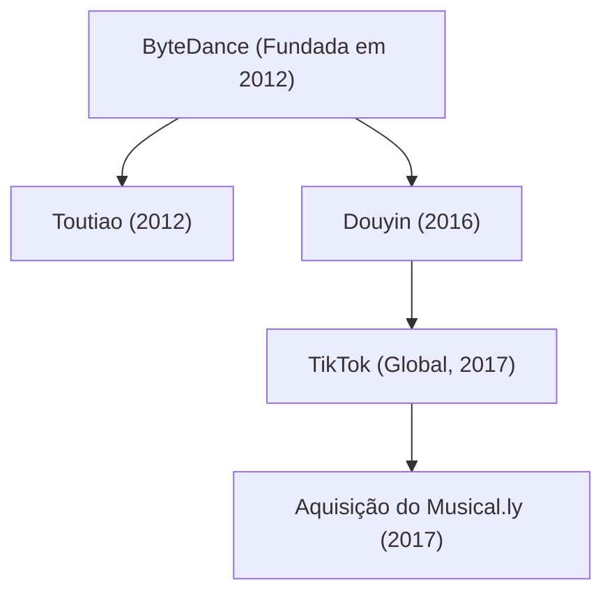

## 1. Introdução: O unicórnio que redefiniu o cenário tecnológico global

Na história da tecnologia do século XXI, pouquíssimas companhias expandiram-se com a velocidade estonteante, a força disruptiva e o impacto cultural da ByteDance (字节跳动). Em menos de dez anos, a empresa saltou de uma modesta startup sediada em um apartamento residencial em Pequim para se tornar o decacórnio de capital fechado mais valioso do planeta. Seu principal produto internacional, o TikTok, conquistou centenas de milhões de usuários das gerações Z e millennial, quebrando a hegemonia histórica de colossos do Vale do Silício como Meta (Facebook/Instagram) e Alphabet (Google/YouTube).

Este artigo analisa em detalhes a trajetória da ByteDance: desde seus alicerces algorítmicos e sua engenhosa estrutura organizacional até a ascensão do Douyin e do TikTok, a compra estratégica do Musical.ly e seus embates em meio às tensões geopolíticas mundiais.

## 2. A gênese: A visão de Zhang Yiming sobre a distribuição algorítmica

A saga da ByteDance teve início no início de 2012 em Pequim, idealizada pelo engenheiro de software Zhang Yiming, então com 29 anos e formado pela Universidade de Nankai. Após participar de diversas startups pioneiras da internet chinesa (como o portal de viagens Kuxun e a rede Fanfou), Zhang alcançou uma convicção visionária: *a popularização dos smartphones transformaria radicalmente a maneira como a humanidade consome informações.*

Em 2012, o acesso aos conteúdos digitais estava aprisionado em dois formatos hegemônicos:
1. **Busca ativa (modelo Pull)**: O internauta digita palavras-chave em mecanismos como Google ou Baidu.
2. **Rede social de relacionamentos (modelo Push)**: O usuário consome publicações compartilhadas por amigos e contas seguidas no Facebook, Twitter ou Weibo.

Zhang concebeu uma terceira via revolucionária: **personalização algorítmica pura sem a dependência de um grafo social**. Para ele, as pessoas não precisavam buscar nem gerenciar listas de amigos; algoritmos de aprendizado de máquina podiam analisar os comportamentos dos usuários em tempo real para entregar continuamente conteúdos perfeitamente alinhados aos seus interesses ocultos.

### O nascimento do Toutiao (Manchetes de Hoje)

Em agosto de 2012, a ByteDance lançou seu primeiro grande produto: o «Jinri Toutiao» (Manchetes de Hoje). Sem empregar jornalistas ou equipes editoriais clássicas, o Toutiao apoiava-se inteiramente no machine learning. O sistema varria e indexava conteúdos da web, treinando suas redes neurais com base em microindicadores em tempo real: taxa de cliques, tempo de leitura, velocidade de rolagem, comentários e localização.

Rapidamente, o Toutiao atingiu métricas de engajamento surpreendentes, transformando-se em um dos aplicativos de notícias mais lucrativos da China e gerando os recursos financeiros necessários para financiar as investidas seguintes da empresa.

## 3. A grande guinada: O salto para os vídeos curtos e o Douyin (2016)

Por volta de 2015, com a expansão da internet móvel 4G e a evolução das telas e câmeras dos smartphones, Zhang Yiming anteviu o próximo salto midiático: os formatos de texto e imagem estavam atingindo o teto, e o futuro pertenceria aos vídeos curtos verticais em tela cheia.

Em setembro de 2016, a ByteDance lançou o aplicativo A.me, rebatizado pouco depois como **Douyin (抖音)**. O Douyin foi projetado como uma plataforma ágil de clipes musicais de 15 segundos que eliminava as barreiras técnicas de produção: disponibilizava vasta biblioteca musical licenciada, efeitos visuais sincronizados com as batidas sonoras e algoritmos avançados de estabilização de imagem.

O Douyin reinventou o comportamento dos internautas. Rompendo com as páginas convencionais em que o usuário precisava clicar em miniaturas, a plataforma lançou o conceito do **feed vertical infinito com reprodução instantânea em tela cheia**. Ao abrir o aplicativo, o fluxo de vídeo e áudio começa de imediato; basta deslizar o polegar para cima para acessar a próxima recomendação sem nenhum esforço mental, maximizando a liberação de dopamina.

## 4. Rumo ao mercado global: O lançamento do TikTok e a compra do Musical.ly (2017)

Ao contrário da maioria das empresas asiáticas, que aguardavam dominar o mercado interno para depois buscar outros países, a ByteDance nasceu com a mentalidade «Global from Day One». Em maio de 2017, colocou no ar o **TikTok**, versão internacional do Douyin.

Entretanto, a atração orgânica de usuários no Ocidente era lenta diante da presença de gigantes estabelecidos. Foi então que Zhang Yiming fez um movimento arrojado: em novembro de 2017, a ByteDance adquiriu por aproximadamente US$ 1 bilhão o **Musical.ly**, aplicativo de dublagem musical criado em Xangai e na Califórnia que já reunia 60 milhões de adolescentes ativos nos Estados Unidos e na Europa.

Em agosto de 2018, a ByteDance concluiu uma manobra brilhante: encerrou a marca Musical.ly e integrou todas as contas, vídeos e criadores diretamente na base do TikTok.

A unificação garantiu ao TikTok a massa crítica necessária nos principais mercados ocidentais. Impulsionado por pesados investimentos em marketing e pelo algoritmo de recomendação mais refinado do mundo, o TikTok tornou-se em 2018 o aplicativo mais baixado do planeta e ultrapassou a marca de 1 bilhão de usuários ativos mensais em 2021, transformando-se no epicentro da cultura pop mundial.

## 5. O poder do algoritmo: O grande diferencial da ByteDance

A razão pela qual a ByteDance surpreendeu pioneiros como Meta e Google reside em uma **transformação radical na filosofia do algoritmo**:

- **Grafo Social (Meta, Twitter/X)**: O alcance depende das conexões de amizade e seguidores. As publicações ficam limitadas à rede de contatos existente.
- **Grafo de Conteúdo / Interesses (TikTok)**: A distribuição desvincula-se dos laços sociais. O algoritmo julga cada vídeo por sua atratividade individual e o entrega aos perfis com maior afinidade por aquele assunto.

Em termos matemáticos, a probabilidade $P(E)$ de um usuário engajar positivamente com um determinado vídeo (assistir até o fim, curtir, comentar ou compartilhar) é estimada por modelos neurais profundos:

$$ P(E) = \sigma(W^T X + b) $$

Onde:
- $X$ é um vetor multidimensional que reúne características do usuário (hábitos de consumo, taxa de retenção por tema), do vídeo (ritmo musical, elementos visuais identificados) e contextuais (aparelho, horário e rede).
- $W$ é a matriz de pesos calibrada continuamente pelo processamento de big data.
- $\sigma$ representa a função de ativação que gera a probabilidade estimada.

O motor do TikTok não registra apenas curtidas, mas capta micropadrões de comportamento em milissegundos:
- O dedo do usuário hesitou antes de rolar a tela?
- O vídeo foi assistido até o último segundo (taxa de conclusão)?
- Foi reproduzido em repetição contínua (loop)?
- Quantos segundos decorreram antes do descarte?

Essa retroalimentação instantânea permite que um criador totalmente anônimo, sem nenhum seguidor, alcance dezenas de milhões de visualizações caso seu vídeo prenda a atenção das pessoas, democratizando de fato a viralidade digital.

## 6. Estrutura corporativa: A inovação da "Fábrica de Aplicativos"

A velocidade espantosa com que a ByteDance lança novos serviços decorre de sua estrutura organizacional integrada, conhecida como a **"Fábrica de Apps" (Middle Platform / 中台)**. Em vez de criar divisões operacionais isoladas para cada aplicativo, a empresa centraliza suas três principais capacidades em uma plataforma unificada:
1. **Infraestrutura técnica e algorítmica compartilhada**
2. **Equipe centralizada de crescimento de usuários e tráfego**
3. **Plataforma unificada de monetização e tecnologia de anúncios**

Nesse modelo, equipes enxutas conseguem desenvolver e testar novos produtos em questão de semanas. Se o aplicativo demonstrar tração e boa retenção, a estrutura central injeta recursos maciços para escalá-lo mundialmente; se falhar, o projeto é descontinuado sem comprometer os demais departamentos.

Esse arranjo sustentou uma diversificação vigorosa:
- **Software corporativo (SaaS)**: Lançamento do «Lark» (Feishu), suíte de produtividade que reúne chat, videoconferências e documentos colaborativos.
- **Comércio eletrônico social**: Lançamento do «TikTok Shop», unindo vídeos e compras imediatas no aplicativo, alcançando grande sucesso no Sudeste Asiático e expansão no mercado norte-americano.
- **Jogos eletrônicos**: Criação do selo «Nuverse» para publicação de jogos móveis.
- **Realidade virtual**: Compra em 2021 da fabricante de óculos de realidade virtual Pico, garantindo presença na computação espacial.

## 7. Desafios geopolíticos e confrontos regulatórios

O estrondoso sucesso internacional do TikTok colocou a ByteDance no centro da disputa tecnológica e comercial entre Estados Unidos e China.

Em 2020, na esteira de conflitos de fronteira, o governo da Índia baniu sumariamente o TikTok e dezenas de aplicativos de desenvolvedores chineses por razões de segurança nacional, eliminando de um dia para o outro o maior mercado consumidor externo da plataforma (cerca de 200 milhões de usuários).

Paralelamente, cresceram nos Estados Unidos as preocupações em torno da privacidade dos dados:
- O receio de que legislações de segurança chinesas pudessem forçar o repasse de dados de cidadãos norte-americanos.
- O temor do uso do algoritmo para influenciar a opinião pública ou difundir desinformação.

Em resposta, a ByteDance investiu bilhões de dólares no **«Project Texas»** nos EUA, alocando os dados de usuários locais em servidores da Oracle sob auditorias independentes rigorosas. Na Europa, estruturou uma iniciativa similar chamada **«Project Clover»**.

Apesar desses esforços, o Congresso dos EUA aprovou em abril de 2024 uma legislação exigindo que a ByteDance venda as operações do TikTok no país a uma entidade não estrangeira adversária, sob pena de bloqueio nacional definitivo. A ByteDance contestou a medida na Justiça Federal com base na Primeira Emenda constitucional, iniciando um julgamento histórico para o futuro da internet aberta.

## 8. Conclusão: O futuro da inteligência artificial e a sociedade contemporânea

A trajetória da ByteDance comprova como a inovação algorítmica associada à excelência de produto pode quebrar monopólios estabelecidos e cruzar barreiras culturais em tempo recorde. A aspiração de Zhang Yiming de conectar pessoas a conteúdos relevantes concretizou-se em escala planetária.

Ao mesmo tempo, ao atingir bilhões de pessoas diariamente, a plataforma defronta-se com discussões complexas sobre soberania digital, privacidade, impactos na juventude e fragmentação geopolítica da rede mundial.

Independentemente do desfecho das disputas regulatórias, a ByteDance já transformou para sempre a arquitetura da mídia contemporânea. Sua história permanecerá como um dos capítulos mais marcantes e arrojados da era digital.
