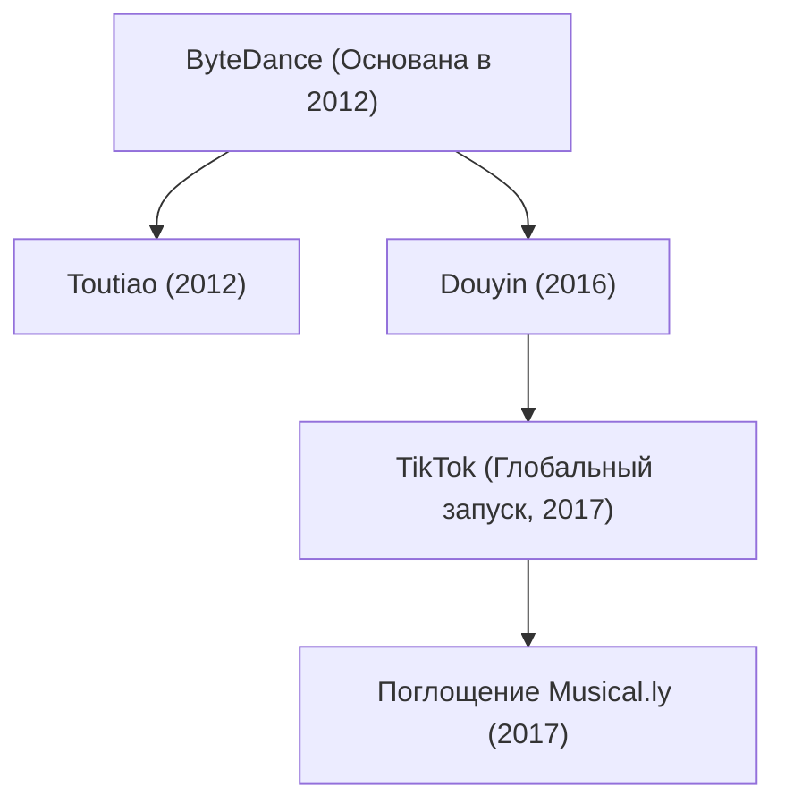

## 1. Введение: Единорог, переписавший правила глобальных технологий

В истории технологической индустрии XXI века едва ли найдутся примеры компаний, чья экспансия была бы столь стремительной, разрушительной и культурно всеобъемлющей, как восхождение ByteDance (字节跳动). Менее чем за десятилетие этот скромный пекинский стартап из четырехкомнатной квартиры превратился в самую дорогую частную технологическую компанию в мире. Ее флагманский международный продукт — TikTok — покорил сотни миллионов молодых пользователей по всей планете, сокрушив многолетнюю гегемонию гигантов Кремниевой долины, таких как Meta (Facebook/Instagram) и Alphabet (Google/YouTube).

В этой статье представлен детальный стратегический и технологический разбор пути ByteDance: от зарождения алгоритмической философии и уникальной внутренней архитектуры компании до триумфального взлета Douyin и TikTok, дерзкого поглощения Musical.ly и выживания в эпицентре геополитических противостояний сверхдержав.

## 2. Истоки основания: Видение Чжан Имина и алгоритмическая дистрибуция

История ByteDance началась в начале 2012 года в Пекине. Во главе проекта стоял 29-летний инженер-программист Чжан Имин. Выпускник факультета программной инженерии Нанькайского университета, Чжан уже успел накопить солидный опыт, работая в таких интернет-проектах, как туристический поисковик Kuxun и ранняя платформа микроблогов Fanfou. На основе этих экспериментов Чжан пришел к фундаментальному выводу: *революция смартфонов полностью разрушит классические модели поиска и потребления информации.*

К 2012 году цифровая дистрибуция контента держалась на двух доминирующих парадигмах:
1. **Поисковая модель (Pull-based)**: Пользователи вручную вводили поисковые запросы в поисковиках вроде Google или Baidu.
2. **Социальная модель (Push-based)**: Пользователи читали ленты новостей, формируемые их друзьями и подписками в соцсетях вроде Facebook, Twitter и Sina Weibo.

Чжан Имин предложил радикальную третью парадигму: **персонализацию на основе чистого машинного обучения без социального графа**. Он утверждал, что пользователю не нужно самостоятельно искать контент или кропотливо выстраивать списки контактов. Искусственный интеллект должен непрерывно анализировать поведенческие микросигналы пользователя и выдавать идеально персонализированный контент под его скрытые интересы.

### Рождение Toutiao («Сегодняшние заголовки»)

В августе 2012 года ByteDance выпустила свой первый флагманский продукт — информационное приложение «Jinri Toutiao» (Сегодняшние заголовки). В компании принципиально не было редакции журналистов: отбор и компоновка новостей полностью возлагались на нейросетевые алгоритмы. Система сканировала, классифицировала и ранжировала миллионы статей из интернета, обучаясь на действиях пользователя: кликабельности (CTR), времени чтения, скорости прокрутки, комментариях и даже времени суток.

За считанные месяцы Toutiao показал феноменальные метрики удержания аудитории, превратившись в крупнейший мобильный новостной агрегатор Китая и сформировав колоссальный денежный поток, позволивший ByteDance финансировать дальнейшую экспансию.

## 3. Поворот к короткому видео: Рождение Douyin (2016)

К 2015 году Чжан Имин осознал неизбежность следующего тектонического сдвига: мобильный интернет становился все быстрее и дешевле, дисплеи и камеры смартфонов стремительно прогрессировали, а внимание аудитории перетекало от текста и статических фотографий к вертикальному видеоконтенту.

В сентябре 2016 года ByteDance запустила приложение «A.me», вскоре переименованное в **Douyin (抖音)**. Douyin создавался как ультраинтуитивный сервис для публикации 15-секундных вертикальных видеороликов, радикально снизивший порог входа для авторов. Платформа предоставила создателям огромную библиотеку лицензионной поп-музыки, спецэффекты с синхронизацией по ритму и инструменты интеллектуальной стабилизации видео.

Douyin мгновенно завоевал городскую молодежь Китая. В отличие от традиционных видеохостингов, где пользователю требовалось кликать по превью, Douyin внедрил **бесконечную вертикальную ленту свайпов**. Потребление контента стало абсолютно непрерывным: сразу после открытия приложения на экране разворачивалось полноэкранное видео со звуком, а переход к следующему клипу требовал нулевых когнитивных усилий.

## 4. Стратегия глобализации: Запуск TikTok и триумф с Musical.ly (2017)

В отличие от многих китайских корпораций, начинавших международную экспансию лишь после полного насыщения домашнего рынка, ByteDance с самого основания исповедовала философию «Глобальность с первого дня». В мае 2017 года компания запустила международную версию Douyin — **TikTok**.

Однако органический рост за рубежом на первых порах сталкивался с жестким сопротивлением западных соцсетей. В ноябре 2017 года Чжан Имин совершил решающий стратегический шаг: ByteDance приобрела за 1 миллиард долларов сервис **Musical.ly** — шанхайско-калифорнийское приложение для синхронизации губ под музыку, обладавшее преданной аудиторией в 60 миллионов американских и европейских подростков.

В августе 2018 года ByteDance провела беспрецедентную операцию: отдельное приложение Musical.ly было полностью закрыто, а все профили, видеоархивы и миллионы авторов были в один день перенесены в TikTok.

Это мгновенно обеспечило TikTok критическую массу пользователей на ключевых западных рынках. Подкрепленный колоссальными маркетинговыми инвестициями и непревзойденными алгоритмами рекомендаций, TikTok стал самым скачиваемым приложением в мире в 2018 году, а к 2021 году преодолел рубеж в 1 миллиард активных пользователей в месяц.

## 5. Алгоритмический двигатель: Главное конкурентное преимущество

ByteDance переиграла корпорации Кремниевой долины благодаря фундаментальному отличию в архитектуре дистрибуции контента:

- **Социальный граф (Meta, Twitter/X)**: Распространение контента жестко ограничено тем, кого вы знаете и на кого подписаны. Лента зависит от социальных связей.
- **Граф интересов / Контентный граф (TikTok)**: Распространение контента определяется исключительно его привлекательностью и качеством. Алгоритм оценивает каждое видео индивидуально и мгновенно направляет его тем пользователям, чьи поведенческие паттерны совпадают с темой ролика.

Математически вероятность $P(E)$ того, что пользователь заинтересуется конкретным видеороликом, рассчитывается с помощью глубоких нейросетевых моделей прогнозирования CTR и времени просмотра:

$$ P(E) = \sigma(W^T X + b) $$

Где:
- $X$ — многомерный вектор признаков, включающий данные пользователя (история взаимодействий, досматриваемость тем), характеристики видео (аудиоритм, теги компьютерного зрения, визуальные семантические эмбеддинги) и контекст (устройство, география, время суток).
- $W$ — непрерывно обучаемая матрица весов модели.
- $\sigma$ — функция активации (сигмоида или софтмакс), определяющая вероятность вовлечения.

Нейросеть TikTok учитывает микроповедение с точностью до миллисекунд:
- Задержал ли пользователь взгляд или замедлил прокрутку?
- Досмотрел ли он ролик до конца (completion rate)?
- Пересмотрел ли видео повторно (loop rate)?
- На какой секунде смахнул экран?

Благодаря этому автор с нулевым числом подписчиков может опубликовать ролик, который уже завтра наберет миллионы просмотров, если его качество вызовет высокий отклик у контрольной группы зрителей.

## 6. Организационная структура: Модель «Фабрики приложений»

За феноменальной скоростью запуска новых продуктов ByteDance стоит уникальная управленческая архитектура — так называемая **«Фабрика приложений» (модель Middle Platform / 中台)**. Вместо изолированных департаментов ByteDance объединяет ключевые ресурсы в три мощнейшие сквозные платформы:
1. **Общая инфраструктура ИИ и алгоритмических вычислений**
2. **Централизованная команда привлечения трафика и масштабирования пользователей**
3. **Единая платформа монетизации и рекламных технологий**

В рамках этой системы компактные продуктовые команды могут разработать, протестировать и выпустить новый продукт всего за несколько недель. Если проект показывает высокий алгоритмический потенциал, центральная платформа мгновенно накачивает его ресурсами и масштабирует на весь мир. Если показатели слабые — проект закрывают без ущерба для всей организации.

Эта структура позволила ByteDance успешно диверсифицировать бизнес:
- **Корпоративные инструменты (SaaS)**: Запуск платформы совместной работы «Lark» (Feishu), объединяющей мессенджер, документы, видеоконференции и автоматизацию бизнес-процессов.
- **Социальная коммерция**: Создание «TikTok Shop» и электронной коммерции Douyin, соединивших просмотр видео с мгновенными покупками прямо внутри приложения.
- **Игровая индустрия**: Создание подразделения «Nuverse» для разработки и издания мобильных и ПК-игр.
- **Виртуальная реальность**: Покупка производителя VR-гарнитур «Pico» в 2021 году для развития пространственных вычислений.

## 7. Геополитические штормы и борьба за выживание

Беспрецедентный международный триумф ByteDance превратил компанию в центральную фигуру технологического противостояния между США и Китаем.

В 2020 году после пограничных инцидентов правительство Индии заблокировало TikTok вместе с десятками других китайских сервисов, в результате чего платформа в одночасье потеряла крупнейший международный рынок (около 200 миллионов пользователей).

Одновременно в Соединенных Штатах развернулась мощная дискуссия по поводу национальной безопасности, конфиденциальности данных и алгоритмического влияния:
- Может ли китайское правительство запросить доступ к личным данным американцев?
- Могут ли алгоритмы скрыто использоваться для формирования общественного мнения за рубежом?

В ответ на эти опасения ByteDance инициировала многомиллиардный проект **«Project Texas»**, заключив соглашение с Oracle о хранении данных американских пользователей на изолированных серверах в США под строгим внешним аудитом. В Европе был развернут аналогичный проект под названием **«Project Clover»**.

Однако в апреле 2024 года Конгресс США принял закон, обязывающий ByteDance продать американский бизнес TikTok сторонней компании под угрозой полной блокировки платформы на территории страны. ByteDance подала иск в Федеральный суд США, ссылаясь на нарушение Первой поправки к Конституции о свободе слова, начав историческую судебную битву, исход которой определит будущее глобального интернета.

## 8. Заключение: Алгоритмическое будущее и глобальное общество

История ByteDance — это ярчайшее доказательство того, как передовой искусственный интеллект способен сокрушить закостенелые монополии цифрового мира. Концепция Чжан Имина о превосходстве машинных алгоритмов над традиционными социальными сетями доказала свою эффективность в глобальном масштабе.

В то же время взлет ByteDance обнажил сложнейшие вызовы современности: алгоритмическую зависимость, влияние бесконечного видеопотока на психику молодежи и угрозу фрагментации некогда единого мирового интернета по границам национальных государств.

Независимо от геополитических исходов, ByteDance навсегда изменила природу медиапотребления и цифровых коммуникаций, вписав одну из самых ярких глав в летопись мировых технологий.
