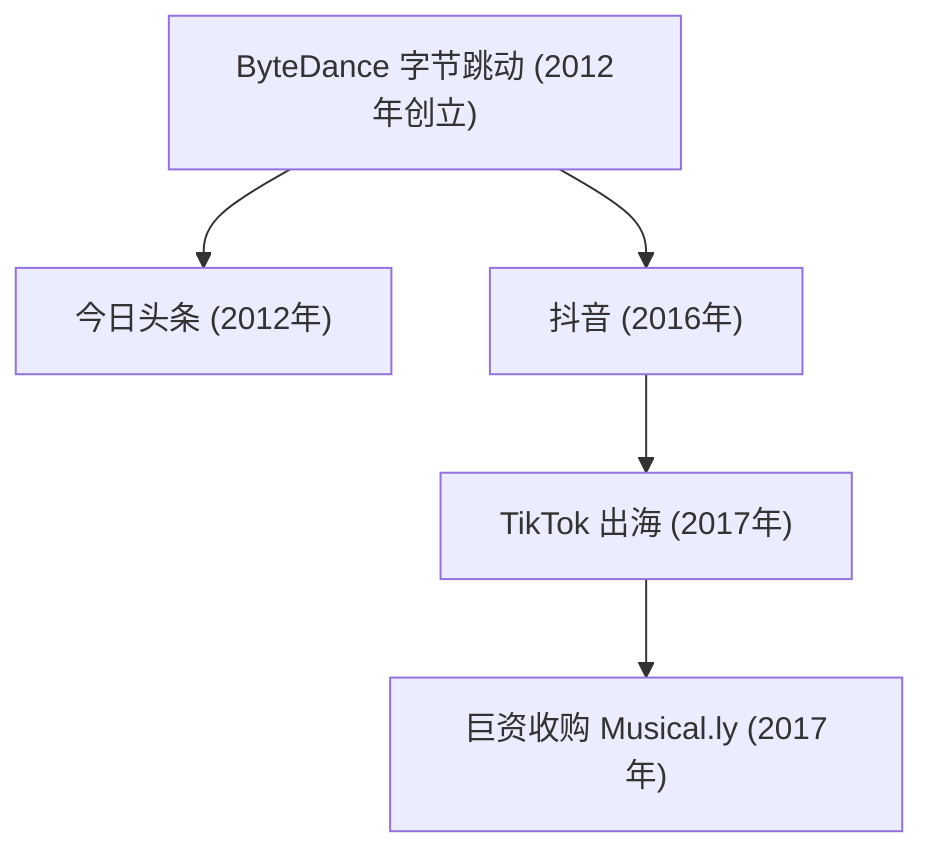

## 1. 序言：重构全球科技版图的超级独角兽

在 21 世纪波澜壮阔的全球科技演进史中，字节跳动（ByteDance）的崛起无疑是最具颠覆性、扩张速度最迅猛的商业奇迹之一。在短短数年时间内，这家从北京锦秋家园民居公寓中走出的初创公司，一跃蜕变为全球估值最高的非上市超级独角兽。其出海王牌短视频平台 TikTok 更在全球数十个国家引爆流行风暴，席卷了以 Z 世代为代表的年轻用户群体，彻底打破了由 Meta（Facebook/Instagram）与 Alphabet（Google/YouTube）等硅谷科技霸主长期统治的全球社交媒体铁幕。

本文将从技术、产品逻辑与商业竞争等多重视角，全面复盘字节跳动如何凭借“算法分发”的底层哲学横空出世，通过今日头条、抖音与 TikTok 步步为营，并在狂风骤雨的地缘政治博弈中奋勇突围的壮丽史诗。

## 2. 创业起步：张一鸣与信息算法分发的终极构想

字节跳动的传奇始于 2012 年初北京中关村附近的一间四居室公寓。创始人张一鸣毕业于南开大学软件工程专业，在经历了酷讯、九九房等多家互联网初创公司的连续创业历练后，敏锐地捕捉到了智能手机普及所带来的信息传播范式剧变。

在 2012 年前后，人类获取信息的主要渠道被死死锁定在两种传统模式中：
1. **主动搜索（Pull 模式）** ：用户在百度或 Google 等搜索引擎的主页输入关键词寻找内容。
2. **社交关系分发（Push 模式）** ：用户在微博、Facebook 或 Twitter 等社交图谱中被动接收好友或关注博主发布的内容。

张一鸣打破常规，洞察到了第三种更纯粹、更高效的信息连接范式： **无社交关系的纯机器算法个性化推荐** 。他坚信，用户根本不需要在海量信息中辛苦搜寻，也不需要苦心经营关注列表；只要让强大的机器学习算法深度学习用户的每一个微观交互行为，机器就能先于用户感知其兴趣，实现“千人千面”的信息自动化精准投喂。

### “今日头条”的横空出世

2012 年 8 月，字节跳动正式推出了旗舰资讯应用——“今日头条”。今日头条没有招募任何传统采编人员，其核心引擎完全交由算法接管。算法不知疲倦地抓取、清洗并打标全网内容，根据用户的点击率、停留时长、滑动速度、点赞评论以及时间地域等实时微信号，毫秒级更新推荐模型。

凭借令人惊叹的个性化黏性，今日头条迅速在巨头林立的移动互联网红海中杀出重围，成为数亿国人日常必看的信息枢纽，同时也为字节跳动储备了滚雪球般的现金流与算法演进底座。

## 3. 敏锐换轨：短视频风口与“抖音”的破茧而出（2016年）

2015 年前后，随着 4G 网络的全面提速降费与智能手机大屏化，张一鸣敏锐地预判到：图文时代即将见顶，移动内容的终极表达形态必然是更直观、更生动的垂直全屏短视频。

2016 年 9 月，字节跳动内部代号为 A.me 的短视频产品上线，随后迅速更名为 **“抖音（Douyin）”** 。抖音定位于专为年轻一代设计的 15 秒音乐创意短视频平台，大幅降低了创作门槛：它为用户提供了丰富的正版流行音乐曲库、卡点节奏模板、精美特效滤镜与智能防抖算法。

更具革命性的是，抖音彻底颠覆了传统视频门户列表式点选的设计，首创了沉浸式的 **“单列全屏即时播放 + 上下滑动无感切换”** 机制。用户一打开 App，无需任何思考决策，视觉与听觉洪流便呼啸而来；手指每轻滑一次，算法便呈上一段全新的惊喜。这种零心理摩擦的交互，让多巴胺分泌的循环效率达到了移动互联网历史上的极致。

## 4. 全球化远征：TikTok 出海与收购 Musical.ly 的胜负手（2017年）

与许多“先做大国内再考虑出海”的中国科技企业不同，字节跳动从创立之初就确立了“Global from Day One（生而全球化）”的宏大格局。2017 年 5 月，抖音的海外版孪生应用 **TikTok** 正式在全球应用商店扬帆起航。

然而，在欧美等主流成熟市场，面对 Instagram、Snapchat 等本土巨头的先发壁垒，纯自发的冷启动速度十分缓慢。张一鸣在此刻展现出了极具魄力的商业气魄：2017 年 11 月，字节跳动以高达 10 亿美元的天价全资收购了总部位于上海和加州的同类短视频先驱——**Musical.ly** 。Musical.ly 当时已在欧美青少年群体中拥有 6000 万极其活跃的黏性用户。

2018 年 8 月，字节跳动打出了一记教科书级的整合重拳：果断将 Musical.ly 的品牌关闭，把所有用户数据、内容资产与创作者关系链一键全量合并至 TikTok。

这次并网让 TikTok 瞬间获得了在西方核心市场的关键引爆质量。配合字节跳动在全球范围内雷霆万钧的买量投放与无懈可击的推荐算法，TikTok 在 2018 年一跃成为全球下载量最大的应用之一，并在 2021 年突破 10 亿月活跃用户大关，真正实现了跨越语言、种族与国界的全球病毒式狂飙。

## 5. 核心护城河：字节跳动算法哲学的本质飞跃

字节跳动之所以能在全球范围内将 Facebook 和 Google 等传统霸主打得措手不及，根本原因在于其底层的 **算法哲学发生了一场认知革命** ：

- **传统社交图谱（Social Graph，以 Meta 为代表）** ：内容的流通受制于人际关系链，用户只能看到好友或已关注者的动态，马太效应严重，信息分发效率低下。
- **内容兴趣图谱（Content/Interest Graph，以 TikTok 为代表）** ：彻底脱钩人际关系链。算法脱离社交关系评估每一个视频的独立吸引力，并基于用户的实时行为特征将视频投喂给最匹配的人。

用简化的数学语言描述，用户对某个特定视频产生正向交互（完播、点赞、评论、转发等）的概率 $P(E)$，可以通过深度神经网络推荐模型进行拟合：

$$ P(E) = \sigma(W^T X + b) $$

其中：
- $X$ 是一个融合了“用户多维特征”（历史行为习惯、完播倾向）、“视频内容特征”（背景音乐、CV 图像标签、语音文本）以及“环境上下文”（网络状态、时间段）的高维向量。
- $W$ 是模型经过海量并发数据实时训练出的权重矩阵。
- $\sigma$ 为输出交互概率的激活函数（如 Sigmoid 函数）。

TikTok 的算法不仅记录点赞和评论，更以毫秒级的精度洞察每一个极其微妙的行为微信号：
- 用户的指尖是否在屏幕上产生了犹疑停顿？
- 视频是否被从头到尾完整观看（完播率）？
- 用户是否进行了多次循环播放？
- 在滑走之前究竟停留了多少毫秒？

这种超敏捷的正向反馈机制，使得哪怕一个没有任何粉丝的崭新创作者，只要其产出的内容足够惊艳，算法就会将其推入更高层级的流量池，一夜之间实现数千万级的全球播放，真正实现了“爆款机制的平民化与民主化”。

## 6. 组织架构创新：“大中台 + App 工厂”的工业化体系

支撑字节跳动多业务并进的核心密码，在于其独特的 **“App 工厂（大中台）”** 组织架构。字节跳动并未采用传统企业按业务线分散割裂的旧模式，而是将核心能力高度沉淀在三大共享中台：
1. **通用算法技术底座**
2. **中心化用户增长（Growth）与投流引擎**
3. **统一商业化变现与广告技术系统**

在此体系下，前台业务团队以敏捷轻骑兵模式运作，能在几周内快速孵化并测试一款新应用。一旦某个产品展现出高留存的数据苗头，中台便倾注数亿资本与流量资源全力引爆；若数据不达标，则就地解散重组，试错成本极低。

这种工业化孵化能力支撑了字节跳动的全方位商业版图扩张：
- **企业协同办公（SaaS）** ：推出一体化协作平台“飞书（Lark）”，深度整合即时沟通、多维表格与视频会议，重构现代企业组织协同。
- **全域电商闭环** ：全力推进“TikTok Shop（及抖音电商）”，打造“货找人”的直播电商与内容电商新形态，在东南亚与欧美市场全面攻城略地。
- **游戏研运** ：设立“朝夕光年（Nuverse）”品牌进军中重度与休闲游戏市场，并根据市场动态敏捷调整资源配置。
- **前沿智能硬件** ：2021 年斥资数十亿元收购 VR 头显先锋 Pico，战略布局空间计算与下一代沉浸式人机交互入口。

## 7. 惊涛骇浪：地缘政治逆风与世纪法庭攻防

然而，TikTok 史无前例的全球商业成就，也将字节跳动推向了 21 世纪中美科技博弈的最前沿风口浪尖。

2020 年，因中印边境摩擦加剧，印度政府以国家安全为由骤然下令全境封禁包括 TikTok 在内的数十款中国应用。TikTok 在一夜之间痛失了其当时全球最大的单一海外市场（约 2 亿活跃用户）。

与此同时，美国政界对 TikTok 的国家安全担忧持续发酵：
- 质疑中国政府能否依据法律调取美国用户的数据？
- 担忧算法模型是否可能成为操纵海外舆论或意识形态渗透的工具？

面对重重阻力，字节跳动投入数十亿美元在美国全力推进 **“德克萨斯计划（Project Texas）”**——将全部美国本土用户数据独立托管于甲骨文（Oracle）云服务器，由专门成立的数据合规实体进行严格审计与隔离。在欧洲，类似的合规工程亦以 **“四叶草计划（Project Clover）”** 同步落地。

尽管字节跳动做出了科技史上最严苛的合规努力，美国国会仍在 2024 年 4 月火速通过了《保护美国人免受外国对手控制应用程序侵害法案》，以立法形式强制要求字节跳动在限期内剥离出售 TikTok 美国业务，否则将在全美实施全面下架封禁。字节跳动随后以侵犯美国宪法第一修正案为由正式向联邦巡回法院提起上诉，拉开了一场关乎全球互联网开放性与主权边界的历史性法律与地缘政治大决战。

## 8. 结语：算法智能的未来与人类社会的永恒命题

字节跳动的创业传奇，向全世界证明了前沿技术创新（特别是以 AI 为驱动的信息流推荐体系）与极致产品力的结合，能够以何等惊人的速度跨越文化藩篱、语言隔阂与国界阻碍。张一鸣最初确立的“让信息在人与世界之间高效流淌”的质朴初心，历经从图文资讯到短视频的形态蜕变，在全人类尺度上成为了现实。

但与此同时，当平台成长为全球数十亿人精神生活的数字中枢时，超级平台与国家安全、数据主权、个人隐私乃至青少年数字健康的深层张力，也成为了摆在字节跳动面前无法规避的世纪大考。

无论 TikTok 在狂风骤雨的地缘波涛中走向何方，字节跳动都已无可逆转地重构了全球数字媒体与人工智能工业的演进范式。这段关于极客野心、技术信仰与时代洪流相互碰撞的商业传奇，必将作为现代企业史中最跌宕起伏的经典篇章，被长久铭记与深思。
