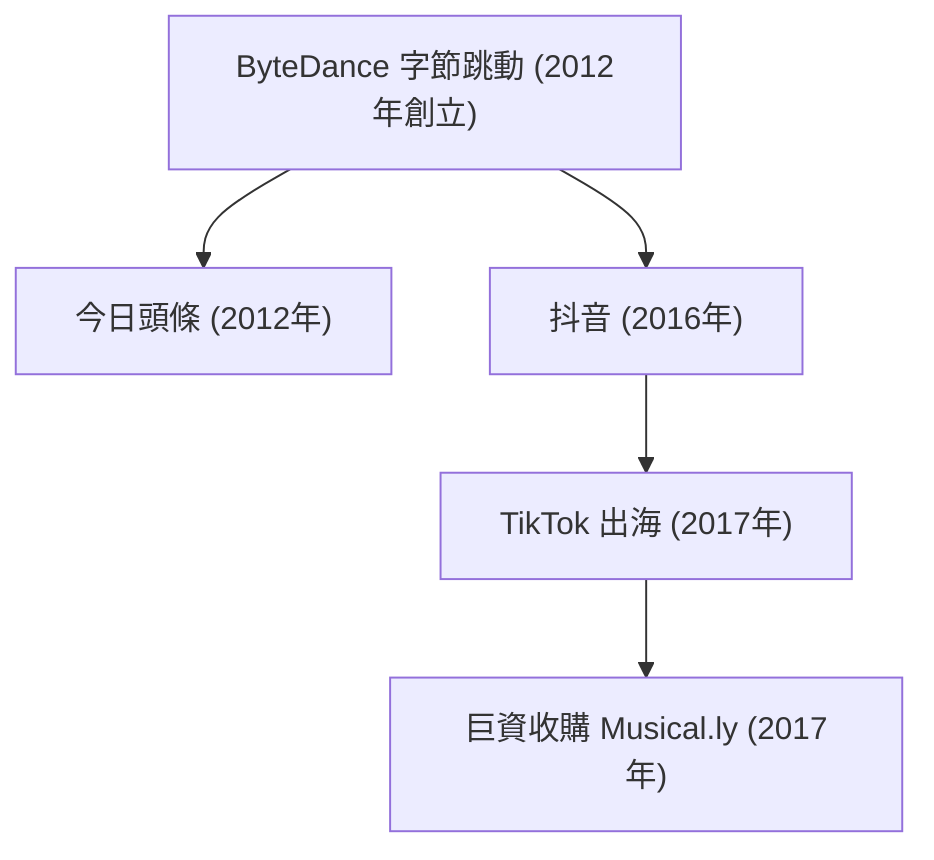

## 1. 序言：重構全球科技版圖的超級獨角獸

在 21 世紀波瀾壯闊的全球科技演進史中，字節跳動（ByteDance）的崛起無疑是最具顛覆性、擴張速度最迅猛的商業奇蹟之一。在短短數年時間內，這家從北京錦秋家園民居公寓中走出的初創公司，一躍蛻變為全球估值最高的非上市超級獨角獸。其出海王牌短影音平台 TikTok 更在全球數十個國家引爆流行風暴，席捲了以 Z 世代為代表的年輕用戶群體，徹底打破了由 Meta（Facebook/Instagram）與 Alphabet（Google/YouTube）等矽谷科技霸主長期統治的全球社群媒體鐵幕。

本文將從技術、產品邏輯與商業競爭等多重視角，全面復盤字節跳動如何憑藉「演算法分發」的底層哲學橫空出世，透過今日頭條、抖音與 TikTok 步步為營，並在狂風驟雨的地緣政治博弈中奮勇突圍的壯麗史詩。

## 2. 創業起步：張一鳴與資訊演算法分發的終極構想

字節跳動的傳奇始於 2012 年初北京中關村附近的一間四居室公寓。創辦人張一鳴畢業於南開大學軟體工程專業，在經歷了酷訊、九九房等多家網際網路初創公司的連續創業歷練後，敏銳地捕捉到了智慧型手機普及所帶來的資訊傳播典範劇變。

在 2012 年前後，人類獲取資訊的主要管道被死死鎖定在兩種傳統模式中：
1. **主動搜尋（Pull 模式）** ：用戶在百度或 Google 等搜尋引擎的主頁輸入關鍵字尋找內容。
2. **社交關係分發（Push 模式）** ：用戶在微博、Facebook 或 Twitter 等社交圖譜中被動接收好友或關注對象發布的內容。

張一鳴打破常規，洞察到了第三種更純粹、更高效的資訊連接典範： **無社交關係的純機器演算法個人化推薦** 。他堅信，用戶根本不需要在海量資訊中辛苦搜尋，也不需要苦心經營關注列表；只要讓強大的機器學習演算法深度學習用戶的每一個微觀互動行為，機器就能先於用戶感知其興趣，實現「千人千面」的資訊自動化精準投餵。

### 「今日頭條」的橫空出世

2012 年 8 月，字節跳動正式推出了旗艦資訊應用——「今日頭條」。今日頭條沒有招募任何傳統採編人員，其核心引擎完全交由演算法接管。演算法不知疲倦地抓取、清洗並標記全網內容，根據用戶的點擊率、停留時長、滑動速度、按讚評論以及時間地域等即時微訊號，毫秒級更新推薦模型。

憑藉令人驚豔的個人化黏性，今日頭條迅速在巨頭林立的行動網際網路紅海中殺出重圍，成為數億大眾日常必看的資訊樞紐，同時也為字節跳動儲備了滾雪球般的現金流與演算法演進底座。

## 3. 敏銳換軌：短影音風口與「抖音」的破繭而出（2016年）

2015 年前後，隨著 4G 網路的全面提速降費與智慧型手機大螢幕化，張一鳴敏銳地預判到：圖文時代即將見頂，行動內容的終極表達形態必然是更直觀、更生動的垂直全螢幕短影音。

2016 年 9 月，字節跳動內部代號為 A.me 的短影音產品上線，隨後迅速更名為 **「抖音（Douyin）」** 。抖音定位於專為年輕一代設計的 15 秒音樂創意短影音平台，大幅降低了創作門檻：它為用戶提供了豐富的正版流行音樂曲庫、節奏模板、精美特效濾鏡與智慧防手震演算法。

更具革命性的是，抖音徹底顛覆了傳統影音門戶列表式點選的設計，首創了沉浸式的 **「單列全螢幕即時播放 + 上下滑動無感切換」** 機制。用戶一打開 App，無需任何思考決策，視覺與聽覺洪流便呼嘯而來；手指每輕滑一次，演算法便呈上一段全新的驚喜。這種零心理摩擦的互動，讓多巴胺分泌的循環效率達到了行動網際網路歷史上的極致。

## 4. 全球化遠征：TikTok 出海與收購 Musical.ly 的勝負手（2017年）

與許多「先做大國內再考慮出海」的亞洲科技企業不同，字節跳動從創立之初就確立了「Global from Day One（生而全球化）」的宏大格局。2017 年 5 月，抖音的海外版孿生應用 **TikTok** 正式在全球應用商店揚帆起航。

然而，在歐美等主流成熟市場，面對 Instagram、Snapchat 等本土巨頭的先發壁壘，純自發的冷啟動速度十分緩慢。張一鳴在此刻展現出了極具魄力的商業氣魄：2017 年 11 月，字節跳動以高達 10 億美元的天價全資收購了總部位於上海和加州的同類短影音先驅——**Musical.ly** 。Musical.ly 當時已在歐美青少年群體中擁有 6000 萬極其活躍的黏性用戶。

2018 年 8 月，字節跳動打出了一記教科書級的整合重拳：果斷將 Musical.ly 的品牌關閉，把所有用戶資料、內容資產與創作者關係鏈一鍵全量合併至 TikTok。

這次並網讓 TikTok 瞬間獲得了在西方核心市場的關鍵引爆質量。配合字節跳動在全球範圍內雷霆萬鈞的行銷推廣與無懈可擊的推薦演算法，TikTok 在 2018 年一躍成為全球下載量最大的應用之一，並在 2021 年突破 10 億月活躍用戶大關，真正實現了跨越語言、種族與國界的全球病毒式狂飆。

## 5. 核心護城河：字節跳動演算法哲學的本質飛躍

字節跳動之所以能在全球範圍內將 Facebook 和 Google 等傳統霸主打得措手不及，根本原因在於其底層的 **演算法哲學發生了一場認知革命** ：

- **傳統社交圖譜（Social Graph，以 Meta 為代表）** ：內容的流通受制於人際關係鏈，用戶只能看到好友或已追蹤者的動態，資訊分發效率低下。
- **內容興趣圖譜（Content/Interest Graph，以 TikTok 為代表）** ：徹底脫鉤人際關係鏈。演算法脫離社交關係評估每一個影片的獨立吸引力，並基於用戶的即時行為特徵將影片投餵給最匹配的人。

用簡化的數學語言描述，用戶對某個特定影片產生正向互動（完播、點讚、評論、分享等）的機率 $P(E)$，可以透過深度神經網路推薦模型進行擬合：

$$ P(E) = \sigma(W^T X + b) $$

其中：
- $X$ 是一個融合了「用戶多維特徵」（歷史行為習慣、完播傾向）、「影片內容特徵」（背景音樂、CV 影像標籤、語音文本）以及「環境上下文」（網路狀態、時間段）的高維向量。
- $W$ 是模型經過海量並發資料即時訓練出的權重矩陣。
- $\sigma$ 為輸出互動機率的激勵函數（如 Sigmoid 函數）。

TikTok 的演算法不僅記錄點讚和評論，更以毫秒級的精度洞察每一個極其微妙的行為微訊號：
- 用戶的指尖是否在螢幕上產生了猶疑停頓？
- 影片是否被從頭到尾完整觀看（完播率）？
- 用戶是否進行了多次循環播放？
- 在滑走之前究竟停留了多少毫秒？

這種超敏捷的正向回饋機制，使得哪怕一個沒有任何粉絲的嶄新創作者，只要其產出的內容足夠驚艷，演算法就會將其推入更高層級的流量池，一夜之間實現數千萬級的全球播放，真正實現了「爆款機制的平民化與民主化」。

## 6. 組織架構創新：「大中台 + App 工廠」的工業化體系

支撐字節跳動多業務並進的核心密碼，在於其獨特的 **「App 工廠（大中台）」** 組織架構。字節跳動並未採用傳統企業按業務線分散割裂的舊模式，而是將核心能力高度沉澱在三大共享中台：
1. **通用演算法技術底座**
2. **中心化用戶成長（Growth）與投流引擎**
3. **統一商業化變現與廣告技術系統**

在此體系下，前台業務團隊以敏捷輕騎兵模式運作，能在幾週內快速孵化並測試一款新應用。一旦某個產品展現出高留存的數據苗頭，中台便傾注數億資本與流量資源全力引爆；若數據不達標，則就地解散重組，試錯成本極低。

這種工業化孵化能力支撐了字節跳動的全方位商業版圖擴張：
- **企業協同辦公（SaaS）** ：推出一體化協作平台「飛書（Lark）」，深度整合即時通訊、多維表格與視訊會議，重構現代企業組織協同。
- **全域電商閉環** ：全力推進「TikTok Shop（及抖音電商）」，打造「貨找人」的直播電商與內容電商新形態，在東南亞與歐美市場全面攻城掠地。
- **遊戲研運** ：設立「朝夕光年（Nuverse）」品牌進軍中重度與休閒遊戲市場，並根據市場動態敏捷調整資源配置。
- **前沿智慧硬體** ：2021 年斥資數十億元收購 VR 頭戴裝置先鋒 Pico，戰略佈局空間運算與下一代沉浸式人機互動入口。

## 7. 驚濤駭浪：地緣政治逆風與世紀法庭攻防

然而，TikTok 史無前例的全球商業成就，也將字節跳動推向了 21 世紀中美科技博弈的最前沿風口浪尖。

2020 年，因中印邊境摩擦加劇，印度政府以國家安全為由驟然下令全境封禁包括 TikTok 在內的數十款中國應用。TikTok 在一夜之間痛失了其當時全球最大的單一海外市場（約 2 億活躍用戶）。

與此同時，美國政界對 TikTok 的國家安全擔憂持續發酵：
- 質疑中國政府能否依據法律調取美國用戶的資料？
- 擔憂演算法模型是否可能成為操縱海外輿論或意識形態滲透的工具？

面對重重阻力，字節跳動投入數十億美元在美國全力推進 **「德克薩斯計畫（Project Texas）」**——將全部美國本土用戶資料獨立託管於甲骨文（Oracle）雲端伺服器，由專門成立的資料合規實體進行嚴格稽核與隔離。在歐洲，類似的合規工程亦以 **「四葉草計畫（Project Clover）」** 同步落地。

儘管字節跳動做出了科技史上最嚴苛的合規努力，美國國會仍於 2024 年 4 月火速通過了《保護美國人免受外國對手控制應用程式侵害法案》，以立法形式強制要求字節跳動在限期內剝離出售 TikTok 美國業務，否則將在全美實施全面下架封禁。字節跳動隨後以侵犯美國憲法第一修正案為由正式向聯邦巡迴法院提起上訴，拉開了一場關乎全球網際網路開放性與主權邊界之歷史性法律與地緣政治大決戰。

## 8. 結語：演算法智慧的未來與人類社會的永恆命題

字節跳動的創業傳奇，向全世界證明了前沿技術創新（特別是以 AI 為驅動的資訊流推薦體系）與極致產品力的結合，能夠以何等驚人的速度跨越文化藩籬、語言隔閡與國界阻礙。張一鳴最初確立的「讓資訊在人與世界之間高效流動」的質樸初心，歷經從圖文資訊到短影音的形態蛻變，在全人類尺度上成為了現實。

但與此同時，當平台成長為全球數十億人精神生活的數位中樞時，超級平台與國家安全、資料主權、個人隱私乃至青少年數位健康的深層張力，也成為了擺在字節跳動面前無法規避的世紀大考。

無論 TikTok 在狂風驟雨的地緣波濤中走向何方，字節跳動都已無可逆轉地重構了全球數位媒體與人工智慧工業的演進典範。這段關於極客野心、技術信仰與時代洪流相互碰撞的商業傳奇，必將作為現代企業史中最跌宕起伏的經典篇章，被長久銘記與深思。
