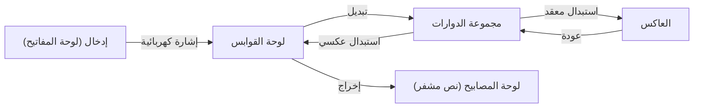

تقنية التشفير هي أساس أمن المعلومات. يعتمد أمان الإنترنت الذي نستخدمه يوميًا على نظريات رياضية متقدمة للغاية. في هذه المقالة، سنشرح بالتفصيل تاريخ ومبادئ التشفير، بدءًا من شفرة قيصر القديمة، مرورًا بمعارك آلة التشفير إنجما في الحرب العالمية الثانية، وصولاً إلى ولادة تشفير المفتاح العام (RSA) الذي يمثل البنية التحتية للمجتمع الحديث.

## 1. فجر التشفير: التطور من العصور القديمة إلى العصور الوسطى

يتمتع التشفير بتاريخ طويل وقد تطور من قبل الحكام لنقل الأسرار العسكرية والدبلوماسية.

### شفرة قيصر (Caesar Cipher)
وهي من أقدم الشفرات الكلاسيكية، ويُعتقد أن يوليوس قيصر استخدمها في روما القديمة قبل الميلاد. إنها نوع من 'تشفير الاستبدال' حيث يتم إزاحة الأبجدية بعدد معين من الأحرف (على سبيل المثال، 3 أحرف). يتم تحويل 'A' إلى 'D' و 'B' إلى 'E'. على الرغم من أن الآلية بسيطة للغاية، إلا أنها كانت تتمتع بسرية كافية في ذلك الوقت عندما كانت معدلات معرفة القراءة والكتابة منخفضة.

### شفرة فيجينير (Vigenère Cipher)
في القرن السادس عشر، ابتكر الفرنسي بليز دي فيجينير 'تشفير الاستبدال المتعدد'. بدلاً من الإزاحة الفردية، تستخدم هذه الآلية كلمة مفتاحية لتغيير مقدار الإزاحة لكل حرف. اعتبرت هذه الشفرة غير قابلة للكسر لمئات السنين وأطلق عليها اسم 'الشفرة المنيعة'. ومع ذلك، في القرن التاسع عشر، تم اكتشاف انتظامها من خلال تطور تحليل التكرار بواسطة تشارلز باباج وفريدريش كاسيسكي.

## 2. قمة التشفير الميكانيكي: آلية ومعركة آلة التشفير إنجما

في القرن العشرين، مع تطور تكنولوجيا الاتصالات، دخل التشفير عصر الميكنة. تتربع على القمة 'إنجما (Enigma)'، التي اعتمدها الجيش الألماني.

### الهيكل الميكانيكي والرياضي لإنجما
إنجما هي آلة تشفير كهروميكانيكية تتكون من لوحة مفاتيح، ولوحة قوابس، ودوارات متعددة، وعاكس. في كل مرة يتم فيها الضغط على مفتاح، يدور الدوار وتتغير الدائرة، لذلك حتى إذا قمت بإدخال نفس الحرف، فسيتم تشفيره إلى حرف مختلف في كل مرة.
على وجه الخصوص، من خلال تبديل الأحرف باستخدام لوحة القوابس والجمع بين دوارات متعددة، وصل فضاء المفاتيح (عدد مجموعات الإعدادات) إلى رقم فلكي يبلغ حوالي $1.58 \times 10^{20}$.



### تحدي آلان تورينج وحديقة بلتشلي
واجه فريق فك التشفير الذي تم تجميعه في حديقة بلتشلي في إنجلترا تحدي إنجما، التي كانت تعتبر 'غير قابلة للكسر'. كان الشخصية المركزية في ذلك هو عالم الرياضيات العبقري آلان تورينج. قام تورينج بتحسين آلة فك التشفير البولندية 'بومبا' وطور حاسوبًا ميكانيكيًا ضخمًا يسمى 'Bombe' يكتشف التناقضات في الدوائر الكهربائية لإنجما باستخدام القوة الغاشمة.
لقد لاحظوا وجود عبارات نمطية محددة في اتصالات الجيش الألماني (على سبيل المثال: 'Heil Hitler' أو تنسيق توقعات الطقس)، وقاموا ببناء خوارزمية لتحديد الإعداد الأولي للدوارات باستخدام الكريب (Crib: النص العادي المخمن). يقال إن عملية فك التشفير هذه أدت إلى تقصير الحرب العالمية الثانية بعدة سنوات وأنقذت حياة الملايين.

## 3. فجر تشفير المفتاح العام: ثورة ديفي وهيلمان

كانت جميع الشفرات التقليدية، بما في ذلك إنجما، تعتمد على 'تشفير المفتاح المتماثل'. هذه طريقة يتم فيها استخدام نفس المفتاح للتشفير وفك التشفير. ومع ذلك، كان لهذه الطريقة عيب قاتل يسمى 'مشكلة توزيع المفاتيح'. للتواصل بأمان مع طرف بعيد، كان يجب مشاركة المفتاح مسبقًا بطريقة آمنة، وهو ما لم يكن عمليًا في شبكات تتواصل مع عدد غير محدد من الأشخاص مثل الإنترنت.

في عام 1976، اقترح ويتفيلد ديفي ومارتن هيلمان مفهومًا ثوريًا يتمثل في 'فصل تشفير المفتاح عن فك تشفيره'، وهو 'تشفير المفتاح العام'.
إنه نظام يمكن فيه لأي شخص التشفير باستخدام 'المفتاح العام (Public Key)'، ولا يمكن فك التشفير إلا باستخدام 'المفتاح الخاص (Private Key)' الذي يمتلكه المستلم فقط. وبذلك، لم تعد هناك حاجة لمشاركة المفاتيح مسبقًا.

## 4. ولادة تشفير RSA والمبادئ الرياضية

على الرغم من أن ديفي وهيلمان اقترحا المفهوم، إلا أنهما لم يكتشفا دالة محددة (دالة أحادية الاتجاه). في عام 1977، قام ثلاثة أشخاص من معهد ماساتشوستس للتكنولوجيا (MIT) وهم رونالد ريفست (R)، وآدي شامير (S)، وليونارد أدليمان (A) أخيرًا بتطوير خوارزمية عملية تسمى 'تشفير RSA'.

### الأساس الرياضي لـ RSA: مبرهنة أويلر وتحليل العوامل الأولية
يعتمد أمان تشفير RSA على الخاصية الرياضية التي تفيد بأن 'تحليل الأعداد الصحيحة الضخمة إلى عوامل أولية أمر صعب للغاية'.

1. **إنشاء المفاتيح**:
   - اختر عددين أوليين كبيرين $p$ و $q$، واحسب $n = p \times q$.
   - احسب مؤشر أويلر (Euler's totient function) $\phi(n) = (p-1)(q-1)$.
   - اختر عددًا صحيحًا $e$ يكون أوليًا نسبيًا مع $\phi(n)$ (المفتاح العام).
   - احسب $d$ بحيث يتحقق $e \times d \equiv 1 \pmod{\phi(n)}$ (المفتاح الخاص).

2. **التشفير**:
   قم بتشفير النص العادي $M$ باستخدام المفتاح العام $(e, n)$ للحصول على النص المشفر $C$.
   $$C \equiv M^e \pmod{n}$$

3. **فك التشفير**:
   قم بفك تشفير النص المشفر $C$ باستخدام المفتاح الخاص $(d, n)$ للعودة إلى النص العادي $M$.
   $$M \equiv C^d \pmod{n}$$

بناءً على 'مبرهنة أويلر'، وهي تعميم لمبرهنة فيرما الصغرى، تم إثبات رياضيًا أن عملية فك التشفير هذه ستعود دائمًا إلى النص العادي الأصلي. يُعتبر من المستحيل على المهاجمين استنتاج $p$ و $q$ من $n$ (تحليل العوامل الأولية) في إطار زمني واقعي حتى باستخدام أجهزة الكمبيوتر العملاقة الحالية.

### تنفيذ مبسط لخوارزمية RSA باستخدام بايثون

لفهم كيفية عمل RSA، نعرض أدناه رمز تنفيذ مبسط باستخدام بايثون مع أعداد أولية صغيرة.

```python
import math

def is_prime(n):
    if n < 2: return False
    for i in range(2, int(math.sqrt(n)) + 1):
        if n % i == 0:
            return False
    return True

# 1. إنشاء المفاتيح
p = 61
q = 53
n = p * q
phi = (p - 1) * (q - 1)

e = 17 # أولي نسبيًا مع phi
# حساب المعكوس الضربي القياسي (e * d ≡ 1 mod phi)
d = pow(e, -1, phi)

print(f"المفتاح العام: (e={e}, n={n})")
print(f"المفتاح الخاص: (d={d}, n={n})")

# 2. اختبار التشفير وفك التشفير
message = 65 # رمز ASCII للحرف 'A'
print(f"\nالرسالة الأصلية: {message}")

# التشفير
ciphertext = pow(message, e, n)
print(f"النص المشفر: {ciphertext}")

# فك التشفير
decrypted_message = pow(ciphertext, d, n)
print(f"الرسالة بعد فك التشفير: {decrypted_message}")
```

## 5. الخاتمة: مستقبل التشفير والاستعداد لأجهزة الكمبيوتر الكمومية

تطور التشفير جنبًا إلى جنب مع تاريخ البشرية، بدءًا من الإزاحة البسيطة للأحرف في شفرة قيصر، مرورًا بالبنية الميكانيكية المعقدة لإنجما، ووصولاً إلى نظرية الأعداد المتقدمة لتشفير RSA.
ومع ذلك، فإن التقدم التكنولوجي لا يتوقف. في الوقت الحالي، يجري تطوير 'أجهزة الكمبيوتر الكمومية' التي تمتلك القدرة على حل تحليل العوامل الأولية، وهو أساس تشفير RSA، بسرعات عالية. إذا تم تحقيق 'خوارزمية شور' التي ابتكرها بيتر شور، يُقال إن جميع أنظمة تشفير المفتاح العام الحالية سيتم كسرها.

لمواجهة هذا الأمر، تتقدم الأبحاث حول 'التشفير المقاوم للكم ([PQC](/ar/p/post-quantum-cryptography/))' بوتيرة سريعة في جميع أنحاء العالم. ستقوم تقنيات التشفير من الجيل القادم، استنادًا إلى مشاكل رياضية صعبة جديدة مثل التشفير القائم على الشبكة وتشفير متعدد الحدود متعدد المتغيرات، بتحمل مسؤولية أمان المستقبل. ستستمر معركة 'الرمح والدرع' حول التشفير في واجهة الرياضيات وعلوم الكمبيوتر.
