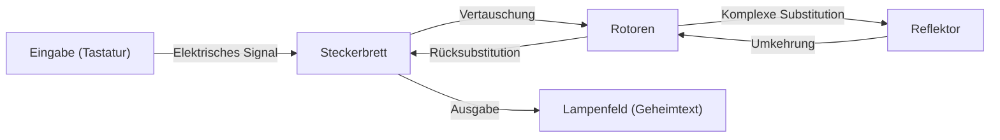

Kryptographische Technologien sind die Grundlage der Informationssicherheit. Die Sicherheit des Internets, das wir täglich nutzen, wird durch extrem fortgeschrittene mathematische Theorien unterstützt. In diesem Artikel werden wir die Geschichte und die Prinzipien der Kryptographie detailliert erklären, beginnend mit der antiken Caesar-Chiffre über den Kampf um die Enigma-Maschine im Zweiten Weltkrieg bis hin zur Entstehung der Public-Key-Kryptographie (RSA), die die Infrastruktur unserer modernen Gesellschaft bildet.

## 1. Die Anfänge der Kryptographie: Entwicklung von der Antike bis zum Mittelalter

Die Geschichte der Kryptographie ist alt und entwickelte sich dadurch, dass Machthaber militärische und diplomatische Geheimnisse übermitteln wollten.

### Caesar-Chiffre (Caesar Cipher)
Dies ist die klassischste Chiffre, die im antiken Rom vor Christus von Julius Caesar verwendet worden sein soll. Es ist eine Art der 'Substitutionschiffre', bei der das Alphabet um eine bestimmte Anzahl von Buchstaben (z. B. 3 Buchstaben) verschoben wird. 'A' wird zu 'D' und 'B' wird zu 'E' umgewandelt. Obwohl der Mechanismus sehr einfach ist, bot er in einer Zeit, in der die Alphabetisierungsrate niedrig war, ausreichende Vertraulichkeit.

### Vigenère-Chiffre (Vigenère Cipher)
Im 16. Jahrhundert wurde die 'polyalphabetische Substitution' vom Franzosen Blaise de Vigenère erfunden. Anstelle einer einfachen Verschiebung verwendet dieser Mechanismus ein Schlüsselwort, um den Verschiebungsbetrag für jeden Buchstaben zu ändern. Diese Chiffre galt jahrhundertelang als unknackbar und wurde als 'unüberwindbare Chiffre' bezeichnet. Im 19. Jahrhundert jedoch wurde ihre Regelmäßigkeit durch die Entwicklung der Häufigkeitsanalyse von Charles Babbage und Friedrich Kasiski aufgedeckt.

## 2. Der Höhepunkt der mechanischen Kryptographie: Mechanismus und Schlacht um die Enigma-Maschine

Mit dem Beginn des 20. Jahrhunderts und der Entwicklung der Kommunikationstechnologie brach auch das Zeitalter der Mechanisierung in der Verschlüsselung an. An der Spitze davon stand die 'Enigma', die vom deutschen Militär eingesetzt wurde.

### Mechanische und mathematische Struktur der Enigma
Die Enigma ist eine elektromechanische Chiffriermaschine, die aus einer Tastatur, einem Steckerbrett (Plugboard), mehreren Rotoren (Walzen) und einem Reflektor (Umkehrwalze) besteht. Bei jedem Tastendruck dreht sich ein Rotor und ändert den Stromkreis, sodass derselbe Buchstabe jedes Mal in einen anderen Buchstaben verschlüsselt wird.
Insbesondere durch den Buchstabentausch am Steckerbrett und die Kombination mehrerer Rotoren erreichte der Schlüsselraum (die Anzahl der möglichen Einstellungskombinationen) die astronomische Zahl von etwa $1.58 \times 10^{20}$ (158 Trillionen).



### Die Herausforderung von Alan Turing und Bletchley Park
Das Kryptoanalyseteam, das im britischen Bletchley Park versammelt war, nahm die Herausforderung an, diese als 'unknackbar' geltende Enigma zu brechen. Die zentrale Figur war der brillante Mathematiker Alan Turing. Turing verbesserte die polnische Entschlüsselungsmaschine 'Bomba' und entwickelte die 'Bombe', einen riesigen mechanischen Computer, der Widersprüche in den Schaltkreisen der Enigma mit Brute-Force-Methoden aufspürte.
Sie bemerkten, dass es in den deutschen Militärkommunikationen spezifische Standardphrasen gab (z. B. 'Heil Hitler' oder Wetterberichtsformate), und entwickelten einen Algorithmus, der Cribs (vermuteter Klartext) verwendete, um die anfänglichen Rotoreinstellungen zu identifizieren. Es wird gesagt, dass diese Entschlüsselung den Zweiten Weltkrieg um mehrere Jahre verkürzte und Millionen von Leben rettete.

## 3. Die Dämmerung der Public-Key-Kryptographie: Die Revolution von Diffie und Hellman

Bisherige Chiffren, einschließlich der Enigma, basierten alle auf dem 'symmetrischen Kryptosystem'. Dies ist eine Methode, bei der derselbe Schlüssel für die Ver- und Entschlüsselung verwendet wird. Dieses System hatte jedoch einen fatalen Fehler, der als 'Schlüsselverteilungsproblem' bekannt ist. Um sicher mit einer weit entfernten Partei zu kommunizieren, musste der Schlüssel im Voraus auf sichere Weise geteilt werden, was in Netzwerken wie dem Internet, wo man mit einer unbestimmten Anzahl von Personen kommuniziert, unpraktisch war.

Im Jahr 1976 schlugen Whitfield Diffie und Martin Hellman das bahnbrechende Konzept der 'Public-Key-Kryptographie' vor, das 'den Schlüssel für Verschlüsselung und Entschlüsselung trennt'.
Es ist ein System, bei dem mit einem 'öffentlichen Schlüssel' (Public Key), den jeder kennen kann, verschlüsselt wird und nur mit einem 'privaten Schlüssel' (Private Key), den nur der Empfänger besitzt, entschlüsselt werden kann. Dadurch wurde der vorherige Schlüsselaustausch überflüssig.

## 4. Die Entstehung der RSA-Kryptographie und ihre mathematischen Prinzipien

Obwohl Diffie und Hellman das Konzept vorschlugen, hatten sie noch keine spezifische Funktion (Einwegfunktion) entdeckt. 1977 entwickelten die drei Forscher Ronald Rivest (R), Adi Shamir (S) und Leonard Adleman (A) vom Massachusetts Institute of Technology (MIT) schließlich den praktischen Algorithmus 'RSA-Kryptographie'.

### Die mathematischen Grundlagen von RSA: Der Satz von Euler und die Primfaktorzerlegung
Die Sicherheit der RSA-Kryptographie beruht auf der mathematischen Eigenschaft, dass 'die Primfaktorzerlegung riesiger Ganzzahlen extrem schwierig ist'.

1. **Schlüsselerzeugung**:
   - Wähle zwei riesige Primzahlen $p$ und $q$ und berechne $n = p \times q$.
   - Berechne die Eulersche Phi-Funktion $\phi(n) = (p-1)(q-1)$.
   - Wähle eine ganze Zahl $e$, die teilerfremd zu $\phi(n)$ ist (Öffentlicher Schlüssel).
   - Berechne $d$, sodass $e \times d \equiv 1 \pmod{\phi(n)}$ erfüllt ist (Privater Schlüssel).

2. **Verschlüsselung**:
   Verschlüssele den Klartext $M$ mit dem öffentlichen Schlüssel $(e, n)$, um den Geheimtext $C$ zu erhalten.
   $$C \equiv M^e \pmod{n}$$

3. **Entschlüsselung**:
   Entschlüssele den Geheimtext $C$ mit dem privaten Schlüssel $(d, n)$, um den ursprünglichen Klartext $M$ wiederherzustellen.
   $$M \equiv C^d \pmod{n}$$

Durch den 'Satz von Euler', der eine Verallgemeinerung des kleinen Satzes von Fermat ist, ist mathematisch bewiesen, dass diese Entschlüsselung immer den ursprünglichen Klartext zurückgibt. Es wird angenommen, dass es für einen Angreifer selbst mit aktuellen Supercomputern in einer realistischen Zeit unmöglich ist, $p$ und $q$ aus $n$ abzuleiten (Primfaktorzerlegung).

### Einfache Implementierung des RSA-Algorithmus in Python

Um den Mechanismus von RSA zu verstehen, wird hier ein einfacher Python-Implementierungscode unter Verwendung kleiner Primzahlen gezeigt.

```python
import math

def is_prime(n):
    if n < 2: return False
    for i in range(2, int(math.sqrt(n)) + 1):
        if n % i == 0:
            return False
    return True

# 1. Schlüsselerzeugung
p = 61
q = 53
n = p * q
phi = (p - 1) * (q - 1)

e = 17 # Teilerfremd zu phi
# Modulares Inverses berechnen (e * d ≡ 1 mod phi)
d = pow(e, -1, phi)

print(f"Öffentlicher Schlüssel: (e={e}, n={n})")
print(f"Privater Schlüssel: (d={d}, n={n})")

# 2. Test für Verschlüsselung und Entschlüsselung
message = 65 # ASCII-Code für 'A'
print(f"\nUrsprüngliche Nachricht: {message}")

# Verschlüsselung
ciphertext = pow(message, e, n)
print(f"Geheimtext: {ciphertext}")

# Entschlüsselung
decrypted_message = pow(ciphertext, d, n)
print(f"Entschlüsselte Nachricht: {decrypted_message}")
```

## 5. Fazit: Die Zukunft der Kryptographie und Vorbereitung auf Quantencomputer

Von der simplen Buchstabenverschiebung der Caesar-Chiffre über die komplexe mechanische Struktur der Enigma bis hin zur fortgeschrittenen Zahlentheorie der RSA-Kryptographie hat sich die Kryptographie gemeinsam mit der Menschheitsgeschichte entwickelt.
Der technologische Fortschritt bleibt jedoch nicht stehen. Derzeit wird an 'Quantencomputern' entwickelt, die das Potenzial haben, die Primfaktorzerlegung – das Fundament der RSA-Kryptographie – mit hoher Geschwindigkeit zu lösen. Es wird gesagt, dass alle aktuellen Public-Key-Chiffren gebrochen werden, wenn der von Peter Shor erfundene 'Shor-Algorithmus' realisiert wird.

Um dem entgegenzuwirken, wird derzeit weltweit mit Hochdruck an 'Post-Quanten-Kryptographie (PQC)' geforscht. Kryptographische Technologien der nächsten Generation, die auf neuen mathematischen Problemen basieren, wie gitterbasierte Kryptographie und multivariate Kryptographie, werden die Zukunft der Sicherheit prägen. Der Kampf zwischen 'Schild und Speer' in der Kryptographie wird auch in Zukunft an der Spitze von Mathematik und Informatik ausgetragen werden.
