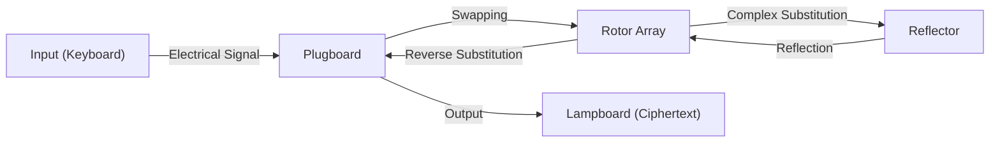

Cryptography is the foundation of information security. The safety of the internet we use daily is supported by highly advanced mathematical theories. This article provides a detailed explanation of the history and principles of cryptography, starting from the ancient Caesar cipher, through the offensive and defensive battles over the Enigma cipher machine in World War II, up to the birth of public-key cryptography (RSA), which forms the infrastructure of modern society.

## 1. The Dawn of Cryptography: Evolution from Antiquity to the Middle Ages

The history of cryptography is ancient, having developed for rulers to transmit military and diplomatic secrets.

### Caesar Cipher
It is the most classical cipher, believed to have been used by Julius Caesar in ancient Rome before the Common Era. It is a type of "substitution cipher" where the alphabet is shifted by a fixed number (e.g., 3 letters). 'A' is converted to 'D', and 'B' to 'E'. The mechanism is extremely simple, but it boasted sufficient confidentiality in an era when literacy rates were low.

### Vigenère Cipher
In the 16th century, the "polyalphabetic cipher" was devised by Blaise de Vigenère of France. Instead of a single shift, it is a mechanism that changes the amount of shift for each letter using a keyword. This cipher was considered unbreakable for hundreds of years and was called the "indecipherable cipher." However, in the 19th century, its regularity was uncovered through the development of frequency analysis by Charles Babbage and Friedrich Kasiski.

## 2. The Pinnacle of Mechanical Cryptography: The Mechanism and Battles of the Enigma Machine

Entering the 20th century, with the development of communication technology, cryptography also welcomed the era of mechanization. Reigning at the pinnacle of this was "Enigma," adopted by the German military.

### Mechanical and Mathematical Structure of Enigma
Enigma is an electromechanical cipher machine consisting of a keyboard, a plugboard, multiple rotors (rotating disks), and a reflector (reversing disk). Every time a key is pressed, the rotors rotate and the circuit changes, so even if the same letter is input, it is encrypted into a different letter each time.
In particular, due to the swapping of letters by the plugboard and the combination of multiple rotors, its key space (the number of setting combinations) reached an astronomical number of approximately $1.58 \times 10^{20}$ (158 quintillion).



### Alan Turing and the Challenge of Bletchley Park
Challenging this Enigma, which was considered "unbreakable," was the cryptanalysis team gathered at Bletchley Park in the UK. Its central figure was the genius mathematician Alan Turing. Turing improved the Polish cryptologic bomb "Bomba" and developed "Bombe," a giant mechanical computer that brute-forced the contradictions in Enigma's electrical circuits.
They focused on the existence of specific routine phrases (e.g., "Heil Hitler" or weather forecast formats) peculiar to German military communications, and constructed an algorithm to identify the initial settings of the rotors using cribs (guessed plaintext). It is said that this decryption shortened World War II by several years and saved millions of lives.

## 3. The Dawn of Public-Key Cryptography: Diffie and Hellman's Revolution

All conventional ciphers, including Enigma, were "symmetric-key cryptosystems." This is a method that uses the same key for encryption and decryption. However, this method had a fatal flaw called the "key distribution problem." To communicate safely with a distant party, the key had to be shared in advance through a secure method, which was not practical for networks like the internet where communication is with an unspecified large number of people.

In 1976, Whitfield Diffie and Martin Hellman proposed "public-key cryptography," an epoch-making concept that "separates the keys for encryption and decryption."
It is a system where encryption is done with a "Public Key" that anyone can know, and decryption can only be done with a "Private Key" possessed only by the receiver. This eliminated the need for prior key sharing.

## 4. The Birth and Mathematical Principles of the RSA Cryptosystem

Although Diffie and Hellman proposed the concept, they had not reached the discovery of a specific function (one-way function). In 1977, Ronald Rivest (R), Adi Shamir (S), and Leonard Adleman (A) at the Massachusetts Institute of Technology (MIT) finally developed the practical algorithm, the "RSA cryptosystem."

### Mathematical Foundation of RSA: Euler's Theorem and Prime Factorization
The security of RSA cryptography relies on the mathematical property that "prime factorization of huge integers is extremely difficult."

1. **Key Generation**:
   - Choose two large prime numbers $p$ and $q$, and calculate $n = p \times q$.
   - Calculate Euler's totient function $\phi(n) = (p-1)(q-1)$.
   - Choose an integer $e$ that is coprime to $\phi(n)$ (Public Key).
   - Calculate $d$ such that $e \times d \equiv 1 \pmod{\phi(n)}$ (Private Key).

2. **Encryption**:
   Encrypt the plaintext $M$ using the public key $(e, n)$ to obtain the ciphertext $C$.
   $$C \equiv M^e \pmod{n}$$

3. **Decryption**:
   Decrypt the ciphertext $C$ using the private key $(d, n)$ to return to the plaintext $M$.
   $$M \equiv C^d \pmod{n}$$

According to "Euler's theorem," which generalizes Fermat's Little Theorem, it is mathematically proven that this decryption will always return to the original plaintext. It is considered impossible even for current supercomputers to calculate $p$ and $q$ from $n$ (prime factorization) within a realistic amount of time.

### Simple Python Implementation of the RSA Algorithm

To understand the mechanism of RSA, here is a simple Python implementation code using small prime numbers.

```python
import math

def is_prime(n):
    if n < 2: return False
    for i in range(2, int(math.sqrt(n)) + 1):
        if n % i == 0:
            return False
    return True

# 1. Key Generation
p = 61
q = 53
n = p * q
phi = (p - 1) * (q - 1)

e = 17 # Coprime with phi
# Calculate modular inverse (e * d ≡ 1 mod phi)
d = pow(e, -1, phi)

print(f"Public Key: (e={e}, n={n})")
print(f"Private Key: (d={d}, n={n})")

# 2. Encryption and Decryption Test
message = 65 # ASCII code for 'A'
print(f"\nOriginal message: {message}")

# Encryption
ciphertext = pow(message, e, n)
print(f"Ciphertext: {ciphertext}")

# Decryption
decrypted_message = pow(ciphertext, d, n)
print(f"Decrypted message: {decrypted_message}")
```

## 5. Conclusion: The Future of Cryptography and Preparation for Quantum Computers

From the simple letter shifting of the Caesar cipher, through the complex mechanical structure of Enigma, to the advanced number theory of RSA cryptography, cryptography has evolved along with human history.
However, technological progress does not stop. Currently, the development of "quantum computers," which have the potential to rapidly solve prime factorization—the foundation of RSA cryptography—is progressing. It is said that if "Shor's algorithm" devised by Peter Shor is realized, all current public-key cryptography will be broken.

To counter this, research on "Post-Quantum Cryptography (PQC)" is now rapidly advancing worldwide. Next-generation cryptographic technologies based on new mathematical hard problems, such as lattice-based cryptography and multivariate polynomial cryptography, will likely bear the future of security. The offensive and defensive battle of the "spear and shield" surrounding cryptography will continue to unfold at the forefront of mathematics and computer science.
