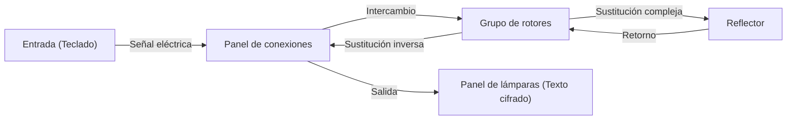

La criptografía es la tecnología fundamental de la seguridad de la información. La seguridad de Internet que utilizamos a diario está respaldada por teorías matemáticas sumamente avanzadas. En este artículo, explicaremos en detalle la historia y los principios desde el antiguo cifrado César, pasando por la batalla de la máquina de cifrado Enigma en la Segunda Guerra Mundial, hasta el nacimiento de la criptografía de clave pública (RSA), que es la infraestructura de la sociedad moderna.

## 1. Los albores de la criptografía: evolución de la Antigüedad a la Edad Media

La historia de la criptografía es antigua y se ha desarrollado para que los gobernantes pudieran transmitir secretos militares y diplomáticos.

### Cifrado César (Caesar Cipher)
Es el cifrado más clásico que se dice fue utilizado por Julio César en la antigua Roma antes de Cristo. Es un tipo de "cifrado por sustitución" que desplaza el alfabeto un número determinado de posiciones (por ejemplo, 3 letras). La "A" se convierte en "D" y la "B" en "E". Su mecanismo es muy simple, pero en aquella época de baja tasa de alfabetización, presumía de suficiente confidencialidad.

### Cifrado Vigenère (Vigenère Cipher)
En el siglo XVI, el francés Blaise de Vigenère inventó el "cifrado polialfabético". En lugar de un solo desplazamiento, es un mecanismo que cambia la cantidad de desplazamiento para cada letra utilizando una palabra clave. Se consideró indescifrable durante cientos de años y fue llamado el "cifrado inquebrantable". Sin embargo, en el siglo XIX, con el desarrollo del análisis de frecuencias por Charles Babbage y Friedrich Kasiski, se descubrió su regularidad.

## 2. La cumbre de la criptografía mecánica: mecanismo y batalla de la máquina de cifrado Enigma

Entrando en el siglo XX, con el desarrollo de la tecnología de las comunicaciones, el cifrado también entra en la era de la mecanización. En su cumbre se situó "Enigma", adoptada por el ejército alemán.

### Estructura mecánica y matemática de Enigma
Enigma es una máquina de cifrado electromecánica compuesta por un teclado, un panel de conexiones, varios rotores (discos giratorios) y un reflector. Cada vez que se presiona una tecla, el rotor gira y el circuito cambia, por lo que incluso si se ingresa la misma letra, se cifra en una letra diferente cada vez.
Especialmente mediante el intercambio de letras por el panel de conexiones y la combinación de múltiples rotores, su espacio de claves (número de combinaciones de configuración) alcanzó la astronómica cifra de aproximadamente $1.58 \times 10^{20}$ (158 trillones).



### El desafío de Alan Turing y Bletchley Park
El equipo de descifrado reunido en Bletchley Park, Inglaterra, desafió a este Enigma considerado "indescifrable". La figura central fue el genio matemático Alan Turing. Turing mejoró la máquina de descifrado polaca "Bomba" y desarrolló "Bombe", una enorme computadora mecánica que detectaba contradicciones en los circuitos eléctricos de Enigma por fuerza bruta.
Se dieron cuenta de la existencia de frases hechas específicas de las comunicaciones militares alemanas (ej: "Heil Hitler" o el formato del pronóstico del tiempo) y construyeron un algoritmo para identificar la configuración inicial de los rotores utilizando "Crib" (texto plano deducido). Se dice que este descifrado adelantó el final de la Segunda Guerra Mundial varios años y salvó millones de vidas.

## 3. El amanecer de la criptografía de clave pública: la revolución de Diffie y Hellman

Todos los cifrados convencionales, incluido Enigma, utilizaban el "sistema de criptografía de clave simétrica". Este es un sistema en el que se utiliza la misma clave para cifrar y descifrar. Sin embargo, este sistema tenía un defecto fatal llamado el "problema de distribución de claves". Para comunicarse de forma segura con alguien a larga distancia, la clave debía compartirse previamente mediante un método seguro, lo cual no era práctico en redes como Internet donde uno se comunica con un gran número de personas no especificadas.

En 1976, Whitfield Diffie y Martin Hellman propusieron un concepto revolucionario de "separar el cifrado y descifrado de claves", la "criptografía de clave pública".
Es un sistema en el que se cifra con una "clave pública (Public Key)" que todos pueden conocer, y solo se puede descifrar con una "clave privada (Private Key)" que solo el receptor posee. Esto hizo innecesario compartir claves previamente.

## 4. El nacimiento del cifrado RSA y sus principios matemáticos

Aunque Diffie y Hellman propusieron el concepto, no lograron encontrar una función específica (función unidireccional). En 1977, Ronald Rivest (R), Adi Shamir (S) y Leonard Adleman (A) del Instituto Tecnológico de Massachusetts (MIT), finalmente desarrollaron un algoritmo práctico, el "cifrado RSA".

### Fundamento matemático de RSA: Teorema de Euler y factorización de enteros
La seguridad del cifrado RSA depende de la propiedad matemática de que "factorizar enteros gigantescos es extremadamente difícil".

1. **Generación de claves**:
   - Se eligen dos números primos gigantescos $p$ y $q$, y se calcula $n = p \times q$.
   - Se calcula la función totiente de Euler $\phi(n) = (p-1)(q-1)$.
   - Se elige un entero $e$ coprimo de $\phi(n)$ (clave pública).
   - Se calcula $d$ que satisface $e \times d \equiv 1 \pmod{\phi(n)}$ (clave privada).

2. **Cifrado**:
   El texto plano $M$ se cifra utilizando la clave pública $(e, n)$ para obtener el texto cifrado $C$.
   $$C \equiv M^e \pmod{n}$$

3. **Descifrado**:
   El texto cifrado $C$ se descifra utilizando la clave privada $(d, n)$ para devolverlo al texto plano $M$.
   $$M \equiv C^d \pmod{n}$$

Por el "teorema de Euler", que generaliza el pequeño teorema de Fermat, está matemáticamente demostrado que este descifrado siempre devuelve el texto plano original. Encontrar $p$ y $q$ a partir de $n$ (factorizar) para un atacante se considera imposible en un tiempo práctico, incluso con las supercomputadoras actuales.

### Implementación simple del algoritmo RSA en Python

Para comprender el mecanismo de RSA, se muestra un código de implementación simple en Python utilizando números primos pequeños.

```python
import math

def is_prime(n):
    if n < 2: return False
    for i in range(2, int(math.sqrt(n)) + 1):
        if n % i == 0:
            return False
    return True

# 1. Generación de claves
p = 61
q = 53
n = p * q
phi = (p - 1) * (q - 1)

e = 17 # coprimo de phi
# Calcular inverso modular (e * d ≡ 1 mod phi)
d = pow(e, -1, phi)

print(f"Clave pública: (e={e}, n={n})")
print(f"Clave privada: (d={d}, n={n})")

# 2. Prueba de cifrado y descifrado
message = 65 # código ASCII de 'A'
print(f"\nMensaje original: {message}")

# Cifrado
ciphertext = pow(message, e, n)
print(f"Texto cifrado: {ciphertext}")

# Descifrado
decrypted_message = pow(ciphertext, d, n)
print(f"Mensaje descifrado: {decrypted_message}")
```

## 5. Conclusión: el futuro de la criptografía y la preparación para las computadoras cuánticas

Desde los simples desplazamientos de letras del cifrado César hasta la compleja estructura mecánica de Enigma y la teoría de números avanzada del cifrado RSA, la criptografía ha evolucionado junto con la historia de la humanidad.
Sin embargo, el avance tecnológico no se detiene. Actualmente, avanza el desarrollo de "computadoras cuánticas" con el potencial de resolver la factorización de enteros, núcleo del cifrado RSA, a alta velocidad. Se dice que si el "algoritmo de Shor" ideado por Peter Shor se hace realidad, toda la criptografía de clave pública actual será quebrantada.

Para contrarrestar esto, actualmente avanza rápidamente en todo el mundo la investigación de la "Criptografía Post-Cuántica (PQC)". Las tecnologías criptográficas de próxima generación basadas en nuevos problemas matemáticos, como la criptografía de celosías o la criptografía de polinomios multivariados, serán responsables de la seguridad futura. La batalla entre la "lanza y el escudo" en torno a la criptografía continuará desarrollándose en la vanguardia de las matemáticas y la informática.
