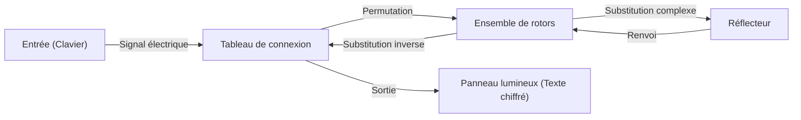

La technologie cryptographique est le fondement de la sécurité de l'information. La sécurité d'Internet, que nous utilisons quotidiennement, repose sur des théories mathématiques extrêmement avancées. Cet article détaille l'histoire et les principes depuis l'ancien chiffre de César, en passant par la bataille autour de la machine de chiffrement Enigma pendant la Seconde Guerre mondiale, jusqu'à la naissance de la cryptographie à clé publique (RSA), l'infrastructure de la société moderne.

## 1. L'aube de la cryptographie : L'évolution de l'Antiquité au Moyen Âge

L'histoire de la cryptographie est ancienne, elle s'est développée pour permettre aux détenteurs du pouvoir de transmettre des secrets militaires et diplomatiques.

### Le chiffre de César (Caesar Cipher)
C'est le chiffre le plus classique de la Rome antique, censé avoir été utilisé par Jules César avant notre ère. Il s'agit d'un type de "chiffrement par substitution" où l'alphabet est décalé d'un certain nombre de caractères (par exemple, 3 lettres). "A" est converti en "D", "B" en "E". Le mécanisme est très simple, mais à une époque où le taux d'alphabétisation était faible, il offrait une confidentialité suffisante.

### Le chiffre de Vigenère (Vigenère Cipher)
Au 16ème siècle, le "chiffrement polyalphabétique" a été inventé par le Français Blaise de Vigenère. Plutôt qu'un décalage unique, c'est un système qui modifie la valeur de décalage pour chaque lettre en utilisant un mot-clé. Ce chiffre a été considéré comme indéchiffrable pendant des centaines d'années, qualifié de "chiffrement impénétrable". Cependant, au 19ème siècle, avec le développement de l'analyse de fréquence par Charles Babbage et Friedrich Kasiski, sa régularité a été découverte.

## 2. Le sommet de la cryptographie mécanique : Le mécanisme et la bataille de la machine Enigma

Au 20ème siècle, avec le développement des technologies de communication, le chiffrement est également entré dans l'ère de la mécanisation. Le summum fut atteint par l'armée allemande avec l'adoption d'"Enigma".

### Structure mécanique et mathématique d'Enigma
Enigma est une machine de chiffrement électromécanique composée d'un clavier, d'un tableau de connexion (plugboard), de plusieurs rotors (disques rotatifs) et d'un réflecteur. À chaque pression sur une touche, les rotors tournent et le circuit change, de sorte que la même lettre saisie est chiffrée différemment à chaque fois.
En particulier, avec la permutation des lettres par le tableau de connexion et la combinaison de plusieurs rotors, son espace de clés (le nombre de combinaisons de réglages) atteignait un nombre astronomique d'environ $1.58 \times 10^{20}$ (158 milliards de milliards).



### Le défi d'Alan Turing et de Bletchley Park
C'est l'équipe de décryptage rassemblée à Bletchley Park, en Angleterre, qui a relevé le défi de cet Enigma "indéchiffrable". La figure centrale de cette équipe était le génie des mathématiques Alan Turing. Turing a amélioré la machine de décryptage polonaise "Bomba" et a développé la "Bombe", un immense ordinateur mécanique qui détectait par force brute les incohérences dans les circuits électriques d'Enigma.
Ils ont remarqué l'existence de phrases standard spécifiques aux communications de l'armée allemande (par exemple : "Heil Hitler" ou le format des prévisions météorologiques) et ont construit un algorithme pour identifier les paramètres initiaux des rotors en utilisant des "Cribs" (textes clairs devinés). On dit que ce décryptage a raccourci la Seconde Guerre mondiale de plusieurs années et sauvé des millions de vies.

## 3. L'aube de la cryptographie à clé publique : La révolution de Diffie et Hellman

Jusqu'alors, tous les chiffrements conventionnels, y compris Enigma, utilisaient la méthode de "cryptographie à clé symétrique". C'est une méthode où la même clé est utilisée pour le chiffrement et le déchiffrement. Cependant, cette méthode présentait un défaut fatal appelé le "problème de distribution des clés". Pour communiquer en toute sécurité avec une personne éloignée, il fallait partager la clé à l'avance de manière sécurisée, ce qui n'était pas pratique pour des réseaux comme Internet où l'on communique avec un grand nombre de personnes non spécifiées.

En 1976, Whitfield Diffie et Martin Hellman ont proposé un concept révolutionnaire : "séparer le chiffrement et le déchiffrement de la clé", la "cryptographie à clé publique".
C'est un système où le chiffrement se fait avec une "clé publique (Public Key)" connue de tous, et le déchiffrement n'est possible qu'avec la "clé privée (Private Key)" que seul le destinataire possède. Cela a éliminé le besoin de partager la clé à l'avance.

## 4. La naissance de la cryptographie RSA et ses principes mathématiques

Bien que Diffie et Hellman aient proposé le concept, ils n'avaient pas encore découvert de fonction spécifique (fonction à sens unique). En 1977, Ronald Rivest (R), Adi Shamir (S) et Leonard Adleman (A) du Massachusetts Institute of Technology (MIT) ont finalement développé un algorithme pratique, la "cryptographie RSA".

### Fondements mathématiques de RSA : Le théorème d'Euler et la factorisation en nombres premiers
La sécurité de la cryptographie RSA repose sur la propriété mathématique selon laquelle "la factorisation en nombres premiers de très grands entiers est extrêmement difficile".

1. **Génération de la clé** :
   - Choisissez deux très grands nombres premiers $p$ et $q$, et calculez $n = p \times q$.
   - Calculez l'indicatrice d'Euler $\phi(n) = (p-1)(q-1)$.
   - Choisissez un entier $e$ premier avec $\phi(n)$ (Clé publique).
   - Calculez $d$ tel que $e \times d \equiv 1 \pmod{\phi(n)}$ (Clé privée).

2. **Chiffrement** :
   Le texte clair $M$ est chiffré en utilisant la clé publique $(e, n)$ pour obtenir le texte chiffré $C$.
   $$C \equiv M^e \pmod{n}$$

3. **Déchiffrement** :
   Le texte chiffré $C$ est déchiffré en utilisant la clé privée $(d, n)$ pour retrouver le texte clair $M$.
   $$M \equiv C^d \pmod{n}$$

Grâce au "théorème d'Euler", qui est une généralisation du petit théorème de Fermat, il est mathématiquement prouvé que ce déchiffrement redonne toujours le texte clair d'origine. Il est considéré comme impossible, même pour les superordinateurs actuels dans un délai réaliste, pour un attaquant de déduire $p$ et $q$ à partir de $n$ (factorisation en nombres premiers).

### Implémentation simplifiée de l'algorithme RSA en Python

Pour comprendre le fonctionnement de RSA, voici un code d'implémentation simplifié en Python utilisant de petits nombres premiers.

```python
import math

def is_prime(n):
    if n < 2: return False
    for i in range(2, int(math.sqrt(n)) + 1):
        if n % i == 0:
            return False
    return True

# 1. Génération des clés
p = 61
q = 53
n = p * q
phi = (p - 1) * (q - 1)

e = 17 # Premier avec phi
# Calcul de l'inverse modulaire (e * d ≡ 1 mod phi)
d = pow(e, -1, phi)

print(f"Clé publique : (e={e}, n={n})")
print(f"Clé privée : (d={d}, n={n})")

# 2. Test de chiffrement et de déchiffrement
message = 65 # Code ASCII de 'A'
print(f"\nMessage original : {message}")

# Chiffrement
ciphertext = pow(message, e, n)
print(f"Texte chiffré : {ciphertext}")

# Déchiffrement
decrypted_message = pow(ciphertext, d, n)
print(f"Message déchiffré : {decrypted_message}")
```

## 5. Conclusion : L'avenir de la cryptographie et la préparation aux ordinateurs quantiques

Du simple décalage de lettres du chiffre de César, à la structure mécanique complexe d'Enigma, jusqu'à la théorie des nombres avancée de la cryptographie RSA, la cryptographie a évolué avec l'histoire de l'humanité.
Cependant, les progrès technologiques ne s'arrêtent pas. Actuellement, des "ordinateurs quantiques" sont en cours de développement, avec le potentiel de résoudre rapidement la factorisation en nombres premiers qui est le fondement de la cryptographie RSA. Si "l'algorithme de Shor" conçu par Peter Shor devient une réalité, on dit que toute la cryptographie à clé publique actuelle sera brisée.

Pour contrer cela, la recherche sur la "cryptographie post-quantique (PQC)" progresse actuellement à un rythme soutenu dans le monde entier. Des technologies cryptographiques de nouvelle génération basées sur de nouveaux problèmes mathématiques complexes, telles que la cryptographie sur les réseaux euclidiens ([lattice-based cryptography](/fr/p/lattice-based-cryptography-math-intuition/)) et la cryptographie multivariée (multivariate cryptography), porteront la sécurité de demain. La bataille du "bouclier et de l'épée" autour de la cryptographie continuera de se dérouler aux avant-postes des mathématiques et de l'informatique.
