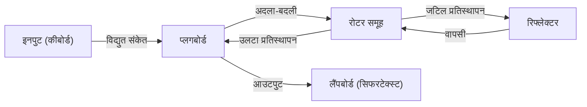

क्रिप्टोग्राफी तकनीक जो सूचना सुरक्षा का आधार है। हम रोज़ाना जिस इंटरनेट का उपयोग करते हैं, उसकी सुरक्षा अत्यधिक उन्नत गणितीय सिद्धांतों द्वारा समर्थित है। इस लेख में, हम प्राचीन सीज़र सिफर (Caesar cipher) से शुरू होकर द्वितीय विश्व युद्ध में एनिग्मा (Enigma) सिफर मशीन के संघर्ष, और आधुनिक समाज के बुनियादी ढांचे, सार्वजनिक-कुंजी क्रिप्टोग्राफी (RSA) के जन्म तक के इतिहास और सिद्धांतों की विस्तार से व्याख्या करेंगे।

## 1. क्रिप्टोग्राफी की शुरुआत: प्राचीन काल से मध्य युग तक का विकास

क्रिप्टोग्राफी का इतिहास पुराना है, और यह शक्तिशाली लोगों द्वारा सैन्य और कूटनीतिक रहस्यों को संप्रेषित करने के लिए विकसित हुआ है।

### सीज़र सिफर (Caesar Cipher)
यह सबसे क्लासिक सिफर है जिसके बारे में कहा जाता है कि ईसा पूर्व प्राचीन रोम में जूलियस सीज़र ने इसका इस्तेमाल किया था। यह 'प्रतिस्थापन सिफर' (substitution cipher) का एक प्रकार है जो वर्णमाला को एक निश्चित संख्या (उदाहरण के लिए 3 अक्षर) से स्थानांतरित करता है। 'A' को 'D' में और 'B' को 'E' में बदल दिया जाता है। तंत्र बहुत सरल है, लेकिन उस समय पर्याप्त गोपनीयता का दावा करता था जब साक्षरता दर कम थी।

### विग्नेयर सिफर (Vigenère Cipher)
16वीं शताब्दी में, फ्रांसीसी ब्लेज़ डी विग्नेयर द्वारा 'पॉलीअल्फाबेटिक सिफर' (polyalphabetic cipher) का आविष्कार किया गया था। यह एक एकल बदलाव के बजाय कीवर्ड का उपयोग करके प्रत्येक अक्षर के लिए शिफ्ट की मात्रा को बदलने का एक तंत्र है। इस सिफर को सैकड़ों वर्षों तक अटूट माना जाता था और इसे 'लौह दीवार सिफर' (iron wall cipher) कहा जाता था। हालांकि, 19वीं सदी में चार्ल्स बैबेज और फ्रेडरिक कासिस्की के आवृत्ति विश्लेषण (frequency analysis) के विकास के साथ इसकी नियमितता का पता चला।

## 2. यांत्रिक सिफर का शिखर: एनिग्मा सिफर मशीन का तंत्र और संघर्ष

20वीं सदी की शुरुआत के साथ, संचार प्रौद्योगिकी के विकास के साथ एन्क्रिप्शन भी मशीनीकरण के युग में प्रवेश कर गया। इसके शिखर पर 'एनिग्मा (Enigma)' का राज था, जिसे जर्मन सेना ने अपनाया था।

### एनिग्मा की यांत्रिक और गणितीय संरचना
एनिग्मा एक इलेक्ट्रो-मैकेनिकल सिफर मशीन है जिसमें एक कीबोर्ड, एक प्लगबोर्ड, कई रोटर (घूमने वाली डिस्क) और एक रिफ्लेक्टर (उलटने वाली डिस्क) शामिल हैं। हर बार एक कुंजी दबाने पर, रोटर घूमता है और सर्किट बदल जाता है, इसलिए एक ही अक्षर दर्ज करने पर भी, यह हर बार एक अलग अक्षर में एन्क्रिप्ट हो जाता है।
विशेष रूप से प्लगबोर्ड द्वारा अक्षरों की अदला-बदली और कई रोटर्स के संयोजन के कारण, इसका मुख्य स्थान (सेटअप संयोजनों की संख्या) लगभग $1.58 \times 10^{20}$ के खगोलीय आंकड़े तक पहुंच गया।



### एलन ट्यूरिंग और बैलेचले पार्क की चुनौती
इस 'अटूट' माने जाने वाले एनिग्मा को ब्रिटेन के बैलेचले पार्क में इकट्ठी हुई क्रिप्टैनालिसिस टीम ने चुनौती दी। उनके केंद्रीय व्यक्ति प्रतिभाशाली गणितज्ञ एलन ट्यूरिंग थे। ट्यूरिंग ने पोलिश सिफर-ब्रेकिंग मशीन 'बॉम्बा' में सुधार किया और 'Bombe' नामक एक विशाल यांत्रिक कंप्यूटर विकसित किया, जो एनिग्मा के विद्युत सर्किट में विसंगतियों का ब्रूट-फोर्स तरीके से पता लगाता था।
उन्होंने इस तथ्य पर ध्यान केंद्रित किया कि जर्मन सैन्य संचार (उदा: 'Heil Hitler' और मौसम पूर्वानुमान प्रारूप) के लिए विशिष्ट निश्चित वाक्यांश मौजूद थे, और क्रिब्स (Crib: अनुमानित प्लेनटेक्स्ट) का उपयोग करके रोटर की प्रारंभिक सेटिंग्स की पहचान करने के लिए एक एल्गोरिदम का निर्माण किया। कहा जाता है कि इस डिक्रिप्शन ने द्वितीय विश्व युद्ध को कई साल छोटा कर दिया और लाखों लोगों की जान बचाई।

## 3. सार्वजनिक-कुंजी क्रिप्टोग्राफी की शुरुआत: डिफी और हेलमैन की क्रांति

एनिग्मा सहित सभी पारंपरिक सिफर 'सममित कुंजी क्रिप्टोग्राफी' (symmetric key cryptography) थे। यह एक ऐसी विधि है जो एन्क्रिप्शन और डिक्रिप्शन के लिए एक ही कुंजी का उपयोग करती है। हालांकि, इस विधि में 'कुंजी वितरण समस्या' (key distribution problem) नामक एक घातक दोष था। दूर बैठे किसी व्यक्ति के साथ सुरक्षित रूप से संवाद करने के लिए, आपको पहले से सुरक्षित तरीके से कुंजी साझा करनी होती थी, जो इंटरनेट जैसे अनिर्दिष्ट संख्या में लोगों के साथ संवाद करने वाले नेटवर्क के लिए व्यावहारिक नहीं थी।

1976 में, व्हिटफील्ड डिफी और मार्टिन हेलमैन ने 'एन्क्रिप्शन और डिक्रिप्शन की कुंजियों को अलग करने' की एक अभूतपूर्व अवधारणा, 'सार्वजनिक-कुंजी क्रिप्टोग्राफी' (public key cryptography) का प्रस्ताव रखा।
यह एक ऐसी प्रणाली है जहां एन्क्रिप्शन एक 'सार्वजनिक कुंजी' (Public Key) से किया जाता है जिसे कोई भी जान सकता है, और डिक्रिप्शन केवल 'निजी कुंजी' (Private Key) का उपयोग करके किया जा सकता है जो केवल प्राप्तकर्ता के पास होता है। इसके कारण, पहले से कुंजी साझा करना अनावश्यक हो गया।

## 4. RSA क्रिप्टोग्राफी का जन्म और गणितीय सिद्धांत

डिफी और हेलमैन ने अवधारणा तो प्रस्तावित की थी, लेकिन वे किसी विशिष्ट फ़ंक्शन (एकतरफ़ा फ़ंक्शन) की खोज नहीं कर पाए थे। 1977 में, मैसाचुसेट्स इंस्टीट्यूट ऑफ टेक्नोलॉजी (MIT) के रोनाल्ड रिवेस्ट (R), अदी शमीर (S), और लियोनार्ड एडेलमैन (A) ने आखिरकार एक व्यावहारिक एल्गोरिदम 'RSA क्रिप्टोग्राफी' विकसित किया।

### RSA का गणितीय आधार: यूलर का प्रमेय और अभाज्य गुणनखंडन
RSA क्रिप्टोग्राफी की सुरक्षा इस गणितीय गुण पर निर्भर करती है कि 'विशाल पूर्णांकों का अभाज्य गुणनखंडन करना बहुत कठिन है'।

1. **कुंजी निर्माण**:
   - 2 विशाल अभाज्य संख्याएँ $p$ और $q$ चुनें, और $n = p \times q$ की गणना करें।
   - यूलर के टॉटिएंट फ़ंक्शन $\phi(n) = (p-1)(q-1)$ की गणना करें।
   - $\phi(n)$ के साथ सह-अभाज्य पूर्णांक $e$ चुनें (सार्वजनिक कुंजी)।
   - $e \times d \equiv 1 \pmod{\phi(n)}$ को संतुष्ट करने वाले $d$ की गणना करें (निजी कुंजी)।

2. **एन्क्रिप्शन**:
   सार्वजनिक कुंजी $(e, n)$ का उपयोग करके प्लेनटेक्स्ट $M$ को एन्क्रिप्ट करें और सिफरटेक्स्ट $C$ प्राप्त करें।
   $$C \equiv M^e \pmod{n}$$

3. **डिक्रिप्शन**:
   निजी कुंजी $(d, n)$ का उपयोग करके सिफरटेक्स्ट $C$ को डिक्रिप्ट करें, और इसे प्लेनटेक्स्ट $M$ में वापस लाएं।
   $$M \equiv C^d \pmod{n}$$

फ़र्मेट की छोटी प्रमेय (Fermat's little theorem) का सामान्यीकरण करने वाले 'यूलर के प्रमेय' (Euler's theorem) द्वारा, यह गणितीय रूप से सिद्ध हो चुका है कि यह डिक्रिप्शन हमेशा मूल प्लेनटेक्स्ट में वापस आएगा। एक हमलावर के लिए $n$ से $p$ और $q$ का पता लगाना (अभाज्य गुणनखंडन) वर्तमान सुपर कंप्यूटर के साथ भी व्यावहारिक समय में असंभव माना जाता है।

### पायथन में RSA एल्गोरिदम का सरल कार्यान्वयन

RSA के तंत्र को समझने के लिए, यहाँ छोटे अभाज्य संख्याओं का उपयोग करके पायथन का सरल कार्यान्वयन कोड दिया गया है।

```python
import math

def is_prime(n):
    if n < 2: return False
    for i in range(2, int(math.sqrt(n)) + 1):
        if n % i == 0:
            return False
    return True

# 1. कुंजी निर्माण
p = 61
q = 53
n = p * q
phi = (p - 1) * (q - 1)

e = 17 # phi के साथ सह-अभाज्य
# मॉड्यूलर व्युत्क्रम की गणना (e * d ≡ 1 mod phi)
d = pow(e, -1, phi)

print(f"सार्वजनिक कुंजी: (e={e}, n={n})")
print(f"निजी कुंजी: (d={d}, n={n})")

# 2. एन्क्रिप्शन और डिक्रिप्शन का परीक्षण
message = 65 # 'A' का ASCII कोड
print(f"\nमूल संदेश: {message}")

# एन्क्रिप्शन
ciphertext = pow(message, e, n)
print(f"सिफरटेक्स्ट: {ciphertext}")

# डिक्रिप्शन
decrypted_message = pow(ciphertext, d, n)
print(f"डिक्रिप्टेड संदेश: {decrypted_message}")
```

## 5. निष्कर्ष: क्रिप्टोग्राफी का भविष्य और क्वांटम कंप्यूटरों की तैयारी

सीज़र सिफर के साधारण अक्षर बदलाव से लेकर, एनिग्मा की जटिल यांत्रिक संरचना, और RSA क्रिप्टोग्राफी के उन्नत संख्या सिद्धांत तक, क्रिप्टोग्राफी मानव इतिहास के साथ विकसित हुई है।
हालाँकि, तकनीकी प्रगति रुकती नहीं है। वर्तमान में, 'क्वांटम कंप्यूटर' का विकास चल रहा है, जिनमें अभाज्य गुणनखंडन को उच्च गति से हल करने की क्षमता है, जो RSA क्रिप्टोग्राफी का मूल है। ऐसा कहा जाता है कि यदि पीटर शोर द्वारा डिज़ाइन किया गया 'शोर का एल्गोरिदम' (Shor's algorithm) वास्तविक बन जाता है, तो वर्तमान सभी सार्वजनिक-कुंजी क्रिप्टोग्राफी टूट जाएंगी।

इसका मुकाबला करने के लिए, 'पोस्ट-क्वांटम क्रिप्टोग्राफी (PQC)' पर शोध वर्तमान में दुनिया भर में तेज गति से चल रहा है। अगली पीढ़ी की क्रिप्टोग्राफी प्रौद्योगिकियां जो नई गणितीय पहेलियों पर आधारित हैं, जैसे कि जाली-आधारित क्रिप्टोग्राफी (lattice-based cryptography) और बहुभिन्नरूपी बहुपद क्रिप्टोग्राफी (multivariate polynomial cryptography), भविष्य की सुरक्षा के लिए जिम्मेदार होंगी। क्रिप्टोग्राफी को लेकर 'ढाल और तलवार' का यह संघर्ष गणित और कंप्यूटर विज्ञान के मोर्चे पर आगे भी जारी रहेगा।
