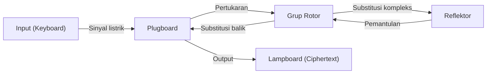

Teknologi kriptografi yang menjadi dasar keamanan informasi. Keamanan internet yang kita gunakan sehari-hari didukung oleh teori matematika yang sangat canggih. Artikel ini akan menjelaskan secara rinci sejarah dan prinsip, mulai dari Sandi Caesar kuno, pertahanan mesin sandi Enigma dalam Perang Dunia II, hingga lahirnya kriptografi kunci publik (RSA) yang merupakan infrastruktur masyarakat modern.

## 1. Awal Mula Kriptografi: Evolusi dari Zaman Kuno hingga Abad Pertengahan

Sejarah kriptografi sangatlah tua, dan telah berkembang bagi penguasa untuk mengkomunikasikan rahasia militer dan diplomatik.

### Sandi Caesar (Caesar Cipher)
Ini adalah sandi paling klasik yang konon digunakan oleh Julius Caesar di Romawi Kuno sebelum Masehi. Ini adalah sejenis "sandi substitusi" (substitution cipher) yang menggeser alfabet dengan jumlah tertentu (misalnya, 3 huruf). "A" diubah menjadi "D", dan "B" menjadi "E". Mekanismenya sangat sederhana, namun membanggakan kerahasiaan yang cukup pada masa ketika tingkat literasi masih rendah.

### Sandi Vigenère (Vigenère Cipher)
Pada abad ke-16, Blaise de Vigenère dari Prancis menemukan "sandi polialfabetik" (polyalphabetic cipher). Alih-alih satu pergeseran tunggal, sistem ini mengubah jumlah pergeseran untuk setiap huruf menggunakan kata kunci. Sandi ini dianggap tidak dapat dipecahkan selama ratusan tahun dan disebut "sandi yang tak tertembus". Namun, pada abad ke-19, seiring perkembangan analisis frekuensi oleh Charles Babbage dan Friedrich Kasiski, keteraturannya akhirnya terungkap.

## 2. Puncak Kriptografi Mekanik: Mekanisme dan Pertahanan Mesin Sandi Enigma

Memasuki abad ke-20, seiring dengan perkembangan teknologi komunikasi, enkripsi juga memasuki era mekanisasi. Di puncak era ini berdirilah "Enigma", yang diadopsi oleh militer Jerman.

### Struktur Mekanik dan Matematika Enigma
Enigma adalah mesin sandi elektromekanis yang terdiri dari keyboard, plugboard, beberapa rotor (piringan berputar), dan reflektor (piringan pembalik). Setiap kali tombol ditekan, rotor berputar dan mengubah sirkuit, sehingga meskipun huruf yang sama diketik, ia akan dienkripsi menjadi huruf yang berbeda setiap saat.
Khususnya, kombinasi dari pertukaran huruf oleh plugboard dan beberapa rotor membuat ruang kuncinya (jumlah kemungkinan pengaturan) mencapai angka astronomis sekitar $1.58 \times 10^{20}$ (158 juta miliar).



### Tantangan Alan Turing dan Bletchley Park
Tim pemecah sandi yang berkumpul di Bletchley Park, Inggris, menantang Enigma yang dianggap "tidak dapat dipecahkan" ini. Tokoh utamanya adalah ahli matematika jenius Alan Turing. Turing menyempurnakan mesin dekripsi Polandia "Bomba" dan mengembangkan komputer mekanik raksasa "Bombe" untuk mendeteksi kontradiksi sirkuit listrik Enigma secara brute force.
Mereka memperhatikan keberadaan frasa standar khusus dalam komunikasi militer Jerman (misalnya, "Heil Hitler" atau format ramalan cuaca), dan membangun algoritme untuk mengidentifikasi pengaturan awal rotor menggunakan "Crib" (teks asli yang ditebak). Pemecahan kode ini dikatakan telah memperpendek Perang Dunia II beberapa tahun dan menyelamatkan jutaan nyawa.

## 3. Fajar Kriptografi Kunci Publik: Revolusi Diffie dan Hellman

Semua kriptografi konvensional, termasuk Enigma, menggunakan sistem "kriptografi kunci simetris" (symmetric-key cryptography). Ini adalah sistem yang menggunakan kunci yang sama untuk enkripsi dan dekripsi. Namun, sistem ini memiliki kelemahan fatal yang disebut "masalah distribusi kunci". Untuk berkomunikasi secara aman dengan pihak yang jauh, kunci harus dibagikan terlebih dahulu dengan metode yang aman, dan ini tidak praktis di jaringan yang berkomunikasi dengan banyak orang yang tidak ditentukan, seperti internet.

Pada tahun 1976, Whitfield Diffie dan Martin Hellman mengusulkan konsep terobosan "memisahkan enkripsi dan dekripsi kunci", yang disebut "kriptografi kunci publik" (public-key cryptography).
Ini adalah sistem di mana enkripsi menggunakan "Kunci Publik" (Public Key) yang dapat diketahui oleh siapa saja, dan dekripsi hanya dapat dilakukan dengan "Kunci Privat" (Private Key) yang hanya dimiliki oleh penerima. Hal ini menghilangkan kebutuhan berbagi kunci di awal.

## 4. Lahirnya Kriptografi RSA dan Prinsip Matematika

Meskipun Diffie dan Hellman mengajukan konsep tersebut, mereka belum menemukan fungsi spesifik (fungsi satu arah). Pada tahun 1977, tiga orang dari Massachusetts Institute of Technology (MIT), yaitu Ronald Rivest (R), Adi Shamir (S), dan Leonard Adleman (A), akhirnya mengembangkan algoritme praktis "kriptografi RSA".

### Dasar Matematika RSA: Teorema Euler dan Faktorisasi Prima
Keamanan kriptografi RSA bergantung pada sifat matematika bahwa "memfaktorkan bilangan bulat yang sangat besar sangatlah sulit".

1. **Pembuatan Kunci**:
   - Pilih dua bilangan prima besar $p$ dan $q$, lalu hitung $n = p \times q$.
   - Hitung fungsi totient Euler $\phi(n) = (p-1)(q-1)$.
   - Pilih bilangan bulat $e$ yang koprima dengan $\phi(n)$ (Kunci publik).
   - Hitung $d$ yang memenuhi $e \times d \equiv 1 \pmod{\phi(n)}$ (Kunci privat).

2. **Enkripsi**:
   Enkripsi plaintext $M$ menggunakan kunci publik $(e, n)$ untuk mendapatkan ciphertext $C$.
   $$C \equiv M^e \pmod{n}$$

3. **Dekripsi**:
   Dekripsi ciphertext $C$ menggunakan kunci privat $(d, n)$ untuk mengembalikannya ke plaintext $M$.
   $$M \equiv C^d \pmod{n}$$

Berdasarkan "Teorema Euler" yang merupakan generalisasi dari Teorema Kecil Fermat, terbukti secara matematis bahwa dekripsi ini akan selalu kembali ke plaintext asli. Mustahil bagi penyerang untuk menemukan $p$ dan $q$ dari $n$ (memfaktorkan bilangan prima) dalam waktu yang realistis bahkan dengan superkomputer saat ini.

### Implementasi Sederhana Algoritme RSA dengan Python

Untuk memahami cara kerja RSA, berikut adalah kode implementasi sederhana dengan Python menggunakan bilangan prima kecil.

```python
import math

def is_prime(n):
    if n < 2: return False
    for i in range(2, int(math.sqrt(n)) + 1):
        if n % i == 0:
            return False
    return True

# 1. Pembuatan Kunci
p = 61
q = 53
n = p * q
phi = (p - 1) * (q - 1)

e = 17 # koprima dengan phi
# Hitung invers modular (e * d ≡ 1 mod phi)
d = pow(e, -1, phi)

print(f"Kunci publik: (e={e}, n={n})")
print(f"Kunci privat: (d={d}, n={n})")

# 2. Pengujian enkripsi dan dekripsi
message = 65 # Kode ASCII untuk 'A'
print(f"\nPesan asli: {message}")

# Enkripsi
ciphertext = pow(message, e, n)
print(f"Ciphertext (teks tersandi): {ciphertext}")

# Dekripsi
decrypted_message = pow(ciphertext, d, n)
print(f"Pesan yang didekripsi: {decrypted_message}")
```

## 5. Kesimpulan: Masa Depan Kriptografi dan Persiapan Menghadapi Komputer Kuantum

Dari pergeseran huruf sederhana pada sandi Caesar, struktur mekanik Enigma yang kompleks, hingga teori bilangan tingkat lanjut dari sandi RSA, kriptografi terus berevolusi bersama sejarah umat manusia.
Namun, kemajuan teknologi tidak akan berhenti. Saat ini, "komputer kuantum", yang memiliki potensi untuk memecahkan faktorisasi prima dengan cepat yang merupakan fondasi kriptografi RSA, sedang dikembangkan. Jika "Algoritme Shor" yang dirancang oleh Peter Shor terwujud, dikatakan bahwa semua kriptografi kunci publik saat ini akan ditembus.

Untuk melawannya, penelitian "kriptografi pasca-kuantum" (Post-Quantum Cryptography/PQC) saat ini sedang berlangsung dengan cepat di seluruh dunia. Teknologi kriptografi generasi berikutnya berdasarkan masalah matematika baru yang sulit, seperti kriptografi berbasis kisi (lattice-based cryptography) dan kriptografi polinomial multivariabel (multivariate polynomial cryptography), akan bertanggung jawab atas keamanan di masa depan. Pertarungan antara "tombak dan perisai" dalam kriptografi akan terus berlangsung di garis depan matematika dan ilmu komputer.
