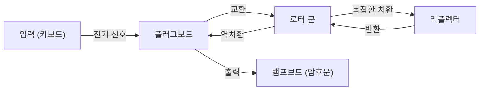

정보 보안의 기초가 되는 암호 기술. 우리가 일상적으로 이용하는 인터넷의 안전성은 고도로 발전된 수학적 이론에 의해 뒷받침되고 있습니다. 본 기사에서는 고대의 시저 암호(Caesar Cipher)에서 시작하여, 제2차 세계대전에서의 에니그마 암호기 공방, 그리고 현대 사회의 인프라인 공개키 암호(RSA)의 탄생에 이르기까지의 역사와 원리를 상세히 해설합니다.

## 1. 암호의 여명기: 고대에서 중세로의 진화

암호의 역사는 오래되었으며, 권력자들이 군사 및 외교상의 기밀을 전달하기 위해 발전해 왔습니다.

### 시저 암호 (Caesar Cipher)
기원전 고대 로마에서 율리우스 카이사르가 사용했다고 전해지는 가장 고전적인 암호입니다. 알파벳을 일정한 수(예를 들어 3글자)만큼 시프트시키는 '단일 치환 암호'의 일종입니다. 'A'는 'D'로, 'B'는 'E'로 변환됩니다. 구조는 매우 단순하지만, 식자율이 낮았던 당시에는 충분한 기밀성을 자랑했습니다.

### 비제네르 암호 (Vigenère Cipher)
16세기가 되면서 프랑스의 블레즈 드 비제네르에 의해 '다중 치환 암호'가 고안되었습니다. 단일 시프트가 아니라 키워드를 사용하여 글자마다 시프트하는 양을 변경하는 구조입니다. 이 암호는 수백 년 동안 해독 불가능하다고 여겨지며 '철벽의 암호'로 불렸습니다. 하지만 19세기에 들어서 찰스 배비지와 프리드리히 카시스키의 빈도 분석 발전으로 그 규칙성이 간파되게 됩니다.

## 2. 기계식 암호의 정점: 에니그마 암호기의 구조와 공방

20세기에 접어들며 통신 기술의 발달과 함께 암호화도 기계화의 시대를 맞이합니다. 그 정점에 군림한 것이 독일군이 채택한 '에니그마(Enigma)'입니다.

### 에니그마의 기계적・수학적 구조
에니그마는 키보드, 플러그보드, 복수의 로터(회전판), 리플렉터(반사판)로 구성된 전기 기계식 암호기입니다. 키를 한 번 누를 때마다 로터가 회전하여 회로가 변하기 때문에 같은 글자를 입력해도 매번 다른 글자로 암호화됩니다.
특히 플러그보드에 의한 문자 교환과 여러 로터의 조합으로 인해 그 키 공간(설정의 조합 수)은 약 $1.58 \times 10^{20}$(1억 5800만 조)이라는 천문학적인 수에 달했습니다.



### 앨런 튜링과 블레츨리 파크의 도전
이 '해독 불가능'으로 여겨졌던 에니그마에 도전한 것이 영국의 블레츨리 파크에 모인 암호 해독 팀입니다. 그 중심 인물이 천재 수학자 앨런 튜링이었습니다. 튜링은 폴란드의 암호 해독기 '봄바(Bomba)'를 개량하여, 에니그마의 전기 회로 모순을 무차별 대입으로 찾아내는 거대한 기계식 컴퓨터 '봄베(Bombe)'를 개발했습니다.
그들은 독일군의 통신에 특유의 정형문(예: 'Heil Hitler'나 일기예보 형식)이 존재한다는 점에 착안하여, 크립(Crib: 추측되는 평문)을 이용해 로터의 초기 설정을 특정하는 알고리즘을 구축했습니다. 이 암호 해독은 제2차 세계대전을 수년 앞당기고 수백만 명의 목숨을 구했다고 알려져 있습니다.

## 3. 공개키 암호의 여명: 디피와 헬만의 혁명

에니그마를 비롯한 기존의 암호는 모두 '대칭키 암호 방식'이었습니다. 이는 암호화와 복호화에 같은 키를 사용하는 방식입니다. 하지만 이 방식에는 '키 분배 문제'라는 치명적인 결함이 있었습니다. 멀리 떨어진 상대와 안전하게 통신하려면 사전에 안전한 방법으로 키를 공유해야 했으며, 인터넷처럼 불특정 다수와 통신하는 네트워크에서는 실용적이지 않았습니다.

1976년, 휘트필드 디피와 마틴 헬만은 '키의 암호화와 복호화를 분리한다'는 획기적인 개념인 '공개키 암호'를 제창했습니다.
누구나 알 수 있는 '공개키(Public Key)'로 암호화하고, 수신자만이 가진 '비밀키(Private Key)'로만 복호화할 수 있는 시스템입니다. 이로써 사전의 키 공유가 필요 없어졌습니다.

## 4. RSA 암호의 탄생과 수학적 원리

디피와 헬만은 개념을 제창했지만, 구체적인 함수(일방향 함수)의 발견에는 이르지 못했습니다. 1977년, 매사추세츠 공과대학교(MIT)의 로널드 리베스트(R), 아디 샤미르(S), 레오나르드 아들만(A) 세 사람이 마침내 실용적인 알고리즘 'RSA 암호'를 개발했습니다.

### RSA의 수학적 기초: 오일러의 정리와 소인수분해
RSA 암호의 안전성은 '거대한 정수의 소인수분해는 매우 어렵다'는 수학적 성질에 의존하고 있습니다.

1. **키 생성**:
   - 두 개의 거대한 소수 $p$와 $q$를 선택하고, $n = p \times q$를 계산합니다.
   - 오일러의 피 함수 $\phi(n) = (p-1)(q-1)$을 계산합니다.
   - $\phi(n)$과 서로소인 정수 $e$를 선택합니다(공개키).
   - $e \times d \equiv 1 \pmod{\phi(n)}$을 만족하는 $d$를 계산합니다(비밀키).

2. **암호화**:
   평문 $M$을 공개키 $(e, n)$을 사용하여 암호화하고 암호문 $C$를 얻습니다.
   $$C \equiv M^e \pmod{n}$$

3. **복호화**:
   암호문 $C$를 비밀키 $(d, n)$을 사용하여 복호화하여 평문 $M$으로 되돌립니다.
   $$M \equiv C^d \pmod{n}$$

[페르마의 소정리](/ko/p/fermats-little-theorem/)를 일반화한 '오일러의 정리'에 의해, 이 복호화가 반드시 원래의 평문으로 돌아가는 것이 수학적으로 증명되어 있습니다. 공격자가 $n$에서 $p$와 $q$를 알아내는(소인수분해하는) 것은 현재의 슈퍼컴퓨터로도 현실적인 시간 내에는 불가능하다고 여겨집니다.

### Python을 활용한 RSA 알고리즘 간단 구현

RSA의 원리를 이해하기 위해 작은 소수를 사용한 Python 간단 구현 코드를 보여줍니다.

```python
import math

def is_prime(n):
    if n < 2: return False
    for i in range(2, int(math.sqrt(n)) + 1):
        if n % i == 0:
            return False
    return True

# 1. 키 생성
p = 61
q = 53
n = p * q
phi = (p - 1) * (q - 1)

e = 17 # phi와 서로소
# 모듈러 역원 계산 (e * d ≡ 1 mod phi)
d = pow(e, -1, phi)

print(f"공개키: (e={e}, n={n})")
print(f"비밀키: (d={d}, n={n})")

# 2. 암호화와 복호화 테스트
message = 65 # 'A'의 ASCII 코드
print(f"\n원래 메시지: {message}")

# 암호화
ciphertext = pow(message, e, n)
print(f"암호문: {ciphertext}")

# 복호화
decrypted_message = pow(ciphertext, d, n)
print(f"복호화된 메시지: {decrypted_message}")
```

## 5. 결론: 암호의 미래와 양자 컴퓨터에 대한 대비

시저 암호의 단순한 문자 시프트부터 에니그마의 복잡한 기계 구조, 그리고 RSA 암호의 고도화된 정수론까지, 암호는 인류의 역사와 함께 진화해 왔습니다.
하지만 기술의 진보는 멈추지 않습니다. 현재 RSA 암호의 근간인 소인수분해를 고속으로 풀어낼 가능성을 지닌 '양자 컴퓨터'의 개발이 진행되고 있습니다. 피터 쇼어가 고안한 '쇼어의 알고리즘'이 실현되면 현재의 공개키 암호는 모두 뚫려버릴 것이라고 합니다.

이에 대항하기 위해 현재 '양자 내성 암호(PQC)' 연구가 전 세계적으로 급피치로 진행되고 있습니다. 격자 기반 암호나 다변수 다항식 암호 등 새로운 수학적 난제를 기반으로 한 차세대 암호 기술이 미래의 보안을 책임지게 될 것입니다. 암호를 둘러싼 '창과 방패'의 공방은 앞으로도 수학과 컴퓨터 과학의 최전선에서 계속될 것입니다.
