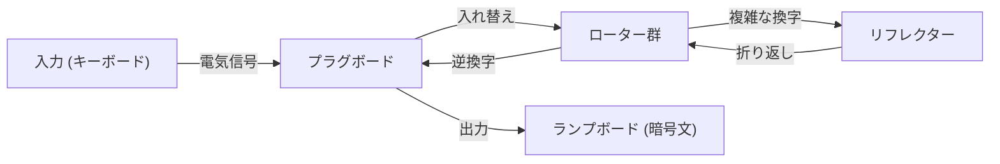

情報セキュリティの基礎となる暗号技術。私たちが日常的に利用しているインターネットの安全性は、極めて高度な数学的理論に支えられています。本記事では、古代のシーザー暗号から始まり、第二次世界大戦におけるエニグマ暗号機の攻防、そして現代社会のインフラである公開鍵暗号（RSA）の誕生に至るまでの歴史と原理を、詳細に解説します。

## 1. 暗号の黎明期：古代から中世への進化

暗号の歴史は古く、権力者たちが軍事・外交上の機密を伝達するために発展してきました。

### シーザー暗号（Caesar Cipher）
紀元前の古代ローマで、ユリウス・カエサルが使用したとされる最も古典的な暗号です。アルファベットを一定の数（例えば3文字）だけシフトさせる「換字式暗号」の一種です。「A」は「D」に、「B」は「E」に変換されます。仕組みは非常に単純ですが、識字率が低かった当時は十分な機密性を誇っていました。

### ヴィジュネル暗号（Vigenère Cipher）
16世紀になると、フランスのブレーズ・ド・ヴィジュネルによって「多表式暗号」が考案されました。単一のシフトではなく、キーワードを用いて文字ごとにシフトする量を変更する仕組みです。この暗号は数百年にわたって解読不能とされ、「鉄壁の暗号」と呼ばれていました。しかし、19世紀になり、チャールズ・バベッジやフリードリヒ・カシスキの頻度分析の発展によって、その規則性が見破られることになります。

## 2. 機械式暗号の頂点：エニグマ暗号機の仕組みと攻防

20世紀に入ると、通信技術の発達とともに暗号化も機械化の時代を迎えます。その頂点に君臨したのが、ドイツ軍が採用した「エニグマ（Enigma）」です。

### エニグマの機械的・数学的構造
エニグマは、キーボード、プラグボード、複数のローター（回転盤）、リフレクター（反転盤）から構成される電気機械式暗号機です。キーを1回押すごとにローターが回転し、回路が変化するため、同じ文字を入力しても毎回異なる文字に暗号化されます。
特にプラグボードによる文字の入れ替えと、複数のローターの組み合わせにより、その鍵空間（設定の組み合わせ数）は約 $1.58 \times 10^{20}$（1億5800万兆）という天文学的な数に達しました。



### アラン・チューリングとブレッチリー・パークの挑戦
この「解読不可能」とされたエニグマに挑んだのが、イギリスのブレッチリー・パークに集められた暗号解読チームです。その中心人物が、天才数学者アラン・チューリングでした。チューリングは、ポーランドの暗号解読機「ボンバ」を改良し、エニグマの電気回路の矛盾を総当たりで検出する巨大な機械式コンピューター「Bombe」を開発しました。
彼らはドイツ軍の通信に特有の定型文（例：「Heil Hitler」や天気予報のフォーマット）が存在することに着目し、クリブ（Crib：推測される平文）を用いてローターの初期設定を特定するアルゴリズムを構築しました。この暗号解読は第二次世界大戦を数年早め、数百万人の命を救ったと言われています。

## 3. 公開鍵暗号の夜明け：ディフィーとヘルマンの革命

エニグマをはじめとする従来の暗号はすべて「共通鍵暗号方式」でした。これは、暗号化と復号に同じ鍵を使用する方式です。しかし、この方式には「鍵配送問題」という致命的な欠陥がありました。遠く離れた相手と安全に通信するには、事前に安全な方法で鍵を共有しなければならず、インターネットのように不特定多数と通信するネットワークでは実用的ではありませんでした。

1976年、ホイットフィールド・ディフィーとマーティン・ヘルマンは、「鍵の暗号化と復号を分離する」という画期的な概念、「公開鍵暗号」を提唱しました。
誰もが知ることのできる「公開鍵（Public Key）」で暗号化し、受信者だけが持つ「秘密鍵（Private Key）」でしか復号できないというシステムです。これにより、事前の鍵共有が不要となりました。

## 4. RSA暗号の誕生と数式的原理

ディフィーとヘルマンは概念を提唱したものの、具体的な関数（一方向性関数）の発見には至っていませんでした。1977年、マサチューセッツ工科大学（MIT）のロナルド・リベスト（R）、アディ・シャミア（S）、レオナルド・エーデルマン（A）の3人が、ついに実用的なアルゴリズム「RSA暗号」を開発しました。

### RSAの数学的基礎：オイラーの定理と素因数分解
RSA暗号の安全性は、「巨大な整数の素因数分解は非常に困難である」という数学的性質に依存しています。

1. **鍵の生成**:
   - 2つの巨大な素数 $p$ と $q$ を選び、$n = p \times q$ を計算します。
   - オイラーのトーティエント関数 $\phi(n) = (p-1)(q-1)$ を計算します。
   - $\phi(n)$ と互いに素な整数 $e$ を選びます（公開鍵）。
   - $e \times d \equiv 1 \pmod{\phi(n)}$ を満たす $d$ を計算します（秘密鍵）。

2. **暗号化**:
   平文 $M$ を公開鍵 $(e, n)$ を用いて暗号化し、暗号文 $C$ を得ます。
   $$C \equiv M^e \pmod{n}$$

3. **復号**:
   暗号文 $C$ を秘密鍵 $(d, n)$ を用いて復号し、平文 $M$ に戻します。
   $$M \equiv C^d \pmod{n}$$

フェルマーの小定理を一般化した「オイラーの定理」により、この復号が必ず元の平文に戻ることが数学的に証明されています。攻撃者が $n$ から $p$ と $q$ を割り出す（素因数分解する）ことは、現在のスーパーコンピューターでも現実的な時間内には不可能とされています。

### PythonによるRSAアルゴリズムの簡易実装

RSAの仕組みを理解するために、小さな素数を用いたPythonの簡易実装コードを示します。

```python
import math

def is_prime(n):
    if n < 2: return False
    for i in range(2, int(math.sqrt(n)) + 1):
        if n % i == 0:
            return False
    return True

# 1. 鍵生成
p = 61
q = 53
n = p * q
phi = (p - 1) * (q - 1)

e = 17 # phiと互いに素
# モジュラ逆数を計算 (e * d ≡ 1 mod phi)
d = pow(e, -1, phi)

print(f"公開鍵: (e={e}, n={n})")
print(f"秘密鍵: (d={d}, n={n})")

# 2. 暗号化と復号のテスト
message = 65 # 'A' のASCIIコード
print(f"\n元のメッセージ: {message}")

# 暗号化
ciphertext = pow(message, e, n)
print(f"暗号文: {ciphertext}")

# 復号
decrypted_message = pow(ciphertext, d, n)
print(f"復号されたメッセージ: {decrypted_message}")
```

## 5. 結び：暗号の未来と量子コンピューターへの備え

シーザー暗号の素朴な文字のシフトから、エニグマの複雑な機械構造、そしてRSA暗号の高度な数論まで、暗号は人類の歴史とともに進化してきました。
しかし、技術の進歩は止まりません。現在、RSA暗号の根幹である素因数分解を高速で解いてしまう可能性を秘めた「量子コンピューター」の開発が進められています。ピーター・ショアが考案した「ショアのアルゴリズム」が実現すれば、現在の公開鍵暗号はすべて破られてしまうと言われています。

これに対抗するため、現在では「耐量子計算機暗号（PQC）」の研究が世界中で急ピッチで進められています。格子暗号や多変数多項式暗号など、新たな数学的難問をベースにした次世代の暗号技術が、未来のセキュリティを担うことになるでしょう。暗号をめぐる「矛と盾」の攻防は、これからも数学とコンピューターサイエンスの最前線で繰り広げられていくのです。
