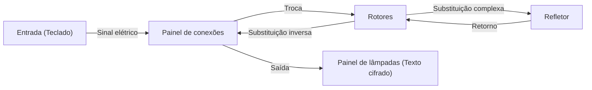

A tecnologia de criptografia forma a base da segurança da informação. A segurança da internet que usamos diariamente é sustentada por teorias matemáticas extremamente avançadas. Neste artigo, explicaremos em detalhes a história e os princípios desde a antiga Cifra de César, passando pela batalha da máquina de criptografia Enigma na Segunda Guerra Mundial, até o nascimento da criptografia de chave pública (RSA), que é a infraestrutura da sociedade moderna.

## 1. Os Primórdios da Criptografia: Da Antiguidade à Idade Média

A história da criptografia é antiga, e ela se desenvolveu para que governantes pudessem transmitir segredos militares e diplomáticos.

### Cifra de César (Caesar Cipher)
É a criptografia mais clássica, que se diz ter sido usada por Júlio César na Roma Antiga, antes de Cristo. É um tipo de "cifra de substituição", onde o alfabeto é deslocado por um número fixo (por exemplo, 3 letras). "A" é convertido em "D", "B" em "E". O mecanismo é muito simples, mas na época, em que a taxa de alfabetização era baixa, orgulhava-se de uma confidencialidade suficiente.

### Cifra de Vigenère (Vigenère Cipher)
No século XVI, a "cifra polialfabética" foi inventada pelo francês Blaise de Vigenère. Em vez de um único deslocamento, é um mecanismo que altera a quantidade de deslocamento para cada letra usando uma palavra-chave. Esta cifra foi considerada indecifrável por centenas de anos e era chamada de "cifra inexpugnável". No entanto, no século XIX, com o desenvolvimento da análise de frequência por Charles Babbage e Friedrich Kasiski, sua regularidade foi descoberta.

## 2. O Ápice da Criptografia Mecânica: A Estrutura e a Batalha da Máquina Enigma

Ao entrar no século XX, com o desenvolvimento da tecnologia de comunicação, a criptografia também entrou na era da mecanização. No topo disso estava a "Enigma", adotada pelos militares alemães.

### A Estrutura Mecânica e Matemática da Enigma
A Enigma é uma máquina de criptografia eletromecânica composta por um teclado, um painel de conexões (plugboard), vários rotores e um refletor. Cada vez que uma tecla é pressionada, o rotor gira e o circuito muda, portanto, mesmo que a mesma letra seja digitada, ela é criptografada em uma letra diferente a cada vez.
Em particular, com a troca de letras pelo painel de conexões e a combinação de vários rotores, seu espaço de chaves (o número de combinações de configurações) atingiu um número astronômico de cerca de $1.58 \times 10^{20}$ (158 quintilhões).



### O Desafio de Alan Turing e Bletchley Park
A equipe de decifradores de códigos reunida em Bletchley Park, no Reino Unido, desafiou esta Enigma que era considerada "indecifrável". A figura central foi o genial matemático Alan Turing. Turing melhorou a máquina decifradora de códigos polonesa "Bomba" e desenvolveu a "Bombe", um computador mecânico gigante que detectava as contradições dos circuitos elétricos da Enigma pela força bruta.
Eles focaram no fato de que frases fixas específicas (por exemplo: "Heil Hitler" ou formatos de previsão do tempo) existiam nas comunicações militares alemãs e construíram um algoritmo para identificar as configurações iniciais do rotor usando Crib (texto simples adivinhado). Diz-se que essa quebra de código encurtou a Segunda Guerra Mundial em vários anos e salvou milhões de vidas.

## 3. O Amanhecer da Criptografia de Chave Pública: A Revolução de Diffie e Hellman

Todas as criptografias tradicionais, incluindo a Enigma, usavam um "sistema de criptografia de chave simétrica". É um sistema que usa a mesma chave para criptografia e descriptografia. No entanto, esse sistema tinha uma falha fatal chamada "problema de distribuição de chaves". Para se comunicar com segurança com uma parte distante, a chave deve ser compartilhada com segurança de antemão, o que não era prático em redes que se comunicam com um grande número de pessoas não especificadas, como a internet.

Em 1976, Whitfield Diffie e Martin Hellman propuseram um conceito inovador de "separar as chaves de criptografia e descriptografia", a "criptografia de chave pública".
É um sistema no qual se criptografa com uma "chave pública (Public Key)" que qualquer um pode saber, e só pode ser descriptografado com uma "chave privada (Private Key)" que apenas o receptor possui. Isso eliminou a necessidade de compartilhamento prévio de chaves.

## 4. O Nascimento e os Princípios Matemáticos da Criptografia RSA

Embora Diffie e Hellman tenham proposto o conceito, eles não haviam chegado à descoberta de uma função específica (função de mão única). Em 1977, Ronald Rivest (R), Adi Shamir (S) e Leonard Adleman (A) do Instituto de Tecnologia de Massachusetts (MIT) finalmente desenvolveram um algoritmo prático, a "Criptografia RSA".

### A Base Matemática do RSA: O Teorema de Euler e a Fatoração em Números Primos
A segurança da criptografia RSA depende da propriedade matemática de que "a fatoração em números primos de inteiros gigantescos é extremamente difícil".

1. **Geração de Chaves**:
   - Escolha dois números primos grandes $p$ e $q$, e calcule $n = p \times q$.
   - Calcule a função totiente de Euler $\phi(n) = (p-1)(q-1)$.
   - Escolha um inteiro $e$ co-primo de $\phi(n)$ (chave pública).
   - Calcule $d$ que satisfaça $e \times d \equiv 1 \pmod{\phi(n)}$ (chave privada).

2. **Criptografia**:
   Criptografe o texto simples $M$ usando a chave pública $(e, n)$ e obtenha o texto cifrado $C$.
   $$C \equiv M^e \pmod{n}$$

3. **Descriptografia**:
   Descriptografe o texto cifrado $C$ usando a chave privada $(d, n)$ e retorne ao texto simples $M$.
   $$M \equiv C^d \pmod{n}$$

Devido ao "Teorema de Euler", que é uma generalização do pequeno teorema de Fermat, é matematicamente provado que essa descriptografia sempre retornará ao texto simples original. É considerado impossível, mesmo para os supercomputadores atuais, descobrir (fatorar em números primos) $p$ e $q$ a partir de $n$ em um tempo realista.

### Implementação Simples do Algoritmo RSA em Python

Para entender o funcionamento do RSA, aqui está um código de implementação simples em Python usando pequenos números primos.

```python
import math

def is_prime(n):
    if n < 2: return False
    for i in range(2, int(math.sqrt(n)) + 1):
        if n % i == 0:
            return False
    return True

# 1. Geração de Chaves
p = 61
q = 53
n = p * q
phi = (p - 1) * (q - 1)

e = 17 # co-primo de phi
# Calcula o inverso modular (e * d ≡ 1 mod phi)
d = pow(e, -1, phi)

print(f"Chave Pública: (e={e}, n={n})")
print(f"Chave Privada: (d={d}, n={n})")

# 2. Teste de Criptografia e Descriptografia
message = 65 # Código ASCII de 'A'
print(f"\nMensagem Original: {message}")

# Criptografia
ciphertext = pow(message, e, n)
print(f"Texto Cifrado: {ciphertext}")

# Descriptografia
decrypted_message = pow(ciphertext, d, n)
print(f"Mensagem Descriptografada: {decrypted_message}")
```

## 5. Conclusão: O Futuro da Criptografia e a Preparação para Computadores Quânticos

Do simples deslocamento de letras da Cifra de César, passando pela complexa estrutura mecânica da Enigma, até a avançada teoria dos números da criptografia RSA, a criptografia evoluiu junto com a história da humanidade.
No entanto, o progresso tecnológico não para. Atualmente, os "computadores quânticos", que têm o potencial de resolver rapidamente a fatoração em números primos - a base da criptografia RSA - estão em desenvolvimento. Diz-se que se o "Algoritmo de Shor" idealizado por Peter Shor for realizado, todas as criptografias de chave pública atuais serão quebradas.

Para combater isso, a pesquisa em "Criptografia Pós-Quântica (PQC)" está avançando rapidamente em todo o mundo. Tecnologias de criptografia de próxima geração baseadas em novos problemas matemáticos difíceis, como criptografia baseada em reticulados e criptografia polinomial multivariável, serão responsáveis pela segurança do futuro. A batalha da "lança e do escudo" sobre a criptografia continuará a se desenrolar na vanguarda da matemática e da ciência da computação.
