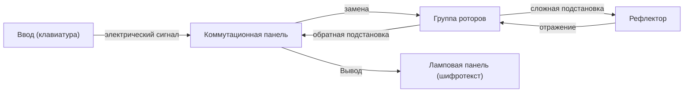

Криптография является основой информационной безопасности. Безопасность интернета, которым мы пользуемся каждый день, поддерживается чрезвычайно сложными математическими теориями. В этой статье мы подробно рассмотрим историю и принципы, начиная от древнего шифра Цезаря, битвы вокруг шифровальной машины "Энигма" во время Второй мировой войны, и заканчивая созданием криптографии с открытым ключом (RSA), которая является инфраструктурой современного общества.

## 1. Зарождение криптографии: эволюция от древности к Средневековью

Криптография имеет давнюю историю и развивалась для того, чтобы правители могли передавать военные и дипломатические секреты.

### Шифр Цезаря (Caesar Cipher)
Считается, что это самый классический шифр, который использовал Юлий Цезарь в Древнем Риме еще до нашей эры. Это разновидность "шифра подстановки", при котором алфавит сдвигается на определенное число (например, на 3 буквы). Буква "A" преобразуется в "D", а "B" — в "E". Механизм очень прост, но в то время, когда уровень грамотности был низким, он обеспечивал достаточную секретность.

### Шифр Виженера (Vigenère Cipher)
В XVI веке француз Блез де Виженер изобрел "полиалфавитный шифр". Вместо одного сдвига используется ключевое слово для изменения величины сдвига каждой отдельной буквы. На протяжении сотен лет этот шифр считался неразрешимым и назывался "непробиваемым шифром". Однако в XIX веке благодаря развитию частотного анализа Чарльзом Бэббиджем и Фридрихом Касиски его закономерности были раскрыты.

## 2. Вершина механической криптографии: устройство и битва за Энигму

С наступлением XX века и развитием технологий связи шифрование вступило в эру механизации. Вершиной стала "Энигма" (Enigma), принятая на вооружение немецкими военными.

### Механическая и математическая структура Энигмы
Энигма — это электромеханическая шифровальная машина, состоящая из клавиатуры, коммутационной панели, нескольких роторов (вращающихся дисков) и рефлектора (отражающего диска). При каждом нажатии клавиши роторы поворачиваются, и цепь изменяется, поэтому даже при вводе одной и той же буквы каждый раз она шифруется по-разному.
В частности, благодаря замене букв с помощью коммутационной панели и комбинации нескольких роторов, пространство ключей (количество возможных настроек) достигло астрономического числа около $1.58 \times 10^{20}$ (158 квинтиллионов).



### Вызов Алана Тьюринга и Блетчли-парка
Задачу взлома считавшейся "неуязвимой" Энигмы взяла на себя команда криптоаналитиков, собранная в Блетчли-парке в Великобритании. Центральной фигурой был гениальный математик Алан Тьюринг. Тьюринг усовершенствовал польскую криптоаналитическую машину "Бомба" и создал "Bombe" — гигантский механический компьютер для выявления противоречий в электрических цепях Энигмы методом полного перебора.
Они заметили наличие стандартных фраз (например, "Heil Hitler" или форматы прогноза погоды), характерных для немецких военных сообщений, и разработали алгоритм определения начальных настроек роторов с использованием криба (Crib: предполагаемого открытого текста). Считается, что этот взлом сократил Вторую мировую войну на несколько лет и спас миллионы жизней.

## 3. Рассвет криптографии с открытым ключом: революция Диффи и Хеллмана

Все предыдущие шифры, включая Энигму, относились к "симметричным криптосистемам". В этом методе для шифрования и расшифровки используется один и тот же ключ. Однако у этого метода был фатальный недостаток — "проблема распределения ключей". Чтобы безопасно общаться с кем-то на расстоянии, необходимо было заранее безопасно передать ключ, что делало его непрактичным в сетях типа интернета, где общение происходит с неопределенным множеством лиц.

В 1976 году Уитфилд Диффи и Мартин Хеллман предложили революционную концепцию "криптографии с открытым ключом", которая "разделяла ключи для шифрования и расшифровки".
Это система, в которой шифрование выполняется с помощью "открытого ключа" (Public Key), который может быть известен всем, а расшифровать сообщение можно только с помощью "закрытого ключа" (Private Key), который есть только у получателя. Это устранило необходимость в предварительном обмене ключами.

## 4. Создание алгоритма RSA и его математические принципы

Хотя Диффи и Хеллман предложили концепцию, конкретную функцию (одностороннюю функцию) они не нашли. В 1977 году трое ученых из Массачусетского технологического института (MIT) — Рональд Ривест (R), Ади Шамир (S) и Леонард Адлеман (A) — наконец, разработали практический алгоритм "шифрование RSA".

### Математические основы RSA: теорема Эйлера и факторизация
Безопасность шифрования RSA основана на математическом свойстве: "факторизация огромных целых чисел является чрезвычайно сложной задачей".

1. **Генерация ключей**:
   - Выбираются два больших простых числа $p$ и $q$, и вычисляется $n = p \times q$.
   - Вычисляется функция Эйлера $\phi(n) = (p-1)(q-1)$.
   - Выбирается целое число $e$, взаимно простое с $\phi(n)$ (открытый ключ).
   - Вычисляется $d$, удовлетворяющее условию $e \times d \equiv 1 \pmod{\phi(n)}$ (закрытый ключ).

2. **Шифрование**:
   Открытый текст $M$ шифруется с использованием открытого ключа $(e, n)$ для получения шифротекста $C$.
   $$C \equiv M^e \pmod{n}$$

3. **Расшифровка**:
   Шифротекст $C$ расшифровывается с использованием закрытого ключа $(d, n)$, возвращаясь к открытому тексту $M$.
   $$M \equiv C^d \pmod{n}$$

Благодаря "теореме Эйлера", которая является обобщением малой теоремы Ферма, математически доказано, что эта расшифровка всегда вернет исходный текст. Считается, что злоумышленник не сможет найти $p$ и $q$ из $n$ (разложить на множители) за разумное время, даже используя современные суперкомпьютеры.

### Простая реализация алгоритма RSA на Python

Чтобы понять, как работает RSA, ниже представлена простая реализация на Python с использованием небольших простых чисел.

```python
import math

def is_prime(n):
    if n < 2: return False
    for i in range(2, int(math.sqrt(n)) + 1):
        if n % i == 0:
            return False
    return True

# 1. Генерация ключей
p = 61
q = 53
n = p * q
phi = (p - 1) * (q - 1)

e = 17 # Взаимно простое с phi
# Вычисление модульного обратного (e * d ≡ 1 mod phi)
d = pow(e, -1, phi)

print(f"Открытый ключ: (e={e}, n={n})")
print(f"Закрытый ключ: (d={d}, n={n})")

# 2. Тестирование шифрования и расшифровки
message = 65 # ASCII код для 'A'
print(f"\nИсходное сообщение: {message}")

# Шифрование
ciphertext = pow(message, e, n)
print(f"Шифротекст: {ciphertext}")

# Расшифровка
decrypted_message = pow(ciphertext, d, n)
print(f"Расшифрованное сообщение: {decrypted_message}")
```

## 5. Заключение: будущее криптографии и подготовка к квантовым компьютерам

От простого сдвига букв в шифре Цезаря, сложных механических структур Энигмы, и до продвинутой теории чисел в RSA — криптография эволюционировала вместе с историей человечества.
Однако технологический прогресс не стоит на месте. В настоящее время разрабатываются "квантовые компьютеры", обладающие потенциалом быстро решать задачи факторизации, на которых основан алгоритм RSA. Считается, что если "алгоритм Шора", придуманный Питером Шором, будет реализован на практике, то вся современная криптография с открытым ключом будет взломана.

Для противодействия этому, в настоящее время по всему миру ускоренными темпами ведутся исследования в области "постквантовой криптографии (PQC)". Технологии следующего поколения, основанные на новых сложных математических задачах, такие как криптография на решетках или многомерная полиномиальная криптография, станут основой безопасности будущего. Битва "меча и щита" вокруг шифрования и дальше будет разворачиваться на переднем крае математики и информатики.
