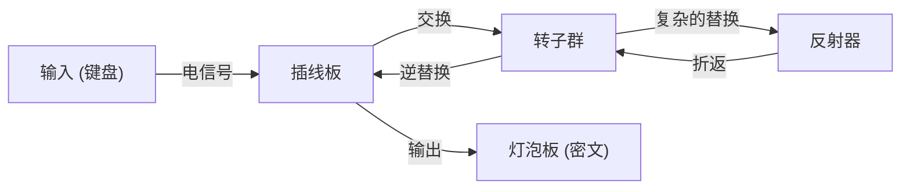

密码技术是信息安全的基础。我们日常使用的互联网安全性，是由极其高深的数学理论所支撑的。本文将从古代的凯撒密码开始，详细解说第二次世界大战中恩尼格玛（Enigma）密码机的攻防，以及作为现代社会基础设施的公钥密码学（RSA）诞生的历史与原理。

## 1. 密码学的黎明期：从古代到中世的演进

密码学的历史悠久，掌权者为了传递军事和外交上的机密而发展了它。

### 凯撒密码（Caesar Cipher）
公元前的古罗马，由朱利叶斯·凯撒（Julius Caesar）使用，被认为是最古老的密码。这是一种将字母移动固定位数（例如3个字符）的“替换式密码”。“A”转换为“D”，“B”转换为“E”。虽然机制非常简单，但在识字率较低的当时，足以保证充分的机密性。

### 维吉尼亚密码（Vigenère Cipher）
到了16世纪，法国的布莱斯·德·维吉尼亚（Blaise de Vigenère）发明了“多表密码”。它不使用单一的偏移，而是使用一个关键字，根据关键字逐个改变字母的偏移量。这种密码在数百年间被认为无法破解，被称为“铁壁密码”。然而，到了19世纪，随着查尔斯·巴贝奇（Charles Babbage）和弗里德里希·卡西斯基（Friedrich Kasiski）在频率分析方面的发展，其规律性被揭穿。

## 2. 机械式密码的巅峰：恩尼格玛密码机的机制与攻防

进入20世纪，随着通信技术的发展，密码也迎来了机械化时代。君临其顶点的，是德国军队采用的“恩尼格玛（Enigma）”。

### 恩尼格玛的机械与数学结构
恩尼格玛是一台由键盘、插线板（Plugboard）、多个转子（Rotor）和反射器（Reflector）组成的机电式密码机。每按一次键，转子就会旋转，电路随之改变，因此即使输入相同的字符，每次也会被加密成不同的字符。
特别是通过插线板的字符交换以及多个转子的组合，其密钥空间（设置的组合数）达到了约 $1.58 \times 10^{20}$（1亿5800万兆）这个天文数字。



### 艾伦·图灵与布莱切利园的挑战
挑战这台被认为“不可破解”的恩尼格玛的，是聚集在英国布莱切利园（Bletchley Park）的密码破解团队。其核心人物是天才数学家艾伦·图灵（Alan Turing）。图灵改良了波兰的密码破解机“Bomba”，开发出了能够通过暴力破解检测恩尼格玛电路矛盾的巨型机械式计算机“Bombe”。
他们注意到德军通信中存在特有的固定短语（例如：“Heil Hitler”或天气预报的格式），并构建了利用Crib（推测的明文）来确定转子初始设置的算法。据说这项密码破解让第二次世界大战提前数年结束，拯救了数百万人的生命。

## 3. 公钥密码学的黎明：迪菲与赫尔曼的革命

包括恩尼格玛在内的传统密码都属于“对称密钥加密方式”。这是一种加密和解密使用相同密钥的方式。然而，这种方式存在一个致命的缺陷，即“密钥分发问题”。为了与远方的对方安全地通信，必须事先通过安全的方法共享密钥，在像互联网这样与不特定多数人通信的网络中，这是不实用的。

1976年，惠特菲尔德·迪菲（Whitfield Diffie）和马丁·赫尔曼（Martin Hellman）提出了“分离密钥加密和解密”这一划时代的概念，即“公钥密码学”。
在这个系统中，使用任何人都可以知道的“公钥（Public Key）”进行加密，只有拥有该“私钥（Private Key）”的接收者才能解密。这消除了事先共享密钥的需要。

## 4. RSA密码的诞生与数学原理

虽然迪菲和赫尔曼提出了这个概念，但他们还没有找到具体的函数（单向函数）。1977年，麻省理工学院（MIT）的罗纳德·李维斯特（Ronald Rivest，R）、阿迪·萨莫尔（Adi Shamir，S）和伦纳德·阿德曼（Leonard Adleman，A）三人，终于开发出了实用的算法——“RSA密码”。

### RSA的数学基础：欧拉定理与素因数分解
RSA密码的安全性依赖于这样一个数学性质：“对巨大的整数进行素因数分解是非常困难的”。

1. **密钥生成**:
   - 选择两个巨大的素数 $p$ 和 $q$，计算 $n = p \times q$。
   - 计算欧拉函数 $\phi(n) = (p-1)(q-1)$。
   - 选择一个与 $\phi(n)$ 互素的整数 $e$（公钥）。
   - 计算满足 $e \times d \equiv 1 \pmod{\phi(n)}$ 的 $d$（私钥）。

2. **加密**:
   使用公钥 $(e, n)$ 对明文 $M$ 进行加密，得到密文 $C$。
   $$C \equiv M^e \pmod{n}$$

3. **解密**:
   使用私钥 $(d, n)$ 对密文 $C$ 进行解密，恢复为明文 $M$。
   $$M \equiv C^d \pmod{n}$$

由于费马小定理的推广形式“欧拉定理”，在数学上证明了这种解密必定能恢复出原来的明文。攻击者想从 $n$ 推算出 $p$ 和 $q$（素因数分解），即使是使用现在的超级计算机，在现实时间内也是不可能的。

### Python实现的RSA算法简易示例

为了理解RSA的机制，下面展示了使用较小素数的Python简易实现代码。

```python
import math

def is_prime(n):
    if n < 2: return False
    for i in range(2, int(math.sqrt(n)) + 1):
        if n % i == 0:
            return False
    return True

# 1. 密钥生成
p = 61
q = 53
n = p * q
phi = (p - 1) * (q - 1)

e = 17 # 与phi互素
# 计算模逆元 (e * d ≡ 1 mod phi)
d = pow(e, -1, phi)

print(f"公钥: (e={e}, n={n})")
print(f"私钥: (d={d}, n={n})")

# 2. 加密与解密测试
message = 65 # 'A' 的ASCII码
print(f"\n原始消息: {message}")

# 加密
ciphertext = pow(message, e, n)
print(f"密文: {ciphertext}")

# 解密
decrypted_message = pow(ciphertext, d, n)
print(f"解密后的消息: {decrypted_message}")
```

## 5. 结语：密码学的未来与应对量子计算机的准备

从凯撒密码简单的字符偏移，到恩尼格玛复杂的机械结构，再到RSA密码高深的数论，密码学伴随着人类的历史不断演进。
然而，技术的进步不会停止。目前，有潜力高速解决RSA密码核心即素因数分解问题的“量子计算机”正在开发中。一旦彼得·秀尔（Peter Shor）提出的“秀尔算法”得以实现，据说现有的公钥密码系统将全部被攻破。

为了对抗这种情况，目前世界各地正加紧推进“抗量子计算密码（PQC）”的研究。基于格密码或多变量多项式密码等新的数学难题的下一代密码技术，将肩负起未来安全的重任。围绕密码学“矛与盾”的攻防，今后也将继续在数学与计算机科学的最前沿展开。
