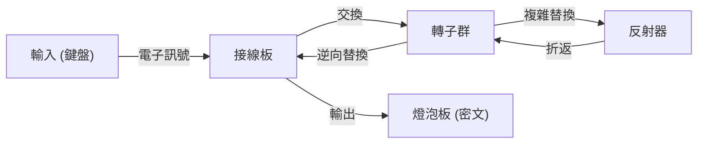

作為資訊安全基礎的密碼技術。我們日常使用的網際網路安全性，是建立在極其高度的數學理論之上。本文將從古代的凱撒密碼開始，詳細解說第二次世界大戰中恩尼格瑪（Enigma）密碼機的攻防，以及作為現代社會基礎設施的公開金鑰密碼（RSA）誕生的歷史與原理。

## 1. 密碼學的黎明期：從古代到中世紀的演進

密碼的歷史悠久，是為了讓掌權者傳遞軍事與外交上的機密而發展起來的。

### 凱撒密碼（Caesar Cipher）
這是西元前古羅馬時期，據傳由儒略·凱撒（Julius Caesar）所使用的最古典的密碼。它是將字母位移一定數量（例如3個字母）的一種「替換式密碼」。「A」會轉換為「D」，「B」會轉換為「E」。雖然機制非常簡單，但在識字率低下的當時，已具備了充分的機密性。

### 維吉尼亞密碼（Vigenère Cipher）
到了16世紀，法國的布萊斯·德·維吉尼亞（Blaise de Vigenère）發明了「多表密碼」。它不是單一的位移，而是使用關鍵字來改變每個字母的位移量。這種密碼在數百年間被認為是無法破解的，被稱為「堅不可摧的密碼」。然而，到了19世紀，隨著查爾斯·巴貝奇（Charles Babbage）和弗里德里希·卡西斯基（Friedrich Kasiski）在頻率分析方面的發展，其規律性終被識破。

## 2. 機械式密碼的頂峰：恩尼格瑪密碼機的機制與攻防

進入20世紀後，隨著通訊技術的發達，密碼化也迎來了機械化時代。而君臨其頂點的，便是德國軍隊所採用的「恩尼格瑪（Enigma）」。

### 恩尼格瑪的機械與數學結構
恩尼格瑪是由鍵盤、接線板、多個轉子（旋轉盤）以及反射器（反轉盤）所組成的機電式密碼機。每按一次按鍵，轉子就會旋轉，電路也會隨之改變，因此即使輸入相同的字母，每次也會被加密成不同的字母。
特別是由於接線板的字母交換，以及多個轉子的組合，其金鑰空間（設定的組合數量）達到了約 $1.58 \times 10^{20}$（1億5800萬兆）這種天文數字。



### 艾倫·圖靈與布萊切利園的挑戰
挑戰這台被認為「無法破解」的恩尼格瑪的，是聚集在英國布萊切利園（Bletchley Park）的密碼破解團隊。其核心人物就是天才數學家艾倫·圖靈（Alan Turing）。圖靈改良了波蘭的密碼破解機「Bomba」，開發出了透過暴力破解來偵測恩尼格瑪電路矛盾的巨大機械式電腦「Bombe」。
他們注意到德軍通訊中存在特有的固定格式（例如：'Heil Hitler'或天氣預報格式），便利用已知明文（Crib：推測的明文）建構出找出轉子初始設定的演算法。據說這項密碼破解工作讓第二次世界大戰提早幾年結束，並拯救了數百萬人的生命。

## 3. 公開金鑰密碼的黎明：迪菲與赫爾曼的革命

以恩尼格瑪為首的傳統密碼，全都是「對稱金鑰密碼系統」。這是一種在加密和解密時使用相同金鑰的系統。然而，這種系統有著被稱為「金鑰配送問題」的致命缺陷。為了與遠方的對象進行安全通訊，必須事先以安全的方式共享金鑰，這在像網際網路這樣與不特定多數人通訊的網路中並不實用。

1976年，惠特菲爾德·迪菲（Whitfield Diffie）與馬丁·赫爾曼（Martin Hellman）提出了「將加密與解密金鑰分離」的劃時代概念，即「公開金鑰密碼」。
這是一種使用任何人都能知道的「公開金鑰（Public Key）」進行加密，且只有接收者擁有的「私鑰（Private Key）」才能解密的系統。這使得事先的金鑰共享變得不再需要。

## 4. RSA密碼的誕生與數學原理

雖然迪菲與赫爾曼提出了這個概念，但尚未發現具體的函數（單向函數）。1977年，麻省理工學院（MIT）的羅納德·李維斯特（Ron Rivest，R）、阿迪·薩莫爾（Adi Shamir，S）和倫納德·阿德曼（Leonard Adleman，A）三人，終於開發出了實用的演算法「RSA密碼」。

### RSA的數學基礎：尤拉定理與質因數分解
RSA密碼的安全性，依賴於「巨大整數的質因數分解非常困難」這個數學性質。

1. **金鑰產生**:
   - 選擇兩個巨大的質數 $p$ 和 $q$，並計算 $n = p \times q$。
   - 計算尤拉商數 $\phi(n) = (p-1)(q-1)$。
   - 選擇一個與 $\phi(n)$ 互質的整數 $e$（公開金鑰）。
   - 計算滿足 $e \times d \equiv 1 \pmod{\phi(n)}$ 的 $d$（私鑰）。

2. **加密**:
   使用公開金鑰 $(e, n)$ 將明文 $M$ 加密，得到密文 $C$。
   $$C \equiv M^e \pmod{n}$$

3. **解密**:
   使用私鑰 $(d, n)$ 將密文 $C$ 解密，還原回明文 $M$。
   $$M \equiv C^d \pmod{n}$$

透過將費馬小定理推廣的「尤拉定理」，在數學上證明了這樣的解密必定能還原回原本的明文。要讓攻擊者從 $n$ 反推出 $p$ 和 $q$（即質因數分解），即使使用現代的超級電腦，在現實時間內也是不可能的。

### 使用 Python 實作 RSA 演算法的簡易範例

為了理解 RSA 的機制，以下展示使用小質數的 Python 簡易實作程式碼。

```python
import math

def is_prime(n):
    if n < 2: return False
    for i in range(2, int(math.sqrt(n)) + 1):
        if n % i == 0:
            return False
    return True

# 1. 金鑰產生
p = 61
q = 53
n = p * q
phi = (p - 1) * (q - 1)

e = 17 # 與 phi 互質
# 計算模逆元 (e * d ≡ 1 mod phi)
d = pow(e, -1, phi)

print(f"公開金鑰: (e={e}, n={n})")
print(f"私鑰: (d={d}, n={n})")

# 2. 加密與解密測試
message = 65 # 'A' 的 ASCII 碼
print(f"\n原始訊息: {message}")

# 加密
ciphertext = pow(message, e, n)
print(f"密文: {ciphertext}")

# 解密
decrypted_message = pow(ciphertext, d, n)
print(f"解密後的訊息: {decrypted_message}")
```

## 5. 結語：密碼的未來與對量子電腦的防備

從凱撒密碼樸素的字母位移，到恩尼格瑪複雜的機械結構，再到RSA密碼高度的數論，密碼學一直伴隨著人類的歷史發展。
然而，技術的進步不會停止。目前，潛藏著能高速解開作為RSA密碼根基的質因數分解可能性的「量子電腦」，其開發正在持續進行中。一旦彼得·秀爾（Peter Shor）提出的「秀爾演算法（Shor's algorithm）」得以實現，據說現今所有的公開金鑰密碼都將被破解。

為了對抗這一點，目前世界各地正馬不停蹄地進行「後量子密碼學（PQC）」的研究。以格密碼或多變數多項式密碼等新的數學難題為基礎的次世代密碼技術，將會肩負起未來的安全防護。圍繞著密碼的「矛與盾」的攻防，今後也將在數學與電腦科學的最前線持續上演。
