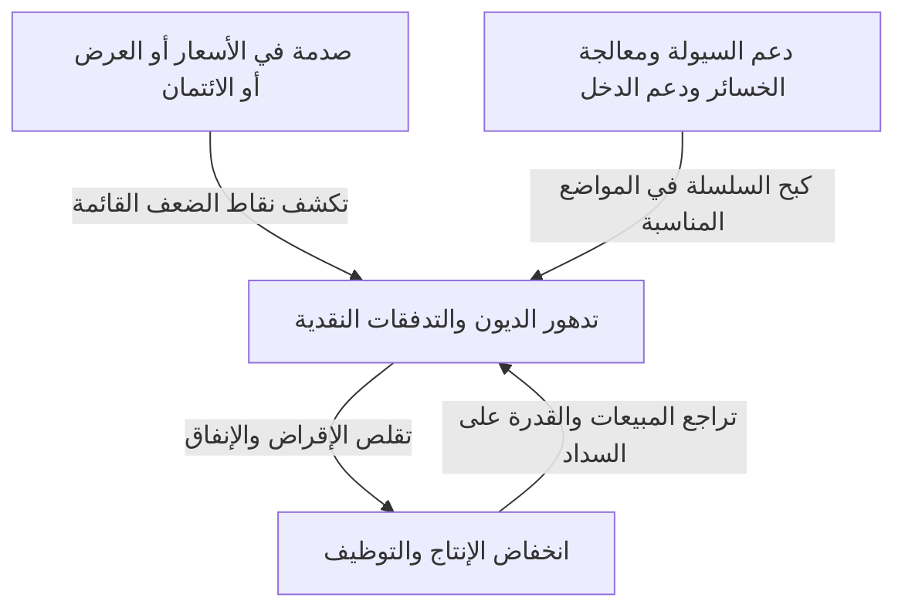
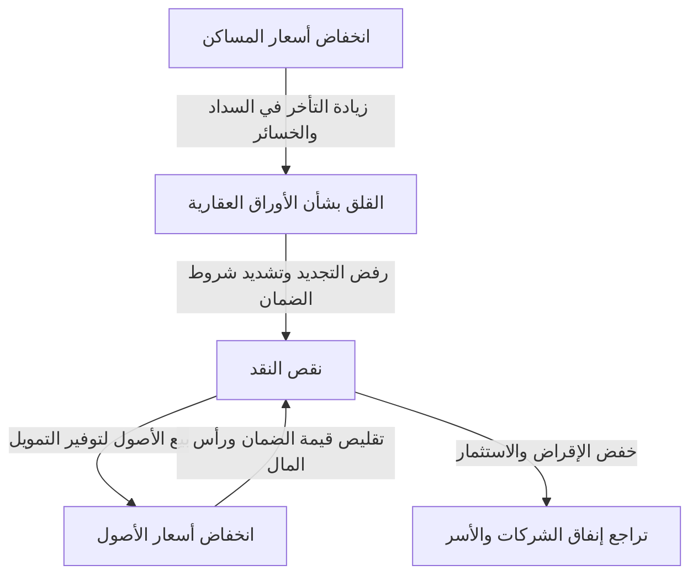

عندما تسمع عن انهيار ليمان، قد تتخيل إفلاس البنوك وانهيار أسعار الأسهم وازدياد البطالة كأنها حادثة واحدة. ولكن كيف أدى إفلاس شركة واحدة إلى خفض إنتاج المصانع وانخفاض دخول الأسر في أنحاء العالم؟ ولماذا لم يؤد انهيار الأسهم يوم الاثنين الأسود عام 1987 إلى النتيجة نفسها التي أعقبت الكساد الكبير في ثلاثينيات القرن العشرين؟

لفهم الصدمات الاقتصادية، لا يكفي حفظ أسماء الأحداث وتواريخها. ما الذي تغير أولاً؟ وما نقاط الضعف التي تراكمت قبله؟ ومن أي جهة إلى أي جهة انتقلت الخسائر أو المخاوف؟ إن فصل هذه الأسئلة الثلاثة يتيح تتبع تاريخ يبدو معقداً بوصفه سلسلة من العلاقات السببية.

يتناول هذا المقال 16 حدثاً بارزاً بين عامي 1929 و2023. وهي أمثلة مختارة لمقارنة آليات مختلفة، وليست تسلسلاً زمنياً يشمل أزمات جميع البلدان والمناطق. ونستخدم تعبير «الصدمة الاقتصادية» بمعناه الواسع، الذي يشمل الأزمات المالية والتغيرات المفاجئة في إمدادات الطاقة والأوبئة وتبدل أنظمة العملات. وعندما تختلف الأبحاث حول أسباب أزمة، لا نعامل تفسيراً واحداً باعتباره الحقيقة الوحيدة.

## البداية: الفرق بين الصدمة والأزمة

الصدمة حدث يغير فجأة الافتراضات التي يقوم عليها الاقتصاد، مثل توقف وصول النفط أو انخفاض أسعار المساكن أو سحب المستثمرين الأجانب أموالهم. أما الأزمة فهي حالة تعجز فيها المؤسسات القائمة وترتيبات التمويل عن امتصاص هذا التغير، فتختل الأسس التي يقوم عليها النشاط الاقتصادي.

يشبه الأمر التمييز بين الإعصار نفسه وضعف السدود وانتشار مياه الفيضان. غير أن ما يعادل السدود في الاقتصاد يتغير أيضاً بتغير قرارات البشر. فإذا قلصت البنوك الإقراض لحماية نفسها، فقد تفلس شركات وتزداد خسائر البنوك. وهكذا يمكن لسلوك دفاعي عقلاني لكل فرد أن يفاقم الأزمة على مستوى الجميع.

في صدمة الطلب، ينخفض الإنفاق على الشراء والاستثمار. وفي صدمة العرض، يؤدي نقص المواد الخام أو العمالة إلى تقليص الإنتاج الممكن أو زيادة تكلفته. أما الصدمة المالية فتضر بوظيفة الوساطة التمويلية واستمرار المدفوعات. وفي الأزمات الفعلية، تتداخل هذه الأنواع وقد تتغير طبيعة الأزمة أثناء تطورها.

لا تعمل الأسهم في الرسم دائماً بالقوة نفسها. فرأس المال الكافي والتمويل المستقر والمؤسسات الموثوقة يمكن أن تحد من انتقال الخسائر. وفي المقابل، قد تتحول ترتيبات تبدو فعالة في الظروف العادية إلى نقاط ضعف متزامنة في الظروف الشديدة.

## جدول مقارن لفهم الصورة العامة

| الفترة | الحدث | نقطة الضعف أو آلية الانتقال الرئيسية |
| --- | --- | --- |
| 1929 وثلاثينيات القرن العشرين | الكساد الكبير | الهلع المصرفي وانكماش الائتمان والانكماش السعري وقيود قاعدة الذهب |
| 1971 | صدمة نيكسون | تراجع الثقة في تحويل الدولار إلى ذهب وتغير النظام النقدي |
| 1973–1974 | أزمة النفط الأولى | تغير مفاجئ في الإمدادات والأسعار وخروج الدخل من الدول المستوردة |
| نحو 1978–1982 | أزمة النفط الثانية والتشديد النقدي | مخاوف العرض وتوقعات التضخم والتكيف مع الفائدة المرتفعة |
| منذ 1982 | أزمة ديون أمريكا اللاتينية | ديون بالعملات الأجنبية وفائدة متغيرة ونقص الإيرادات الأجنبية |
| 1987 | الاثنين الأسود | تداولات في اتجاه واحد ومشكلات سيولة الأسواق والتسوية |
| تسعينيات القرن العشرين | انفجار فقاعة اليابان | انخفاض الضمانات والقروض المتعثرة وطول فترة سداد الديون |
| 1994–1995 | أزمة العملة المكسيكية | انعكاس تدفقات رأس المال والديون القصيرة وأعباء السداد المرتبطة بالدولار |
| 1997–1998 | الأزمة الآسيوية | عدم تطابق العملات والآجال وخروج رأس المال والأزمات المصرفية |
| 1998 | أزمة روسيا وأزمة LTCM | مخاوف الدين الحكومي واللجوء إلى الأمان والرافعة المالية |
| نحو 2000–2002 | انفجار فقاعة الإنترنت | تعديل توقعات الأرباح وتراجع التمويل بالأسهم والاستثمار الرأسمالي |
| 2007–2009 | الأزمة المالية العالمية وانهيار ليمان | الائتمان العقاري والتوريق والانسحاب الجماعي من التمويل القصير |
| أوائل العقد الثاني من القرن الحالي | أزمة الديون الأوروبية | الترابط بين ائتمان البنوك والحكومات وضعف مؤسسات الاتحاد النقدي |
| 2020 | صدمة كورونا | توقف متزامن للطلب والعرض بسبب العدوى وتغير السلوك |
| منذ 2021–2022 | صدمة التضخم والطاقة | تعافي الطلب وقيود العرض واضطراب أسواق الموارد بسبب الحرب |
| 2023 | الاضطرابات المصرفية الأمريكية | مخاطر الفائدة وتركيز الودائع والخروج السريع للأموال |

تشير الفترات إلى أوقات تتضح فيها سمات كل أزمة، وليست فترات ركود موحدة للعالم كله. فبداية الركود الأمريكي وقاع الدورة الاقتصادية اليابانية وأدنى مستوى للأسهم لا تتزامن بالضرورة. كما تختلف دلالة عبارة «انتهت الأزمة» بحسب المقصود: استقرار الأسواق المالية أم تعافي التوظيف أم اكتمال معالجة الديون.

## انهيار الأسهم عام 1929 والكساد الكبير: خسائر الأسهم ليست القصة كلها

أصبح انهيار الأسهم الأمريكية في خريف 1929 رمزاً للكساد الكبير. لكن انخفاض أسعار الأسهم وحده لا يفسر عمق الركود اللاحق وطوله. فقد دخل الاقتصاد الأمريكي مرحلة ركود قبل الانهيار، ثم ألحقت موجات الهلع المصرفي أضراراً إضافية بالائتمان والإنفاق.

تعد البنوك برد الودائع في آجال قصيرة، بينما تقرض الشركات والأسر لفترات طويلة. وإذا طلب عدد كبير من المودعين النقد في الوقت نفسه، فقد يعجز البنك عن الدفع فوراً حتى لو لم تفقد جميع أصوله قيمتها. ولم تكن الولايات المتحدة آنذاك تملك نظام تأمين اتحادي للودائع شبيهاً بالنظام الحالي.

مع انتشار إفلاس البنوك وسحب الودائع، ازدادت صعوبة حصول الشركات على رأس المال العامل. وأصبح دفع الأجور وشراء المواد الخام والحفاظ على المخزون أصعب، فانخفض التوظيف والإنتاج. ثم قلصت البطالة وانخفاض الدخل الاستهلاك، وأضعفتا قدرة الشركات على السداد أكثر. وبهذه الآلية وصلت الخسائر إلى أسر لا تمتلك أسهماً أصلاً.

ولا يكون انخفاض الأسعار بالضرورة خلاصاً. فعندما يكون الدين ثابتاً بالقيمة الاسمية، يثقل سداده كلما تراجعت المبيعات والأجور. يختلف وضع شخص دخله السنوي خمسة ملايين ين ودينه خمسة ملايين، عن وضعه بعد تراجع دخله إلى 3.5 ملايين مع بقاء الدين خمسة ملايين. هذا مثال افتراضي للتوضيح، لكنه يبين كيف يعزز الانكماش السعري والديون أحدهما الآخر.

كذلك تعارض الحفاظ على الثقة في قابلية تحويل العملة إلى ذهب، في ظل قاعدة الذهب، مع تيسير السياسة النقدية داخلياً. فقد يزيد التشديد الهادف إلى منع خروج الذهب شح التمويل أثناء الركود. وفاقمت الحمائية وروابط الديون الدولية التدهور أيضاً. وتشرح [المواد التاريخية للاحتياطي الفيدرالي](https://www.federalreservehistory.org/essays/banking-panics-1931-33) كيف ضغط خروج الذهب وسحب الودائع على البنوك في وقت واحد.

ليس درس الكساد الكبير أن دعم أسعار الأسهم يحل كل شيء. بل إن انهيار الثقة في المدفوعات والوساطة الائتمانية والودائع يمكن أن يحول خسائر الأصول المالية إلى ضرر طويل الأمد في القدرة الإنتاجية. وتختلف الأبحاث في وزن استجابة السلطات النقدية ودور قاعدة الذهب، لكن اختزال الأسباب في انهيار يوم واحد تفسير مفرط في التبسيط.

## صدمة نيكسون عام 1971: حين أصبح وعد التحويل غير قابل للاستمرار

في نظام بريتون وودز الذي أعقب الحرب، ارتبطت عملات كثيرة بالدولار بأسعار ثابتة نسبياً، ودعمت الولايات المتحدة آلية لتحويل الدولارات التي تحتفظ بها السلطات النقدية الأجنبية إلى ذهب بشروط محددة. ولم يكن ذلك نظاماً يستطيع فيه أي شخص تحويل كل ورقة دولار يتداولها يومياً إلى ذهب بحرية.

احتاج توسع التجارة والتمويل الدوليين إلى دولارات متاحة للاستخدام عالمياً. لكن كلما زادت الدولارات المحتفظ بها خارج الولايات المتحدة، ظهرت تساؤلات عن إمكانية الوفاء بوعد التحويل قياساً إلى احتياطيات الذهب الأمريكية. وإذا تصاعد القلق، ازداد الإقبال على التحويل إلى الذهب قبل الآخرين، ما زاد هشاشة النظام.

في أغسطس 1971 أعلن الرئيس نيكسون إجراءات منها تعليق تحويل الدولار إلى ذهب. وبعد محاولات للحفاظ على النظام مع تعديل أسعار الصرف، اتجهت العملات الرئيسية إلى التعويم عام 1973. لذا فإن تصور انتهاء جميع أسعار الصرف الثابتة في العالم في يوم واحد عام 1971 يطمس التسلسل الحقيقي. ويوضح [شرح Federal Reserve History](https://www.federalreservehistory.org/essays/gold-convertibility-ends) أهداف السياسة ومراحل تحول النظام.

بالنسبة للشركات اليابانية، جعل هذا التحول سعر الصرف عاملاً متقلباً رئيسياً في خطط الأعمال. فارتفاع الين يقلل الإيرادات المحولة إلى ين حتى لو ظلت حصيلة الصادرات بالدولار كما هي. وفي المقابل قد يخفض تكاليف الواردات، ولذلك لا يتطابق أثره على المصدرين والمستوردين.

كانت هذه في المقام الأول صدمة في النظام النقدي والسياسة، ولا ينبغي حشرها في الفئة نفسها التي تضم الأزمات المتتابعة لإفلاس البنوك. فهي تبين أن تثبيت نسب التحويل قد يستقر بالمعاملات، لكن فقدان الشروط التي تسمح بالوفاء بهذا الوعد قد يستلزم تعديلاً كبيراً.

## أزمة النفط الأولى 1973–1974: قفزة في تكلفة الإنتاج

على خلفية حرب أكتوبر 1973، فرضت الدول العربية المنتجة للنفط قيوداً على الإمدادات وحظراً على الولايات المتحدة ودول أخرى، فارتفعت أسعار الخام بسرعة. ومن المهم عدم الخلط بين منظمة الدول العربية المصدرة للبترول، أوابك، التي ارتبطت بالحظر، ومنظمة أوبك الأوسع عضوية. فقد تضافرت إجراءات العرض وسياسات تسعير الدول المنتجة والطلب العالمي القوي أصلاً. وتعرض [المادة التاريخية عن أزمة النفط الأولى](https://www.federalreservehistory.org/essays/oil-shock-of-1973-74) هذه الخلفية.

النفط ليس مجرد وقود للسيارات، بل مدخل واسع الاستخدام في النقل وتوليد الكهرباء والصناعات الكيميائية وغيرها. ولصعوبة التحول سريعاً إلى وقود أو معدات بديلة، قد يؤدي نقص محدود في الكمية إلى تغير كبير في السعر. ففي الأسواق التي لا يستجيب فيها الطلب والعرض كثيراً للسعر، يتحمل السعر معظم عبء التكيف.

أصبحت الدول المستوردة تدفع إلى الخارج حصة أكبر من دخلها للحصول على الكمية نفسها من النفط. فإذا نقلت الشركات التكلفة إلى الأسعار انخفضت القوة الشرائية للأسر، وإذا لم تستطع تراجعت أرباحها. وفي الحالتين تتضرر القدرة على الاستهلاك والاستثمار.

هنا يمكن أن يتزامن ارتفاع الأسعار مع تدهور النشاط، وهو ما يسمى الركود التضخمي. فتحفيز الإنفاق بقوة بحجة ضعف الطلب لا يزيد فوراً النفط أو معدات الإنتاج. وبالمثل، فإن التشديد الحاد استناداً إلى الأسعار وحدها قد يضاعف الضرر بالتوظيف.

ولا يمكن تفسير الاضطراب الياباني بالنفط وحده؛ فقد أثرت ظروف الطلب والنقد وتوقعات ارتفاع الأسعار آنذاك. وغيّرت لاحقاً كفاءة استخدام الطاقة وتحولات البنية الصناعية قدرة الاقتصاد على تحمل صدمات أسعار الاستيراد. فحجم صدمة العرض يعتمد على درجة الاعتماد على المورد، وليس على سعره فقط.

## أزمة النفط الثانية والتحول إلى الفائدة المرتفعة: كبح التضخم له تكلفة أيضاً

هز اضطراب الإنتاج المرتبط بالثورة الإيرانية في 1978–1979 سوق النفط مجدداً. لكن لا يمكن تفسير ارتفاع الأسعار باعتباره متناسباً ببساطة مع الكميات المفقودة. فالخوف من انخفاض إضافي في الإمدادات ولد طلباً لتكوين مخزونات، أي إن القلق بشأن المستقبل زاد الطلب الحالي. ويتناول [شرح أزمة النفط الثانية](https://www.federalreservehistory.org/essays/oil-shock-of-1978-79) تراجع العرض والطلب الاحترازي معاً.

عندما يستمر التضخم أصلاً، تحدد الشركات والعاملون الأسعار والأجور مع احتساب الزيادات المقبلة. ولا يعني ذلك أن الأجور وحدها تدفع الأسعار دائماً. فتكاليف الموارد والطلب والثقة في السياسة النقدية وآليات التعاقد جميعها تؤثر في استمرار التضخم.

في الولايات المتحدة، تقدم التشديد النقدي الذي يعطي الأولوية لكبح التضخم تحت قيادة بول فولكر، الذي تولى رئاسة الاحتياطي الفيدرالي عام 1979. وأضعف ارتفاع الفائدة شراء المساكن والاستثمار الرأسمالي، وفرض عبئاً كبيراً على النشاط والتوظيف. ولذلك شملت حالات الركود حول عام 1980 وفي أوائل الثمانينيات التكيف مع هذا التحول في السياسة، لا ارتفاع أسعار النفط وحده.

التشديد النقدي ليس سياسة لاستخراج النفط. إنه يسعى إلى كبح الإنفاق والائتمان وتغيير الاعتقاد بأن التضخم سيستمر طويلاً. ولأنه لا يزيل قيود العرض ذاتها، فإن خفض التضخم ينطوي على تكاليف للاقتصاد الحقيقي. وتوضح [تاريخ مرحلة التضخم الكبير](https://www.federalreservehistory.org/essays/great-inflation) العلاقة بين القرارات السياسية والأسعار.

ولم تبق آثار ارتفاع الفائدة الأمريكية داخل البلاد. فقد وصلت إلى الدول والشركات الأجنبية المدينة بالدولار في صورة تدهور لشروط خدمة الديون. وهذه الصلة مفتاح فهم أزمة ديون أمريكا اللاتينية التالية.

## أزمة ديون أمريكا اللاتينية منذ 1982: عملة الدين وفائدته تصبحان عبئاً

خلال السبعينيات، توسع الإقراض عبر البنوك الدولية، مستنداً جزئياً إلى الأموال التي حصلت عليها الدول المنتجة للنفط. واقترضت دول أمريكا اللاتينية مبالغ كبيرة بالعملات الأجنبية. لكن القدرة على الاقتراض ليست هي القدرة على السداد من إيرادات العملة الأجنبية مستقبلاً.

لا يمكن سداد دين مقوم بالدولار بمجرد إصدار العملة المحلية. بل يجب توفير الدولارات من الصادرات أو تدفقات الأموال الأجنبية أو الاحتياطيات. وإذا كانت الفائدة متغيرة، فإن ارتفاع الفائدة الدولية يزيد مدفوعاتها. وفي الوقت نفسه، يحد ضعف الاقتصاد العالمي من نمو الصادرات وإيرادات الموارد.

في أغسطس 1982 كشفت صعوبة سداد الديون المكسيكية الأزمة، واضطرت لاحقاً دول كثيرة إلى إعادة هيكلة ديونها. ولأن البنوك الدولية كانت تحمل قروضاً كبيرة، لم تقتصر المشكلة على البلدان المقترضة. وتشرح [المادة الخاصة بأزمة ديون أمريكا اللاتينية](https://www.federalreservehistory.org/essays/latin-american-debt-crisis) تطورها بما يشمل جانب المقرضين.

عندما يتوقف الإقراض الجديد، لا يمكن مواصلة المدفوعات التي كانت تستمر بإعادة تمويل الديون. وحتى إذا خفض البلد وارداته لتوفير العملة الأجنبية، فإن تقليص الآلات والأجزاء اللازمة للإنتاج يضر بقدرته على توليد الدخل لاحقاً. وفي بعض البلدان اجتمعت إجراءات التصحيح المالي وانخفاض العملة والمشكلات المصرفية لتنتج ركوداً طويلاً.

ليس الدرس ببساطة أن «الدين سيئ». المهم هو عملته وفائدته وموعد سداده ونوع الإيرادات التي تدعمه. فحتى الاستثمار الطويل المفيد اجتماعياً قد ينفد تمويله قبل اكتماله إذا لم تتناسب مواعيد السداد مع إيرادات العملة الأجنبية.

## الاثنين الأسود عام 1987: حين تصبح السوق أقل قدرة على استيعاب البيع

في 19 أكتوبر 1987 انخفض مؤشر داو جونز الأمريكي 22.6% في يوم واحد. لكن الانهيار لم يتحول فوراً في الولايات المتحدة إلى أزمة مصرفية أو ركود على نمط الكساد الكبير. وهو مثال مهم للتمييز بين الانخفاض الحاد في الأسعار وانهيار الوظائف المالية ككل.

لم يكن السبب خبراً واحداً. فقد اجتمعت المخاوف بشأن ارتفاع تقييمات الأسهم والقلق من الفائدة وأسعار الصرف وبنية السوق. وأشير أيضاً إلى «تأمين المحافظ»، الذي يسعى إلى الحد من الخسائر ببيع العقود المستقبلية وغيرها عند الهبوط، كعامل ضاعف البيع. ووجود كلمة تأمين في الاسم لا يعني بالضرورة أن جهة ما تعوض الخسائر بلا شروط.

لكي يخفف مستثمر مخاطره بالبيع، يحتاج إلى مشترٍ. وإذا استجاب مشاركون كثيرون للتغير السعري نفسه وباعوا معاً، فلن تكفي طلبات الشراء عند الأسعار السابقة. فتتراجع الأسعار أكثر، ويولد ذلك موجة بيع جديدة.

كذلك عقدت اختلافات التداول والتسوية بين الأسهم الفورية والعقود المستقبلية والخيارات احتياجات التمويل. فحتى الصفقات التي تتعادل محاسبياً تحتاج إلى نقد خلال الفترة الفاصلة إذا اختلفت تواريخ الدفع. ويتناول [Federal Reserve History](https://www.federalreservehistory.org/essays/stock-market-crash-of-1987) هذه البنية السوقية ودعم السيولة.

ساعد استعداد البنك المركزي لتوفير السيولة واستمرار المؤسسات المالية في الإقراض على كبح سلسلة الاضطراب. وهذا يبين أن نسبة انخفاض الأسهم وحدها لا تقيس عمق الأزمة. فدلالة التغير السعري تتوقف على من يتحمل الخسارة، وحجم ديونه، ومدى دوره في المدفوعات والإقراض.

## انفجار فقاعة اليابان: الترابط بين الأرض والبنوك وميزانيات الشركات

ارتفعت أسعار الأسهم والأراضي في اليابان بشدة في أواخر الثمانينيات. وتضافرت عوامل منها التيسير النقدي وسلوك البنوك في ظل التحرير المالي والإقراض بضمان الأراضي وتوقعات ارتفاع الأسعار. وبدلاً من اختزال الأمر في اتفاق بلازا وحده أو الفائدة المنخفضة وحدها، ينبغي النظر إلى تفاعل الائتمان وأسعار الأصول.

عندما يرتفع سعر الأرض، يزيد المبلغ الذي يمكن اقتراضه بضمانها. وإذا استخدمت الأموال لشراء العقارات، ارتفعت الأسعار أكثر. ومع زيادة الإقراض المعتمد على بيع الضمان بسعر أعلى، بدلاً من الإيرادات المستقبلية، يصبح ارتفاع الأسعار نفسه أساساً لدعم الاقتراض.

بعد التشديد النقدي وفرض قيود على القروض العقارية وغيرها، تراجعت أسعار الأصول في التسعينيات فانقلبت الآلية. بقيت ديون الشراء على الشركات، بينما انخفضت قيمة الضمانات والأصول. وتراكمت لدى البنوك قروض يصعب تحصيلها، أي القروض المتعثرة. وتدرس [أبحاث بنك اليابان عن الفقاعة](https://www.imes.boj.or.jp/research/abstracts/english/me14-1-6.html) العلاقة بين الائتمان وأسعار الأراضي والأسهم.

عندما تخفض الخسائر رأس مال البنوك، تصبح القروض الجديدة أصعب. وفي الوقت نفسه، تعطي الشركات أولوية لسداد الديون على الاستثمار الجديد حتى عند انخفاض الفائدة. ولأن المقرض والمقترض يقلصان الإنفاق معاً، فلا يضمن خفض الفائدة وحده عودة الاستثمار إلى نمطه السابق.

قد يؤدي التأخر في الاعتراف بالمشكلة ومعالجة الخسائر إلى استمرار تمويل شركات ضعيفة مع نقص التمويل للشركات الواعدة. وأظهرت الاضطرابات المالية في 1997–1998 أن هشاشة النظام المصرفي ظلت قائمة بعد انخفاض الأصول. ويناقش بنك اليابان [الانكماش السعري وتعديل الميزانيات منذ التسعينيات](https://www.boj.or.jp/en/about/press/koen_2024/ko240527b.htm) باعتبارهما خلفية مهمة للركود الطويل.

ومع ذلك، لا يمكن رد كل ما حدث لاحقاً للاقتصاد الياباني إلى انفجار الفقاعة. فالديموغرافيا والإنتاجية والمنافسة الدولية والسياسات عوامل مهمة أيضاً. والنقطة الأساسية هنا أن بقاء أثر انخفاض الأصول في الميزانيات يمنع الشركات والبنوك من استعادة سلوكها السابق فوراً، حتى إذا انتعشت الأسهم مؤقتاً.

## أزمة المكسيك 1994–1995: توقف إعادة التمويل يصعب الدفاع عن العملة

أصبحت التدفقات الأجنبية إلى المكسيك غير مستقرة عام 1994، على خلفية القلق السياسي وارتفاع الفائدة الأمريكية وعوامل أخرى. ويحتاج البلد ذو العجز في الحساب الجاري إلى تمويل الفجوة بتدفقات مالية وغيرها. ولا يعني العجز أزمة بالضرورة، لكن التكيف يصبح قاسياً عندما تتوقف التدفقات فجأة.

يمكن استخدام احتياطيات النقد الأجنبي لدعم سعر الصرف، لكنها محدودة. وكانت سندات تيسوبونوس، التي زادت الحكومة إصدارها، ديوناً قصيرة ترتبط قيمة سدادها بالدولار. فالترتيب الذي أبعد عن المستثمر القلق من انخفاض البيزو زاد على الجانب الحكومي مخاطر الصرف وإعادة التمويل.

لم ينجح تعديل سياسة الصرف في ديسمبر 1994 في استعادة الثقة بما يكفي، وانخفض البيزو بشدة. وارتفع العبء المحلي للديون المرتبطة بالدولار، وأصبح قبول المستثمرين إعادة تمويلها مسألة عاجلة. وتلفت [مراجعة صندوق النقد الدولي آنذاك](https://www.imf.org/en/news/articles/2015/09/28/04/53/spmds9508) الانتباه إلى هشاشة التمويل القصير وتركيبة الدين.

قد يفيد انخفاض العملة الصادرات، لكنه يزيد أيضاً أعباء الالتزامات المرتبطة بالنقد الأجنبي. وهذا الضرر بالميزانيات يجعل عبارة «اخفض العملة فتعود القدرة التنافسية وتحل المشكلة» غير كافية. وإذا تدهورت أوضاع الشركات والبنوك، فقد يصعب حتى تمويل التوسع في الصادرات.

تظهر الأزمة أهمية النظر إلى الديون الواجب سدادها خلال الأشهر القليلة المقبلة، وليس مجموع الدين الحكومي فقط. فالمبلغ نفسه من الديون يكون أكثر أو أقل قدرة على تحمل تراجع الثقة بحسب توزع السداد على فترة طويلة أو تركزه في فترة قصيرة.

## الأزمة الآسيوية 1997–1998: ديون القطاع الخاص الأجنبية تهز الاقتصاد كله

في يوليو 1997، أدى تخلي تايلاند عن الدفاع عن سعر البات إلى انتقال الأزمة إلى إندونيسيا وكوريا الجنوبية وغيرها. لكن المؤسسات ونقاط الضعف لم تكن متطابقة في كل بلد. كما أن نسبتها كلها إلى إسراف الحكومات المالي يتجاهل اقتراض الشركات الخاصة والبنوك.

في معاملات كثيرة، جرى الاقتراض قصير الأجل بالدولار أو بعملة أجنبية، والاستثمار محلياً في عقارات أو مشروعات طويلة الأجل. اختلاف عملة السداد عن عملة الإيرادات يسمى عدم تطابق العملات، واختلاف موعد السداد عن موعد استرداد الأموال يسمى عدم تطابق الآجال. وتظل هذه التركيبة أقل وضوحاً ما دام سعر الصرف مستقراً وإعادة التمويل متاحة.

لكن عندما يستعجل المستثمرون استرداد أموالهم، يرتفع الطلب على النقد الأجنبي وتنخفض العملة. ويزيد انخفاضها عبء الديون الأجنبية والقلق بشأن الشركات. ثم يولد القلق مزيداً من خروج الأموال، فتتدهور العملة والقدرة على السداد معاً. وتوضح [مراجعة صندوق النقد للقطاع المالي](https://www.imf.org/external/pubs/ft/op/opfinsec/index.htm) العلاقة بين ضعف البنوك والشركات ونظام الصرف.

مثلاً، إذا اقترضت شركة مليون دولار عندما يعادل الدولار 100 وحدة محلية، كان أصل الدين يعادل 100 مليون وحدة. وإذا انخفضت العملة إلى 150 وحدة للدولار، أصبح الأصل نفسه يعادل 150 مليون وحدة. وإذا بقيت المبيعات بالعملة المحلية، ازداد عبء السداد من دون اقتراض إضافي. وتختلف النتيجة مع وجود إيرادات تصدير أو تحوط للصرف، لذا فهذا مثال افتراضي لحالة غير محمية.

يمكن للفائدة المرتفعة التي تهدف إلى حماية العملة أن تحد من خروج الأموال، لكنها تؤلم المقترضين المحليين. وفي المقابل، يؤدي السماح بانخفاض العملة إلى تفاقم الديون الأجنبية. وقد جرت الاستجابة للأزمة ضمن هذه المعضلة، ولا يزال الجدل قائماً حول شروط دعم صندوق النقد وملاءمة السياسات المالية والنقدية.

ولا تنتقل الأزمة عبر الحدود تلقائياً لمجرد الجوار. بل تمر عبر مقرضين مشتركين أو أسواق تصدير متداخلة أو اعتقاد المستثمرين بتشابه الاقتصادات. فإذا خسر مقرض مشترك أموالاً، قد يسترد تمويله حتى من بلد مشكلاته محدودة.

## روسيا وLTCM عام 1998: التنويع لا يمنع الخسائر المتزامنة دائماً

في روسيا عام 1998، اجتمعت هشاشة المالية العامة والتحصيل الضريبي وضعف أسعار الموارد والقلق بشأن التمويل. وفي أغسطس أُعلن خفض قيمة الروبل وإعادة هيكلة الدين الحكومي المحلي وإجراءات أخرى. وتزعزع الاعتقاد بأن ديون الحكومات آمنة دائماً، وأصبح المستثمرون عالمياً يعطون الأمان وسهولة التسييل أولوية أكبر.

وسط هذا الاضطراب، تكبد صندوق التحوط لونغ تيرم كابيتال مانجمنت، LTCM، خسائر شديدة. واختزال استراتيجيته في الاستثمار بالسندات الروسية يحجب اتساع المشكلة. فقد كان يجري، برافعة مالية كبيرة، معاملات منها المراهنة على تقارب أسعار أدوات مالية متشابهة.

حتى فروق الأسعار الصغيرة في الظروف العادية قد تحقق أرباحاً عند تضخيم حجم المعاملات. لكن عندما يتجه المشاركون أثناء الأزمة إلى الأصول الأسهل تسييلاً، تتسع الفروق بدلاً من أن تضيق. وحتى إن صح توقع عودتها لاحقاً، لا يمكن الانتظار بلا نهاية إذا طُلبت ضمانات إضافية قبل ذلك.

إذا اعتمدت جميع الاستثمارات، رغم توزيعها على أسواق متعددة، على فرضية واحدة هي استمرار سيولة السوق، بقي التنويع الحقيقي ضعيفاً. فارتفاع الارتباطات في الأزمة لا يعني تغير رقم رياضي فحسب، بل يعني أيضاً أن كثيرين يبيعون معاً للسبب نفسه.

توسط بنك الاحتياطي الفيدرالي في نيويورك في نقاشات المؤسسات المعنية، ثم ضخت مؤسسات مالية خاصة رأس المال. ولا ينبغي الخلط بين ذلك وبين إنقاذ بضخ مباشر للأموال العامة من البنك إلى LTCM. وتوضح [شهادة رئيس بنك نيويورك آنذاك](https://www.newyorkfed.org/newsevents/speeches/1998/mcd981001.html) هذا توزيع الأدوار. فالقيمة الطويلة الأجل التي يتنبأ بها نموذج، والنقد اللازم لدفع التزامات الغد، مسألتان مختلفتان.

## انفجار فقاعة الإنترنت: حقيقة التكنولوجيا لا تضمن صحة سعر السهم

في أواخر التسعينيات، تدفقت الأموال إلى شركات تقنية المعلومات والاتصالات توقعاً لأن الإنترنت سيغير الصناعات. وكان التغير التكنولوجي كبيراً بالفعل. لكن انتشار تقنية مفيدة للمجتمع لا يعني أن كل الشركات ستحقق أرباحاً مرتفعة.

تعتمد قيمة الشركة على الأرباح أو النقد الذي ستولده مستقبلاً وعلى معدل خصمها إلى الحاضر. وإذا تركز الاهتمام على حجم السوق وأُهملت تكلفة اكتساب العملاء والمنافسة واستهلاك النقد والاستثمارات الإضافية، فقد يغير انخفاض بسيط في توقع النمو التقييم بدرجة كبيرة.

منذ عام 2000، أدى تصحيح توقعات الأرباح المبالغ فيها إلى صعوبة التمويل بالأسهم، فخفضت الشركات العمالة والاستثمارات. كما جرى تصحيح الإفراط في الاستثمار، مثل معدات الاتصالات. وإلى جانب انخفاض ثروة الأسر بسبب الأسهم، عملت قناة أخرى هي تضاؤل التمويل اللازم لاستمرار الأعمال. ويسجل [التقرير السنوي للاحتياطي الفيدرالي لعام 2001](https://www.federalreserve.gov/boarddocs/rptcongress/annual01/ar01.pdf) تغيرات الاستثمار والتمويل آنذاك.

ومن غير الدقيق أيضاً اعتبار ركود الولايات المتحدة عام 2001 قد بدأ حصراً بهجمات سبتمبر. فقد سبقها ضعف النشاط، ثم أضافت الهجمات صدمة إلى الطلب على السفر وغيره وإلى عدم اليقين. وعند تداخل الصدمات، يجب فصل ترتيب وقوعها.

مقارنة بأزمة 2008 المرتكزة على التمويل العقاري، كان نصيب مستثمري الأسهم من الخسائر أكبر، واختلفت آليات التضخيم عبر البنوك وأسواق التمويل القصير. فالسهم ليس عقداً يلزم الشركة برد المبلغ نفسه إذا انخفض سعره، بينما يبقى واجب سداد الدين. ويؤثر اختلاف طريقة التمويل في مدى تحول خيبة الأمل التكنولوجية إلى أزمة مالية عميقة.

## انهيار ليمان: خسائر الرهون العقارية توقف أسواق التمويل القصير

### لم تبدأ الأزمة فجأة في سبتمبر 2008

يرمز تعبير «صدمة ليمان» الشائع في اليابان إلى إفلاس بنك الاستثمار الأمريكي ليمان براذرز في 15 سبتمبر 2008. لكن مشكلات سوق الإسكان الأمريكية والأدوات المالية المرتبطة بها كانت تتطور قبل ذلك. فقد ظهرت توترات التمويل القصير عام 2007، ثم حدثت أزمة بير ستيرنز في ربيع 2008.

منح ارتفاع المساكن المقرض والمقترض شعوراً بالأمان. فقد دعم الإقراض توقع إمكانية بيع المنزل أو إعادة تمويله عند صعوبة السداد. لكن انخفاض الأسعار زاد الحالات التي لا يكفي فيها البيع لسداد الدين، وقوض أساس إعادة التمويل. ويشرح [عرض أزمة الرهون العقارية عالية المخاطر](https://www.federalreservehistory.org/essays/subprime-mortgage-crisis) التفاعل بين توسع الائتمان وأسعار المساكن.

ولا يكفي القول إن «أشخاصاً ضعيفي القدرة على السداد اقترضوا». فمن دون فحص معايير الإقراض وحوافز التوريق وتقييمات المستثمرين ورأس مال المؤسسات وطرق تمويلها، لا يمكن تفسير تحول تعثر محلي إلى أزمة عالمية.

### التوريق لا يمحو المخاطر

يقوم التوريق أساساً على جمع القروض العقارية وتوزيع إيرادات سدادها على المستثمرين. وبترتيب أولويات الدفع، يمكن إنشاء شرائح تتحمل الخسائر أولاً وأخرى تتحملها لاحقاً. لكن ذلك لا يلغي الخسائر الموجودة في المجموعة كلها.

يساعد جمع قروض من مناطق متعددة على تنويع المخاطر المحلية. لكن إذا انخفضت المساكن في مناطق واسعة معاً وانتشرت البطالة وصعوبات إعادة التمويل، ازداد الترابط بين حالات التعثر. وحتى الشرائح ذات التصنيف المرتفع قد تتعرض للخسائر إذا انهارت افتراضاتها الأساسية.

كلما ازدادت المنتجات تعقيداً، صعب معرفة من يتحمل في النهاية أية خسارة. وحتى إذا كانت خسارتك صغيرة، فقد تمتنع عن الإقراض لأنك لا تعرف وضع الطرف المقابل. فالمشكلة لم تكن حجم الخسائر وحده، بل عدم اليقين بشأن موضعها.

### توقف التمويل القصير يفرض بيع الأصول

كانت بنوك الاستثمار وغيرها تمول أصولاً تُسترد قيمتها على مدى طويل بأموال من معاملات إعادة الشراء وأوراق مالية قصيرة. وتشبه إعادة الشراء في طبيعتها التمويل القصير بضمان أوراق مالية. وتعمل الآلية ما دامت تتجدد كل مرة، لكن رفض المقرض التجديد يخلق حاجة فورية إلى النقد.

إذا كان الضمان البالغ 100 يسمح باقتراض 95، ثم خفض الحذر المتزايد المبلغ الممكن إلى 80، وجب توفير الفرق، أي 15، من مصدر آخر. هذا مثال افتراضي لتوضيح الآلية. وإذا انخفض سعر الضمان نفسه أيضاً، زاد النقد المطلوب أكثر.

بيع الأصول للحصول على النقد يخفض أسعارها السوقية. فتتعرض مؤسسات أخرى لتراجع قيمة أصولها وطلبات ضمان إضافي، وتضطر بدورها للبيع. وعلى الرغم من اختلاف ذلك عن صفوف المودعين أمام فروع البنوك، فإنه يشبه تهافتاً جماعياً ينسحب فيه ممولو الأجل القصير معاً.

### مشكلات الحي المالي تصل إلى المصانع والأسر

بعد إفلاس ليمان، تصاعد انعدام الثقة في الأطراف المقابلة واضطراب الأسواق القصيرة بسرعة. واحتاج الوضع إلى استجابات متعددة، منها دعم AIG وزيادة رؤوس أموال المؤسسات وتوفير سيولة البنوك المركزية. ويرتب [العرض العام للأزمة المالية العالمية](https://www.federalreservehistory.org/essays/great-recession-and-its-aftermath) مسار الانتقال من الإسكان إلى القطاع المالي ثم الاقتصاد الحقيقي.

عندما تقلص البنوك الإقراض، لا تجد الشركات صعوبة في تمويل الاستثمار فحسب، بل أيضاً المدفوعات اليومية. وتؤجل الأسر شراء السلع المعمرة بسبب تراجع قيمة المساكن والأسهم والقلق بشأن الوظائف. ومن ثم تصل خسارة الطلبات إلى شركات تصدير لا تحمل تلك المنتجات المالية مباشرة. وقد أسهم تقلص الطلب والتجارة العالميين في شدة الضرر باليابان.

يستمر النقاش حول الوزن النسبي للفائدة المنخفضة والتدفقات العالمية والتنظيم والرقابة ونظم المكافآت. لكن اجتماع خسائر القروض العقارية والرافعة العالية والتمويل القصير وغموض المخاطر لا يمكن تجاهله. كان إفلاس ليمان نقطة تضخيم مهمة، ولم تكن شركة واحدة هي التي صنعت جميع المشكلات المتراكمة.

## أزمة الديون الأوروبية: الحكومات والبنوك يضعف بعضها بعضاً

اشتدت المخاوف بشأن المالية اليونانية من أواخر 2009 إلى 2010، ثم انتقلت المخاوف الائتمانية إلى بلدان عدة في منطقة اليورو. لكن لا يمكن تعميم مشكلة اليونان المالية على الجميع؛ ففي أيرلندا وإسبانيا كانت مشكلات العقارات والبنوك ذات أهمية خاصة.

إذا تراجعت الثقة بالحكومة وانخفضت أسعار سنداتها، تضررت البنوك الحاملة لها. وإذا تحملت الحكومة أعباء أكبر لدعم البنوك، اشتدت المخاوف بشأن ماليتها. وهكذا تتحول العلاقة التي يدعم فيها كل طرف ائتمان الآخر إلى علاقة يضعفه فيها.

تستخدم دول اليورو عملة مشتركة، فلا تستطيع كل دولة خفض قيمة عملتها وحدها أو تحديد سعر فائدة مستقل. وفي بداية الأزمة، لم تكن آليات الرقابة المصرفية وتسوية البنوك وتقاسم المخاطر المالية متكاملة بما يكفي. أي إن تكامل مؤسسات معالجة الأزمات لم يلحق بتكامل العملة.

ارتفاع فائدة إعادة التمويل يزيد خدمة الدين ويضعف استدامته أكثر. لذلك قد تقرب الفائدة المرتفعة الناتجة عن الخوف هذا الخوف من الواقع. لكن المشكلة لم تكن كلها نفسية سوقية بلا أساس؛ فقد كانت ديون البلدان وإنتاجيتها وضعف بنوكها مهمة. وتوضح [مراجعة البنك المركزي الأوروبي للأزمة](https://www.ecb.europa.eu/press/key/date/2018/html/ecb.sp180511.en.html) الفروق الوطنية والدروس المؤسسية.

يهدف التقشف إلى استعادة الثقة في الدين، لكن خفض الإنفاق بسرعة أثناء الركود يقلل الدخل والإيرادات الضريبية أيضاً. وفي المقابل يطرح الدعم أسئلة عن تحمل الخسائر ومنع الاقتراض المفرط مستقبلاً. وقد تقدمت استجابات البنك المركزي وآليات الدعم ومشروع الاتحاد المصرفي لكسر هذه الحلقات المفرغة.

## صدمة كورونا 2020: ما توقف أولاً كان النشاط لا المنتجات المالية

قيد انتشار كوفيد-19 حركة البشر والخدمات الحضورية والعمل في المكاتب والمصانع معاً. ولم تخفض النشاط القيود الحكومية وحدها، بل أيضاً التغيرات الطوعية لتجنب العدوى والغياب عن العمل. ولذلك اختلف السبب الأولي عن الأزمة المصرفية المعتادة.

على جانب العرض، تعذر العمل وتأخر وصول الأجزاء وتعطلت الخدمات اللوجستية. وعلى جانب الطلب، تراجع الإنفاق على السفر والمطاعم والترفيه، وتأجلت المشتريات بسبب القلق بشأن الدخل والمستقبل. وتحول الطلب أيضاً من الخدمات إلى السلع، فلم يتحرك طلب جميع القطاعات في اتجاه واحد. ويميز [تحليل صندوق النقد المبكر](https://www.imf.org/en/Blogs/Articles/2020/03/09/blog030920-limiting-the-economic-fallout-of-the-coronavirus-with-large-targeted-policies) بين جانبي العرض والطلب.

حتى عندما تتوقف المبيعات فجأة، تستمر الإيجارات وأقساط الديون. وقد تفلس شركة قابلة للاستمرار في الأصل إذا نفد نقدها. وعندئذ يتحول توقف مؤقت إلى ضرر طويل بفقد علاقات العمل وشبكات المعاملات. لذا كان مطلوباً من السياسة مساعدة الشركات والأسر على عبور فترة التعطل.

خفض الفائدة لا يزيل مباشرة خطر العدوى أو نقص المكونات. وكان ضرورياً الجمع بين الصحة العامة والرعاية الطبية ودعم الدخل والحفاظ على الوظائف ومساندة التدفقات النقدية. كذلك ارتفع الطلب على النقد في الأسواق المالية بسرعة، فأصبحت حماية الوظائف المالية من صدمة الاقتصاد الحقيقي مهمة.

ولم يكن التعافي موحداً. فعودة الطلب لا تضمن عودة المعدات المغلقة والعمالة والنقل الدولي بالسرعة نفسها. وقد تتحول مشكلة «نقص الطلب» في البداية إلى مشكلة «عدم لحاق بعض الإمدادات» خلال التعافي. وهذه نقطة مهمة لفهم مرحلة التضخم التالية.

## صدمة التضخم والطاقة منذ 2021–2022: تراكم عدة قيود

لم ينشأ التضخم بعد الجائحة من سبب واحد. فقد تضافرت عودة الطلب وتغير تركيبته واضطراب سلاسل الإمداد وتغير عرض العمل والظروف المالية والنقدية الوطنية. وتختلف الأوزان بين البلدان والفترات، ولذلك فإن تفسير الولايات المتحدة وأوروبا بالطريقة نفسها يغفل فروقاً مهمة.

كانت أسواق الطاقة تضيق منذ 2021. ثم أضاف الغزو الروسي لأوكرانيا في فبراير 2022 اضطراباً كبيراً في الغاز والنفط والكهرباء. وغيرت الحرب وخفض الإمدادات والعقوبات ومخاطر المعاملات طرق العرض وتكاليفه. ويميز [عرض وكالة الطاقة الدولية](https://www.iea.org/topics/2022-energy-crisis) بين الشح السابق للغزو والتفاقم اللاحق له.

يتطلب الغاز خصوصاً أنابيب ومنشآت تسييل وسفناً ومرافق استقبال. ولا يمكن دائماً تعويض نقص منطقة فوراً بموارد منطقة أخرى. فوجود المورد على الأرض يختلف عن القدرة على إيصاله إلى المكان المطلوب في الموعد المطلوب. وهذه القيود المادية تضخم تقلب الأسعار الاقتصادية.

في الدول المستوردة للطاقة، تزيد أسعار الاستيراد تكلفة الشركات ومعيشة الأسر. وقد تخفف الإعانات وضبط الأسعار العبء القصير، لكنها تزيد العبء المالي وقد تضعف حوافز التوفير بحسب تصميمها. لذلك يهم تحديد المستفيدين ومدة المساندة.

رفعت البنوك المركزية الفائدة لمنع ترسخ التضخم. لكن الفائدة لا تزيد إمدادات الغاز مباشرة؛ فهي تؤثر في الأسعار عبر الطلب والتوقعات، وتحد في الوقت نفسه من الإسكان والاستثمار وتولد خسائر في الأصول المالية القائمة. وانخفاض معدل التضخم يعني تباطؤ ارتفاع الأسعار، لا بالضرورة عودة مستوى المعيشة المكلف إلى ما كان عليه.

## الاضطرابات المصرفية الأمريكية 2023: حتى السندات الآمنة تحمل مخاطر فائدة

أظهر إفلاس بنك سيليكون فالي، SVB، في مارس 2023 أن الأزمة المصرفية لا تنشأ فقط عن قروض عقارية رديئة. فقد اجتمعت مخاطر فائدة السندات الطويلة وتركيز المودعين والاعتماد على ودائع كبيرة لا يغطيها التأمين بالكامل.

ينخفض عادة سعر السند ذي الفائدة الثابتة عندما ترتفع فائدة السوق. فإذا دفعت السندات الجديدة عائداً أعلى، يصعب إيجاد مشترٍ للسند القديم منخفض العائد دون خفض سعره. وحتى الأصل منخفض مخاطر الائتمان، مثل السند الحكومي، لا يضمن سعراً ثابتاً إذا بيع قبل الاستحقاق.

تختلف دلالة الخسارة بين الاحتفاظ حتى الاستحقاق والبيع لتلبية سحوبات اليوم. وقد يغير التصنيف المحاسبي توقيت الاعتراف بالخسارة، لكنه لا يلغي سعر السوق عند الحاجة الملحة إلى النقد. وهنا تبرز البنية الأساسية للبنك: تمويل أصول طويلة بودائع يمكن سحبها فوراً.

لأن قاعدة عملاء SVB تركزت في التقنية وقطاعات مشابهة، كان من السهل أن تتحرك احتياجات المودعين وقراراتهم في الاتجاه نفسه. وتسرع التحويلات الإلكترونية وتبادل المعلومات وتيرة السحب. لكن تحميل وسائل التواصل وحدها المسؤولية يحجب نقاط الضعف السابقة في إدارة الأصول والخصوم والرقابة. ويتناول [تقرير مراجعة الاحتياطي الفيدرالي](https://www.federalreserve.gov/publications/2023-April-SVB-Key-Takeaways.htm) جانبي الإدارة والإشراف.

امتد القلق إلى بنوك أخرى في العام نفسه، لكن أصول كل بنك وعملاءه لم يكونوا متطابقين. ولفهم مواضع الضعف، من الأفضل تحديد من تعرض لتغير الفائدة وبأي صورة، بدلاً من افتراض تكرار مطابق لأزمة الائتمان العقاري عام 2008.

## أربع آليات تربط هذا التاريخ

### كلما قل رأس المال، ضخم انخفاض صغير خسائره

إذا رمزنا إلى الأصول بـ $A$ والديون بـ $D$ وحقوق الملكية بـ $E$، فإن الميزانية المبسطة تعطينا:

$$
E=A-D,\qquad L=\frac{A}{E}
$$

يمثل $L$ تعريف الرافعة المالية المستخدم هنا. فإذا بلغت الأصول 100 والديون 95 وحقوق الملكية 5، كانت الرافعة 20 مرة. وبافتراض ثبات قيمة الديون، يؤدي انخفاض الأصول بمقدار 3 إلى تراجع حقوق الملكية من 5 إلى 2. أي إن انخفاض الأصول 3% يولد خسارة 60% في حقوق الملكية. يهمل الحساب الضرائب والتحوط وتركيبة الأصول، لكنه يوضح تضخيم الخسائر.

إذا اقتصر النظر على فترة استقرار أسعار الأصول، بدت الرافعة المرتفعة فعالة. لكن مع زيادة التقلب قد يلزم البيع أو خفض الإقراض لحماية رأس المال، فتزداد خسائر الآخرين. وهذا منظور يربط فقاعة اليابان وLTCM والأزمة العالمية.

### السيولة والملاءة مختلفتان لكنهما تؤثران إحداهما في الأخرى

مشكلة الملاءة تعني أن الالتزامات أكبر مما يمكن أن تدعمه الأصول أو الإيرادات القابلة للتحصيل مستقبلاً. أما مشكلة السيولة فتعني نقص النقد اللازم الآن، حتى مع وجود أصول يمكن تحصيلها لاحقاً. وهذا يفسر إمكان إفلاس شركة رابحة بسبب التدفقات النقدية.

قد يمنع سد نقص التمويل المؤقت بواسطة البنك المركزي أو غيره بيع أصول سليمة بأسعار بخسة. لكن إذا كانت قيمة الأصول غير كافية فعلاً، لا تمحو القروض الإضافية الخسارة ذاتها. وقد يلزم ضخ رأس المال أو إعادة هيكلة الديون أو تنظيم الأعمال.

عملياً يصعب التمييز فوراً بين الحالتين، وقد تؤدي مبيعات الاضطرار الناجمة عن نقص السيولة إلى فقدان الملاءة. وفي الاتجاه العكسي، قد يسبب الشك في الخسائر خروج الودائع. ولا تفسر هذا التفاعل عبارتا «توفير النقد يحل المشكلة دائماً» أو «يجب ترك كل جهة خاسرة لمصيرها».

### عقود العملة والفائدة تخلق أعباء غير متوقعة

يمكن تبسيط قيمة الدين الأجنبي بالعملة المحلية على النحو التالي:

$$
D_{\mathrm{home}}=eD_{\mathrm{foreign}}
$$

هنا يمثل $e$ مقدار العملة المحلية اللازم لشراء وحدة أجنبية واحدة. فإذا رفع انخفاض العملة المحلية قيمة $e$، ازداد العبء حتى مع ثبات أصل الدين الأجنبي. لكن وجود إيرادات أجنبية أو تحوط يستلزم احتساب أثر المقاصة أيضاً.

أما سعر السند ذي المدفوعات الثابتة فيمكن فهمه بخصم مدفوعاته المستقبلية إلى الحاضر. وفي نموذج مبسط، إذا كانت دفعة الفائدة الدورية $C$ والأصل عند الاستحقاق $F$ وعدد الفترات المتبقية $T$ ومعدل الخصم الثابت $y$، فإن:

$$
P=\sum_{t=1}^{T}\frac{C}{(1+y)^t}+\frac{F}{(1+y)^T}
$$

وعند ثبات العوامل الأخرى، تؤدي زيادة $y$ إلى انخفاض $P$. وفي الواقع تختلف الفائدة بين الآجال، وتوجد مخاطر ائتمان وسداد مبكر، فلا تكفي المعادلة لتقييم جميع الأوراق. لكنها توضح لماذا قد يزيد ارتفاع الفائدة إيرادات القروض الجديدة، بينما يخفض قيمة السندات الطويلة القائمة.

### الترابط الدولي ينقل المكاسب والصدمات معاً

تنتقل الأزمات دولياً عبر التجارة والتمويل والأسعار المشتركة. فإذا خفض ركود بلد وارداته، تأثرت مصانع البلدان المصدرة. وإذا تكبد بنك عالمي خسائر، فقد يقلص الإقراض في بلد يبدو غير ذي صلة. كما تصل تغيرات النفط وفائدة الدولار إلى بلدان كثيرة معاً.

هذا التمييز مهم عند اختيار العلاج. فزيادة رأس مال البنوك وحدها لا تعيد طلبات التصدير إلى شركة فقدتها. أما الشركة التي لديها طلبات ولا تستطيع اقتراض رأس مال عامل، فقد يفيدها إصلاح قنوات التمويل. يجب تحديد القناة المعطلة داخل العبارة العامة «ركود عالمي».

## لماذا لا توجد سياسة تعالج كل شيء؟

عندما يكون نقص الطلب محور المشكلة، قد يدعم التيسير النقدي والإنفاق الحكومي الإنتاج والتوظيف. لكن دفع الطلب من دون زيادة العرض عند اشتداد قيوده قد يزيد التضخم. ولا يعني كون الصدمة عرضية أنه لا ينبغي فعل شيء؛ فالدعم المحدد للأسر والشركات الأشد تضرراً مسألة مستقلة.

في الأزمة المصرفية، ينبغي التمييز بين حماية الثقة في الودائع والمدفوعات وإنقاذ المديرين والمستثمرين بلا شروط. ويطرح تصميم تحمل الخسائر خيارات مثل اشتراط ضخ رأس المال وتحميل المساهمين وبعض الدائنين الخسائر واستمرار الوظائف المهمة أثناء إعادة تنظيم النشاط.

يسمى تحمل مخاطر مفرطة توقعاً للدعم بالمخاطر الأخلاقية. لكن رفض كل مساندة أثناء الأزمة قد يضر بشركات وأسر لم تتسبب فيها. لذلك يجب النظر معاً إلى قواعد رأس المال والسيولة والإفصاح والاستعداد لتسوية الإفلاس في الظروف العادية، وإلى الدعم عند الأزمة.

كذلك لا يتحدد الحيز المالي بحجم الدين وحده. فعملة الدين وفائدته وآجاله والقاعدة الضريبية والعلاقة المؤسسية بالبنك المركزي والثقة بالسياسات كلها مهمة. لكن الاقتراض بالعملة المحلية لا يعني القدرة على الإنفاق بلا حدود أو تكلفة؛ إذ تفرض الأسعار والصرف وقيود الموارد حدوداً.

ويصعب تقييم الاستجابة لأننا لا نشاهد مباشرة ما كان سيحدث دون تدخل. فتدهور النشاط بعد الدعم لا يثبت عدم جدواه، كما أن التعافي لا يثبت أنه كله نتيجة السياسة. ويلزم التحقق بمراعاة المقارنات الدولية والفواصل الزمنية والظروف السابقة والاختلافات المؤسسية.

## أسئلة تساعدك على قراءة الخبر الاقتصادي المقبل

عند قراءة خبر صدمة جديدة، اسأل أولاً: أي سعر أو كمية تغيرت؟ فالأسهم والنفط والصرف والفائدة وطلبات التصدير تؤثر مباشرة في جهات مختلفة. ثم اسأل: أصول من انخفضت، وديون من أو مدفوعاته ارتفعت؟

بعد ذلك، انظر إلى وجود رأس مال يمتص الخسائر، وحجم الديون القريبة الاستحقاق، وتطابق عملة الدخل مع الدين، وتركيز المشاركين الذين قد يتصرفون بالطريقة نفسها. وتنطبق الأسئلة على الصناديق والشركات والحكومات والأسر، لا على البنوك وحدها.

ثم حدد ما تستهدفه السياسة: نقص النقد أم معالجة الخسائر أم نقص الطلب أم نقص العرض. فقد يظل اسم السياسة واحداً، بينما تتغير النتائج والآثار الجانبية بحسب المشكلة التي تعمل عليها. كما أن عودة الأسهم إلى مستوى ما قبل الأزمة لا تعني بالضرورة تعافي حياة الناس.

هذه الأسئلة ليست طريقة لتنبؤ موعد الانهيار. فوجود ضعف لا يجعل الأزمة حتمية، وقد تتجنبها السياسات وتكيف القطاع الخاص. وما يعلمنا التاريخ إياه ليس تاريخ الصدمة المقبلة، بل كيفية قراءة القنوات التي تنقل الخسائر عند وقوع تغير معين.

يختلف السبب الأولي للكساد الكبير كثيراً عن صدمة كورونا. كما تختلف القيود الرئيسية بين أزمة النفط الأولى وانهيار ليمان. ومع ذلك تتكرر حقائق: تبقى وعود الدفع رغم انخفاض الدخل؛ والنقد القصير يختلف عن القيمة الطويلة؛ وحماية كثيرين لأنفسهم في الوقت نفسه قد تزعزع النظام كله.

ليس تاريخ الصدمات الاقتصادية مجرد قائمة إخفاقات. إنه تاريخ تعلم الشروط التي تعمل فيها الوعود بين الناس والشركات والدول، والشروط التي تحتاج فيها إلى دعم. وعندما نفهم بنية هذه الوعود، نستطيع أن نرى وراء عنوان «انهيار كبير جديد» كلاً من المشكلة الخاصة بالحدث والآليات المستمرة من الماضي.

## كيفية قراءة المصادر

يربط النص النقاط المعنية مباشرة بمواد منشورة للاحتياطي الفيدرالي وصندوق النقد وبنك اليابان والبنك المركزي الأوروبي ووكالة الطاقة الدولية. ويجب التمييز بين تسجيل الأحداث التاريخية وتقييم السلطات لسياساتها. وقد تختلف تقديرات فعالية السياسة وأوزان أسباب الأزمات بحسب منظور المصدر.

الأمثلة الرقمية للميزانيات والصرف والضمانات افتراضية لشرح الآليات، وليست بيانات فعلية لبنك أو بلد محدد. كما تتضمن التقارير السنوية والتحليلات المنشورة أثناء الأزمات توقعات ذلك الوقت، فلا ينبغي الخلط بينها وبين النتائج النهائية المؤكدة لاحقاً.
