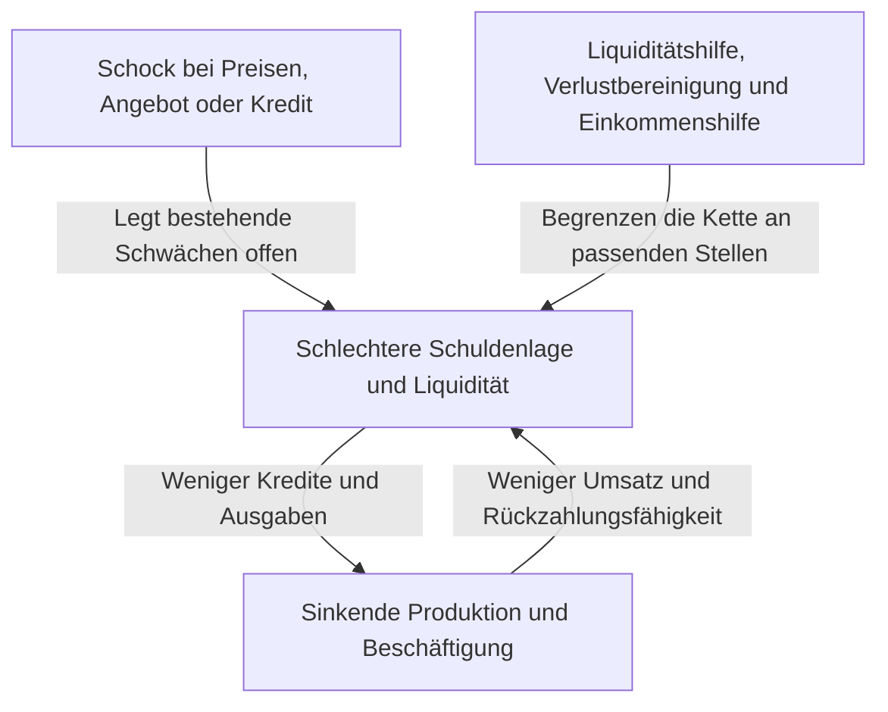
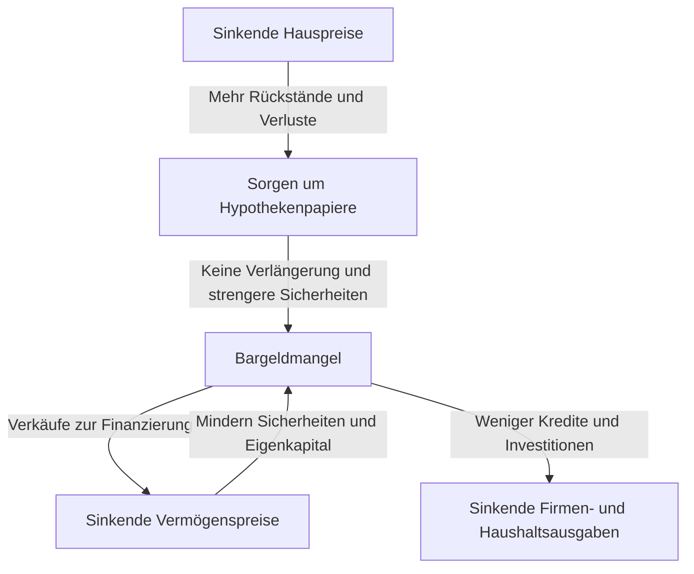

Beim Stichwort Lehman-Schock erscheinen Bankenpleiten, Kursstürze und steigende Arbeitslosigkeit vielleicht als ein einziges Ereignis. Doch warum führte die Insolvenz eines Unternehmens weltweit zu geringerer Industrieproduktion und sinkenden Haushaltseinkommen? Warum hatte der Börsensturz am Schwarzen Montag 1987 nicht dieselben Folgen wie die Weltwirtschaftskrise der 1930er-Jahre?

Zum Verständnis genügen Namen und Jahreszahlen nicht. Was änderte sich zuerst? Welche Schwächen hatten sich zuvor angesammelt? Zwischen welchen Akteuren übertrugen sich Verluste und Angst? Trennt man diese Fragen, wird komplexe Geschichte als Kette von Ursachen und Wirkungen verständlich.

Dieser Artikel behandelt sechzehn ausgewählte Ereignisse zwischen 1929 und 2023. Es geht um den Vergleich verschiedener Mechanismen, nicht um eine vollständige Krisenchronik aller Länder. Wirtschaftsschock wird weit gefasst: Neben Finanzkrisen gehören Energieverknappung, Pandemien und Änderungen des Währungssystems dazu. Bei wissenschaftlich umstrittenen Ursachen wird keine Erklärung zur einzig richtigen erhoben.

## Zunächst: Ein Schock ist noch keine Krise

Ein Schock verändert wirtschaftliche Voraussetzungen plötzlich: Öl kommt nicht mehr an, Immobilienpreise fallen oder ausländische Anleger ziehen Kapital ab. Eine Krise entsteht, wenn bestehende Institutionen und Finanzierungsstrukturen diese Veränderung nicht auffangen und grundlegende wirtschaftliche Funktionen ausfallen.

Das ähnelt der Unterscheidung zwischen einem Taifun, schwachen Deichen und der Ausbreitung einer Überschwemmung. In der Wirtschaft verändern menschliche Entscheidungen jedoch auch die Deiche. Kürzen Banken vorsichtshalber Kredite, können Unternehmen ausfallen und Bankverluste steigen. Individuell vernünftiger Schutz verstärkt dann die gesamtwirtschaftliche Krise.

Ein Nachfrageschock verringert Konsum- und Investitionsausgaben. Ein Angebotsschock verknappt Rohstoffe oder Arbeitskräfte und senkt mögliche Produktion oder erhöht Kosten. Ein Finanzschock beschädigt Kapitalvermittlung und Zahlungsverkehr. Reale Krisen verbinden diese Elemente und verändern unterwegs ihren Charakter.

Die Pfeile wirken nicht immer gleich stark. Genügend Eigenkapital, stabile Finanzierung und glaubwürdige Institutionen begrenzen die Folgen von Verlusten. Umgekehrt können in normalen Zeiten effizient wirkende Strukturen im Extremfall gleichzeitig zu Schwachstellen werden.

## Eine Vergleichstabelle für den Überblick

| Zeitraum | Ereignis | Zentrale Schwäche oder Übertragung |
| --- | --- | --- |
| 1929–1930er-Jahre | Weltwirtschaftskrise | Bankenpaniken, Kreditverknappung, Deflation, Goldstandard |
| 1971 | Nixon-Schock | Vertrauensverlust in Dollar-Gold-Tausch, Währungsumbruch |
| 1973–1974 | Erste Ölkrise | Abrupte Angebots- und Preisänderung, Einkommensabfluss der Importeure |
| Etwa 1978–1982 | Zweite Ölkrise und Geldstraffung | Angebotsängste, Inflationserwartungen, Anpassung an hohe Zinsen |
| Ab 1982 | Lateinamerikanische Schuldenkrise | Fremdwährungsschulden, variable Zinsen, fehlende Deviseneinnahmen |
| 1987 | Schwarzer Montag | Gleichgerichteter Handel, Marktliquidität und Abwicklung |
| 1990er-Jahre | Japans Blasenzerfall | Sinkende Sicherheitenwerte, Problemkredite, lange Entschuldung |
| 1994–1995 | Mexikanische Währungskrise | Umkehr von Zuflüssen, kurzfristige Schulden, Dollarbindung |
| 1997–1998 | Asienkrise | Währungs- und Fristeninkongruenz, Kapitalabzug, Bankenkrisen |
| 1998 | Russland- und LTCM-Krise | Staatsschuldenangst, Flucht in Sicherheit, Verschuldungshebel |
| Etwa 2000–2002 | Dotcom-Krise | Revidierte Gewinnerwartungen, weniger Eigenkapital und Investitionen |
| 2007–2009 | Globale Finanzkrise und Lehman-Schock | Immobilienkredite, Verbriefung, Flucht aus kurzfristiger Finanzierung |
| Frühe 2010er-Jahre | Europäische Schuldenkrise | Bank-Staat-Verflechtung, institutionelle Schwächen der Währungsunion |
| 2020 | Corona-Schock | Gleichzeitige Angebots- und Nachfrageausfälle durch Infektion und Verhalten |
| Ab 2021–2022 | Inflations- und Energieschock | Nachfrageerholung, Angebotsengpässe, kriegsbedingte Rohstoffstörungen |
| 2023 | US-Bankenturbulenzen | Zinsrisiko, Einlagenkonzentration, rascher Kapitalabzug |

Die Zeiträume markieren sichtbare Krisenmerkmale, keine weltweit identischen Rezessionen. Beginn einer US-Rezession, japanischer Konjunkturtiefpunkt und Börsentief fallen nicht zwingend zusammen. Auch Krisenende kann Marktstabilisierung, Beschäftigungserholung oder abgeschlossene Entschuldung bedeuten.

## Börsenkrach 1929 und Weltwirtschaftskrise: mehr als Aktienverluste

Der US-Börsensturz im Herbst 1929 symbolisiert die Weltwirtschaftskrise. Er allein erklärt aber weder Tiefe noch Dauer der anschließenden Depression. Die US-Konjunktur schrumpfte schon vorher; spätere Bankenpaniken beschädigten Kredit und Ausgaben zusätzlich.

Banken versprechen Einlegern kurzfristige Rückzahlung, vergeben aber längerfristige Unternehmens- und Haushaltskredite. Verlangen viele gleichzeitig Bargeld, kann die Bank sofort zahlungsunfähig werden, obwohl ihre Aktiva nicht wertlos sind. Eine heutige bundesweite Einlagensicherung gab es damals in den USA noch nicht.

Mit Bankenpleiten und Einlagenabzug wurde Betriebskapital knapp. Unternehmen konnten Löhne, Material und Lagerbestände schwerer finanzieren; Produktion und Beschäftigung sanken. Arbeitslosigkeit und Einkommensverluste drückten Konsum und Rückzahlungsfähigkeit weiter. Auch Haushalte ohne Aktienbesitz wurden getroffen.

Fallende Preise helfen nicht zwangsläufig. Bei nominal fixierten Schulden erschweren sinkende Umsätze und Löhne die Tilgung. Fünf Millionen Yen Schulden bei fünf Millionen Jahreseinkommen sind anders zu tragen als dieselben Schulden bei nur 3,5 Millionen Einkommen. Das hypothetische Beispiel zeigt die wechselseitige Verschärfung von Deflation und Schulden.

Unter dem Goldstandard kollidierte zudem die Sicherung der Konvertibilität mit inländischer Geldlockerung. Straffung gegen Goldabflüsse konnte die Geldknappheit im Abschwung verschärfen. Protektionismus und internationale Schuldbeziehungen kamen hinzu. [Historische Unterlagen der Federal Reserve](https://www.federalreservehistory.org/essays/banking-panics-1931-33) erklären den gleichzeitigen Druck durch Goldabfluss und Einlagenabzug.

Die Lehre lautet nicht, Aktienkurse zu stützen löse alles. Brechen Zahlungen, Kreditvermittlung und Einlagenvertrauen zusammen, werden Finanzverluste zu dauerhaften Produktionsschäden. Die Forschung gewichtet Geldpolitik und Goldstandard unterschiedlich; ein einziger Börsentag als Gesamterklärung ist jedoch zu grob.

## Nixon-Schock 1971: Ein Umtauschversprechen wurde unhaltbar

Im Bretton-Woods-System der Nachkriegszeit hatten viele Währungen feste Beziehungen zum Dollar. Die USA unterstützten unter bestimmten Bedingungen den Goldumtausch von Dollarbeständen ausländischer Währungsbehörden. Nicht jeder konnte beliebige gewöhnliche Dollarnoten frei gegen Gold tauschen.

Wachsender Welthandel und internationale Finanzierung benötigten weltweit verfügbare Dollar. Steigende Auslandsbestände ließen jedoch Zweifel aufkommen, ob die US-Goldreserven das Versprechen deckten. Angst förderte frühzeitigen Umtausch und destabilisierte das System weiter.

Im August 1971 verkündete Präsident Nixon unter anderem die Aussetzung der Goldkonvertibilität. Versuche, das System mit Kursanpassungen zu erhalten, folgten; erst 1973 gingen wichtige Währungen zu flexiblen Kursen über. Die Vorstellung, weltweit seien alle Festkurse an einem Tag 1971 beendet worden, verkennt den Ablauf. [Federal Reserve History](https://www.federalreservehistory.org/essays/gold-convertibility-ends) erläutert Ziele und Übergang.

Für japanische Unternehmen wurden Wechselkurse zu einem wesentlichen Planungsrisiko. Dieselben Dollarexporterlöse ergeben bei Yen-Aufwertung weniger Yen. Importkosten können dagegen sinken; Exporteure und Importeure erleben nicht dieselben Folgen.

Dies war vor allem ein Währungssystem- und Politikschock, nicht dieselbe Krisenart wie eine Serie von Bankenpleiten. Feste Umtauschrelationen stabilisieren Geschäfte, können aber große Anpassungen erfordern, wenn ihre Voraussetzungen verschwinden.

## Erste Ölkrise 1973–1974: Produktionskosten schnellen hoch

Vor dem Hintergrund des Nahostkriegs 1973 beschränkten arabische Produzenten Lieferungen und verhängten Embargos gegen die USA und weitere Staaten. Rohöl wurde drastisch teurer. Die arabische Organisation OAPEC, die das Embargo durchführte, ist nicht mit der breiteren OPEC gleichzusetzen. Liefermaßnahmen, Preispolitik und bereits starke Weltnachfrage wirkten zusammen. [Die historische Darstellung der ersten Ölkrise](https://www.federalreservehistory.org/essays/oil-shock-of-1973-74) erklärt diesen Hintergrund.

Öl ist nicht nur Autokraftstoff, sondern ein Einsatzstoff für Transport, Strom und Chemie. Brennstoffe oder Anlagen lassen sich kurzfristig schwer ersetzen; selbst kleine Fehlmengen können Preise stark bewegen. Reagieren Angebot und Nachfrage wenig auf den Preis, übernimmt dieser den Großteil der Anpassung.

Importländer müssen für dieselbe Ölmenge mehr Einkommen ins Ausland übertragen. Überwälzen Unternehmen die Kosten, sinkt die Kaufkraft der Haushalte; andernfalls schrumpfen Gewinne. Beide Wege schwächen Konsum und Investitionsspielraum.

So können Inflation und Konjunkturverschlechterung gleichzeitig auftreten: Stagflation. Starke Nachfragestimulierung schafft nicht sofort mehr Öl oder Anlagen. Umgekehrt verschärft eine ausschließlich auf Preise gerichtete harte Straffung die Beschäftigungsverluste.

Auch Japans Probleme waren nicht allein ölbedingt. Nachfrage, Finanzbedingungen und Inflationserwartungen spielten mit. Spätere Energieeinsparung und Strukturwandel veränderten die Widerstandskraft. Das Ausmaß eines Angebotsschocks hängt neben dem Rohstoffpreis von der Abhängigkeit vom Rohstoff ab.

## Zweite Ölkrise und Hochzinswende: Auch Inflationsbekämpfung kostet

Produktionsstörungen während der iranischen Revolution 1978–1979 erschütterten den Ölmarkt erneut. Preisanstiege waren nicht einfach proportional zur ausgefallenen Menge: Angst vor weiteren Engpässen erhöhte vorsorgliche Lagerkäufe. Zukunftssorgen können heutige Nachfrage steigern. [Die Darstellung der zweiten Ölkrise](https://www.federalreservehistory.org/essays/oil-shock-of-1978-79) behandelt beide Faktoren.

Bei anhaltender Inflation kalkulieren Unternehmen und Beschäftigte weitere Preissteigerungen in Preise und Löhne ein. Das bedeutet nicht, Löhne allein trieben stets die Inflation. Rohstoffkosten, Nachfrage, geldpolitische Glaubwürdigkeit und Verträge beeinflussen deren Beharrlichkeit.

Unter Paul Volcker, seit 1979 Fed-Vorsitzender, rückte Inflationsbekämpfung durch straffere Geldpolitik in den Mittelpunkt. Hohe Zinsen bremsten Hauskäufe und Investitionen und belasteten Produktion und Beschäftigung. Die Rezessionen um 1980 und Anfang der 1980er-Jahre umfassten neben Ölpreisen auch diese Politikanpassung.

Geldstraffung fördert kein Öl. Sie dämpft Ausgaben und Kredit und soll Erwartungen dauerhaft hoher Inflation verändern. Da sie den Angebotsengpass nicht beseitigt, entstehen reale Kosten. [Die Geschichte der großen Inflation](https://www.federalreservehistory.org/essays/great-inflation) verdeutlicht die Verbindung von Politik und Preisen.

US-Zinserhöhungen wirkten außerdem international: Dollarverschuldete Staaten und Unternehmen im Ausland mussten ungünstigere Rückzahlungsbedingungen tragen. Diese Verbindung führt zur lateinamerikanischen Schuldenkrise.

## Lateinamerikanische Schuldenkrise ab 1982: Währung und Zins werden zur Last

In den 1970er-Jahren wuchsen internationale Bankkredite, auch gespeist durch Einnahmen der Ölproduzenten. Lateinamerikanische Länder nahmen umfangreiche Fremdwährungskredite auf. Kredit erhalten zu können garantiert jedoch nicht die späteren Deviseneinnahmen zur Rückzahlung.

Dollarschulden lassen sich nicht einfach durch Ausgabe heimischer Währung begleichen. Dollar müssen aus Exporten, Kapitalzuflüssen oder Reserven kommen. Variable Zinsen erhöhen bei internationalem Zinsanstieg den Schuldendienst, während schwache Weltkonjunktur Export- und Rohstofferlöse bremst.

Mexikos Zahlungsprobleme im August 1982 machten die Krise sichtbar; zahlreiche Länder mussten Schulden umstrukturieren. Internationale Banken hatten hohe Forderungen, sodass nicht nur Schuldner betroffen waren. [Die Geschichte der lateinamerikanischen Schuldenkrise](https://www.federalreservehistory.org/essays/latin-american-debt-crisis) berücksichtigt auch Kreditgeber.

Stoppen neue Kredite, können laufend refinanzierte Zahlungen nicht weitergehen. Importkürzungen sparen Devisen, beschädigen aber künftige Einkommen, wenn Maschinen und Vorprodukte fehlen. Fiskalanpassung, Abwertung und Bankprobleme führten in manchen Ländern zu langer Stagnation.

Die Lehre ist nicht schlicht, Schulden seien schlecht. Entscheidend sind Währung, Zins, Fälligkeit und tragende Einnahmen. Selbst gesellschaftlich sinnvolle Langfristinvestitionen können scheitern, wenn Fälligkeiten und Devisenerlöse nicht zusammenpassen.

## Schwarzer Montag 1987: Ein vermeintlich liquider Markt wird dünn

Am 19. Oktober 1987 verlor der Dow Jones an einem Tag 22,6 Prozent. Daraus entstand in den USA aber nicht sofort eine Bankenkrise oder Rezession nach Art der Weltwirtschaftskrise. Das Beispiel trennt Preissturz und Zusammenbruch finanzieller Funktionen.

Nicht eine Nachricht allein war verantwortlich. Hohe Bewertungen, Zins- und Wechselkursängste sowie Marktstrukturen wirkten zusammen. Portfolio Insurance, die bei Kursverlusten Futures und andere Instrumente verkaufte, um Verluste zu begrenzen, verstärkte Verkaufsdruck. Der Name Versicherung bedeutet keine bedingungslose Verlustübernahme durch Dritte.

Wer durch Verkauf Risiko senken will, braucht Käufer. Verkaufen viele bei derselben Kursänderung gleichzeitig, fehlen Kaufaufträge zum bisherigen Preis. Weitere Kursverluste lösen dann neue Verkäufe aus.

Unterschiedliche Handels- und Abwicklungsregeln für Aktien, Futures und Optionen erschwerten den Liquiditätsbedarf. Auch rechnerisch ausgleichende Positionen erfordern zwischen unterschiedlichen Zahlungsterminen Bargeld. [Federal Reserve History](https://www.federalreservehistory.org/essays/stock-market-crash-of-1987) behandelt Marktstruktur und Liquiditätshilfe.

Die Liquiditätsbereitschaft der Zentralbank und fortgesetzte Kreditvergabe begrenzten die Kette. Die prozentuale Kursänderung allein misst keine Krisentiefe. Entscheidend sind Verlustträger, ihre Verschuldung und ihre Rolle in Zahlungsverkehr und Kreditversorgung.

## Japans Blasenzerfall: Grundstücke, Banken und Unternehmensbilanzen waren verbunden

Ende der 1980er-Jahre stiegen Japans Aktien- und Grundstückspreise stark. Geldlockerung, Bankverhalten unter Finanzliberalisierung, grundstücksgesicherte Kredite und Preissteigerungserwartungen verbanden sich. Statt nur Plaza-Abkommen oder niedrige Zinsen anzuführen, muss man Kredit-Preis-Rückkopplungen betrachten.

Steigende Grundstückswerte erhöhen den Kredit, den dasselbe Grundstück besichert. Fließt das Geld in Immobilienkäufe, steigen Preise weiter. Beruht Kredit zunehmend auf künftig höherem Sicherheitenverkauf statt auf Erträgen, stützt der Preisanstieg selbst die Verschuldung.

Nach Geldstraffung und Immobilienkreditbeschränkungen kehrte der Preisrückgang der 1990er-Jahre den Mechanismus um. Erwerbsschulden blieben, während Sicherheiten und Vermögen an Wert verloren. Banken sammelten schwer eintreibbare, notleidende Kredite. [Die Blasenstudie der Bank of Japan](https://www.imes.boj.or.jp/research/abstracts/english/me14-1-6.html) untersucht Kredit sowie Boden- und Aktienpreise.

Eigenkapitalverluste erschweren neue Bankkredite. Gleichzeitig priorisieren Unternehmen selbst bei sinkenden Zinsen Tilgung statt Investition. Beide Seiten schränken Ausgaben ein; Zinssenkungen allein stellen frühere Investitionen nicht sicher wieder her.

Verspätete Problemerkennung und Verlustbereinigung können schwache Firmen weiterfinanzieren, während aussichtsreiche Firmen zu wenig Geld erhalten. Die Finanzprobleme 1997–1998 zeigten fortbestehende Bankenschwächen nach dem Preissturz. Die Bank of Japan diskutiert [Deflation und Bilanzanpassung seit den 1990er-Jahren](https://www.boj.or.jp/en/about/press/koen_2024/ko240527b.htm) als wichtige Stagnationsursachen.

Nicht Japans gesamte spätere Entwicklung folgt allein aus der Blase. Demografie, Produktivität, Weltkonkurrenz und Politik zählen ebenfalls. Entscheidend ist hier: Bleiben Preisverluste in Bilanzen, normalisieren sich Bank- und Unternehmensverhalten trotz zeitweiliger Kurserholung nicht sofort.

## Mexiko 1994–1995: Ohne Anschlussfinanzierung wird Währungsverteidigung schwierig

Politische Unsicherheit und steigende US-Zinsen destabilisierten 1994 ausländische Zuflüsse nach Mexiko. Leistungsbilanzdefizite benötigen Finanzierung durch Zuflüsse oder andere Mittel. Sie bedeuten nicht automatisch Krise; ein abrupter Finanzierungsstopp erzwingt aber harte Anpassung.

Devisenreserven zur Kursstützung sind begrenzt. Die zunehmend ausgegebenen Tesobonos waren kurzfristige Schulden mit dollargebundenen Rückzahlungsbeträgen. Der Schutz der Anleger vor Peso-Abwertung erhöhte Währungs- und Refinanzierungsrisiken des Staates.

Die Wechselkurspolitikänderung im Dezember 1994 stellte Vertrauen nicht ausreichend her; der Peso fiel stark. Die heimische Last dollargebundener Schulden stieg, und Anschlussfinanzierung wurde dringend. [Die damalige IWF-Bewertung](https://www.imf.org/en/news/articles/2015/09/28/04/53/spmds9508) betont kurzfristige Finanzierung und Schuldenstruktur.

Abwertung kann Exporte fördern, erhöht aber zugleich fremdwährungsgebundene Verpflichtungen. Dieser Bilanzschaden widerlegt die einfache Vorstellung, Abwertung stelle Wettbewerbsfähigkeit her und löse alles. Geschwächte Unternehmen und Banken können selbst Exportexpansion schwer finanzieren.

Die Krise zeigt, warum neben gesamten Staatsschulden die binnen Monaten fälligen Beträge wichtig sind. Gleich hohe Schulden mit verteilten oder konzentrierten Fälligkeiten reagieren unterschiedlich auf Vertrauensverlust.

## Asienkrise 1997–1998: Private Fremdwährungsschulden erschüttern Volkswirtschaften

Thailands Aufgabe der Baht-Kursverteidigung im Juli 1997 leitete eine Ausbreitung nach Indonesien, Südkorea und anderswo ein. Institutionen und Schwächen waren nicht identisch. Eine reine Erklärung durch staatliche Haushaltsdisziplinlosigkeit übersieht private Firmen- und Bankkredite.

Häufig wurden kurzfristige Dollar- oder andere Fremdwährungskredite für langfristige heimische Immobilien- und Unternehmensprojekte genutzt. Unterschiedliche Einnahme- und Rückzahlungswährungen bilden Währungsinkongruenz; unterschiedliche Fälligkeiten und Rückflusszeitpunkte bilden Fristeninkongruenz. Stabile Kurse und erfolgreiche Verlängerungen verdecken beide.

Fordern Anleger Geld zurück, steigt Devisennachfrage und die Währung fällt. Das erhöht Fremdwährungslasten und Unternehmenssorgen; Angst löst weitere Abflüsse aus. Wechselkurs und Zahlungsfähigkeit verschlechtern sich gegenseitig. [Die IWF-Untersuchung des Finanzsektors](https://www.imf.org/external/pubs/ft/op/opfinsec/index.htm) verbindet Bank- und Unternehmensschwächen mit Währungsregimen.

Ein Kredit über eine Million Dollar entspricht bei 100 heimischen Einheiten je Dollar 100 Millionen Einheiten. Bei 150 sind es 150 Millionen, obwohl der Dollarbetrag gleich bleibt. Bleibt Umsatz heimisch, steigt die Last ohne neue Schulden. Exporte oder Absicherungen verändern das Ergebnis; dieses Beispiel unterstellt fehlenden Schutz.

Hohe Zinsen zur Währungsverteidigung können Kapitalabzug bremsen, belasten aber heimische Schuldner. Zugelassene Abwertung beschädigt dagegen Fremdwährungsbilanzen. Dieser Zielkonflikt prägte die Antworten; IWF-Bedingungen und Fiskal- sowie Geldpolitik bleiben umstritten.

Ansteckung folgt nicht automatisch aus Nachbarschaft. Gemeinsame Banken, ähnliche Exportmärkte und die Gruppierung durch Anleger schaffen Kanäle. Ein gemeinsamer Kreditgeber mit Verlusten kann auch aus weniger betroffenen Ländern Gelder abziehen.

## Russland und LTCM 1998: Auch gestreute Geschäfte verlieren gleichzeitig

Russland verband 1998 schwache Staatsfinanzen und Steuereinnahmen, niedrige Rohstoffpreise und Finanzierungsängste. Im August wurden Rubelabwertung und Umstrukturierung heimischer Staatsanleihen angekündigt. Die Vorstellung stets sicherer Staatsschulden wankte; weltweit suchten Anleger Sicherheit und schnelle Verkäuflichkeit.

Der Hedgefonds Long-Term Capital Management, LTCM, erlitt schwere Verluste. Seine Strategie lediglich als Russlandanleihenanlage zu verstehen verkennt das Problem. Entscheidend waren hoch gehebelte Geschäfte, die etwa auf schrumpfende Preisunterschiede ähnlicher Instrumente setzten.

Kleine normale Preisdifferenzen bringen bei großen Positionen Gewinn. In Krisen kann die Flucht in liquide Anlagen solche Unterschiede jedoch ausweiten. Selbst eine richtige Erwartung späterer Annäherung hilft nicht, wenn vorher zusätzliche Sicherheiten verlangt werden.

Über Märkte verteilte Positionen bieten wenig echte Streuung, wenn alle dieselbe fortbestehende Liquidität voraussetzen. Steigende Krisenkorrelation heißt nicht nur veränderte Mathematik, sondern gleichzeitige Verkäufe vieler aus demselben Grund.

Die New Yorker Fed vermittelte Gespräche, die zu einer privaten Kapitalzufuhr führten. Das ist nicht mit einer direkten öffentlichen Kapitalspritze der Fed für LTCM zu verwechseln. [Die Aussage des damaligen New-York-Fed-Präsidenten](https://www.newyorkfed.org/newsevents/speeches/1998/mcd981001.html) erläutert die Rollen. Modellierter Langfristwert und Bargeld für morgen sind verschiedene Fragen.

## Dotcom-Krise: Echte Technologie garantiert keine richtigen Kurse

Ende der 1990er-Jahre zog die erwartete Internetrevolution Kapital in Technologie und Telekommunikation. Der technische Wandel war tatsächlich bedeutend. Nützliche Technologieverbreitung garantiert jedoch nicht jeder Firma hohe Gewinne.

Unternehmenswerte hängen von künftigem Gewinn oder Zahlungsstrom und dessen heutiger Abzinsung ab. Wer nur Marktgröße sieht und Kundengewinnungskosten, Wettbewerb, Geldverbrauch und Zusatzinvestitionen ignoriert, erlebt bei kleinen Wachstumsrevisionen große Bewertungsänderungen.

Ab 2000 erschwerten korrigierte Gewinnerwartungen Eigenkapitalaufnahme; Firmen kürzten Personal und Investitionen. Übermäßige Telekommunikationsanlagen wurden ebenfalls angepasst. Neben Haushaltsvermögensverlusten schrumpfte laufende Unternehmensfinanzierung. [Der Fed-Jahresbericht 2001](https://www.federalreserve.gov/boarddocs/rptcongress/annual01/ar01.pdf) dokumentiert diese Veränderungen.

Die US-Rezession 2001 begann nicht erst mit den Septemberanschlägen. Abschwächung bestand schon vorher; die Anschläge trafen zusätzlich Reisenachfrage und Unsicherheit. Überlagerte Schocks müssen zeitlich getrennt betrachtet werden.

Anders als 2008 trugen Aktienanleger relativ mehr Verluste, und die Verstärkung über Banken und kurzfristige Märkte war anders. Aktien versprechen bei Kursverlusten keine Rückzahlung desselben Betrags; Schulden bleiben Verpflichtungen. Die Finanzierungsform bestimmt mit, ob Technologieenttäuschung eine tiefe Finanzkrise auslöst.

## Lehman-Schock: Hypothekenverluste blockieren kurzfristige Geldmärkte

### Die Krise begann nicht plötzlich im September 2008

Der in Japan sogenannte Lehman-Schock wird durch die Insolvenz von Lehman Brothers am 15. September 2008 symbolisiert. Probleme auf US-Immobilienmärkten und bei verknüpften Finanzprodukten bestanden früher. Geldmarktspannungen wurden 2007 sichtbar; im Frühjahr 2008 folgte Bear Stearns.

Steigende Hauspreise beruhigten Schuldner und Kreditgeber. Erwarteter Verkauf oder Umschuldung stützte Kredite auch bei Zahlungsproblemen. Bei sinkenden Preisen deckten Verkäufe Schulden häufiger nicht mehr, und Refinanzierungsannahmen brachen zusammen. [Die Darstellung der Subprime-Krise](https://www.federalreservehistory.org/essays/subprime-mortgage-crisis) beschreibt diese Wechselwirkung.

Schwache Schuldner allein erklären keine Weltkrise. Kreditprüfung, Verbriefungsanreize, Anlegerbewertungen, Eigenkapital und Finanzierung der Institute müssen ebenfalls untersucht werden, um die globale Ausbreitung lokaler Ausfälle zu verstehen.

### Verbriefung beseitigt Risiken nicht

Verbriefung bündelt Hypotheken und verteilt deren Zahlungsströme an Anleger. Verschiedene Rangfolgen schaffen Teile, die Verluste früher oder später tragen. Gesamtverluste verschwinden dadurch nicht.

Regionale Bündelung verteilt lokale Risiken. Fallen Immobilienpreise jedoch großflächig und treten Arbeitslosigkeit und Umschuldungsprobleme gemeinsam auf, korrelieren Ausfälle stärker. Auch hoch bewertete Tranchen können bei versagenden Annahmen verlieren.

Komplexität verschleiert zudem die endgültigen Verlustträger. Selbst geringe eigene Verluste hindern nicht daran, bei unklaren Gegenparteien Kredite zu verweigern. Neben der Verlusthöhe zählte Unsicherheit über ihren Ort.

### Stoppt kurzfristige Finanzierung, werden Verkäufe nötig

Investmentbanken und andere finanzierten langfristig rückfließende Aktiva mit Repos und kurzfristigen Papieren. Repos ähneln besicherten kurzfristigen Krediten gegen Wertpapiere. Solange Verlängerung gelingt, funktioniert dies; ihre Verweigerung erzeugt sofortigen Bargeldbedarf.

Waren gegen Sicherheiten von 100 zuvor 95 Kredit möglich und nun nur noch 80, fehlen 15 aus anderer Quelle. Dieses hypothetische Beispiel erklärt den Mechanismus. Fallen gleichzeitig Sicherheitenpreise, wächst der Bedarf weiter.

Liquiditätsverkäufe drücken Marktpreise. Andere Institute erleiden Bewertungsverluste oder Nachschussforderungen und müssen ebenfalls verkaufen. Ohne Warteschlangen vor Filialen entsteht eine Art Ansturm, weil kurzfristige Geldgeber gleichzeitig aussteigen.

### Finanzprobleme erreichen Fabriken und Haushalte

Nach Lehman verschärften sich Gegenparteimisstrauen und Geldmarktstörungen abrupt. AIG-Hilfe, Rekapitalisierung und Zentralbankliquidität gehörten zu den Antworten. [Der Überblick zur globalen Finanzkrise](https://www.federalreservehistory.org/essays/great-recession-and-its-aftermath) verbindet Immobilien, Finanzsektor und Realwirtschaft.

Kreditkürzungen erschweren neben Investitionen tägliche Firmenzahlungen. Haushalte verschieben langlebige Anschaffungen bei Vermögensverlusten und Jobangst. Selbst Exporteure ohne problematische Wertpapiere verlieren Aufträge. Schrumpfende Weltnachfrage und Handel trafen Japan besonders.

Über niedrige Zinsen, Kapitalströme, Regulierung, Aufsicht und Vergütung wird weiter diskutiert. Unverzichtbar bleibt das Zusammenspiel von Hypothekenverlusten, hohem Hebel, kurzer Finanzierung und undurchsichtigen Risiken. Lehman war ein wichtiger Verstärker; nicht ein Unternehmen schuf sämtliche Schwächen.

## Europäische Schuldenkrise: Staaten und Banken schwächen einander

Ende 2009 und 2010 wuchsen Sorgen um Griechenlands Staatsfinanzen und griffen auf weitere Euroländer über. Griechenlands Fiskalgeschichte gilt aber nicht unverändert überall. In Irland und Spanien waren Immobilien und Banken besonders wichtig.

Sinkende Staatsbonität und Anleihepreise beschädigen haltende Banken. Staatliche Bankenhilfe erhöht danach Fiskallasten und Staatsängste. Eine zuvor gegenseitig stützende Beziehung wird zur gegenseitigen Schwächung.

Euroländer können ihre gemeinsame Währung nicht einzeln abwerten oder eigene Leitzinsen festlegen. Bankenaufsicht, Abwicklung und fiskalische Risikoteilung waren anfangs jedoch unzureichend integriert. Kriseninstitutionen hinkten der Währungsintegration hinterher.

Hohe Refinanzierungszinsen steigern Zinslasten und verschlechtern Tragfähigkeit. Angst kann so das befürchtete Ergebnis wahrscheinlicher machen. Dennoch war nicht alles unbegründete Psychologie: Schulden, Produktivität und Bankenprobleme unterschieden sich real. [Die EZB-Krisenbewertung](https://www.ecb.europa.eu/press/key/date/2018/html/ecb.sp180511.en.html) behandelt Länderunterschiede und institutionelle Lehren.

Austerität soll Vertrauen zurückbringen, doch abrupte Kürzungen im Abschwung mindern Einkommen und Steuern. Hilfe wirft dagegen Verlustverteilung und Vermeidung künftiger Überverschuldung auf. EZB-Maßnahmen, Hilfsmechanismen und Bankenunion sollten diese Kreisläufe unterbrechen.

## Corona 2020: Zuerst stoppte Aktivität, nicht ein Finanzprodukt

Die Pandemie beschränkte gleichzeitig Mobilität, persönliche Dienstleistungen, Arbeitsplätze und Fabriken. Neben staatlichen Regeln reduzierten freiwillige Infektionsvermeidung und Fehlzeiten Aktivität. Der ursprüngliche Auslöser unterschied sich von einer üblichen Bankenkrise.

Angebotsseitig fehlten Arbeitskräfte, Bauteile und Logistik. Nachfrageseitig schrumpften Reisen, Gastronomie und Unterhaltung; Einkommens- und Zukunftsängste verschoben Käufe. Nachfrage verlagerte sich auch von Dienstleistungen zu Gütern, sodass Branchen unterschiedlich reagierten. [Die frühe IWF-Analyse](https://www.imf.org/en/Blogs/Articles/2020/03/09/blog030920-limiting-the-economic-fallout-of-the-coronavirus-with-large-targeted-policies) trennt beide Seiten.

Miete und Schuldendienst laufen trotz Umsatzstopp weiter. Eigentlich tragfähige Firmen können bei Bargeldmangel scheitern; eine Pause wird dann zum dauerhaften Verlust von Beschäftigungs- und Lieferbeziehungen. Politik musste Haushalte und Unternehmen über diese Pause tragen.

Zinssenkungen beseitigen weder Infektionsgefahr noch Teilemangel direkt. Gesundheitsschutz musste mit Einkommen, Beschäftigungssicherung und Finanzierungshilfe kombiniert werden. Auch Finanzmärkte verlangten plötzlich viel Bargeld; der Realschock sollte nicht zusätzlich Finanzfunktionen zerstören.

Die Erholung verlief ungleich. Nachfrage kann schneller zurückkehren als stillgelegte Anlagen, Personal oder internationale Logistik. Anfangs fehlende Nachfrage kann später durch fehlendes spezifisches Angebot abgelöst werden. Das erklärt die folgende Inflationsphase mit.

## Inflation und Energie ab 2021–2022: Mehrere Engpässe treffen zusammen

Nachpandemische Inflation hatte keine Einzelursache. Nachfrageerholung und Zusammensetzung, Lieferkettenstörungen, Arbeitsangebot sowie nationale Fiskal- und Geldbedingungen wirkten zusammen. Gewichte variierten nach Land und Zeit; eine identische Erklärung für USA und Europa übersieht Unterschiede.

Energiemärkte waren bereits 2021 angespannt. Russlands Angriff auf die Ukraine im Februar 2022 erschütterte Gas, Öl und Strom zusätzlich. Krieg, Lieferkürzungen, Sanktionen und Geschäftsrisiken änderten Wege und Kosten. [Die Internationale Energieagentur](https://www.iea.org/topics/2022-energy-crisis) unterscheidet vorherige Enge und spätere Verschärfung.

Besonders Gas benötigt Leitungen, Verflüssigung, Schiffe und Terminals. Ressourcen andernorts ersetzen regionale Fehlmengen nicht sofort. Auf der Erde vorhanden zu sein ist etwas anderes als rechtzeitig am richtigen Ort anzukommen. Physische Grenzen verstärken Preisschwankungen.

Höhere Importpreise erhöhen Unternehmenskosten und Lebenshaltung der Energieimporteure. Subventionen und Preisbegrenzung lindern kurzfristig, belasten aber Haushalte des Staates und können Sparanreize schwächen. Zielgruppe und Dauer sind entscheidend.

Zentralbanken erhöhten Zinsen gegen verfestigte Inflation. Zinsen vermehren jedoch kein Gas direkt. Sie wirken über Nachfrage und Erwartungen, bremsen Bau und Investitionen und verursachen Verluste bestehender Finanzanlagen. Sinkende Inflation bedeutet langsameren Preisanstieg, nicht unbedingt Rückkehr früherer Lebenshaltungskosten.

## US-Banken 2023: Auch sichere Anleihen haben Zinsrisiken

Die Insolvenz der Silicon Valley Bank im März 2023 zeigte, dass Bankenkrisen nicht nur durch schlechte Hypotheken entstehen. Langfristiges Anleihezinsrisiko, konzentrierte Einleger und große, nicht vollständig versicherte Einlagen wirkten zusammen.

Festverzinsliche Anleihen verlieren bei steigenden Marktzinsen meist an Wert. Zahlen neue Anleihen mehr, benötigen ältere Niedrigkuponpapiere Preisabschläge für Käufer. Auch Staatsanleihen mit geringem Kreditrisiko haben keinen garantiert stabilen Verkaufspreis.

Halten bis Fälligkeit unterscheidet sich vom Verkauf heute zur Bedienung abfließender Einlagen. Bilanzkategorien verändern Verlustzeitpunkte, beseitigen aber keinen Marktpreis bei eiligem Verkauf. Die Finanzierung langfristiger Aktiva durch jederzeit abziehbare Einlagen wird relevant.

SVBs Konzentration auf Technologiekunden begünstigte gleichgerichteten Geldbedarf und Entscheidungen. Onlineüberweisungen und Informationsaustausch beschleunigen Anstürme. Soziale Medien allein zu beschuldigen übersieht vorherige Bilanzsteuerungs- und Aufsichtsschwächen. [Der Fed-Prüfbericht](https://www.federalreserve.gov/publications/2023-April-SVB-Key-Takeaways.htm) untersucht beide.

Weitere Banken gerieten unter Druck, hatten aber andere Aktiva und Kunden. Wer welchem Zinsänderungsrisiko ausgesetzt war, erklärt mehr als eine Gleichsetzung mit der Hypothekenkrise 2008.

## Vier Mechanismen verbinden die Geschichte

### Wenig Eigenkapital macht kleine Preisrückgänge zu großen Verlusten

Mit Aktiva $A$, Verbindlichkeiten $D$ und Eigenkapital $E$ gilt in einer vereinfachten Bilanz:

$$
E=A-D,\qquad L=\frac{A}{E}
$$

$L$ bezeichnet hier den Hebel. Aktiva 100, Schulden 95 und Eigenkapital 5 ergeben 20. Bei unveränderten Schulden senkt ein Aktivaverlust von 3 das Eigenkapital von 5 auf 2. Drei Prozent Vermögensverlust bedeuten 60 Prozent Eigenkapitalverlust. Ohne Steuern, Absicherung und Zusammensetzung zeigt das Beispiel die Verstärkung.

In stabilen Preisphasen wirkt hoher Hebel effizient. Mehr Schwankung erzwingt zum Kapitalschutz Verkäufe oder Kreditkürzungen und verstärkt fremde Verluste. Das verbindet Japans Blase, LTCM und Weltfinanzkrise.

### Liquidität und Solvenz unterscheiden sich, beeinflussen sich aber

Ein Solvenzproblem bedeutet zu hohe Verpflichtungen gegenüber realisierbaren Aktiva und Einkommen. Ein Liquiditätsproblem bedeutet fehlendes Bargeld für heutige Zahlungen trotz späterer Rückflüsse. Deshalb können selbst profitable Firmen an Finanzierung scheitern.

Vorübergehende Finanzierung verhindert gegebenenfalls Notverkäufe guter Aktiva. Reicht ihr Wert tatsächlich nicht aus, beseitigen zusätzliche Kredite die Verluste aber nicht. Rekapitalisierung, Umschuldung oder Abwicklung werden nötig.

Beides sofort zu unterscheiden ist schwer. Liquiditätsnotverkäufe zerstören Solvenz; Verlustverdacht löst umgekehrt Einlagenabzug aus. Weder Bargeld löse immer alles noch Verlustinstitute müsse man immer fallenlassen erfasst diese Wechselwirkung.

### Währungs- und Zinsverträge schaffen unerwartete Lasten

Der heimische Wert von Fremdwährungsschulden lässt sich vereinfachen als:

$$
D_{\mathrm{home}}=eD_{\mathrm{foreign}}
$$

$e$ ist die heimische Währungsmenge je Fremdwährungseinheit. Steigt $e$ durch Abwertung, wächst die Last bei gleichem Auslandsnennwert. Fremdwährungseinnahmen und Absicherung müssen gegebenenfalls gegengerechnet werden.

Festkuponanleihen werden durch Abzinsung künftiger Zahlungen bewertet. Im einfachen Modell seien der periodische Kupon $C$, der Endnennwert $F$, die Restperioden $T$ und der konstante Diskontsatz $y$:

$$
P=\sum_{t=1}^{T}\frac{C}{(1+y)^t}+\frac{F}{(1+y)^T}
$$

Bei sonst gleichen Bedingungen senkt steigendes $y$ den Preis $P$. Tatsächlich variieren Zinsen nach Laufzeit, hinzu kommen Kreditrisiko und vorzeitige Tilgung. Die Formel bewertet nicht jedes Papier, erklärt aber, warum höhere Zinsen neue Krediterträge erhöhen und alte Langfristanleihen entwerten können.

### Internationale Verbindungen transportieren Gewinne und Schocks

Krisen verbreiten sich über Handel, Finanzbeziehungen und gemeinsame Preise. Rezessionsbedingte Importkürzungen treffen Exportfabriken. Verluste globaler Banken können scheinbar unbeteiligten Ländern Kredite entziehen. Ölpreise und Dollarzinsen wirken gleichzeitig auf viele Staaten.

Das ist für Gegenmaßnahmen entscheidend. Bankkapital allein bringt einem Exporteur keine fehlenden Aufträge zurück. Einem Unternehmen mit Aufträgen, aber ohne Betriebsmittelkredit hilft dagegen ein reparierter Finanzierungskanal. Hinter Weltrezession muss man den blockierten Weg erkennen.

## Warum Politik kein Allheilmittel besitzt

Bei Nachfragemangel können Geldlockerung und Fiskalausgaben Produktion und Jobs stützen. Bei hartem Angebotsengpass erhöht zusätzliche Nachfrage ohne Mehrangebot womöglich Inflation. Das bedeutet nicht Untätigkeit: gezielte Hilfe für stark Betroffene ist gesondert abzuwägen.

In Bankenkrisen sind Zahlungsverkehr und Einlagenvertrauen von bedingungsloser Rettung der Manager und Investoren zu unterscheiden. Auflagen bei Kapitalhilfe, Verluste für Aktionäre oder bestimmte Gläubiger und Fortführung kritischer Funktionen während Restrukturierung verlangen Entscheidungen zur Lastenteilung.

Übermäßiges Risiko im Vertrauen auf Hilfe heißt Moral Hazard. Vollständige Hilfsverweigerung mitten in der Krise kann aber Unbeteiligte treffen. Kapital- und Liquiditätsregeln, Offenlegung und Abwicklungsvorsorge gehören deshalb mit Krisenhilfe zusammen.

Fiskalspielraum hängt ebenfalls nicht nur vom Schuldenstand ab. Währung, Zins, Fälligkeit, Steuerbasis, Zentralbankordnung und Glaubwürdigkeit zählen. Heimische Verschuldung erlaubt dennoch keine unbegrenzten kostenlosen Ausgaben; Inflation, Wechselkurs und Ressourcen setzen Grenzen.

Die Bewertung leidet darunter, dass der Verlauf ohne Eingriff nicht direkt beobachtbar ist. Verschlechterung nach Hilfe beweist keine Wirkungslosigkeit, Erholung keine alleinige Politikursache. Vergleiche benötigen zeitliche, institutionelle und anfängliche Bedingungen.

## Fragen für die nächste Wirtschaftsnachricht

Prüfen Sie zuerst, welcher Preis oder welche Menge sich verändert hat. Aktien, Öl, Wechselkurs, Zins und Exportaufträge treffen unterschiedliche Akteure. Danach: Wessen Vermögen fällt, wessen Verpflichtungen oder Zahlungen steigen?

Dann zählen Verlustpuffer, kurzfristige Fälligkeiten, passende Einnahme- und Schuldenwährungen sowie Konzentration gleich handelnder Teilnehmer. Diese Fragen gelten für Fonds, Firmen, Staaten und Haushalte ebenso wie Banken.

Zielt die Politik auf Bargeldmangel, Verlustbereinigung, Nachfrage- oder Angebotsmangel? Gleiche Instrumentennamen bedeuten bei anderen Problemen andere Wirkungen und Nebenwirkungen. Frühere Aktienkurse wiederzuerreichen ist nicht dasselbe wie Lebensverhältnisse wiederherzustellen.

Diese Fragen prognostizieren kein Crashdatum. Schwächen garantieren keine Krise; öffentliche oder private Anpassung kann sie verhindern. Geschichte lehrt eher Verlustwege bei bestimmten Veränderungen als genaue Termine.

Weltwirtschaftskrise und Corona hatten andere Auslöser, Ölkrise und Lehman andere Hauptengpässe. Wiederkehrend bleiben Verpflichtungen trotz Einkommensverlust, der Unterschied zwischen kurzfristigem Bargeld und langfristigem Wert sowie Destabilisierung durch gleichzeitigen Selbstschutz.

Wirtschaftsschockgeschichte ist mehr als eine Fehlerliste. Sie zeigt, wann Versprechen zwischen Menschen, Firmen und Staaten funktionieren und wann sie Unterstützung brauchen. Ihre Struktur macht hinter Crashschlagzeilen sowohl heutige Besonderheiten als auch historische Mechanismen sichtbar.

## Hinweise zu den Quellen

Der Text verlinkt passende öffentliche Unterlagen von Federal Reserve, IWF, Bank of Japan, EZB und IEA direkt. Historische Ereignisaufzeichnungen und behördliche Eigenbewertungen sind zu unterscheiden. Besonders Politikfolgen und Ursachenanteile können je nach Perspektive anders beurteilt werden.

Die Zahlenbeispiele zu Bilanzen, Wechselkursen und Sicherheiten sind hypothetisch, keine Ergebnisse bestimmter Institute oder Länder. Jahresberichte und zeitgenössische Analysen enthalten zudem Prognosen; diese dürfen nicht mit später bestätigten Ergebnissen verwechselt werden.
