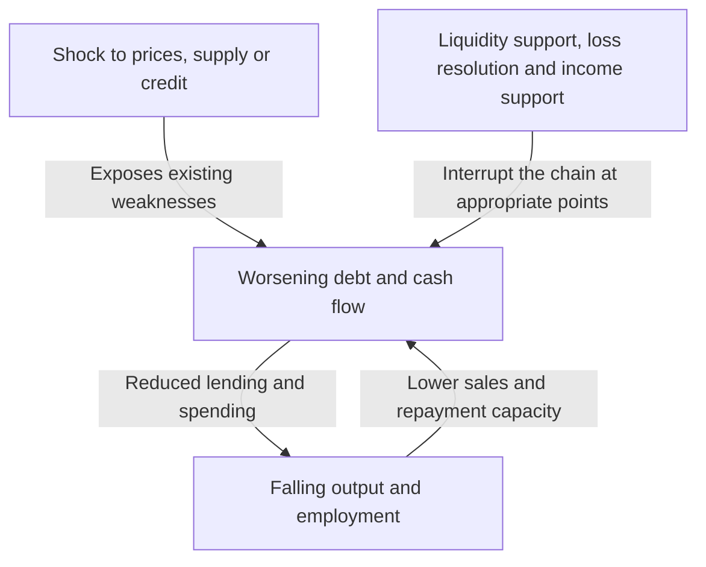
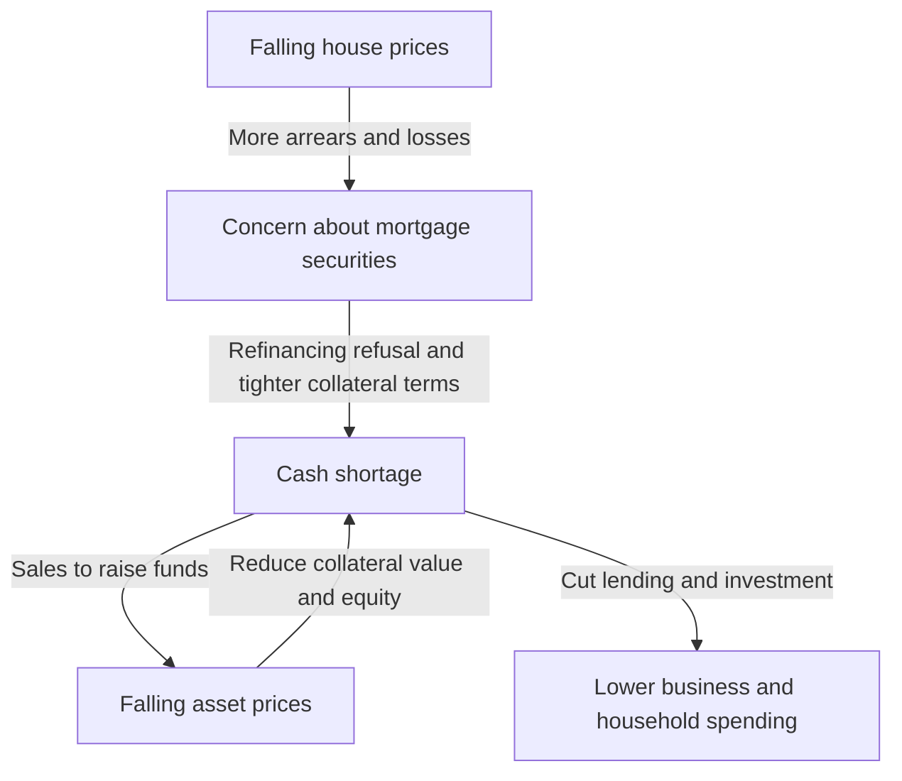

Mention the Lehman shock, and bank failures, plunging shares and rising unemployment may merge into one event. But how did one company's bankruptcy reduce factory output and household incomes around the world? Why did another stock-market crash, Black Monday in 1987, not have the same consequences as the Great Depression of the 1930s?

Understanding economic shocks takes more than memorizing names and dates. What changed first? What weaknesses had accumulated beforehand? Through whose balance sheets and decisions did losses and fear travel? Separating these three questions turns seemingly complex history into chains of cause and effect.

This article examines sixteen representative episodes between 1929 and 2023. It is a selection for comparing mechanisms, not a comprehensive chronology of every country's crises. Economic shock is used broadly, covering energy disruptions, pandemics and monetary-system changes as well as financial crises. Where researchers disagree over causes, no single explanation is treated as the only correct one.

## First distinguish a shock from a crisis

A shock suddenly changes the conditions under which an economy operates: oil stops arriving, house prices fall, or foreign investors withdraw funds. A crisis occurs when existing institutions and financing arrangements cannot absorb the change and the foundations of economic activity malfunction.

Think of distinguishing a typhoon, weaknesses in flood defenses and the spread of flooding. In economics, however, the defenses themselves change with human decisions. Banks may reduce lending for safety, causing firms to fail and increasing banks' losses. Individually rational defenses can amplify the collective crisis.

A demand shock reduces spending on consumption and investment. A supply shock restricts materials or labor, reducing output or raising costs. A financial shock damages the intermediation of funds and continuity of payments. Actual crises combine these elements and can change character as they unfold.

The arrows do not always operate with equal strength. Adequate equity, stable funding and trusted institutions can limit propagation despite losses. Conversely, arrangements that look efficient in normal times can become simultaneous weaknesses under extreme conditions.

## A comparison to establish the overall picture

| Period | Event | Main vulnerability or transmission mechanism |
| --- | --- | --- |
| 1929–1930s | Great Depression | Banking panics, credit contraction, deflation, gold-standard constraints |
| 1971 | Nixon shock | Eroding confidence in dollar–gold convertibility, monetary-system transition |
| 1973–1974 | First oil crisis | Abrupt changes in oil supply and prices, income transfers from importers |
| Around 1978–1982 | Second oil crisis and monetary tightening | Supply fears, inflation expectations, adjustment to high interest rates |
| From 1982 | Latin American debt crisis | Foreign-currency debt, floating rates, insufficient foreign-currency earnings |
| 1987 | Black Monday | Correlated trading, market liquidity and settlement problems |
| 1990s | Japan's bubble collapse | Falling collateral values, bad loans, prolonged debt repayment |
| 1994–1995 | Mexican currency crisis | Reversal of inflows, short-term debt, dollar-linked repayment burdens |
| 1997–1998 | Asian financial crisis | Currency and maturity mismatches, capital outflows and banking crises |
| 1998 | Russian and LTCM crises | Sovereign-debt fears, flight to safety, leverage |
| Around 2000–2002 | Dot-com bust | Revised profit expectations, shrinking equity funding and investment |
| 2007–2009 | Global financial crisis and Lehman shock | Housing credit, securitization, runs on short-term funding |
| Early 2010s | European sovereign-debt crisis | Bank–sovereign feedback, institutional weaknesses of monetary union |
| 2020 | COVID-19 shock | Simultaneous demand and supply disruption from infection and behavioral change |
| From 2021–2022 | Inflation and energy shock | Demand recovery, supply constraints, war-related commodity disruption |
| 2023 | US banking turmoil | Interest-rate risk, concentrated deposits, rapid withdrawals |

These dates identify periods in which each crisis's characteristics became evident, not globally synchronized recessions. The start of a US recession, a Japanese economic trough and a stock-market bottom need not coincide. A crisis ending can mean market stabilization, employment recovery or completion of debt restructuring—different milestones.

## The 1929 crash and Great Depression: more than stock-market losses

The US stock-market crash in autumn 1929 symbolizes the Great Depression. Falling share prices alone, however, cannot explain the subsequent depth and duration of the slump. The US economy entered recession before the crash, and later banking panics further damaged credit and spending.

Banks promise depositors repayment on short notice while lending to businesses and households for longer periods. If many depositors demand cash simultaneously, a bank can become unable to pay immediately even when its assets are not worthless. The United States then lacked today's federal deposit-insurance system.

As bank failures and withdrawals spread, firms struggled to borrow working capital. Paying wages, buying materials and maintaining inventories became difficult; employment and output fell. Unemployment and lower incomes reduced consumption and further weakened repayment capacity. This mechanism harmed households that owned no shares.

Falling prices are not necessarily a remedy. With debt fixed in nominal terms, declining sales and wages make repayment heavier. Earning five million yen annually while owing five million is different from earning only 3.5 million while still owing five million. This hypothetical example illustrates how deflation and debt can reinforce one another.

Under the gold standard, preserving confidence in currency convertibility also conflicted with domestic monetary easing. Tightening to prevent gold outflows could worsen cash shortages during a slump. Protectionism and international debt relationships compounded the damage. [Federal Reserve historical material](https://www.federalreservehistory.org/essays/banking-panics-1931-33) explains how gold outflows and deposit withdrawals simultaneously pressured banks.

The lesson is not that supporting share prices solves everything. When payments, credit intermediation and confidence in deposits collapse, financial losses can become lasting damage to productive capacity. Researchers differ on the weight assigned to monetary authorities and the gold standard, but attributing everything to one day's crash is far too crude.

## The Nixon shock of 1971: a conversion promise became unsustainable

Under the postwar Bretton Woods system, many currencies maintained fixed relationships with the dollar, while the United States supported conversion into gold, under specified conditions, of dollars held by foreign monetary authorities. It was not a system in which anyone could freely exchange every ordinary dollar bill for gold.

Expanding trade and international finance required dollars available worldwide. Yet growing foreign dollar holdings raised questions about the conversion promise relative to US gold reserves. Fear encouraged holders to convert sooner, making the system still less stable.

In August 1971, President Nixon announced the suspension of dollar–gold convertibility and other measures. Attempts to preserve the system through exchange-rate adjustments followed before major currencies moved toward floating in 1973. Thus, imagining all fixed exchange rates ending worldwide on a single day in 1971 misses the sequence. [Federal Reserve History](https://www.federalreservehistory.org/essays/gold-convertibility-ends) describes policy objectives and the transition.

For Japanese businesses, exchange rates became a major source of uncertainty in planning. The same dollar export receipt translates into fewer yen when the yen appreciates. Import costs may fall, however, so exporters and importers do not experience identical effects.

This was primarily a monetary-system and policy shock, not something to force into the same category as successive bank failures. Fixed conversion ratios can stabilize transactions, but when the conditions supporting the promise disappear, adjustment can be substantial.

## The first oil crisis, 1973–1974: production costs surge

Against the background of the 1973 Arab–Israeli war, Arab oil producers restricted supplies and embargoed the United States and other countries, while crude prices rose sharply. The Arab producers' organization OAPEC, which imposed the embargo, should not be confused with the broader OPEC. Supply measures, producers' pricing policies and already strong global demand interacted. [Historical analysis of the first oil crisis](https://www.federalreservehistory.org/essays/oil-shock-of-1973-74) explains this context.

Oil is more than motor fuel: it is an input into transport, electricity and chemicals. Switching fuels or equipment quickly is difficult, so even a modest shortage can produce a large price move. When demand and supply respond weakly to price, prices must perform much of the adjustment.

Importers must transfer more income abroad to obtain the same quantity of oil. If companies pass costs into prices, households lose purchasing power; if they cannot, profits fall. Either route reduces room for consumption and investment.

Inflation and economic deterioration can therefore occur together: stagflation. Stimulating spending because demand is weak does not immediately create more oil or production equipment. Conversely, aggressive tightening focused solely on prices adds to employment losses.

Japan's disruption likewise cannot be explained by oil alone. Demand, financial conditions and inflation expectations mattered. Subsequent energy efficiency and industrial changes altered resilience to similar import-price shocks. A supply shock's impact depends not only on resource prices but also on dependence on that resource.

## The second oil crisis and high interest rates: disinflation also hurts

Production disruption associated with Iran's 1978–1979 revolution shook oil markets again. Price increases were not simply proportional to lost output: fear of further shortages encouraged precautionary inventory demand. Concern about tomorrow can raise demand today. [The second oil crisis account](https://www.federalreservehistory.org/essays/oil-shock-of-1978-79) considers both supply losses and precautionary demand.

Where inflation is already persistent, firms and workers incorporate further increases into prices and wages. This does not mean wages always drive inflation alone. Resource costs, demand, confidence in monetary policy and contractual arrangements influence persistence.

Under Paul Volcker, who became Federal Reserve chair in 1979, US monetary policy tightened with a strong emphasis on controlling inflation. Higher rates restrained housing purchases and investment, imposing substantial costs on activity and employment. The recessions around 1980 and the early 1980s reflected adjustment to this policy shift as well as oil prices.

Monetary tightening does not extract oil. It restrains spending and credit and seeks to change expectations of prolonged inflation. Because it cannot remove the supply constraint itself, reducing inflation can impose real economic costs. [The history of the Great Inflation](https://www.federalreservehistory.org/essays/great-inflation) illuminates the relationship between policy and prices.

US rate increases did not stop at national borders. They worsened repayment terms for foreign countries and businesses with dollar debts. That connection is crucial to the Latin American debt crisis.

## Latin America's debt crisis from 1982: debt currency and interest terms matter

International bank lending expanded in the 1970s, supported partly by funds accumulated by oil exporters. Latin American countries borrowed heavily in foreign currency. Access to loans, however, did not guarantee the foreign-currency earnings needed to repay them.

Dollar debt cannot be repaid merely by issuing domestic currency. Dollars must come from exports, capital inflows or reserves. Floating-rate contracts raise interest payments when international rates rise, while a weak world economy constrains exports and commodity earnings.

Mexico's repayment difficulties in August 1982 brought the crisis into the open, and many countries subsequently had to restructure debt. International banks held substantial loans, so this was not solely a borrowers' problem. [The Latin American debt-crisis history](https://www.federalreservehistory.org/essays/latin-american-debt-crisis) includes the lenders' position.

When new lending stops, payments sustained by refinancing become impossible. Cutting imports may conserve foreign currency, but reducing essential machinery and components also damages future income generation. Fiscal adjustment, depreciation and banking problems combined, producing prolonged stagnation in some countries.

The lesson is not simply that debt is bad. Its currency, interest terms, repayment date and supporting income matter. Even socially valuable long-term investment can run out of funding when maturities and foreign-currency revenues are badly matched.

## Black Monday, 1987: a market assumed to be liquid becomes thin

On October 19, 1987, the Dow Jones Industrial Average fell 22.6% in one day. Yet the crash did not immediately become a Depression-style US banking crisis or recession. It is an important example of the distinction between collapsing prices and collapsing financial functions.

No single news item explains it. Concerns about elevated valuations, interest and exchange rates, and market structure interacted. Portfolio insurance—selling futures and other instruments as prices fell to limit losses—is identified as an amplifier. Despite its name, it did not necessarily mean someone unconditionally reimbursed losses.

An investor reducing risk by selling needs a buyer. If many participants respond to the same price move by selling together, buy orders at the old price become insufficient. Prices fall further, triggering another round of sales.

Differences in trading and settlement across stocks, futures and options complicated funding needs. Even positions that offset on paper require cash between mismatched payment dates. [Federal Reserve History](https://www.federalreservehistory.org/essays/stock-market-crash-of-1987) discusses these structures and liquidity support.

Central-bank willingness to supply liquidity and continued institutional lending helped contain the chain. A percentage stock decline alone cannot measure crisis depth. Its meaning depends on who bears losses, how indebted they are and how much they provide payments and credit.

## Japan's bubble collapse: land, banks and corporate balance sheets were connected

Japanese share and land prices rose sharply in the late 1980s. Monetary easing, bank behavior under financial liberalization, land-backed lending and appreciation expectations combined. Rather than citing only the Plaza Accord or only low rates, we must examine the interaction between credit and asset prices.

Rising land values increase the amount that can be borrowed against the same property. If those funds buy real estate, prices rise further. When lending relies on selling collateral at a higher price rather than future income, appreciation itself supports borrowing.

Following monetary tightening and restrictions on property lending, falling asset prices in the 1990s reversed the mechanism. Firms retained acquisition debts while collateral and other assets lost value. Banks accumulated loans unlikely to be repaid: nonperforming loans. [Bank of Japan research on the bubble](https://www.imes.boj.or.jp/research/abstracts/english/me14-1-6.html) examines credit, land and stock prices.

Losses eroding bank equity make new lending harder. Firms meanwhile prioritize repayment over investment even when rates fall. Both lenders and borrowers contract spending, so rate cuts alone may not restore previous investment behavior.

Delayed recognition and resolution of losses can allow continued lending to weak firms alongside insufficient funding for promising ones. Financial turmoil in 1997–1998 showed that banking vulnerabilities survived the initial asset-price fall. The Bank of Japan discusses [deflation and balance-sheet adjustment since the 1990s](https://www.boj.or.jp/en/about/press/koen_2024/ko240527b.htm) as major contributors to prolonged stagnation.

Not everything in Japan's subsequent economy can be reduced to the bubble. Demographics, productivity, international competition and policy also matter. The central point is that losses remaining on balance sheets can prevent firms and banks returning to normal even when shares temporarily recover.

## Mexico, 1994–1995: defending a currency becomes difficult when refinancing stops

Political uncertainty and rising US interest rates helped destabilize foreign inflows into Mexico in 1994. A current-account deficit must be financed through inflows or other means. Deficits do not always imply crisis, but adjustment becomes severe when financing suddenly stops.

Reserves used to support the exchange rate are finite. The government's increased issuance of tesobonos involved short-term obligations with dollar-linked repayment amounts. A device intended to protect investors from peso depreciation increased the government's currency and refinancing risks.

The December 1994 exchange-policy change failed to restore sufficient confidence, and the peso fell sharply. The domestic-currency burden of dollar-linked debt increased, making investors' willingness to roll it over urgent. [The IMF's contemporary assessment](https://www.imf.org/en/news/articles/2015/09/28/04/53/spmds9508) highlights short-term funding and debt composition.

Depreciation can help exports while simultaneously increasing foreign-currency-linked liabilities. That balance-sheet damage makes the claim that devaluation simply restores competitiveness and solves everything inadequate. Weakened companies and banks may struggle even to finance export expansion.

The crisis demonstrates why one must examine not only total public debt but also how much falls due within months. Equal debts with widely spread maturities and tightly concentrated repayments have different resilience to lost confidence.

## The Asian crisis, 1997–1998: private foreign-currency debt shakes whole economies

Thailand's abandonment of its baht exchange-rate defense in July 1997 helped trigger a crisis spreading to Indonesia, South Korea and elsewhere. Institutions and vulnerabilities differed by country. Explaining everything as government fiscal irresponsibility also overlooks private-company and bank borrowing.

Many borrowers obtained short-term dollars or other foreign currencies to finance long-term domestic property development and business projects. Different repayment and income currencies create a currency mismatch; different repayment and investment-recovery dates create a maturity mismatch. Stable exchange rates and successful refinancing can conceal both weaknesses.

When investors rush to recover funds, demand for foreign currency rises and the domestic currency falls. Depreciation increases foreign debt burdens and concern about firms. Fear prompts further outflows, so exchange rates and repayment capacity deteriorate together. [The IMF's financial-sector assessment](https://www.imf.org/external/pubs/ft/op/opfinsec/index.htm) relates bank and corporate weaknesses to exchange arrangements.

For example, a firm borrowing one million dollars at 100 domestic units per dollar owes the equivalent of 100 million units. At 150 per dollar, the same principal becomes 150 million units. If sales remain in domestic currency, the burden grows without additional borrowing. Export revenue or hedging would change the result; this hypothetical example assumes no protection.

High rates defending the currency can discourage outflows but hurt domestic borrowers. Allowing depreciation damages foreign-currency debts. Responses operated within this difficult trade-off, and debate continues over IMF conditions and appropriate fiscal and monetary policies.

Cross-border contagion does not arise automatically from geography. Shared lenders, overlapping export markets and investors grouping similar economies provide channels. A common bank suffering losses may withdraw even from countries with smaller problems.

## Russia and LTCM in 1998: diversified trades can lose together

Russia combined fiscal and tax-collection weakness, depressed commodity prices and funding concerns in 1998. August brought ruble devaluation and domestic sovereign-debt restructuring announcements. Confidence that government borrowing was always safe weakened, and investors globally prioritized safety and liquidity.

The hedge fund Long-Term Capital Management, LTCM, incurred severe losses amid this turmoil. Treating its strategy simply as investing in Russian bonds misses the breadth of the problem. Large leverage applied to trades expecting price gaps between similar instruments to narrow was crucial.

Normally small spreads can generate profits on very large positions. In a crisis, however, investors' preference for easily sold assets can widen rather than narrow those gaps. Even a correct forecast of eventual convergence is insufficient if collateral calls arrive before one can wait it out.

Positions spread across markets offer limited true diversification if they all depend on continued market liquidity. Higher crisis correlations mean more than changing mathematical parameters: many people sell simultaneously for the same reason.

The New York Fed facilitated discussions among financial institutions, leading to a private-sector capital injection. This must not be confused with the Fed directly recapitalizing LTCM with public money. [The New York Fed president's testimony](https://www.newyorkfed.org/newsevents/speeches/1998/mcd981001.html) explains the respective roles. Model-estimated long-run value and tomorrow's cash payment are different problems.

## The dot-com bust: real technology does not guarantee correct valuations

In the late 1990s, expectations that the internet would transform industry attracted funds to technology and telecommunications companies. The technological change was genuinely substantial. But widespread adoption of useful technology does not mean every company earns high profits.

Company value depends on future profits or cash flows and how they are discounted today. If attention focuses only on market size while neglecting customer-acquisition costs, competition, cash burn and further investment, a modest growth downgrade can produce a major valuation change.

From 2000, revised profit expectations made equity financing harder, and firms cut staff and capital expenditure. Excess telecommunications investment also adjusted. Alongside household wealth losses, businesses faced shrinking funding for continued operations. [The Fed's 2001 annual report](https://www.federalreserve.gov/boarddocs/rptcongress/annual01/ar01.pdf) records contemporary investment and financial changes.

It is also inaccurate to date the US recession of 2001 solely from the September terrorist attacks. Weakening preceded them; the attacks added damage to travel demand and uncertainty. Overlapping shocks must be read in sequence.

Compared with the housing-finance crisis of 2008, equity investors bore a larger share of losses and amplification through banks and short-term markets differed. Shares are not a promise that companies repay the same amount when prices fall; debt remains an obligation. Funding structure helps determine whether disappointment in technology becomes a deep financial crisis.

## The Lehman shock: mortgage losses stopped short-term funding markets

### The crisis did not suddenly begin in September 2008

The event called the Lehman shock in Japan is symbolized by Lehman Brothers' bankruptcy on September 15, 2008. Yet US housing and related financial products had been deteriorating earlier. Short-term market tensions became visible in 2007, and Bear Stearns faced crisis in spring 2008.

Rising house prices reassured borrowers and lenders. Expected resale or refinancing supported lending even when repayment became difficult. Falling prices instead left more borrowers unable to clear debts by selling and undermined refinancing assumptions. [The subprime mortgage-crisis account](https://www.federalreservehistory.org/essays/subprime-mortgage-crisis) explains this interaction between credit and housing prices.

Blaming borrowing by people with weak repayment capacity is insufficient. Underwriting, securitization incentives, investor assessments, institutional equity and funding methods must also be examined to explain how localized defaults became a global crisis.

### Securitization does not make risk disappear

Securitization pools mortgages and distributes income from repayments to investors. Different payment priorities create portions that absorb losses earlier or later. They do not eliminate the pool's overall losses.

Pooling loans across regions can diversify local risks. But widespread house-price declines, unemployment and refinancing difficulties increase correlated defaults. Even highly rated portions can suffer losses when underlying assumptions fail.

Complexity also makes it harder to identify who ultimately bears which losses. Even an institution with modest losses may avoid lending if its counterparties' condition is unclear. Uncertainty about the location of losses mattered alongside their size.

### When short-term funding stops, assets must be sold

Investment banks and others held long-recovery assets using repo transactions and short-term securities. Repo resembles secured short-term borrowing against securities. It functions while lenders renew it, but a refusal creates immediate cash needs.

Suppose collateral worth 100 previously supported borrowing of 95, but heightened caution lowers that to 80. The borrower must find another 15. This is an illustrative example; if collateral prices also fall, cash needs grow further.

Selling assets for cash pushes market prices down. Other institutions suffer valuation losses or collateral calls and must sell too. Although unlike depositors lining up outside branches, it resembles a run in which providers of short-term funds withdraw together.

### Financial-district problems reach factories and households

Following Lehman's failure, counterparty distrust and short-term market disruption intensified sharply. Responses included AIG assistance, institutional recapitalization and central-bank liquidity. [The overview of the global financial crisis](https://www.federalreservehistory.org/essays/great-recession-and-its-aftermath) traces housing, finance and real-economy links.

Reduced bank lending constrains not just investment but firms' routine payments. Households postpone durable purchases as housing and share wealth fall and employment becomes uncertain. Exporters holding no troubled securities still lose orders. Collapsing world demand and trade were major channels of damage to Japan.

Debate continues over the relative roles of low rates, international capital flows, regulation, supervision and compensation. Yet mortgage losses, high leverage, short-term funding and opaque risks must be considered together. Lehman's bankruptcy was an important amplification point; one company did not create every accumulated vulnerability.

## Europe's debt crisis: banks and governments weaken each other

Concerns about Greek public finances intensified from late 2009 into 2010, then spread across several euro-area countries. Greece's fiscal story cannot be applied unchanged everywhere: property and banking problems were particularly important in Ireland and Spain.

Declining sovereign credit and bond prices damage banks holding those bonds. Government support for banks then adds fiscal burdens and raises concern about the sovereign. A relationship that previously reinforced credibility becomes mutually destabilizing.

Euro-area members share a currency and cannot individually devalue it or set independent policy rates. At the crisis's outset, however, banking supervision, resolution and fiscal risk-sharing were not sufficiently integrated. Institutional arrangements for handling crises had lagged behind monetary integration.

Higher refinancing rates increase interest costs and further weaken debt sustainability. Fear-driven rates can help make the feared outcome real. This was not all baseless psychology, however: national debts, productivity and banking weaknesses mattered. [The ECB's crisis assessment](https://www.ecb.europa.eu/press/key/date/2018/html/ecb.sp180511.en.html) discusses country differences and institutional lessons.

Fiscal austerity seeks to restore debt confidence, but abrupt spending cuts during recession reduce income and tax receipts. Assistance, meanwhile, raises questions about who bears losses and how to prevent future overborrowing. ECB actions, financial-support arrangements and banking-union initiatives sought to break these feedback loops.

## COVID-19 in 2020: activity, not a financial product, stopped first

The pandemic simultaneously constrained movement, face-to-face services, workplaces and factories. Voluntary avoidance of infection and absenteeism reduced activity alongside government restrictions. The initial cause differed from a conventional banking crisis.

On the supply side, people could not work, components failed to arrive and logistics stalled. On the demand side, travel, restaurant and entertainment spending fell, while uncertainty about income and the future delayed purchases. Demand also shifted from services to goods, so industries did not all move together. [The IMF's early analysis](https://www.imf.org/en/Blogs/Articles/2020/03/09/blog030920-limiting-the-economic-fallout-of-the-coronavirus-with-large-targeted-policies) distinguishes supply and demand.

Rent and debt payments continue when sales suddenly stop. Otherwise viable firms can fail when cash runs out, turning temporary suspension into lasting losses of employment relationships and trading networks. Policy needed to bridge businesses and households across the shutdown.

Lower rates cannot directly remove infection risks or component shortages. Health measures had to combine with income support, job preservation and cash-flow assistance. Since demand for cash also surged in markets, preventing a real-economy shock from becoming financial dysfunction was important.

Recovery was uneven. Demand can return faster than closed capacity, staffing or international logistics. An initial shortage of demand can become a shortage of particular supplies during recovery. This is crucial to the subsequent inflation episode.

## Inflation and energy shocks from 2021–2022: overlapping constraints

Post-pandemic inflation did not have one cause. Demand recovery and shifts in composition, supply-chain disruption, labor-supply changes and national fiscal and monetary conditions combined. Their weights varied by country and period; a single account for the United States and Europe misses important differences.

Energy markets were already tightening in 2021. Russia's February 2022 invasion of Ukraine then severely disrupted gas, oil and electricity markets. War, supply cuts, sanctions and transaction risks changed routes and costs. [The International Energy Agency's overview](https://www.iea.org/topics/2022-energy-crisis) distinguishes pre-invasion tightness from subsequent escalation.

Gas in particular requires pipelines, liquefaction plants, ships and receiving terminals. Resources elsewhere cannot necessarily fill a regional shortage immediately. Existing somewhere on Earth is different from reaching the right place at the required time. Physical constraints magnify economic price movements.

Higher import prices raise business costs and household living expenses in energy-importing economies. Subsidies and price controls can ease short-term burdens but increase fiscal costs and, depending on design, weaken conservation incentives. Whom to support and for how long matters.

Central banks raised rates to prevent inflation becoming entrenched. Rates do not directly increase gas supply, however. They affect prices through demand and expectations while restraining housing and capital investment and generating losses on existing financial assets. Falling inflation means prices are rising more slowly, not necessarily that living costs have returned to their previous level.

## US banking turmoil in 2023: safe bonds still carry interest-rate risk

Silicon Valley Bank's March 2023 failure showed that banking crises need not begin with bad mortgages. Long-term bond interest-rate risk, concentrated depositors and reliance on large deposits not fully insured combined.

Fixed-coupon bonds generally fall in price when market rates rise. If newly issued bonds pay more, older low-coupon bonds need lower prices to attract buyers. Even low-credit-risk assets such as government bonds need not have stable resale prices.

Holding to maturity differs from selling today to meet withdrawals. Accounting categories may change when losses are recognized, but they cannot remove the market price obtained in an urgent sale. The basic banking structure of funding long-term assets with withdrawable deposits becomes important.

SVB's concentration in technology-related customers made depositors' cash needs and decisions more likely to move together. Online transfers and information sharing accelerate runs. Blaming social media alone, however, overlooks pre-existing asset–liability management and supervisory weaknesses. [The Fed's review](https://www.federalreserve.gov/publications/2023-April-SVB-Key-Takeaways.htm) examines management and supervision.

Concern spread to other banks that year, but their assets and customers were not identical. Examining who faced abrupt rate changes and in what form is more informative than treating it as a simple replay of the 2008 mortgage crisis.

## Four mechanisms connecting the history

### Thin equity turns small price declines into large losses

Let assets be $A$, liabilities $D$ and equity $E$. A simplified balance sheet gives:

$$
E=A-D,\qquad L=\frac{A}{E}
$$

Here $L$ defines leverage. Assets of 100, liabilities of 95 and equity of 5 imply leverage of 20. Holding liabilities unchanged, an asset loss of 3 reduces equity from 5 to 2. A 3% asset decline becomes a 60% equity loss. Taxes, hedges and asset composition are omitted, but the amplification is intuitive.

Looking only at stable-price periods, high leverage appears efficient. Once volatility rises, protecting equity may require sales or reduced lending, increasing others' losses. This connects Japan's bubble, LTCM and the global financial crisis.

### Liquidity and solvency differ, but interact

A solvency problem means obligations are too large relative to recoverable assets and future income. A liquidity problem means insufficient cash for payments now, even if assets will ultimately pay. This distinction explains why even profitable companies can fail through cash-flow shortages.

Temporary funding from a central bank or others can prevent sound assets being sold at fire-sale prices. If asset value is genuinely insufficient, however, more lending does not erase losses. Recapitalization, debt restructuring or business resolution may be needed.

In practice, distinguishing the two immediately is difficult. Liquidity-driven fire sales can destroy solvency, while doubts about losses trigger withdrawals. Neither the claim that cash always solves everything nor that loss-making institutions must always be left alone captures the interaction.

### Currency and interest contracts create unexpected burdens

The domestic-currency value of foreign-currency debt can be simplified as:

$$
D_{\mathrm{home}}=eD_{\mathrm{foreign}}
$$

Here $e$ is domestic currency needed to buy one unit of foreign currency. If depreciation raises $e$, the burden increases even with unchanged foreign principal. Foreign-currency income and hedges must, however, be included as offsets where present.

A fixed-coupon bond's price can meanwhile be understood by discounting future payments. In a simple model with periodic coupon $C$, principal at maturity $F$, remaining periods $T$ and constant discount rate $y$:

$$
P=\sum_{t=1}^{T}\frac{C}{(1+y)^t}+\frac{F}{(1+y)^T}
$$

Holding everything else constant, a rise in $y$ lowers $P$. Actual rates differ by maturity, and credit risk or prepayment complicate valuation, so this does not price every security. It nevertheless shows why higher rates can raise income on new loans while reducing existing long-term bond values.

### International connections carry gains and shocks

Crises travel through trade, finance and common prices. Recession-induced import cuts hurt exporting countries' factories. Losses at a global bank may restrict lending in seemingly unrelated countries. Oil prices and dollar interest rates affect many economies simultaneously.

These distinctions matter for policy. Recapitalizing banks alone does not restore orders to an exporter facing weak demand. Conversely, repairing funding channels helps a firm with orders but no working capital. Within the phrase global recession, we must identify which channel has stopped functioning.

## Why policy has no universal cure

Where insufficient demand dominates, monetary easing and fiscal spending can support output and jobs. Under severe supply constraints, boosting demand without supply may intensify inflation. That does not mean doing nothing after a supply shock: targeted support for heavily affected households and firms is a separate consideration.

In banking crises, protecting payments and deposit confidence must be distinguished from unconditional rescue of managers and investors. Conditional recapitalization, losses for shareholders or specified creditors, and preserving critical functions during restructuring all require decisions about burden-sharing.

Expectations of assistance encouraging excessive risk are called moral hazard. Yet refusing all support during crisis may drag in innocent firms and households. Normal-time capital and liquidity rules, disclosure and resolution preparation must therefore be considered alongside emergency assistance.

Fiscal capacity likewise depends on more than total debt. Currency denomination, rates, maturities, tax base, central-bank arrangements and policy credibility matter. Domestic-currency borrowing does not imply unlimited costless spending: inflation, exchange rates and real-resource constraints impose limits.

Evaluating crisis responses is difficult because we cannot directly observe what would have happened without action. Deterioration after assistance does not prove ineffectiveness, and recovery does not prove policy caused everything. Comparisons across countries must account for timing, initial conditions and institutional differences.

## Questions for the next economic headline

When a new shock appears, first ask which price or quantity changed. Shares, oil, exchange rates, interest rates and export orders directly affect different people. Then ask whose assets shrink and whose obligations or payments rise.

Next examine equity available to absorb losses, near-term maturities, the match between income and debt currencies, and concentrations of participants likely to act alike. These questions apply to funds, firms, governments and households as well as banks.

Ask whether policy targets cash shortages, loss resolution, inadequate demand or inadequate supply. The same policy name can imply different effects and side effects when the underlying problem differs. Returning shares to pre-crisis prices is not the same as restoring people's lives.

These questions cannot predict the date of a crash. Vulnerabilities do not guarantee a crisis; public and private adjustments may avert it. History teaches less about forecasting dates than about tracing losses through specific channels when conditions change.

The initial causes of the Great Depression and COVID-19 differed profoundly, as did the central constraints of the first oil crisis and Lehman. Yet recurring features include obligations surviving lost income, the difference between short-term cash and long-term value, and simultaneous self-protection destabilizing the whole.

Economic-shock history is more than a list of failures. It reveals when promises among people, companies and states work and when they need support. Examining those promises' structure reveals both the distinctive problems of today's crash and mechanisms inherited from earlier crises.

## How to read the sources

The text links relevant arguments directly to public material from the Federal Reserve, IMF, Bank of Japan, ECB and IEA. Distinguish historical records from authorities' evaluations of their own policies. Judgments about policy effects and the relative weight of causes can differ with a source's perspective.

Numerical balance-sheet, exchange-rate and collateral examples are hypothetical explanations, not reported results for particular banks or countries. Annual reports and contemporary crisis analyses also contain forecasts: do not confuse those with subsequently established outcomes.
