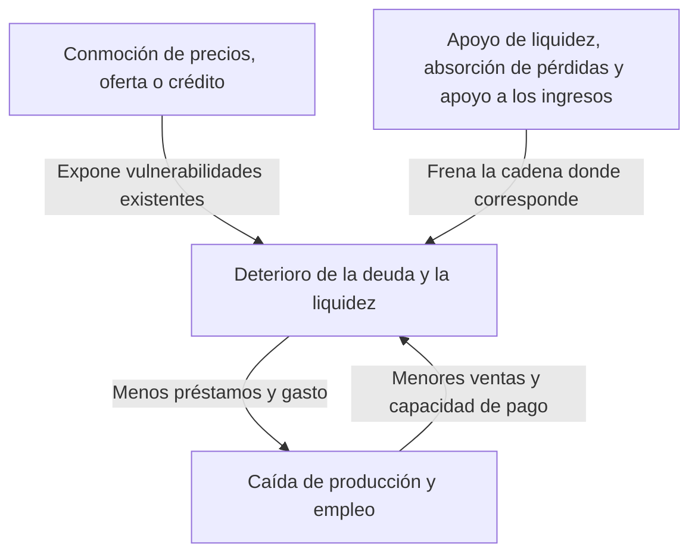
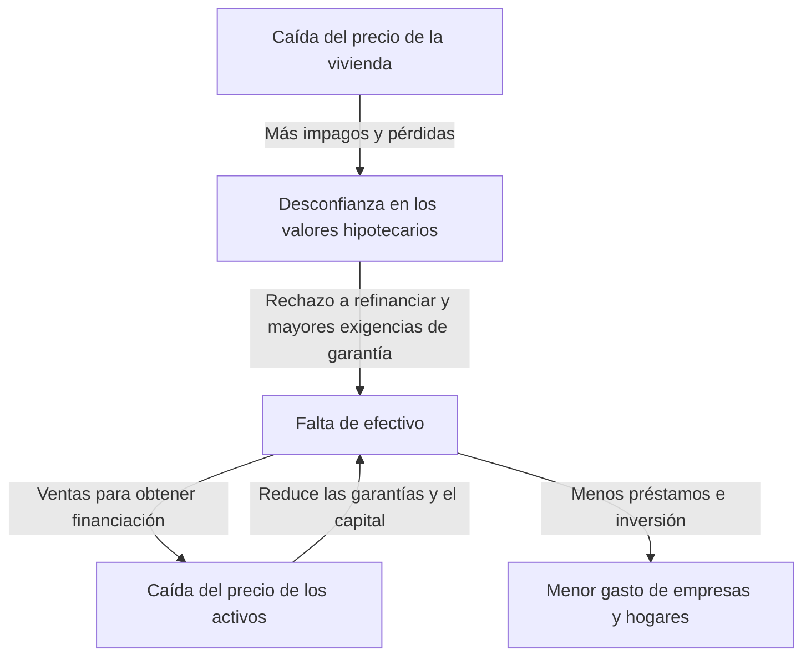

Al oír hablar de la crisis de Lehman Brothers, quizá imaginemos quiebras bancarias, desplomes bursátiles y desempleo como partes de un mismo acontecimiento. Pero ¿cómo pudo la quiebra de una sola empresa provocar recortes de producción en fábricas de todo el mundo y pérdidas de ingresos familiares? Y, si ambos fueron desplomes bursátiles, ¿por qué el lunes negro de 1987 no tuvo las mismas consecuencias que la Gran Depresión de los años treinta?

Para comprender las conmociones económicas no basta con memorizar nombres y fechas. Hay que distinguir qué cambió primero, qué vulnerabilidades se habían acumulado antes y cómo se transmitieron las pérdidas y la incertidumbre de unos agentes a otros. Separar estas tres preguntas permite seguir una historia aparentemente compleja como una cadena de causas y efectos.

Este artículo examina 16 episodios representativos entre 1929 y 2023. No pretende ofrecer una cronología exhaustiva de las crisis de todos los países, sino seleccionar casos que permitan comparar mecanismos diferentes. Utilizamos «conmoción económica» en un sentido amplio, que abarca no solo las crisis financieras, sino también los cambios bruscos en el suministro energético, las epidemias y las transformaciones del régimen monetario. Cuando existen debates académicos sobre las causas de una crisis, no presentamos una única interpretación como respuesta definitiva.

## Una distinción inicial: conmoción y crisis no son lo mismo

Una conmoción es un acontecimiento que altera bruscamente las condiciones de la economía: deja de llegar petróleo, caen los precios de la vivienda o los inversores extranjeros retiran sus fondos. Una crisis, en cambio, aparece cuando las instituciones y los mecanismos de financiación existentes no pueden absorber ese cambio y dejan de funcionar los fundamentos de la actividad económica.

Es parecido a distinguir entre un tifón, la fragilidad de un dique y la propagación de una inundación. Sin embargo, en economía también cambia, por decisiones humanas, el comportamiento que desempeña el papel del dique. Si los bancos reducen sus préstamos para protegerse, algunas empresas pueden quebrar y aumentar las pérdidas de esos mismos bancos. Una defensa racional para cada participante puede amplificar la crisis en el conjunto.

En una conmoción de demanda disminuye el gasto destinado a comprar e invertir. En una de oferta escasean las materias primas o el trabajo, por lo que se reduce la producción posible o aumentan los costes. En una conmoción financiera se deteriora la función de intermediar fondos y mantener los pagos. En las crisis reales estos fenómenos se superponen y pueden cambiar de naturaleza durante su desarrollo.

Las flechas del diagrama no actúan siempre con la misma intensidad. Un capital suficiente, una financiación estable y unas instituciones creíbles pueden limitar la propagación aunque se produzcan pérdidas. A la inversa, mecanismos que parecen eficientes en tiempos normales pueden convertirse simultáneamente en puntos débiles en situaciones extremas.

## Una tabla comparativa para orientarse

| Período | Acontecimiento | Vulnerabilidad o mecanismo de transmisión principal |
| --- | --- | --- |
| 1929 y años treinta | Gran Depresión | Pánicos bancarios, contracción del crédito, deflación y restricciones del patrón oro |
| 1971 | Conmoción de Nixon | Pérdida de confianza en la convertibilidad del dólar en oro y cambio del régimen monetario |
| 1973–1974 | Primera crisis del petróleo | Cambios bruscos en oferta y precio del petróleo, y transferencia de ingresos desde los importadores |
| Aproximadamente 1978–1982 | Segunda crisis del petróleo y endurecimiento monetario | Temor al desabastecimiento, expectativas inflacionarias y adaptación a tipos elevados |
| Desde 1982 | Crisis de la deuda latinoamericana | Deuda en divisas, tipos variables e insuficientes ingresos en moneda extranjera |
| 1987 | Lunes negro | Operaciones en la misma dirección, liquidez de mercado y problemas de liquidación |
| Años noventa | Estallido de la burbuja japonesa | Caída del valor de las garantías, préstamos deteriorados y prolongada devolución de deuda |
| 1994–1995 | Crisis monetaria mexicana | Reversión de entradas de capital, deuda a corto plazo y obligaciones vinculadas al dólar |
| 1997–1998 | Crisis monetaria asiática | Desajustes de monedas y vencimientos, salidas de capital y crisis bancarias |
| 1998 | Crisis rusa y de LTCM | Desconfianza en la deuda pública, búsqueda de refugio y apalancamiento |
| Aproximadamente 2000–2002 | Estallido de la burbuja puntocom | Revisión de expectativas de beneficios y caída de financiación bursátil e inversión |
| 2007–2009 | Crisis financiera mundial y quiebra de Lehman Brothers | Crédito hipotecario, titulización y retirada de financiación a corto plazo |
| Principios de los años 2010 | Crisis de deuda europea | Nexo entre solvencia bancaria y soberana, y debilidades institucionales de la unión monetaria |
| 2020 | Conmoción de la COVID-19 | Interrupción simultánea de oferta y demanda por los contagios y los cambios de comportamiento |
| Desde 2021–2022 | Conmoción inflacionaria y energética | Recuperación de la demanda, restricciones de oferta y alteraciones bélicas de los mercados de recursos |
| 2023 | Inestabilidad bancaria estadounidense | Riesgo de tipos de interés, concentración de depósitos y retirada acelerada de fondos |

Los períodos señalan los años en que mejor se distinguen las características de cada crisis; no representan recesiones sincronizadas en todo el mundo. El comienzo de una recesión estadounidense, el punto mínimo del ciclo japonés y el mínimo bursátil, por ejemplo, no coinciden necesariamente. También cambia el significado de «la crisis terminó» según se hable de estabilización financiera, recuperación del empleo o conclusión del saneamiento de la deuda.

## El crac de 1929 y la Gran Depresión: no todo fueron pérdidas bursátiles

El desplome de la bolsa estadounidense en el otoño de 1929 simboliza la Gran Depresión. Sin embargo, la caída de las cotizaciones no explica por sí sola la profundidad y duración de la contracción posterior. La economía estadounidense había entrado en recesión antes del crac, y los pánicos bancarios posteriores dañaron todavía más el crédito y el gasto.

Los bancos prometen devolver los depósitos a corto plazo mientras prestan a empresas y familias a plazos largos. Si muchos depositantes exigen efectivo simultáneamente, un banco puede quedarse sin capacidad de pago inmediata aunque sus activos no hayan perdido todo su valor. Estados Unidos todavía no contaba con un seguro federal de depósitos como el actual.

La extensión de las quiebras bancarias y las retiradas de depósitos dificultó que las empresas consiguieran capital circulante. Pagar salarios, comprar materias primas y mantener existencias se volvió más complicado, reduciendo el empleo y la producción. El desempleo y la pérdida de ingresos contrajeron el consumo y debilitaron aún más la capacidad de devolver préstamos. Este proceso perjudicó también a familias que no poseían acciones.

La bajada de precios tampoco ofrece necesariamente alivio. Si el importe nominal de la deuda permanece fijo, una caída de ventas o salarios hace más pesada su devolución. No supone la misma carga deber cinco millones de yenes con unos ingresos anuales de cinco millones que seguir debiendo esos cinco millones cuando los ingresos caen a tres millones y medio. Aunque sea un ejemplo hipotético, muestra cómo la deflación y la deuda pueden empeorarse mutuamente.

Además, bajo el patrón oro, defender la confianza en la conversión de la moneda en oro entraba en conflicto con la expansión monetaria interna. El endurecimiento destinado a frenar las salidas de oro podía agravar la escasez de financiación durante la recesión. El proteccionismo y las relaciones internacionales de deuda añadieron dificultades. Los [materiales históricos de la Reserva Federal](https://www.federalreservehistory.org/essays/banking-panics-1931-33) explican cómo las salidas de oro y las retiradas de depósitos presionaron simultáneamente a los bancos.

La lección de la Gran Depresión no es que sostener las cotizaciones resuelva todo. Es que, cuando se hunden los pagos, la intermediación crediticia y la confianza en los depósitos, las pérdidas financieras pueden transformarse en un deterioro duradero de la capacidad productiva. Los investigadores difieren en el peso que atribuyen a las autoridades monetarias y al patrón oro, pero reducirlo todo a un único día de desplome resulta demasiado simplista.

## La conmoción de Nixon de 1971: una promesa de conversión dejó de ser sostenible

En el sistema de Bretton Woods de la posguerra, numerosas monedas mantenían un vínculo cambiario fijo con el dólar, y Estados Unidos respaldaba un mecanismo para convertir en oro, bajo determinadas condiciones, los dólares en manos de autoridades monetarias extranjeras. No era un sistema en el que cualquiera pudiera convertir libremente en oro todos los billetes de dólar de uso cotidiano.

La expansión del comercio y las finanzas internacionales requería dólares disponibles en el mundo. Pero, cuanto más crecían las tenencias de dólares en el extranjero, más dudas surgían sobre la promesa de conversión en relación con las reservas estadounidenses de oro. El temor a que dejara de cumplirse impulsaba a convertir antes que los demás, desestabilizando aún más el sistema.

En agosto de 1971, el presidente Nixon anunció, entre otras medidas, la suspensión de la convertibilidad del dólar en oro. Después se intentó conservar el sistema ajustando los tipos de cambio, hasta que las principales monedas pasaron a flotar en 1973. Imaginar que todos los tipos de cambio fijos del mundo terminaron a la vez un día de 1971 oculta esa secuencia. Esta [explicación de Federal Reserve History](https://www.federalreservehistory.org/essays/gold-convertibility-ends) permite revisar los objetivos de las medidas y la transición institucional.

Para las empresas japonesas, el cambio convirtió el tipo de cambio en una importante fuente de variación de sus planes. Con los mismos ingresos por exportaciones en dólares, la apreciación del yen reducía las ventas expresadas en yenes. Por otro lado, podía abaratar las importaciones, de modo que exportadores e importadores no sufrían los mismos efectos.

Se trató principalmente de una conmoción del régimen monetario y de la política económica. No conviene encajarla sin matices en la misma categoría que una sucesión de quiebras bancarias. Muestra que fijar una relación de intercambio puede estabilizar las transacciones, pero también generar ajustes importantes cuando desaparecen las condiciones que permitían mantener esa promesa.

## La primera crisis del petróleo de 1973–1974: se disparan los costes de producción

En el contexto de la guerra de octubre de 1973 en Oriente Medio, los países árabes productores restringieron el suministro y aplicaron un embargo a Estados Unidos y otros países, mientras el precio del crudo aumentaba bruscamente. Es importante no confundir la OAPEC, la organización de países árabes productores que llevó a cabo el embargo, con la OPEP, que reúne a un conjunto más amplio de productores. Coincidieron restricciones de suministro, políticas de precios de los productores y una demanda mundial ya fuerte. Estos [materiales históricos sobre la primera crisis del petróleo](https://www.federalreservehistory.org/essays/oil-shock-of-1973-74) ordenan ese contexto.

El petróleo no sirve únicamente para mover automóviles. Es un insumo de la logística, la generación eléctrica, la industria química y muchas otras actividades. Como resulta difícil sustituir rápidamente combustibles y equipos, incluso una escasez relativamente pequeña puede provocar grandes oscilaciones de precio. Cuando oferta y demanda responden poco al precio, este debe absorber buena parte del ajuste.

Los importadores necesitan transferir al extranjero más ingresos para obtener la misma cantidad de crudo. Si las empresas trasladan el coste a sus precios, disminuye el poder adquisitivo de las familias; si no pueden hacerlo, caen sus beneficios. Por ambas vías se reduce la capacidad de consumir e invertir.

En este caso pueden coincidir inflación y deterioro económico: la estanflación. Estimular fuertemente el gasto porque la demanda es débil no crea de inmediato más petróleo ni más instalaciones productivas. Pero endurecer mucho la política atendiendo solo a los precios puede agravar el daño al empleo.

Tampoco el desorden de la economía japonesa se explica exclusivamente por el petróleo. Influyeron la demanda, las condiciones monetarias y las expectativas inflacionarias de la época. Las mejoras posteriores en eficiencia energética y la transformación industrial cambiaron su resistencia ante perturbaciones similares de los precios de importación. La intensidad de una conmoción de oferta depende tanto del precio de un recurso como del grado de dependencia respecto a él.

## La segunda crisis del petróleo y el giro hacia tipos altos: frenar la inflación también tiene costes

La interrupción de la producción vinculada a la revolución iraní de 1978–1979 volvió a sacudir el mercado petrolero. No obstante, el encarecimiento no puede explicarse como una proporción mecánica de la producción perdida. El temor a una reducción futura aún mayor impulsó la demanda para acumular existencias. La preocupación por el futuro puede elevar la demanda presente. Esta [explicación de la segunda crisis del petróleo](https://www.federalreservehistory.org/essays/oil-shock-of-1978-79) analiza tanto la caída de la oferta como la demanda precautoria.

Cuando una economía ya lleva tiempo sufriendo inflación, empresas y trabajadores incorporan nuevas subidas previstas al fijar precios y salarios. Esto no significa que los salarios sean siempre los únicos responsables del aumento de precios. Los costes de los recursos, la demanda, la confianza en la política monetaria y la estructura de los contratos condicionan la persistencia inflacionaria.

En Estados Unidos, bajo Paul Volcker, que asumió la presidencia de la Reserva Federal en 1979, avanzó un endurecimiento monetario centrado en combatir la inflación. El aumento de tipos redujo las compras de vivienda y la inversión empresarial, imponiendo un coste considerable a la actividad y el empleo. Las recesiones alrededor de 1980 y a comienzos de esa década incluyeron tanto el encarecimiento del petróleo como la adaptación a ese cambio de política.

El endurecimiento monetario no es una política para extraer petróleo. Pretende contener el gasto y el crédito y modificar la expectativa de que las subidas de precios continuarán durante mucho tiempo. Como no elimina las restricciones de oferta, frenar la inflación ocasiona costes en la economía real. La [historia de la Gran Inflación](https://www.federalreservehistory.org/essays/great-inflation) ayuda a entender la relación entre las decisiones de política económica y los precios.

Además, el aumento de los tipos estadounidenses no quedó dentro de sus fronteras. Llegó a países y empresas endeudados en dólares como un empeoramiento de las condiciones de pago. Ese vínculo es esencial para comprender la siguiente crisis, la de la deuda latinoamericana.

## La crisis de deuda latinoamericana desde 1982: la moneda y el tipo de interés de la deuda se vuelven una carga

Durante los años setenta se expandieron los préstamos de la banca internacional, respaldados, entre otros flujos, por los fondos obtenidos por los exportadores de petróleo. Los países latinoamericanos también tomaron prestadas grandes cantidades de divisas. Pero poder obtener un préstamo no equivale a poder devolverlo con los futuros ingresos en moneda extranjera.

La deuda en dólares no se paga simplemente emitiendo moneda nacional. Es necesario conseguir dólares mediante exportaciones, entradas de capital o reservas de divisas. Si el contrato tiene un tipo variable, el aumento de los tipos internacionales eleva los intereses. Al mismo tiempo, una economía mundial débil dificulta el crecimiento de las exportaciones y de los ingresos por recursos naturales.

En agosto de 1982, las dificultades de México para atender su deuda hicieron visible la crisis, y posteriormente muchos países tuvieron que reestructurar sus obligaciones. Como los bancos internacionales mantenían una elevada exposición crediticia, el problema no se limitaba a los países prestatarios. Estos [materiales sobre la crisis de deuda latinoamericana](https://www.federalreservehistory.org/essays/latin-american-debt-crisis) explican también el papel de los acreedores.

Cuando se interrumpen los nuevos préstamos, dejan de poder mantenerse los pagos sostenidos mediante refinanciaciones sucesivas. Reducir importaciones puede ahorrar divisas, pero, si también se recortan máquinas y componentes necesarios para producir, se daña la capacidad de generar ingresos futuros. En algunos países, el ajuste fiscal, la depreciación monetaria y los problemas bancarios se combinaron en un estancamiento prolongado.

La lección no es simplemente que endeudarse sea malo. Importa en qué moneda está la deuda, qué interés paga, cuándo vence y qué ingresos la respaldan. Aunque una inversión de largo plazo sea socialmente útil, una combinación inadecuada de vencimientos e ingresos en divisas puede agotar la financiación antes de que dé sus frutos.

## El lunes negro de 1987: un mercado donde todos esperaban vender pierde profundidad

El 19 de octubre de 1987, el índice Dow Jones estadounidense cayó un 22,6 % en una sola jornada. Sin embargo, ese desplome no se convirtió inmediatamente en una crisis bancaria o una recesión semejante a la Gran Depresión en Estados Unidos. Es un caso fundamental para distinguir una caída brusca de precios del colapso de todas las funciones financieras.

No hubo una sola noticia causante. Se combinaron la preocupación por cotizaciones elevadas, la incertidumbre sobre intereses y tipos de cambio, y la estructura del mercado. También se señala como amplificador de las ventas el «seguro de cartera», que intentaba limitar pérdidas vendiendo futuros y otros instrumentos cuando caía el mercado. Que su nombre incluyera la palabra seguro no significaba que alguien garantizara incondicionalmente el reembolso de las pérdidas.

Para que un inversor reduzca su riesgo vendiendo, alguien tiene que comprar. Si muchos participantes reaccionan al mismo movimiento de precios vendiendo a la vez, faltan órdenes de compra al precio anterior. El precio baja más y desencadena nuevas ventas, formando un círculo.

Además, las diferencias entre negociación y liquidación de acciones, futuros y opciones complicaban las necesidades de financiación. Aunque dos operaciones se compensen contablemente, si sus fechas de pago difieren hace falta efectivo para cubrir el intervalo. [Federal Reserve History](https://www.federalreservehistory.org/essays/stock-market-crash-of-1987) analiza esa estructura del mercado y el apoyo a la liquidez.

La disposición del banco central a suministrar liquidez y la continuidad de los préstamos de las entidades financieras ayudaron a contener la cadena. Este caso muestra que el porcentaje de caída bursátil no basta para medir la profundidad de una crisis. El significado de una misma variación de precios depende de quién pierde, cuánto debe y qué papel cumple en los pagos y la concesión de crédito.

## El estallido de la burbuja japonesa: terrenos, bancos y balances empresariales estaban conectados

En la segunda mitad de los años ochenta subieron fuertemente las cotizaciones y los precios del suelo en Japón. Coincidieron la expansión monetaria, el comportamiento bancario bajo la liberalización financiera, los préstamos garantizados con terrenos y las expectativas de revalorización. En lugar de atribuirlo todo al Acuerdo del Plaza o a los tipos bajos, conviene analizar la interacción entre crédito y precios de los activos.

Cuando sube el precio de un terreno, aumenta lo que puede obtenerse prestado utilizándolo como garantía. Si ese dinero se destina a comprar inmuebles, impulsa de nuevo los precios. Cuando crece el crédito basado en vender la garantía más cara, en vez de en los rendimientos futuros, la propia subida de precios pasa a sostener el endeudamiento.

Después del endurecimiento monetario y de restricciones a la financiación inmobiliaria, la caída de los activos durante los años noventa invirtió ese mecanismo. Las empresas conservaron las deudas contraídas al comprar, mientras disminuía el valor de sus garantías y activos. En los bancos se acumularon préstamos difíciles de cobrar, es decir, créditos deteriorados. Este [estudio del Banco de Japón sobre la burbuja](https://www.imes.boj.or.jp/research/abstracts/english/me14-1-6.html) examina las relaciones entre crédito, suelo y bolsa.

Cuando las pérdidas reducen el capital de los bancos, estos tienen más dificultades para conceder nuevos préstamos. Al mismo tiempo, las empresas priorizan devolver deuda frente a invertir, aunque bajen los intereses. Como prestamistas y prestatarios reducen el gasto desde ambos lados, una bajada de tipos no garantiza que la inversión vuelva a su comportamiento anterior.

Si se retrasa el reconocimiento y saneamiento de las pérdidas, pueden coexistir la financiación continuada de empresas débiles y la escasez de fondos para negocios prometedores. La inestabilidad financiera de 1997–1998 demostró que la fragilidad bancaria persistía después de la caída de los activos. El Banco de Japón analiza la [deflación y el ajuste de balances desde los años noventa](https://www.boj.or.jp/en/about/press/koen_2024/ko240527b.htm) como antecedentes importantes del estancamiento prolongado.

Sin embargo, no puede reducirse toda la evolución posterior de Japón al estallido de la burbuja. También intervienen la demografía, la productividad, la competencia internacional y las políticas. La idea central es que, cuando la caída de activos permanece en los balances, el comportamiento de bancos y empresas no se normaliza inmediatamente porque la bolsa rebote durante un tiempo.

## La crisis monetaria mexicana de 1994–1995: sin refinanciación, defender la moneda se vuelve difícil

En México, durante 1994, la incertidumbre política y el aumento de los tipos estadounidenses, entre otros factores, desestabilizaron las entradas de capital extranjero. Un país con déficit por cuenta corriente necesita financiarlo mediante entradas de fondos u otros mecanismos. Un déficit no implica siempre una crisis, pero el ajuste resulta duro si esas entradas se interrumpen bruscamente.

Las reservas de divisas pueden utilizarse para sostener el tipo de cambio, pero son limitadas. Los tesobonos, cuya emisión aumentó el Gobierno, eran deuda a corto plazo cuyo reembolso estaba vinculado al dólar. Una fórmula que apartaba del inversor el temor a la depreciación del peso aumentaba, por otro lado, el riesgo cambiario y de refinanciación del Gobierno.

El cambio de política cambiaria de diciembre de 1994 no restableció suficientemente la confianza y el peso se depreció con fuerza. Aumentó la carga en moneda nacional de la deuda vinculada al dólar, y la disposición de los inversores a refinanciarla se convirtió en un problema urgente. Esta [evaluación contemporánea del FMI](https://www.imf.org/en/news/articles/2015/09/28/04/53/spmds9508) señala la vulnerabilidad de la financiación a corto plazo y de la composición de la deuda.

Una depreciación puede favorecer las exportaciones y, simultáneamente, encarecer los pasivos vinculados a divisas. El daño a los balances hace insuficiente la explicación de que basta con devaluar para recuperar competitividad y resolver el problema. Si se deterioran empresas y bancos, incluso obtener financiación para aumentar las exportaciones se vuelve difícil.

La crisis muestra por qué importa observar no solo el total de deuda pública, sino también cuánto debe devolverse en los próximos meses. Dos deudas del mismo importe ofrecen distinta resistencia a una pérdida de confianza si una distribuye sus pagos durante muchos años y la otra los concentra en un período breve.

## La crisis monetaria asiática de 1997–1998: la deuda privada en divisas sacude toda la economía

En julio de 1997, la renuncia de Tailandia a mantener el tipo de cambio del baht desencadenó una crisis que se extendió a Indonesia, Corea del Sur y otros países. Sus instituciones y vulnerabilidades, sin embargo, no eran idénticas. Explicarlo todo como resultado de una gestión fiscal irresponsable ignora el endeudamiento de empresas y bancos privados.

Muchas operaciones consistían en endeudarse a corto plazo en dólares u otras divisas e invertir a largo plazo en inmuebles o negocios nacionales. Si la moneda de devolución difiere de la moneda de los ingresos, existe un desajuste de monedas; si la deuda vence antes de recuperar la inversión, existe un desajuste de vencimientos. Mientras el cambio permanezca estable y sea posible refinanciar, esas debilidades pueden resultar poco visibles.

Pero, cuando los inversores se apresuran a recuperar sus fondos, aumenta la demanda de divisas y se deprecia la moneda. La depreciación eleva la carga de la deuda externa y agrava la desconfianza en las empresas. Como la incertidumbre provoca nuevas salidas, tipo de cambio y capacidad de pago se deterioran mutuamente. Esta [evaluación del sector financiero realizada por el FMI](https://www.imf.org/external/pubs/ft/op/opfinsec/index.htm) ordena las relaciones entre las fragilidades bancarias y empresariales y el régimen cambiario.

Por ejemplo, una empresa que toma prestado un millón de dólares cuando cada dólar cuesta 100 unidades de moneda nacional tiene un principal equivalente a 100 millones de unidades. Si el cambio pasa a 150 por dólar, ese mismo principal equivale a 150 millones. Si las ventas siguen denominadas en moneda nacional, la carga crece sin pedir un solo préstamo adicional. Los ingresos exportadores y las coberturas cambiarias modificarían el resultado, por lo que este es un ejemplo hipotético sin protección.

Subir los tipos para defender la moneda puede frenar las salidas de capital, pero perjudica a los prestatarios nacionales. Permitir la depreciación, en cambio, daña las deudas en divisas. Las respuestas se adoptaron dentro de esa difícil combinación, y continúan los debates sobre las condiciones del apoyo del FMI y la adecuación de las políticas fiscales y monetarias.

La transmisión internacional no ocurre automáticamente por la proximidad geográfica. Puede deberse a compartir bancos acreedores, competir en mercados de exportación o ser percibidos como economías similares por los inversores. Cuando un prestamista común sufre pérdidas, puede retirar también fondos de países con problemas menores.

## Rusia y LTCM en 1998: operaciones diversificadas pueden perder al mismo tiempo

En Rusia, durante 1998, coincidieron debilidades fiscales y recaudatorias, bajos precios de recursos naturales e incertidumbre sobre la financiación. En agosto se anunciaron, entre otras medidas, la devaluación del rublo y la reestructuración de deuda pública interna. Se debilitó la idea de que la deuda gubernamental siempre es segura, y los inversores de todo el mundo pasaron a privilegiar la seguridad y la facilidad para convertir activos en efectivo.

En medio de esas turbulencias, el fondo de cobertura Long-Term Capital Management, LTCM, sufrió pérdidas graves. Interpretar su estrategia simplemente como una apuesta por bonos rusos impide ver la amplitud del problema. Lo esencial es que utilizaba un fuerte apalancamiento en operaciones que apostaban, entre otras cosas, por la convergencia de precios de instrumentos financieros parecidos.

Las diferencias pequeñas de precios pueden generar beneficios cuando las operaciones son muy grandes. Pero, si durante una crisis los participantes se concentran en activos líquidos, esas diferencias pueden ampliarse en vez de estrecharse. Aunque sea acertada la previsión de que algún día volverán a converger, no es posible esperar indefinidamente si antes se exige aportar garantías adicionales.

Aunque las posiciones se repartan entre distintos mercados, la diversificación efectiva sigue siendo limitada si todas dependen de que se conserve la liquidez de mercado. El aumento de las correlaciones durante una crisis no es únicamente un cambio en una cifra matemática: también significa que muchas personas venden simultáneamente por los mismos motivos.

La Reserva Federal de Nueva York facilitó las conversaciones entre las entidades implicadas, y entidades financieras privadas aportaron capital. No debe confundirse esto con una inyección directa de dinero público de la Reserva Federal en LTCM. El [testimonio del entonces presidente de la Reserva Federal de Nueva York](https://www.newyorkfed.org/newsevents/speeches/1998/mcd981001.html) explica ese reparto de funciones. El valor a largo plazo previsto por un modelo y el efectivo necesario para pagar mañana son problemas diferentes.

## El estallido de la burbuja puntocom: una tecnología real no garantiza cotizaciones correctas

Al final de los años noventa, la expectativa de que internet transformaría la industria atrajo fondos hacia empresas tecnológicas y de telecomunicaciones. El cambio tecnológico fue realmente profundo. Pero que una tecnología útil se difunda no implica que todas las empresas obtengan beneficios elevados.

El valor empresarial depende de los beneficios o flujos de caja futuros y de cómo se descuentan a su valor presente. Si la atención se concentra únicamente en el tamaño del mercado y se subestiman los costes de captar clientes, la competencia, el consumo de efectivo y las inversiones adicionales, una pequeña revisión del crecimiento esperado puede cambiar mucho la valoración.

Desde 2000, la corrección de expectativas excesivas de beneficios dificultó captar fondos mediante acciones, y las empresas recortaron plantillas e inversión. También se corrigieron excesos de inversión en infraestructuras de telecomunicaciones y otras instalaciones. A la pérdida de riqueza familiar provocada por la bolsa se añadió la reducción de la financiación necesaria para continuar los negocios. El [informe anual de 2001 de la Reserva Federal](https://www.federalreserve.gov/boarddocs/rptcongress/annual01/ar01.pdf) documenta esos cambios de inversión y financiación.

Tampoco es preciso afirmar que la recesión estadounidense de 2001 empezó únicamente con los atentados de septiembre. La actividad se había debilitado antes; los atentados añadieron un golpe a la demanda de viajes y a la incertidumbre. Cuando las conmociones se superponen, hay que distinguir su orden.

Comparada con la crisis de 2008 centrada en la financiación inmobiliaria, una proporción mayor de las pérdidas recayó en accionistas, y fue diferente la amplificación a través de bancos y mercados de financiación a corto plazo. Una acción no obliga a la empresa a devolver su precio anterior cuando cae, mientras que la deuda mantiene su obligación de pago. Esa diferencia de financiación condiciona cuánto puede transformarse la decepción tecnológica en una crisis financiera profunda.

## La crisis de Lehman Brothers: las pérdidas hipotecarias paralizaron los mercados de financiación a corto plazo

### La crisis no comenzó de repente en septiembre de 2008

Lo que en Japón se denomina «conmoción de Lehman» tiene como símbolo la quiebra del banco de inversión estadounidense Lehman Brothers el 15 de septiembre de 2008. Pero los problemas de la vivienda estadounidense y de sus productos financieros asociados llevaban tiempo desarrollándose. En 2007 ya habían aparecido tensiones en los mercados de financiación a corto plazo y en la primavera de 2008 se produjo la crisis de Bear Stearns.

La revalorización de la vivienda tranquilizaba tanto a prestamistas como a prestatarios. La expectativa de poder vender o refinanciar si surgían dificultades sostenía los préstamos. Cuando bajaron los precios, aumentaron los casos en que vender no bastaba para devolver la deuda y se deshicieron las condiciones que permitían refinanciar. Esta [explicación de la crisis hipotecaria subprime](https://www.federalreservehistory.org/essays/subprime-mortgage-crisis) analiza la interacción entre expansión crediticia y precios de la vivienda.

Decir simplemente que pidieron préstamos personas con poca capacidad de pago es insuficiente. Sin examinar la evaluación de los préstamos, los incentivos de la titulización, las valoraciones de los inversores y el capital y financiación de las entidades, no se explica por qué impagos localizados se convirtieron en una crisis mundial.

### La titulización no elimina el riesgo

La titulización consiste básicamente en agrupar préstamos hipotecarios y distribuir entre inversores los ingresos de sus pagos. Al establecer distintas prioridades, pueden crearse partes que absorban pérdidas primero y otras que las sufran después. Pero no desaparecen las pérdidas existentes en el conjunto.

Combinar préstamos de muchas regiones permite diversificar riesgos locales. Sin embargo, si caen simultáneamente los precios en amplias zonas y se generalizan el desempleo y las dificultades para refinanciar, los impagos se vuelven más correlacionados. Incluso los tramos con buenas calificaciones pueden perder si fallan los supuestos en que se apoyaban.

Además, cuanto más complejos son los productos, más difícil resulta saber quién soporta finalmente cada pérdida. Aunque las pérdidas propias sean pequeñas, desconocer el estado de una contraparte puede bastar para dejar de prestarle. Importaba no solo el importe de las pérdidas, sino la incertidumbre sobre dónde se encontraban.

### La interrupción de la financiación a corto plazo obliga a vender activos

Los bancos de inversión y otras entidades mantenían activos recuperables a largo plazo financiándolos mediante repos y valores a corto plazo. Un repo tiene una naturaleza próxima a la financiación a corto plazo garantizada con valores. Funciona mientras se renueva, pero, si el prestamista se niega a continuar, hace falta efectivo de inmediato.

Si antes podían obtenerse 95 unidades prestadas contra una garantía valorada en 100 y, al crecer la desconfianza, solo pueden obtenerse 80, deben conseguirse las 15 restantes por otra vía. Es un ejemplo hipotético del mecanismo. Si además cae el precio de la propia garantía, aumenta todavía más el efectivo necesario.

Vender activos para conseguir efectivo reduce sus precios de mercado. Otras entidades sufren entonces caídas en el valor de sus carteras o exigencias adicionales de garantías y también deben vender. Aunque no haya depositantes formando colas ante oficinas, la retirada simultánea de los proveedores de financiación a corto plazo tiene una estructura parecida a una corrida bancaria.

### Los problemas financieros llegan a las fábricas y los hogares

Después de la quiebra de Lehman aumentaron bruscamente la desconfianza entre contrapartes y las perturbaciones de los mercados a corto plazo. Fueron necesarias respuestas diversas: apoyo a AIG, recapitalizaciones de entidades e inyecciones de liquidez de bancos centrales. Esta [visión de conjunto de la crisis financiera mundial](https://www.federalreservehistory.org/essays/great-recession-and-its-aftermath) organiza la transmisión desde la vivienda hacia las finanzas y la economía real.

Cuando los bancos recortan crédito, a las empresas les cuesta financiar tanto inversiones como pagos cotidianos. Las familias, además de perder valor en vivienda y acciones, posponen compras duraderas por temor al desempleo. Así, las empresas exportadoras que no poseían directamente esos productos financieros también reciben menos pedidos. La contracción de la demanda mundial y del comercio contribuyó al fuerte impacto sobre Japón.

Se debate cuánto peso atribuir a los tipos bajos, los flujos internacionales de capital, la regulación y supervisión o los incentivos de remuneración. Pero resulta indispensable reconocer la combinación de pérdidas hipotecarias, apalancamiento elevado, financiación a corto plazo y opacidad del riesgo. Lehman fue un importante punto de amplificación, no una única empresa que hubiera creado todos los problemas acumulados.

## La crisis de deuda europea: gobiernos y bancos se debilitan mutuamente

Entre finales de 2009 y 2010 aumentó la preocupación por las finanzas griegas, y después la desconfianza se extendió a varios países de la zona euro. Sin embargo, no puede trasladarse automáticamente el problema fiscal griego a todos los casos. En Irlanda y España fueron especialmente importantes los problemas inmobiliarios y bancarios.

Cuando cae la confianza en un Gobierno y baja el precio de sus bonos, se debilitan los bancos que los poseen. Si el Gobierno asume mayores cargas para sostener a esos bancos, aumenta a su vez la preocupación por las finanzas públicas. Una relación en que bancos y Estado respaldaban mutuamente su solvencia se transforma en otra en que se perjudican.

Como comparten moneda, los miembros de la zona euro no pueden devaluar individualmente ni fijar su propio tipo de interés oficial. Al comienzo de la crisis, sin embargo, la supervisión y resolución bancaria y los mecanismos fiscales de reparto de riesgos no estaban suficientemente integrados. En ciertos aspectos, las instituciones para gestionar crisis no habían avanzado al mismo ritmo que la integración monetaria.

Un aumento del interés de refinanciación eleva el servicio de la deuda y empeora su sostenibilidad. Los tipos altos nacidos del miedo pueden aproximar a la realidad aquello que se temía. Pero tampoco todo fue psicología de mercado sin fundamento: importaban la deuda, la productividad y las debilidades bancarias de cada país. Esta [evaluación de la crisis por el BCE](https://www.ecb.europa.eu/press/key/date/2018/html/ecb.sp180511.en.html) explica esas diferencias y las lecciones institucionales.

La austeridad pretende recuperar la confianza en la deuda, pero reducir rápidamente el gasto durante una recesión también reduce ingresos y recaudación. Por otra parte, el apoyo plantea quién absorbe las pérdidas y cómo evitar un endeudamiento excesivo futuro. Las actuaciones del BCE, los mecanismos de asistencia financiera y los avances hacia la unión bancaria buscaron romper esos círculos viciosos.

## La conmoción de la COVID-19 en 2020: primero se detuvo la actividad, no un producto financiero

La propagación de la COVID-19 limitó simultáneamente los desplazamientos, los servicios presenciales y el funcionamiento de fábricas y lugares de trabajo. No solo redujeron la actividad las restricciones oficiales, sino también las precauciones voluntarias para evitar contagios y las ausencias laborales. El origen fue distinto al de una crisis bancaria habitual.

Por el lado de la oferta, surgieron dificultades para trabajar, recibir componentes y transportar mercancías. Por el de la demanda, cayó el gasto en viajes, restauración y ocio, y se aplazaron compras por la incertidumbre sobre ingresos y perspectivas. También hubo desplazamientos de demanda desde servicios hacia bienes, por lo que no todas las industrias evolucionaron en la misma dirección. Este [análisis inicial del FMI](https://www.imf.org/en/Blogs/Articles/2020/03/09/blog030920-limiting-the-economic-fallout-of-the-coronavirus-with-large-targeted-policies) distingue ambos lados.

Aunque las ventas se detengan, continúan los alquileres y los pagos de deuda. Empresas que normalmente serían viables pueden quebrar si agotan su efectivo. Una interrupción temporal pasa entonces a ser un daño duradero por la pérdida de relaciones laborales y redes comerciales. Las políticas debían ayudar a empresas y familias a atravesar el período de suspensión.

Bajar los tipos no elimina directamente el riesgo de contagio ni la escasez de componentes. Era necesario combinar medidas sanitarias y de salud pública con apoyo a ingresos, mantenimiento del empleo y financiación. También aumentó bruscamente la demanda de efectivo en los mercados financieros, haciendo importante impedir que la conmoción real se transformara en disfunción financiera.

La recuperación tampoco fue uniforme. Aunque regrese la demanda, instalaciones cerradas, personal y logística internacional no se recuperan necesariamente al mismo ritmo. El problema inicial de demanda insuficiente puede convertirse durante la recuperación en falta de oferta de determinados productos. Esto resulta esencial para entender la fase inflacionaria posterior.

## La conmoción inflacionaria y energética desde 2021–2022: coincidieron varias restricciones

La inflación posterior a la pandemia no tuvo una sola causa. Se combinaron la recuperación y recomposición de la demanda, las alteraciones de las cadenas de suministro, los cambios en la oferta laboral y las condiciones fiscales y monetarias de cada país. Su peso varió según el lugar y el momento; aplicar una única explicación a Estados Unidos y Europa oculta diferencias importantes.

Los mercados energéticos ya estaban tensionados desde 2021. La invasión rusa de Ucrania en febrero de 2022 añadió una fuerte perturbación en gas, petróleo, electricidad y otros mercados. La guerra, las reducciones de suministro, las sanciones y los riesgos comerciales alteraron rutas y costes. La [explicación de la Agencia Internacional de la Energía](https://www.iea.org/topics/2022-energy-crisis) distingue la tensión previa de su agravamiento tras la invasión.

El gas, en particular, necesita gasoductos, instalaciones de licuefacción, buques y terminales receptoras. No siempre puede cubrirse inmediatamente la escasez de una región con recursos de otra. Que un recurso exista en el planeta no significa que pueda llegar al lugar requerido en el momento necesario. Esa restricción física amplifica la variación económica de los precios.

En los países importadores de energía, el encarecimiento de las importaciones eleva los costes empresariales y el coste de vida. Las subvenciones y la contención de precios pueden aliviar la carga inmediata, pero aumentan el coste fiscal y, según su diseño, debilitan los incentivos para ahorrar energía. Importa a quién se apoya y durante cuánto tiempo.

Los bancos centrales elevaron los tipos para evitar que se afianzara la inflación. Sin embargo, los intereses no aumentan directamente el suministro de gas. Actúan sobre precios mediante demanda y expectativas, pero también frenan vivienda e inversión y generan pérdidas en activos financieros existentes. Una menor inflación significa que los precios suben más despacio, no necesariamente que el coste de vida haya vuelto al nivel anterior.

## La inestabilidad bancaria estadounidense de 2023: incluso los bonos seguros tienen riesgo de tipos

La quiebra de Silicon Valley Bank, SVB, en marzo de 2023 demostró que las crisis bancarias no nacen únicamente de hipotecas problemáticas. Coincidieron el riesgo de tipos en bonos a largo plazo, la concentración de depositantes y la dependencia de grandes depósitos no cubiertos íntegramente por el seguro.

Los bonos con intereses fijos suelen bajar de precio cuando suben los tipos de mercado. Si los bonos nuevos pagan más, los antiguos con cupones bajos necesitan abaratarse para atraer compradores. Incluso un activo con poco riesgo de crédito, como un bono soberano, no tiene garantizado un precio constante si se vende antes del vencimiento.

La pérdida tiene distinto significado cuando puede mantenerse el activo hasta vencimiento y cuando debe venderse para afrontar retiradas de depósitos hoy. La clasificación contable puede modificar cuándo se reconoce, pero no elimina el precio de mercado al convertirlo urgentemente en efectivo. El problema remite a la estructura básica de un banco que financia activos largos con depósitos inmediatamente retirables.

En SVB, la concentración de clientes en industrias tecnológicas favorecía que sus necesidades de fondos y decisiones se movieran en la misma dirección. Las transferencias por internet y la circulación de información aceleran una corrida. Pero atribuirla solo a las redes sociales ocultaría las debilidades previas de gestión de activos y pasivos y de supervisión. El [informe de revisión de la Reserva Federal](https://www.federalreserve.gov/publications/2023-April-SVB-Key-Takeaways.htm) examina ambos ámbitos.

Ese año se extendió la incertidumbre a otros bancos, aunque sus activos y clientes no eran idénticos. En lugar de considerar el episodio una reproducción exacta de la crisis hipotecaria de 2008, resulta más útil identificar quién estaba expuesto a una variación brusca de tipos y de qué manera.

## Cuatro mecanismos que conectan esta historia

### Cuanto menor es el capital, mayor es el efecto de una pequeña caída de activos

Si llamamos $A$ a los activos, $D$ a los pasivos y $E$ al capital, un balance simplificado cumple la siguiente relación:

$$
E=A-D,\qquad L=\frac{A}{E}
$$

$L$ representa aquí el apalancamiento. Con activos de 100, pasivos de 95 y capital de 5, es de 20 veces. Suponiendo que el valor de los pasivos no cambia, una pérdida de 3 en los activos reduce el capital de 5 a 2. La caída de los activos es del 3 %, pero la pérdida del capital es del 60 %. El cálculo omite impuestos, coberturas y composición de activos, pero permite comprender intuitivamente la amplificación.

Si solo se observa un período de precios estables, el apalancamiento elevado parece eficiente. Cuando aumenta la volatilidad, sin embargo, puede obligar a vender o reducir préstamos para proteger el capital, aumentando las pérdidas de otros. Esta perspectiva conecta la burbuja japonesa, LTCM y la crisis financiera mundial.

### Liquidez y solvencia son diferentes, pero se influyen mutuamente

Un problema de solvencia significa que las obligaciones son excesivas frente a los activos e ingresos que podrán recuperarse. Uno de liquidez significa que falta efectivo para los pagos actuales, aunque existan activos recuperables más adelante. Esa diferencia explica que una empresa rentable pueda quebrar por dificultades de tesorería.

Si un banco central u otra institución cubre una falta temporal de fondos, puede evitarse la venta apresurada de activos sanos. Pero, si realmente faltan activos de valor suficiente, prestar más no elimina las pérdidas. Pueden hacer falta recapitalización, reestructuración de deuda o reorganización de actividades.

En la práctica resulta difícil distinguir ambas situaciones inmediatamente, y las ventas forzosas por falta de liquidez pueden destruir la solvencia. En sentido contrario, las dudas sobre pérdidas provocan retiradas de depósitos. Ni afirmar que suministrar efectivo siempre lo resuelve todo ni sostener que toda entidad con pérdidas debe abandonarse permite captar esta interacción.

### Los contratos de moneda e intereses generan cargas inesperadas

El valor en moneda nacional de una deuda denominada en divisas puede expresarse, de forma simplificada, así:

$$
D_{\mathrm{home}}=eD_{\mathrm{foreign}}
$$

Aquí $e$ es la cantidad de moneda nacional necesaria para comprar una unidad de moneda extranjera. Si la depreciación eleva $e$, aumenta la carga aunque el principal en divisas no cambie. Si existen ingresos en esa divisa o coberturas, hay que incluir su efecto compensatorio.

Por otro lado, el precio de un bono de cupón fijo puede calcularse descontando sus pagos futuros al presente. En un modelo sencillo con pago periódico de intereses $C$, principal al vencimiento $F$, número de períodos restantes $T$ y tipo de descuento constante $y$,

$$
P=\sum_{t=1}^{T}\frac{C}{(1+y)^t}+\frac{F}{(1+y)^T}
$$

se obtiene la relación indicada. Manteniendo lo demás constante, una subida de $y$ reduce $P$. En la realidad, los tipos varían con el plazo y existen riesgo de crédito y amortizaciones anticipadas, por lo que esta fórmula no valora por sí sola todos los títulos. Aun así, explica por qué unos intereses mayores pueden elevar el rendimiento de nuevos préstamos y, al mismo tiempo, reducir el valor de los bonos largos existentes.

### Las conexiones internacionales transportan beneficios y conmociones

Las crisis se transmiten internacionalmente a través del comercio, las finanzas y los precios compartidos. Si una recesión reduce las importaciones de un país, afecta a las fábricas exportadoras. Si un banco global pierde, puede reducir préstamos en países aparentemente ajenos. Los cambios del petróleo o de los tipos en dólares llegan simultáneamente a muchas economías.

Distinguir estas vías es importante para diseñar respuestas. Recapitalizar bancos no devuelve por sí solo los pedidos a una empresa cuyas exportaciones se hunden. En cambio, si tiene pedidos pero no consigue capital circulante, reparar el canal de financiación puede ser eficaz. Bajo la expresión «recesión mundial» hay que identificar qué circuito se ha interrumpido.

## Por qué las respuestas económicas no tienen un remedio universal

Si predomina la insuficiencia de demanda, la expansión monetaria y el gasto público pueden sostener empleo y producción. Pero, si la oferta está muy limitada, estimular solo la demanda sin ampliar la oferta puede intensificar la inflación. Esto tampoco significa que ante una conmoción de oferta no deba hacerse nada: el apoyo focalizado a familias y empresas especialmente afectadas merece un análisis separado.

En una crisis bancaria hay que distinguir entre proteger los pagos y la confianza en los depósitos y rescatar incondicionalmente a directivos e inversores. Importa cómo se distribuyen las pérdidas: imponer condiciones a las recapitalizaciones, hacer que accionistas y ciertos acreedores absorban costes o reorganizar negocios manteniendo funciones esenciales.

Se denomina riesgo moral al problema de asumir riesgos excesivos esperando recibir ayuda. Por otra parte, rechazar todo apoyo en plena crisis puede arrastrar a empresas y familias que no originaron el problema. Por ello deben combinarse las normas de capital y liquidez, la transparencia y la preparación de mecanismos de resolución en tiempos normales con las medidas de apoyo durante las crisis.

También en las finanzas públicas, el margen de actuación no depende únicamente del volumen de deuda. Importan su moneda, intereses y vencimientos, la base tributaria, la relación institucional con el banco central y la confianza en las políticas. Eso no significa que endeudarse en moneda propia permita gastar sin límite ni coste: existen restricciones a través de los precios, el cambio y los recursos disponibles.

Evaluar una respuesta también presenta la dificultad de no observar directamente qué habría pasado sin intervenir. Que la economía empeore después de recibir apoyo no demuestra que este fuera inútil, ni que se recupere demuestra que todo se debió a la política. Hace falta contrastar otros países, desfases temporales, condiciones previas y diferencias institucionales.

## Preguntas para leer la próxima noticia económica

Ante una noticia sobre una nueva conmoción, conviene identificar primero qué precio o cantidad cambió. Bolsa, petróleo, cambio, intereses y pedidos de exportación afectan directamente a agentes diferentes. Después hay que preguntar de quién disminuyen los activos y a quién le aumentan deudas o pagos.

A continuación, conviene examinar si existe capital para absorber pérdidas, cuánta deuda vence pronto, si coinciden las monedas de ingresos y obligaciones y si hay una concentración de participantes que actuarán igual. Estas preguntas sirven para bancos, fondos, empresas, gobiernos y familias.

También es útil aclarar si la política pretende corregir falta de efectivo, absorber pérdidas, sostener demanda o aliviar insuficiencia de oferta. Aunque dos medidas compartan nombre, sus efectos y costes cambian si actúan sobre problemas distintos. Volver a las cotizaciones anteriores a la crisis tampoco equivale a recuperar las condiciones de vida.

Estas preguntas no permiten predecir la fecha de un desplome. Detectar una vulnerabilidad no garantiza que se produzca una crisis, pues las políticas y los ajustes privados pueden evitarla. La historia enseña menos a adivinar fechas que a comprender por qué vías se extenderán las pérdidas si ocurre un determinado cambio.

La Gran Depresión y la pandemia tuvieron orígenes muy distintos. También difieren las restricciones centrales de la primera crisis del petróleo y de Lehman Brothers. Aun así, reaparecen ciertas características: las promesas de pago permanecen cuando caen los ingresos, el efectivo inmediato no equivale al valor a largo plazo y la protección simultánea de muchos puede desestabilizar al conjunto.

La historia de las conmociones económicas no es una simple lista de fracasos. Es una historia sobre las condiciones en que funcionan los compromisos entre personas, empresas y Estados y aquellas en que necesitan respaldo. Comprender su estructura permite mirar más allá del titular de otro gran desplome e identificar tanto los problemas particulares del presente como los mecanismos que vienen del pasado.

## Cómo leer las fuentes

El texto enlaza directamente, desde los argumentos correspondientes, a documentos públicos de la Reserva Federal, el FMI, el Banco de Japón, el BCE y la AIE. Conviene distinguir los registros históricos de los acontecimientos de las valoraciones realizadas por las propias autoridades. En particular, el juicio sobre la eficacia de las políticas y el peso de cada causa puede variar según la perspectiva de la fuente.

Los ejemplos numéricos de balances, cambios y garantías son hipotéticos y explican mecanismos; no representan datos reales de un banco o país concreto. Además, los informes anuales y análisis contemporáneos incluyen previsiones de su época: no deben confundirse con resultados definitivos conocidos posteriormente.
