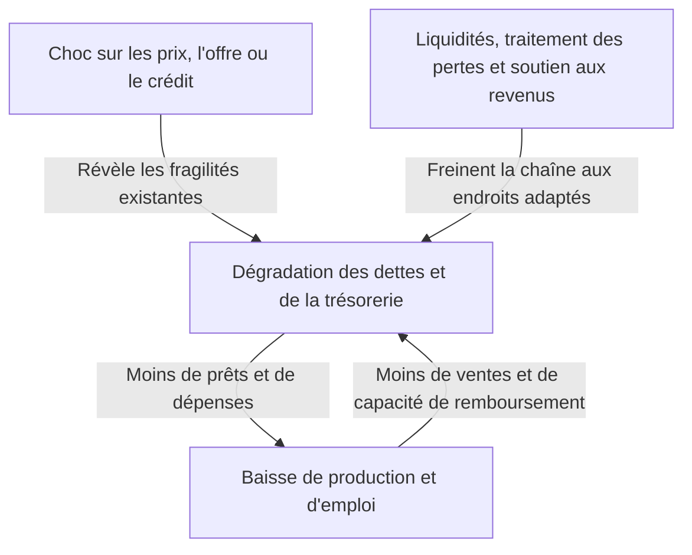
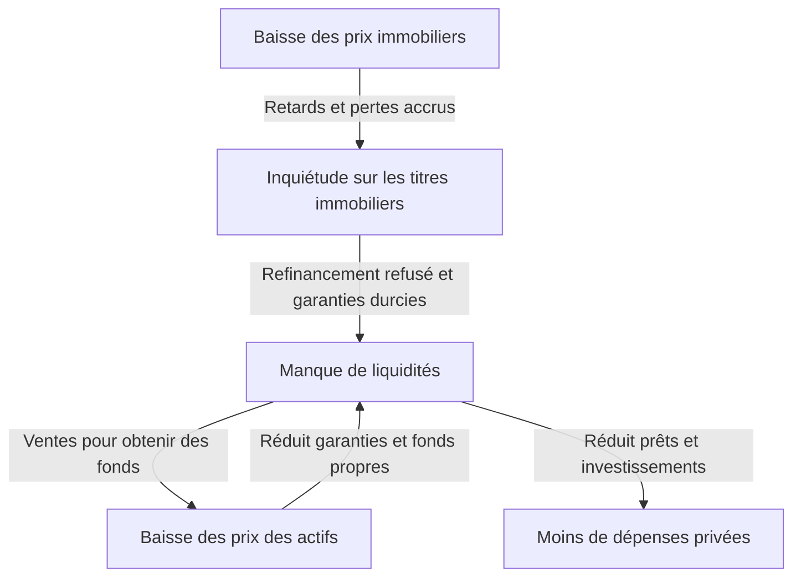

Le choc Lehman évoque peut-être un seul ensemble : faillites bancaires, chute des actions et chômage. Mais comment la faillite d'une entreprise a-t-elle réduit la production des usines et les revenus des ménages à travers le monde ? Pourquoi un autre krach, le lundi noir de 1987, n'a-t-il pas eu les mêmes conséquences que la Grande Dépression des années 1930 ?

Comprendre ces chocs exige davantage que retenir noms et dates. Qu'est-ce qui a changé en premier ? Quelles fragilités s'étaient accumulées ? Entre quels acteurs les pertes et les craintes ont-elles circulé ? Séparer ces trois questions transforme une histoire complexe en enchaînements de causes et d'effets.

Cet article examine seize épisodes représentatifs entre 1929 et 2023. Il s'agit de comparer des mécanismes, non de recenser toutes les crises nationales. Le terme choc économique englobe ici finance, énergie, pandémie et changement de régime monétaire. Lorsque les causes font débat, aucune explication n'est présentée comme l'unique vérité.

## Distinguer d'abord le choc de la crise

Un choc modifie brutalement les conditions économiques : le pétrole n'arrive plus, l'immobilier baisse ou les investisseurs étrangers retirent leurs fonds. La crise apparaît quand institutions et financements existants ne peuvent absorber ce changement et que les fondements de l'activité fonctionnent mal.

C'est comme distinguer le typhon, la fragilité des digues et l'étendue de l'inondation. En économie, cependant, les décisions humaines modifient aussi les digues. Des banques réduisant prudemment leurs prêts peuvent provoquer des faillites et accroître leurs propres pertes. Une défense individuellement rationnelle amplifie alors la crise collective.

Un choc de demande réduit consommation et investissement. Un choc d'offre raréfie matières premières ou travail, diminuant la production ou augmentant ses coûts. Un choc financier abîme l'intermédiation et la continuité des paiements. Les crises réelles combinent ces dimensions et changent parfois de nature en cours de route.

Ces flèches n'ont pas toujours la même force. Des fonds propres suffisants, un financement stable et des institutions crédibles limitent la contagion malgré les pertes. À l'inverse, des dispositifs efficaces en temps normal peuvent devenir simultanément fragiles dans une situation extrême.

## Tableau comparatif pour une vue d'ensemble

| Période | Événement | Fragilité ou transmission principale |
| --- | --- | --- |
| 1929–années 1930 | Grande Dépression | Paniques bancaires, contraction du crédit, déflation, étalon-or |
| 1971 | Choc Nixon | Perte de confiance dans la conversion dollar-or, transition monétaire |
| 1973–1974 | Premier choc pétrolier | Offre et prix du pétrole, transfert de revenus des importateurs |
| Vers 1978–1982 | Deuxième choc pétrolier et resserrement | Craintes d'approvisionnement, anticipations inflationnistes, taux élevés |
| À partir de 1982 | Dette latino-américaine | Dettes en devises, taux variables, manque de recettes extérieures |
| 1987 | Lundi noir | Transactions corrélées, liquidité et règlement |
| Années 1990 | Éclatement de la bulle japonaise | Garanties dépréciées, créances douteuses, désendettement prolongé |
| 1994–1995 | Crise monétaire mexicaine | Retournement des flux, dette courte, remboursement lié au dollar |
| 1997–1998 | Crise asiatique | Déséquilibres de devises et d'échéances, fuite des capitaux, banques |
| 1998 | Crises russe et LTCM | Dette souveraine, fuite vers la sécurité, effet de levier |
| Vers 2000–2002 | Éclatement de la bulle internet | Bénéfices révisés, recul du financement en actions et de l'investissement |
| 2007–2009 | Crise financière mondiale et Lehman | Crédit immobilier, titrisation, ruée sur le financement court |
| Début des années 2010 | Dette européenne | Boucle banques-États, faiblesses de l'union monétaire |
| 2020 | Choc du COVID-19 | Arrêt simultané de demande et d'offre par infection et comportements |
| À partir de 2021–2022 | Inflation et énergie | Reprise de demande, contraintes d'offre, guerre et ressources |
| 2023 | Turbulences bancaires américaines | Risque de taux, dépôts concentrés, retraits rapides |

Les périodes indiquent quand les caractéristiques deviennent visibles, non des récessions identiques partout. Début d'une récession américaine, creux japonais et point bas boursier ne coïncident pas nécessairement. La fin d'une crise peut signifier stabilisation financière, retour de l'emploi ou traitement achevé des dettes.

## Krach de 1929 et Grande Dépression : au-delà des pertes boursières

Le krach américain de l'automne 1929 symbolise la Grande Dépression. Mais la baisse des actions seule n'explique ni sa profondeur ni sa durée. La récession avait commencé avant le krach ; les paniques bancaires ultérieures ont encore abîmé crédit et dépenses.

Les banques promettent de rembourser rapidement leurs déposants tout en prêtant à long terme aux entreprises et ménages. Si beaucoup demandent du liquide ensemble, elles peuvent manquer de moyens immédiats sans que tous leurs actifs soient sans valeur. Les États-Unis n'avaient pas encore leur assurance fédérale des dépôts actuelle.

Faillites et retraits ont rendu le fonds de roulement difficile à emprunter. Salaires, matières et stocks devenaient difficiles à financer ; emploi et production diminuaient. Chômage et perte de revenu réduisaient la consommation et affaiblissaient encore les remboursements. Même les ménages sans actions subissaient les conséquences.

La baisse des prix ne constitue pas forcément un remède. Avec une dette nominale fixe, la baisse des salaires et ventes alourdit son poids. Devoir cinq millions de yens avec cinq millions de revenu annuel diffère de la même dette avec seulement 3,5 millions de revenu. Cet exemple fictif illustre le renforcement mutuel de dette et déflation.

Sous l'étalon-or, préserver la conversion monétaire pouvait aussi contredire l'assouplissement intérieur. Le resserrement destiné à éviter les sorties d'or aggravait parfois le manque de financement. Protectionnisme et dettes internationales s'ajoutaient. Les [archives historiques de la Réserve fédérale](https://www.federalreservehistory.org/essays/banking-panics-1931-33) décrivent la pression simultanée des sorties d'or et des retraits.

La leçon n'est pas que soutenir les cours résout tout. Quand paiements, intermédiation et confiance dans les dépôts s'effondrent, les pertes financières deviennent des dommages productifs durables. Les chercheurs pondèrent différemment autorités monétaires et étalon-or, mais tout attribuer à une journée boursière est trop simpliste.

## Choc Nixon de 1971 : une promesse de conversion devenue intenable

Dans Bretton Woods, de nombreuses monnaies entretenaient une relation fixe avec le dollar. Les États-Unis soutenaient, sous certaines conditions, la conversion en or des dollars détenus par les autorités monétaires étrangères. Ce n'était pas un droit universel de convertir librement chaque billet ordinaire.

Le développement du commerce et de la finance exigeait des dollars disponibles mondialement. Mais l'accumulation de dollars à l'étranger faisait douter de la promesse face aux réserves d'or américaines. La crainte poussait à convertir rapidement, déstabilisant davantage le système.

En août 1971, Nixon annonça notamment la suspension de la conversion. Des tentatives de maintien avec réajustements de parités suivirent avant le passage des grandes monnaies au flottement en 1973. Imaginer tous les changes fixes mondiaux terminés un seul jour de 1971 efface cette séquence. [Federal Reserve History](https://www.federalreservehistory.org/essays/gold-convertibility-ends) explique objectifs et transition.

Pour les entreprises japonaises, le change devint un facteur majeur de planification. Une même recette d'exportation en dollars fournit moins de yens lorsque celui-ci s'apprécie. Les importations peuvent en revanche coûter moins cher ; importateurs et exportateurs ne subissent pas les mêmes effets.

Il s'agissait surtout d'un choc de régime monétaire et de politique, distinct d'une série de faillites bancaires. Des parités fixes stabilisent les échanges, mais leur abandon peut exiger une forte adaptation lorsque leurs conditions de maintien disparaissent.

## Premier choc pétrolier, 1973–1974 : les coûts de production s'envolent

Dans le contexte de la guerre israélo-arabe de 1973, des producteurs arabes limitèrent l'offre et imposèrent un embargo aux États-Unis et à d'autres pays, tandis que le brut flambait. L'OAPEC, organisation arabe impliquée dans l'embargo, ne doit pas être confondue avec l'OPEP, plus large. Offre, politique de prix et demande mondiale déjà forte se combinaient. [L'histoire du premier choc pétrolier](https://www.federalreservehistory.org/essays/oil-shock-of-1973-74) expose ce contexte.

Le pétrole sert aussi aux transports, à l'électricité et à la chimie. Remplacer rapidement combustible ou équipement est difficile ; une faible pénurie peut donc fortement déplacer les prix. Lorsque offre et demande réagissent peu au prix, celui-ci porte l'essentiel de l'ajustement.

Les importateurs transfèrent davantage de revenu à l'étranger pour la même quantité. Si les entreprises répercutent le coût, le pouvoir d'achat baisse ; sinon, leurs profits diminuent. Les deux voies réduisent consommation et investissement possibles.

Inflation et détérioration de l'activité peuvent alors coexister : la stagflation. Stimuler fortement les dépenses ne produit pas immédiatement davantage de pétrole ou d'équipements. Inversement, un resserrement focalisé uniquement sur les prix aggrave les pertes d'emploi.

Les difficultés japonaises ne se limitaient pas non plus au pétrole. Demande, conditions financières et anticipations comptaient. Économies d'énergie et changements industriels ultérieurs ont modifié la résistance aux importations coûteuses. L'impact dépend donc du prix, mais aussi de la dépendance à la ressource.

## Deuxième choc pétrolier et taux élevés : désinflation et coûts réels

Les perturbations iraniennes liées à la révolution de 1978–1979 secouèrent de nouveau le pétrole. La hausse ne se proportionnait pas simplement à la production perdue : la peur de pénuries futures encourageait les stocks de précaution. L'inquiétude de demain augmente parfois la demande actuelle. [Le récit du deuxième choc](https://www.federalreservehistory.org/essays/oil-shock-of-1978-79) traite les deux dimensions.

Dans une économie durablement inflationniste, entreprises et salariés intègrent de nouvelles hausses dans prix et salaires. Cela ne signifie pas que les salaires seuls provoquent toujours l'inflation. Ressources, demande, crédibilité monétaire et contrats influencent sa persistance.

Sous Paul Volcker, devenu président de la Fed en 1979, le resserrement américain privilégia la lutte contre l'inflation. Les taux élevés freinaient logements et investissements, pesant sur activité et emploi. Les récessions autour de 1980 et du début des années 1980 comprennent cette adaptation politique autant que le pétrole.

Resserrer la monnaie n'extrait pas de pétrole. Cela modère dépenses et crédit et cherche à modifier les anticipations d'inflation durable. Sans supprimer directement l'obstacle d'offre, la désinflation impose des coûts réels. [L'histoire de la grande inflation](https://www.federalreservehistory.org/essays/great-inflation) éclaire ce lien.

Les taux américains agissaient aussi à l'étranger, dégradant le service des dettes en dollars des pays et entreprises. Ce raccord est essentiel pour comprendre l'Amérique latine.

## Dette latino-américaine dès 1982 : monnaie et taux deviennent un fardeau

Les prêts bancaires internationaux s'étaient développés dans les années 1970, notamment avec les fonds des exportateurs de pétrole. Les pays latino-américains empruntaient beaucoup en devises. Pouvoir emprunter ne garantit pourtant pas les recettes extérieures futures nécessaires au remboursement.

Créer sa monnaie ne rembourse pas une dette en dollars. Il faut obtenir ceux-ci par exportations, capitaux ou réserves. Les contrats à taux variable augmentent le service quand les taux mondiaux montent, tandis qu'une faible conjoncture limite exportations et recettes de ressources.

Les difficultés mexicaines d'août 1982 révélèrent la crise ; de nombreux pays durent restructurer. Les banques internationales détenaient de grosses créances, donc les prêteurs étaient aussi concernés. [L'histoire de la dette latino-américaine](https://www.federalreservehistory.org/essays/latin-american-debt-crisis) retrace les deux côtés.

Sans nouveaux prêts, les paiements auparavant refinancés ne peuvent continuer. Réduire les importations économise des devises, mais moins de machines et composants compromet le revenu futur. Ajustements budgétaires, dépréciation et difficultés bancaires ont produit de longues stagnations dans certains pays.

La leçon n'est pas simplement que la dette est mauvaise. Devise, taux, échéance et revenu de remboursement sont essentiels. Même un investissement utile à long terme peut manquer de fonds si échéances et recettes en devises s'accordent mal.

## Lundi noir de 1987 : le marché supposé liquide devient étroit

Le 19 octobre 1987, le Dow Jones chuta de 22,6 % en une séance. Cela ne devint pourtant pas immédiatement une crise bancaire ou une récession américaine de type dépression. C'est un exemple crucial de la distinction entre chute des prix et effondrement financier général.

Aucune nouvelle unique ne l'explique. Valorisation élevée, inquiétudes de taux et change, et structure des marchés se combinaient. L'assurance de portefeuille, vendant notamment des contrats à terme lorsque les prix baissaient pour limiter les pertes, amplifiait les ventes. Son nom ne garantissait pas une indemnisation inconditionnelle par un tiers.

Un investisseur qui vend pour réduire son risque a besoin d'un acheteur. Si beaucoup vendent ensemble en réaction au même mouvement, les ordres d'achat au prix précédent manquent. Une nouvelle baisse déclenche d'autres ventes.

Les différences de négociation et règlement entre actions, contrats à terme et options compliquaient les besoins. Même des positions comptablement compensées nécessitent du cash entre dates de paiement différentes. [Federal Reserve History](https://www.federalreservehistory.org/essays/stock-market-crash-of-1987) traite ces structures et le soutien liquide.

La disponibilité de liquidité de la banque centrale et la poursuite des prêts ont contenu la chaîne. Le pourcentage de baisse boursière ne mesure donc pas seul la profondeur d'une crise. Comptent les porteurs de pertes, leur dette et leur rôle dans crédit et paiements.

## Bulle japonaise : foncier, banques et bilans d'entreprises étaient liés

À la fin des années 1980, actions et terrains japonais s'apprécièrent fortement. Assouplissement, comportement bancaire sous libéralisation, garanties foncières et anticipations se combinaient. Invoquer seulement les accords du Plaza ou les faibles taux manque l'interaction entre crédit et prix.

Un terrain plus cher garantit un prêt plus élevé. Si le prêt finance d'autres achats immobiliers, les prix montent encore. Quand les crédits reposent sur une future revente plus chère plutôt que sur le revenu, l'appréciation elle-même soutient l'emprunt.

Après resserrement monétaire et restrictions immobilières, la baisse des années 1990 inversa le mécanisme. Les dettes d'acquisition restaient tandis que actifs et garanties se dépréciaient. Les banques accumulaient des créances douteuses. [L'étude de la Banque du Japon sur la bulle](https://www.imes.boj.or.jp/research/abstracts/english/me14-1-6.html) examine crédit, foncier et actions.

Les pertes de fonds propres limitent les nouveaux prêts. Les entreprises privilégient aussi le désendettement même lorsque les taux baissent. Prêteurs et emprunteurs réduisent ensemble la dépense : une baisse des taux ne rétablit pas automatiquement l'investissement antérieur.

Un traitement tardif des pertes peut maintenir le crédit aux entreprises fragiles tout en privant les prometteuses. Les tensions de 1997–1998 montrèrent des vulnérabilités bancaires persistantes après la chute initiale. La Banque du Japon souligne [déflation et ajustements des bilans depuis les années 1990](https://www.boj.or.jp/en/about/press/koen_2024/ko240527b.htm) dans la stagnation.

Toute l'évolution japonaise ultérieure ne vient pas de la bulle : démographie, productivité, concurrence et politique interviennent. L'essentiel est que des pertes inscrites au bilan empêchent un retour rapide des comportements, même si la Bourse rebondit temporairement.

## Mexique, 1994–1995 : sans refinancement, défendre la monnaie devient difficile

Instabilité politique et hausse des taux américains fragilisèrent les entrées de capitaux au Mexique en 1994. Un déficit courant exige des financements ou d'autres ressources. Il ne signifie pas toujours crise, mais un arrêt soudain impose un ajustement sévère.

Les réserves utilisées pour soutenir le change sont limitées. Les tesobonos, émis davantage par l'État, étaient des dettes courtes à remboursement lié au dollar. Protéger les investisseurs contre le peso transférait au gouvernement plus de risque de change et de refinancement.

Le changement de politique de décembre 1994 ne rétablit pas suffisamment la confiance et le peso chuta. Le poids intérieur des dettes liées au dollar augmenta ; leur renouvellement devint urgent. [L'évaluation contemporaine du FMI](https://www.imf.org/en/news/articles/2015/09/28/04/53/spmds9508) souligne financement court et composition de dette.

La dépréciation peut favoriser les exportations tout en alourdissant les engagements en devises. Ce dommage aux bilans invalide une explication où dévaluer suffirait à tout régler. Banques et entreprises affaiblies financent difficilement même une expansion exportatrice.

La crise montre l'importance des montants à rembourser dans quelques mois, au-delà du total public. À dette égale, des échéances réparties ou concentrées résistent différemment à la perte de confiance.

## Crise asiatique, 1997–1998 : la dette privée en devises ébranle l'économie

L'abandon thaïlandais de la défense du baht en juillet 1997 précéda la propagation en Indonésie, Corée du Sud et ailleurs. Institutions et fragilités différaient. Tout expliquer par le laxisme budgétaire public néglige les emprunts privés et bancaires.

Beaucoup empruntaient à court terme en dollars pour financer des projets immobiliers ou industriels domestiques longs. Monnaies de recettes et remboursement différentes créent un déséquilibre de devises ; dates de remboursement et récupération différentes créent un déséquilibre d'échéances. Change stable et renouvellements réussis masquent ces fragilités.

Quand les investisseurs réclament leurs fonds, la demande de devises augmente et la monnaie baisse. Cela alourdit la dette extérieure, accroît les craintes et provoque d'autres sorties. Change et solvabilité se dégradent mutuellement. [L'analyse financière du FMI](https://www.imf.org/external/pubs/ft/op/opfinsec/index.htm) relie banques, entreprises et régimes de change.

Un million de dollars emprunté à 100 unités locales par dollar équivaut à 100 millions. À 150 unités, le même principal vaut 150 millions. Avec des ventes locales, la charge augmente sans nouvel emprunt. Exportations ou couverture changeraient le résultat ; cet exemple suppose aucune protection.

Des taux élevés défendant la monnaie peuvent freiner les sorties mais nuisent aux débiteurs domestiques. Accepter la baisse détériore les dettes en devises. Les politiques affrontaient ce dilemme ; conditions du FMI et pertinence des mesures budgétaires et monétaires restent débattues.

La contagion ne vient pas automatiquement de la proximité. Banques communes, marchés d'exportation partagés et regroupements d'économies par investisseurs fournissent les canaux. Un prêteur en difficulté peut se retirer même d'un pays moins fragile.

## Russie et LTCM, 1998 : des positions diversifiées perdent ensemble

Faiblesses fiscales et de recouvrement, faibles prix des ressources et craintes de financement se combinaient en Russie. En août 1998 furent annoncées dévaluation du rouble et restructuration de dette publique domestique. La sécurité supposée de toute dette souveraine vacilla, encourageant mondialement sécurité et liquidité.

Le fonds Long-Term Capital Management, LTCM, subit de lourdes pertes. Réduire sa stratégie aux obligations russes manque sa portée. Le point essentiel était un levier élevé sur des transactions pariant notamment sur la convergence de prix d'instruments similaires.

De faibles écarts normaux rapportent sur de gros volumes. Mais la fuite vers les actifs liquides peut élargir les écarts en crise. Même prévoir correctement leur retour futur ne suffit pas si des garanties supplémentaires sont exigées avant.

Répartir les positions entre marchés diversifie peu si toutes supposent une liquidité maintenue. Des corrélations accrues signifient aussi que beaucoup vendent simultanément pour la même raison, pas seulement qu'un paramètre mathématique change.

La Fed de New York facilita les discussions menant à une recapitalisation privée. Il ne faut pas la confondre avec une injection directe d'argent public de la Fed dans LTCM. [Le témoignage de son président d'alors](https://www.newyorkfed.org/newsevents/speeches/1998/mcd981001.html) précise ces rôles. Valeur longue modélisée et paiement de demain sont deux problèmes distincts.

## Bulle internet : une vraie technologie ne garantit pas une bonne valorisation

À la fin des années 1990, l'espoir d'une transformation par internet attirait les capitaux vers informatique et télécommunications. Le changement technologique était réel. Mais une technologie utile largement adoptée ne garantit pas de gros bénéfices à chaque entreprise.

La valeur dépend des bénéfices ou flux futurs et de leur actualisation. Se concentrer sur la taille du marché en négligeant acquisition de clients, concurrence, consommation de trésorerie et investissements supplémentaires rend une faible révision de croissance très importante pour la valorisation.

Dès 2000, les attentes corrigées compliquèrent les levées en actions ; entreprises et télécoms réduisirent effectifs et investissements excessifs. Au-delà de la perte patrimoniale des ménages, le financement de l'activité se rétrécissait. [Le rapport annuel 2001 de la Fed](https://www.federalreserve.gov/boarddocs/rptcongress/annual01/ar01.pdf) documente ces évolutions.

La récession américaine de 2001 ne commença pas uniquement avec les attentats de septembre. L'affaiblissement était antérieur ; les attaques ajoutèrent un choc au voyage et à l'incertitude. Il faut distinguer l'ordre des chocs superposés.

Par rapport à 2008, les actionnaires supportaient relativement davantage de pertes et l'amplification bancaire et monétaire différait. Une action n'oblige pas l'entreprise à rembourser le même montant après une baisse ; une dette conserve cette obligation. Le financement détermine ainsi la transformation d'une déception technologique en crise financière profonde.

## Choc Lehman : les pertes immobilières bloquent le financement court

### La crise n'a pas commencé soudainement en septembre 2008

Le choc appelé Lehman au Japon est symbolisé par la faillite du 15 septembre 2008. Mais immobilier américain et produits liés se détérioraient déjà. Les tensions monétaires apparurent en 2007 et Bear Stearns connut une crise au printemps 2008.

La hausse immobilière rassurait prêteurs et emprunteurs. L'espoir de vendre ou refinancer soutenait les prêts malgré des remboursements difficiles. La baisse rendit plus fréquentes les ventes insuffisantes pour solder les dettes et ruina les hypothèses de refinancement. [L'explication des subprimes](https://www.federalreservehistory.org/essays/subprime-mortgage-crisis) décrit cette interaction.

Accuser seulement les emprunteurs fragiles ne suffit pas. Sélection du crédit, rémunérations de titrisation, évaluations des investisseurs, fonds propres et financement doivent être examinés pour expliquer le passage de défauts locaux à une crise mondiale.

### La titrisation ne fait pas disparaître le risque

La titrisation regroupe des prêts et distribue leurs remboursements aux investisseurs. Hiérarchiser les paiements crée des tranches supportant les pertes plus tôt ou plus tard. Les pertes totales ne disparaissent pas.

Diversifier les régions réduit certains risques locaux. Mais une baisse immobilière généralisée, le chômage et les difficultés communes de refinancement corrèlent les défauts. Même les tranches bien notées perdent si les hypothèses fondamentales échouent.

La complexité masque aussi les porteurs finaux des pertes. Même peu touché, un établissement peut refuser de prêter si l'état de sa contrepartie est inconnu. L'incertitude sur la localisation comptait autant que les montants.

### L'arrêt du financement court force les ventes

Les banques d'investissement finançaient des actifs longs avec pensions livrées et titres courts. Les repos ressemblent à des emprunts courts garantis par des titres. Le système fonctionne tant que le renouvellement continue ; un refus impose immédiatement du cash.

Si une garantie de 100 permettait d'emprunter 95 mais seulement 80 après une hausse de prudence, il faut trouver 15 ailleurs. Cet exemple est hypothétique. Une baisse simultanée des garanties augmente encore le besoin.

Vendre pour obtenir du liquide abaisse les prix. D'autres établissements subissent pertes de valeur et appels de garanties, puis vendent également. Sans file de déposants devant une agence, cela ressemble à une ruée où les prêteurs courts partent ensemble.

### Les problèmes financiers atteignent usines et ménages

Après Lehman, méfiance envers les contreparties et perturbations courtes s'intensifièrent brutalement. Aide à AIG, recapitalisations et liquidité centrale furent nécessaires. [La vue d'ensemble de la crise mondiale](https://www.federalreservehistory.org/essays/great-recession-and-its-aftermath) relie immobilier, finance et économie réelle.

Moins de crédit gêne l'investissement mais aussi les paiements quotidiens. Les ménages reportent les biens durables face aux pertes patrimoniales et aux craintes d'emploi. Même les exportateurs sans titres risqués perdent des commandes. La contraction mondiale de demande et commerce frappa fortement le Japon.

Faibles taux, capitaux internationaux, réglementation, supervision et rémunérations restent débattus. Mais pertes hypothécaires, levier, financement court et opacité doivent être considérés ensemble. Lehman fut une amplification majeure, non l'unique créateur de toutes les fragilités.

## Dette européenne : banques et gouvernements se fragilisent mutuellement

Les inquiétudes sur la Grèce grandirent fin 2009 et en 2010, puis gagnèrent plusieurs pays de l'euro. Le récit budgétaire grec ne s'applique pas partout : immobilier et banques comptaient particulièrement en Irlande et en Espagne.

La baisse de crédit souverain et du prix des obligations abîme les banques détentrices. Le soutien public aux banques alourdit ensuite les finances et les craintes souveraines. Une relation auparavant protectrice devient mutuellement déstabilisatrice.

Les membres de l'euro ne peuvent individuellement dévaluer ni fixer leurs taux directeurs. Au début, supervision, résolution et partage budgétaire des risques étaient pourtant insuffisamment intégrés. Les institutions de crise retardaient sur l'intégration monétaire.

Des taux de refinancement élevés augmentent les intérêts et réduisent la soutenabilité. La peur contribue ainsi parfois au résultat redouté. Tout n'était pas psychologie sans fondement : dettes, productivité et banques différaient réellement. [L'évaluation de la BCE](https://www.ecb.europa.eu/press/key/date/2018/html/ecb.sp180511.en.html) traite ces différences et les enseignements institutionnels.

L'austérité vise la confiance, mais des coupes rapides en récession diminuent revenus et impôts. L'aide pose inversement le partage des pertes et la prévention du surendettement futur. BCE, mécanismes financiers et union bancaire cherchaient à briser ces boucles.

## COVID-19 en 2020 : l'activité s'est arrêtée avant les produits financiers

La pandémie contraignit simultanément mobilité, services en personne, bureaux et usines. Évitement volontaire de l'infection et absences s'ajoutaient aux restrictions administratives. La cause initiale différait d'une crise bancaire classique.

Côté offre, travail, composants et logistique manquaient. Côté demande, voyages, restauration et loisirs reculaient ; l'incertitude reportait des achats. La demande se déplaçait aussi des services vers les biens, donc les branches ne réagissaient pas toutes pareil. [L'analyse initiale du FMI](https://www.imf.org/en/Blogs/Articles/2020/03/09/blog030920-limiting-the-economic-fallout-of-the-coronavirus-with-large-targeted-policies) sépare les deux côtés.

Loyers et remboursements continuent malgré un arrêt des ventes. Une entreprise viable peut faire faillite faute de trésorerie, transformant une pause en destruction durable d'emplois et réseaux. La politique devait faire traverser cette interruption aux entreprises et ménages.

Baisser les taux ne supprime ni infection ni pénurie de composants. Santé publique, revenus, emploi et trésorerie devaient être soutenus ensemble. La demande de cash des marchés augmentait aussi ; empêcher un choc réel de devenir dysfonctionnement financier était essentiel.

La reprise fut inégale. Demande, capacités fermées, personnel et transport mondial ne reviennent pas au même rythme. Un manque de demande initial peut devenir pénurie de certaines offres pendant la reprise, point clé de l'inflation suivante.

## Inflation et énergie dès 2021–2022 : plusieurs contraintes superposées

L'inflation post-pandémie n'avait pas une seule cause. Reprise et composition de demande, chaînes logistiques, travail et conditions budgétaires et monétaires se combinaient. Leurs poids variaient ; appliquer une même explication aux États-Unis et à l'Europe manque des différences importantes.

L'énergie était déjà tendue en 2021. L'invasion russe de l'Ukraine en février 2022 bouleversa ensuite gaz, pétrole et électricité. Guerre, réductions d'offre, sanctions et risques commerciaux changèrent routes et coûts. [L'Agence internationale de l'énergie](https://www.iea.org/topics/2022-energy-crisis) distingue tension préalable et aggravation ultérieure.

Le gaz exige notamment pipelines, liquéfaction, navires et terminaux. Des ressources ailleurs ne comblent pas immédiatement un manque régional. Exister sur Terre diffère d'arriver au bon lieu au bon moment. Ces contraintes physiques amplifient les prix.

Les importations plus chères renchérissent production et vie quotidienne. Subventions et plafonnements peuvent alléger temporairement, mais coûtent au budget et peuvent réduire l'incitation à économiser. Cibles et durée de l'aide comptent.

Les banques centrales relevèrent les taux contre l'enracinement inflationniste. Mais les taux ne produisent pas de gaz : ils passent par demande et anticipations, freinent logement et investissement et déprécient des actifs existants. Une inflation plus faible signifie une hausse plus lente, non forcément le retour des anciens prix.

## Banques américaines en 2023 : même les obligations sûres ont un risque de taux

La faillite de Silicon Valley Bank en mars 2023 montra que les mauvaises hypothèques ne sont pas la seule origine bancaire. Risque de taux des obligations longues, concentration des déposants et gros dépôts non entièrement assurés se combinaient.

Une obligation à coupon fixe baisse généralement quand les taux montent. Si les nouvelles paient davantage, les anciennes à faible coupon doivent devenir moins chères pour attirer. Même une dette publique à faible risque de crédit n'a pas un prix de revente fixe.

Conserver jusqu'à échéance diffère de vendre aujourd'hui pour rembourser des retraits. La classification comptable change la date de reconnaissance, pas le prix de marché d'une vente urgente. Financer des actifs longs par dépôts retirables devient central.

La clientèle technologique concentrée de SVB favorisait des besoins et décisions communs. Virements en ligne et partage d'informations accélèrent une ruée. Mais accuser seulement les réseaux sociaux néglige gestion actif-passif et supervision antérieures. [L'examen de la Fed](https://www.federalreserve.gov/publications/2023-April-SVB-Key-Takeaways.htm) traite ces deux aspects.

D'autres banques furent touchées, sans avoir des actifs et clients identiques. Examiner l'exposition précise aux taux explique mieux que reproduire automatiquement le récit immobilier de 2008.

## Quatre mécanismes relient cette histoire

### Peu de fonds propres amplifient une petite baisse

Avec actifs $A$, dettes $D$ et fonds propres $E$, le bilan simplifié donne :

$$
E=A-D,\qquad L=\frac{A}{E}
$$

$L$ définit ici le levier. Actifs de 100, dettes de 95 et capital de 5 donnent 20. À dettes inchangées, perdre 3 d'actifs réduit le capital de 5 à 2. Une baisse de 3 % devient une perte de 60 % des fonds propres. Impôts, couvertures et composition sont omis, mais l'amplification est claire.

En période stable, un levier élevé paraît efficace. Lorsque les prix varient davantage, protéger le capital impose ventes ou contraction des prêts et augmente les pertes d'autrui. Cela relie bulle japonaise, LTCM et crise mondiale.

### Liquidité et solvabilité diffèrent, mais interagissent

L'insolvabilité correspond à des obligations trop lourdes par rapport aux actifs récupérables et revenus futurs. Le manque de liquidité est l'absence de cash maintenant malgré des recettes ultérieures. Même une entreprise rentable peut donc échouer par trésorerie.

Un financement temporaire évite parfois de brader de bons actifs. Mais si leur valeur est réellement insuffisante, ajouter des prêts n'efface pas les pertes. Recapitalisation, restructuration de dette ou résolution deviennent nécessaires.

Les distinguer immédiatement est difficile. Des ventes forcées détruisent la solvabilité ; des doutes sur les pertes provoquent inversement les retraits. Ni le cash résout toujours tout ni les déficitaires doivent toujours être abandonnés ne décrit cette interaction.

### Contrats de devises et de taux créent des charges inattendues

La valeur locale d'une dette étrangère peut s'écrire simplement :

$$
D_{\mathrm{home}}=eD_{\mathrm{foreign}}
$$

$e$ représente la monnaie locale nécessaire pour une unité étrangère. Si la dépréciation augmente $e$, la charge croît malgré un principal inchangé. Recettes en devises et couvertures doivent toutefois être prises en compte.

Le prix d'une obligation fixe actualise ses paiements futurs. Dans un modèle avec coupon périodique $C$, principal final $F$, périodes restantes $T$ et taux constant $y$ :

$$
P=\sum_{t=1}^{T}\frac{C}{(1+y)^t}+\frac{F}{(1+y)^T}
$$

Toutes choses égales, augmenter $y$ réduit $P$. En réalité, courbe des taux, crédit et remboursement anticipé compliquent la valorisation. La formule ne couvre pas tous les titres, mais explique pourquoi des taux élevés augmentent parfois les recettes des nouveaux prêts et baissent la valeur des anciennes obligations longues.

### Les connexions internationales transportent gains et chocs

Commerce, finance et prix communs diffusent les crises. Moins d'importations en récession touche les usines exportatrices. Une banque mondiale perdante peut réduire les prêts dans des pays apparemment sans rapport. Pétrole et taux du dollar agissent simultanément partout.

Cela importe pour l'action. Recapitaliser les banques ne restitue pas seul les commandes d'un exportateur. Réparer le financement aide en revanche une entreprise ayant des commandes mais aucun fonds de roulement. Derrière récession mondiale, il faut identifier le canal bloqué.

## Pourquoi aucune politique n'est universelle

Si la demande manque, assouplissement et dépenses publiques soutiennent emploi et production. Sous forte contrainte d'offre, stimuler seulement la demande peut renforcer l'inflation. Cela ne justifie pas l'inaction : des aides ciblées aux plus touchés restent à examiner.

Protéger paiements et confiance dans les dépôts se distingue du sauvetage inconditionnel des dirigeants et investisseurs. Conditions de recapitalisation, pertes des actionnaires ou créanciers et maintien des fonctions critiques pendant restructuration exigent un partage organisé.

Le risque excessif pris en anticipant l'aide est l'aléa moral. Refuser toute aide en pleine crise peut pourtant entraîner des innocents. Règles de capital et liquidité, transparence et préparation de résolution doivent accompagner les secours.

La marge budgétaire dépend aussi de devise, taux, échéances, base fiscale, relations avec la banque centrale et crédibilité, pas seulement du stock de dette. Emprunter en monnaie propre ne permet pas des dépenses illimitées gratuites : prix, change et ressources imposent des limites.

L'évaluation est difficile puisque le scénario sans action n'est pas directement observable. Détérioration après aide ne prouve pas son inutilité, ni reprise sa responsabilité totale. Comparaisons, décalages, conditions initiales et institutions doivent être pris en compte.

## Questions à poser devant la prochaine actualité

Demandez d'abord quel prix ou volume change. Actions, pétrole, change, taux et commandes touchent des acteurs différents. Puis examinez qui perd des actifs et qui voit augmenter dettes ou paiements.

Vérifiez ensuite les fonds propres absorbant les pertes, échéances proches, correspondance des devises et concentration d'acteurs susceptibles d'agir pareil. Ces questions valent pour fonds, entreprises, États et ménages autant que banques.

La politique vise-t-elle trésorerie, pertes, demande ou offre ? Un même nom d'instrument n'implique pas les mêmes effets selon le problème. Retrouver les cours d'avant-crise n'équivaut pas à restaurer la vie des gens.

Ces questions ne prédisent pas la date d'un krach. Une fragilité n'assure pas une crise ; ajustements publics et privés peuvent l'éviter. L'histoire apprend davantage à suivre les pertes conditionnelles qu'à annoncer un calendrier.

Grande Dépression et COVID-19 différaient profondément, comme pétrole et Lehman. Reviennent néanmoins obligations malgré revenus perdus, distinction cash court et valeur longue, et déstabilisation collective par protection simultanée.

Cette histoire n'est pas une simple liste d'échecs. Elle montre quand les promesses entre personnes, entreprises et États fonctionnent ou nécessitent un soutien. Leur structure révèle derrière un nouveau krach ses particularités et les mécanismes hérités du passé.

## Comment lire les sources

Les arguments renvoient directement aux documents publics de la Fed, du FMI, de la Banque du Japon, de la BCE et de l'AIE. Il faut distinguer faits historiques et autoévaluations des autorités. Effets des politiques et poids des causes peuvent varier selon la perspective.

Les chiffres de bilans, changes et garanties sont des exemples fictifs, non des résultats d'une banque ou d'un pays. Rapports annuels et analyses contemporaines contiennent aussi des prévisions : ne les confondez pas avec des réalisations confirmées ultérieurement.
