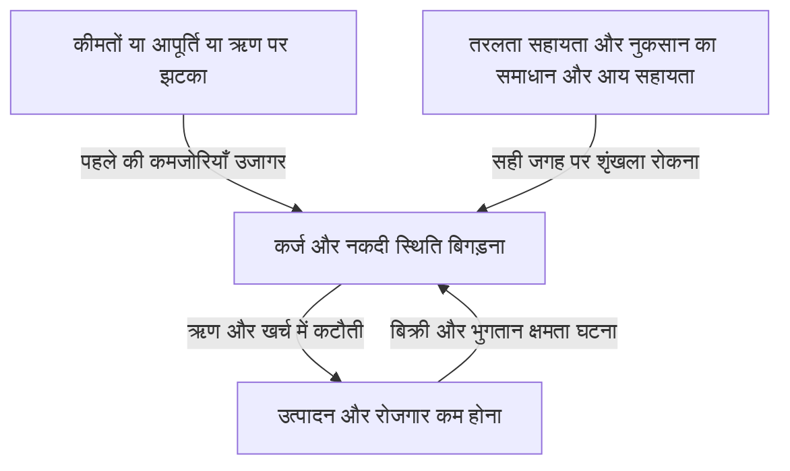
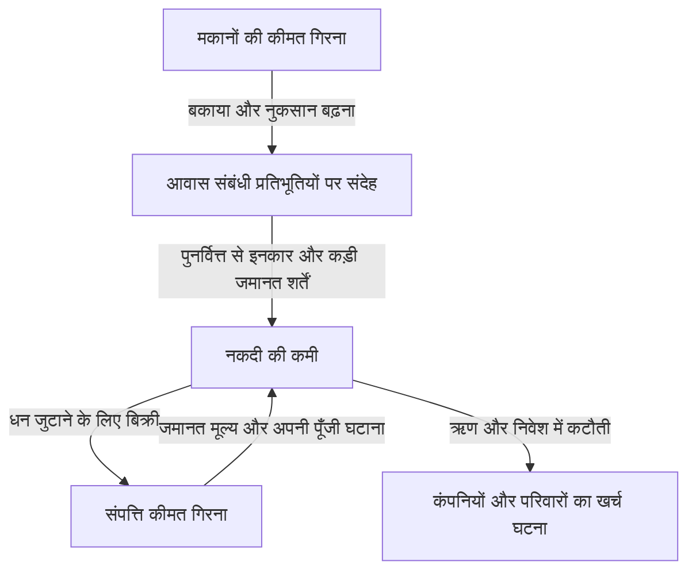

लेहमन संकट का नाम सुनकर बैंकों का दिवालिया होना, शेयर बाजार का धराशायी होना और बेरोजगारी बढ़ना शायद एक ही घटना के हिस्से लगें। लेकिन एक कंपनी की विफलता दुनिया भर के कारखानों में उत्पादन घटने और परिवारों की आय कम होने तक कैसे पहुँची? और शेयर कीमतों में भारी गिरावट के बावजूद 1987 के ब्लैक मंडे का परिणाम 1930 के दशक की महामंदी जैसा क्यों नहीं हुआ?

आर्थिक झटकों को समझने के लिए घटनाओं के नाम और वर्ष याद करना पर्याप्त नहीं है। सबसे पहले क्या बदला? उससे पहले कौन-सी कमजोरियाँ जमा हो चुकी थीं? नुकसान या आशंका किससे किस तक पहुँची? इन तीन प्रश्नों को अलग रखने पर जटिल दिखता इतिहास कारण और परिणाम की कड़ियों के रूप में समझ आने लगता है।

यह लेख 1929 से 2023 के बीच की 16 प्रमुख घटनाओं पर चर्चा करता है। यह सभी देशों और क्षेत्रों के संकटों की संपूर्ण समयरेखा नहीं, बल्कि अलग-अलग कार्यप्रणालियों की तुलना के लिए चुने गए उदाहरण हैं। यहाँ आर्थिक झटके का व्यापक अर्थ लिया गया है, जिसमें वित्तीय संकट के साथ ऊर्जा आपूर्ति में अचानक बदलाव, महामारी और मुद्रा व्यवस्था में परिवर्तन भी शामिल हैं। जहाँ कारणों पर शोधकर्ताओं में मतभेद हैं, वहाँ किसी एक व्याख्या को अकेला सही उत्तर नहीं माना गया है।

## शुरुआत में समझें: झटके और संकट में अंतर

झटका ऐसी घटना है जो अर्थव्यवस्था की आधारभूत परिस्थितियों को अचानक बदल दे। तेल की आपूर्ति रुकना, मकानों की कीमत गिरना या विदेशी निवेशकों का पैसा निकालना इसके उदाहरण हैं। संकट वह स्थिति है जिसमें मौजूदा संस्थाएँ और नकदी प्रबंधन उस बदलाव को सँभाल नहीं पाते और आर्थिक गतिविधियों की बुनियाद ही ठीक से काम करना बंद कर देती है।

यह कुछ वैसा है जैसे तूफान, तटबंध की कमजोरी और बाढ़ के फैलाव को अलग-अलग समझना। लेकिन अर्थव्यवस्था में तटबंध का काम करने वाला व्यवहार भी लोगों के निर्णयों के साथ बदलता है। बैंक अपनी सुरक्षा के लिए ऋण घटाएँ तो कंपनियाँ बंद हो सकती हैं और बैंक का नुकसान बढ़ सकता है। प्रत्येक व्यक्ति का तर्कसंगत बचाव सामूहिक स्तर पर संकट को बढ़ा सकता है।

माँग के झटके में खरीद और निवेश का खर्च घटता है। आपूर्ति के झटके में कच्चे माल या श्रमिकों की कमी उत्पादन की क्षमता घटाती है या लागत बढ़ाती है। वित्तीय झटका धन की मध्यस्थता और भुगतान जारी रखने की व्यवस्था को चोट पहुँचाता है। वास्तविक संकटों में ये एक-दूसरे पर चढ़ते हैं और बीच में संकट का स्वरूप भी बदल सकता है।

चित्र के तीर हमेशा समान शक्ति से काम नहीं करते। पर्याप्त अपनी पूँजी, स्थिर वित्तपोषण और विश्वसनीय संस्थाएँ हों तो नुकसान होने पर भी उसके फैलाव को सीमित किया जा सकता है। इसके विपरीत सामान्य समय में कुशल लगने वाली व्यवस्थाएँ चरम स्थिति में एक साथ कमजोर पड़ सकती हैं।

## समग्र तस्वीर के लिए तुलनात्मक सारणी

| अवधि | घटना | प्रमुख कमजोरी या प्रसार का तरीका |
| --- | --- | --- |
| 1929 से 1930 का दशक | महामंदी | बैंकिंग भगदड़, ऋण संकुचन, अपस्फीति और स्वर्ण मानक की सीमाएँ |
| 1971 | निक्सन झटका | डॉलर को सोने में बदलने के वादे पर घटता भरोसा और मुद्रा व्यवस्था का परिवर्तन |
| 1973–1974 | पहला तेल संकट | तेल आपूर्ति और कीमत में अचानक बदलाव तथा आयातकों की आय का बाहर जाना |
| लगभग 1978–1982 | दूसरा तेल संकट और मौद्रिक सख्ती | आपूर्ति का डर, महँगाई की अपेक्षाएँ और ऊँची ब्याज दरों से समायोजन |
| 1982 से आगे | लैटिन अमेरिकी ऋण संकट | विदेशी मुद्रा ऋण, परिवर्तनीय ब्याज और विदेशी मुद्रा आय की कमी |
| 1987 | ब्लैक मंडे | एक दिशा में सौदे और बाजार की तरलता व निपटान की समस्याएँ |
| 1990 का दशक | जापान का बुलबुला फूटना | जमानत की कीमत गिरना, खराब ऋण और लंबे समय तक कर्ज चुकाना |
| 1994–1995 | मेक्सिको मुद्रा संकट | पूँजी प्रवाह पलटना, अल्पकालीन ऋण और डॉलर से जुड़ा भुगतान भार |
| 1997–1998 | एशियाई मुद्रा संकट | मुद्रा और परिपक्वता का असंतुलन, पूँजी निकासी और बैंकिंग संकट |
| 1998 | रूस और LTCM संकट | सरकारी ऋण का डर, सुरक्षित संपत्तियों की ओर पलायन और लीवरेज |
| लगभग 2000–2002 | इंटरनेट बुलबुला फूटना | लाभ अपेक्षाओं में संशोधन तथा शेयर वित्तपोषण और पूँजी निवेश घटना |
| 2007–2009 | वैश्विक वित्तीय संकट और लेहमन | आवास ऋण, प्रतिभूतिकरण और अल्पकालीन धन की सामूहिक निकासी |
| 2010 के दशक का शुरुआती भाग | यूरोपीय ऋण संकट | बैंक और सरकार की साख का चक्र तथा मुद्रा संघ की संस्थागत कमजोरियाँ |
| 2020 | कोरोना झटका | संक्रमण और व्यवहार परिवर्तन से माँग व आपूर्ति का एक साथ रुकना |
| 2021–2022 से आगे | महँगाई और ऊर्जा झटका | माँग की वापसी, आपूर्ति की सीमाएँ और युद्ध से संसाधन बाजारों में व्यवधान |
| 2023 | अमेरिकी बैंकिंग अस्थिरता | ब्याज जोखिम, जमा का संकेंद्रण और तेज धन निकासी |

ये अवधियाँ वह समय बताती हैं जिसमें संकट की विशेषताएँ स्पष्ट थीं; ये पूरी दुनिया के लिए समान मंदी की अवधियाँ नहीं हैं। उदाहरण के लिए अमेरिकी मंदी की शुरुआत, जापान की अर्थव्यवस्था का निचला बिंदु और शेयर बाजार का न्यूनतम स्तर एक नहीं होते। संकट समाप्त होने का अर्थ भी वित्तीय स्थिरता, रोजगार की वापसी या ऋण समाधान पूरा होने के अनुसार बदलता है।

## 1929 की गिरावट और महामंदी: शेयरों का नुकसान पूरी कहानी नहीं

1929 की शरद ऋतु में अमेरिकी शेयर बाजार की गिरावट महामंदी का प्रतीक है। लेकिन केवल शेयर कीमतों के गिरने से उसके बाद की इतनी गहरी और लंबी मंदी नहीं समझाई जा सकती। अमेरिका में गिरावट से पहले ही आर्थिक मंदी शुरू हो चुकी थी और बाद की बैंकिंग भगदड़ों ने ऋण तथा खर्च को और नुकसान पहुँचाया।

बैंक जमा राशि कम समय में लौटाने का वादा करते हैं, जबकि कंपनियों और परिवारों को लंबे समय के लिए ऋण देते हैं। बहुत से जमाकर्ता एक साथ नकद माँगें तो बैंक तत्काल भुगतान नहीं कर सकता, भले ही उसकी सभी संपत्तियाँ बेकार न हुई हों। उस समय अमेरिका में आज जैसी संघीय जमा बीमा व्यवस्था नहीं थी।

बैंकों की विफलता और जमा निकासी बढ़ने पर कंपनियों के लिए कार्यशील पूँजी उधार लेना कठिन हुआ। मजदूरी देना, कच्चा माल खरीदना और भंडार बनाए रखना मुश्किल हुआ, जिससे रोजगार और उत्पादन घटे। बेरोजगारी तथा कम आय ने उपभोग घटाया और कंपनियों की भुगतान क्षमता और कमजोर की। इस प्रक्रिया ने उन परिवारों को भी चोट पहुँचाई जिनके पास शेयर नहीं थे।

कीमतें गिरना हमेशा राहत नहीं देता। ऋण की राशि नाममात्र में निश्चित हो तो बिक्री या मजदूरी घटने के साथ उसका बोझ बढ़ता है। सालाना 50 लाख येन आय और 50 लाख येन ऋण की स्थिति, आय 35 लाख रह जाने पर वही ऋण बने रहने से अलग है। यह समझाने के लिए काल्पनिक उदाहरण है, लेकिन दिखाता है कि अपस्फीति और ऋण एक-दूसरे को कैसे बिगाड़ते हैं।

स्वर्ण मानक के तहत मुद्रा को सोने में बदलने के भरोसे की रक्षा घरेलू मौद्रिक ढील से टकराती थी। सोना बाहर जाने से रोकने की सख्ती मंदी में धन की कमी और बढ़ा सकती थी। संरक्षणवाद और अंतरराष्ट्रीय ऋण संबंधों ने भी स्थिति बिगाड़ी। [फेडरल रिजर्व की ऐतिहासिक सामग्री](https://www.federalreservehistory.org/essays/banking-panics-1931-33) बताती है कि सोने के बाहर जाने और जमा निकासी ने बैंकों पर एक साथ कैसे दबाव डाला।

महामंदी का सबक यह नहीं कि शेयर कीमतों को सहारा देने से सब ठीक हो जाएगा। भुगतान, ऋण मध्यस्थता और जमा पर भरोसा टूटे तो वित्तीय नुकसान लंबे समय की उत्पादन क्षमता को क्षति पहुँचा सकता है। मौद्रिक अधिकारियों की प्रतिक्रिया और स्वर्ण मानक का कितना महत्व था, इस पर शोध में अंतर है; लेकिन एक दिन की गिरावट को पूरा कारण बताना बहुत अधूरा है।

## 1971 का निक्सन झटका: विनिमय का वादा टिकाऊ नहीं रहा

युद्धोत्तर ब्रेटन वुड्स व्यवस्था में कई मुद्राओं का डॉलर से स्थिर संबंध था और अमेरिका विदेशी मौद्रिक प्राधिकरणों के डॉलर को निर्धारित शर्तों पर सोने में बदलने की व्यवस्था का समर्थन करता था। इसका अर्थ यह नहीं था कि कोई भी व्यक्ति रोजमर्रा का हर डॉलर नोट स्वतंत्र रूप से सोने में बदल सकता था।

व्यापार और अंतरराष्ट्रीय वित्त के विस्तार के लिए दुनिया में उपलब्ध डॉलर जरूरी थे। लेकिन विदेशों में डॉलर बढ़ने के साथ अमेरिकी स्वर्ण भंडार के सापेक्ष विनिमय के वादे पर सवाल बढ़े। भरोसा घटे तो लोग दूसरों से पहले सोना लेना चाहते हैं, जिससे व्यवस्था और अस्थिर होती है।

अगस्त 1971 में राष्ट्रपति निक्सन ने डॉलर का सोने में परिवर्तन रोकने सहित कई घोषणाएँ कीं। उसके बाद विनिमय दरों में समायोजन करके व्यवस्था बचाने की कोशिश हुई और 1973 में प्रमुख मुद्राएँ तैरती दरों की ओर बढ़ीं। इसलिए यह समझना कि 1971 के एक दिन सभी स्थिर दरें एक साथ समाप्त हो गईं, वास्तविक क्रम को खो देता है। [Federal Reserve History का विवरण](https://www.federalreservehistory.org/essays/gold-convertibility-ends) नीति के उद्देश्य और व्यवस्था बदलने की प्रक्रिया समझाता है।

जापानी कंपनियों के लिए यह परिवर्तन विनिमय दर को व्यापार योजना का बड़ा अस्थिर कारक बना गया। डॉलर में निर्यात आय समान रहे तब भी येन मजबूत होने पर येन में बिक्री कम हो जाती है। दूसरी ओर आयात लागत घट सकती है, इसलिए निर्यातक और आयातक पर प्रभाव समान नहीं होता।

यह मुख्यतः मुद्रा व्यवस्था और नीति का झटका था। इसे लगातार बैंक विफलताओं वाले संकट के समान वर्ग में नहीं रखना चाहिए। यह दिखाता है कि स्थिर विनिमय अनुपात लेनदेन को स्थिर कर सकता है, लेकिन उसे निभाने की परिस्थितियाँ समाप्त हों तो बड़ा समायोजन जरूरी हो सकता है।

## पहला तेल संकट 1973–1974: उत्पादन लागत में उछाल

1973 के अरब-इजराइल युद्ध की पृष्ठभूमि में अरब तेल उत्पादकों ने आपूर्ति सीमित की और अमेरिका सहित कुछ देशों पर प्रतिबंध लगाया, जिससे कच्चे तेल की कीमत तेजी से बढ़ी। प्रतिबंध से जुड़ी अरब उत्पादक संस्था OAPEC को व्यापक तेल उत्पादक संस्था OPEC के समान नहीं समझना चाहिए। आपूर्ति उपाय, उत्पादकों की मूल्य नीति और पहले से मजबूत वैश्विक माँग एक साथ काम कर रहे थे। [पहले तेल संकट का इतिहास](https://www.federalreservehistory.org/essays/oil-shock-of-1973-74) यह पृष्ठभूमि स्पष्ट करता है।

तेल केवल कार का ईंधन नहीं है। वह परिवहन, बिजली और रसायनों सहित अनेक क्षेत्रों का इनपुट है। कम समय में दूसरा ईंधन या उपकरण अपनाना कठिन होने के कारण थोड़ी कमी भी कीमत में बड़ा बदलाव ला सकती है। जहाँ माँग और आपूर्ति कीमत के प्रति कम प्रतिक्रिया करती हैं, वहाँ अधिकांश समायोजन कीमत को करना पड़ता है।

आयातकों को समान तेल के लिए अपनी अधिक आय विदेश भेजनी पड़ती है। कंपनियाँ लागत ग्राहकों पर डालें तो परिवारों की क्रय शक्ति घटती है और न डाल सकें तो लाभ कम होता है। दोनों रास्तों से उपभोग और निवेश की क्षमता को चोट लगती है।

यहाँ महँगाई और आर्थिक कमजोरी एक साथ हो सकती हैं। इसे मुद्रास्फीतिजनित मंदी या स्टैगफ्लेशन कहते हैं। माँग कमजोर देखकर बहुत अधिक खर्च बढ़ाने से तेल या उत्पादन उपकरण तुरंत नहीं बढ़ते। उलटे केवल कीमतें देखकर जोरदार सख्ती रोजगार पर चोट बढ़ा सकती है।

जापान की उथल-पुथल भी केवल तेल से नहीं समझाई जा सकती। उस समय की माँग, वित्तीय परिस्थितियाँ और महँगाई की अपेक्षाएँ प्रभावी थीं। बाद में ऊर्जा दक्षता और औद्योगिक संरचना में बदलाव ने आयात मूल्य झटकों को झेलने की क्षमता बदली। आपूर्ति झटके की गंभीरता संसाधन की कीमत ही नहीं, उस पर निर्भरता भी तय करती है।

## दूसरा तेल संकट और ऊँची ब्याज दरें: महँगाई रोकने की भी कीमत होती है

1978–1979 की ईरानी क्रांति से उत्पादन में व्यवधान ने तेल बाजार को फिर हिलाया। लेकिन कीमत वृद्धि को केवल खोए उत्पादन के अनुपात में नहीं समझा जा सकता। आगे और कमी के डर ने भंडार बढ़ाने की माँग पैदा की। भविष्य की चिंता वर्तमान की माँग बढ़ा सकती है। [दूसरे तेल संकट का विवरण](https://www.federalreservehistory.org/essays/oil-shock-of-1978-79) आपूर्ति की कमी और एहतियाती माँग दोनों पर चर्चा करता है।

जहाँ महँगाई पहले से जारी हो, वहाँ कंपनियाँ और श्रमिक अगली मूल्यवृद्धि को ध्यान में रखकर कीमतें तथा मजदूरी तय करते हैं। इसका अर्थ नहीं कि केवल मजदूरी ही हमेशा महँगाई बढ़ाती है। संसाधन लागत, माँग, मौद्रिक नीति पर भरोसा और अनुबंध व्यवस्था तय करते हैं कि महँगाई कितनी टिकेगी।

अमेरिका में 1979 में फेड अध्यक्ष बने पॉल वोल्कर के नेतृत्व में महँगाई रोकने को प्राथमिकता देने वाली मौद्रिक सख्ती बढ़ी। ब्याज वृद्धि ने मकान खरीद और पूँजी निवेश दबाया तथा उत्पादन और रोजगार पर बड़ा बोझ डाला। इसलिए लगभग 1980 और शुरुआती 1980 के दशक की मंदियों में तेल मूल्य वृद्धि के साथ इस नीतिगत बदलाव से समायोजन भी शामिल था।

मौद्रिक सख्ती तेल निकालने की नीति नहीं है। वह खर्च और ऋण घटाकर लंबे समय तक महँगाई रहने की अपेक्षा बदलना चाहती है। आपूर्ति की सीमा सीधे न हटने के कारण इस प्रक्रिया में वास्तविक अर्थव्यवस्था को लागत उठानी पड़ती है। [महान मुद्रास्फीति काल का इतिहास](https://www.federalreservehistory.org/essays/great-inflation) नीति निर्णयों और कीमतों का संबंध दिखाता है।

अमेरिकी ब्याज वृद्धि का प्रभाव देश के भीतर सीमित नहीं रहा। डॉलर में उधार लेने वाले विदेशी देशों और कंपनियों तक वह खराब होती भुगतान शर्तों के रूप में पहुँचा। यही संबंध अगले लैटिन अमेरिकी ऋण संकट को समझने की कुंजी है।

## 1982 के बाद लैटिन अमेरिकी ऋण संकट: मुद्रा और ब्याज कर्ज को भारी बनाते हैं

1970 के दशक में तेल उत्पादकों को मिली रकम जैसी निधियों के आधार पर अंतरराष्ट्रीय बैंकों के माध्यम से ऋण बढ़ा। लैटिन अमेरिकी देशों ने भी बड़ी विदेशी मुद्रा राशि उधार ली। लेकिन उधार मिलना और भविष्य की विदेशी मुद्रा आय से उसे चुका पाना अलग बातें हैं।

डॉलर ऋण केवल अपनी मुद्रा छापकर नहीं चुकाया जा सकता। निर्यात, विदेशी पूँजी प्रवाह या विदेशी मुद्रा भंडार से डॉलर जुटाने पड़ते हैं। परिवर्तनीय ब्याज हो तो अंतरराष्ट्रीय दरें बढ़ने पर ब्याज भुगतान भी बढ़ता है। उधर वैश्विक अर्थव्यवस्था कमजोर होने से निर्यात और संसाधन आय बढ़ना कठिन होता है।

अगस्त 1982 में मेक्सिको की भुगतान कठिनाई ने संकट उजागर किया और बाद में कई देशों को ऋण पुनर्गठन करना पड़ा। अंतरराष्ट्रीय बैंकों के बड़े ऋण फँसे होने से समस्या केवल उधार लेने वाले देशों की नहीं थी। [लैटिन अमेरिकी ऋण संकट की सामग्री](https://www.federalreservehistory.org/essays/latin-american-debt-crisis) ऋणदाताओं सहित पूरी प्रक्रिया समझाती है।

नए ऋण रुकें तो पुराने कर्ज को नए कर्ज से बदलकर जारी रखे गए भुगतान रुक जाते हैं। विदेशी मुद्रा बचाने के लिए आयात घटाने पर यदि उत्पादन की मशीनें और पुर्जे भी कम हों, तो भविष्य की आय पैदा करने की क्षमता घटती है। कुछ देशों में राजकोषीय समायोजन, मुद्रा गिरावट और बैंकिंग समस्याएँ मिलकर लंबे ठहराव का कारण बनीं।

सबक केवल यह नहीं कि कर्ज बुरा है। महत्वपूर्ण है कि वह किस मुद्रा में, किस ब्याज पर, कब देय है और किस आय से समर्थित है। सामाजिक रूप से उपयोगी लंबी परियोजना भी बीच में नकदीविहीन हो सकती है यदि भुगतान समय और विदेशी मुद्रा आय का तालमेल खराब हो।

## 1987 का ब्लैक मंडे: जिस बाजार में बेच सकते थे, वह अचानक उथला हो गया

19 अक्टूबर 1987 को अमेरिकी डाउ जोन्स सूचकांक एक दिन में 22.6% गिरा। फिर भी यह तुरंत महामंदी जैसे बैंकिंग संकट या अमेरिकी मंदी में नहीं बदला। इसलिए कीमत के तेज पतन और पूरे वित्तीय तंत्र की विफलता में अंतर समझने का यह महत्वपूर्ण उदाहरण है।

कारण कोई एक समाचार नहीं था। ऊँचे शेयर मूल्यांकन, ब्याज और विनिमय संबंधी चिंताएँ तथा बाजार संरचना साथ आए। गिरावट पर वायदा आदि बेचकर नुकसान रोकने वाला पोर्टफोलियो इंश्योरेंस भी बिक्री बढ़ाने वाला कारक माना जाता है। नाम में बीमा होने का अर्थ नहीं कि कोई बिना शर्त नुकसान की भरपाई करता है।

एक निवेशक को बेचकर जोखिम घटाने के लिए खरीदार चाहिए। बहुत से लोग समान कीमत संकेत पर एक साथ बेचें तो पुरानी कीमत पर पर्याप्त खरीद आदेश नहीं बचते। कीमत और गिरती है, जिससे अगली बिक्री शुरू होती है।

शेयर, वायदा और विकल्पों के कारोबार तथा निपटान के अंतर ने धन की जरूरत और जटिल की। खातों में एक-दूसरे को काट देने वाले सौदों में भी भुगतान तिथियाँ अलग हों तो बीच में नकदी चाहिए। [Federal Reserve History](https://www.federalreservehistory.org/essays/stock-market-crash-of-1987) इन बाजार व्यवस्थाओं और तरलता सहायता को समझाता है।

केंद्रीय बैंक की तरलता देने की तत्परता और वित्तीय संस्थाओं का ऋण जारी रखना श्रृंखला रोकने में सहायक हुआ। इससे पता चलता है कि केवल शेयर गिरावट का प्रतिशत संकट की गहराई नहीं बताता। नुकसान कौन उठाता है, उसके पास कितना कर्ज है और भुगतान या ऋण में उसकी भूमिका कितनी है, इससे समान गिरावट का अर्थ बदल जाता है।

## जापान का बुलबुला: जमीन, बैंक और कंपनियों के बहीखाते जुड़े थे

1980 के दशक के उत्तरार्ध में जापान में शेयर और जमीन की कीमतें बहुत बढ़ीं। मौद्रिक ढील, वित्तीय उदारीकरण के बीच बैंक व्यवहार, जमीन की जमानत पर ऋण और आगे कीमत बढ़ने की अपेक्षाएँ साथ काम कर रही थीं। केवल प्लाजा समझौते या कम ब्याज को कारण बताने के बजाय ऋण और संपत्ति मूल्यों का पारस्परिक प्रभाव देखना चाहिए।

जमीन महँगी हो तो उसी जमानत पर अधिक उधार मिल सकता है। वह पैसा अचल संपत्ति खरीद में जाए तो कीमत और बढ़ती है। जब ऋण भविष्य की कमाई के बजाय जमानत और महँगी बिकने पर निर्भर हो, तो कीमत वृद्धि स्वयं उधार का आधार बनने लगती है।

मौद्रिक सख्ती और अचल संपत्ति ऋण पर नियंत्रण आदि के बाद 1990 के दशक में संपत्तियाँ सस्ती हुईं तो यह प्रक्रिया उलटी चली। कंपनियों पर खरीद के समय का कर्ज रहा, जबकि जमानत और संपत्ति मूल्य घटे। बैंकों में मुश्किल से वसूले जाने वाले खराब ऋण जमा हुए। [बैंक ऑफ जापान का बुलबुले पर शोध](https://www.imes.boj.or.jp/research/abstracts/english/me14-1-6.html) ऋण, जमीन और शेयरों का संबंध जाँचता है।

नुकसान से बैंक की अपनी पूँजी घटे तो नया ऋण देना कठिन होता है। कंपनियाँ भी ब्याज घटने पर नया निवेश करने के बजाय कर्ज चुकाने को प्राथमिकता देती हैं। ऋणदाता और उधारकर्ता दोनों खर्च घटाते हैं, इसलिए केवल दर कटौती से निवेश पहले जैसा लौटना निश्चित नहीं है।

समस्या पहचानने और नुकसान सुलझाने में देर हो तो कमजोर कंपनियों को ऋण मिलता रह सकता है जबकि अच्छी संभावनाओं वाली कंपनियाँ धन से वंचित रहें। 1997–1998 की अस्थिरता ने दिखाया कि संपत्ति गिरावट के बाद भी बैंकिंग कमजोरी बनी थी। बैंक ऑफ जापान [1990 के बाद की अपस्फीति और बहीखाता समायोजन](https://www.boj.or.jp/en/about/press/koen_2024/ko240527b.htm) को लंबे ठहराव की महत्वपूर्ण पृष्ठभूमि बताता है।

फिर भी जापान की बाद की पूरी अर्थव्यवस्था को बुलबुले से नहीं समझाया जा सकता। जनसंख्या संरचना, उत्पादकता, अंतरराष्ट्रीय प्रतिस्पर्धा और नीति भी महत्वपूर्ण हैं। मूल बात यह है कि बहीखाते में संपत्ति नुकसान बना रहे तो शेयरों की अस्थायी वापसी के बावजूद बैंक और कंपनियाँ तुरंत पुराने व्यवहार पर नहीं लौटते।

## मेक्सिको 1994–1995: पुनर्वित्त रुकने पर मुद्रा बचाना कठिन

1994 में राजनीतिक अनिश्चितता और अमेरिकी ब्याज वृद्धि जैसी परिस्थितियों ने मेक्सिको में विदेशी धन का आगमन अस्थिर किया। चालू खाते के घाटे को पूँजी प्रवाह आदि से भरना पड़ता है। घाटा हमेशा संकट नहीं है, लेकिन प्रवाह अचानक रुकने पर समायोजन कठिन होता है।

विनिमय दर बचाने के लिए विदेशी मुद्रा भंडार खर्च किया जा सकता है, मगर उसकी सीमा है। सरकार द्वारा अधिक जारी किए गए टेसोबोनोस अल्पकालीन ऋण थे जिनका भुगतान डॉलर से जुड़ा था। निवेशक को पेसो गिरने की चिंता से बचाने वाली व्यवस्था ने सरकार का मुद्रा और पुनर्वित्त जोखिम बढ़ाया।

दिसंबर 1994 का विनिमय नीति परिवर्तन भरोसा पर्याप्त रूप से नहीं लौटा पाया और पेसो बहुत गिरा। डॉलर से जुड़े ऋण का स्थानीय मुद्रा बोझ बढ़ा और निवेशक पुनर्वित्त करेंगे या नहीं, यह तत्काल प्रश्न बन गया। [आईएमएफ की तत्कालीन समीक्षा](https://www.imf.org/en/news/articles/2015/09/28/04/53/spmds9508) अल्पकालीन धन और ऋण संरचना की कमजोरी बताती है।

कमजोर मुद्रा निर्यात को लाभ दे सकती है, लेकिन विदेशी मुद्रा से जुड़ी देनदारियाँ भी बढ़ाती है। इसलिए केवल मुद्रा गिराकर प्रतिस्पर्धा लौटाने की बात अधूरी है। बैंक और कंपनी की हालत बिगड़े तो निर्यात बढ़ाने का पैसा भी जुटाना कठिन हो सकता है।

यह संकट बताता है कि सरकारी ऋण के कुल आकार के साथ अगले कुछ महीनों में देय राशि देखना जरूरी है। समान ऋण भी लंबे समय में बँटा हो या कम अवधि में केंद्रित हो, तो भरोसा घटने को झेलने की क्षमता अलग होती है।

## एशियाई संकट 1997–1998: निजी विदेशी ऋण पूरी अर्थव्यवस्था को हिलाता है

जुलाई 1997 में थाईलैंड ने बाहट का विनिमय स्तर बचाना छोड़ा और संकट इंडोनेशिया तथा दक्षिण कोरिया जैसे देशों तक फैला। लेकिन सभी देशों की व्यवस्थाएँ और कमजोरियाँ समान नहीं थीं। इसे केवल सरकारों की फिजूलखर्ची कहना निजी कंपनियों और बैंकों के ऋण को अनदेखा करता है।

कई सौदों में डॉलर जैसी मुद्रा में कम अवधि का ऋण लेकर घरेलू लंबी संपत्ति परियोजनाओं या व्यवसाय में निवेश किया गया। कमाई और भुगतान की मुद्रा अलग होना मुद्रा असंतुलन है; ऋण देय होने और निवेश वापस आने के समय का अंतर परिपक्वता असंतुलन है। स्थिर विनिमय दर और आसान पुनर्वित्त के दौरान यह कमजोरी छिपी रह सकती है।

लेकिन निवेशक पैसे लौटाने को कहें तो विदेशी मुद्रा माँग बढ़ती और स्थानीय मुद्रा गिरती है। गिरावट विदेशी ऋण का भार बढ़ाकर कंपनियों पर संदेह बढ़ाती है। संदेह और निकासी लाता है, जिससे मुद्रा और भुगतान क्षमता एक-दूसरे को बिगाड़ती हैं। [आईएमएफ की वित्तीय क्षेत्र समीक्षा](https://www.imf.org/external/pubs/ft/op/opfinsec/index.htm) बैंक व कंपनी की कमजोरियों और विनिमय व्यवस्था का संबंध समझाती है।

मान लें किसी कंपनी ने एक डॉलर बराबर 100 स्थानीय इकाई की दर पर दस लाख डॉलर लिए। मूलधन दस करोड़ स्थानीय इकाई है। दर 150 होने पर वही मूलधन पंद्रह करोड़ बन जाता है। बिक्री स्थानीय मुद्रा में रहे तो नया ऋण लिए बिना भुगतान बोझ बढ़ जाता है। निर्यात आय या मुद्रा बचाव हो तो परिणाम अलग होगा; यह बिना सुरक्षा का काल्पनिक उदाहरण है।

मुद्रा बचाने की ऊँची ब्याज दर पूँजी निकासी रोक सकती है, लेकिन घरेलू उधारकर्ताओं को चोट देती है। दूसरी ओर मुद्रा गिरने देना विदेशी ऋण को भारी बनाता है। संकट का प्रबंधन इसी कठिन परिस्थिति में हुआ और आईएमएफ की शर्तों तथा राजकोषीय और मौद्रिक नीति की उपयुक्तता पर चर्चा जारी है।

पड़ोसी होने से संकट अपने-आप नहीं फैलता। साझा ऋणदाता, समान निर्यात बाजार या निवेशकों द्वारा अर्थव्यवस्थाओं को समान मानना उसके रास्ते हैं। साझा बैंक को नुकसान हो तो वह अपेक्षाकृत कम समस्याग्रस्त देश से भी पैसा वापस ले सकता है।

## रूस और LTCM 1998: अलग-अलग सौदे भी एक साथ नुकसान दे सकते हैं

1998 में रूस की कमजोर सरकारी वित्त और कर वसूली, कम संसाधन कीमतें तथा वित्तपोषण की चिंता एक साथ आईं। अगस्त में रूबल अवमूल्यन और घरेलू सरकारी ऋण पुनर्गठन जैसे निर्णय घोषित हुए। सरकारी ऋण हमेशा सुरक्षित होने की धारणा हिली और दुनिया भर के निवेशकों ने सुरक्षा तथा आसानी से नकद बनने वाली संपत्तियों को प्राथमिकता दी।

इस उथल-पुथल में हेज फंड लॉन्ग-टर्म कैपिटल मैनेजमेंट, LTCM, को गंभीर नुकसान हुआ। उसकी रणनीति को केवल रूसी बॉन्ड निवेश समझने से समस्या का विस्तार छूट जाता है। उसने बड़े लीवरेज से ऐसे सौदे किए थे जिनमें समान वित्तीय साधनों के मूल्य अंतर घटने की अपेक्षा थी।

सामान्य समय में छोटा मूल्य अंतर भी बड़े सौदों से लाभ देता है। लेकिन संकट में सब आसानी से बिकने वाली संपत्ति की ओर भागें तो अंतर घटने के बजाय बढ़ता है। अंततः अंतर लौटने का अनुमान सही हो, फिर भी उससे पहले अतिरिक्त जमानत माँगी जाए तो इंतजार जारी नहीं रखा जा सकता।

अलग बाजारों में निवेश होने पर भी यदि सबकी बुनियाद एक ही मान्यता है कि बाजार की तरलता बनी रहेगी, तो वास्तविक विविधीकरण कमजोर है। संकट में सहसंबंध बढ़ना केवल गणितीय संख्या बदलना नहीं; अनेक लोगों का समान कारण से साथ बेचना भी है।

न्यूयॉर्क फेड ने संबंधित वित्तीय संस्थाओं की बातचीत में मध्यस्थता की और निजी संस्थाओं ने पूँजी दी। इसे फेड द्वारा LTCM में सार्वजनिक धन सीधे डालने वाला बचाव नहीं समझना चाहिए। [तत्कालीन न्यूयॉर्क फेड अध्यक्ष का बयान](https://www.newyorkfed.org/newsevents/speeches/1998/mcd981001.html) भूमिकाएँ स्पष्ट करता है। मॉडल की लंबी अवधि की कीमत और कल भुगतान करने की नकदी अलग समस्याएँ हैं।

## इंटरनेट बुलबुला: तकनीक वास्तविक हो, फिर भी शेयर कीमत गलत हो सकती है

1990 के दशक के अंत में इंटरनेट द्वारा उद्योग बदलने की उम्मीद से तकनीक और दूरसंचार कंपनियों में धन आया। तकनीकी बदलाव वास्तव में बड़ा था। लेकिन समाज के लिए उपयोगी तकनीक फैलना और हर कंपनी का ऊँचा लाभ कमाना समान बातें नहीं हैं।

कंपनी का मूल्य भविष्य के लाभ या नकदी और उसे वर्तमान में लाने की छूट दर पर निर्भर है। केवल बाजार के आकार को देखकर ग्राहक पाने की लागत, प्रतिस्पर्धा, नकदी खर्च और अतिरिक्त निवेश को कम महत्व दें तो अपेक्षित वृद्धि में छोटा संशोधन भी मूल्यांकन बहुत बदल सकता है।

2000 के बाद बढ़ा-चढ़ाकर देखे गए लाभ सुधारे गए तो शेयरों से पैसा जुटाना कठिन हुआ। कंपनियों ने कर्मचारी और पूँजी निवेश घटाया तथा दूरसंचार उपकरण जैसे क्षेत्रों का अतिनिवेश समायोजित हुआ। शेयर गिरने से पारिवारिक संपत्ति घटने के साथ कारोबार चलाने का धन कम होने का रास्ता भी सक्रिय था। [फेड की 2001 वार्षिक रिपोर्ट](https://www.federalreserve.gov/boarddocs/rptcongress/annual01/ar01.pdf) उस समय के निवेश और वित्तीय बदलाव दर्ज करती है।

2001 की अमेरिकी मंदी को केवल सितंबर के आतंकवादी हमलों से शुरू हुआ मानना भी गलत है। आर्थिक कमजोरी पहले थी और हमलों ने यात्रा जैसी माँग तथा अनिश्चितता पर अतिरिक्त चोट दी। साथ आए झटकों का क्रम अलग करना जरूरी है।

2008 के आवास वित्त संकट के मुकाबले यहाँ नुकसान में शेयर निवेशकों का हिस्सा बड़ा था और बैंक तथा अल्पकालीन बाजारों से प्रसार की संरचना अलग थी। शेयर गिरने पर कंपनी पर समान राशि लौटाने का अनुबंध नहीं होता, लेकिन ऋण चुकाना रहता है। यही वित्तपोषण का अंतर तकनीक से निराशा को कितने गहरे वित्तीय संकट में बदलता है, इसे प्रभावित करता है।

## लेहमन संकट: आवास ऋण का नुकसान अल्पकालीन वित्त को रोकता है

### संकट अचानक सितंबर 2008 में शुरू नहीं हुआ

जापान में लेहमन शॉक कहलाने वाली घटना का प्रतीक अमेरिकी निवेश बैंक लेहमन ब्रदर्स का 15 सितंबर 2008 को विफल होना है। मगर अमेरिकी आवास और संबंधित वित्तीय उत्पादों की समस्या पहले से बढ़ रही थी। 2007 में अल्पकालीन बाजारों का तनाव दिखाई दिया और 2008 के वसंत में बेयर स्टर्न्स संकट हुआ।

मकानों की बढ़ती कीमतों ने ऋणदाता और उधारकर्ता को सुरक्षा का एहसास दिया। भुगतान मुश्किल हो तो मकान बेच या पुनर्वित्त कर सकेंगे, इस आशा ने ऋण बढ़ाया। कीमत गिरने पर बिक्री से भी ऋण पूरा न चुकने के मामले बढ़े और पुनर्वित्त की शर्त टूट गई। [सबप्राइम आवास ऋण संकट का विवरण](https://www.federalreservehistory.org/essays/subprime-mortgage-crisis) ऋण विस्तार और मकान कीमतों का संबंध बताता है।

केवल यह कहना पर्याप्त नहीं कि कमजोर भुगतान क्षमता वाले लोगों ने उधार लिया। ऋण जाँच, प्रतिभूतिकरण के प्रोत्साहन, निवेशकों के मूल्यांकन, संस्थाओं की अपनी पूँजी और वित्त जुटाने के तरीके समझे बिना स्थानीय चूक का वैश्विक संकट बनना नहीं समझा जा सकता।

### प्रतिभूतिकरण जोखिम मिटाने का उपकरण नहीं

आवास ऋणों को एकत्र करके उनके भुगतान से आय निवेशकों में बाँटना प्रतिभूतिकरण का मूल है। भुगतान की प्राथमिकता अलग करके पहले और बाद में नुकसान उठाने वाले हिस्से बनाए जा सकते हैं। लेकिन कुल नुकसान समाप्त नहीं होता।

कई क्षेत्रों के ऋण मिलाने से स्थानीय जोखिम बँट सकता है। मगर व्यापक क्षेत्रों में मकान कीमतें साथ गिरें और बेरोजगारी व पुनर्वित्त कठिनाई साझा हो जाए, तो चूक आपस में अधिक जुड़ती है। आधारभूत अनुमान टूटने पर ऊँची रेटिंग वाले हिस्से भी नुकसान उठा सकते हैं।

उत्पाद जटिल होने पर यह देखना कठिन होता है कि अंततः कौन कितना नुकसान उठा रहा है। अपना नुकसान कम हो तब भी दूसरे पक्ष की स्थिति अज्ञात होने पर पैसा उधार देने से बच सकते हैं। समस्या नुकसान की मात्रा के साथ उसके स्थान की अनिश्चितता भी थी।

### अल्पकालीन धन रुकने पर संपत्तियाँ बेचनी पड़ती हैं

निवेश बैंक आदि लंबी अवधि में वापस आने वाली संपत्तियाँ रेपो और अल्पकालीन प्रतिभूतियों से जुटाए धन से रखते थे। रेपो का स्वभाव प्रतिभूति जमानत पर अल्पकालीन वित्त जैसा है। हर बार नवीनीकरण होने तक व्यवस्था चलती है; ऋणदाता मना करे तो तुरंत नकदी चाहिए।

100 की जमानत पर पहले 95 उधार मिलते थे और बढ़े डर में केवल 80 मिलें तो 15 कहीं और से जुटाने होंगे। यह व्यवस्था समझाने का काल्पनिक उदाहरण है। जमानत की कीमत भी गिरे तो नकदी की जरूरत और बढ़ती है।

नकदी पाने के लिए संपत्ति बेचने से बाजार कीमत घटती है। दूसरी संस्थाओं की संपत्ति भी सस्ती होती है और अतिरिक्त जमानत की माँग उन्हें भी बेचने को मजबूर करती है। यह बैंक के बाहर जमाकर्ताओं की कतार नहीं, फिर भी अल्पकालीन धन देने वालों के सामूहिक हटने वाली भगदड़ जैसा ढाँचा है।

### वित्तीय गलियों की समस्या कारखानों और घरों तक पहुँचती है

लेहमन के बाद दूसरे पक्षों पर अविश्वास और अल्पकालीन बाजारों की अव्यवस्था तेजी से बढ़ी। AIG को सहायता, संस्थाओं में पूँजी और केंद्रीय बैंकों की तरलता जैसे अनेक उपाय जरूरी हुए। [वैश्विक वित्तीय संकट का समग्र विवरण](https://www.federalreservehistory.org/essays/great-recession-and-its-aftermath) आवास से वित्त और फिर वास्तविक अर्थव्यवस्था तक का रास्ता दिखाता है।

बैंक ऋण घटाएँ तो कंपनियों को केवल निवेश नहीं, रोजमर्रा के भुगतान का धन भी कम मिलता है। परिवार मकान और शेयरों की घटती संपत्ति तथा नौकरी की चिंता से टिकाऊ वस्तुओं की खरीद टालते हैं। इससे वे निर्यातक भी कम आदेश पाते हैं जिनके पास वे वित्तीय उत्पाद नहीं थे। जापान पर बड़ी चोट में वैश्विक माँग और व्यापार का संकुचन भी शामिल था।

कम ब्याज, अंतरराष्ट्रीय धन प्रवाह, नियमन, निगरानी और पारिश्रमिक प्रणालियों का कितना महत्व था, इस पर बहस है। लेकिन आवास ऋण नुकसान, ऊँचा लीवरेज, अल्पकालीन वित्त और अस्पष्ट जोखिम का मेल अनिवार्य हिस्सा है। लेहमन की विफलता महत्वपूर्ण प्रवर्धक थी; सभी जमा समस्याएँ एक कंपनी ने नहीं बनाई थीं।

## यूरोपीय ऋण संकट: सरकार और बैंक एक-दूसरे को कमजोर करते हैं

2009 के अंत से 2010 में यूनान की सरकारी वित्त स्थिति की चिंता बढ़ी और बाद में यूरो क्षेत्र के कई देशों में साख का डर फैला। लेकिन यूनान की समस्या सब पर लागू नहीं होती। आयरलैंड और स्पेन में अचल संपत्ति तथा बैंक विशेष रूप से महत्वपूर्ण थे।

सरकार की साख घटने से सरकारी बॉन्ड सस्ते हों तो उन्हें रखने वाले बैंक कमजोर होते हैं। बैंक बचाने में सरकार का खर्च बढ़े तो सरकारी वित्त की चिंता बढ़ती है। जो संबंध पहले एक-दूसरे की साख सँभालता था, वही दोनों को कमजोर करने लगता है।

साझा मुद्रा के कारण सदस्य देश अकेले अपनी मुद्रा का अवमूल्यन या स्वतंत्र नीति दर तय नहीं कर सकते। दूसरी ओर संकट की शुरुआत में बैंक निगरानी, विफलता समाधान और राजकोषीय जोखिम बाँटने की संस्थाएँ पर्याप्त एकीकृत नहीं थीं। संकट सँभालने का संस्थागत एकीकरण मुद्रा एकीकरण से पीछे था।

पुनर्वित्त ब्याज बढ़े तो ब्याज भार बढ़कर ऋण की टिकाऊ क्षमता और घटाता है। डर से ऊँची दर डर को वास्तविकता के करीब ला सकती है। फिर भी सब निराधार बाजार मनोविज्ञान नहीं था; देश के कर्ज, उत्पादकता और बैंक कमजोरी महत्वपूर्ण थे। [ईसीबी की समीक्षा](https://www.ecb.europa.eu/press/key/date/2018/html/ecb.sp180511.en.html) राष्ट्रीय अंतर और संस्थागत सबक बताती है।

राजकोषीय कटौती ऋण पर भरोसा लौटाना चाहती है, पर मंदी में अचानक खर्च घटाने से आय और कर भी घटते हैं। सहायता में दूसरी समस्या है कि नुकसान कौन उठाए और भविष्य का अतिऋण कैसे रोका जाए। ईसीबी की प्रतिक्रिया, वित्तीय सहायता और बैंकिंग संघ के प्रयास इन्हीं दुष्चक्रों को तोड़ने के लिए आगे बढ़े।

## कोरोना 2020: पहले वित्तीय उत्पाद नहीं, गतिविधियाँ रुकीं

कोविड-19 ने लोगों की आवाजाही, आमने-सामने की सेवाएँ और कार्यालयों व कारखानों का काम एक साथ सीमित किया। केवल सरकारी बंदिशें नहीं, संक्रमण से बचने का स्वैच्छिक व्यवहार और अनुपस्थिति भी गतिविधि घटाते थे। इसलिए शुरुआती कारण सामान्य बैंक संकट से अलग था।

आपूर्ति में काम न कर पाना, पुर्जे न पहुँचना और परिवहन रुकना शामिल था। माँग में यात्रा, भोजनालय और मनोरंजन का खर्च घटा तथा आय व भविष्य की चिंता से खरीद टली। सेवाओं से वस्तुओं की ओर माँग भी गई, इसलिए सभी उद्योग एक दिशा में नहीं चले। [आईएमएफ का शुरुआती विश्लेषण](https://www.imf.org/en/Blogs/Articles/2020/03/09/blog030920-limiting-the-economic-fallout-of-the-coronavirus-with-large-targeted-policies) दोनों पक्ष अलग करता है।

बिक्री अचानक रुकने पर भी किराया और ऋण भुगतान रहते हैं। सामान्यतः टिकाऊ कंपनी भी नकदी खत्म होने से बंद हो सकती है। तब अस्थायी रुकावट रोजगार संबंध और कारोबारी नेटवर्क खोने वाली दीर्घ क्षति बनती है। नीति से कंपनियों और परिवारों को इस रुकावट के पार पहुँचाने की भूमिका अपेक्षित थी।

ब्याज घटाना संक्रमण या पुर्जों की कमी सीधे दूर नहीं करता। स्वास्थ्य उपायों के साथ आय, रोजगार और नकदी सहायता चाहिए। वित्तीय बाजारों में भी नकद माँग तेजी से बढ़ी, इसलिए वास्तविक अर्थव्यवस्था का झटका वित्तीय तंत्र को ठप न करे, यह महत्वपूर्ण था।

वापसी भी समान नहीं थी। माँग लौटने पर बंद क्षमता, कर्मचारी और अंतरराष्ट्रीय परिवहन उसी गति से नहीं लौटते। शुरुआत की अपर्याप्त माँग बाद में विशेष आपूर्ति के पीछे रह जाने में बदल सकती है। अगली महँगाई समझने में यह महत्वपूर्ण है।

## 2021–2022 के बाद महँगाई और ऊर्जा: कई सीमाएँ एक साथ

महामारी के बाद महँगाई का एकमात्र कारण नहीं था। माँग की वापसी और संरचना, आपूर्ति शृंखला व्यवधान, श्रम आपूर्ति तथा देशों की वित्तीय और मौद्रिक परिस्थितियाँ साथ थीं। उनका महत्व देश और समय के अनुसार अलग था; अमेरिका और यूरोप को एक ही व्याख्या देना अंतर छिपाता है।

ऊर्जा बाजार 2021 से तंग थे। फरवरी 2022 में रूस के यूक्रेन आक्रमण ने गैस, तेल और बिजली बाजारों को और हिलाया। युद्ध, आपूर्ति कटौती, प्रतिबंध और व्यापार जोखिम ने मार्ग तथा लागत बदली। [अंतरराष्ट्रीय ऊर्जा एजेंसी का विवरण](https://www.iea.org/topics/2022-energy-crisis) आक्रमण से पहले की तंगी और बाद की गंभीरता अलग करता है।

खासकर गैस के लिए पाइपलाइन, द्रवीकरण संयंत्र, जहाज और प्राप्ति सुविधाएँ चाहिए। एक क्षेत्र की कमी दूसरे के संसाधन से तुरंत नहीं भर सकती। धरती पर संसाधन होना और जरूरत के समय सही जगह पहुँचना अलग बातें हैं। यह भौतिक सीमा आर्थिक मूल्य उतार-चढ़ाव बढ़ाती है।

ऊर्जा आयातकों में महँगे आयात कंपनी लागत और परिवारों का जीवन खर्च बढ़ाते हैं। सब्सिडी और मूल्य नियंत्रण थोड़ी राहत दे सकते हैं, लेकिन सरकारी खर्च बढ़ाते हैं और बनावट के अनुसार बचत का प्रोत्साहन घटाते हैं। किसे कितने समय सहायता देनी है, यह महत्वपूर्ण है।

महँगाई जमने से रोकने के लिए केंद्रीय बैंकों ने ब्याज बढ़ाया। लेकिन ब्याज गैस आपूर्ति सीधे नहीं बढ़ाता। वह माँग और अपेक्षाओं से कीमतों पर असर डालते हुए मकान व निवेश दबाता और मौजूदा वित्तीय संपत्तियों में नुकसान पैदा करता है। महँगाई दर घटना कीमत बढ़ने की गति घटना है, जीवन खर्च पुराने स्तर पर लौटना जरूरी नहीं।

## अमेरिकी बैंक 2023: सुरक्षित बॉन्ड में भी ब्याज जोखिम है

मार्च 2023 में सिलिकॉन वैली बैंक, SVB, की विफलता ने दिखाया कि बैंक संकट केवल खराब आवास ऋण से नहीं होता। लंबी अवधि के बॉन्ड का ब्याज जोखिम, जमाकर्ताओं का संकेंद्रण और पूरी तरह बीमित न होने वाली बड़ी जमाओं पर निर्भरता साथ आई।

निश्चित ब्याज वाला बॉन्ड सामान्यतः बाजार दर बढ़ने पर सस्ता होता है। नए बॉन्ड अधिक ब्याज दें तो पुराने कम ब्याज वाले बॉन्ड को कीमत घटाए बिना खरीदार मिलना कठिन है। सरकारी बॉन्ड जैसे कम ऋण जोखिम वाले साधन का भी बीच में बिक्री मूल्य स्थिर नहीं होता।

परिपक्वता तक रखने और आज की जमा निकासी के लिए बेचने में नुकसान का अर्थ बदलता है। लेखांकन वर्गीकरण पहचान का समय बदल सकता है, पर तत्काल नकदी बनाते समय बाजार मूल्य नहीं मिटाता। तुरंत निकाली जा सकने वाली जमा से लंबी संपत्तियाँ रखने की बैंक संरचना महत्वपूर्ण बनती है।

SVB के ग्राहक तकनीकी उद्योग जैसे क्षेत्रों में केंद्रित थे, इसलिए नकदी जरूरत और निर्णय साथ चल सकते थे। ऑनलाइन हस्तांतरण और सूचना साझा करना निकासी तेज करते हैं। लेकिन केवल सोशल मीडिया को कारण कहना पुरानी परिसंपत्ति-देनदारी प्रबंधन और निगरानी कमजोरियाँ छिपाता है। [फेड की समीक्षा रिपोर्ट](https://www.federalreserve.gov/publications/2023-April-SVB-Key-Takeaways.htm) प्रबंधन तथा पर्यवेक्षण दोनों बताती है।

उसी वर्ष दूसरे बैंकों में भी चिंता फैली, पर सबकी संपत्ति और ग्राहक समान नहीं थे। इसे 2008 की आवास ऋण घटना की हूबहू पुनरावृत्ति मानने के बजाय देखना बेहतर है कि तेज ब्याज बदलाव के सामने कौन किस तरह खुला था।

## इतिहास को जोड़ने वाली चार कार्यप्रणालियाँ

### अपनी पूँजी कम हो तो छोटी गिरावट बड़ा नुकसान बनती है

संपत्ति को $A$, देनदारी को $D$ और अपनी पूँजी को $E$ मानें तो सरल बहीखाते में संबंध है:

$$
E=A-D,\qquad L=\frac{A}{E}
$$

यहाँ $L$ लीवरेज की परिभाषा है। संपत्ति 100, देनदारी 95 और अपनी पूँजी 5 हो तो यह 20 गुना है। देनदारी स्थिर मानकर संपत्ति 3 घटे तो पूँजी 5 से 2 रह जाती है। संपत्ति केवल 3% गिरी, पर पूँजी का 60% नुकसान हुआ। कर, बचाव और संपत्ति संरचना हटाने वाला यह हिसाब नुकसान के प्रवर्धन को स्पष्ट करता है।

केवल स्थिर कीमतों वाला समय देखें तो ऊँचा लीवरेज कुशल लगता है। लेकिन उतार-चढ़ाव बढ़ने पर पूँजी बचाने के लिए बिक्री या ऋण कटौती जरूरी हो सकती है, जिससे दूसरों का नुकसान बढ़ता है। यह जापान, LTCM और वैश्विक संकट को जोड़ता है।

### तरलता और भुगतान-सक्षमता अलग हैं, पर परस्पर प्रभाव डालती हैं

भुगतान-सक्षमता की समस्या तब है जब भविष्य में प्राप्त संपत्ति और आय के मुकाबले देनदारियाँ बहुत भारी हों। तरलता की समस्या तब है जब अंततः मिलने वाली संपत्ति होते हुए भी अभी भुगतान का नकद कम हो। लाभ वाली कंपनी भी नकदी संकट से बंद हो सकती है, क्योंकि दोनों अलग हैं।

केंद्रीय बैंक आदि अस्थायी कमी भर दें तो अच्छी संपत्ति औने-पौने नहीं बेचनी पड़ती। लेकिन संपत्ति का मूल्य वास्तव में अपर्याप्त हो तो अतिरिक्त ऋण नुकसान नहीं मिटाता। पूँजी निवेश, ऋण पुनर्गठन या कारोबार पुनर्व्यवस्था जरूरी हो सकती है।

व्यवहार में तुरंत अंतर करना कठिन है और नकदी कमी से मजबूर बिक्री भुगतान-सक्षमता भी समाप्त कर सकती है। उलटे नुकसान का संदेह जमा निकासी ला सकता है। हमेशा नकदी देना ही समाधान है या घाटा हो तो हमेशा छोड़ देना चाहिए, दोनों अतियाँ इस संबंध को नहीं समझतीं।

### मुद्रा और ब्याज अनुबंध अप्रत्याशित भार बनाते हैं

विदेशी मुद्रा ऋण का घरेलू मुद्रा मूल्य सरल रूप में है:

$$
D_{\mathrm{home}}=eD_{\mathrm{foreign}}
$$

यहाँ $e$ एक विदेशी मुद्रा इकाई खरीदने के लिए आवश्यक घरेलू मुद्रा है। घरेलू मुद्रा गिरने से $e$ बढ़े तो विदेशी मूलधन समान होते हुए भी भार बढ़ता है। मगर विदेशी आय या बचाव हो तो उसके समायोजन को भी देखना होगा।

निश्चित ब्याज वाले बॉन्ड की कीमत भविष्य के भुगतान को वर्तमान में छूट देकर समझी जा सकती है। प्रति अवधि ब्याज $C$, अंतिम मूलधन $F$, बची अवधियाँ $T$ और स्थिर छूट दर $y$ वाले सरल मॉडल में:

$$
P=\sum_{t=1}^{T}\frac{C}{(1+y)^t}+\frac{F}{(1+y)^T}
$$

अन्य बातें स्थिर हों तो $y$ बढ़ने पर $P$ घटता है। वास्तव में अलग अवधियों की दरें, ऋण जोखिम और समयपूर्व भुगतान भी होते हैं, इसलिए इससे सभी प्रतिभूतियाँ नहीं आँकी जा सकतीं। फिर भी यह दिखाता है कि ब्याज वृद्धि नए ऋण की आय बढ़ाते हुए पुराने लंबे बॉन्ड की कीमत क्यों घटा सकती है।

### अंतरराष्ट्रीय संबंध लाभ और झटके दोनों पहुँचाते हैं

संकट व्यापार, वित्त और साझा कीमतों से फैलता है। किसी देश की मंदी आयात घटाए तो निर्यातक के कारखाने प्रभावित होते हैं। वैश्विक बैंक को नुकसान हो तो असंबद्ध दिखते देश का ऋण भी घट सकता है। तेल या डॉलर ब्याज परिवर्तन कई देशों तक साथ पहुँचते हैं।

उपाय चुनने में यह अंतर महत्वपूर्ण है। निर्यात आदेश घटने वाली कंपनी के लिए केवल बैंक पूँजी बढ़ाना आदेश नहीं लौटाता। लेकिन आदेश होते हुए कार्यशील ऋण न मिलने पर धन का रास्ता सुधारना उपयोगी है। वैश्विक मंदी जैसे व्यापक शब्द के भीतर कौन-सी कड़ी रुकी है, यह पहचानना चाहिए।

## कोई एक नीति हर बीमारी की दवा क्यों नहीं

मुख्य समस्या अपर्याप्त माँग हो तो मौद्रिक ढील और सरकारी खर्च उत्पादन तथा रोजगार सँभाल सकते हैं। मगर कड़ी आपूर्ति सीमा में आपूर्ति बढ़ाए बिना माँग बढ़ाना महँगाई बढ़ा सकता है। इसका अर्थ नहीं कि आपूर्ति झटके में कुछ न करें; प्रभावित परिवारों और कंपनियों की लक्षित सहायता अलग विचार है।

बैंक संकट में भुगतान और जमा का भरोसा बचाना, प्रबंधक तथा निवेशक को बिना शर्त बचाने से अलग है। पूँजी सहायता पर शर्तें, शेयरधारकों और कुछ ऋणदाताओं पर नुकसान, या पुनर्गठन के दौरान जरूरी कार्य जारी रखना—इनमें नुकसान बाँटने का डिजाइन महत्वपूर्ण है।

सहायता की आशा में ज्यादा जोखिम लेना नैतिक जोखिम कहलाता है। लेकिन संकट में हर सहायता रोकना निर्दोष कंपनियों और परिवारों को भी फँसा सकता है। इसलिए सामान्य समय के पूँजी व तरलता नियम, खुलासा और विफलता की तैयारी को संकटकालीन मदद के साथ देखना चाहिए।

सरकार की गुंजाइश भी केवल ऋण राशि नहीं तय करती। मुद्रा, ब्याज, अवधि, कर आधार, केंद्रीय बैंक से संस्थागत संबंध और नीति पर भरोसा प्रभावी हैं। अपनी मुद्रा में कर्ज का अर्थ बिना सीमा और लागत खर्च नहीं है। कीमत, विनिमय और संसाधन सीमाएँ मौजूद हैं।

नीति मूल्यांकन में कठिनाई यह है कि कुछ न करने का परिणाम सीधे नहीं दिखता। सहायता के बाद गिरावट उसका निष्फल होना नहीं सिद्ध करती, और सुधार उसका पूरा श्रेय नीति को नहीं देता। दूसरे देशों, समय अंतर, पहले की परिस्थितियों और संस्थाओं को ध्यान में रखकर जाँच चाहिए।

## अगली आर्थिक खबर पढ़ते समय पूछने वाले प्रश्न

पहले पूछें कि किस कीमत या मात्रा में बदलाव हुआ। शेयर, तेल, विनिमय, ब्याज और निर्यात आदेश अलग पक्षों को सीधे प्रभावित करते हैं। फिर देखें किसकी संपत्ति घटी और किसकी देनदारी या भुगतान बढ़ा।

इसके बाद नुकसान सँभालने की पूँजी, निकट भविष्य के ऋण, आय और ऋण की मुद्रा का मेल तथा समान व्यवहार करने वालों का संकेंद्रण देखें। यही प्रश्न बैंक के अलावा फंड, कंपनी, सरकार और परिवार पर भी लागू होते हैं।

फिर पता करें कि नीति नकद कमी, नुकसान समाधान, माँग कमी या आपूर्ति कमी में से किसको लक्ष्य बनाती है। नाम समान हो, तब भी समस्या अलग होने पर असर और दुष्प्रभाव बदलते हैं। शेयर बाजार का पुराने स्तर पर लौटना लोगों का जीवन सुधरने के बराबर नहीं है।

ये प्रश्न गिरावट की तारीख बताने का तरीका नहीं हैं। कमजोरी मिले तो संकट अनिवार्य नहीं; नीति और निजी समायोजन उसे टाल सकते हैं। इतिहास तारीख से अधिक यह सिखाता है कि बदलाव होने पर नुकसान किस रास्ते फैलेगा।

महामंदी और कोरोना के शुरुआती कारण बहुत अलग हैं। पहले तेल संकट और लेहमन की केंद्रीय सीमाएँ भी अलग हैं। फिर भी आय घटने पर भुगतान वादा बने रहना, तात्कालिक नकद और दीर्घ मूल्य में अंतर, तथा बहुतों का साथ बचाव पूरे तंत्र को अस्थिर करना बार-बार दिखता है।

आर्थिक झटकों का इतिहास केवल विफलताओं की सूची नहीं है। यह सीख है कि लोगों, कंपनियों और देशों के वादे किन परिस्थितियों में काम करते हैं और कब सहारे की जरूरत होती है। उन वादों की संरचना समझने पर नई बड़ी गिरावट की सुर्खी के पीछे विशिष्ट समस्या और पुरानी कार्यप्रणाली दोनों दिखाई देते हैं।

## स्रोतों को कैसे पढ़ें

लेख संबंधित तर्कों से फेडरल रिजर्व, आईएमएफ, बैंक ऑफ जापान, ईसीबी और आईईए की सार्वजनिक सामग्री को सीधे जोड़ता है। घटनाओं का ऐतिहासिक रिकॉर्ड और अधिकारियों का अपनी नीतियों का मूल्यांकन अलग समझना चाहिए। खासकर नीति प्रभाव और कारणों के महत्व पर स्रोत के दृष्टिकोण से आकलन बदल सकता है।

बहीखाते, विनिमय और जमानत के संख्यात्मक उदाहरण समझाने के लिए काल्पनिक हैं, किसी बैंक या देश के वास्तविक आँकड़े नहीं। वार्षिक रिपोर्ट और संकट के समय के विश्लेषण में उस समय के पूर्वानुमान भी होते हैं; उन्हें बाद के पुष्ट परिणाम न समझें।
