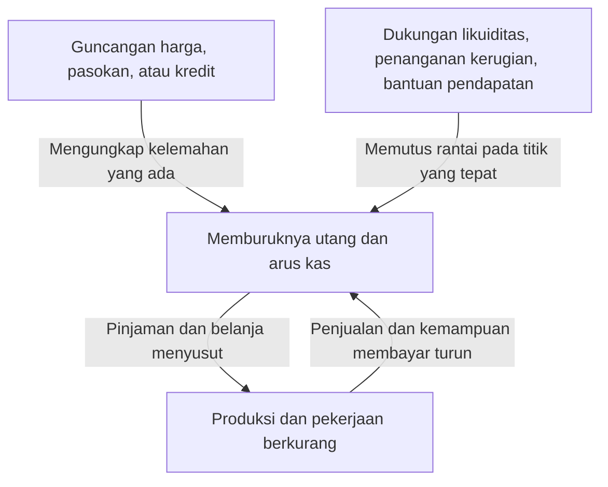
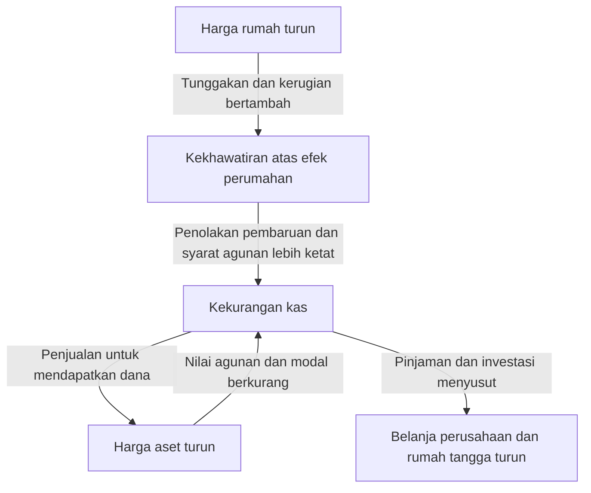

Mendengar istilah krisis Lehman, kita mungkin membayangkan kebangkrutan bank, kejatuhan saham, dan bertambahnya pengangguran sebagai satu kejadian. Namun bagaimana kegagalan satu perusahaan mengurangi produksi pabrik di seluruh dunia dan pendapatan rumah tangga? Mengapa kejatuhan saham pada Black Monday 1987 tidak menghasilkan akibat yang sama seperti Depresi Besar pada 1930-an?

Memahami guncangan ekonomi membutuhkan lebih dari menghafal nama dan tahun. Apa yang berubah pertama kali? Kelemahan apa yang telah menumpuk sebelumnya? Dari siapa kepada siapa kerugian dan kecemasan merambat? Dengan memisahkan tiga pertanyaan ini, sejarah yang rumit dapat diikuti sebagai hubungan sebab-akibat.

Artikel ini membahas 16 peristiwa representatif antara 1929 dan 2023. Ini bukan kronologi seluruh krisis di semua negara, melainkan pilihan untuk membandingkan mekanisme berbeda. Guncangan ekonomi digunakan dalam arti luas, mencakup krisis keuangan, perubahan pasokan energi, penyakit menular, dan perubahan sistem moneter. Jika penyebab krisis masih diperdebatkan dalam penelitian, satu penjelasan tidak dianggap sebagai satu-satunya jawaban benar.

## Perbedaan awal yang penting: guncangan dan krisis

Guncangan adalah kejadian yang mendadak mengubah kondisi dasar ekonomi: minyak berhenti datang, harga rumah turun, atau investor asing menarik dana. Krisis terjadi ketika perubahan tersebut tidak dapat diserap oleh lembaga dan pengelolaan dana yang ada, sehingga fondasi kegiatan ekonomi terganggu.

Ini menyerupai pembedaan antara badai, kelemahan tanggul, dan meluasnya banjir. Namun dalam ekonomi, tanggul itu sendiri berubah mengikuti keputusan manusia. Bank yang mengurangi pinjaman demi keamanan dapat menyebabkan perusahaan bangkrut dan kerugian bank bertambah. Pertahanan yang rasional bagi masing-masing pihak dapat memperbesar krisis secara keseluruhan.

Dalam guncangan permintaan, belanja konsumsi dan investasi yang ingin dilakukan berkurang. Dalam guncangan penawaran, bahan baku atau tenaga kerja kurang sehingga produksi menurun atau biaya naik. Dalam guncangan keuangan, fungsi perantara dana dan kelancaran pembayaran rusak. Pada krisis nyata, ketiganya bertumpuk dan dapat berubah sifat selama prosesnya.

Panah dalam gambar tidak selalu bekerja sama kuat. Modal memadai, pendanaan stabil, dan lembaga tepercaya dapat membatasi penularan meskipun kerugian terjadi. Sebaliknya, mekanisme yang terlihat efisien dalam keadaan normal dapat serentak menjadi kelemahan ketika kondisi ekstrem.

## Tabel perbandingan untuk melihat gambaran besar

| Periode | Peristiwa | Kelemahan atau mekanisme penularan utama |
| --- | --- | --- |
| 1929–1930-an | Depresi Besar | Kepanikan bank, penyusutan kredit, deflasi, keterbatasan standar emas |
| 1971 | Guncangan Nixon | Turunnya kepercayaan pada konversi dolar-emas dan perubahan sistem moneter |
| 1973–1974 | Krisis minyak pertama | Perubahan pasokan dan harga minyak, aliran pendapatan keluar dari negara importir |
| Sekitar 1978–1982 | Krisis minyak kedua dan pengetatan moneter | Kekhawatiran pasokan, ekspektasi inflasi, penyesuaian terhadap bunga tinggi |
| Sejak 1982 | Krisis utang Amerika Latin | Utang valuta asing, bunga mengambang, pendapatan devisa yang kurang |
| 1987 | Black Monday | Transaksi searah, likuiditas pasar, masalah penyelesaian transaksi |
| 1990-an | Pecahnya gelembung Jepang | Nilai agunan turun, kredit bermasalah, pembayaran utang berkepanjangan |
| 1994–1995 | Krisis mata uang Meksiko | Pembalikan arus modal, utang pendek, pembayaran terkait dolar |
| 1997–1998 | Krisis mata uang Asia | Ketidakcocokan mata uang dan jatuh tempo, arus keluar modal, krisis bank |
| 1998 | Krisis Rusia dan LTCM | Risiko utang pemerintah, pelarian ke aset aman, leverage |
| Sekitar 2000–2002 | Pecahnya gelembung internet | Koreksi harapan laba, berkurangnya pendanaan saham dan investasi |
| 2007–2009 | Krisis keuangan global dan Lehman | Kredit perumahan, sekuritisasi, penarikan pendanaan jangka pendek |
| Awal 2010-an | Krisis utang Eropa | Lingkaran kepercayaan bank-pemerintah dan kelemahan serikat moneter |
| 2020 | Guncangan pandemi | Permintaan dan penawaran berhenti bersamaan akibat infeksi dan perubahan perilaku |
| Sejak 2021–2022 | Guncangan inflasi dan energi | Pemulihan permintaan, batas pasokan, gangguan sumber daya akibat perang |
| 2023 | Gejolak bank Amerika Serikat | Risiko bunga, konsentrasi simpanan, arus keluar dana cepat |

Periode tersebut menunjukkan saat ciri krisis paling jelas, bukan tanggal resesi yang berlaku seragam di dunia. Awal resesi Amerika, titik terendah siklus Jepang, dan dasar harga saham tidak selalu bersamaan. Ungkapan krisis berakhir pun berbeda jika yang dimaksud stabilitas pasar, pemulihan pekerjaan, atau selesainya penanganan utang.

## Kejatuhan saham 1929 dan Depresi Besar: kerugian saham bukan seluruh ceritanya

Kejatuhan saham Amerika pada musim gugur 1929 merupakan lambang Depresi Besar. Tetapi penurunan saham saja tidak menjelaskan kemerosotan yang panjang dan parah sesudahnya. Ekonomi Amerika telah memasuki resesi sebelum kejatuhan tersebut, lalu kepanikan bank semakin merusak kredit dan pengeluaran.

Bank menjanjikan pengembalian simpanan dalam waktu pendek sambil memberikan pinjaman jangka panjang kepada perusahaan dan keluarga. Jika banyak deposan meminta uang serentak, bank dapat kesulitan membayar segera walaupun tidak semua asetnya kehilangan nilai. Saat itu Amerika belum mempunyai sistem asuransi simpanan federal seperti sekarang.

Ketika kegagalan bank dan penarikan dana meluas, perusahaan sulit meminjam modal kerja. Pembayaran upah, pembelian bahan, dan pemeliharaan persediaan terganggu sehingga produksi dan pekerjaan menyusut. Pengangguran dan pendapatan turun menekan konsumsi serta kemampuan membayar perusahaan. Rumah tangga tanpa saham pun terkena dampaknya.

Turunnya harga tidak selalu menolong. Jika jumlah utang nominal tetap, beban pembayaran meningkat ketika penjualan dan upah turun. Utang 5 juta yen dengan pendapatan tahunan 5 juta berbeda bebannya dari utang yang sama setelah pendapatan turun menjadi 3,5 juta. Contoh hipotetis ini menunjukkan bagaimana deflasi dan utang saling memperburuk.

Di bawah standar emas, menjaga kepercayaan pada konversi mata uang ke emas dapat bertentangan dengan pelonggaran moneter domestik. Pengetatan untuk mencegah keluarnya emas justru memperparah kekurangan dana saat resesi. Proteksionisme dan hubungan utang internasional menambah masalah. [Sejarah Federal Reserve](https://www.federalreservehistory.org/essays/banking-panics-1931-33) menjelaskan tekanan simultan dari keluarnya emas dan penarikan simpanan.

Pelajarannya bukan bahwa menopang saham menyelesaikan segalanya. Jika pembayaran, perantara kredit, dan kepercayaan deposan runtuh, kerugian aset keuangan dapat menjadi kerusakan kapasitas produksi jangka panjang. Peneliti berbeda dalam menilai peran kebijakan dan standar emas, tetapi menyalahkan satu hari kejatuhan terlalu menyederhanakan.

## Guncangan Nixon 1971: janji penukaran tidak lagi dapat dipertahankan

Dalam sistem Bretton Woods setelah perang, banyak mata uang memiliki hubungan kurs tetap terhadap dolar, sementara Amerika mendukung penukaran dolar milik otoritas moneter asing menjadi emas dengan syarat tertentu. Ini bukan sistem yang membolehkan setiap orang menukar semua uang dolarnya secara bebas dengan emas.

Perdagangan dan keuangan internasional yang membesar membutuhkan dolar yang tersedia di dunia. Namun semakin besar kepemilikan dolar di luar negeri, semakin besar keraguan terhadap janji konversi dibandingkan cadangan emas Amerika. Kekhawatiran mendorong penukaran lebih awal dan makin menggoyahkan sistem.

Pada Agustus 1971, Presiden Nixon mengumumkan penghentian konversi dolar-emas dan kebijakan lain. Sesudah upaya mempertahankan sistem dengan penyesuaian kurs, mata uang utama beralih ke kurs mengambang pada 1973. Menganggap semua kurs tetap berakhir serentak pada satu hari di 1971 menghilangkan urutan ini. [Federal Reserve History](https://www.federalreservehistory.org/essays/gold-convertibility-ends) menjelaskan tujuan kebijakan dan proses peralihan.

Bagi perusahaan Jepang, kurs menjadi sumber perubahan besar dalam rencana bisnis. Penerimaan ekspor dolar yang sama menghasilkan lebih sedikit yen jika yen menguat. Namun biaya impor dapat turun, sehingga eksportir dan importir mengalami dampak berbeda.

Ini terutama guncangan sistem moneter dan kebijakan, bukan jenis krisis yang sama dengan rangkaian kebangkrutan bank. Kurs tetap membantu kestabilan transaksi, tetapi ketika syarat untuk mempertahankan janji hilang, penyesuaiannya dapat besar.

## Krisis minyak pertama 1973–1974: biaya produksi melonjak

Dengan latar perang Timur Tengah 1973, negara produsen Arab membatasi pasokan dan melakukan embargo terhadap Amerika serta negara lain, sementara harga minyak naik tajam. OAPEC, organisasi produsen Arab pelaksana embargo, perlu dibedakan dari OPEC yang anggotanya lebih luas. Pembatasan pasokan, kebijakan harga produsen, dan permintaan dunia yang sudah kuat bertumpuk. [Sejarah krisis minyak pertama](https://www.federalreservehistory.org/essays/oil-shock-of-1973-74) menjelaskan latarnya.

Minyak bukan hanya bahan bakar mobil. Ia menjadi input logistik, pembangkit listrik, dan produk kimia. Karena penggantian bahan bakar atau peralatan membutuhkan waktu, kekurangan kecil pun dapat menggerakkan harga besar. Jika permintaan dan penawaran kurang responsif terhadap harga, sebagian besar penyesuaian ditanggung harga.

Negara importir harus membayar lebih banyak pendapatan ke luar negeri untuk jumlah minyak yang sama. Jika perusahaan menaikkan harga, daya beli rumah tangga turun; jika tidak dapat meneruskan biaya, laba menyusut. Kedua jalur mengurangi kemampuan konsumsi dan investasi.

Inflasi dan pelemahan ekonomi dapat berlangsung bersama: inilah stagflasi. Merangsang belanja besar karena permintaan lemah tidak segera menambah minyak atau peralatan. Sebaliknya, pengetatan kuat yang hanya memperhatikan harga dapat memperbesar kerusakan pekerjaan.

Kekacauan Jepang pun tidak semata-mata minyak. Permintaan, keadaan moneter, dan ekspektasi kenaikan harga turut berpengaruh. Penghematan energi dan perubahan industri kemudian mengubah ketahanan terhadap guncangan serupa. Besarnya guncangan pasokan bergantung pada harga sumber daya serta tingkat ketergantungan kepadanya.

## Krisis minyak kedua dan bunga tinggi: proses meredam inflasi juga menyakitkan

Gangguan produksi akibat Revolusi Iran 1978–1979 kembali mengguncang pasar minyak. Tetapi kenaikan harga tidak dapat dianggap sebanding sederhana dengan produksi yang hilang. Kekhawatiran pasokan akan berkurang lagi meningkatkan permintaan untuk menimbun persediaan. Ketakutan akan masa depan dapat meningkatkan permintaan sekarang. [Penjelasan krisis kedua](https://www.federalreservehistory.org/essays/oil-shock-of-1978-79) membahas penurunan pasokan serta permintaan berjaga-jaga.

Dalam ekonomi dengan inflasi berkelanjutan, perusahaan dan pekerja memperhitungkan kenaikan berikutnya saat menentukan harga dan upah. Ini tidak berarti upah selalu menjadi satu-satunya pendorong. Biaya sumber daya, permintaan, kepercayaan pada kebijakan, dan kontrak menentukan persistensi inflasi.

Di Amerika, Paul Volcker yang menjadi ketua Fed pada 1979 memperkuat pengetatan untuk menekan inflasi. Bunga lebih tinggi mengurangi pembelian rumah dan investasi, sehingga membebani kegiatan ekonomi dan pekerjaan. Resesi sekitar 1980 hingga awal dekade itu mencakup kenaikan minyak serta penyesuaian terhadap perubahan kebijakan.

Pengetatan moneter bukan kebijakan mengebor minyak. Ia menekan belanja dan kredit serta berusaha mengubah keyakinan bahwa inflasi akan berlangsung lama. Karena batas pasokan tidak langsung hilang, proses menurunkan inflasi menimbulkan biaya ekonomi nyata. [Sejarah Inflasi Besar](https://www.federalreservehistory.org/essays/great-inflation) memperlihatkan hubungan keputusan kebijakan dan harga.

Kenaikan bunga Amerika juga menjalar ke luar negeri. Negara dan perusahaan yang berutang dolar menghadapi pembayaran yang lebih berat. Hubungan inilah kunci memahami krisis Amerika Latin berikutnya.

## Krisis utang Amerika Latin sejak 1982: mata uang dan bunga menjadi beban

Pada 1970-an, dana yang diperoleh negara minyak dan aliran lain mendorong perluasan pinjaman bank internasional. Negara Amerika Latin meminjam valuta asing dalam jumlah besar. Namun mampu meminjam berbeda dari mampu membayar dengan pendapatan devisa masa depan.

Utang dolar tidak dapat dilunasi hanya dengan mencetak mata uang sendiri. Dolar harus diperoleh dari ekspor, modal masuk, atau cadangan. Dalam kontrak bunga mengambang, naiknya bunga internasional menambah pembayaran bunga. Sementara itu, ekonomi dunia yang melemah membatasi ekspor dan penerimaan komoditas.

Pada Agustus 1982, kesulitan pembayaran Meksiko membuat krisis terbuka, kemudian banyak negara harus merestrukturisasi utang. Bank internasional juga memiliki pinjaman besar sehingga masalah tidak terbatas pada negara peminjam. [Sejarah krisis utang Amerika Latin](https://www.federalreservehistory.org/essays/latin-american-debt-crisis) mencakup sisi pemberi pinjaman.

Ketika pinjaman baru berhenti, pembayaran yang bergantung pada pembiayaan ulang tidak dapat diteruskan. Memotong impor menghemat devisa, tetapi jika mesin dan komponen produksi ikut berkurang, kemampuan menghasilkan pendapatan masa depan rusak. Penyesuaian fiskal, depresiasi, dan masalah bank membawa stagnasi panjang bagi sebagian negara.

Pelajarannya bukan sekadar utang itu buruk. Mata uang, bunga, jatuh tempo, dan pendapatan penopangnya penting. Investasi jangka panjang yang berguna bagi masyarakat pun dapat kehabisan dana di tengah jalan jika tenggat pembayaran tidak cocok dengan pendapatan devisa.

## Black Monday 1987: pasar yang dianggap mudah menjual menjadi tipis

Pada 19 Oktober 1987, Dow Jones turun 22,6% dalam sehari. Namun kejatuhan itu tidak langsung menjadi krisis bank atau resesi ala Depresi Besar di Amerika. Kasus ini penting untuk membedakan penurunan harga dari runtuhnya fungsi keuangan secara keseluruhan.

Penyebabnya bukan satu berita. Kekhawatiran atas saham mahal, bunga, kurs, dan struktur pasar bertumpuk. Asuransi portofolio, yang menjual kontrak berjangka atau instrumen lain ketika harga turun untuk membatasi kerugian, juga disebut memperbesar penjualan. Nama asuransi tidak berarti ada pihak yang tanpa syarat mengganti semua kerugian.

Seorang investor yang menjual demi mengurangi risiko membutuhkan pembeli. Jika banyak peserta menjual bersama karena perubahan harga yang sama, permintaan pada harga lama tidak cukup. Harga turun lebih jauh dan memicu penjualan berikutnya.

Perbedaan perdagangan dan penyelesaian saham tunai, futures, serta opsi memperumit kebutuhan dana. Transaksi yang saling mengimbangi secara akuntansi tetap memerlukan uang sementara jika tanggal pembayarannya berbeda. [Federal Reserve History](https://www.federalreservehistory.org/essays/stock-market-crash-of-1987) membahas struktur pasar dan bantuan likuiditas tersebut.

Kesediaan bank sentral menyediakan likuiditas dan keberlanjutan pinjaman membantu menahan rantai. Kedalaman krisis tidak diukur hanya dengan persentase kejatuhan saham. Artinya bergantung pada siapa menanggung kerugian, seberapa besar utangnya, dan perannya dalam pembayaran serta kredit.

## Pecahnya gelembung Jepang: tanah, bank, dan neraca perusahaan terhubung

Pada akhir 1980-an, saham dan tanah Jepang naik tajam. Pelonggaran moneter, perilaku bank dalam liberalisasi keuangan, pinjaman beragunan tanah, dan harapan kenaikan harga saling menguatkan. Alih-alih menjelaskan semuanya hanya dengan Plaza Accord atau bunga rendah, kita perlu melihat interaksi kredit dan harga aset.

Jika tanah naik, tanah yang sama dapat menjamin pinjaman lebih besar. Jika dana itu membeli properti lagi, harga naik lebih jauh. Ketika pinjaman mengandalkan penjualan agunan pada harga lebih tinggi daripada pendapatan masa depan, kenaikan harga sendiri menopang utang.

Setelah pengetatan moneter dan pembatasan kredit properti, penurunan aset pada 1990-an membalikkan proses. Perusahaan masih memiliki utang pembelian, tetapi nilai agunan dan aset turun. Bank menumpuk kredit yang sulit ditagih atau kredit bermasalah. [Penelitian Bank of Japan](https://www.imes.boj.or.jp/research/abstracts/english/me14-1-6.html) mengkaji hubungan kredit, tanah, dan saham.

Kerugian mengurangi modal bank dan menyulitkan pinjaman baru. Pada saat bersamaan, perusahaan mengutamakan pelunasan utang walaupun bunga turun. Karena pemberi dan penerima pinjaman sama-sama mengurangi belanja, pemotongan bunga saja belum tentu mengembalikan investasi.

Jika pengakuan dan penanganan kerugian terlambat, pinjaman untuk perusahaan lemah dapat berlanjut sementara perusahaan berpotensi justru kekurangan dana. Gejolak 1997–1998 menunjukkan kerentanan bank bertahan setelah harga aset turun. Bank of Japan membahas [deflasi dan penyesuaian neraca sejak 1990-an](https://www.boj.or.jp/en/about/press/koen_2024/ko240527b.htm) sebagai latar penting stagnasi panjang.

Namun seluruh perkembangan Jepang sesudahnya tidak bisa direduksi menjadi pecahnya gelembung. Demografi, produktivitas, persaingan internasional, dan kebijakan juga berperan. Intinya, penurunan aset yang menetap dalam neraca membuat perilaku bank dan perusahaan tidak segera pulih meskipun saham sempat naik.

## Krisis Meksiko 1994–1995: tanpa pembiayaan ulang, mempertahankan mata uang sulit

Pada 1994, ketidakpastian politik dan kenaikan bunga Amerika membuat arus dana asing ke Meksiko tidak stabil. Negara dengan defisit transaksi berjalan harus menutup kekurangan melalui aliran modal atau sumber lain. Defisit tidak otomatis berarti krisis, tetapi penyesuaian menjadi berat ketika aliran itu mendadak berhenti.

Cadangan devisa untuk menopang kurs terbatas. Tesobonos yang penerbitannya diperbesar pemerintah adalah utang pendek dengan pembayaran terkait dolar. Upaya mengurangi kekhawatiran investor terhadap peso justru meningkatkan risiko kurs dan pembiayaan ulang pemerintah.

Perubahan kebijakan kurs Desember 1994 tidak cukup memulihkan kepercayaan, dan peso jatuh tajam. Beban mata uang domestik dari utang terkait dolar meningkat, sehingga kesediaan investor memperpanjang pinjaman menjadi sangat mendesak. [Penilaian IMF saat itu](https://www.imf.org/en/news/articles/2015/09/28/04/53/spmds9508) menyoroti kelemahan dana pendek dan komposisi utang.

Depresiasi dapat membantu ekspor, tetapi sekaligus memperberat utang valuta asing. Itulah sebabnya penjelasan bahwa devaluasi mengembalikan daya saing dan menyelesaikan masalah tidak cukup. Neraca perusahaan dan bank yang rusak bahkan dapat menghalangi dana untuk menambah ekspor.

Kasus ini menunjukkan pentingnya melihat jumlah yang harus dibayar dalam beberapa bulan, bukan hanya total utang pemerintah. Utang sama besar lebih tahan terhadap hilangnya kepercayaan jika pembayaran tersebar panjang daripada menumpuk dalam waktu singkat.

## Krisis Asia 1997–1998: utang swasta asing mengguncang seluruh ekonomi

Pada Juli 1997, Thailand melepas pertahanan kurs baht, lalu krisis menyebar ke Indonesia, Korea Selatan, dan negara lain. Namun lembaga serta kelemahan masing-masing berbeda. Menjelaskan semuanya sebagai pemborosan fiskal pemerintah mengabaikan utang perusahaan dan bank swasta.

Banyak transaksi meminjam dolar atau valuta lain dalam jangka pendek untuk membiayai properti dan usaha domestik jangka panjang. Mata uang pendapatan yang berbeda dari pembayaran disebut ketidakcocokan mata uang; waktu pembayaran yang berbeda dari pemulihan investasi disebut ketidakcocokan jatuh tempo. Selama kurs stabil dan pinjaman bisa diperbarui, kelemahan itu tidak mudah terlihat.

Ketika investor bergegas menarik dana, permintaan devisa meningkat dan mata uang turun. Depresiasi memperbesar utang asing serta kekhawatiran atas perusahaan, memicu arus keluar lebih lanjut. Kurs dan kemampuan membayar saling memperburuk. [Kajian sektor keuangan IMF](https://www.imf.org/external/pubs/ft/op/opfinsec/index.htm) menjelaskan hubungan bank, perusahaan, dan sistem kurs.

Misalnya perusahaan meminjam 1 juta dolar saat satu dolar bernilai 100 unit lokal: pokoknya setara 100 juta unit. Jika kurs menjadi 150, pokok yang sama setara 150 juta. Dengan penjualan tetap dalam mata uang domestik, beban naik tanpa pinjaman tambahan. Pendapatan ekspor dan lindung nilai dapat mengubah dampak; contoh ini hipotetis tanpa perlindungan.

Bunga tinggi untuk mempertahankan mata uang dapat menahan keluarnya dana, tetapi menyakiti peminjam domestik. Sebaliknya, membiarkan depresiasi merusak utang asing. Respons krisis berada dalam dilema ini, dan perdebatan tentang syarat IMF serta kebijakan fiskal dan moneter masih berlangsung.

Penularan lintas negara tidak otomatis terjadi karena bertetangga. Salurannya mencakup kreditur yang sama, pasar ekspor yang tumpang tindih, atau investor yang menganggap ekonominya mirip. Kreditur bersama yang rugi dapat menarik dana bahkan dari negara bermasalah lebih kecil.

## Rusia dan LTCM 1998: transaksi tersebar tetap dapat rugi bersamaan

Pada 1998, lemahnya fiskal dan penarikan pajak Rusia, harga komoditas rendah, serta keraguan pendanaan bertumpuk. Pada Agustus diumumkan devaluasi rubel dan restrukturisasi obligasi domestik, antara lain. Anggapan utang pemerintah selalu aman terguncang dan investor global lebih memilih keamanan serta kemudahan menjual.

Hedge fund Long-Term Capital Management atau LTCM mengalami kerugian besar di tengah kekacauan itu. Menganggap strateginya sekadar membeli obligasi Rusia menyembunyikan luasnya masalah. Hal penting ialah transaksi berleverage besar yang mengharapkan selisih harga instrumen serupa menyempit.

Selisih kecil dapat menguntungkan jika volume besar. Namun ketika peserta berbondong-bondong mencari aset likuid, selisih justru melebar. Walaupun prediksi konvergensi jangka panjang benar, permintaan agunan tambahan sekarang dapat membuat investor tidak sanggup menunggu.

Tersebar di banyak pasar belum berarti diversifikasi kuat jika semuanya bergantung pada asumsi bahwa likuiditas pasar tetap terjaga. Naiknya korelasi saat krisis bukan hanya angka matematika; banyak orang menjual bersama karena alasan yang sama.

Federal Reserve New York memfasilitasi perundingan lembaga terkait, kemudian lembaga swasta menyuntikkan modal. Ini berbeda dari suntikan dana publik langsung oleh Fed kepada LTCM. [Kesaksian presiden Fed New York saat itu](https://www.newyorkfed.org/newsevents/speeches/1998/mcd981001.html) menjelaskan pembagian peran. Nilai jangka panjang dalam model dan uang tunai untuk pembayaran besok adalah persoalan berbeda.

## Pecahnya gelembung internet: teknologi nyata tidak menjamin harga saham tepat

Pada akhir 1990-an, harapan internet mengubah industri mengalirkan dana ke teknologi informasi dan telekomunikasi. Perubahan teknologinya memang besar. Tetapi penyebaran teknologi bermanfaat tidak berarti setiap perusahaan akan meraih laba tinggi.

Nilai perusahaan bergantung pada laba atau kas masa depan dan bagaimana nilainya didiskontokan ke hari ini. Jika perhatian hanya tertuju pada ukuran pasar sementara biaya memperoleh pelanggan, persaingan, pembakaran kas, dan investasi tambahan diabaikan, sedikit penurunan perkiraan pertumbuhan dapat sangat mengubah valuasi.

Sejak 2000, koreksi harapan laba berlebihan menyulitkan pendanaan saham sehingga perusahaan memangkas pegawai dan investasi. Kelebihan investasi jaringan komunikasi juga disesuaikan. Selain berkurangnya kekayaan rumah tangga, dana untuk meneruskan usaha menyusut. [Laporan tahunan Fed 2001](https://www.federalreserve.gov/boarddocs/rptcongress/annual01/ar01.pdf) mencatat perubahan investasi dan keuangan.

Tidak tepat pula menganggap resesi Amerika 2001 dimulai hanya oleh serangan September. Pelemahan sudah berlangsung sebelumnya, sedangkan serangan menambah pukulan terhadap perjalanan dan ketidakpastian. Guncangan bertumpuk perlu dibaca menurut urutannya.

Dibandingkan krisis perumahan 2008, kerugian lebih banyak ditanggung investor saham, dan amplifikasi melalui bank serta pendanaan pendek berbeda. Saham turun tidak mewajibkan perusahaan membayar kembali harga yang sama, sedangkan utang tetap menuntut pembayaran. Perbedaan pendanaan menentukan seberapa jauh kekecewaan teknologi menjadi krisis keuangan.

## Krisis Lehman: kerugian hipotek menghentikan pasar dana jangka pendek

### Krisis tidak mendadak dimulai pada September 2008

Istilah guncangan Lehman di Jepang merujuk secara simbolis pada bangkrutnya bank investasi Lehman Brothers tanggal 15 September 2008. Namun masalah perumahan Amerika dan produk keuangannya sudah berkembang sebelumnya. Ketegangan pasar dana pendek muncul pada 2007, dan Bear Stearns mengalami krisis pada musim semi 2008.

Kenaikan rumah memberi rasa aman kepada peminjam serta pemberi pinjaman. Harapan dapat menjual atau membiayai ulang rumah ketika kesulitan menopang kredit. Saat harga turun, penjualan tidak selalu melunasi utang dan landasan pembiayaan ulang runtuh. [Penjelasan krisis hipotek subprime](https://www.federalreservehistory.org/essays/subprime-mortgage-crisis) membahas interaksi kredit dan harga rumah.

Penjelasan bahwa orang berkemampuan bayar rendah meminjam saja tidak cukup. Penilaian pinjaman, insentif sekuritisasi, penilaian investor, modal, dan cara pendanaan lembaga harus diperiksa untuk memahami mengapa gagal bayar lokal menjadi krisis dunia.

### Sekuritisasi tidak menghapus risiko

Dasar sekuritisasi adalah menggabungkan hipotek dan membagikan penerimaan pembayarannya kepada investor. Urutan prioritas menciptakan bagian yang menanggung kerugian lebih awal dan bagian yang terkena kemudian. Namun total kerugian tidak lenyap.

Menggabungkan pinjaman banyak wilayah dapat menyebar risiko setempat. Tetapi ketika rumah turun luas, pengangguran dan kesulitan pembiayaan ulang terjadi bersama, gagal bayar makin berkorelasi. Bagian berperingkat tinggi pun dapat rugi jika asumsi dasarnya rusak.

Produk yang makin rumit juga menyulitkan mengetahui siapa akhirnya menanggung kerugian mana. Walaupun kerugian sendiri kecil, ketidakjelasan kondisi mitra menjadi alasan menahan pinjaman. Masalahnya bukan hanya besar kerugian, tetapi ketidakpastian lokasinya.

### Pendanaan pendek berhenti, aset harus dijual

Bank investasi dan lembaga lain membiayai aset berjangka panjang melalui repo dan surat berharga pendek. Repo memiliki sifat mendekati pinjaman jangka pendek beragunan efek. Sistem berjalan selama pembaruan tersedia; jika kreditur menolak, uang tunai segera diperlukan.

Bayangkan agunan bernilai 100 sebelumnya mendukung pinjaman 95, tetapi karena kehati-hatian hanya mendukung 80. Selisih 15 harus dicari dari tempat lain. Ini contoh hipotetis mekanisme. Jika harga agunan sendiri ikut turun, kebutuhan kas bertambah lagi.

Penjualan aset untuk mendapatkan kas dapat menurunkan harga pasar. Lembaga lain mengalami penurunan nilai dan tuntutan agunan tambahan sehingga ikut menjual. Walaupun tidak berbentuk antrean deposan di bank, penarikan serentak penyedia dana pendek menyerupai bank run.

### Masalah pusat keuangan mencapai pabrik dan keluarga

Setelah Lehman, ketidakpercayaan mitra dan kekacauan pasar pendek meningkat tajam. Dibutuhkan bantuan AIG, penambahan modal lembaga, serta likuiditas bank sentral dan langkah lain. [Gambaran krisis global](https://www.federalreservehistory.org/essays/great-recession-and-its-aftermath) menghubungkan perumahan, sektor keuangan, dan ekonomi nyata.

Jika bank mengurangi pinjaman, perusahaan sulit memperoleh dana investasi maupun pembayaran harian. Rumah tangga menunda barang tahan lama akibat turunnya aset dan ketidakpastian pekerjaan. Pesanan pun turun bagi eksportir yang tidak pernah memiliki produk bermasalah tersebut. Penyusutan permintaan serta perdagangan dunia penting dalam pukulan ke Jepang.

Masih diperdebatkan bobot bunga rendah, arus modal internasional, regulasi, pengawasan, dan sistem imbalan. Tetapi kombinasi kerugian hipotek, leverage tinggi, pendanaan pendek, dan risiko tidak transparan tidak dapat diabaikan. Lehman adalah titik penguatan penting, bukan satu perusahaan yang menciptakan semua masalah terakumulasi.

## Krisis utang Eropa: pemerintah dan bank saling melemahkan

Dari akhir 2009 hingga 2010, kekhawatiran fiskal Yunani membesar dan merambat ke beberapa negara euro. Namun kondisi Yunani tidak boleh disalin ke semua negara. Di Irlandia dan Spanyol, properti dan perbankan sangat penting.

Jika kepercayaan pemerintah turun dan obligasinya kehilangan nilai, bank pemegang obligasi ikut rusak. Jika pemerintah menambah beban untuk menopang bank, kekhawatiran fiskal makin besar. Hubungan yang semula saling menopang berubah menjadi saling melemahkan.

Anggota euro tidak dapat sendiri mendevaluasi mata uang nasional atau menentukan bunga kebijakannya. Pada awal krisis, pengawasan dan resolusi bank serta pembagian risiko fiskal belum cukup terintegrasi. Integrasi lembaga penanganan krisis tertinggal dari integrasi mata uang.

Bunga pembiayaan ulang lebih tinggi menambah pembayaran dan memperburuk keberlanjutan utang. Ketakutan dapat membantu membuat risiko menjadi nyata. Namun tidak semuanya psikologi tanpa dasar: utang, produktivitas, dan kelemahan bank berbeda menurut negara. [Tinjauan ECB](https://www.ecb.europa.eu/press/key/date/2018/html/ecb.sp180511.en.html) menjelaskan perbedaan dan pelajaran kelembagaan.

Penghematan fiskal bertujuan memulihkan kepercayaan, tetapi pengurangan belanja mendadak saat resesi juga menekan pendapatan dan pajak. Bantuan pun menuntut keputusan siapa menanggung kerugian serta bagaimana mencegah utang berlebihan di masa depan. Respons ECB, fasilitas bantuan, dan serikat perbankan dikembangkan untuk memutus lingkaran ini.

## Pandemi 2020: yang pertama berhenti adalah kegiatan, bukan produk keuangan

Penyebaran COVID-19 membatasi mobilitas, jasa tatap muka, serta tempat kerja dan pabrik sekaligus. Bukan hanya aturan pemerintah: perubahan sukarela untuk menghindari infeksi dan ketidakhadiran pekerja juga menurunkan kegiatan. Penyebab awalnya berbeda dari krisis bank biasa.

Pada penawaran, pekerja tidak bisa bekerja, komponen tidak tiba, dan logistik tersendat. Pada permintaan, perjalanan, restoran, dan hiburan berkurang; kekhawatiran pendapatan serta masa depan menunda pembelian. Permintaan juga bergeser dari jasa ke barang, sehingga tidak semua sektor bergerak searah. [Analisis awal IMF](https://www.imf.org/en/Blogs/Articles/2020/03/09/blog030920-limiting-the-economic-fallout-of-the-coronavirus-with-large-targeted-policies) memisahkan kedua sisi.

Penjualan dapat berhenti mendadak, tetapi sewa dan cicilan tetap berjalan. Perusahaan yang sebenarnya layak dapat bangkrut jika kas habis. Hentinya kegiatan sementara berubah menjadi kerusakan panjang ketika hubungan kerja dan jaringan usaha hilang. Kebijakan dibutuhkan untuk menjembatani perusahaan dan keluarga melewati masa berhenti.

Menurunkan bunga tidak langsung menghilangkan infeksi atau kekurangan komponen. Kesehatan masyarakat harus dipadukan dengan bantuan pendapatan, pemeliharaan pekerjaan, dan dukungan kas. Karena kebutuhan uang tunai pasar juga melonjak, mencegah guncangan nyata berubah menjadi kerusakan fungsi keuangan menjadi penting.

Pemulihan pun tidak seragam. Permintaan dapat kembali lebih cepat daripada fasilitas, pekerja, dan logistik internasional. Kekurangan permintaan pada awal krisis dapat berubah menjadi ketidakmampuan pasokan tertentu mengejar pemulihan. Ini penting untuk memahami inflasi berikutnya.

## Inflasi dan energi sejak 2021–2022: beberapa batas bertumpuk

Inflasi setelah pandemi tidak mempunyai satu penyebab. Pemulihan dan perubahan komposisi permintaan, gangguan rantai pasok, perubahan tenaga kerja, serta keadaan fiskal dan moneter bertumpuk. Bobotnya berbeda menurut negara dan waktu; satu penjelasan untuk Amerika dan Eropa dapat melewatkan perbedaan penting.

Pasar energi sudah ketat sejak 2021. Invasi Rusia ke Ukraina pada Februari 2022 kemudian mengguncang gas, minyak, dan listrik lebih jauh. Perang, pemotongan pasokan, sanksi, dan risiko transaksi mengubah jalur serta biaya. [Badan Energi Internasional](https://www.iea.org/topics/2022-energy-crisis) membedakan pengetatan sebelum invasi dan pemburukan setelahnya.

Gas khususnya memerlukan pipa, fasilitas pencairan, kapal, dan terminal penerimaan. Kekurangan satu wilayah tidak selalu dapat segera diganti sumber daya wilayah lain. Keberadaan sumber daya di Bumi berbeda dari kemampuannya tiba di tempat dan waktu yang dibutuhkan. Batas fisik ini memperbesar perubahan harga.

Di negara importir, energi lebih mahal menaikkan biaya perusahaan dan hidup keluarga. Subsidi atau penahanan harga meringankan jangka pendek, tetapi membebani anggaran dan dapat melemahkan dorongan menghemat. Siapa yang dibantu dan berapa lama menjadi penting.

Bank sentral menaikkan bunga agar inflasi tidak menetap. Namun bunga tidak langsung menambah gas. Ia memengaruhi harga melalui permintaan dan ekspektasi, sambil menekan rumah serta investasi dan menimbulkan kerugian aset lama. Inflasi turun berarti laju kenaikan melambat, bukan pasti biaya hidup kembali seperti sebelumnya.

## Gejolak bank Amerika 2023: obligasi aman juga memiliki risiko bunga

Kegagalan Silicon Valley Bank atau SVB pada Maret 2023 menunjukkan krisis tidak hanya berasal dari hipotek buruk. Risiko bunga obligasi panjang, konsentrasi deposan, dan ketergantungan pada simpanan besar yang tidak sepenuhnya diasuransikan bertumpuk.

Obligasi dengan pembayaran bunga tetap umumnya turun harganya ketika bunga pasar naik. Jika obligasi baru membayar lebih tinggi, obligasi lama harus lebih murah agar menarik pembeli. Aset berisiko kredit rendah seperti surat pemerintah pun tidak menjamin harga jual sebelum jatuh tempo.

Menahan sampai jatuh tempo berbeda dari menjual hari ini demi membayar penarikan. Klasifikasi akuntansi mengubah waktu pengakuan rugi, tetapi tidak menghapus harga pasar ketika kas dibutuhkan segera. Struktur dasar bank yang membiayai aset panjang dengan simpanan yang cepat ditarik menjadi masalah.

Pelanggan SVB terkonsentrasi pada teknologi dan bidang terkait, sehingga kebutuhan dana serta keputusan mereka mudah bergerak bersama. Transfer daring dan penyebaran informasi mempercepat penarikan. Namun menyalahkan media sosial saja mengabaikan kelemahan pengelolaan aset-liabilitas serta pengawasan sebelumnya. [Tinjauan Fed](https://www.federalreserve.gov/publications/2023-April-SVB-Key-Takeaways.htm) mencakup pengelolaan dan pengawasan.

Kekhawatiran menjalar ke bank lain pada tahun yang sama, tetapi aset dan nasabahnya tidak identik. Daripada menganggapnya pengulangan persis krisis perumahan 2008, lebih berguna melihat siapa terpapar perubahan bunga dan dalam bentuk apa.

## Empat mekanisme yang menghubungkan sejarah

### Modal tipis membuat penurunan kecil menjadi kerugian besar

Jika aset adalah $A$, utang $D$, dan modal sendiri $E$, neraca sederhana memberikan:

$$
E=A-D,\qquad L=\frac{A}{E}
$$

$L$ adalah definisi leverage yang dipakai di sini. Aset 100, utang 95, dan modal 5 berarti leverage 20 kali. Jika nilai utang tetap dan aset berkurang 3, modal turun dari 5 menjadi 2. Aset hanya turun 3%, tetapi modal kehilangan 60%. Pajak, lindung nilai, dan komposisi aset diabaikan, namun penguatan kerugian terlihat jelas.

Jika hanya melihat masa harga stabil, leverage tinggi tampak efisien. Saat perubahan harga membesar, penjualan dan pengurangan pinjaman untuk menjaga modal dapat meningkatkan kerugian pihak lain. Ini menghubungkan gelembung Jepang, LTCM, dan krisis global.

### Likuiditas dan solvabilitas berbeda, tetapi saling memengaruhi

Masalah solvabilitas berarti utang terlalu besar dibandingkan aset atau pendapatan yang dapat dipulihkan. Masalah likuiditas berarti kekurangan kas untuk pembayaran sekarang walaupun ada aset yang menghasilkan kemudian. Perusahaan berlaba pun dapat bangkrut karena arus kas akibat perbedaan ini.

Jika bank sentral atau pihak lain mengisi kekurangan sementara, aset sehat tidak perlu dijual murah secara tergesa. Tetapi jika nilai aset memang kurang, tambahan pinjaman tidak menghapus kerugian. Diperlukan suntikan modal, restrukturisasi utang, atau penataan usaha.

Dalam praktik, keduanya sulit segera dibedakan. Penjualan paksa karena kekurangan likuiditas dapat menghancurkan solvabilitas, dan dugaan kerugian dapat memicu penarikan dana. Pernyataan ekstrem bahwa kas selalu menyelesaikan masalah atau bahwa setiap usaha merugi harus dibiarkan gagal tidak menangkap hubungan ini.

### Kontrak mata uang dan bunga menciptakan beban tak terduga

Nilai utang valuta asing dalam mata uang domestik secara sederhana adalah:

$$
D_{\mathrm{home}}=eD_{\mathrm{foreign}}
$$

$e$ adalah jumlah mata uang domestik untuk membeli satu unit valuta asing. Depresiasi menaikkan $e$, sehingga beban meningkat walaupun pokok asing sama. Pendapatan valuta asing atau lindung nilai harus diperhitungkan sebagai pengimbang jika ada.

Harga obligasi pembayaran tetap dapat dipahami dengan mendiskontokan pembayaran masa depan. Dalam model sederhana dengan kupon per periode $C$, pokok akhir $F$, sisa periode $T$, dan tingkat diskonto tetap $y$:

$$
P=\sum_{t=1}^{T}\frac{C}{(1+y)^t}+\frac{F}{(1+y)^T}
$$

Jika hal lain tetap, naiknya $y$ menurunkan $P$. Kenyataannya bunga berbeda menurut tenor, ada risiko kredit dan pelunasan awal, sehingga rumus ini tidak menilai semua efek sendirian. Namun ia menjelaskan mengapa bunga tinggi dapat meningkatkan hasil pinjaman baru sekaligus mengurangi nilai obligasi panjang lama.

### Keterhubungan internasional membawa manfaat dan guncangan

Penularan internasional melalui perdagangan, keuangan, dan harga bersama. Resesi suatu negara mengurangi impor dan memukul pabrik eksportir. Kerugian bank global dapat mengurangi pinjaman di negara yang tampak tidak terkait. Minyak dan bunga dolar dapat berubah bagi banyak negara sekaligus.

Perbedaannya penting untuk kebijakan. Menambah modal bank saja tidak mengembalikan pesanan eksportir yang turun. Sebaliknya, perusahaan dengan pesanan tetapi tanpa modal kerja dapat terbantu oleh perbaikan aliran dana. Di balik istilah resesi dunia, kita harus mengidentifikasi jalur yang berhenti.

## Mengapa kebijakan tidak memiliki obat universal

Jika masalah utamanya kekurangan permintaan, pelonggaran moneter dan belanja fiskal dapat menopang pekerjaan serta produksi. Jika pasokan sangat terbatas, menaikkan permintaan tanpa menambah pasokan dapat memperkuat inflasi. Namun guncangan pasokan juga tidak berarti tak perlu bertindak; bantuan terbatas bagi keluarga dan perusahaan paling terdampak merupakan persoalan tersendiri.

Dalam krisis bank, melindungi pembayaran dan simpanan harus dibedakan dari menyelamatkan manajer atau investor tanpa syarat. Desain pembagian kerugian penting: syarat suntikan modal, kerugian pemegang saham dan kreditur tertentu, atau kelanjutan fungsi penting sambil menata usaha.

Mengambil risiko berlebihan karena mengharapkan bantuan disebut moral hazard. Tetapi menolak seluruh bantuan saat krisis dapat menyeret pihak yang tidak menyebabkan masalah. Regulasi modal dan likuiditas, keterbukaan, serta kesiapan resolusi saat normal perlu digabungkan dengan dukungan darurat.

Ruang fiskal juga tidak ditentukan total utang saja. Mata uang, bunga, jatuh tempo, basis pajak, hubungan kelembagaan dengan bank sentral, dan kepercayaan kebijakan berperan. Namun utang dalam mata uang sendiri bukan berarti belanja tanpa batas dan tanpa biaya; harga, kurs, dan sumber daya nyata membatasi.

Evaluasi respons sulit karena keadaan tanpa intervensi tidak dapat diamati langsung. Memburuk setelah bantuan tidak otomatis membuktikan bantuan gagal, dan pulih tidak berarti seluruhnya hasil kebijakan. Perbandingan negara, jeda waktu, kondisi awal, dan perbedaan lembaga perlu diperhatikan.

## Pertanyaan untuk membaca berita ekonomi berikutnya

Ketika membaca guncangan baru, tanyakan dahulu harga atau jumlah apa yang berubah. Saham, minyak, kurs, bunga, dan pesanan ekspor langsung memengaruhi pihak berbeda. Lalu periksa aset siapa berkurang dan utang atau pembayaran siapa bertambah.

Selanjutnya, periksa modal untuk menyerap kerugian, utang yang segera jatuh tempo, kecocokan mata uang pendapatan dan utang, serta konsentrasi pihak yang mungkin bertindak serentak. Pertanyaan yang sama berlaku bagi bank, dana investasi, perusahaan, pemerintah, dan rumah tangga.

Periksa pula apakah kebijakan menyasar kekurangan kas, penanganan kerugian, permintaan, atau pasokan. Nama kebijakan yang sama dapat menghasilkan efek serta biaya berbeda menurut masalahnya. Harga saham kembali ke tingkat pra-krisis juga tidak sama dengan pulihnya kehidupan masyarakat.

Pertanyaan ini bukan cara meramalkan tanggal kejatuhan. Kelemahan tidak selalu menjadi krisis; kebijakan dan penyesuaian swasta dapat mencegahnya. Sejarah mengajarkan cara membaca jalur kerugian setelah perubahan terjadi, lebih daripada meramalkan tanggal.

Depresi Besar dan pandemi memiliki penyebab awal berbeda. Krisis minyak pertama dan Lehman juga menghadapi batas utama berbeda. Namun kewajiban pembayaran yang bertahan ketika pendapatan turun, perbedaan kas sekarang dan nilai jangka panjang, serta ketidakstabilan akibat pertahanan serentak terus berulang.

Sejarah guncangan bukan sekadar daftar kegagalan. Ia mengajarkan kapan janji antara manusia, perusahaan, dan negara bekerja, serta kapan membutuhkan dukungan. Dengan melihat struktur janji itu, kita dapat membaca di balik judul kejatuhan besar: masalah khas saat ini sekaligus mekanisme yang diwariskan masa lalu.

## Cara membaca sumber

Teks ini menautkan argumen terkait langsung ke dokumen publik Federal Reserve, IMF, Bank of Japan, ECB, dan IEA. Catatan peristiwa sejarah perlu dibedakan dari penilaian otoritas terhadap kebijakannya sendiri. Terutama mengenai efektivitas kebijakan dan bobot penyebab, penilaian dapat berbeda menurut sudut pandang sumber.

Contoh angka neraca, kurs, dan agunan bersifat hipotetis untuk menerangkan mekanisme, bukan hasil aktual bank atau negara tertentu. Laporan tahunan dan analisis saat krisis juga memuat perkiraan pada masanya; jangan menyamakannya dengan hasil final yang diketahui belakangan.
