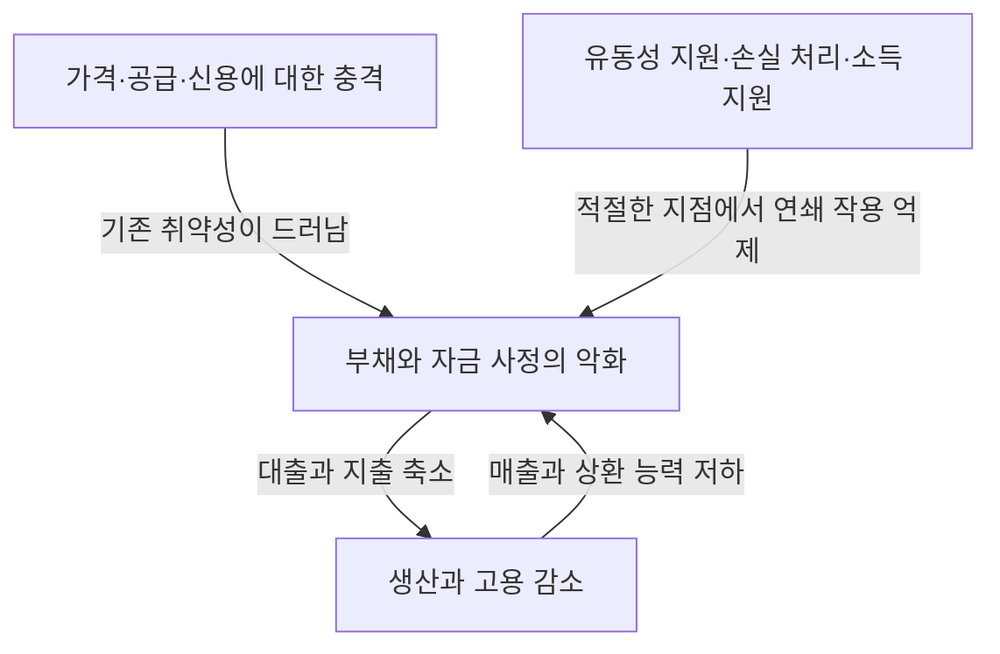
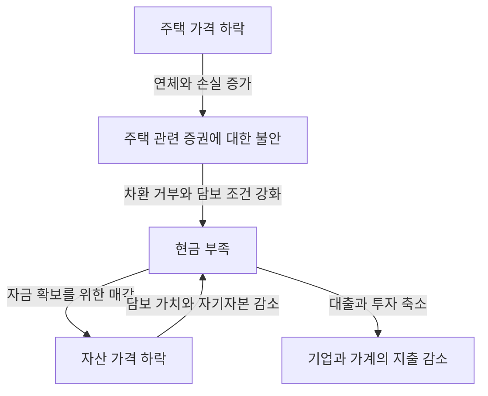

리먼 사태라는 말을 들으면 은행의 파산, 주가 폭락, 실업자 증가가 하나의 사건으로 떠오를지도 모릅니다. 그런데 한 회사의 파산이 왜 전 세계 공장의 감산과 가계 소득 감소로 이어졌을까요? 같은 주가 폭락인데도 1987년 블랙먼데이는 왜 1930년대 대공황과 같은 결과를 낳지 않았을까요?

경제 충격을 이해하려면 사건의 이름과 연도를 외우는 것만으로는 부족합니다. 무엇이 처음으로 변했는가, 그 전에 어떤 취약성이 쌓여 있었는가, 손실과 불안은 누구에게서 누구에게로 전달되었는가를 살펴야 합니다. 이 세 가지를 구분하면 복잡해 보이는 역사를 인과관계로 따라갈 수 있습니다.

이 글은 1929년부터 2023년까지 대표적인 사건 16가지를 다룹니다. 모든 국가와 지역의 위기를 망라하는 연표가 아니라 서로 다른 작동 원리를 비교하기 위해 고른 사례들입니다. 여기서 ‘경제 충격’은 금융위기뿐 아니라 에너지 공급의 급변, 감염병, 통화제도의 변화 등을 포함하는 넓은 의미로 사용합니다. 위기의 원인을 둘러싸고 학술적 논쟁이 있다면 하나의 설명만을 유일한 정답으로 취급하지 않습니다.

## 먼저 알아둘 충격과 위기의 차이

충격이란 경제의 전제를 갑자기 바꾸는 사건입니다. 원유 공급이 끊기거나, 주택 가격이 하락하거나, 외국 투자자가 자금을 회수하는 변화가 이에 해당합니다. 반면 위기는 기존 제도와 자금 운용으로 그 변화를 흡수하지 못해 경제활동의 기반까지 제대로 작동하지 않는 상태입니다.

태풍 자체와 제방의 취약성, 침수의 확산을 구별하는 것과 비슷합니다. 다만 경제에서는 제방에 해당하는 행동도 사람들의 판단에 따라 변합니다. 은행이 안전을 위해 대출을 줄이면 기업이 쓰러지고 은행의 손실이 늘어날 수 있습니다. 각자에게 합리적인 방어가 전체적으로는 위기를 증폭하는 것입니다.

수요 충격에서는 구매하고 투자하려는 지출이 줄어듭니다. 공급 충격에서는 원자재나 노동력이 부족해 생산 가능한 양이 줄거나 비용이 오릅니다. 금융 충격에서는 자금을 중개하고 지급을 이어주는 기능이 손상됩니다. 실제 위기에서는 이러한 충격이 겹치고 진행 중에 성격이 바뀌기도 합니다.

그림의 화살표가 언제나 같은 강도로 작용하는 것은 아닙니다. 충분한 자기자본, 안정적인 자금 조달, 신뢰받는 제도가 있으면 손실이 발생해도 연쇄 작용을 줄일 수 있습니다. 반대로 평상시에는 효율적으로 보이던 구조가 극단적인 상황에서는 동시에 취약성이 되기도 합니다.

## 전체 흐름을 파악하기 위한 비교표

| 시기 | 사건 | 중심적인 취약성·전파 구조 |
| --- | --- | --- |
| 1929년~1930년대 | 대공황 | 은행 공황, 신용 수축, 디플레이션, 금본위제의 제약 |
| 1971년 | 닉슨 쇼크 | 달러와 금의 교환 약속에 대한 신뢰 저하, 통화제도 전환 |
| 1973~1974년 | 제1차 석유 파동 | 석유 공급과 가격의 급변, 수입국의 소득 유출 |
| 1978~1982년 무렵 | 제2차 석유 파동과 통화 긴축 | 공급 불안, 인플레이션 기대, 고금리에 대한 조정 |
| 1982년 이후 | 중남미 외채 위기 | 외화 표시 부채, 변동금리, 외화 수입 부족 |
| 1987년 | 블랙먼데이 | 같은 방향의 매매, 시장 유동성과 결제 문제 |
| 1990년대 | 일본의 버블 붕괴 | 담보 가격 하락, 부실채권, 장기화된 부채 상환 |
| 1994~1995년 | 멕시코 외환위기 | 자금 유입의 반전, 단기 부채, 달러 연동 상환 부담 |
| 1997~1998년 | 아시아 외환위기 | 통화·만기 불일치, 자본 유출과 은행 위기 |
| 1998년 | 러시아 위기와 LTCM 위기 | 정부 부채 불안, 안전자산 선호 매매, 레버리지 |
| 2000~2002년 무렵 | IT 버블 붕괴 | 이익 기대의 수정, 주식 조달과 설비투자 축소 |
| 2007~2009년 | 세계 금융위기·리먼 사태 | 주택 신용, 증권화, 단기 자금 조달 시장의 뱅크런 |
| 2010년대 전반 | 유럽 부채 위기 | 은행과 정부 신용의 연쇄 작용, 통화동맹의 제도적 취약성 |
| 2020년 | 코로나 충격 | 감염과 행동 변화로 수요·공급이 동시에 중단 |
| 2021~2022년 이후 | 인플레이션·에너지 충격 | 수요 회복, 공급 제약, 전쟁에 따른 자원시장 혼란 |
| 2023년 | 미국 은행 불안 | 금리 위험, 예금 집중, 급격한 자금 유출 |

시기는 위기의 특징이 잘 드러나는 기간을 나타내며 세계 공통의 경기후퇴 기간을 뜻하지 않습니다. 예를 들어 미국의 경기후퇴 시작, 일본의 경기 저점, 주가의 바닥은 일치하지 않습니다. ‘위기가 끝났다’는 표현도 금융시장 안정, 고용 회복, 부채 처리 완료 중 무엇을 가리키느냐에 따라 의미가 달라집니다.

## 1929년 주가 폭락과 대공황: 주식 손실이 전부는 아니다

1929년 가을 미국의 주가 폭락은 대공황을 상징합니다. 하지만 주가 하락만으로 이후의 심각하고 오랜 불황을 설명할 수는 없습니다. 미국에서는 주가 폭락에 앞서 경기가 후퇴하기 시작했고, 뒤이은 은행 공황이 신용과 지출을 더욱 훼손했습니다.

은행은 예금을 단기간에 돌려주겠다고 약속하면서 기업과 가계에는 장기간 대출합니다. 많은 예금자가 동시에 현금을 요구하면 자산이 모두 무가치하지 않더라도 즉시 지급하지 못할 수 있습니다. 당시 미국에는 오늘날과 같은 연방 예금보험제도가 아직 없었습니다.

은행 파산과 예금 유출이 확산되면 기업은 운전자금을 빌리기 어려워집니다. 임금 지급, 원자재 구입, 재고 유지가 어려워져 고용과 생산이 줄어듭니다. 실업과 소득 감소가 소비를 줄이고 기업의 상환 능력을 더욱 약화했습니다. 이 과정은 주식을 보유하지 않은 가계에도 손실을 줍니다.

물가 하락도 반드시 도움이 되는 것은 아닙니다. 부채 금액이 명목상 고정되어 있으면 매출과 임금이 내려갈수록 상환 부담이 커집니다. 연소득 500만 엔에 부채 500만 엔인 상태와, 연소득이 350만 엔으로 줄었는데 부채는 500만 엔 그대로인 상태의 부담은 다릅니다. 이해를 돕는 가상의 예지만 디플레이션과 부채가 서로를 악화시키는 구조를 보여줍니다.

더욱이 금본위제에서는 통화와 금의 교환에 대한 신뢰를 지키려는 목표가 국내 통화 완화와 충돌했습니다. 금 유출을 막으려는 긴축이 불황 속 자금 부족을 심화하기도 했습니다. 보호무역주의와 국제 채무 관계의 악화도 더해졌습니다. [연방준비제도의 역사 자료](https://www.federalreservehistory.org/essays/banking-panics-1931-33)는 금 유출과 예금 인출이 동시에 은행을 압박한 경로를 설명합니다.

대공황의 교훈은 주가를 지지하면 모든 문제가 해결된다는 것이 아닙니다. 결제, 신용 중개, 예금에 대한 신뢰가 무너지면 금융자산의 손실이 생산 능력의 장기적 훼손으로 바뀐다는 것입니다. 금융당국의 대응과 금본위제의 역할에 부여하는 비중은 연구마다 다르지만, 하루의 폭락만을 원인으로 삼는 설명은 지나치게 단순합니다.

## 1971년 닉슨 쇼크: 교환 약속을 지속할 수 없게 되다

전후 브레턴우즈 체제에서는 많은 통화가 달러와 고정적인 환율 관계를 맺었고, 미국은 외국 통화당국이 보유한 달러를 일정한 조건으로 금과 교환하는 제도를 뒷받침했습니다. 일상의 모든 달러 지폐를 누구나 자유롭게 금으로 바꿀 수 있는 제도는 아니었습니다.

무역과 국제금융이 확대되려면 전 세계에서 사용할 수 있는 달러가 필요합니다. 그러나 해외의 달러 보유가 늘수록 미국의 금 보유량에 비추어 교환 약속에 의문이 생깁니다. 교환에 대한 불안이 커지면 먼저 금으로 바꾸려는 행동이 늘어나 제도를 더욱 불안정하게 만듭니다.

1971년 8월 닉슨 대통령은 달러의 금 태환 정지 등을 발표했습니다. 이후 환율 조정을 통해 제도를 유지하려는 시도를 거쳐 주요 통화는 1973년 변동환율제로 이행했습니다. 따라서 ‘1971년 어느 날 세계의 고정환율제가 일제히 끝났다’고 이해하면 그 과정을 놓치게 됩니다. [Federal Reserve History의 해설](https://www.federalreservehistory.org/essays/gold-convertibility-ends)에서 정책 목적과 제도 전환 과정을 확인할 수 있습니다.

일본 기업에는 환율이 사업계획의 주요 변동 요인이 되는 전환점이었습니다. 같은 달러 표시 수출 대금이라도 엔화 가치가 오르면 엔화로 환산한 매출은 줄어듭니다. 반면 수입 비용은 낮아질 수 있으므로 수출기업과 수입기업이 받는 영향은 같지 않습니다.

이는 주로 통화제도와 정책의 충격입니다. 은행이 잇달아 파산하는 위기와 같은 분류에 억지로 넣어서는 안 됩니다. 교환비율을 고정하면 거래가 안정되지만 그 약속을 유지할 조건이 사라지면 큰 조정이 발생할 수 있음을 보여줍니다.

## 1973~1974년 제1차 석유 파동: 생산 비용이 급등하다

1973년 제4차 중동전쟁을 배경으로 아랍 산유국이 공급을 제한하고 미국 등에 금수 조치를 취하면서 원유 가격이 급등했습니다. 금수를 시행한 아랍 산유국 기구 OAPEC와 더 광범위한 산유국 기구 OPEC를 동일시하지 않는 것이 중요합니다. 공급 조치, 산유국의 가격 정책, 이미 강했던 세계 수요가 겹쳤습니다. [제1차 석유 파동의 역사 자료](https://www.federalreservehistory.org/essays/oil-shock-of-1973-74)는 이 배경을 정리합니다.

원유는 자동차 연료만이 아닙니다. 물류, 발전, 화학제품 등 광범위한 분야의 투입물입니다. 단기간에 다른 연료나 설비로 바꾸기 어려워 공급량이 조금 부족해도 가격이 크게 움직일 수 있습니다. 수요와 공급이 가격에 민감하게 반응하지 않는 시장에서는 가격이 조정의 대부분을 떠맡기 때문입니다.

수입국은 같은 양의 원유를 얻기 위해 이전보다 많은 소득을 해외에 지급해야 합니다. 기업이 비용을 가격에 전가하면 가계 구매력이 낮아지고, 전가하지 못하면 이익이 줄어듭니다. 어느 경로든 소비와 투자의 여력을 해칩니다.

이 경우 물가 상승과 경기 악화가 동시에 일어날 수 있습니다. 이것이 스태그플레이션입니다. 수요가 약하다는 이유로 지출을 크게 자극해도 원유나 생산설비가 바로 늘어나지는 않습니다. 반대로 물가만 보고 강하게 긴축하면 고용에 대한 타격이 커집니다.

일본의 혼란도 석유만으로 전부 설명할 수는 없습니다. 당시의 수요와 금융 여건, 물가 상승 기대가 영향을 미쳤습니다. 이후 에너지 절약과 산업구조 변화는 같은 수입 가격 충격에 대한 내성을 바꿨습니다. 공급 충격의 크기는 자원 가격뿐 아니라 그 자원에 얼마나 의존하는지에 따라 결정됩니다.

## 제2차 석유 파동과 고금리 전환: 물가를 억제하는 과정에도 고통이 있다

1978~1979년 이란 혁명에 따른 생산 혼란은 다시 석유시장을 흔들었습니다. 그러나 가격 상승을 사라진 생산량에만 비례시켜 설명할 수는 없습니다. 앞으로 공급이 더 줄 것이라는 불안이 재고를 늘리려는 수요를 만들었습니다. 미래에 대한 경계가 현재 수요를 늘릴 수 있습니다. [제2차 석유 파동 해설](https://www.federalreservehistory.org/essays/oil-shock-of-1978-79)은 공급 감소와 예비적 수요를 모두 다룹니다.

이미 인플레이션이 이어지는 경제에서는 기업과 노동자가 다음 가격 상승을 예상해 가격과 임금을 결정합니다. 이것은 언제나 임금만 물가를 끌어올린다는 뜻이 아닙니다. 자원 비용, 수요, 통화정책에 대한 신뢰, 계약 구조가 물가 상승의 지속성을 좌우합니다.

미국에서는 1979년 연준 의장이 된 폴 볼커 아래에서 인플레이션 억제를 중시하는 통화 긴축이 추진되었습니다. 금리 상승은 주택 구입과 설비투자를 억제해 경기와 고용에 큰 부담을 줍니다. 1980년 전후부터 1980년대 초의 불황에는 유가 상승뿐 아니라 이러한 정책 전환에 대한 조정도 포함됩니다.

통화 긴축은 원유를 채굴하는 정책이 아닙니다. 지출과 신용을 억제하고 물가 상승이 장기간 지속될 것이라는 예상을 바꾸려는 정책입니다. 공급 제약 자체를 없앨 수 없으므로 인플레이션을 낮추는 과정에서 실물경제의 비용이 발생합니다. [대인플레이션 시대의 역사](https://www.federalreservehistory.org/essays/great-inflation)를 보면 정책 판단과 물가의 관계가 드러납니다.

더구나 미국의 금리 상승은 미국 안에서 끝나지 않습니다. 달러로 빚을 진 해외 국가와 기업에는 상환 조건 악화로 전달되었습니다. 이 연결고리가 다음 중남미 외채 위기를 이해하는 열쇠입니다.

## 1982년 이후 중남미 외채 위기: 부채의 통화와 금리가 짐이 되다

1970년대에는 산유국이 벌어들인 자금 등을 배경으로 국제은행을 통한 대출이 확대되었습니다. 중남미 국가들도 많은 외화자금을 빌렸습니다. 하지만 돈을 빌릴 수 있다는 것과 미래의 외화 수입으로 갚을 수 있다는 것은 같지 않습니다.

달러 표시 부채는 자국 통화를 발행하는 것만으로 상환할 수 없습니다. 수출, 해외 자금 유입, 보유 외환 등을 통해 달러를 확보해야 합니다. 변동금리 계약이라면 국제금리가 오를 때 이자 지급도 늘어납니다. 반면 세계경기가 약해지면 수출과 자원 수입은 늘기 어렵습니다.

1982년 8월 멕시코의 채무 상환 어려움으로 위기가 표면화되었고, 이후 많은 국가가 채무 재조정을 해야 했습니다. 국제은행도 큰 대출 잔액을 보유하고 있었기에 문제는 차입국에서 끝나지 않았습니다. [중남미 외채 위기 자료](https://www.federalreservehistory.org/essays/latin-american-debt-crisis)는 대출자 측을 포함한 경위를 설명합니다.

신규 대출이 중단되면 차환으로 유지하던 지급을 이어갈 수 없게 됩니다. 수입을 줄여 외화를 확보하려 해도 생산에 필요한 기계와 부품까지 줄이면 미래 소득을 만들어내는 힘도 손상됩니다. 재정 조정, 통화 가치 하락, 은행 문제가 겹쳐 오랜 침체로 이어진 국가도 있었습니다.

교훈은 단순히 ‘빚은 나쁘다’가 아닙니다. 부채가 어떤 통화로, 어떤 금리로, 언제 상환되며, 어떤 소득으로 뒷받침되는지가 중요합니다. 장기 투자가 사회적으로 유용하더라도 상환 시기와 외화 수입의 조합이 나쁘면 중간에 자금이 바닥날 수 있습니다.

## 1987년 블랙먼데이: 팔 수 있으리라 믿었던 시장이 얇아지다

1987년 10월 19일 미국 다우지수는 하루에 22.6% 하락했습니다. 하지만 이 폭락이 미국에서 즉시 대공황형 은행 위기나 경기후퇴로 발전하지는 않았습니다. 가격 급락과 금융 기능 전체의 붕괴를 구별하는 데 중요한 사례입니다.

원인은 하나의 뉴스가 아니었습니다. 높아진 주가에 대한 우려, 금리와 환율에 대한 불안, 시장구조가 겹쳤습니다. 하락할 때 선물 등을 팔아 손실을 억제하려는 ‘포트폴리오 인슈어런스’도 매도를 증폭한 요인으로 지적됩니다. 이름에 보험이 들어가더라도 누군가가 무조건 손실을 보전하는 구조는 아닙니다.

한 투자자가 매도해 위험을 줄이려면 매수할 상대가 필요합니다. 많은 참여자가 같은 가격 변화에 반응해 동시에 팔면 기존 가격에서는 매수 주문이 부족해집니다. 그러면 가격이 더 내려가고 다음 매도가 나오는 순환이 발생합니다.

여기에 현물 주식, 선물, 옵션의 거래·결제 차이가 자금 수요를 복잡하게 했습니다. 장부상 상계할 수 있는 거래라도 지급일이 다르면 그 사이에 현금이 필요합니다. [Federal Reserve History](https://www.federalreservehistory.org/essays/stock-market-crash-of-1987)는 이러한 시장구조와 유동성 지원을 다룹니다.

중앙은행의 유동성 공급 의지와 금융기관의 대출 지속은 연쇄 작용을 억제하는 데 기여했습니다. 이 사례는 주가 하락률만으로 위기의 깊이를 측정할 수 없음을 보여줍니다. 누가 손실을 지고, 얼마나 많은 부채를 보유하며, 결제와 대출을 어느 정도 담당하는지에 따라 같은 가격 변화의 의미가 달라집니다.

## 일본의 버블 붕괴: 토지·은행·기업의 대차대조표가 연결되어 있었다

1980년대 후반 일본에서는 주가와 땅값이 크게 올랐습니다. 통화 완화, 금융 자유화 속 은행의 행동, 토지 담보 대출, 가격 상승 기대 등이 겹쳤습니다. ‘플라자 합의만’ 또는 ‘저금리만’으로 설명하기보다는 신용과 자산 가격의 상호작용을 봐야 합니다.

땅값이 오르면 같은 토지를 담보로 빌릴 수 있는 금액이 늘어납니다. 그 자금이 부동산 취득에 사용되면 가격이 더 오릅니다. 미래 수익보다 담보를 더 비싸게 팔 수 있다는 기대에 의존한 대출이 늘면 가격 상승 자체가 차입을 뒷받침하게 됩니다.

통화 긴축과 부동산 대출 규제 등을 거쳐 1990년대에 자산 가격이 하락하자 이 구조가 역으로 작동했습니다. 기업에는 취득 당시의 빚이 남았지만 담보와 보유자산 가치는 내려갔습니다. 은행에는 상환받기 어려운 대출, 즉 부실채권이 쌓였습니다. [일본은행의 버블 연구](https://www.imes.boj.or.jp/research/abstracts/english/me14-1-6.html)는 신용과 토지·주가의 관계를 검토합니다.

은행이 손실로 자기자본을 잃으면 신규 대출이 어려워집니다. 동시에 기업도 금리가 내려가더라도 신규 투자보다 채무 상환을 우선합니다. 대출자와 차입자가 양쪽에서 지출을 줄이므로 금리 인하만으로 투자가 예전처럼 회복되지는 않을 수 있습니다.

문제 인식과 손실 처리가 늦어지면 경영이 취약한 기업에 대한 대출 지속과 유망 기업에 대한 자금 공급 부족이 공존할 수 있습니다. 1997~1998년 금융 불안은 자산 가격 하락 이후에도 은행 시스템의 취약성이 남았음을 보여주었습니다. 일본은행은 [1990년대 이후 디플레이션과 대차대조표 조정](https://www.boj.or.jp/en/about/press/koen_2024/ko240527b.htm)을 장기 침체의 중요한 배경으로 논의합니다.

다만 이후 일본 경제의 모든 문제를 버블 붕괴로만 환원할 수는 없습니다. 인구구조, 생산성, 국제경쟁, 정책도 관련됩니다. 핵심은 자산 가격 하락이 대차대조표에 남으면 주가가 잠시 반등해도 기업과 은행의 행동이 곧바로 예전으로 돌아가지 않는다는 점입니다.

## 1994~1995년 멕시코 외환위기: 차환이 멈추면 통화 방어가 어려워진다

1994년 멕시코에서는 정치 불안과 미국의 금리 상승 등을 배경으로 해외자금 유입이 불안정해졌습니다. 경상수지 적자가 있는 국가는 그 부족분을 자금 유입 등으로 충당해야 합니다. 적자가 항상 위기를 뜻하지는 않지만 유입이 갑자기 멈추면 조정이 어려워집니다.

환율을 지지하려고 외환보유액을 사용하더라도 보유액에는 한계가 있습니다. 정부가 발행을 늘린 테소보노스는 상환액이 달러에 연동되는 단기 부채였습니다. 투자자의 페소 가치 하락 불안을 덜어주려는 장치가 정부의 환위험과 차환 위험을 늘린 측면이 있습니다.

1994년 12월 환율정책 변경은 신뢰를 충분히 회복하지 못했고 페소 가치는 크게 하락했습니다. 달러 연동 부채의 자국 통화 환산 부담이 늘면서 투자자가 차환에 응할지가 절박한 문제가 되었습니다. [IMF의 당시 검토](https://www.imf.org/en/news/articles/2015/09/28/04/53/spmds9508)는 단기 자금과 부채 구성의 취약성을 지적합니다.

통화 가치 하락은 수출에 유리할 수 있지만 동시에 외화 연동 부채를 무겁게 만듭니다. ‘통화 가치를 낮추면 경쟁력이 회복되어 해결된다’는 설명이 부족한 이유는 대차대조표에 대한 이 타격 때문입니다. 기업과 은행의 상태가 악화하면 수출을 늘릴 자금조차 구하기 어려워집니다.

이 위기는 정부 부채 총액뿐 아니라 몇 달 안에 얼마나 갚아야 하는지를 살피는 중요성을 보여줍니다. 같은 부채 금액이라도 상환이 장기간 분산된 경우와 단기간에 집중된 경우는 신뢰 저하에 대한 내성이 다릅니다.

## 1997~1998년 아시아 외환위기: 민간 외화부채가 경제 전체를 흔들다

1997년 7월 태국이 바트 환율 유지를 포기한 것을 계기로 위기는 인도네시아와 한국 등으로 확산되었습니다. 그러나 각국의 제도와 취약성이 같지는 않았습니다. 또한 모든 것을 정부의 방만한 재정 탓으로 돌리면 민간기업과 은행의 차입을 놓치게 됩니다.

많은 거래는 달러 등으로 단기 차입해 국내의 장기 부동산 개발과 사업에 투자하는 방식이었습니다. 상환 통화와 수입 통화가 다른 것이 통화 불일치이고, 상환 시점과 자금 회수 시점이 다른 것이 만기 불일치입니다. 환율이 안정되고 차환이 가능할 때는 취약성이 잘 드러나지 않는 조합입니다.

그러나 투자자가 회수를 서두르면 외화 수요가 늘고 통화 가치가 하락합니다. 통화 하락은 외화부채 부담을 늘려 기업에 대한 불안을 키웁니다. 불안이 추가 자금 유출을 부르므로 환율과 상환 능력이 서로를 악화시킵니다. [IMF의 금융부문 검토](https://www.imf.org/external/pubs/ft/op/opfinsec/index.htm)는 은행·기업의 취약성과 통화제도의 관계를 정리합니다.

예를 들어 1달러가 자국 통화 100단위일 때 100만 달러를 빌린 기업의 원금은 1억 단위에 해당합니다. 환율이 1달러당 150단위로 오르면 같은 달러 원금이 1억 5,000만 단위가 됩니다. 매출이 자국 통화로 그대로라면 추가 차입이 없어도 상환 부담이 불어납니다. 수출 수입이나 환헤지가 있으면 영향이 달라지므로 이는 방어 수단이 없는 경우의 가상 예입니다.

통화를 지키기 위한 고금리는 자금 유출을 억제할 수 있지만 국내 차입자를 괴롭힙니다. 반대로 통화 하락을 용인하면 외화부채가 악화합니다. 위기 대응은 이 어려운 조합 속에서 이루어졌으며 IMF 지원 조건과 재정·통화정책의 적절성을 둘러싼 논쟁도 계속되고 있습니다.

국경을 넘는 파급은 이웃 나라라는 이유로 자동 발생하지 않습니다. 같은 은행에서 차입하거나 수출시장이 겹치거나 투자자가 비슷한 경제로 보는 등의 경로가 있습니다. 공통 대출자가 손실을 보면 문제가 작은 국가에서도 자금을 회수할 수 있습니다.

## 1998년 러시아 위기와 LTCM: 분산된 거래도 동시에 손실을 낼 수 있다

1998년 러시아에서는 재정·징세 기반의 취약성, 자원 가격 부진, 자금 조달 불안이 겹쳤고 8월 루블 평가절하와 국내 국채의 채무 재조정 등이 발표되었습니다. 정부 부채는 언제나 안전하다는 인식이 흔들리면서 투자자들은 전 세계적으로 안전성과 현금화 용이성을 중시하게 되었습니다.

그 혼란 속에서 심각한 손실을 입은 곳이 헤지펀드 롱텀캐피털매니지먼트, LTCM입니다. 이 펀드의 전략을 단순히 러시아 국채 투자로 이해하면 문제의 범위를 놓칩니다. 비슷한 금융상품의 가격 차이가 줄어들 것으로 예상하는 거래 등을 높은 레버리지로 실행했다는 점이 중요합니다.

평소에는 작은 가격 차이도 큰 금액을 거래하면 이익이 됩니다. 하지만 위기 때 참여자가 현금화하기 쉬운 자산에 몰리면 가격 차이는 줄기는커녕 벌어집니다. 언젠가 가격 차이가 되돌아올 것이라는 전망이 맞더라도 그 전에 추가 담보를 요구받으면 계속 기다릴 수 없습니다.

서로 다른 시장에 분산했어도 모든 거래가 ‘시장 유동성이 유지된다’는 같은 전제에 의존한다면 실질적인 분산 효과는 약합니다. 위기 때 상관관계가 높아진다는 것은 단지 수학적 수치가 변한다는 뜻을 넘어 많은 사람이 같은 이유로 동시에 매도한다는 의미이기도 합니다.

뉴욕 연방준비은행은 관련 금융기관의 협의를 중재했고 민간 금융기관이 자본을 투입했습니다. 연은이 LTCM에 공적 자금을 직접 투입한 구제와 혼동해서는 안 됩니다. [당시 뉴욕 연은 총재의 증언](https://www.newyorkfed.org/newsevents/speeches/1998/mcd981001.html)은 이러한 역할 분담을 설명합니다. 모형이 예측하는 장기 가치와 내일의 지급에 필요한 현금은 별개의 문제입니다.

## IT 버블 붕괴: 기술이 진짜여도 주가가 옳다는 뜻은 아니다

1990년대 후반에는 인터넷이 산업을 바꿀 것이라는 기대 아래 IT와 통신기업으로 자금이 몰렸습니다. 그 기술적 변화는 실제로 거대했습니다. 하지만 사회에 유용한 기술이 보급되는 것과 모든 기업이 높은 이익을 얻는 것은 같지 않습니다.

기업가치는 미래에 얼마나 많은 이익과 현금을 만들며 그것을 현재가치로 얼마나 할인하는지에 달려 있습니다. 시장 규모만 주목하고 고객 획득 비용, 경쟁, 현금 소진, 추가 투자를 가볍게 보면 기대 성장률이 조금만 내려가도 평가가 크게 바뀝니다.

2000년 이후 과도한 이익 기대가 수정되자 주식 발행을 통한 자금 조달이 어려워졌고 기업은 인력과 설비투자를 줄였습니다. 통신설비 등의 과잉투자도 조정되었습니다. 주가 하락이 가계 자산을 줄이는 경로뿐 아니라 사업을 지속할 자금이 줄어드는 경로도 작동했습니다. [연준의 2001년 연차보고서](https://www.federalreserve.gov/boarddocs/rptcongress/annual01/ar01.pdf)는 당시 투자와 금융의 변화를 기록합니다.

미국의 2001년 경기후퇴가 그해 9월 동시다발 테러만으로 시작되었다고 보는 것도 부정확합니다. 경기는 그 이전부터 약해졌고 테러는 여행 등의 수요와 불확실성에 추가 타격을 주었습니다. 겹친 충격은 순서를 나누어 읽어야 합니다.

주택금융이 중심이었던 2008년 위기와 비교하면 주식투자자가 부담하는 손실의 비중이 컸고 은행과 단기 자금시장을 통한 증폭 구조도 달랐습니다. 주식은 가격이 내려가도 회사가 같은 금액을 갚기로 한 계약이 아니지만 부채는 상환 의무가 남습니다. 이 자금 조달 방식의 차이가 기술에 대한 실망을 얼마나 깊은 금융위기로 바꿀지 좌우합니다.

## 리먼 사태: 주택담보대출 손실이 단기 금융시장을 멈추다

### 위기는 2008년 9월 갑자기 시작되지 않았다

일본에서 리먼 쇼크라 부르는 사건은 미국 투자은행 리먼브러더스의 2008년 9월 15일 파산으로 상징됩니다. 그러나 미국 주택시장과 관련 금융상품의 문제는 그 이전부터 진행되고 있었습니다. 2007년에는 단기 금융시장의 긴장이 드러났고 2008년 봄에는 베어스턴스 위기도 발생했습니다.

주택 가격 상승은 차입자와 대출자 모두에게 안도감을 주었습니다. 상환이 어려워져도 집을 팔거나 차환할 수 있다는 기대가 대출을 뒷받침했습니다. 하지만 가격이 내려가면 매각해도 빚을 다 갚지 못하는 사례가 늘고 차환의 전제도 무너집니다. [서브프라임 주택담보대출 위기 해설](https://www.federalreservehistory.org/essays/subprime-mortgage-crisis)은 신용 확대와 주택 가격의 상호작용을 설명합니다.

‘상환 능력이 낮은 사람이 빌렸기 때문’이라는 설명만으로는 부족합니다. 대출 심사, 증권화의 보상체계, 투자자의 평가, 금융기관의 자기자본과 조달 방식까지 봐야 국지적인 대손이 세계적 위기가 된 이유를 설명할 수 있습니다.

### 증권화는 위험을 없애는 장치가 아니다

주택담보대출을 묶고 상환에서 발생하는 수입을 투자자에게 배분하는 것이 증권화의 기본입니다. 지급 우선순위를 나누면 먼저 손실을 지는 부분과 나중에 손실을 지는 부분을 만들 수 있습니다. 그러나 전체에 존재하는 손실이 사라지는 것은 아닙니다.

여러 지역의 대출을 섞으면 지역 고유의 위험은 분산할 수 있습니다. 반면 넓은 지역에서 주택 가격이 함께 내려가고 실업과 차환 어려움이 공통으로 발생하면 대손의 동조성이 강해집니다. 신용등급이 높은 부분도 기본 가정이 무너지면 손실을 볼 수 있습니다.

상품이 복잡해질수록 누가 최종적으로 어떤 손실을 보유하는지 파악하기 어려워집니다. 자신의 손실이 작더라도 거래 상대의 상태를 모르면 자금 대여를 꺼릴 이유가 됩니다. 문제는 손실 규모뿐 아니라 손실의 소재에 대한 불확실성이었습니다.

### 단기 조달이 멈추면 자산 매각을 강요받는다

투자은행 등은 장기간에 걸쳐 회수하는 자산을 레포 거래와 단기 증권 등으로 조달한 자금으로 보유했습니다. 레포는 증권을 담보로 하는 단기 조달에 가까운 성격의 거래입니다. 매번 차환할 수 있으면 작동하지만 대출자가 갱신을 거부하면 즉시 현금이 필요합니다.

담보 가치 100에 대해 95까지 빌리던 것이 경계심 증가로 80까지만 빌릴 수 있게 되면 차액 15를 따로 마련해야 합니다. 이는 구조를 보여주는 가상 예입니다. 담보 자체의 가격 하락도 동시에 일어나면 필요한 현금은 더 늘어납니다.

현금을 마련하려고 자산을 팔면 그 매도가 시장가격을 낮춥니다. 다른 금융기관도 보유자산 가치 하락과 추가 담보 요구를 받아 매각을 강요받습니다. 은행 창구 앞에 예금자가 줄을 서는 형태와는 달라도 단기 자금 제공자가 일제히 철수한다는 점에서 ‘뱅크런’과 비슷한 구조입니다.

### 금융가의 문제가 공장과 가계에 도달하다

리먼 파산 후 거래 상대에 대한 불신과 단기시장 혼란이 급격히 심해졌습니다. AIG 지원, 금융기관 자본 확충, 중앙은행의 유동성 공급 등 다양한 대응이 필요했습니다. [세계 금융위기 개요](https://www.federalreservehistory.org/essays/great-recession-and-its-aftermath)는 주택시장에서 금융부문과 실물경제로 이어지는 경로를 정리합니다.

은행이 대출을 줄이면 기업은 설비투자뿐 아니라 일상 지급에 쓸 자금도 확보하기 어려워집니다. 가계는 주택과 주식 가치 하락에 더해 고용 불안 때문에 내구소비재 구매를 미룹니다. 그 결과 금융상품을 직접 보유하지 않은 수출기업에도 주문 감소가 전달됩니다. 일본에 대한 큰 타격에는 세계 수요와 무역의 수축도 관련되었습니다.

저금리, 국제 자금 흐름, 규제·감독, 보상체계 등 각 요인에 얼마나 비중을 둘지는 논쟁이 있습니다. 하지만 주택담보대출 손실, 높은 레버리지, 단기 조달, 위험의 불투명성이 결합했다는 점은 위기 이해에 빠뜨릴 수 없습니다. 리먼 파산은 중요한 증폭 지점이었으며 쌓여 있던 문제를 모두 한 회사가 만든 것은 아닙니다.

## 유럽 부채 위기: 정부와 은행이 서로를 약화시키다

2009년 말부터 2010년에 걸쳐 그리스 재정에 대한 우려가 커졌고 이후 유로존 여러 나라로 신용 불안이 퍼졌습니다. 다만 그리스의 재정 문제를 그대로 모든 나라에 적용할 수는 없습니다. 아일랜드와 스페인에서는 부동산과 은행 문제가 특히 중요했습니다.

정부 신용이 하락해 국채 가격이 내려가면 그 국채를 보유한 은행이 타격을 받습니다. 은행을 지원하기 위해 정부 부담이 늘면 이번에는 정부 재정에 대한 우려가 커집니다. 은행과 정부가 서로의 신용을 지탱하던 관계가 서로를 약화시키는 관계로 바뀝니다.

유로존 회원국은 공통 통화를 사용하므로 개별 국가가 독자적으로 통화를 평가절하하거나 자체 정책금리를 정할 수 없습니다. 한편 위기 초기에는 은행 감독·정리와 재정 위험 분담 제도가 충분히 통합되지 않았습니다. 통화 통합에 비해 위기를 처리하는 제도 통합이 뒤처진 측면이 있었습니다.

차환 금리가 높아지면 이자 부담이 늘어 부채 지속가능성이 더 나빠집니다. 불안에서 비롯된 고금리가 그 불안을 현실에 가깝게 만들 수 있습니다. 다만 모든 것이 근거 없는 시장심리는 아니었으며 각국의 부채, 생산성, 은행 취약성이 중요했습니다. [ECB의 위기 검토](https://www.ecb.europa.eu/press/key/date/2018/html/ecb.sp180511.en.html)는 국가별 차이와 제도적 교훈을 설명합니다.

재정 긴축은 부채에 대한 신뢰를 회복하려는 목적이 있지만 불황에 지출을 급히 줄이면 소득과 세수도 줄어듭니다. 반대로 지원에는 누가 손실을 부담하며 미래의 과도한 차입을 어떻게 막을지라는 문제가 있습니다. ECB의 대응, 금융지원 장치, 은행동맹 노력은 이러한 악순환을 끊기 위해 추진되었습니다.

## 2020년 코로나 충격: 먼저 멈춘 것은 금융상품이 아니라 활동이었다

코로나19 확산은 사람의 이동, 대면 서비스, 직장과 공장의 가동을 한꺼번에 제한했습니다. 행정적 제한뿐 아니라 감염을 피하려는 자발적인 행동 변화와 결근도 경제활동을 줄였습니다. 일반적인 은행 위기와는 출발 원인이 다릅니다.

공급 측에서는 사람이 일하지 못하고 부품이 도착하지 않으며 물류가 막혔습니다. 수요 측에서는 여행, 외식, 오락 지출이 줄고 소득과 미래에 대한 불안으로 구매가 미뤄졌습니다. 서비스에서 재화로의 수요 이동도 있었기에 모든 산업의 수요가 같은 방향으로 움직인 것은 아닙니다. [IMF의 초기 분석](https://www.imf.org/en/Blogs/Articles/2020/03/09/blog030920-limiting-the-economic-fallout-of-the-coronavirus-with-large-targeted-policies)은 수요와 공급 양면을 구별합니다.

매출이 갑자기 멈춰도 임대료와 차입금 상환은 계속됩니다. 본래 존속 가능한 기업도 보유 현금이 바닥나면 파산합니다. 그렇게 되면 일시적인 활동 중단이 고용관계와 거래망을 잃는 장기 손상으로 바뀝니다. 정책은 기업과 가계가 중단 기간을 건너갈 수 있도록 이어주는 역할을 요구받았습니다.

금리를 낮춰도 감염 위험이나 부품 부족을 직접 없앨 수는 없습니다. 의료·공중보건 대책과 소득 지원, 고용 유지, 자금 지원을 결합해야 합니다. 금융시장에서도 현금 수요가 급증했으므로 실물경제 충격이 금융 기능 장애로 바뀌지 않도록 하는 대응이 중요했습니다.

회복도 일률적이지 않습니다. 수요가 돌아와도 폐쇄한 설비, 인력, 국제물류가 같은 속도로 복귀하지는 않습니다. 위기 초기 ‘수요 부족’ 문제가 회복기에 ‘특정 공급이 따라오지 못하는’ 문제로 이동할 수 있습니다. 이는 다음 인플레이션 국면을 이해하는 데 중요합니다.

## 2021~2022년 이후 인플레이션·에너지 충격: 여러 제약이 겹치다

팬데믹 이후 인플레이션은 한 가지 원인에서 나온 것이 아닙니다. 수요 회복과 구성 변화, 공급망 혼란, 노동 공급 변화, 각국의 재정·금융 여건이 겹쳤습니다. 그 비중은 국가와 시기별로 달라 미국과 유럽을 같은 설명으로만 다루면 중요한 차이를 놓칩니다.

에너지시장은 2021년부터 수급이 빠듯했습니다. 여기에 2022년 2월 러시아의 우크라이나 침공이 더해져 가스, 석유, 전력 시장이 크게 흔들렸습니다. 전쟁, 공급 축소, 제재와 거래 위험이 공급 경로와 비용을 바꿨습니다. [국제에너지기구의 정리](https://www.iea.org/topics/2022-energy-crisis)는 침공 전부터의 수급 압박과 침공 후 심화를 구별합니다.

특히 가스에는 파이프라인, 액화설비, 선박, 인수설비가 필요합니다. 한 지역의 부족을 다른 지역의 자원으로 즉시 메울 수 있는 것은 아닙니다. 자원이 지구상에 존재하는 것과 필요한 시점에 필요한 장소로 전달되는 것은 다릅니다. 이러한 물리적 제약이 경제적 가격 변동을 키웁니다.

에너지 수입국에서는 수입 가격 상승이 기업 비용과 가계 생활비를 밀어 올립니다. 보조금과 가격 억제는 단기 부담을 줄일 수 있지만 재정 부담을 늘리고 설계에 따라 절약 동기를 약화하기도 합니다. 누구를 어느 기간 동안 지원할지가 중요합니다.

중앙은행들은 물가 상승의 고착을 막기 위해 금리를 올렸습니다. 그러나 금리는 가스 공급을 직접 늘릴 수 없습니다. 수요와 기대를 통해 물가에 작용하는 한편 주택과 설비투자를 억제하고 기존 금융자산에도 손실을 줍니다. 인플레이션율이 낮아져도 그것은 가격 상승 속도가 느려졌다는 뜻이며 생활비 수준이 이전으로 돌아갔다는 뜻은 아닙니다.

## 2023년 미국 은행 불안: 안전한 채권에도 금리 위험이 있다

2023년 3월 실리콘밸리은행, SVB의 파산은 은행 위기가 부실 주택담보대출에서만 발생하지 않음을 보여주었습니다. 장기채권의 금리 위험, 예금자 집중, 예금보험으로 전액 보호되지 않는 대규모 예금 의존 등이 결합했습니다.

고정 이자를 지급하는 채권은 시장금리가 오르면 일반적으로 가격이 내려갑니다. 새 채권이 높은 이자를 지급하면 과거의 낮은 이자 채권은 가격이 내려가야 매수자를 구하기 쉬워지기 때문입니다. 국채처럼 신용위험이 작은 자산도 중도 매각 가격이 일정하지는 않습니다.

만기까지 보유할 수 있는 경우와 오늘의 예금 유출에 대응하려고 매각하는 경우는 손실의 의미가 달라집니다. 장부 분류에 따라 손실 인식 시기가 달라도 급히 현금화할 때의 시장가격은 사라지지 않습니다. 즉시 인출 가능한 예금으로 장기자산을 보유하는 은행의 기본구조가 문제가 됩니다.

SVB는 고객 기반이 기술산업 등에 집중되어 예금자의 자금 수요와 판단이 같은 방향으로 움직이기 쉬운 면이 있었습니다. 온라인 송금과 정보 공유는 뱅크런의 속도를 높입니다. 다만 SNS만 원인으로 삼으면 기존의 자산·부채 관리와 감독 취약성을 놓칩니다. [연준의 검토 보고서](https://www.federalreserve.gov/publications/2023-April-SVB-Key-Takeaways.htm)는 경영과 감독 양면을 다룹니다.

같은 해 다른 은행에도 불안이 확산되었지만 각 은행의 자산과 고객 구성은 같지 않았습니다. 2008년형 주택 신용위기의 재현으로 보기보다는 급격한 금리 변화에 누가 어떤 형태로 노출되어 있었는지 살피는 편이 이번 취약성을 이해하는 데 도움이 됩니다.

## 역사를 연결하는 네 가지 구조

### 자기자본이 얇을수록 작은 가격 하락이 큰 손실이 된다

자산을 $A$, 부채를 $D$, 자기자본을 $E$라고 하면 단순화한 대차대조표에서는 다음 관계가 성립합니다.

$$
E=A-D,\qquad L=\frac{A}{E}
$$

$L$은 여기서 사용하는 레버리지의 정의입니다. 자산 100, 부채 95, 자기자본 5라면 20배입니다. 부채 가치가 변하지 않는다고 가정할 때 자산 가치가 3 줄면 자기자본은 5에서 2가 됩니다. 자산 하락률은 3%지만 자기자본 손실률은 60%입니다. 세금, 헤지, 자산 구성 등을 생략한 계산이지만 손실의 증폭을 직관적으로 알 수 있습니다.

자산 가격이 안정적이던 기간만 보면 높은 레버리지가 효율적으로 보입니다. 하지만 가격 변동이 커지면 자기자본을 지키기 위해 매각과 대출 축소가 필요해지고 그것이 다른 사람의 손실을 늘릴 수 있습니다. 일본의 버블, LTCM, 세계 금융위기를 잇는 관점입니다.

### 유동성과 지급능력은 다르지만 서로 영향을 준다

지급능력 문제는 미래에 회수할 자산과 소득에 비해 부채가 너무 무거운 것입니다. 유동성 문제는 결국 회수 가능한 자산이 있어도 지금 필요한 지급에 쓸 현금이 부족한 것입니다. 흑자기업이 자금 사정으로 쓰러질 수 있는 것도 이 차이 때문입니다.

중앙은행 등이 일시적인 자금 부족을 메워주면 건전한 자산을 헐값에 팔지 않아도 될 수 있습니다. 그러나 자산 가치가 정말 부족하다면 대출을 늘리는 것만으로 손실 자체가 없어지지는 않습니다. 자본 투입, 채무 재조정, 사업 정리 등이 필요합니다.

현실에서는 둘을 즉시 구별하기 어렵고 유동성 부족에 따른 급매가 지급능력을 잃게 만들 수도 있습니다. 반대로 손실 의심이 예금 유출을 일으킵니다. ‘현금을 공급하면 반드시 해결된다’와 ‘적자라면 반드시 방치해야 한다’라는 양극단으로는 이 상호작용을 파악할 수 없습니다.

### 통화와 금리 계약은 예상치 못한 부담을 만든다

외화 표시 부채의 자국 통화 가치는 단순화하면 다음과 같이 나타낼 수 있습니다.

$$
D_{\mathrm{home}}=eD_{\mathrm{foreign}}
$$

여기서 $e$는 외화 1단위를 사는 데 필요한 자국 통화 금액입니다. 자국 통화 가치 하락으로 $e$가 커지면 외화 원금이 같아도 부담이 늘어납니다. 다만 외화 수입이나 헤지가 있다면 그 상쇄 효과를 함께 고려해야 합니다.

한편 고정 이자를 지급하는 채권 가격은 미래 지급액을 현재로 할인해 생각할 수 있습니다. 매기의 이자를 $C$, 만기 원금을 $F$, 남은 기간 수를 $T$, 일정한 할인율을 $y$로 두는 단순 모형에서는 다음과 같습니다.

$$
P=\sum_{t=1}^{T}\frac{C}{(1+y)^t}+\frac{F}{(1+y)^T}
$$

다른 조건이 고정되면 $y$가 오를 때 $P$는 내려갑니다. 실제로는 기간별 금리가 다르고 신용위험과 조기상환도 있으므로 이 식만으로 모든 증권을 평가할 수는 없습니다. 그래도 금리 상승이 새 대출의 수익을 늘릴 수 있는 한편 기존 장기채권의 가치를 낮추는 이유는 알 수 있습니다.

### 국제적 연결은 이익과 충격을 함께 운반한다

위기의 국제 전파에는 무역, 금융, 공통 가격의 경로가 있습니다. 한 국가의 불황으로 수입이 줄면 수출국 공장이 영향을 받습니다. 세계적 은행이 손실을 보면 무관해 보이는 나라의 대출도 줄어들 수 있습니다. 원유 가격과 달러 금리 변화는 많은 나라에 동시에 전달됩니다.

이 차이는 대책을 생각할 때 중요합니다. 수출 주문이 줄어든 기업에 은행 자본 확충만 해도 주문은 돌아오지 않습니다. 반대로 주문은 있지만 운전자금을 빌리지 못하는 기업에는 자금의 통로를 복구하는 것이 효과적입니다. ‘세계 불황’이라는 한 단어 안에서 어느 경로가 막혔는지 구별해야 합니다.

## 정책 대응에 만병통치약이 없는 이유

수요 부족이 중심이라면 통화 완화와 재정지출이 고용과 생산을 지탱할 수 있습니다. 그러나 공급 제약이 심할 때 공급을 늘리지 않고 수요만 끌어올리면 물가 상승을 강화할 수 있습니다. 반대로 공급 충격이라고 아무것도 하지 않아도 되는 것은 아니며 타격이 큰 가계와 기업에 대한 한정적 지원은 별도로 생각할 수 있습니다.

은행 위기에서는 결제와 예금의 신뢰를 지키는 것과 경영자·투자자를 무조건 구제하는 것을 구별해야 합니다. 자본 투입에 조건을 붙이고 주주와 일정한 채권자에게 손실을 부담시키며 사업을 정리하면서 중요한 기능은 이어가는 등 손실 부담의 설계가 중요합니다.

지원을 기대해 과도한 위험을 감수하는 문제를 도덕적 해이라고 합니다. 한편 위기 한가운데서 모든 지원을 거부하면 문제를 일으키지 않은 기업과 가계까지 휘말릴 수 있습니다. 따라서 평상시 자본·유동성 규제, 정보 공개, 정리절차 준비와 위기 시 지원을 함께 고려해야 합니다.

재정 여력도 부채 잔액만으로 결정되지 않습니다. 자국 통화인지 외화인지, 금리와 만기, 세수 기반, 중앙은행과의 제도적 관계, 정책 신뢰가 관련됩니다. 다만 자국 통화 표시라면 비용 없이 무제한 지출할 수 있다는 뜻도 아닙니다. 물가, 환율, 자원 제약을 통한 한계가 있습니다.

위기 대응을 평가할 때는 ‘아무것도 하지 않았을 경우’를 직접 관찰할 수 없다는 어려움도 있습니다. 지원 이후 경기가 나빠졌다고 지원이 무효였다고 단정할 수 없고, 회복했다고 모든 것이 정책 덕분이라고 할 수도 없습니다. 다른 나라와의 비교, 시차, 사전 조건, 제도 차이를 고려한 검증이 필요합니다.

## 다음 경제 뉴스를 읽기 위한 질문

새로운 충격의 뉴스를 읽으면 먼저 ‘어떤 가격이나 수량이 달라졌는가’를 확인합니다. 주가, 원유, 환율, 금리, 수출 주문은 직접 영향을 받는 주체가 다릅니다. 다음으로 누구의 자산이 줄고 누구의 부채와 지급액이 늘어나는지 생각합니다.

그런 다음 손실을 흡수할 자기자본이 있는지, 가까운 시일 내 갚을 빚이 많은지, 소득과 부채의 통화가 맞는지, 같은 행동을 하는 참여자가 집중되어 있는지 살펴봅니다. 은행뿐 아니라 투자펀드, 기업, 정부, 가계에도 같은 질문을 적용할 수 있습니다.

또 정책이 겨냥하는 것이 현금 부족, 손실 처리, 수요 부족, 공급 부족 중 무엇인지 확인합니다. 정책 이름이 같아도 작용하는 문제가 다르면 효과와 부작용도 달라집니다. 위기 이전 주가로 돌아오는 것과 사람들의 생활이 회복되는 것도 같지 않습니다.

이 질문들은 폭락 날짜를 예언하는 방법이 아닙니다. 취약성이 발견되어도 위기가 반드시 발생하는 것은 아니고 정책과 민간 조정으로 피할 수 있습니다. 역사에서 배울 수 있는 것은 날짜 예측보다 무엇이 일어날 때 어떤 경로로 손실이 퍼지는지를 읽는 방법입니다.

대공황과 코로나 충격은 출발 원인이 크게 다릅니다. 제1차 석유 파동과 리먼 사태도 중심 제약이 다릅니다. 그래도 소득이 줄어도 지급 약속은 남는다는 것, 단기 현금과 장기 가치는 다르다는 것, 많은 사람이 동시에 자신을 지키면 전체를 불안정하게 만들 수 있다는 점은 반복해서 나타납니다.

경제 충격의 역사는 단순한 실패 목록이 아닙니다. 사람과 기업과 국가 사이의 약속이 어떤 조건에서 작동하고 어떤 조건에서 지원이 필요한지 배우는 역사입니다. 약속의 구조까지 보면 ‘또 큰 폭락이 일어났다’는 제목 너머로 이번 사건 고유의 문제와 과거부터 이어진 구조가 함께 보입니다.

## 자료를 읽는 방법

본문에서는 연방준비제도, IMF, 일본은행, ECB, IEA의 공개 자료를 해당 논점에서 직접 연결했습니다. 역사 자료의 사건 기록과 정책당국 자신의 평가는 구별해서 읽어야 합니다. 특히 정책 효과와 위기 원인의 상대적 비중은 자료의 입장에 따라 평가가 달라질 수 있습니다.

수치를 사용한 대차대조표·환율·담보 사례는 구조를 설명하기 위한 가상 예이며 특정 은행이나 국가의 실적이 아닙니다. 또한 연차보고서와 위기 당시 분석에는 당시 전망이 포함되므로 예측치를 훗날 확정된 실적과 혼동하지 않도록 주의해 주세요.
