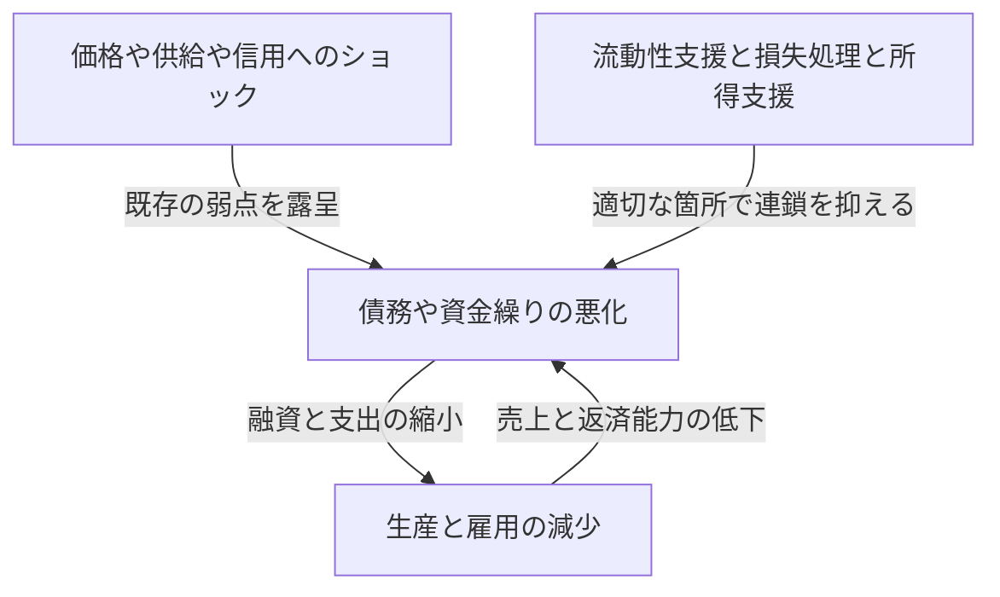
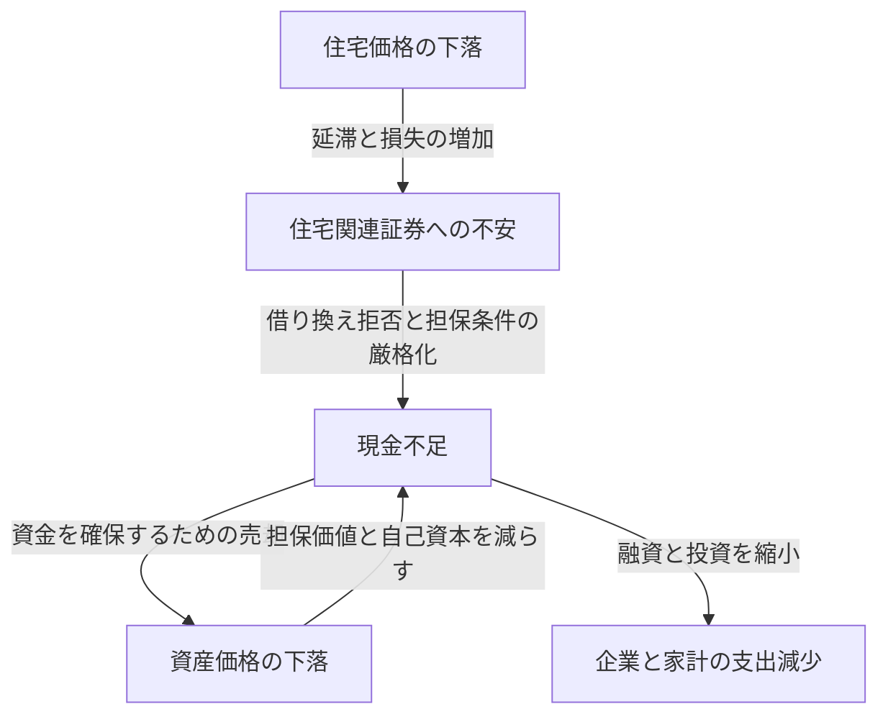

リーマンショックという言葉を聞くと、銀行の破綻、株価の暴落、失業者の増加が一つの出来事として思い浮かぶかもしれません。しかし、一社の破綻がどうして世界中の工場の減産や家庭の収入減につながったのでしょうか。同じ株価暴落でも、1987年のブラックマンデーが1930年代の大恐慌と同じ結果にならなかったのはなぜでしょうか。

経済ショックを理解するには、出来事の名前と年号を覚えるだけでは足りません。何が最初に変化したのか。その前にどんな弱点が蓄積していたのか。損失や不安は誰から誰へ伝わったのか。この三つを分けると、複雑に見える歴史を因果関係として追えるようになります。

この記事では、1929年から2023年までの代表的な16の出来事を取り上げます。すべての国・地域の危機を網羅する年表ではなく、異なる仕組みを比較するための選択です。「経済ショック」は、金融危機だけでなく、エネルギー供給の急変、感染症、通貨制度の変更なども含む広い意味で使います。危機の原因について研究上の論争がある場合は、一つの説明だけを唯一の正解とは扱いません。

## 最初に押さえる、ショックと危機の違い

ショックとは、経済の前提を急に変える出来事です。原油が届かなくなる、住宅価格が下がる、外国の投資家が資金を引き揚げる、といった変化が該当します。一方、危機とは、その変化を既存の制度や資金繰りで吸収できず、経済活動の土台まで機能不全になる状態です。

台風そのものと、堤防の弱さと、浸水の広がりを区別するのに似ています。ただし、経済では堤防に当たる行動も人間の判断で変わります。銀行が安全のために貸出を減らすと、企業が倒れ、銀行の損失が増えることがあります。各人には合理的な防御が、全体では危機を増幅するのです。

需要ショックでは、買いたい・投資したいという支出が減ります。供給ショックでは、原材料や労働力が不足し、生産できる量が減ったり費用が上がったりします。金融ショックでは、資金を仲介し、支払いをつなぐ機能が傷みます。現実の危機では、これらが重なり、途中で性質が変わります。

図の矢印は必ず同じ強さで働くわけではありません。十分な自己資本、安定した資金調達、信頼される制度があれば、損失が発生しても連鎖を小さくできます。逆に、平時には効率的に見える仕組みが、極端な状況では同時に弱点になる場合があります。

## 全体像をつかむための比較表

| 時期 | 出来事 | 中心となった弱点・伝播の仕組み |
| --- | --- | --- |
| 1929年〜1930年代 | 大恐慌 | 銀行恐慌、信用収縮、デフレ、金本位制の制約 |
| 1971年 | ニクソンショック | ドルと金の交換約束への信認低下、通貨制度の転換 |
| 1973〜1974年 | 第一次石油危機 | 石油供給と価格の急変、輸入国の所得流出 |
| 1978〜1982年ごろ | 第二次石油危機と金融引き締め | 供給不安、インフレ期待、高金利への調整 |
| 1982年以降 | 中南米債務危機 | 外貨建て債務、変動金利、外貨収入の不足 |
| 1987年 | ブラックマンデー | 同方向の売買、市場流動性と決済の問題 |
| 1990年代 | 日本のバブル崩壊 | 担保価格の下落、不良債権、債務返済の長期化 |
| 1994〜1995年 | メキシコ通貨危機 | 資金流入の反転、短期債務、ドル連動の返済負担 |
| 1997〜1998年 | アジア通貨危機 | 通貨と満期のミスマッチ、資本流出と銀行危機 |
| 1998年 | ロシア危機とLTCM危機 | 政府債務不安、逃避的な売買、レバレッジ |
| 2000〜2002年ごろ | ITバブル崩壊 | 利益期待の修正、株式調達と設備投資の縮小 |
| 2007〜2009年 | 世界金融危機・リーマンショック | 住宅信用、証券化、短期資金調達の取り付け |
| 2010年代前半 | 欧州債務危機 | 銀行と政府の信用の連鎖、通貨同盟の制度的弱点 |
| 2020年 | コロナショック | 感染と行動変容による需要・供給の同時停止 |
| 2021〜2022年以降 | インフレ・エネルギーショック | 需要回復、供給制約、戦争による資源市場の混乱 |
| 2023年 | 米国の銀行不安 | 金利リスク、預金集中、急速な資金流出 |

時期は危機の特徴が見えやすい期間を示したもので、世界共通の景気後退期間ではありません。たとえば米国の景気後退の始まりと、日本の景気の谷と、株価の底は一致しません。「危機が終わった」という表現も、金融市場の安定、雇用の回復、債務処理の完了で意味が違います。

## 1929年の株価暴落と大恐慌：株の損失がすべてではない

1929年秋の米国株価暴落は、大恐慌を象徴する出来事です。しかし、株価が下がったことだけで、その後の深刻で長い不況を説明することはできません。米国では株価暴落に先立って景気が後退に入り、その後の銀行恐慌が信用と支出をさらに傷めました。

銀行は、預金として短い期間で返す約束をしながら、企業や家庭には長い期間で貸しています。預金者の多くが同時に現金を求めれば、資産がすべて無価値でなくても、すぐに支払えなくなることがあります。当時の米国には、現在のような連邦の預金保険制度はまだありませんでした。

銀行の破綻や預金流出が広がると、企業は運転資金を借りにくくなります。賃金の支払い、原材料の購入、在庫の維持が難しくなり、雇用と生産が減ります。失業と所得減少が消費を減らし、企業の返済能力をさらに弱めました。この過程は、株を持っていない家庭にも損失を及ぼします。

物価下落も救いになるとは限りません。借金の額が名目で固定されていると、売上や賃金が下がるほど返済が重くなります。年収500万円で500万円の借金を負う状態と、年収が350万円に減っても借金が500万円残る状態では、負担が違います。これは理解のための仮例ですが、デフレと債務が相互に悪化させる仕組みを示しています。

さらに金本位制の下では、通貨と金との交換への信頼を守ることが、国内の金融緩和と衝突しました。金流出を防ごうとする引き締めが、不況の中で資金不足を強めることがあったのです。保護主義や国際的な債務関係も悪化を重ねました。[連邦準備制度の歴史資料](https://www.federalreservehistory.org/essays/banking-panics-1931-33)は、金の流出と預金の引き出しが同時に銀行を圧迫した経路を説明しています。

大恐慌の教訓は、株価を支えればすべて解決するということではありません。決済、信用仲介、預金への信頼が崩れると、金融資産の損失が生産能力の長期的な毀損へ変わるということです。金融当局の対応や金本位制の役割をどれほど重く評価するかには研究上の違いがありますが、一日の暴落だけを原因にする説明は粗すぎます。

## 1971年のニクソンショック：交換の約束が持続しなくなった

戦後のブレトンウッズ体制では、多くの通貨がドルとの固定的な為替関係を持ち、米国は外国の通貨当局が保有するドルを一定の条件で金へ交換する仕組みを支えていました。日常のすべてのドル札を、誰でも自由に金へ交換できるという制度ではありません。

貿易や国際金融の拡大には、世界で利用できるドルが必要です。ところが海外のドル保有が増えるほど、米国の金保有との関係から交換約束への疑問が生まれます。交換への不安が高まれば、先に金へ換えようとする行動が増え、制度をさらに不安定にします。

1971年8月、ニクソン大統領はドルと金の交換停止などを発表しました。その後、為替相場の調整を伴う制度維持の試みを経て、主要通貨は1973年に変動相場制へ移っていきます。したがって、「1971年のある日に世界中の固定相場が一斉に終わった」と理解すると経緯を見失います。[Federal Reserve Historyの解説](https://www.federalreservehistory.org/essays/gold-convertibility-ends)で、政策の目的と制度転換の過程を確認できます。

日本の企業にとっては、為替相場が事業計画の大きな変動要因になる転換でした。同じドル建ての輸出代金でも、円高になれば円へ換算した売上は減ります。他方で輸入費用は下がり得るため、輸出企業と輸入企業の影響は同じではありません。

これは主として通貨制度と政策のショックです。銀行が次々に破綻する危機と同じ分類に押し込むべきではありません。交換比率の固定が取引を安定させる一方、その約束を維持する条件が失われれば、調整が大きくなり得ることを示しています。

## 1973〜1974年の第一次石油危機：生産の費用が跳ね上がる

1973年の第四次中東戦争を背景に、アラブ産油国による供給制限や米国などに対する禁輸が行われ、原油価格が急上昇しました。禁輸を行ったアラブ産油国の組織OAPECと、より広い産油国の組織OPECを同一視しないことが大切です。供給措置、産油国の価格政策、すでに強かった世界需要が重なりました。[第一次石油危機の歴史資料](https://www.federalreservehistory.org/essays/oil-shock-of-1973-74)は、この背景を整理しています。

原油は自動車の燃料だけではありません。物流、発電、化学製品など広い範囲の投入物です。短期間に別の燃料や設備へ切り替えにくいため、量が少し不足するだけでも価格が大きく動く場合があります。需要と供給の価格に対する反応が小さい市場では、価格が調整の大部分を担うからです。

輸入国は同じ量の原油を得るために、以前より多くの所得を海外へ支払うことになります。企業が費用を価格へ転嫁すれば家庭の購買力が下がり、転嫁できなければ利益が減ります。どちらの経路でも、消費や投資の余力が傷みます。

ここでは物価上昇と景気悪化が同時に起こり得ます。これがスタグフレーションです。需要が弱いからといって支出を大きく刺激しても、すぐに原油や生産設備が増えるわけではありません。逆に物価だけを見て強く引き締めれば、雇用への打撃が増えます。

日本の混乱も、石油だけで説明し切れるものではありません。当時の需要や金融環境、物価上昇への期待が影響しました。その後の省エネルギー化や産業構造の変化は、同じ輸入価格ショックへの耐性を変えていきます。供給ショックの大きさは、資源価格だけでなく、その資源にどれほど依存しているかで決まるのです。

## 第二次石油危機と高金利への転換：物価を抑える過程にも痛みがある

1978〜1979年のイラン革命に伴う生産の混乱は、再び石油市場を揺らしました。ただし、価格上昇を失われた生産量だけに比例させて説明することはできません。今後さらに供給が減るという不安が、在庫を積み増す需要を生みました。将来への警戒が現在の需要を増やすことがあります。[第二次石油危機の解説](https://www.federalreservehistory.org/essays/oil-shock-of-1978-79)は、供給減と予備的な需要の両方を扱っています。

すでにインフレが続いている経済では、企業と労働者が次の値上がりを織り込んで価格や賃金を決めます。これは常に賃金だけが物価を押し上げるという意味ではありません。資源費用、需要、金融政策への信頼、契約の仕組みが、物価上昇の持続性を左右します。

米国では1979年にFRB議長となったポール・ボルカーの下で、インフレ抑制を重視する金融引き締めが進みました。金利の上昇は住宅購入や設備投資を抑え、景気と雇用に大きな負担を与えます。1980年前後から1980年代初めの不況は、石油価格の上昇だけでなく、この政策転換への調整も含む出来事です。

金融引き締めは原油を採掘する政策ではありません。支出と信用を抑え、物価上昇が長期にわたるという予想を変えようとする政策です。供給制約そのものを消せないため、インフレを抑える過程で実体経済の費用が発生します。[大インフレ期の歴史](https://www.federalreservehistory.org/essays/great-inflation)を読むと、政策判断と物価の関係が見えてきます。

しかも米国の金利上昇は国内で完結しません。ドルで借金をしていた海外の国や企業には、返済条件の悪化として伝わりました。この接続が、次の中南米債務危機を理解する鍵になります。

## 1982年以降の中南米債務危機：借金の通貨と金利が重荷になる

1970年代には、産油国が得た資金などを背景に、国際銀行を通じた融資が拡大しました。中南米の国々も多額の外貨資金を借り入れます。しかし、借りられることと、将来の外貨収入で返せることは同じではありません。

ドル建ての借金は、自国通貨を発行するだけでは返せません。輸出、海外からの資金流入、保有する外貨準備などを通じてドルを確保する必要があります。変動金利の契約なら、国際金利が上がると利払いも増えます。一方、世界景気が弱まると輸出や資源収入は伸びにくくなります。

1982年8月、メキシコの債務返済困難が危機を表面化させ、その後、多くの国が債務再編を迫られました。国際銀行も大きな貸出残高を抱えていたため、問題は借り手の国だけでは済みませんでした。[中南米債務危機の資料](https://www.federalreservehistory.org/essays/latin-american-debt-crisis)は、貸し手側も含めた経緯を説明しています。

新規融資が止まると、借金を借り換えながら維持していた支払いが続けられなくなります。輸入を削って外貨を確保しようとしても、生産に必要な機械や部品まで減れば、将来の所得を生む力も傷みます。財政調整、通貨下落、銀行の問題が重なり、長い停滞につながった国もありました。

教訓は単に「借金は悪い」ではありません。借金が何の通貨で、どの金利で、いつ返済され、何の収入で支えられているかが重要なのです。長期の投資が社会的に有用でも、返済期限や外貨収入との組み合わせが悪ければ、途中で資金が尽きます。

## 1987年のブラックマンデー：売れるはずだった市場が薄くなる

1987年10月19日、米国のダウ平均株価は一日で22.6%下落しました。しかし、この暴落は米国で直ちに大恐慌型の銀行危機や景気後退へ発展したわけではありません。価格の急落と、金融機能全体の崩壊を区別するための重要な事例です。

原因は一つのニュースではありません。高くなっていた株価への懸念、金利や為替を巡る不安、市場の構造が重なりました。下落時に先物などを売って損失を抑えようとする「ポートフォリオ・インシュアランス」も、売りを増幅した要因として指摘されています。名称に保険とあっても、誰かが無条件に損失を補填する仕組みとは限りません。

一人の投資家が売って危険を減らすには、買ってくれる相手が必要です。多くの参加者が同じ価格変化に反応して同時に売れば、従来の価格では買い注文が足りなくなります。そこで価格がさらに下がり、次の売りが出るという循環が起きます。

加えて、現物株、先物、オプションの取引・決済の違いが資金需要を複雑にしました。帳簿上は相殺できる取引でも、支払い日がずれていれば、その間の現金が必要です。[Federal Reserve History](https://www.federalreservehistory.org/essays/stock-market-crash-of-1987)は、こうした市場構造と流動性支援を扱っています。

中央銀行の流動性供給への姿勢や金融機関の融資継続が、連鎖の抑制に寄与しました。ここからわかるのは、株価の下落率だけでは危機の深さを測れないことです。誰が損失を負い、その人がどれほど借金をし、決済や融資をどの程度担っているかによって、同じ価格変化の意味は変わります。

## 日本のバブル崩壊：土地と銀行と企業の貸借対照表がつながっていた

1980年代後半の日本では、株価と地価が大きく上昇しました。金融緩和、金融自由化の下での銀行行動、土地を担保とする融資、値上がりへの期待などが重なりました。「プラザ合意だけ」「低金利だけ」と一つの要因で説明するより、信用と資産価格の相互作用を見る必要があります。

土地の価格が上がると、同じ土地を担保に借りられる金額が増えます。その資金が不動産取得へ向かえば、さらに価格が上がります。将来の収益ではなく、担保がもっと高く売れることを当てにした融資が増えると、価格の上昇自体が借入を支えるようになります。

金融引き締めや不動産向け融資の規制などを経て、1990年代に資産価格が下がると、この仕組みが逆回転しました。企業には取得時の借金が残る一方、担保や保有資産の価値は低下します。銀行には返済されにくい貸出、すなわち不良債権が積み上がりました。[日本銀行のバブル研究](https://www.imes.boj.or.jp/research/abstracts/english/me14-1-6.html)は、信用と土地・株価の関係を検討しています。

銀行が損失で自己資本を減らすと、新たな融資が難しくなります。同時に企業も、たとえ金利が下がっても、新規投資より債務返済を優先します。貸し手と借り手が双方から支出を縮めるため、利下げだけで従来どおり投資が戻るとは限りません。

問題の認識や損失処理が遅れると、経営が弱い企業への融資継続と、有望な企業への資金供給不足が並存する場合があります。1997〜1998年の金融不安は、資産価格下落の後も銀行システムの脆弱性が残っていたことを示しました。日本銀行は、[1990年代以降のデフレとバランスシート調整](https://www.boj.or.jp/en/about/press/koen_2024/ko240527b.htm)を長期停滞の重要な背景として論じています。

ただし、その後の日本経済のすべてをバブル崩壊だけへ還元することはできません。人口構造、生産性、国際競争、政策なども関わります。ここでの核心は、資産価格の下落が貸借対照表に残ると、株価が一時的に反発しても、企業と銀行の行動はすぐには元へ戻らないという点です。

## 1994〜1995年のメキシコ通貨危機：借り換えが止まると通貨防衛が難しくなる

1994年のメキシコでは、政治的不安や米国の金利上昇などを背景に、海外資金の流入が不安定になりました。経常赤字がある国は、その不足を資金流入などで賄う必要があります。赤字が常に危機を意味するわけではありませんが、流入が急に止まったときの調整は厳しくなります。

為替相場を支えるために外貨準備を使っても、準備には限りがあります。政府が発行を増やしたテソボノスは、返済額がドルに連動する短期の債務でした。ペソ安への不安を投資家から遠ざける工夫が、政府側の為替リスクと借り換えリスクを増やした面があります。

1994年12月の為替政策の変更は信認を十分に回復できず、ペソは大幅に下落しました。ドルに連動する債務の自国通貨での負担が増え、投資家が借り換えに応じるかどうかが切迫した問題になります。[IMFによる当時の検証](https://www.imf.org/en/news/articles/2015/09/28/04/53/spmds9508)は、短期資金と債務構成の脆弱性を指摘しています。

通貨安は輸出に有利に働くことがありますが、同時に外貨に連動する負債を重くします。「通貨を下げれば競争力が戻って解決」という説明が不十分なのは、この貸借対照表への打撃があるからです。企業と銀行の状態が悪化すれば、輸出を増やすための資金さえ調達しにくくなります。

この危機は、政府債務の総額だけでなく、数か月以内にどれほど返す必要があるかを見る重要性を示します。同じ額の債務でも、返済が長期間に分散している場合と、短い期間に集中している場合では、信認低下に対する耐性が違います。

## 1997〜1998年のアジア通貨危機：民間の外貨債務が経済全体を揺らす

1997年7月、タイがバーツの相場維持を断念したことを契機に、危機はインドネシアや韓国などへ広がりました。ただし、各国の制度や弱点は同一ではありません。また、すべてを政府の放漫財政の結果とする説明は、民間企業と銀行の借入を見落とします。

多くの取引では、ドルなどで短期に借り、国内で長期の不動産開発や事業へ投資していました。返す通貨と稼ぐ通貨が違うのが通貨のミスマッチ、返す時期と資金を回収する時期が違うのが満期のミスマッチです。為替が安定し、借り換えができる間は、弱点が表面化しにくい組み合わせです。

しかし、投資家が回収を急ぐと、外貨需要が増えて通貨が下落します。通貨下落は外貨債務の負担を増やし、企業への不安を強めます。不安がさらなる資金流出を招くため、為替と返済能力が互いに悪化します。[IMFの金融部門に関する検証](https://www.imf.org/external/pubs/ft/op/opfinsec/index.htm)は、銀行・企業の弱点と通貨制度の関係を整理しています。

たとえば、1ドル100単位の自国通貨で100万ドルを借りた企業は、元本が1億単位に相当します。1ドル150単位へ下落すれば、同じドル元本は1億5000万単位になります。売上が自国通貨のままなら、何も追加で借りなくても返済負担が膨らみます。輸出収入や為替ヘッジがあれば影響は変わるため、これは無防備な場合の仮例です。

通貨を守るための高金利は資金流出を抑え得る一方、国内の借り手を苦しめます。反対に通貨下落を容認すると、外貨債務が傷みます。危機対応はこの難しい組み合わせの中で行われ、IMF支援の条件や財政・金融政策の適切さについても議論が続いています。

国境を越えた波及は、隣国だから自動的に起こるわけではありません。同じ銀行から借りている、輸出市場が重なる、投資家が似た経済とみなす、といった経路があります。共通の貸し手が損失を受けると、問題が小さい国からも資金を回収することがあります。

## 1998年のロシア危機とLTCM：分散した取引でも同時に損失が出る

1998年のロシアでは、財政・徴税の弱さ、資源価格の低迷、資金調達への不安が重なり、8月にルーブル切り下げや国内国債の債務再編などが発表されました。政府の借金であれば常に安全という見方が揺らぎ、投資家は世界的に安全性と換金しやすさを重視するようになります。

その混乱の中で深刻な損失を抱えたのが、ヘッジファンドのロングターム・キャピタル・マネジメント、LTCMでした。同ファンドの戦略を単にロシア国債への投資と理解すると、問題の広がりが見えません。似た金融商品の価格差が縮まると見込む取引などを、大きなレバレッジで行っていた点が重要です。

平常時には小さい価格差でも、多額の取引をすれば利益になります。しかし、危機時に参加者が換金しやすい資産へ集中すると、価格差は縮まるどころか拡大します。いつか価格差が戻るという見通しが正しくても、その前に追加担保を求められれば、待ち続けることはできません。

別々の市場に分散していても、すべてが「市場の流動性が保たれる」という同じ前提に依存していれば、実質的な分散は弱いままです。危機時に相関が高まるとは、単に数学の数値が変わるだけでなく、多くの人が同じ理由で同時に売るということでもあります。

ニューヨーク連銀は関係金融機関の協議を仲介し、民間金融機関による資本注入が行われました。連銀がLTCMへ公的資金を直接注入した救済と混同しないことが必要です。[当時のニューヨーク連銀総裁の証言](https://www.newyorkfed.org/newsevents/speeches/1998/mcd981001.html)は、この役割分担を説明しています。モデルが予測する長期的な価値と、明日の支払いに必要な現金は別の問題なのです。

## ITバブル崩壊：技術が本物でも株価が正しいとは限らない

1990年代後半には、インターネットが産業を変えるという期待の下で、IT企業や通信関連企業へ資金が集まりました。その技術的変化は実際に大きなものでした。しかし、社会に有用な技術が普及することと、あらゆる企業が高い利益を得ることは同じではありません。

企業価値は、将来どれだけ利益や現金を生むかと、それを現在どれほどの価値に割り引くかに依存します。市場規模だけが注目され、顧客獲得費用、競争、資金消費、追加投資が軽視されると、期待する成長が少し下がっただけでも評価は大きく変わります。

2000年以降、過大な利益期待が修正されると、株式による資金調達が難しくなり、企業は人員や設備投資を削りました。通信設備などの過剰投資も調整されます。株価下落が家計の資産を減らす経路に加えて、事業を続けるための資金が細る経路が働きました。[FRBの2001年年次報告](https://www.federalreserve.gov/boarddocs/rptcongress/annual01/ar01.pdf)は、当時の投資と金融の変化を記録しています。

米国の2001年の景気後退を、同年9月の同時多発テロだけから始まったものとみなすのも不正確です。景気の弱まりはそれ以前からあり、テロは旅行などの需要や不確実性へ追加の打撃を与えました。重なったショックは、順序を分けて読む必要があります。

住宅金融を中心とした2008年の危機と比べると、株式投資家が引き受ける損失の比重が大きく、銀行や短期資金市場を通じた増幅の構造が違いました。株式は価格が下がっても会社が同額を返す契約ではありませんが、借金は返済義務が残ります。この資金調達方法の違いが、技術への失望をどれほど深い金融危機に変えるかを左右します。

## リーマンショック：住宅ローンの損失が短期金融市場を止めた

### 危機は2008年9月に突然始まったのではない

日本でリーマンショックと呼ばれる出来事は、米投資銀行リーマン・ブラザーズが2008年9月15日に破綻したことを象徴とします。しかし、米国の住宅市場と関連する金融商品の問題は、それ以前から進んでいました。2007年には短期金融市場の緊張が表面化し、2008年春にはベアー・スターンズの危機も起きています。

住宅価格の上昇は、借り手にも貸し手にも安心感を与えました。返済が難しくなっても住宅を売却・借り換えできるという期待が、融資を支えます。ところが価格が下がれば、売却しても借金を返し切れない場合が増え、借り換えの前提も崩れます。[サブプライム住宅ローン危機の解説](https://www.federalreservehistory.org/essays/subprime-mortgage-crisis)は、この信用拡大と住宅価格の相互作用を説明しています。

「返済能力が低い人が借りたから」という説明だけでは不十分です。融資の審査、証券化の報酬体系、投資家の評価、金融機関の自己資本や調達方法まで見なければ、局所的な貸し倒れが世界的な危機になる理由を説明できません。

### 証券化はリスクを消す装置ではない

住宅ローンをまとめ、その返済から生まれる収入を投資家へ分配するのが証券化の基本です。支払いの優先順位を分ければ、先に損失を負う部分と、後から損失を負う部分を作れます。しかし、全体に存在する損失が消えるわけではありません。

多くの地域のローンを混ぜれば、地域固有のリスクは分散できます。一方で、広い範囲の住宅価格が同時に下がり、失業や借り換え困難が共通して起きれば、貸し倒れの連動は強まります。格付けの高い部分も、基礎となる仮定が崩れれば損失を受け得ます。

さらに商品が複雑になるほど、誰が最終的にどの損失を持っているのかが見えにくくなります。自分の損失が小さくても、取引相手の状態がわからなければ、資金を貸すのを控える理由になります。問題は損失額だけでなく、損失の所在への不確実性でした。

### 短期調達が止まると資産の売却を迫られる

投資銀行などは、長い期間をかけて回収する資産を、レポ取引や短期証券などで調達した資金によって保有していました。レポは証券を担保とする短期調達に近い性質を持つ取引です。毎回借り換えられる間は機能しますが、貸し手が更新を拒めば、直ちに現金が必要になります。

担保価値100に対して95まで借りられていたものが、警戒の高まりで80までしか借りられなくなれば、差の15を別に用意しなければなりません。これは仕組みを示す仮例です。担保そのものの価格下落も同時に起きれば、必要な現金はさらに増えます。

現金を作るために資産を売ると、その売却が市場価格を下げます。他の金融機関も保有資産の価値低下や追加担保要求を受け、売却を迫られます。これは銀行の店頭に預金者が並ぶ形とは違っても、短期資金の出し手が一斉に撤退する「取り付け」に似た構造です。

### 金融街の問題が工場と家庭へ届く

リーマン破綻後には、取引相手への不信や短期市場の混乱が急激に強まりました。AIGへの支援、金融機関の資本増強、中央銀行の流動性供給など、多様な対応が必要になりました。[世界金融危機の全体像](https://www.federalreservehistory.org/essays/great-recession-and-its-aftermath)は、住宅市場から金融部門、実体経済への経路を整理しています。

銀行が融資を減らせば、企業は設備投資だけでなく、日常の支払いに使う資金も確保しにくくなります。家庭は住宅や株式の価値低下に加え、雇用不安から耐久消費財の購入を見送ります。その結果、金融商品を直接保有していない輸出企業にも注文減少が届きます。日本への大きな打撃には、世界需要と貿易の収縮も関わりました。

低金利、国際的な資金の流れ、規制・監督、報酬体系など、どの要因をどれほど重く見るかには議論があります。しかし、住宅ローンの損失、高いレバレッジ、短期調達、リスクの不透明さが組み合わさったことは、危機を理解する上で外せません。リーマンの破綻は重要な増幅点であり、蓄積していた問題のすべてを一社が作ったわけではないのです。

## 欧州債務危機：政府と銀行が互いを弱くする

2009年末から2010年にかけてギリシャの財政への懸念が強まり、その後、ユーロ圏の複数国へ信用不安が広がりました。ただし、ギリシャの財政問題を、そのまますべての国へ当てはめることはできません。アイルランドやスペインでは、不動産と銀行の問題が特に重要でした。

政府の信用が下がって国債価格が下落すると、その国債を保有する銀行が傷みます。銀行を支えるために政府が負担を増やすと、今度は政府財政への懸念が強まります。銀行と政府が互いの信用を支えていた関係が、互いを弱くする関係へ転じるのです。

ユーロ圏の加盟国は共通通貨を使うため、各国が単独で自国通貨を切り下げたり、独自の政策金利を設定したりできません。一方、危機当初には、銀行監督・破綻処理や財政的なリスク共有の仕組みが十分に統合されていませんでした。通貨の統合に対して、危機を処理する制度の統合が追い付いていない面がありました。

借り換え金利が高くなれば、利払いが増えて債務の持続可能性がさらに悪化します。不安に基づく高金利が、不安を現実に近づける場合があるのです。ただし、すべてが根拠のない市場心理だったわけでもなく、国ごとの債務や生産性、銀行の弱点が重要でした。[ECBによる危機の検証](https://www.ecb.europa.eu/press/key/date/2018/html/ecb.sp180511.en.html)は、国別の違いと制度上の教訓を説明しています。

財政緊縮は債務への信頼を取り戻す目的を持ちますが、不況下で急に支出を減らせば所得と税収も減ります。反対に支援には、損失を誰が負担し、将来の過大な借入をどう防ぐかという問題があります。ECBの対応、金融支援の仕組み、銀行同盟への取り組みは、こうした悪循環を断ち切るために進められました。

## 2020年のコロナショック：最初に止まったのは金融商品ではなく活動だった

新型コロナウイルス感染症の拡大は、人の移動、対面サービス、職場や工場の稼働を一度に制約しました。行政による制限だけでなく、感染を避ける自主的な行動変容や欠勤も経済活動を減らしました。通常の銀行危機とは、最初の原因が異なります。

供給側では、人が働けない、部品が届かない、物流が滞るという問題が起きます。需要側では、旅行、飲食、娯楽などへの支出が減り、所得と先行きへの不安から購入が延期されます。サービスから財への需要移動もあり、すべての産業の需要が同じ方向へ動いたわけではありません。[IMFの初期分析](https://www.imf.org/en/Blogs/Articles/2020/03/09/blog030920-limiting-the-economic-fallout-of-the-coronavirus-with-large-targeted-policies)は、需要と供給の両面を区別しています。

売上が急に止まっても、家賃や借入の返済は続きます。本来は継続できる企業も、手元資金が尽きれば倒産します。そうなると、一時的な活動停止が、雇用関係や取引網を失う長期の損傷へ変わります。政策には、企業と家庭を停止期間の向こう側へつなぐ役割が求められました。

金利を下げても、感染リスクや部品不足を直接なくすことはできません。医療・公衆衛生の対策と、所得支援、雇用維持、資金繰り支援を組み合わせる必要があります。金融市場でも現金需要が急増したため、実体経済のショックが金融の機能不全へ変わらないようにする対応が重要でした。

回復も一様ではありません。需要が戻っても、閉鎖した設備や人員、国際物流が同じ速度で戻るとは限りません。危機初期の「需要が足りない」という問題が、回復期には「特定の供給が追い付かない」という問題へ移ることがあります。これは次のインフレ局面を考える上で重要です。

## 2021〜2022年以降のインフレ・エネルギーショック：複数の制約が重なった

パンデミック後のインフレは、一つの原因だけから生じたものではありません。需要の回復と構成の変化、供給網の混乱、労働供給の変化、各国の財政・金融環境などが重なりました。その比重は国と時期で異なり、米国と欧州を同じ説明だけで扱うと重要な違いを見落とします。

エネルギー市場は2021年から逼迫していました。そこへ2022年2月のロシアによるウクライナ侵攻が加わり、ガス、石油、電力などの市場が大きく揺れました。戦争、供給削減、制裁や取引上のリスクが、供給経路と費用を変えます。[国際エネルギー機関の整理](https://www.iea.org/topics/2022-energy-crisis)は、侵攻前からの逼迫と、侵攻後の深刻化を区別しています。

特にガスは、パイプライン、液化設備、船、受け入れ設備が必要です。ある地域の不足を、別の地域の資源で直ちに埋められるとは限りません。資源が地球上に存在することと、必要な時点に必要な場所へ届けられることは違います。この物理的な制約が、経済的な価格変動を大きくします。

エネルギー輸入国では、輸入価格上昇が企業の費用と家庭の生活費を押し上げます。補助金や価格抑制は短期的な負担を和らげられますが、財政負担を増やし、設計によっては節約の動機も弱めます。誰をどの期間支援するかが重要になります。

中央銀行は物価上昇の定着を防ぐために金利を引き上げました。しかし、金利はガス供給を直接増やせません。需要や期待を通じて物価へ働きかける一方、住宅や設備投資を抑え、既存の金融資産にも損失を生みます。インフレ率が下がっても、それは価格上昇の速度が遅くなったということであり、生活費の水準が以前に戻ったとは限りません。

## 2023年の米国銀行不安：安全な債券にも金利リスクがある

2023年3月のシリコンバレー銀行、SVBの破綻は、銀行危機が不良な住宅ローンだけから起きるわけではないことを示しました。長期債券の金利リスク、預金者の集中、預金保険で全額が保護されない大口預金への依存などが組み合わさりました。

固定された利息を払う債券は、市場金利が上がると一般に価格が下がります。新しく発行される債券が高い利息を払うなら、以前の低い利息の債券は値下がりしないと買い手を得にくいからです。国債のように信用リスクが小さい資産でも、途中で売る価格が一定とは限りません。

満期まで保有できる場合と、今日の預金流出に対応するため売却する場合では、損失の意味が変わります。帳簿上の分類によって損失の認識時期が違っても、急いで現金化する際の市場価格は消えません。長期資産を、すぐ引き出せる預金で保有する銀行の基本構造が問題になります。

SVBでは、顧客基盤が技術産業などに集中していたため、預金者の資金需要や判断が同じ方向へ動きやすい面がありました。オンラインでの送金や情報共有は、取り付けの速度を高めます。ただし、SNSだけを原因にすると、その前から存在した資産・負債管理や監督上の弱点を見失います。[FRBの検証報告](https://www.federalreserve.gov/publications/2023-April-SVB-Key-Takeaways.htm)は、経営と監督の両面を扱っています。

同年には他の銀行にも不安が広がりましたが、各行の資産や顧客構成は同一ではありません。2008年型の住宅信用危機をそのまま再現したとみなすより、金利の急変に誰がどの形でさらされていたかを見るほうが、今回の弱点を理解できます。

## 歴史をつなぐ四つの仕組み

### 自己資本が薄いほど、小さな値下がりが大きな損失になる

資産を $A$、負債を $D$、自己資本を $E$ とすると、単純化した貸借対照表では次の関係になります。

$$
E=A-D,\qquad L=\frac{A}{E}
$$

$L$ はここで用いるレバレッジの定義です。資産100、負債95、自己資本5なら20倍です。負債の価値が変わらないと仮定し、資産の価値が3減れば、自己資本は5から2へ減ります。資産の下落は3%でも、自己資本の損失率は60%です。税、ヘッジ、資産構成などを省いた計算ですが、損失の増幅は直感的にわかります。

資産価格が安定していた期間だけを見れば、高いレバレッジは効率的に見えます。しかし価格変動が大きくなると、自己資本を守るための売却や融資削減が必要になり、それが他者の損失を増やす場合があります。日本のバブル、LTCM、世界金融危機をつなぐ視点です。

### 流動性と支払能力は違うが、互いに影響する

支払能力の問題とは、将来回収できる資産や収入に比べて、負債が重すぎることです。流動性の問題とは、最終的には回収できる資産があっても、今必要な支払いに使える現金が足りないことです。黒字の会社が資金繰りで倒れる場合があるのも、この違いによります。

中央銀行などが一時的な資金不足を埋めれば、健全な資産を投げ売りせずに済むことがあります。しかし、資産の価値が本当に不足しているなら、貸付を増やすだけでは損失そのものは消えません。資本注入、債務再編、事業の整理などが必要になります。

現実には両者を即座に判別するのは難しく、流動性不足による投げ売りが、支払能力を失わせることもあります。逆に損失への疑いが預金流出を生みます。「現金を供給すれば必ず解決する」「赤字なら必ず放置すべきだ」という両極端では、この相互作用を捉えられません。

### 通貨と金利の契約が、予想外の負担を作る

外貨建て債務の自国通貨での価値は、単純化すれば次のように表せます。

$$
D_{\mathrm{home}}=eD_{\mathrm{foreign}}
$$

ここで $e$ は外貨1単位を買うのに必要な自国通貨の額です。自国通貨安で $e$ が上がれば、外貨建て元本が同じでも負担は増えます。ただし外貨収入やヘッジがある場合は、その相殺を含めて判断しなければなりません。

一方、固定利払いの債券の価格は、将来の支払いを現在へ割り引いて考えられます。毎期の利払いを $C$、満期の元本を $F$、残る期間数を $T$、一定の割引率を $y$ とする単純な模型では、

$$
P=\sum_{t=1}^{T}\frac{C}{(1+y)^t}+\frac{F}{(1+y)^T}
$$

となります。ほかの条件を固定すれば、$y$ の上昇で $P$ は下がります。実際には期間ごとに金利が異なり、信用リスクや期限前返済もあるため、この式だけですべての証券を評価できるわけではありません。それでも、金利上昇が新しい貸出の収益を増やし得る一方で、既存の長期債券の価値を下げる理由は見えます。

### 国際的なつながりは、利益も衝撃も運ぶ

危機の国際伝播には、貿易、金融、共通する価格の経路があります。ある国の不況で輸入が減れば、輸出国の工場が影響を受けます。世界的な銀行が損失を出せば、無関係に見える国の融資も減る場合があります。原油やドル金利の変化は、多くの国へ同時に届きます。

この違いは対策を考える上で重要です。輸出注文が減っている企業へ、銀行の資本増強だけを行っても注文は戻りません。反対に、注文はあるのに運転資金が借りられない企業には、資金の通り道を修復することが有効です。「世界不況」という一語の内側で、どの経路が止まっているかを見分ける必要があります。

## 政策対応に万能薬がない理由

需要不足が中心なら、金融緩和や財政支出は雇用と生産を支え得ます。しかし供給制約が厳しいときに、供給を増やさず需要だけを押し上げれば、物価上昇を強めることがあります。逆に供給ショックだから何もしなくてよいわけでもなく、影響の大きい家庭や企業への限定的な支援は別に考えられます。

銀行危機では、決済や預金への信頼を守ることと、経営者や投資家を無条件に救うことを区別しなければなりません。資本注入に条件を付ける、株主や一定の債権者に損失を負わせる、事業を整理しながら重要な機能を継続するなど、損失負担の設計が問われます。

支援を期待して過大なリスクを取る問題をモラルハザードと呼びます。一方、危機の最中に支援をすべて拒めば、問題を起こしていない企業や家庭まで巻き込む可能性があります。したがって、平時の資本・流動性規制、情報開示、破綻処理の準備と、危機時の支援は組み合わせて考える必要があります。

財政についても、債務残高だけで余力が決まるわけではありません。自国通貨か外貨か、金利と満期、税収基盤、中央銀行との制度関係、政策への信頼が関わります。ただし、自国通貨建てなら無制限に費用なく支出できるという意味でもありません。物価、為替、資源制約を通じた限界があります。

危機対応の評価では、「何もしなかった場合」を直接観察できない難しさもあります。支援後に景気が悪化したから支援が無効だったとは限らず、回復したからすべてが政策のおかげとも言えません。ほかの国との比較、時間差、事前の条件、制度の違いを考慮した検証が必要です。

## 次の経済ニュースを読むための問い

新しいショックのニュースを読んだら、まず「何の価格や数量が変わったのか」を確かめます。株価、原油、為替、金利、輸出注文では、直接影響を受ける主体が違います。次に、誰の資産が減り、誰の負債や支払いが増えるのかを考えます。

そのうえで、損失を吸収する自己資本はあるか、近い将来に返す借金は多いか、収入と債務の通貨は合っているか、同じ行動を取る参加者が集中していないかを見ます。銀行だけでなく、投資ファンド、企業、政府、家庭にも同じ問いを適用できます。

さらに、政策が狙っているのは現金不足、損失処理、需要不足、供給不足のどれなのかを確認します。政策の名前が同じでも、作用する問題が違えば効果も副作用も変わります。危機前の株価へ戻ることと、人々の生活が回復することも同じではありません。

ここで挙げた問いは、暴落の日時を予言する方法ではありません。弱点が見つかっても危機が必ず起きるわけではなく、政策や民間の調整によって回避される場合があります。歴史から学べるのは、日付の予測よりも、何が起きたときにどの経路を通じて損失が広がるかという読み方です。

大恐慌とコロナショックでは、最初の原因が大きく違います。第一次石油危機とリーマンショックでも、中心にある制約は異なります。それでも、収入が減っても支払いの約束は残ること、短期の現金と長期の価値は違うこと、多くの人が同時に身を守ると全体を不安定にし得ることは、繰り返し現れます。

経済ショックの歴史は、単なる失敗の一覧ではありません。人と企業と国家の約束が、どの条件で機能し、どの条件で支えを必要とするのかを学ぶ歴史です。その約束の構造まで見れば、「また大きな暴落が起きた」という見出しの先に、今回固有の問題と、過去から続く仕組みの両方が見えるようになります。

## 資料の読み方

本文では、連邦準備制度、IMF、日本銀行、ECB、IEAの公開資料へ、対応する論点から直接リンクしています。歴史資料の出来事の記録と、政策当局自身による評価は区別して読む必要があります。特に政策効果や危機の原因の比重は、資料の立場によって評価が異なる場合があります。

数値を用いた貸借対照表・為替・担保の例は、仕組みを説明するための仮例であり、特定の銀行や国の実績値ではありません。また、年次報告や危機当時の分析には当時の見通しが含まれるため、予測値を後年の確定した実績と取り違えないようにしてください。
