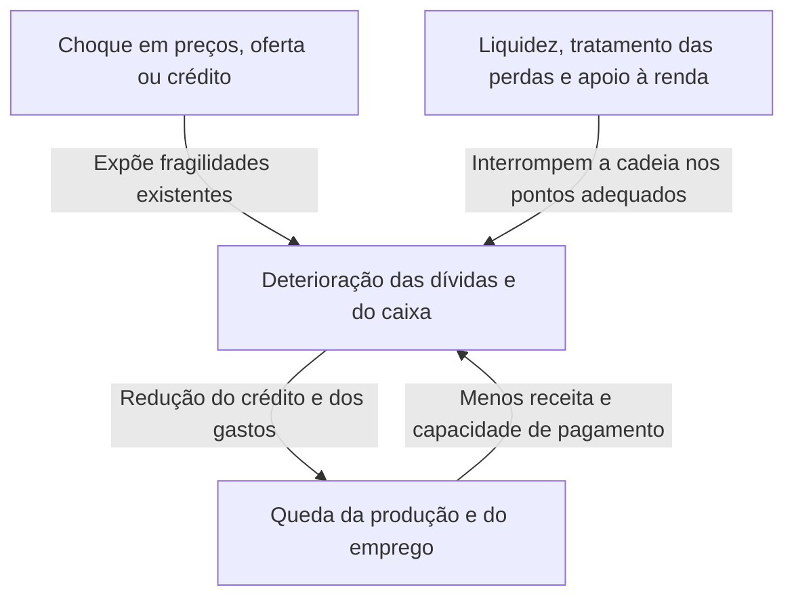
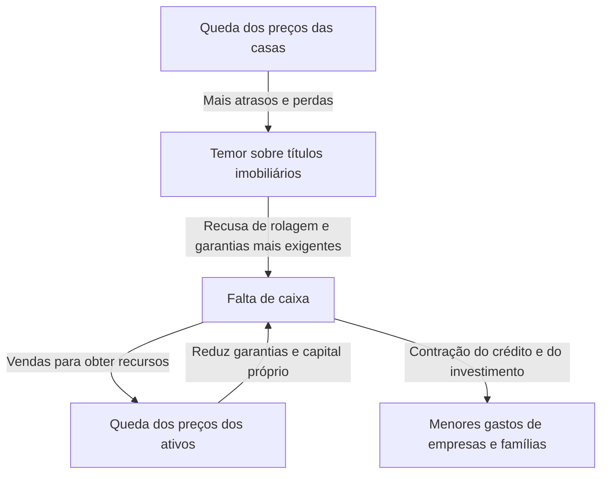

Ao ouvir falar na quebra do Lehman Brothers, talvez você imagine falências bancárias, bolsas despencando e desemprego como partes de um único acontecimento. Mas como a falência de uma empresa levou fábricas do mundo inteiro a reduzir a produção e famílias a perder renda? E por que outra queda da bolsa, a Segunda-Feira Negra de 1987, não teve o mesmo resultado da Grande Depressão dos anos 1930?

Entender choques econômicos exige mais que decorar nomes e datas. O que mudou primeiro? Quais fragilidades já haviam se acumulado? De quem para quem passaram as perdas e a insegurança? Separando essas três perguntas, podemos acompanhar uma história aparentemente complexa como uma sequência de relações causais.

Este artigo examina 16 episódios representativos entre 1929 e 2023. Não é uma cronologia de todas as crises do mundo, mas uma seleção para comparar mecanismos diferentes. Usamos 'choque econômico' em sentido amplo, incluindo crises financeiras, mudanças bruscas no fornecimento de energia, epidemias e alterações do regime monetário. Quando há controvérsia acadêmica sobre as causas, nenhuma explicação será tratada como a única resposta correta.

## Primeiro, a diferença entre choque e crise

Um choque muda subitamente as condições em que a economia funciona: petróleo deixa de chegar, imóveis perdem valor ou investidores estrangeiros retiram recursos. Uma crise é a situação em que as instituições e os fluxos de financiamento existentes não conseguem absorver essa mudança, comprometendo as bases da atividade econômica.

É como distinguir a tempestade, a fragilidade do dique e a propagação da inundação. Na economia, porém, o próprio dique muda conforme as decisões humanas. Bancos podem reduzir empréstimos por segurança, provocar falências de empresas e acabar sofrendo mais perdas. Uma defesa racional para cada participante pode amplificar a crise coletiva.

Num choque de demanda, diminuem os gastos que as pessoas desejam realizar em consumo ou investimento. Num choque de oferta, faltam insumos ou trabalho, reduzindo a produção possível ou elevando custos. Num choque financeiro, deterioram-se as funções de intermediar recursos e sustentar pagamentos. Nas crises reais, esses processos se combinam e podem mudar de natureza ao longo do caminho.

As setas não atuam sempre com a mesma intensidade. Capital suficiente, financiamento estável e instituições confiáveis podem limitar a propagação mesmo quando há perdas. Por outro lado, mecanismos que parecem eficientes em tempos normais podem se tornar vulnerabilidades simultâneas em situações extremas.

## Uma comparação para visualizar o conjunto

| Período | Episódio | Fragilidade ou mecanismo de transmissão central |
| --- | --- | --- |
| 1929 e anos 1930 | Grande Depressão | Pânicos bancários, contração do crédito, deflação e restrições do padrão-ouro |
| 1971 | Choque Nixon | Perda de confiança na conversão dólar-ouro e mudança do sistema monetário |
| 1973–1974 | Primeiro choque do petróleo | Alteração brusca da oferta e dos preços, transferência de renda dos importadores |
| Aproximadamente 1978–1982 | Segundo choque do petróleo e aperto monetário | Insegurança da oferta, expectativas inflacionárias e ajuste aos juros altos |
| A partir de 1982 | Crise da dívida latino-americana | Dívidas em moeda estrangeira, juros variáveis e insuficiência de receitas externas |
| 1987 | Segunda-Feira Negra | Operações na mesma direção, liquidez de mercado e problemas de liquidação |
| Anos 1990 | Estouro da bolha japonesa | Queda das garantias, créditos problemáticos e longo processo de amortização |
| 1994–1995 | Crise cambial mexicana | Reversão de capitais, dívida curta e pagamentos vinculados ao dólar |
| 1997–1998 | Crise asiática | Descasamentos de moedas e prazos, saída de capitais e crises bancárias |
| 1998 | Crises russa e do LTCM | Risco soberano, fuga para segurança e alavancagem |
| Aproximadamente 2000–2002 | Estouro da bolha da internet | Revisão dos lucros esperados, menor financiamento acionário e investimento |
| 2007–2009 | Crise financeira global e quebra do Lehman | Crédito imobiliário, securitização e corrida contra o financiamento curto |
| Início dos anos 2010 | Crise da dívida europeia | Interdependência entre bancos e governos e fragilidades da união monetária |
| 2020 | Choque da pandemia | Interrupção simultânea de demanda e oferta por contágio e mudanças de comportamento |
| De 2021–2022 em diante | Choque inflacionário e energético | Recuperação da demanda, limites de oferta e guerra nos mercados de recursos |
| 2023 | Instabilidade bancária nos EUA | Risco de juros, concentração de depósitos e saídas rápidas de recursos |

Os períodos indicam quando os traços de cada crise ficam mais visíveis; não são recessões sincronizadas mundialmente. O início de uma recessão americana, o ponto mínimo do ciclo japonês e o fundo da bolsa, por exemplo, não coincidem necessariamente. 'Fim da crise' também pode significar estabilidade financeira, recuperação do emprego ou conclusão da reestruturação de dívidas.

## A quebra de 1929 e a Grande Depressão: as perdas na bolsa não explicam tudo

A queda das ações americanas no outono de 1929 simboliza a Grande Depressão. Mas a queda da bolsa, isoladamente, não explica a recessão profunda e prolongada que se seguiu. A economia americana já entrara em recessão antes do colapso acionário, e os pânicos bancários posteriores prejudicaram ainda mais o crédito e os gastos.

Bancos prometem devolver depósitos em prazos curtos, enquanto emprestam a empresas e famílias por prazos longos. Se muitos depositantes exigirem dinheiro ao mesmo tempo, podem faltar recursos imediatos mesmo que os ativos não tenham perdido todo o valor. Na época, os EUA ainda não possuíam o sistema federal de seguro de depósitos existente hoje.

Quando falências bancárias e retiradas se espalham, empresas têm dificuldade para obter capital de giro. Pagar salários, comprar matérias-primas e manter estoques fica mais difícil, reduzindo produção e emprego. Desemprego e perda de renda diminuem o consumo e enfraquecem ainda mais a capacidade de pagamento das empresas. Esse processo atinge também famílias que nunca possuíram ações.

A queda de preços nem sempre ajuda. Se a dívida é fixa em termos nominais, ela pesa mais quando receitas e salários caem. Uma dívida de 5 milhões de ienes com renda anual de 5 milhões tem um peso diferente da mesma dívida após a renda cair para 3,5 milhões. É um exemplo hipotético, mas mostra como deflação e endividamento podem se reforçar negativamente.

Além disso, no padrão-ouro, defender a confiança na conversibilidade podia entrar em conflito com a expansão monetária interna. O aperto para impedir saídas de ouro agravava a escassez de recursos durante a recessão. Protecionismo e dívidas internacionais também contribuíram. A [história do Federal Reserve](https://www.federalreservehistory.org/essays/banking-panics-1931-33) explica como saídas de ouro e retiradas de depósitos pressionaram os bancos simultaneamente.

A lição não é que sustentar ações resolveria tudo. Quando pagamentos, intermediação e confiança nos depósitos se desfazem, perdas financeiras podem virar danos duradouros à capacidade produtiva. Há diferenças acadêmicas sobre o peso da política monetária e do padrão-ouro, mas atribuir tudo à queda de um único dia é uma simplificação excessiva.

## O choque Nixon de 1971: uma promessa de conversão tornou-se insustentável

No sistema de Bretton Woods do pós-guerra, muitas moedas mantinham relações cambiais fixas com o dólar, e os EUA sustentavam a conversão em ouro de dólares detidos por autoridades monetárias estrangeiras, sob certas condições. Não era um sistema em que qualquer pessoa pudesse trocar livremente toda nota de dólar por ouro.

A expansão do comércio e das finanças internacionais exigia dólares disponíveis no mundo. Porém, quanto mais dólares se acumulavam no exterior, maiores as dúvidas sobre a conversão diante das reservas americanas de ouro. A preocupação estimulava conversões antecipadas, tornando o sistema ainda mais instável.

Em agosto de 1971, Richard Nixon anunciou, entre outras medidas, a suspensão da conversibilidade. Depois de tentativas de preservar o sistema com ajustes cambiais, as principais moedas passaram a flutuar em 1973. Portanto, imaginar que todos os câmbios fixos terminaram mundialmente num único dia de 1971 apaga a sequência dos acontecimentos. O [Federal Reserve History](https://www.federalreservehistory.org/essays/gold-convertibility-ends) apresenta os objetivos e a transição institucional.

Para empresas japonesas, foi uma mudança que tornou o câmbio uma grande fonte de variação nos planos de negócio. A mesma receita de exportação em dólares gera menos ienes quando o iene se valoriza. Ao mesmo tempo, importações podem ficar mais baratas, de modo que exportadores e importadores não sofrem efeitos idênticos.

Esse foi principalmente um choque de regime monetário e de política econômica, não devendo ser confundido com uma sequência de falências bancárias. Fixar taxas de conversão estabiliza transações, mas, quando desaparecem as condições para manter a promessa, o ajuste pode ser grande.

## O primeiro choque do petróleo, em 1973–1974: os custos de produção disparam

No contexto da guerra de 1973 no Oriente Médio, produtores árabes restringiram a oferta e impuseram embargo aos EUA e a outros países, enquanto o petróleo encarecia rapidamente. É importante distinguir a OAPEC, organização dos produtores árabes envolvidos no embargo, da OPEP, grupo mais amplo. Restrições de oferta, políticas de preços dos produtores e demanda mundial já forte se combinaram. A [história do primeiro choque](https://www.federalreservehistory.org/essays/oil-shock-of-1973-74) organiza esses antecedentes.

Petróleo não é apenas combustível de automóveis: entra em logística, geração elétrica e produtos químicos. Como é difícil mudar rapidamente de combustível ou equipamento, uma escassez relativamente pequena pode causar forte variação de preço. Quando oferta e demanda respondem pouco ao preço, ele absorve grande parte do ajuste.

Importadores passaram a transferir mais renda ao exterior para obter a mesma quantidade de petróleo. Se empresas repassam custos, cai o poder de compra das famílias; se não conseguem repassar, caem os lucros. Ambos os canais reduzem a capacidade de consumir e investir.

Aqui, inflação e enfraquecimento econômico podem ocorrer simultaneamente: é a estagflação. Estimular muito os gastos porque a demanda está fraca não cria petróleo ou equipamentos imediatamente. Mas apertar fortemente a política olhando apenas os preços aumenta o dano ao emprego.

O tumulto japonês também não se explica só pelo petróleo. Demanda, condições monetárias e expectativas inflacionárias importaram. A eficiência energética e as mudanças industriais posteriores alteraram a resistência a choques semelhantes. O tamanho de um choque de oferta depende tanto do preço do recurso quanto da dependência da economia em relação a ele.

## O segundo choque do petróleo e os juros altos: combater a inflação também custa

A interrupção da produção durante a Revolução Iraniana de 1978–1979 abalou novamente o petróleo. Mas a alta não foi simplesmente proporcional à produção perdida. O medo de novas reduções aumentou a procura para formar estoques: preocupação com o futuro pode elevar a demanda presente. A [análise do segundo choque](https://www.federalreservehistory.org/essays/oil-shock-of-1978-79) considera oferta e demanda preventiva.

Numa economia com inflação persistente, empresas e trabalhadores incorporam novas altas ao definir preços e salários. Isso não significa que salários sejam sempre a única causa. Custos de recursos, demanda, confiança na política monetária e contratos influenciam a persistência inflacionária.

Nos EUA, o Federal Reserve presidido por Paul Volcker a partir de 1979 intensificou o aperto para conter a inflação. Juros maiores restringem compra de imóveis e investimento, impondo custos à atividade e ao emprego. As recessões em torno de 1980 e no início daquela década incluíram tanto o petróleo quanto o ajuste a essa mudança de política.

Aperto monetário não extrai petróleo. Ele tenta conter gastos e crédito e mudar a expectativa de inflação prolongada. Como não elimina diretamente a restrição de oferta, reduzir a inflação pode custar produção e emprego. A [história da Grande Inflação](https://www.federalreservehistory.org/essays/great-inflation) ajuda a entender a relação entre decisões e preços.

Além disso, o aumento dos juros americanos não ficou dentro dos EUA. Países e empresas endividados em dólares enfrentaram condições de pagamento piores. Essa ligação é central para a crise latino-americana seguinte.

## A dívida latino-americana a partir de 1982: moeda e juros tornam-se um peso

Nos anos 1970, recursos obtidos por exportadores de petróleo e outros fluxos alimentaram a expansão dos empréstimos bancários internacionais. Países latino-americanos tomaram grandes volumes em moeda estrangeira. Mas conseguir empréstimos não equivale a conseguir pagá-los com receitas externas futuras.

Dívidas em dólares não são pagas apenas emitindo moeda nacional. É necessário obter dólares com exportações, entradas de capital ou reservas. Em contratos de juros variáveis, a alta internacional aumenta o serviço da dívida. Ao mesmo tempo, o enfraquecimento mundial dificulta o crescimento das exportações e das receitas de commodities.

Em agosto de 1982, a dificuldade mexicana de pagamento tornou a crise explícita, e muitos países foram forçados a reestruturar dívidas. Como bancos internacionais tinham grandes exposições, o problema não se limitava aos devedores. A [história da crise latino-americana](https://www.federalreservehistory.org/essays/latin-american-debt-crisis) inclui o lado dos credores.

Quando novos empréstimos param, pagamentos sustentados pela rolagem ficam inviáveis. Cortar importações economiza divisas, mas, se faltar equipamento e peça para produzir, também prejudica a renda futura. Ajuste fiscal, desvalorização e problemas bancários se combinaram, prolongando a estagnação em alguns países.

A lição não é simplesmente que dívida é ruim. Importam a moeda, os juros, o vencimento e a receita que a sustenta. Mesmo um investimento socialmente útil pode ficar sem financiamento antes de amadurecer se prazos e receitas externas forem incompatíveis.

## A Segunda-Feira Negra de 1987: um mercado que deveria permitir vendas fica estreito

Em 19 de outubro de 1987, o Dow Jones caiu 22,6% num dia. Isso, porém, não provocou imediatamente nos EUA uma crise bancária ou recessão do tipo Grande Depressão. É um caso importante para distinguir queda de preços de colapso das funções financeiras.

Não houve uma única notícia causadora. Preocupações com ações valorizadas, juros, câmbio e estrutura de mercado se somaram. O 'seguro de carteira', que procurava limitar perdas vendendo futuros e outros instrumentos quando os preços caíam, é apontado como amplificador. Apesar do nome, não significava necessariamente que alguém cobriria incondicionalmente as perdas.

Para um investidor vender e reduzir risco, outro precisa comprar. Se muitos respondem à mesma variação vendendo juntos, faltam compradores aos preços anteriores. O preço cai mais, provocando novas vendas num ciclo.

Diferenças entre negociação e liquidação de ações, futuros e opções complicaram ainda a necessidade de caixa. Operações compensáveis contabilmente podem exigir dinheiro intermediário se suas datas de pagamento diferirem. O [Federal Reserve History](https://www.federalreservehistory.org/essays/stock-market-crash-of-1987) discute essa estrutura e o apoio à liquidez.

A disposição do banco central de fornecer liquidez e a continuidade do crédito ajudaram a conter a cadeia. A profundidade da crise não se mede apenas pela queda percentual da bolsa. Importam quem perde, quanto deve e quanto participa de pagamentos e empréstimos.

## O estouro da bolha japonesa: terra, bancos e balanços empresariais estavam ligados

No fim dos anos 1980, ações e terrenos japoneses valorizaram-se intensamente. Expansão monetária, comportamento bancário sob liberalização financeira, crédito garantido por terra e expectativas de valorização se combinaram. Mais que atribuir tudo ao Acordo do Plaza ou aos juros baixos, é necessário observar a interação entre crédito e ativos.

Quando o terreno valoriza, a mesma garantia permite tomar mais recursos. Se o dinheiro compra mais imóveis, eleva ainda mais os preços. Quando o crédito depende da revenda futura da garantia, e não da renda do projeto, a própria valorização passa a sustentar o endividamento.

Após aperto monetário e restrições ao crédito imobiliário, a queda dos ativos nos anos 1990 inverteu o mecanismo. Empresas mantinham as dívidas de aquisição, mas perdiam valor patrimonial e garantias. Bancos acumulavam empréstimos de difícil recuperação, os créditos problemáticos. Um [estudo do Banco do Japão](https://www.imes.boj.or.jp/research/abstracts/english/me14-1-6.html) examina crédito, terra e ações.

Perdas reduzem o capital bancário e dificultam novos empréstimos. Simultaneamente, empresas podem priorizar amortizações mesmo quando os juros caem. Como credores e devedores reduzem gastos, cortar juros não garante o retorno do investimento anterior.

A demora em reconhecer e tratar perdas pode manter crédito para empresas frágeis e deixá-lo escasso para empresas promissoras. A instabilidade de 1997–1998 mostrou que a vulnerabilidade bancária persistia depois da queda dos ativos. O Banco do Japão discute a [deflação e o ajuste dos balanços desde os anos 1990](https://www.boj.or.jp/en/about/press/koen_2024/ko240527b.htm) como elementos importantes da estagnação prolongada.

Nem tudo o que ocorreu depois no Japão pode ser reduzido à bolha: demografia, produtividade, concorrência internacional e políticas também importam. O ponto central é que, quando a queda fica registrada nos balanços, uma recuperação temporária da bolsa não restaura imediatamente o comportamento de empresas e bancos.

## A crise mexicana de 1994–1995: sem rolagem, defender a moeda fica difícil

Em 1994, instabilidade política e juros americanos maiores tornaram mais incertos os fluxos para o México. Um déficit em conta corrente precisa ser financiado por entradas de recursos ou outras fontes. Ele não implica crise automaticamente, mas exige um ajuste duro se o financiamento desaparece de repente.

Usar reservas para defender o câmbio tem um limite. Os tesobonos, cuja emissão o governo ampliou, eram dívidas curtas com pagamentos vinculados ao dólar. A tentativa de proteger investidores do risco do peso elevou a exposição cambial e de refinanciamento do governo.

A mudança cambial de dezembro de 1994 não restabeleceu suficientemente a confiança, e o peso caiu fortemente. Aumentou o peso em moeda nacional das obrigações vinculadas ao dólar, tornando urgente conseguir que investidores renovassem o financiamento. A [avaliação do FMI na época](https://www.imf.org/en/news/articles/2015/09/28/04/53/spmds9508) aponta a fragilidade dos recursos curtos e da composição da dívida.

A desvalorização pode ajudar exportações, mas também agrava passivos em moeda estrangeira. É por isso que 'desvalorizar para recuperar competitividade resolve' é incompleto. Balanços deteriorados de empresas e bancos podem impedir até financiar a expansão exportadora.

O caso mostra a importância de olhar, além da dívida total, quanto vence nos próximos meses. Dívidas iguais têm resistência diferente à perda de confiança quando os pagamentos estão distribuídos ao longo de anos ou concentrados num período curto.

## A crise asiática de 1997–1998: dívidas privadas externas abalam toda a economia

Em julho de 1997, a Tailândia abandonou a defesa do baht, e a crise se espalhou para Indonésia, Coreia do Sul e outros países. Mas instituições e fragilidades não eram iguais. Atribuir tudo à irresponsabilidade fiscal dos governos ignora o endividamento de empresas e bancos privados.

Muitas operações captavam dólares ou outras moedas por prazo curto e investiam em projetos imobiliários e negócios domésticos longos. Dívida e receita em moedas diferentes criam descasamento cambial; vencimento anterior à recuperação do investimento cria descasamento de prazos. Com câmbio estável e rolagem disponível, essas fragilidades ficam pouco visíveis.

Quando investidores exigem seus recursos de volta, cresce a procura por divisas e a moeda cai. A queda aumenta o peso da dívida externa e o temor sobre empresas, estimulando novas saídas. Câmbio e capacidade de pagamento se deterioram mutuamente. A [avaliação financeira do FMI](https://www.imf.org/external/pubs/ft/op/opfinsec/index.htm) organiza a relação entre bancos, empresas e regime cambial.

Uma empresa que toma 1 milhão de dólares quando cada dólar vale 100 unidades locais deve o equivalente a 100 milhões de unidades. Se o câmbio passa a 150, o mesmo principal vira 150 milhões. Com receitas locais, a carga aumenta sem novo empréstimo. Receitas de exportação e proteção cambial alterariam o resultado; é um exemplo hipotético sem proteção.

Juros altos para defender a moeda podem conter saídas, mas prejudicam devedores internos. Aceitar a desvalorização, por sua vez, piora as dívidas externas. As respostas ocorreram dentro desse dilema, e persistem debates sobre condições do FMI e adequação fiscal e monetária.

A transmissão internacional não ocorre automaticamente por vizinhança. Países podem compartilhar credores, mercados exportadores ou a classificação de risco dos investidores. Se um banco comum perde recursos, pode retirá-los até de países com problemas menores.

## Rússia e LTCM em 1998: posições diversificadas podem perder juntas

Na Rússia de 1998, fragilidade fiscal e tributária, commodities baratas e insegurança de financiamento se combinaram. Em agosto foram anunciadas desvalorização do rublo e reestruturação de títulos públicos domésticos, entre outras medidas. A ideia de que dívida governamental seria sempre segura enfraqueceu, e investidores passaram a priorizar segurança e facilidade de venda globalmente.

O fundo Long-Term Capital Management, LTCM, sofreu perdas graves nesse ambiente. Reduzir sua estratégia a investimento em títulos russos esconde o mecanismo. O ponto importante era realizar, com muita alavancagem, operações que apostavam na convergência de preços de instrumentos semelhantes.

Diferenças pequenas geram lucro quando multiplicadas por posições grandes. Mas, numa crise, a concentração em ativos líquidos pode ampliar os diferenciais em vez de reduzi-los. Mesmo que a convergência futura seja provável, exigências imediatas de garantias podem impedir esperar.

Diversificar mercados não garante diversificação real se todas as posições dependem da mesma hipótese de liquidez preservada. Correlações maiores numa crise não são apenas números matemáticos: refletem muitas pessoas vendendo ao mesmo tempo pelos mesmos motivos.

O Federal Reserve de Nova York facilitou negociações entre instituições, e bancos privados aportaram capital. Isso não deve ser confundido com uma injeção pública direta do Fed no LTCM. O [depoimento do então presidente do Fed de Nova York](https://www.newyorkfed.org/newsevents/speeches/1998/mcd981001.html) explica os papéis. Valor de longo prazo previsto por modelos e dinheiro necessário amanhã são problemas distintos.

## O estouro da bolha da internet: tecnologia real não garante ações bem precificadas

No fim dos anos 1990, a expectativa de transformação industrial pela internet atraiu recursos para tecnologia e telecomunicações. A mudança tecnológica foi real e profunda. Mas difundir uma tecnologia socialmente útil não significa que toda empresa obterá grandes lucros.

O valor empresarial depende dos lucros e fluxos de caixa futuros e da taxa que os desconta ao presente. Se o tamanho do mercado recebe toda a atenção e custos de aquisição de clientes, concorrência, consumo de caixa e novos investimentos são ignorados, uma pequena revisão do crescimento pode alterar muito a avaliação.

A partir de 2000, a correção de expectativas exageradas dificultou captar com ações, levando empresas a cortar emprego e investimento. Houve também ajuste do excesso de infraestrutura de telecomunicações. Além da perda patrimonial das famílias, atuou a escassez de financiamento para continuar negócios. O [relatório anual de 2001 do Fed](https://www.federalreserve.gov/boarddocs/rptcongress/annual01/ar01.pdf) registra as mudanças financeiras e de investimento.

Também é impreciso dizer que a recessão americana de 2001 começou somente com os atentados de setembro. O enfraquecimento já existia; os ataques acrescentaram danos à demanda, como viagens, e elevaram a incerteza. Choques sobrepostos precisam ser lidos na ordem em que ocorreram.

Comparada à crise imobiliária de 2008, uma parcela maior das perdas ficou com acionistas, e os mecanismos bancários e de financiamento curto eram diferentes. Uma ação que cai não obriga a empresa a devolver o preço anterior; uma dívida mantém a obrigação de pagamento. Essa diferença influencia quanto uma decepção tecnológica se transforma em crise financeira profunda.

## A quebra do Lehman: perdas hipotecárias paralisaram o financiamento de curto prazo

### A crise não começou de repente em setembro de 2008

O episódio conhecido no Japão como 'choque Lehman' tem como símbolo a falência do banco de investimento Lehman Brothers em 15 de setembro de 2008. Porém, os problemas imobiliários americanos e de produtos relacionados vinham de antes. Mercados curtos já mostravam tensão em 2007, e o Bear Stearns entrou em crise na primavera de 2008.

A valorização das casas tranquilizava credores e devedores. A expectativa de vender ou refinanciar mesmo diante de dificuldades sustentava o crédito. Com a queda, vender podia não quitar a dívida e a hipótese de refinanciamento deixava de valer. A [explicação da crise subprime](https://www.federalreservehistory.org/essays/subprime-mortgage-crisis) descreve essa interação entre crédito e preços.

Dizer apenas que pessoas com baixa capacidade de pagamento tomaram empréstimos é insuficiente. Sem olhar análise de crédito, incentivos da securitização, avaliações dos investidores, capital e financiamento das instituições, não se explica por que inadimplências locais viraram crise mundial.

### Securitização não faz o risco desaparecer

Securitizar consiste, em sua forma básica, em reunir hipotecas e distribuir aos investidores os recursos de seus pagamentos. Prioridades diferentes criam partes que absorvem perdas primeiro e partes atingidas depois. Mas as perdas totais não desaparecem.

Misturar empréstimos de diversas regiões diversifica riscos locais. Entretanto, se preços imobiliários caem amplamente e desemprego ou dificuldades de refinanciamento atingem muitos devedores, as inadimplências se tornam correlacionadas. Até parcelas bem avaliadas podem perder quando suas hipóteses fundamentais falham.

Além disso, a complexidade dificulta identificar quem carrega cada perda final. Mesmo uma instituição pouco exposta pode evitar emprestar se desconhece a situação da contraparte. O problema era o tamanho das perdas e a incerteza sobre onde estavam.

### Quando a captação curta para, é preciso vender ativos

Bancos de investimento e outras instituições mantinham ativos de retorno longo financiados por repos e títulos curtos. Repos têm características próximas de empréstimos de curto prazo garantidos por títulos. Funcionam enquanto a renovação continua; se credores recusam, dinheiro é necessário imediatamente.

Imagine uma garantia de 100 que antes permitia tomar 95, mas, com a cautela crescente, passa a permitir somente 80. É preciso encontrar os 15 restantes. Esse é um exemplo hipotético do mecanismo. Se a própria garantia também perde preço, a necessidade de caixa aumenta ainda mais.

Vender ativos para obter caixa pode derrubar os preços. Outras instituições sofrem desvalorizações e novas exigências de garantias, sendo também forçadas a vender. Embora não haja depositantes na porta de agências, a saída simultânea de financiadores curtos tem a estrutura de uma corrida.

### O problema financeiro chega às fábricas e às famílias

Depois do Lehman, a desconfiança entre contrapartes e a perturbação dos mercados curtos cresceram abruptamente. Foram necessários apoio à AIG, recapitalizações e fornecimento de liquidez pelos bancos centrais, entre outras respostas. A [visão geral da crise global](https://www.federalreservehistory.org/essays/great-recession-and-its-aftermath) conecta imóveis, finanças e economia real.

Com menos crédito, empresas têm dificuldade para financiar tanto investimento quanto pagamentos cotidianos. Famílias adiam bens duráveis diante da perda patrimonial e da insegurança no emprego. A queda de encomendas atinge até exportadores que não possuíam os produtos financeiros problemáticos. A contração mundial da demanda e do comércio foi parte importante do impacto japonês.

Debate-se o peso relativo dos juros baixos, fluxos internacionais, regulação, supervisão e remuneração. Mas a combinação de perdas hipotecárias, alavancagem alta, captação curta e opacidade do risco é indispensável à explicação. O Lehman foi um importante ponto de amplificação, não a empresa que criou sozinha todos os problemas acumulados.

## A crise europeia: governos e bancos enfraquecem uns aos outros

Entre o fim de 2009 e 2010, aumentaram as preocupações fiscais com a Grécia, depois espalhadas a outros países do euro. Mas não se pode aplicar a situação grega a todos: Irlanda e Espanha tiveram problemas particularmente importantes de imóveis e bancos.

Se a credibilidade do governo cai e seus títulos perdem valor, bancos que os possuem sofrem. Se o governo assume custos para sustentar bancos, aumentam as dúvidas fiscais. A relação em que bancos e Estado sustentavam a confiança mútua vira uma relação de enfraquecimento recíproco.

Os membros do euro não podem desvalorizar uma moeda nacional nem definir individualmente juros próprios. Ao mesmo tempo, supervisão, resolução bancária e compartilhamento de riscos fiscais ainda não estavam suficientemente integrados no começo da crise. A integração dos mecanismos de resposta ficou atrás da integração monetária.

Juros de refinanciamento maiores elevam o serviço da dívida e podem piorar sua sustentabilidade: o temor ajuda a concretizar o próprio risco. Mas não era tudo psicologia infundada; dívidas, produtividade e bancos diferiam por país. A [avaliação do BCE](https://www.ecb.europa.eu/press/key/date/2018/html/ecb.sp180511.en.html) apresenta essas diferenças e lições institucionais.

A austeridade busca restaurar confiança, mas cortes rápidos numa recessão também reduzem renda e arrecadação. O apoio, por sua vez, exige decidir quem assume perdas e como evitar endividamento excessivo futuro. Respostas do BCE, mecanismos financeiros e a união bancária avançaram para romper esses ciclos.

## A pandemia de 2020: o que parou primeiro foi a atividade

A covid-19 restringiu simultaneamente deslocamentos, serviços presenciais e funcionamento de fábricas e locais de trabalho. Não foram só restrições oficiais: mudanças voluntárias para evitar contágio e ausências também reduziram a atividade. A causa inicial diferiu de uma crise bancária comum.

Na oferta, faltavam trabalhadores, peças e transporte. Na demanda, caíram viagens, alimentação fora e lazer, enquanto insegurança sobre renda e futuro adiava compras. A demanda também migrou de serviços para bens, sem cair uniformemente em todos os setores. A [análise inicial do FMI](https://www.imf.org/en/Blogs/Articles/2020/03/09/blog030920-limiting-the-economic-fallout-of-the-coronavirus-with-large-targeted-policies) distingue os dois lados.

Receitas podem parar de repente, mas aluguéis e dívidas continuam. Empresas viáveis podem falir se o caixa acabar. Uma interrupção temporária vira dano prolongado quando destrói vínculos de emprego e redes comerciais. A política precisava ajudar empresas e famílias a atravessar o período de suspensão.

Cortar juros não elimina diretamente contágio nem falta de peças. Era necessário combinar saúde pública com apoio à renda, preservação de empregos e financiamento. Como a procura por caixa também disparou nos mercados, impedir que o choque real virasse disfunção financeira foi importante.

A recuperação tampouco foi uniforme. Mesmo com demanda de volta, instalações fechadas, equipes e logística internacional não se recompõem à mesma velocidade. A falta de demanda inicial pode se transformar em insuficiência de ofertas específicas na recuperação, ponto essencial para entender a inflação seguinte.

## Inflação e energia a partir de 2021–2022: restrições sobrepostas

A inflação pós-pandemia não teve uma causa única. Recuperação e mudança da composição da demanda, perturbações logísticas, oferta de trabalho e condições fiscais e monetárias se combinaram. Seus pesos variaram por país e período; tratar EUA e Europa com uma explicação idêntica esconde diferenças.

A energia já estava pressionada em 2021. A invasão russa da Ucrânia em fevereiro de 2022 agravou a instabilidade em gás, petróleo e eletricidade. Guerra, cortes de oferta, sanções e riscos comerciais alteraram rotas e custos. A [Agência Internacional de Energia](https://www.iea.org/topics/2022-energy-crisis) distingue o aperto anterior da intensificação após a invasão.

O gás, em particular, exige gasodutos, instalações de liquefação, navios e terminais. Recursos de outra região nem sempre substituem imediatamente uma falta local. Existir no planeta não é o mesmo que chegar ao lugar necessário no momento certo. Essas limitações físicas amplificam a variação econômica dos preços.

Para importadores, energia mais cara aumenta custos empresariais e de vida. Subsídios e contenção de preços aliviam o curto prazo, mas elevam despesas públicas e, conforme o desenho, enfraquecem incentivos à economia de energia. Importam os beneficiários e a duração do apoio.

Bancos centrais elevaram juros para evitar persistência inflacionária. Mas juros não produzem gás: atuam por demanda e expectativas, restringem imóveis e investimento e geram perdas em ativos existentes. Inflação menor significa aumento de preços mais lento, não necessariamente retorno do custo de vida ao nível anterior.

## Os bancos americanos em 2023: títulos seguros também têm risco de juros

A quebra do Silicon Valley Bank, SVB, em março de 2023 mostrou que crises bancárias não nascem apenas de hipotecas ruins. Combinaram-se risco de juros em títulos longos, concentração de depositantes e dependência de grandes depósitos não integralmente segurados.

Títulos de juros fixos geralmente perdem preço quando os juros de mercado sobem. Se novas emissões pagam mais, os papéis antigos precisam baratear para atrair compradores. Mesmo ativos com baixo risco de crédito, como títulos públicos, não têm preço de venda intermediária garantido.

Manter até o vencimento é diferente de vender hoje para atender retiradas. A classificação contábil altera quando a perda é reconhecida, mas não elimina o preço de mercado numa liquidação urgente. Surge a questão básica de financiar ativos longos com depósitos resgatáveis rapidamente.

No SVB, a concentração em setores como tecnologia fazia necessidades e decisões dos clientes se moverem juntas. Transferências digitais e circulação de informação aceleram corridas. Mas culpar apenas redes sociais ignora fragilidades anteriores na gestão de ativos e passivos e na supervisão. A [revisão do Fed](https://www.federalreserve.gov/publications/2023-April-SVB-Key-Takeaways.htm) examina ambos os lados.

Outros bancos sofreram naquele ano, mas não tinham os mesmos ativos e clientes. Em vez de supor uma repetição exata de 2008, observar quem estava exposto à mudança brusca dos juros e de que forma explica melhor as fragilidades.

## Quatro mecanismos que conectam a história

### Capital pequeno transforma uma queda modesta numa perda grande

Se os ativos são $A$, as dívidas $D$ e o capital próprio $E$, um balanço simplificado fornece:

$$
E=A-D,\qquad L=\frac{A}{E}
$$

$L$ é a definição de alavancagem usada aqui. Ativos de 100, dívidas de 95 e capital de 5 dão alavancagem de 20 vezes. Mantida a dívida, perder 3 nos ativos reduz o capital de 5 para 2. A queda patrimonial é de 3%, mas a perda do capital próprio é de 60%. O cálculo ignora impostos, proteções e composição dos ativos, mas mostra a amplificação.

Olhando apenas períodos estáveis, alavancagem alta parece eficiente. Quando os preços oscilam mais, vendas e cortes de crédito para proteger capital podem ampliar perdas alheias. Esse é um elo entre a bolha japonesa, o LTCM e a crise global.

### Liquidez e solvência são diferentes, mas interagem

Insolvência significa dívida excessiva em relação aos ativos e rendas recuperáveis. Falta de liquidez significa não ter caixa para pagar agora, mesmo possuindo ativos que renderão depois. Por isso uma empresa lucrativa pode falir por falta de caixa.

Se um banco central ou outro agente cobre uma escassez temporária, pode evitar vendas precipitadas de ativos saudáveis. Mas, se o valor dos ativos realmente é insuficiente, emprestar mais não elimina a perda. Podem ser necessários capital novo, reestruturação de dívida ou reorganização do negócio.

Na prática, distingui-las imediatamente é difícil, e vendas forçadas por falta de liquidez podem destruir a solvência. No sentido oposto, suspeitas de perdas provocam retiradas. Nem 'fornecer dinheiro sempre resolve' nem 'deixar qualquer instituição com perdas cair' captam essa interação.

### Contratos de moedas e juros criam encargos inesperados

O valor em moeda nacional de uma dívida externa pode ser simplificado como:

$$
D_{\mathrm{home}}=eD_{\mathrm{foreign}}
$$

$e$ é a quantidade de moeda nacional necessária para comprar uma unidade estrangeira. Se a moeda local cai e $e$ sobe, o encargo aumenta mesmo sem alteração do principal externo. Receitas externas e proteções cambiais precisam, porém, ser consideradas como compensações.

Já um título com pagamentos fixos pode ser avaliado descontando fluxos futuros. Num modelo simples, com cupom periódico $C$, principal final $F$, número de períodos $T$ e taxa constante $y$:

$$
P=\sum_{t=1}^{T}\frac{C}{(1+y)^t}+\frac{F}{(1+y)^T}
$$

Mantido o restante, elevar $y$ reduz $P$. Na realidade, juros variam por prazo e existem risco de crédito e pagamentos antecipados, portanto a fórmula não avalia todos os títulos sozinha. Ainda assim, mostra por que juros maiores podem elevar receitas de novos empréstimos e reduzir o valor de títulos longos existentes.

### Conexões internacionais transportam benefícios e choques

A transmissão internacional passa pelo comércio, pelas finanças e por preços comuns. Uma recessão reduz importações e atinge fábricas exportadoras. Perdas num banco global podem reduzir crédito em países aparentemente distantes do problema. Petróleo e juros em dólar atingem vários países simultaneamente.

Distinguir esses canais importa para a resposta. Recapitalizar bancos não restaura sozinho encomendas de uma empresa exportadora. Mas, para uma empresa com pedidos e sem capital de giro, consertar o financiamento pode funcionar. Dentro da expressão 'recessão mundial', é preciso identificar qual canal parou.

## Por que nenhuma política é uma solução universal

Se predomina demanda insuficiente, expansão monetária e gastos públicos podem sustentar produção e emprego. Com oferta muito limitada, elevar só a demanda pode agravar preços. Isso não significa deixar choques de oferta sem resposta: apoio direcionado a famílias e empresas mais atingidas é uma questão distinta.

Em crises bancárias, proteger pagamentos e depósitos deve ser distinguido de salvar incondicionalmente gestores e investidores. O desenho das perdas importa: condições para capitalização, perdas para acionistas e determinados credores ou continuidade de funções essenciais durante a reorganização.

Assumir riscos excessivos esperando resgate é o risco moral. Porém, recusar todo apoio durante uma crise pode atingir empresas e famílias que não causaram o problema. Regulação de capital e liquidez, transparência e preparação para resolução em tempos normais devem ser pensadas junto ao apoio emergencial.

A margem fiscal também não depende apenas do estoque de dívida. Importam moeda, juros, prazos, base tributária, relação institucional com o banco central e confiança na política. Mas dívida em moeda própria não significa gastos ilimitados sem custo: inflação, câmbio e recursos reais impõem limites.

Avaliar respostas enfrenta ainda a impossibilidade de observar diretamente o cenário sem intervenção. Piora posterior não prova ineficácia, e recuperação não prova que tudo veio da política. É preciso comparar países, defasagens, condições iniciais e instituições.

## Perguntas para ler a próxima notícia econômica

Ao ler sobre um novo choque, pergunte primeiro qual preço ou quantidade mudou. Ações, petróleo, câmbio, juros e encomendas exportadoras afetam diretamente agentes diferentes. Depois identifique de quem caem os ativos e de quem aumentam dívidas ou pagamentos.

Em seguida, examine capital para absorver perdas, dívidas a vencer em breve, compatibilidade entre moedas de receitas e obrigações e concentração de participantes que podem agir juntos. As mesmas perguntas valem para bancos, fundos, empresas, governos e famílias.

Verifique também se a política mira falta de caixa, tratamento de perdas, demanda insuficiente ou oferta insuficiente. O mesmo nome de política pode produzir efeitos e custos diferentes conforme o problema. Recuperar a cotação anterior à crise não equivale a recuperar a vida das pessoas.

Essas perguntas não preveem a data do próximo colapso. Fragilidades não tornam crises inevitáveis; ajustes privados e políticas podem evitá-las. A história ensina menos a prever datas do que a reconhecer por quais canais as perdas se propagam quando algo muda.

Grande Depressão e pandemia tiveram origens muito diferentes. O primeiro choque do petróleo e a quebra do Lehman também envolveram restrições distintas. Ainda assim, repetem-se obrigações que persistem quando a renda cai, diferenças entre caixa imediato e valor longo e instabilidade causada por muitos se protegendo simultaneamente.

A história dos choques não é apenas uma lista de fracassos. É a história das condições em que compromissos entre pessoas, empresas e Estados funcionam ou precisam de sustentação. Ao enxergar sua estrutura, podemos ir além da manchete de mais uma queda e reconhecer tanto o problema específico quanto os mecanismos herdados do passado.

## Como ler as fontes

O texto liga cada argumento correspondente a documentos públicos do Federal Reserve, FMI, Banco do Japão, BCE e AIE. É necessário distinguir registros históricos de avaliações das próprias autoridades. Especialmente sobre eficácia de políticas e peso das causas, as conclusões podem variar com a perspectiva da fonte.

Os exemplos numéricos de balanços, câmbio e garantias são hipotéticos e explicam mecanismos, não resultados de bancos ou países específicos. Relatórios anuais e análises contemporâneas às crises também contêm previsões da época: não as confunda com resultados definitivos conhecidos posteriormente.
