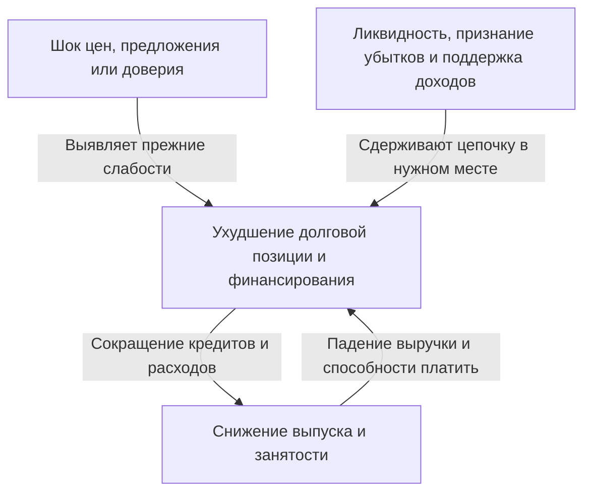
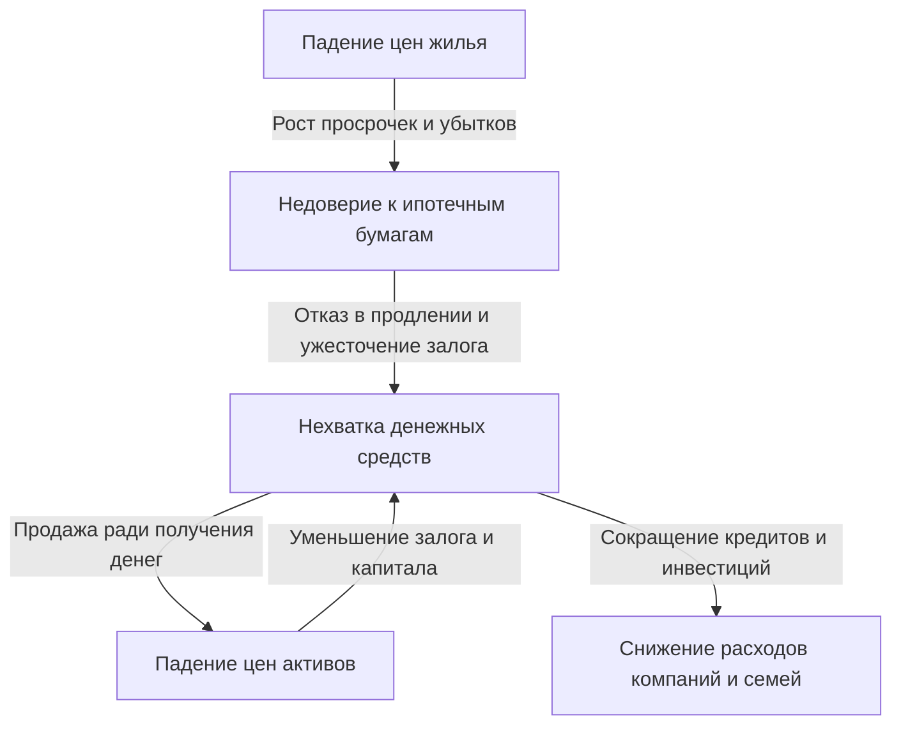

При упоминании краха Lehman Brothers банкротства банков, обвал акций и рост безработицы могут представляться единым событием. Но почему банкротство одной компании привело к сокращению производства на заводах по всему миру и падению доходов семей? И почему другое биржевое падение — «чёрный понедельник» 1987 года — не дало того же результата, что Великая депрессия 1930-х?

Чтобы понимать экономические потрясения, недостаточно помнить названия событий и даты. Что изменилось первым? Какие слабости накопились к тому моменту? От кого к кому передавались убытки и тревога? Разделив эти три вопроса, можно проследить внешне сложную историю как последовательность причин и следствий.

В статье рассматриваются 16 характерных событий с 1929 по 2023 год. Это не хронология всех кризисов во всех странах, а подборка для сравнения разных механизмов. «Экономический шок» здесь понимается широко: он включает не только финансовые кризисы, но и резкие изменения энергоснабжения, эпидемии и смену валютного режима. Там, где причины кризиса остаются предметом научной дискуссии, одна интерпретация не выдается за единственно верную.

## Сначала о различии между шоком и кризисом

Шок — это событие, резко меняющее исходные условия работы экономики. Прекращаются поставки нефти, дешевеет жильё, иностранные инвесторы выводят деньги. Кризис — состояние, при котором существующие институты и механизмы финансирования не справляются с изменением и перестают нормально работать сами основы экономической деятельности.

Это похоже на различие между тайфуном, слабостью дамбы и распространением затопления. Но в экономике даже действия, играющие роль дамбы, меняются по решениям людей. Если банк ради безопасности сокращает кредитование, компании могут разориться, а убытки банка — увеличиться. Защита, рациональная для каждого по отдельности, способна усиливать кризис для всех.

При шоке спроса уменьшаются расходы на покупки и инвестиции. При шоке предложения нехватка сырья или работников сокращает возможный выпуск либо повышает издержки. При финансовом шоке страдает посредничество в движении средств и обеспечении платежей. В реальных кризисах эти процессы накладываются друг на друга и меняют характер по ходу развития.

Стрелки на схеме не всегда действуют с одинаковой силой. Достаточный собственный капитал, устойчивое финансирование и институты, которым доверяют, позволяют ограничить цепную реакцию даже при появлении убытков. И наоборот, механизмы, выглядящие эффективными в спокойное время, в экстремальной ситуации могут одновременно стать слабостями.

## Сравнительная таблица для общей картины

| Период | Событие | Основная уязвимость и механизм передачи |
| --- | --- | --- |
| 1929 год — 1930-е | Великая депрессия | Банковские паники, сжатие кредита, дефляция, ограничения золотого стандарта |
| 1971 год | Никсоновский шок | Утрата доверия к обмену долларов на золото, смена валютного режима |
| 1973–1974 годы | Первый нефтяной шок | Резкие изменения предложения и цены нефти, отток доходов из стран-импортёров |
| Примерно 1978–1982 годы | Второй нефтяной шок и денежное ужесточение | Страх перебоев, инфляционные ожидания, адаптация к высоким ставкам |
| С 1982 года | Долговой кризис Латинской Америки | Валютный долг, плавающие ставки, нехватка валютных доходов |
| 1987 год | Чёрный понедельник | Однонаправленные сделки, проблемы рыночной ликвидности и расчётов |
| 1990-е годы | Крах пузыря в Японии | Падение стоимости залога, проблемные кредиты, затяжное погашение долгов |
| 1994–1995 годы | Валютный кризис в Мексике | Разворот потоков капитала, краткосрочный долг, выплаты с привязкой к доллару |
| 1997–1998 годы | Азиатский валютный кризис | Валютные и срочные несоответствия, отток капитала и банковский кризис |
| 1998 год | Российский кризис и кризис LTCM | Недоверие к госдолгу, бегство в надёжные активы, финансовый рычаг |
| Примерно 2000–2002 годы | Крах интернет-пузыря | Пересмотр ожиданий прибыли, сокращение акционерного финансирования и инвестиций |
| 2007–2009 годы | Мировой финансовый кризис и крах Lehman Brothers | Ипотечный кредит, секьюритизация, массовый уход краткосрочного финансирования |
| Первая половина 2010-х | Европейский долговой кризис | Взаимная зависимость доверия к банкам и государствам, слабости валютного союза |
| 2020 год | Пандемический шок | Одновременная остановка спроса и предложения из-за инфекции и изменения поведения |
| С 2021–2022 годов | Инфляционный и энергетический шок | Восстановление спроса, ограничения предложения, война и сырьевые рынки |
| 2023 год | Банковская нестабильность в США | Процентный риск, концентрация депозитов, стремительный отток средств |

Даты обозначают периоды, когда особенности кризисов проявлялись особенно ясно, а не общие для всего мира рецессии. Например, начало рецессии в США, нижняя точка японского делового цикла и минимум акций не совпадают. Выражение «кризис закончился» тоже означает разное: стабилизацию рынков, восстановление занятости или завершение урегулирования долгов.

## Обвал 1929 года и Великая депрессия: дело не только в потерях на акциях

Обвал американских акций осенью 1929 года стал символом Великой депрессии. Однако одним падением котировок нельзя объяснить последующий глубокий и продолжительный спад. Экономика США вступила в рецессию ещё до биржевого обвала, а последующие банковские паники дополнительно подорвали кредит и расходы.

Банки обещают возвращать депозиты в короткие сроки, но кредитуют компании и семьи на длительные. Если множество вкладчиков одновременно потребует наличные, банк может оказаться не в состоянии немедленно заплатить, даже если его активы не обесценились полностью. В США тогда ещё не существовало современной федеральной системы страхования вкладов.

Когда банкротства банков и отток депозитов распространяются, предприятиям сложнее занимать оборотные средства. Возникают трудности с зарплатами, закупкой сырья и поддержанием запасов, сокращаются занятость и производство. Безработица и падение доходов уменьшают потребление и ещё сильнее ослабляют способность компаний погашать долги. Так потери затрагивают даже семьи, не владевшие акциями.

Снижение цен не обязательно приносит облегчение. Если сумма долга зафиксирована номинально, падение выручки и зарплат делает его погашение тяжелее. Долг в 5 млн иен при годовом доходе 5 млн иен — не то же самое, что прежний долг в 5 млн при сократившемся до 3,5 млн доходе. Этот условный пример показывает, как дефляция и задолженность взаимно ухудшают положение.

Кроме того, при золотом стандарте защита доверия к обмену валюты на золото вступала в конфликт с внутренним денежным смягчением. Ужесточение ради предотвращения оттока золота могло усиливать дефицит средств во время спада. Дополнительный ущерб наносили протекционизм и ухудшение международных долговых отношений. [Исторические материалы Федеральной резервной системы](https://www.federalreservehistory.org/essays/banking-panics-1931-33) объясняют, как одновременный отток золота и изъятие депозитов давили на банки.

Урок Великой депрессии не состоит в том, что достаточно поддержать акции. Если рушатся платежи, кредитное посредничество и доверие к вкладам, потери финансовых активов превращаются в длительное повреждение производственного потенциала. Исследователи по-разному оценивают вес решений денежных властей и золотого стандарта, но сводить причины к одному дню биржевого падения слишком упрощённо.

## Никсоновский шок 1971 года: обещание обмена перестало быть устойчивым

В послевоенной Бреттон-Вудской системе многие валюты имели фиксированное соотношение с долларом, а США поддерживали обмен долларов иностранных денежных властей на золото при определённых условиях. Это не означало, что любой человек мог свободно обменять любую долларовую банкноту на золото.

Для роста торговли и международных финансов миру требовались доступные доллары. Но чем больше долларов накапливалось за рубежом, тем больше возникало сомнений в возможности обмена с учётом американского золотого запаса. Когда тревога усиливалась, держатели стремились раньше других получить золото, ещё больше расшатывая систему.

В августе 1971 года президент Никсон объявил, среди прочего, о приостановке конвертируемости доллара в золото. Затем последовали попытки сохранить систему через корректировку курсов, и в 1973 году основные валюты перешли к плавающим курсам. Поэтому представление, будто в один день 1971 года все фиксированные курсы мира одновременно исчезли, искажает последовательность событий. [Материал Federal Reserve History](https://www.federalreservehistory.org/essays/gold-convertibility-ends) раскрывает цели политики и процесс смены режима.

Для японских компаний это был переход к ситуации, в которой обменный курс стал крупным источником колебаний бизнес-планов. При той же долларовой экспортной выручке укрепление иены уменьшает сумму в иенах. Но затраты на импорт могут снизиться, поэтому влияние на экспортёров и импортёров различается.

Это прежде всего шок валютного режима и политики. Его не следует насильно относить к той же категории, что и волна банковских банкротств. Он показывает: фиксированное соотношение обмена стабилизирует сделки, но если условия поддержания обещания исчезают, последующая корректировка может оказаться значительной.

## Первый нефтяной шок 1973–1974 годов: резкий скачок производственных издержек

На фоне арабо-израильской войны 1973 года арабские нефтедобывающие страны ограничили поставки и ввели эмбарго против США и некоторых других государств, а цены на нефть резко выросли. Важно не смешивать ОАПЕК — организацию арабских производителей, участвовавших в эмбарго, — и более широкую ОПЕК. Сошлись меры по ограничению поставок, ценовая политика производителей и уже сильный мировой спрос. [Исторический обзор первого нефтяного шока](https://www.federalreservehistory.org/essays/oil-shock-of-1973-74) систематизирует этот фон.

Нефть — не только автомобильное топливо. Это ресурс для логистики, электроэнергетики, химического производства и многих других отраслей. Быстро перейти на другое топливо и оборудование трудно, поэтому даже небольшой дефицит объёма иногда вызывает большое движение цены. На рынке, где спрос и предложение слабо реагируют на цену, именно цена принимает на себя основную корректировку.

Чтобы получить прежний объём нефти, страна-импортёр должна отдавать за рубеж большую долю дохода. Если предприятия перекладывают затраты в цены, падает покупательная способность семей; если не могут — сокращается прибыль. Оба пути подрывают возможности потребления и инвестиций.

Здесь рост цен и ухудшение конъюнктуры могут происходить одновременно. Это стагфляция. Сильное стимулирование расходов в ответ на слабый спрос не создаёт немедленно дополнительную нефть и производственные мощности. И наоборот, жёсткое ужесточение исключительно ради цен усиливает удар по занятости.

Японские потрясения тоже нельзя исчерпывающе объяснить только нефтью. Влияли тогдашний спрос, финансовые условия и ожидания роста цен. Последующие энергосбережение и изменения структуры промышленности меняли устойчивость к аналогичному скачку импортных цен. Размер шока предложения определяется не только ценой ресурса, но и степенью зависимости от него.

## Второй нефтяной шок и переход к высоким ставкам: подавление инфляции тоже болезненно

Нарушение производства в ходе иранской революции 1978–1979 годов вновь потрясло нефтяной рынок. Однако рост цен нельзя объяснять как строго пропорциональный утраченной добыче. Страх дальнейшего сокращения поставок создавал спрос на накопление запасов. Опасения за будущее способны увеличивать текущий спрос. [Разбор второго нефтяного шока](https://www.federalreservehistory.org/essays/oil-shock-of-1978-79) рассматривает и сокращение предложения, и предупредительный спрос.

В экономике с уже длительной инфляцией компании и работники учитывают будущие подорожания при установлении цен и зарплат. Это не означает, что цены всегда растут исключительно из-за зарплат. На устойчивость инфляции влияют стоимость ресурсов, спрос, доверие к денежной политике и устройство контрактов.

В США при Поле Волкере, возглавившем ФРС в 1979 году, началось денежное ужесточение с приоритетом борьбы с инфляцией. Рост ставок сдерживает покупку жилья и инвестиции в оборудование, создавая тяжёлую нагрузку на выпуск и занятость. Спады около 1980 года и в начале 1980-х включали не только нефтяное подорожание, но и приспособление к повороту политики.

Денежное ужесточение не добывает нефть. Оно ограничивает расходы и кредит и пытается изменить ожидания того, что рост цен будет продолжаться долго. Поскольку оно не устраняет само ограничение предложения, дезинфляция обходится реальной экономике дорого. [История Великой инфляции](https://www.federalreservehistory.org/essays/great-inflation) помогает понять связь политических решений и цен.

При этом американское повышение ставок не ограничивается США. Для зарубежных стран и компаний, занявших в долларах, оно означало ухудшение условий обслуживания долга. Эта связь — ключ к пониманию следующего латиноамериканского долгового кризиса.

## Долговой кризис Латинской Америки с 1982 года: валюта и ставка долга становятся бременем

В 1970-е международные банки расширяли кредитование, в том числе за счёт средств, заработанных нефтедобывающими странами. Государства Латинской Америки также привлекали большие валютные займы. Но возможность занять и возможность погасить долг будущими валютными доходами — не одно и то же.

Долларовую задолженность нельзя погасить, просто выпуская национальную валюту. Доллары нужно получить через экспорт, иностранный приток капитала, имеющиеся резервы или другие источники. При плавающей ставке рост международных ставок увеличивает процентные платежи. Одновременно ослабление мировой экономики затрудняет рост экспорта и сырьевых доходов.

В августе 1982 года трудности Мексики с выплатой долга вывели кризис на поверхность, после чего многим странам пришлось реструктурировать задолженность. Международные банки держали крупные кредитные требования, поэтому проблема не ограничивалась странами-заёмщиками. [Материал о латиноамериканском долговом кризисе](https://www.federalreservehistory.org/essays/latin-american-debt-crisis) описывает события и со стороны кредиторов.

При остановке новых займов невозможно продолжать платежи, прежде поддерживавшиеся рефинансированием. Сокращение импорта помогает сберечь валюту, но если уменьшаются и поставки необходимых машин и комплектующих, страдает способность создавать будущий доход. Бюджетная корректировка, падение валют и банковские проблемы в ряде стран сложились в длительную стагнацию.

Урок не сводится к утверждению «долги плохи». Важно, в какой валюте долг, по какой ставке, когда он погашается и какие доходы обеспечивают выплаты. Даже общественно полезная долгосрочная инвестиция может остаться без денег на полпути, если сроки погашения и валютные поступления плохо согласованы.

## Чёрный понедельник 1987 года: рынок, на котором рассчитывали продать, теряет глубину

19 октября 1987 года индекс Dow Jones упал за день на 22,6%. Однако этот обвал не перешёл немедленно в американский банковский кризис или рецессию типа Великой депрессии. Это важный пример различия между резким падением цен и разрушением финансовых функций в целом.

Причиной была не одна новость. Сочетались опасения по поводу дорогих акций, тревога о ставках и валютных курсах, а также устройство рынка. «Портфельное страхование», предполагающее продажу фьючерсов и других инструментов при падении для ограничения потерь, также рассматривается как усилитель продаж. Слово «страхование» в названии не обязательно означает, что кто-то безусловно возместит убыток.

Чтобы один инвестор уменьшил риск продажей, нужен покупатель. Если многие участники одновременно реагируют на одно изменение цены одинаковой продажей, заявок на покупку по прежним ценам не хватает. Тогда цена падает дальше, вызывая следующую волну продаж.

Различия в торговле и расчётах между акциями, фьючерсами и опционами дополнительно усложняли потребность в деньгах. Даже если сделки взаимно компенсируются на бумаге, несовпадение дат платежа требует наличных на промежуточный период. [Federal Reserve History](https://www.federalreservehistory.org/essays/stock-market-crash-of-1987) рассматривает эти особенности структуры рынка и поддержку ликвидности.

Готовность центрального банка предоставлять ликвидность и продолжение кредитования финансовыми учреждениями помогли сдержать цепную реакцию. Отсюда следует, что одной глубиной падения акций кризис не измерить. Значение одного и того же ценового изменения зависит от того, кто несёт убытки, сколько у него долгов и насколько важен он для платежей и кредитования.

## Крах японского пузыря: земля, банки и балансы предприятий были связаны

Во второй половине 1980-х в Японии резко дорожали акции и земля. Сочетались денежное смягчение, поведение банков в условиях финансовой либерализации, кредиты под землю и ожидания дальнейшего роста. Вместо объяснений «только соглашением Плаза» или «только низкими ставками» нужно рассматривать взаимное влияние кредита и цен активов.

Когда земля дорожает, под тот же участок можно занять больше. Если деньги идут на покупку недвижимости, цены растут дальше. Когда кредитование всё больше опирается не на будущий доход, а на возможность дороже продать залог, рост цены сам начинает поддерживать заимствования.

После денежного ужесточения и ограничений кредитования недвижимости, когда в 1990-е цены активов упали, механизм развернулся. У предприятий остались долги, взятые при покупке, а залог и принадлежащие им активы подешевели. У банков накапливались трудно возвратные кредиты — проблемная задолженность. [Исследование пузыря Банком Японии](https://www.imes.boj.or.jp/research/abstracts/english/me14-1-6.html) изучает связь кредита с землёй и акциями.

Если убытки уменьшают собственный капитал банка, новые кредиты выдавать труднее. Одновременно предприятия даже при снижении ставок предпочитают возвращать долги, а не инвестировать. Кредиторы и заёмщики сокращают расходы с обеих сторон, поэтому одного понижения ставки может не хватить для прежнего восстановления инвестиций.

Задержки в признании проблем и урегулировании убытков могут приводить к одновременному продолжению кредитования слабых компаний и нехватке средств у перспективных. Финансовая нестабильность 1997–1998 годов показала, что уязвимость банковской системы сохранялась после падения активов. Банк Японии рассматривает [дефляцию и балансовую корректировку с 1990-х](https://www.boj.or.jp/en/about/press/koen_2024/ko240527b.htm) как важные предпосылки затяжной стагнации.

Однако всё последующее развитие японской экономики нельзя свести к одному краху пузыря. Значение имели демография, производительность, международная конкуренция и политика. Главное здесь: если падение активов остаётся на балансах, поведение компаний и банков не возвращается мгновенно к прежнему даже при временном отскоке акций.

## Валютный кризис Мексики 1994–1995 годов: без рефинансирования трудно защищать валюту

В 1994 году приток иностранного капитала в Мексику стал нестабильным на фоне политической неопределённости, повышения ставок в США и других факторов. Страна с дефицитом текущего счёта должна покрывать его притоком средств или другими источниками. Дефицит не всегда означает кризис, но внезапная остановка притока делает корректировку болезненной.

Валютные резервы можно расходовать на поддержку курса, но они ограниченны. Тесобонос, выпуск которых расширило правительство, представляли собой краткосрочный долг с привязкой суммы погашения к доллару. Мера, избавлявшая инвесторов от части опасений обесценения песо, увеличивала валютный риск и риск рефинансирования государства.

Смена курсовой политики в декабре 1994 года не смогла достаточно восстановить доверие, и песо резко упал. Бремя долларово-привязанного долга в национальной валюте выросло, а готовность инвесторов рефинансировать его стала неотложным вопросом. [Тогдашний анализ МВФ](https://www.imf.org/en/news/articles/2015/09/28/04/53/spmds9508) отмечает уязвимость краткосрочного финансирования и структуры долга.

Ослабление валюты может помогать экспорту, но одновременно утяжеляет обязательства, привязанные к иностранной валюте. Именно удар по балансам делает недостаточным объяснение «снизить курс — вернуть конкурентоспособность — решить проблему». Если положение компаний и банков ухудшается, трудно найти даже средства для расширения экспорта.

Этот кризис показывает важность не только общей суммы госдолга, но и того, сколько предстоит вернуть в ближайшие месяцы. Одинаковый долг, распределённый на длительный срок или сосредоточенный в коротком периоде, даёт разную устойчивость к потере доверия.

## Азиатский валютный кризис 1997–1998 годов: частный валютный долг потрясает всю экономику

В июле 1997 года Таиланд отказался поддерживать курс бата, после чего кризис распространился на Индонезию, Южную Корею и другие страны. Но институты и слабости стран различались. Объяснение всего чрезмерными государственными расходами также упускает заимствования частных компаний и банков.

Многие операции строились на краткосрочных займах в долларах или других валютах для долгосрочных внутренних проектов и недвижимости. Различие валюты погашения и валюты доходов — валютное несоответствие; различие срока погашения и срока возврата вложений — несоответствие сроков. Пока курс стабилен и долг перекредитуется, слабости такого сочетания легко остаются незаметными.

Но когда инвесторы спешат вернуть средства, спрос на иностранную валюту растёт, а национальная дешевеет. Её падение увеличивает бремя валютного долга и тревогу о компаниях. Тревога вызывает новый отток, так что курс и способность платить взаимно ухудшаются. [Исследование финансового сектора МВФ](https://www.imf.org/external/pubs/ft/op/opfinsec/index.htm) связывает банковские и корпоративные слабости с валютным режимом.

Например, компания, занявшая 1 млн долларов при курсе 100 единиц местной валюты за доллар, имеет основную сумму долга, равную 100 млн местных единиц. После падения курса до 150 за доллар та же долларовая сумма равна 150 млн. Если выручка остаётся в местной валюте, бремя увеличивается без единого нового займа. Экспортные доходы и валютное хеджирование меняют результат, поэтому это условный пример незащищённой позиции.

Высокие ставки для защиты валюты могут сдерживать отток, но вредят внутренним заёмщикам. Разрешить падение курса — значит ухудшить валютные долги. Антикризисные решения принимались в этой сложной комбинации; споры об условиях помощи МВФ и уместности бюджетной и денежной политики продолжаются.

Передача кризиса через границы происходит не автоматически из-за соседства. Каналами могут быть общие банки-кредиторы, совпадающие экспортные рынки или восприятие экономик инвесторами как похожих. Общий кредитор, понёсший убытки, иногда забирает деньги и из страны с небольшими собственными проблемами.

## Россия и LTCM в 1998 году: даже распределённые сделки могут убыточно сработать одновременно

В России 1998 года сочетались слабость бюджета и сбора налогов, низкие сырьевые цены и сомнения в финансировании. В августе были объявлены, среди прочего, девальвация рубля и реструктуризация внутреннего государственного долга. Представление о безусловной безопасности государственных обязательств пошатнулось, а инвесторы по всему миру стали больше ценить надёжность и возможность быстро продать актив.

На этом фоне тяжёлые потери понёс хедж-фонд Long-Term Capital Management, LTCM. Если понимать его стратегию просто как инвестиции в российские облигации, масштаб проблемы останется неясным. Существенно то, что фонд с большим финансовым рычагом совершал, в частности, сделки в расчёте на сближение цен похожих финансовых инструментов.

Небольшая в обычное время разница цен приносит прибыль при крупном объёме сделок. Но в кризис, когда участники концентрируются на легко продаваемых активах, разница не сужается, а расширяется. Даже если прогноз её будущего возвращения верен, требование дополнительного залога до этого момента не позволяет ждать бесконечно.

Размещение сделок на разных рынках даёт слабую реальную диверсификацию, если все они опираются на одно условие — сохранение рыночной ликвидности. Повышение корреляций в кризис означает не только изменение математической величины, но и то, что множество людей продают одновременно по одной причине.

Федеральный резервный банк Нью-Йорка содействовал переговорам заинтересованных финансовых учреждений, а капитал предоставили частные организации. Это не следует путать с прямым вливанием государственных денег в LTCM самим резервным банком. [Свидетельство тогдашнего главы ФРБ Нью-Йорка](https://www.newyorkfed.org/newsevents/speeches/1998/mcd981001.html) объясняет распределение ролей. Долгосрочная стоимость, которую предсказывает модель, и деньги для завтрашнего платежа — разные вопросы.

## Крах интернет-пузыря: реальность технологии не гарантирует правильность цены акций

Во второй половине 1990-х деньги устремились в ИТ- и телекоммуникационные компании на ожиданиях, что интернет преобразит промышленность. Технологические изменения действительно были огромными. Но распространение общественно полезной технологии не означает, что каждая компания получит высокую прибыль.

Стоимость компании зависит от будущих прибылей и денежных потоков и от того, насколько они дисконтируются к сегодняшнему дню. Если внимание сосредоточено только на размере рынка, а расходы на привлечение клиентов, конкуренция, сжигание денег и дополнительные инвестиции недооцениваются, даже небольшое снижение ожидаемого роста резко меняет оценку.

С 2000 года пересмотр завышенных ожиданий прибыли осложнил привлечение акционерного капитала, и предприятия сокращали персонал и капитальные расходы. Корректировались и чрезмерные вложения, например в телекоммуникационное оборудование. Помимо уменьшения богатства семей из-за падения акций действовал канал сокращения средств для продолжения бизнеса. [Годовой отчёт ФРС за 2001 год](https://www.federalreserve.gov/boarddocs/rptcongress/annual01/ar01.pdf) фиксирует тогдашние изменения инвестиций и финансов.

Также неточно считать, что американская рецессия 2001 года началась исключительно с сентябрьских терактов. Ослабление экономики произошло раньше, а теракты дополнительно ударили по спросу, включая поездки, и усилили неопределённость. Накладывающиеся шоки нужно читать, различая их последовательность.

По сравнению с кризисом 2008 года, сосредоточенным на жилищном финансировании, большую долю убытков несли акционеры, а механизм усиления через банки и краткосрочные рынки был иным. Падение акций не обязывает компанию вернуть инвестору прежнюю сумму, тогда как у долга обязанность погашения сохраняется. Это различие финансирования влияет на то, насколько глубоким финансовым кризисом станет разочарование в технологии.

## Крах Lehman Brothers: ипотечные потери остановили краткосрочный денежный рынок

### Кризис не начался внезапно в сентябре 2008 года

Событие, которое в Японии называют «шоком Lehman», символизирует банкротство американского инвестиционного банка Lehman Brothers 15 сентября 2008 года. Но проблемы жилья в США и связанных финансовых инструментов развивались раньше. Уже в 2007 году проявилась напряжённость краткосрочных рынков, а весной 2008-го произошёл кризис Bear Stearns.

Рост цен жилья успокаивал и заёмщиков, и кредиторов. Надежда продать дом или рефинансировать кредит при затруднении выплат поддерживала кредитование. Но после падения цен всё чаще продажа не покрывала долг, а предпосылки рефинансирования исчезали. [Объяснение кризиса субстандартной ипотеки](https://www.federalreservehistory.org/essays/subprime-mortgage-crisis) раскрывает взаимодействие кредитной экспансии и цен жилья.

Недостаточно сказать: «кредиты брали люди с низкой способностью платить». Без анализа проверки заёмщиков, стимулов секьюритизации, оценок инвесторов, капитала финансовых организаций и способов их финансирования не объяснить, почему локальные невозвраты превратились в глобальный кризис.

### Секьюритизация не уничтожает риск

Основной принцип секьюритизации — объединить ипотечные кредиты и распределить поступления от их погашения между инвесторами. Разделение приоритетов выплат позволяет создать части, первыми принимающие убыток, и части, затрагиваемые позже. Но суммарный убыток от этого не исчезает.

Смешение кредитов разных регионов распределяет специфические местные риски. Однако если жильё одновременно дешевеет на большой территории, а безработица и трудности рефинансирования становятся общими, дефолты сильнее связаны друг с другом. Даже части с высоким рейтингом могут понести потери при разрушении исходных предпосылок.

Кроме того, усложнение продуктов затрудняет понимание того, у кого в конечном счёте находятся конкретные убытки. Даже при небольших собственных потерях незнание состояния контрагента даёт причину не предоставлять ему деньги. Проблемой был не только размер убытков, но и неопределённость их распределения.

### Остановка краткосрочного финансирования вынуждает продавать активы

Инвестиционные банки и другие организации держали активы с длительным возвратом средств за счёт репо и краткосрочных бумаг. Репо по своим свойствам близко к краткосрочному финансированию под залог ценных бумаг. Пока его можно каждый раз возобновлять, схема работает; отказ кредитора продлить её создаёт немедленную потребность в деньгах.

Если под залог стоимостью 100 раньше можно было занять 95, а при возросшей осторожности — только 80, разницу 15 приходится находить отдельно. Это условный пример механизма. Если одновременно дешевеет сам залог, потребность в наличных возрастает ещё сильнее.

Продажа активов для получения денег снижает рыночные цены. Другие учреждения тоже сталкиваются с обесценением портфелей и требованиями дополнительного залога и вынуждены продавать. Хотя вкладчики не стоят в очереди у банковского окна, структура напоминает набег: поставщики краткосрочных денег одновременно уходят.

### Проблемы финансового квартала доходят до заводов и семей

После банкротства Lehman резко усилились недоверие к контрагентам и нарушения краткосрочных рынков. Потребовались разнообразные меры: помощь AIG, увеличение капитала финансовых учреждений, ликвидность центральных банков. [Обзор мирового финансового кризиса](https://www.federalreservehistory.org/essays/great-recession-and-its-aftermath) систематизирует путь от жилья к финансовому сектору и реальной экономике.

Когда банки сокращают кредиты, компаниям трудно найти деньги не только на оборудование, но и на текущие платежи. Семьи, помимо потерь стоимости жилья и акций, из-за тревоги о работе откладывают покупки товаров длительного пользования. Поэтому снижение заказов достигает даже экспортёров, непосредственно не владевших финансовыми продуктами. В сильном ударе по Японии сыграли роль сжатие мирового спроса и торговли.

О том, какой вес придать низким ставкам, международным потокам капитала, регулированию и надзору, системе вознаграждений и другим факторам, идут споры. Но сочетание ипотечных убытков, большого рычага, краткосрочного финансирования и непрозрачности риска необходимо для понимания кризиса. Банкротство Lehman было важной точкой усиления, а не созданием всех накопленных проблем одной компанией.

## Европейский долговой кризис: государства и банки ослабляют друг друга

С конца 2009-го в 2010 год усиливались сомнения в греческих государственных финансах, затем недоверие распространилось на несколько стран еврозоны. Но греческую бюджетную проблему нельзя автоматически переносить на все страны. В Ирландии и Испании особенно важны были недвижимость и банки.

Когда доверие к государству снижается и его облигации дешевеют, страдают держащие их банки. Если государство берёт на себя дополнительные расходы на спасение банков, растут сомнения в его собственных финансах. Взаимная поддержка доверия между банками и государством превращается во взаимное ослабление.

Участники еврозоны используют общую валюту и не могут по отдельности девальвировать национальную валюту или устанавливать собственную ключевую ставку. При этом в начале кризиса банковский надзор, урегулирование банкротств и бюджетное разделение рисков были недостаточно интегрированы. Институты разрешения кризисов отставали от валютной интеграции.

Удорожание рефинансирования повышает процентные платежи и ещё больше ухудшает устойчивость долга. Высокие ставки, вызванные тревогой, способны приблизить её осуществление. Но не всё было беспочвенной психологией: значение имели долги, производительность и банковские слабости отдельных стран. [Анализ кризиса ЕЦБ](https://www.ecb.europa.eu/press/key/date/2018/html/ecb.sp180511.en.html) объясняет национальные различия и институциональные уроки.

Бюджетная экономия направлена на восстановление доверия к долгу, но резкое сокращение расходов в спаде уменьшает доходы и налоговые поступления. Помощь, со своей стороны, ставит вопросы о распределении потерь и предотвращении будущих чрезмерных займов. Действия ЕЦБ, механизмы финансовой помощи и движение к банковскому союзу должны были разорвать эти порочные круги.

## Пандемический шок 2020 года: первыми остановились не финансовые продукты, а деятельность

Распространение COVID-19 одновременно ограничило передвижение, очные услуги, работу офисов и заводов. Экономическую активность снижали не только административные запреты, но и добровольное избегание заражения, изменения поведения и отсутствие работников. Начальная причина отличалась от обычного банковского кризиса.

На стороне предложения люди не могли работать, детали не прибывали, логистика задерживалась. На стороне спроса падали расходы на поездки, питание вне дома и развлечения, покупки откладывались из-за тревоги о доходах и будущем. Спрос также смещался от услуг к товарам, поэтому не все отрасли двигались в одном направлении. [Ранний анализ МВФ](https://www.imf.org/en/Blogs/Articles/2020/03/09/blog030920-limiting-the-economic-fallout-of-the-coronavirus-with-large-targeted-policies) разделяет стороны спроса и предложения.

Даже при внезапной остановке выручки аренда и долговые платежи продолжаются. В принципе жизнеспособная компания может обанкротиться, когда закончатся деньги. Тогда временная остановка превращается в длительный ущерб из-за потери трудовых отношений и сети контрагентов. Политика должна была помочь компаниям и семьям пережить период остановки.

Снижение ставки не устраняет напрямую заражение или нехватку деталей. Требуется сочетать медицинские и санитарные меры с поддержкой доходов, сохранением рабочих мест и финансированием. На финансовых рынках тоже резко вырос спрос на наличные, поэтому важно было не допустить превращения реального шока в финансовую дисфункцию.

Восстановление также неоднородно. Возвращение спроса не гарантирует, что закрытые мощности, персонал и международная логистика восстановятся с той же скоростью. Начальная проблема «недостаточно спроса» может перейти в проблему «отдельные виды предложения не успевают». Это важно для понимания следующей инфляционной фазы.

## Инфляционный и энергетический шок с 2021–2022 годов: наложение нескольких ограничений

Послепандемическая инфляция не возникла из одной причины. Совпали восстановление и изменение состава спроса, сбои поставок, изменения предложения труда, бюджетные и денежные условия разных стран. Их относительный вес менялся по странам и периодам; одно объяснение для США и Европы упускает существенные различия.

Энергетические рынки стали напряжёнными ещё в 2021 году. Вторжение России в Украину в феврале 2022-го дополнительно потрясло рынки газа, нефти и электроэнергии. Война, сокращение поставок, санкции и торговые риски изменили маршруты и издержки. [Обзор Международного энергетического агентства](https://www.iea.org/topics/2022-energy-crisis) различает напряжённость до вторжения и её последующее усиление.

Особенно для газа нужны трубопроводы, мощности сжижения, суда и приёмные терминалы. Нехватку в одном регионе не всегда можно немедленно закрыть ресурсами другого. Наличие ресурса на планете не тождественно возможности доставить его в нужное место в нужный момент. Эти физические ограничения усиливают экономические колебания цен.

В странах — импортёрах энергии рост импортных цен увеличивает издержки предприятий и стоимость жизни семей. Субсидии и сдерживание цен могут облегчить краткосрочное бремя, но увеличивают бюджетные расходы, а при некоторых конструкциях ослабляют стимулы экономить. Важно, кого и как долго поддерживать.

Центральные банки повысили ставки, чтобы не допустить закрепления инфляции. Но ставка не увеличивает напрямую поставки газа. Воздействуя на цены через спрос и ожидания, она одновременно сдерживает жильё и инвестиции и вызывает потери по существующим финансовым активам. Падение темпа инфляции означает замедление роста цен, а не обязательно возвращение стоимости жизни на прежний уровень.

## Банковская нестабильность США 2023 года: у надёжных облигаций тоже есть процентный риск

Банкротство Silicon Valley Bank, SVB, в марте 2023 года показало, что банковские кризисы возникают не только из-за плохой ипотеки. Сочетались процентный риск долгосрочных облигаций, концентрация вкладчиков и зависимость от крупных депозитов, не полностью покрытых страхованием.

Облигация с фиксированными выплатами процентов обычно дешевеет при росте рыночных ставок. Если новые облигации приносят больше, старой низкодоходной бумаге труднее найти покупателя без снижения цены. Даже актив с небольшим кредитным риском, например государственная облигация, не имеет неизменной цены продажи до погашения.

Значение убытка различается, если можно держать бумагу до срока или приходится продавать её ради сегодняшнего оттока депозитов. Учётная категория меняет момент признания потерь, но не отменяет рыночную цену срочной продажи. На первый план выходит базовая банковская структура: долгосрочные активы финансируются вкладами, которые можно быстро забрать.

В SVB клиенты были сосредоточены, в частности, в технологической отрасли, поэтому их потребности в деньгах и решения могли двигаться одинаково. Онлайн-переводы и обмен информацией ускоряют набег. Но объяснение только социальными сетями упускает прежние слабости управления активами и пассивами и надзора. [Проверка ФРС](https://www.federalreserve.gov/publications/2023-April-SVB-Key-Takeaways.htm) рассматривает и менеджмент, и надзор.

В том же году тревога затронула другие банки, но их активы и клиентская структура различались. Вместо представления о точном повторении ипотечного кризиса 2008 года полезнее выяснить, кто и каким образом был подвержен резкой смене ставок. Это позволяет понять именно нынешнюю уязвимость.

## Четыре механизма, связывающие историю

### Чем тоньше собственный капитал, тем сильнее небольшое падение цены

Обозначим активы через $A$, обязательства через $D$, собственный капитал через $E$. В упрощённом балансе получим:

$$
E=A-D,\qquad L=\frac{A}{E}
$$

$L$ — используемое здесь определение финансового рычага. При активах 100, обязательствах 95 и капитале 5 он равен 20. Если стоимость обязательств неизменна, а активы уменьшаются на 3, капитал падает с 5 до 2. Активы потеряли 3%, но собственный капитал — 60%. В расчёте опущены налоги, хеджирование, состав активов и другие детали, однако усиление потерь видно наглядно.

Если смотреть только на период стабильных цен активов, большой рычаг кажется эффективным. Но при усилении колебаний для защиты капитала нужны продажи и сокращение кредитов, которые могут увеличивать чужие потери. Этот взгляд связывает японский пузырь, LTCM и мировой финансовый кризис.

### Ликвидность и платёжеспособность различаются, но влияют друг на друга

Проблема платёжеспособности означает, что обязательства слишком велики по сравнению с будущими поступлениями от активов и доходов. Проблема ликвидности означает, что даже при наличии активов, которые в итоге вернут деньги, сейчас не хватает средств на необходимые платежи. Поэтому прибыльная компания иногда разоряется из-за кассового разрыва.

Если центральный банк или другой источник закрывает временный дефицит, может не потребоваться распродажа хороших активов по бросовым ценам. Но если их стоимости действительно недостаточно, дополнительное кредитование не уничтожает сам убыток. Нужны капитализация, реструктуризация долга, реорганизация деятельности и другие меры.

В действительности быстро различить эти состояния сложно, а вынужденные продажи из-за неликвидности сами могут уничтожить платёжеспособность. И наоборот, подозрения в убытках вызывают отток депозитов. Крайности «деньги обязательно всё решат» и «убыточного обязательно надо оставить без помощи» не улавливают этого взаимодействия.

### Валюта и процентные условия договора создают неожиданные обязательства

Стоимость валютного долга в национальной валюте упрощённо выражается так:

$$
D_{\mathrm{home}}=eD_{\mathrm{foreign}}
$$

Здесь $e$ — количество национальной валюты для покупки одной единицы иностранной. Если национальная валюта дешевеет и $e$ растёт, бремя увеличивается даже при неизменной валютной основной сумме. Но при наличии валютных доходов или хеджирования необходимо учитывать их компенсирующее действие.

Цену облигации с фиксированными процентными выплатами, в свою очередь, можно рассматривать как будущие платежи, приведённые к настоящему. В простой модели, где купон за период равен $C$, основная сумма при погашении — $F$, число оставшихся периодов — $T$, а постоянная ставка дисконтирования — $y$, имеем:

$$
P=\sum_{t=1}^{T}\frac{C}{(1+y)^t}+\frac{F}{(1+y)^T}
$$

При прочих равных рост $y$ снижает $P$. В реальности ставки различаются по срокам, существуют кредитный риск и досрочное погашение, поэтому одной формулой нельзя оценить все бумаги. Но она показывает, почему рост ставок может повышать доходность новых кредитов и одновременно уменьшать стоимость старых долгосрочных облигаций.

### Международные связи передают и выгоды, и потрясения

Кризисы распространяются через торговлю, финансы и общие цены. Если рецессия одной страны сокращает импорт, страдают заводы экспортёров. Убытки глобального банка могут уменьшить кредитование даже в кажущейся не связанной с ним стране. Изменения нефтяных цен или долларовых ставок достигают многих стран одновременно.

Различие важно для выбора мер. Если у предприятия упали экспортные заказы, одна капитализация банков их не вернёт. Если заказы есть, но нельзя занять оборотные деньги, восстановление финансового канала полезно. Внутри выражения «мировой спад» нужно различать, какой именно путь перестал работать.

## Почему у экономической политики нет универсального лекарства

Если главная проблема — недостаток спроса, денежное смягчение и бюджетные расходы способны поддержать занятость и выпуск. Но при жёстких ограничениях предложения увеличение одного спроса без роста предложения может усилить инфляцию. С другой стороны, шок предложения не означает, что ничего делать не следует: адресную помощь наиболее пострадавшим семьям и предприятиям можно рассматривать отдельно.

При банковском кризисе нужно отличать защиту платежей и доверия к вкладам от безусловного спасения руководителей и инвесторов. Важна конструкция распределения потерь: условия вливания капитала, участие акционеров и определённых кредиторов в убытках, сохранение важных функций при реорганизации бизнеса.

Чрезмерный риск в расчёте на помощь называется моральным риском. Но отказ от любой поддержки в разгар кризиса может втянуть семьи и предприятия, не создавшие проблему. Поэтому требования к капиталу и ликвидности, раскрытие информации и подготовка процедур урегулирования в спокойное время должны рассматриваться вместе с кризисной помощью.

Бюджетные возможности тоже определяются не одним объёмом долга. Важны национальная или иностранная валюта, ставки и сроки, налоговая база, институциональные отношения с центральным банком и доверие к политике. Но долг в собственной валюте не означает возможности безгранично и бесплатно тратить: остаются ограничения через цены, курс и реальные ресурсы.

Оценивать антикризисную политику трудно ещё и потому, что нельзя непосредственно наблюдать вариант «ничего не делать». Ухудшение после помощи не обязательно доказывает её бесполезность, а восстановление не означает, что оно целиком вызвано политикой. Нужна проверка с учётом других стран, временных лагов, исходных условий и институциональных различий.

## Вопросы для чтения следующей экономической новости

Увидев новость о новом шоке, сначала выясните, какая цена или количество изменились. Акции, нефть, курс, ставки и экспортные заказы непосредственно затрагивают разных участников. Затем спросите, чьи активы уменьшились и чьи обязательства или платежи выросли.

Далее проверьте, есть ли капитал для поглощения потерь, много ли долга нужно скоро погасить, совпадают ли валюты доходов и обязательств, не сосредоточены ли участники с одинаковым поведением. Эти вопросы относятся не только к банкам, но и к фондам, компаниям, государствам и семьям.

Затем уточните, на что направлена политика: нехватку денег, урегулирование убытков, недостаток спроса или предложения. Одинаковое название меры не гарантирует одинаковых эффектов и побочных последствий, если различаются проблемы. Возвращение акций к докризисным котировкам и восстановление жизни людей тоже не одно и то же.

Эти вопросы не являются способом предсказывать дату обвала. Найденная уязвимость не делает кризис неизбежным: политика и частная адаптация могут его предотвратить. История учит не столько угадывать дату, сколько понимать, при каком событии и по какому пути распространятся потери.

Великая депрессия и пандемический шок сильно различались исходной причиной. Первый нефтяной шок и крах Lehman тоже имели разные центральные ограничения. И всё же повторяются три обстоятельства: доходы падают, а обещания платить остаются; краткосрочные деньги не тождественны долгосрочной стоимости; одновременная самозащита многих людей способна расшатать целое.

История экономических потрясений — не просто перечень неудач. Это история того, при каких условиях работают обещания между людьми, компаниями и государствами и когда им нужна опора. Если видеть устройство этих обещаний, за заголовком «снова крупный обвал» различимы и особенности нынешнего события, и механизмы, пришедшие из прошлого.

## Как читать источники

В тексте даны прямые ссылки на открытые материалы Федеральной резервной системы, МВФ, Банка Японии, ЕЦБ и МЭА рядом с соответствующими вопросами. Запись событий в историческом источнике следует отличать от оценки собственных действий органами экономической политики. Особенно оценки её эффективности и относительного веса причин кризиса могут зависеть от позиции источника.

Числовые примеры балансов, валютных курсов и залога условны и объясняют механизм, а не воспроизводят показатели конкретного банка или страны. Кроме того, годовые отчёты и анализы, опубликованные во время кризиса, содержат тогдашние прогнозы: их не следует путать с позднее установленными фактическими результатами.
