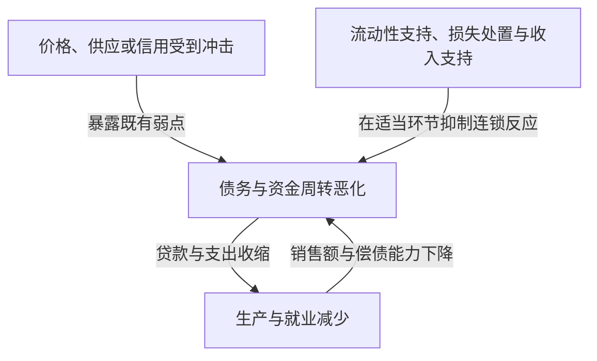
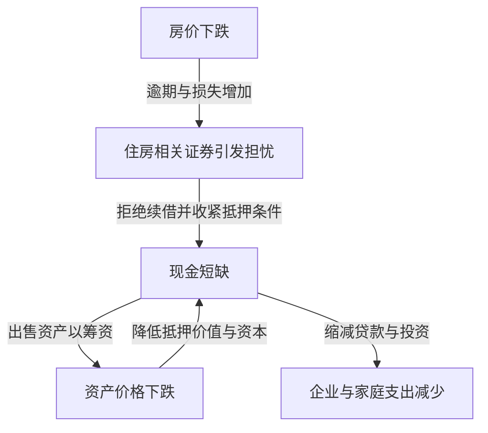

听到雷曼危机，人们可能把银行倒闭、股价暴跌和失业增加看成同一件事。但一家企业破产，为什么会导致世界各地工厂减产、家庭收入下降？同样是股市崩盘，1987年的黑色星期一为什么没有造成与1930年代大萧条相同的后果？

理解经济冲击，不能只记住名称与年份。最先发生了什么变化？此前积累了哪些弱点？损失和恐慌从谁传到了谁？把这三个问题分开，就能沿着因果关系梳理看似复杂的历史。

本文选取1929年至2023年的16场代表性事件。这不是覆盖所有国家和地区危机的年表，而是为了比较不同机制所作的选择。这里广义使用“经济冲击”，不仅包括金融危机，也包括能源供应骤变、传染病和货币制度变化。对于学术上仍有争论的成因，我们不会把某一种解释视为唯一答案。

## 首先理解冲击与危机的区别

冲击是突然改变经济运行前提的事件，例如原油供应中断、房价下跌、外国投资者撤资。危机则是既有制度与资金周转无法吸收这些变化，连经济活动的基础功能都发生故障的状态。

这类似于区分台风本身、堤坝的薄弱和洪水的扩散。但在经济中，相当于堤坝的行为也会随人的判断改变。银行为了安全缩减贷款，可能使企业倒闭，反过来增加银行损失。个体合理的防御，可能在整体上放大危机。

需求冲击表现为购买与投资支出减少。供给冲击表现为原料、劳动力不足，产量减少或成本上升。金融冲击则损害资金中介与支付衔接功能。实际危机中，这些因素往往重叠，性质也可能在过程中改变。

图中各条箭头并非总以相同强度发挥作用。充足资本、稳定融资与可信制度，可以让损失发生后的连锁反应变小。反过来，平时看似高效的安排，也可能在极端情况下同时成为弱点。

## 把握全貌的比较表

| 时期 | 事件 | 核心弱点与传导机制 |
| --- | --- | --- |
| 1929年至1930年代 | 大萧条 | 银行恐慌、信用收缩、通缩与金本位约束 |
| 1971年 | 尼克松冲击 | 美元兑金承诺的信任下降、货币制度转型 |
| 1973—1974年 | 第一次石油危机 | 石油供应与价格骤变、进口国收入外流 |
| 约1978—1982年 | 第二次石油危机与货币紧缩 | 供应忧虑、通胀预期、对高利率的调整 |
| 1982年以后 | 拉美债务危机 | 外币债务、浮动利率与外汇收入不足 |
| 1987年 | 黑色星期一 | 同向交易、市场流动性与结算问题 |
| 1990年代 | 日本泡沫破裂 | 抵押品价格下跌、不良贷款、长期偿债调整 |
| 1994—1995年 | 墨西哥货币危机 | 资本流入逆转、短期债务、美元挂钩偿付负担 |
| 1997—1998年 | 亚洲金融危机 | 币种与期限错配、资本外流与银行危机 |
| 1998年 | 俄罗斯危机与LTCM危机 | 政府债务疑虑、避险交易与杠杆 |
| 约2000—2002年 | 互联网泡沫破裂 | 盈利预期修正、股权融资与资本支出收缩 |
| 2007—2009年 | 全球金融危机与雷曼危机 | 住房信贷、证券化、短期融资挤兑 |
| 2010年代前期 | 欧洲债务危机 | 银行与政府信用联动、货币联盟制度弱点 |
| 2020年 | 疫情冲击 | 感染与行为变化使供需同时停顿 |
| 2021—2022年及以后 | 通胀与能源冲击 | 需求恢复、供应约束、战争扰乱资源市场 |
| 2023年 | 美国银行业动荡 | 利率风险、存款集中、资金迅速流出 |

表中时期指危机特征较明显的阶段，并非全球统一的衰退期间。例如美国衰退的起点、日本经济的谷底与股价最低点并不重合。“危机结束”也可能分别指金融市场稳定、就业恢复或债务处置完成，含义并不相同。

## 1929年股市崩盘与大萧条：股票损失并不是全部

1929年秋美国股市崩盘，是大萧条的标志性事件。但仅靠股价下跌，无法解释随后严重且漫长的低迷。美国经济在崩盘之前已进入衰退，之后的银行恐慌进一步损害信用与支出。

银行一方面承诺在较短时间内偿还存款，另一方面却向企业和家庭发放长期贷款。如果许多储户同时索取现金，即使资产并非全部毫无价值，也可能无法立即支付。当时美国尚无今天这样的联邦存款保险制度。

银行倒闭与存款流失扩散后，企业更难借到营运资金，支付工资、购买原料和维持库存都变得困难，就业与生产随之减少。失业和收入下降又压低消费，进一步削弱企业偿债能力。这个过程会让没有持有股票的家庭也蒙受损失。

物价下跌也不一定是救济。如果债务名义金额固定，销售收入和工资越低，偿还就越吃力。年收入500万日元、负债500万日元，与收入降到350万日元、债务仍为500万日元，负担明显不同。这只是说明机制的假设例子，却展示了通缩与债务互相恶化的过程。

金本位还使维护货币兑金信任与国内货币宽松发生冲突。为阻止黄金外流而收紧政策，有时会在衰退中进一步加剧资金紧张。保护主义和国际债务关系也叠加了恶化因素。[美联储历史资料](https://www.federalreservehistory.org/essays/banking-panics-1931-33)解释了黄金外流与存款提取同时压迫银行的路径。

大萧条的教训并非只要托住股价就能解决一切，而是支付、信贷中介和存款信任一旦崩溃，金融资产损失可能转化为生产能力的长期损伤。研究者对货币当局应对和金本位作用的权重有不同评价，但把原因归结为一天的崩盘，过于粗糙。

## 1971年尼克松冲击：兑换承诺难以持续

战后的布雷顿森林体系中，许多货币与美元维持固定汇率关系，美国则支持外国货币当局所持美元按一定条件兑换黄金。这并不是任何人都能把日常使用的所有美元纸钞自由换成黄金的制度。

贸易和国际金融扩张需要全球可用的美元。但海外美元持有量越多，人们就越会对美国黄金储备能否支撑兑换承诺产生疑问。担忧上升后，抢先兑金的行为增加，制度因此更加不稳定。

1971年8月，尼克松总统宣布暂停美元兑换黄金等措施。此后还曾尝试通过调整汇率维持制度，主要货币到1973年才逐步转向浮动汇率。所以，不能理解为“1971年的某一天，全世界固定汇率同时结束”。[Federal Reserve History的解说](https://www.federalreservehistory.org/essays/gold-convertibility-ends)介绍了政策目的与制度转型过程。

对日本企业而言，这意味着汇率成为经营计划的重要波动因素。同样的美元出口收入，日元升值后换算成日元就会减少；但进口成本也可能下降，因此出口企业与进口企业受到的影响并不一样。

这主要是货币制度与政策冲击，不宜硬套进银行接连倒闭的危机类别。固定兑换比率可以稳定交易，但一旦维持承诺的条件消失，调整也可能十分剧烈。

## 1973—1974年第一次石油危机：生产成本跃升

1973年第四次中东战争背景下，阿拉伯产油国限制供应，并对美国等国实施禁运，原油价格急升。需要区分实施禁运的阿拉伯石油输出国组织OAPEC，与范围更广的石油输出国组织OPEC。供应措施、产油国价格政策与原本强劲的全球需求共同作用。[第一次石油危机的历史资料](https://www.federalreservehistory.org/essays/oil-shock-of-1973-74)梳理了这一背景。

原油不仅是汽车燃料，也广泛用于物流、发电和化工。短期内难以更换燃料或设备，所以即使供应只略有不足，价格也可能大幅波动。当需求和供给对价格的反应都不大时，大部分调整只能由价格承担。

进口国为了获得同样数量的原油，必须向国外支付更多收入。企业若把成本转嫁到价格上，家庭购买力就下降；若无法转嫁，利润就减少。两条路径都会损害消费与投资空间。

这里可能出现物价上涨与经济恶化并存，即滞胀。即使因需求疲弱而大幅刺激支出，也不能立即增加原油和生产设备。反过来，若只盯住物价而猛烈紧缩，对就业的打击又会扩大。

日本当时的混乱也不能完全由石油解释，需求、金融环境和涨价预期同样重要。后来节能和产业结构变化，改变了经济对同类进口价格冲击的承受力。供给冲击的大小，不仅取决于资源价格，也取决于对该资源的依赖程度。

## 第二次石油危机与高利率转向：压低物价的过程也有代价

1978—1979年伊朗革命造成生产混乱，再次震动石油市场。但价格上涨不能简单按损失的产量比例解释。对未来供应进一步减少的担忧，催生了增加库存的需求。对未来的警戒会增加当前需求。[第二次石油危机的解说](https://www.federalreservehistory.org/essays/oil-shock-of-1978-79)同时讨论了供应减少与预防性需求。

在通胀已经持续的经济中，企业和劳动者会把下一轮涨价纳入定价与工资决策。这并不意味着永远只有工资推高物价。资源成本、需求、对货币政策的信任和合同安排，都会影响通胀的持续性。

美国在1979年出任美联储主席的保罗·沃尔克领导下，推进以抑制通胀为重点的货币紧缩。利率上升压低购房和设备投资，对经济与就业施加巨大负担。1980年前后至1980年代初的衰退，不仅包含油价上涨，也包含对这一政策转向的调整。

货币紧缩不是开采原油的政策，而是通过压低支出与信用，改变物价将长期上涨的预期。它无法直接消除供给约束，所以抑制通胀时会产生实体经济成本。[大通胀时期的历史](https://www.federalreservehistory.org/essays/great-inflation)有助于理解政策判断与物价的关系。

而且，美国加息的影响并不止于国内。对以美元借款的外国国家与企业，它表现为偿债条件恶化。这正是理解随后拉美债务危机的关键联系。

## 1982年以后的拉美债务危机：债务币种与利率成为负担

1970年代，产油国收入等资金推动了国际银行贷款扩张。拉美国家也借入大量外币资金。但能借到钱，不等于未来能靠外汇收入偿还。

美元债务不能仅靠发行本国货币偿还。借款人必须通过出口、海外资金流入或动用外汇储备等方式获得美元。浮动利率合同还会随国际利率上升增加利息支出。与此同时，全球经济走弱会压低出口和资源收入的增长。

1982年8月，墨西哥偿债困难使危机公开化，此后许多国家被迫重组债务。国际银行也持有巨额贷款，因此问题不仅属于借款国。[拉美债务危机资料](https://www.federalreservehistory.org/essays/latin-american-debt-crisis)也从贷款方角度解释了过程。

新增贷款一旦停止，依赖借新还旧维持的支付就难以继续。即使试图削减进口以获得外汇，如果连生产所需的机器和零件都减少，创造未来收入的能力也会受损。财政调整、货币贬值与银行问题交织，使一些国家陷入长期停滞。

教训并不只是“借债不好”。重要的是借什么货币、按什么利率、何时偿还，以及靠什么收入支持。即使长期投资有社会价值，若期限与外汇收入安排不匹配，资金也可能中途耗尽。

## 1987年黑色星期一：原以为能卖出的市场变薄了

1987年10月19日，美国道琼斯指数一天跌了22.6%。但这场崩盘并未立即使美国陷入大萧条式银行危机或经济衰退。它是区分价格暴跌与金融功能全面崩溃的重要案例。

原因并非一条新闻，而是高估值担忧、利率与汇率不安、市场结构等因素叠加。“投资组合保险”在下跌时卖出期货等资产来限制损失，也被认为放大了抛售。名字带有保险，并不意味着有人无条件补偿损失。

一个投资者想通过卖出来降低风险，需要有人愿意买。如果许多人对相同价格变化作出反应、同时卖出，原价格下买单就会不足，价格进一步下跌，引出下一轮抛售。

此外，现货股票、期货和期权在交易及结算上的差异，使资金需求更复杂。账面上可以对冲的交易，如果付款日不同，中间仍然需要现金。[Federal Reserve History](https://www.federalreservehistory.org/essays/stock-market-crash-of-1987)讨论了这些市场结构与流动性支持。

中央银行提供流动性的态度，以及金融机构继续放贷，有助于抑制连锁反应。由此可见，仅凭股价跌幅无法衡量危机深度。谁承受损失、借了多少债、承担多少支付和信贷功能，都会改变同一价格变化的意义。

## 日本泡沫破裂：土地、银行与企业资产负债表彼此相连

1980年代后期，日本股价与地价大涨。货币宽松、金融自由化下的银行行为、土地抵押贷款以及升值预期共同作用。与其只归因于广场协议或低利率，不如观察信用与资产价格的相互作用。

地价上涨后，同一块土地能抵押借到更多资金。如果资金又用于购置房地产，价格便进一步上涨。当贷款越来越依赖抵押物未来能卖得更贵，而非项目收益，价格上涨本身就成了借款的支撑。

经过货币紧缩和房地产贷款限制等措施，1990年代资产价格下跌，这套机制反向运转。企业仍背负购入时的债务，但抵押品和资产价值已下降。银行积累了难以收回的贷款，即不良贷款。[日本银行关于泡沫的研究](https://www.imes.boj.or.jp/research/abstracts/english/me14-1-6.html)考察了信用与土地、股票价格的关系。

银行因损失而减少资本后，新贷款更难发放。同时企业即使面对低利率，也可能优先还债而非投资。借贷双方一起收缩支出，仅靠降息未必能让投资恢复原状。

若问题确认和损失处置延迟，可能一面继续向弱企业放贷，一面无法给有前景的企业提供足够资金。1997—1998年的金融动荡显示，资产价格下跌后，银行体系的脆弱性仍在。日本银行将[1990年代以来的通缩与资产负债表调整](https://www.boj.or.jp/en/about/press/koen_2024/ko240527b.htm)视为长期停滞的重要背景。

不过，不能把此后日本经济的所有问题都归结为泡沫破裂。人口结构、生产率、国际竞争和政策等也有关。核心在于：当资产价格损失留在资产负债表上，即使股价暂时反弹，企业与银行的行为也不会马上恢复。

## 1994—1995年墨西哥货币危机：再融资停止，汇率防守就更困难

1994年，政治不安、美国加息等因素使墨西哥海外资金流入不稳。经常账户赤字需要用资本流入等方式弥补。赤字并不总意味着危机，但资金突然停止流入时，调整会十分严峻。

即使动用外汇储备支撑汇率，储备也有限。政府增发的特索博诺斯是一种偿付金额与美元挂钩的短期债务。为减少投资者对比索贬值的担忧，这种安排却增加了政府的汇率与再融资风险。

1994年12月汇率政策变化未能充分恢复信心，比索大幅贬值。美元挂钩债务的本币负担增加，投资者是否愿意续借变成迫切问题。[IMF当时的检讨](https://www.imf.org/en/news/articles/2015/09/28/04/53/spmds9508)指出了短期资金与债务结构的脆弱性。

贬值有时有利于出口，却也使外币挂钩负债变重。因此，“贬值恢复竞争力就能解决问题”并不充分，因为资产负债表同时受伤。若企业和银行恶化，连扩大出口所需资金都可能难以筹措。

这场危机说明，不仅要看政府债务总额，也要看未来几个月必须偿还多少。同样规模的债务，偿还分散在多年与集中在短期，对信心下降的承受力不同。

## 1997—1998年亚洲金融危机：私人外币债务震动整个经济

1997年7月，泰国放弃维持泰铢汇率，危机随后扩散至印度尼西亚、韩国等国。但各国制度和弱点并不相同。把一切归因于政府财政挥霍，也会忽略私人企业与银行的借款。

许多交易以美元等外币短期借款，再投资国内长期房地产开发或经营项目。偿债币种与收入币种不同，是货币错配；偿还时间与资金回收时间不同，是期限错配。在汇率稳定、能够续借时，这种组合的弱点不容易显现。

但投资者急于收回资金，会增加外汇需求并压低本币。贬值使外币债务负担变重，强化对企业的担忧；担忧又引出更多资本外流，汇率与偿债能力互相恶化。[IMF对金融部门的检讨](https://www.imf.org/external/pubs/ft/op/opfinsec/index.htm)梳理了银行、企业弱点与汇率制度的关系。

例如，在1美元兑换100单位本币时借入100万美元，本金相当于1亿单位本币。若本币贬至1美元兑150单位，同样的美元本金就相当于1.5亿单位。收入仍是本币时，即使没有新借款，负担也会膨胀。出口收入或外汇套期保值会改变影响，所以这只是未作防护的假例。

为守住汇率而提高利率，可能抑制外流，却也伤害国内借款人；容许贬值，则会损害外币债务人的财务状况。政策必须在这种困境中选择，IMF援助条件以及财政、货币政策是否适当，至今仍有讨论。

跨境传染并不是因为相邻就自动发生。共同贷款银行、重叠出口市场、投资者把经济体看作相似等，都是传导路径。共同债权人受损时，可能连问题较小国家的资金也一并收回。

## 1998年俄罗斯与LTCM危机：分散交易也可能同时亏损

1998年，俄罗斯财政与征税薄弱、资源价格低迷、融资不安交织，8月宣布卢布贬值及国内国债重组等措施。政府债务永远安全的看法受到冲击，全球投资者更重视安全性与变现能力。

在动荡中遭受重损的是对冲基金长期资本管理公司LTCM。如果只把其策略理解为投资俄罗斯国债，就看不到问题范围。关键在于，它以高杠杆从事预期相似金融产品价差收敛的交易等策略。

平时很小的价差，交易规模够大也能获利。但危机中大家集中买入容易变现的资产，价差不但不缩小，反而扩大。即使未来价差最终回归的判断正确，若此前就被要求追加抵押品，也不能一直等待。

即使分散在不同市场，若都依赖“市场流动性持续存在”这一共同前提，实质分散仍然很弱。危机时相关性上升，不只是数学数字变化，也意味着许多人因同一理由同时卖出。

纽约联储协调相关金融机构商议，最终由私人金融机构注资。不能混同为联储直接向LTCM投入公共资金救助。[时任纽约联储行长的证词](https://www.newyorkfed.org/newsevents/speeches/1998/mcd981001.html)解释了这一分工。模型预测的长期价值，与明天付款所需现金，是两回事。

## 互联网泡沫破裂：技术是真的，股价未必合理

1990年代后期，互联网改变产业的期待吸引资金流向IT与通信企业。技术变革确实深远，但有用技术普及，与每家企业都能获得高利润，并不是同一件事。

企业价值取决于未来利润和现金流，以及这些收入折算到今天的价值。如果只关注市场规模，却轻视获客成本、竞争、烧钱速度和追加投资，预期增长稍微下降，估值也可能大变。

2000年以后，过高盈利预期被修正，股权融资变难，企业削减人员和资本支出，通信设备等过度投资也开始调整。除股价下跌削弱家庭财富外，维持经营的资金渠道也收窄。[美联储2001年年度报告](https://www.federalreserve.gov/boarddocs/rptcongress/annual01/ar01.pdf)记录了当时投资与金融的变化。

把美国2001年衰退理解为只始于当年9月恐袭，也不准确。经济此前已经转弱，恐袭对旅游等需求与不确定性构成额外打击。重叠冲击需要区分先后顺序。

与以住房金融为中心的2008年危机相比，这次损失更多由股票投资者承担，通过银行和短期融资市场放大的结构不同。股票价格下跌，并不意味着公司必须偿还同等金额；债务则仍有还款义务。融资方式的不同，会影响对技术的失望转化为多深的金融危机。

## 雷曼危机：住房贷款损失使短期金融市场停转

### 危机并非突然始于2008年9月

日本常说的雷曼冲击，以美国投资银行雷曼兄弟于2008年9月15日破产为象征。但美国住房市场和相关金融产品的问题早已发展。2007年短期融资市场紧张公开化，2008年春又发生贝尔斯登危机。

房价上涨使借贷双方安心。即使还款困难，也能出售住房或再融资的预期支撑着贷款。但房价下跌后，卖房仍不足以清偿的情况增加，再融资前提也瓦解。[次贷危机解说](https://www.federalreservehistory.org/essays/subprime-mortgage-crisis)解释了信用扩张与房价之间的互动。

仅说“偿债能力低的人借了钱”远远不够。还必须考察贷款审核、证券化激励、投资者估值、金融机构资本和融资方式，才能解释局部坏账为什么变成全球危机。

### 证券化并不会消灭风险

证券化的基本做法，是把住房贷款集合起来，将还款产生的收入分配给投资者。通过划分支付优先顺序，可以形成先承担损失与后承担损失的部分，但整体损失不会因此消失。

把不同地区贷款混合，可以分散地区特有风险。可如果大范围房价同时下跌，失业和再融资困难普遍出现，违约就会更加联动。评级较高的部分，在基础假设瓦解后也可能受损。

产品越复杂，最终谁承担哪部分损失就越不透明。即使自身损失小，只要不了解交易对手状况，也会有理由拒绝放款。问题不仅是损失金额，还有损失归属的不确定性。

### 短期融资停止，就会被迫出售资产

投资银行等机构通过回购交易和短期证券融资，持有需要长期才能回收的资产。回购具有类似证券抵押短期融资的性质。只要能不断续借就能运转，但贷款方拒绝展期，就必须立即拿出现金。

假设价值100的抵押品原本可借95，警惕上升后只能借80，就必须另筹15。这是解释机制的假例。如果抵押品本身价格同时下跌，现金需求还会进一步增加。

为筹现金出售资产，会压低市场价格。其他机构也会遭遇资产贬值或追加抵押要求，被迫跟着出售。虽然不是储户在银行门口排队，却具有短期资金提供者一起撤退的“挤兑”结构。

### 金融街的问题如何传到工厂与家庭

雷曼破产后，对交易对手的不信任和短期市场混乱急剧加深，需要AIG援助、金融机构补充资本、央行提供流动性等多种措施。[全球金融危机概述](https://www.federalreservehistory.org/essays/great-recession-and-its-aftermath)梳理了从住房市场到金融部门、再到实体经济的路径。

银行减少贷款后，企业不仅难以进行设备投资，也难以获得日常支付资金。家庭除了房屋和股票贬值，还因就业不安而延后购买耐用品。于是，即使没有直接持有相关金融产品的出口企业，也会收到更少订单。日本遭受的重大打击，也与全球需求和贸易收缩有关。

低利率、国际资金流动、监管、薪酬激励等因素各占多大权重，存在争论。但住房贷款损失、高杠杆、短期融资和风险不透明的结合，是不可忽略的。雷曼破产是重要的放大节点，并非一家企业制造了所有积累的问题。

## 欧洲债务危机：政府与银行互相削弱

2009年底至2010年，希腊财政疑虑加剧，随后信用恐慌扩散至多个欧元区国家。但不能把希腊财政问题原样套在所有国家身上。爱尔兰和西班牙的房地产与银行问题尤其重要。

政府信用下降、国债价格下跌，会损害持有这些国债的银行；政府为救助银行增加负担，又会加剧对财政的担忧。银行与政府原本互相支撑信用的关系，变成互相削弱。

欧元区成员使用共同货币，无法单独贬值或设定本国政策利率。但危机初期，银行监管、处置和财政风险分担并未充分整合。货币一体化走在了危机处理制度一体化之前。

再融资利率越高，利息支出越多，债务可持续性就越差。基于担忧的高利率，可能让担忧更接近现实。但也并非一切都是无根据的市场情绪，各国债务、生产率和银行弱点同样重要。[欧洲央行的危机检讨](https://www.ecb.europa.eu/press/key/date/2018/html/ecb.sp180511.en.html)解释了国别差异与制度教训。

财政紧缩意在恢复对债务的信任，但衰退中急剧减支也会减少收入和税收。另一方面，援助涉及由谁承担损失、如何防止未来过度借债。欧洲央行行动、金融援助机制和银行联盟建设，都是为了切断这类恶性循环。

## 2020年疫情冲击：最先停下的不是金融产品，而是经济活动

新冠疫情同时限制人员流动、面对面服务、办公室和工厂运作。不只是行政限制，人们为避免感染而主动改变行为，以及缺勤，也压低经济活动。其最初原因不同于通常的银行危机。

供给侧出现无法工作、零件不到货、物流受阻；需求侧则有旅游、餐饮、娱乐支出下降，以及对收入和未来担忧导致推迟购买。同时需求也从服务转向商品，并非所有行业都同向下降。[IMF早期分析](https://www.imf.org/en/Blogs/Articles/2020/03/09/blog030920-limiting-the-economic-fallout-of-the-coronavirus-with-large-targeted-policies)区分了供需两面。

销售突然停顿，租金和还款仍在继续。本来能持续经营的企业，也可能因现金耗尽而倒闭。暂时停业由此转化为雇佣关系和交易网络丧失的长期损伤。政策需要帮助企业和家庭跨过停顿期。

降息不能直接消除感染风险或零件短缺，必须结合医疗、公共卫生、收入支持、就业维持和周转资金支持。金融市场现金需求也骤增，因此防止实体冲击转为金融功能失灵同样重要。

恢复并不均衡。即使需求回升，关闭的设备、人员和国际物流未必同速恢复。初期“需求不足”，可能转化为复苏期“特定供给跟不上”。这对理解下一阶段通胀十分重要。

## 2021—2022年以后的通胀与能源冲击：多重约束叠加

疫情后的通胀并非单一原因造成。需求恢复和结构变化、供应链混乱、劳动供给变化、各国财政货币环境等共同作用，权重随国家和时期不同。用同一解释包办美国与欧洲，会遗漏重要差异。

能源市场从2021年起已趋紧，2022年2月俄罗斯入侵乌克兰后，天然气、石油、电力市场进一步剧烈波动。战争、供应削减、制裁和交易风险改变了供应路径与成本。[国际能源署的整理](https://www.iea.org/topics/2022-energy-crisis)区分了入侵前的紧张与之后的加剧。

尤其天然气需要管道、液化设备、船舶和接收设施，某地短缺不能立即由另一地资源补上。资源存在于地球上，与在需要时送达需要的地方，是两回事。这种物理约束会放大经济价格波动。

能源进口国的进口价格上升，推高企业成本与家庭生活费。补贴和限价可暂时减轻负担，却增加财政成本，设计不当还会削弱节约动机。支持谁、支持多久，是关键问题。

央行为防止通胀固化而加息，但利率不能直接增加天然气供应。它通过需求和预期影响物价，也压低住房与设备投资，并让既有金融资产发生损失。通胀率下降只表示涨价速度放缓，不代表生活成本已经回到从前。

## 2023年美国银行动荡：安全债券也有利率风险

2023年3月硅谷银行SVB倒闭，说明银行危机并非只来自坏房贷。长期债券利率风险、储户集中，以及依赖未获存款保险全额保护的大额存款等因素结合起来。

固定利息债券通常在市场利率上升时跌价。新债券付息更高，旧低息债券若不降价就较难吸引买家。即使国债这类信用风险较低的资产，中途出售的价格也不保证恒定。

能够持有到期，与今天为了应对存款流出而必须出售，损失的意义不同。账面分类可能改变确认损失的时点，却不能消除急于变现时的市场价格。银行用可随时提取的存款持有长期资产的基本结构，成为问题所在。

SVB客户集中在科技等行业，储户资金需求和判断更容易同向变化。线上转账与信息共享加快挤兑，但若只怪社交媒体，就会忽略此前已有的资产负债管理和监管弱点。[美联储检讨报告](https://www.federalreserve.gov/publications/2023-April-SVB-Key-Takeaways.htm)同时讨论了经营与监管。

同年担忧也扩散至其他银行，但各行资产和客户结构并不相同。与其当作2008年住房信贷危机的重演，不如追问谁以何种形式暴露在利率骤变之下。

## 贯穿历史的四种机制

### 资本越薄，小跌幅越可能变成大损失

以 $A$ 表示资产、$D$ 表示负债、$E$ 表示权益资本，简化资产负债表有：

$$
E=A-D,\qquad L=\frac{A}{E}
$$

$L$ 是这里的杠杆定义。资产100、负债95、资本5，就是20倍。假设负债价值不变，资产损失3，资本就从5降至2。资产仅跌3%，资本却损失60%。这一计算省略税收、对冲和资产结构，但直观展示了损失放大。

只看价格稳定期，高杠杆可能显得高效。但波动扩大时，为保护资本而出售资产或削减贷款，可能增加他人损失。这是连接日本泡沫、LTCM和全球金融危机的视角。

### 流动性与偿付能力不同，却互相影响

偿付能力问题，是相对未来可收回资产与收入而言，债务过重。流动性问题，则是即使最终能收回资产，当前可用于付款的现金不足。盈利企业也可能因周转倒闭，正源于这个区别。

央行等填补暂时资金缺口，可能避免健全资产被贱卖。但如果资产价值确实不足，增加贷款本身不会消灭损失，还需要注资、债务重组或业务整理。

现实中很难立即区分两者，流动性不足引发的抛售也可能毁掉偿付能力，反过来对损失的疑虑又引发提款。“提供现金一定解决”和“亏损就应放任”这两个极端，都无法把握相互作用。

### 货币与利率合同会产生意外负担

外币债务按本币计算的价值，可简化为：

$$
D_{\mathrm{home}}=eD_{\mathrm{foreign}}
$$

其中 $e$ 是购买一单位外币需要的本币金额。本币贬值使 $e$ 上升，即使外币本金不变，负担也会增加。但若有外币收入或对冲，必须把抵消作用一并考虑。

另一方面，固定利息债券价格可通过折现未来付款来理解。若每期利息为 $C$、到期本金为 $F$、剩余期数为 $T$、固定折现率为 $y$，简单模型是：

$$
P=\sum_{t=1}^{T}\frac{C}{(1+y)^t}+\frac{F}{(1+y)^T}
$$

其他条件不变时，$y$ 上升会使 $P$ 下降。实际中各期限利率不同，还有信用风险和提前偿还，不能只用此式为所有证券定价。但它说明了为什么加息可能提高新贷款收益，同时降低现有长期债券价值。

### 国际联系既传递利益，也传递冲击

危机跨境传播有贸易、金融和共同价格等渠道。一国衰退减少进口，会影响出口国工厂；全球银行亏损，可能缩减看似无关国家的贷款；油价和美元利率变化，则会同时影响许多国家。

区分渠道对政策很重要。出口订单减少时，仅给银行补资本不会让订单回来；若企业有订单却借不到营运资金，修复融资渠道就有效。必须识别“全球衰退”一词内部究竟哪条路径受阻。

## 政策为什么没有万能药

若核心是需求不足，货币宽松与财政支出可支持就业和生产。但供给约束严重时，不增供给而只推需求，可能加剧通胀。反过来，也不是供给冲击就什么都不做，对受冲击家庭和企业的定向支持可另行考虑。

银行危机中，维护支付和存款信任，与无条件救助管理层、投资者必须区分。注资附带条件、让股东或部分债权人承担损失、重整业务同时保留关键功能，都涉及损失分担设计。

因为预期救助而承担过度风险，称为道德风险。但危机中拒绝一切支持，又可能拖累没有制造问题的家庭与企业。因此，平时的资本和流动性监管、信息披露、处置准备，应与危机救助配套考虑。

财政空间也不只取决于债务余额，还涉及本币还是外币、利率与期限、税基、央行制度关系和政策信任。但本币债务也不等于可以无成本无限支出，物价、汇率和资源约束仍构成边界。

评估危机政策，还面临无法直接观察“不采取行动会怎样”的困难。援助后经济恶化，不一定说明无效；恢复也不代表全由政策造成。需要比较其他国家、时间差、初始条件和制度差异。

## 阅读下一条经济新闻时该问什么

看到新冲击，先确认什么价格或数量变了。股价、原油、汇率、利率和出口订单，直接影响的主体不同。接着想谁的资产减少，谁的债务或付款增加。

再看是否有资本吸收损失、近期到期债务是否很多、收入与债务币种是否匹配，以及同向行动者是否过度集中。这些问题不仅适用于银行，也适用于基金、企业、政府和家庭。

还要确认政策针对现金短缺、损失处置、需求不足还是供应不足。政策名称相同，作用对象不同，效果与副作用也不同。股价回到危机前，与人们生活恢复，也不是同一件事。

这些问题不是预测崩盘日期的方法。发现弱点不意味着危机必然发生，政策和私人调整可能避免危机。历史更能教会我们的不是日期预测，而是某事发生后，损失会沿什么路径扩散。

大萧条与疫情冲击的起因差别巨大，第一次石油危机与雷曼危机的核心约束也不同。但收入下降后支付承诺仍存在、短期现金不同于长期价值、大家同时自保可能使整体不稳定，这些机制反复出现。

经济冲击史不只是失败清单，而是理解个人、企业和国家的承诺在何种条件下有效、何时需要支撑的历史。看清承诺结构，就能越过“又一次暴跌”的标题，同时看到本次独有的问题和延续自过去的机制。

## 如何阅读资料

正文从相应论点直接链接美联储、IMF、日本银行、欧洲央行和国际能源署的公开资料。应区分历史事件记录与政策当局对自身政策的评价。尤其对政策效果和危机成因权重，不同立场的资料可能有不同判断。

资产负债表、汇率与抵押品的数字例子只是解释机制的假例，并非特定银行或国家的实际数据。另外，年报与危机当时的分析包含当时预测，不能把预测值误当成后来确认的实际结果。

