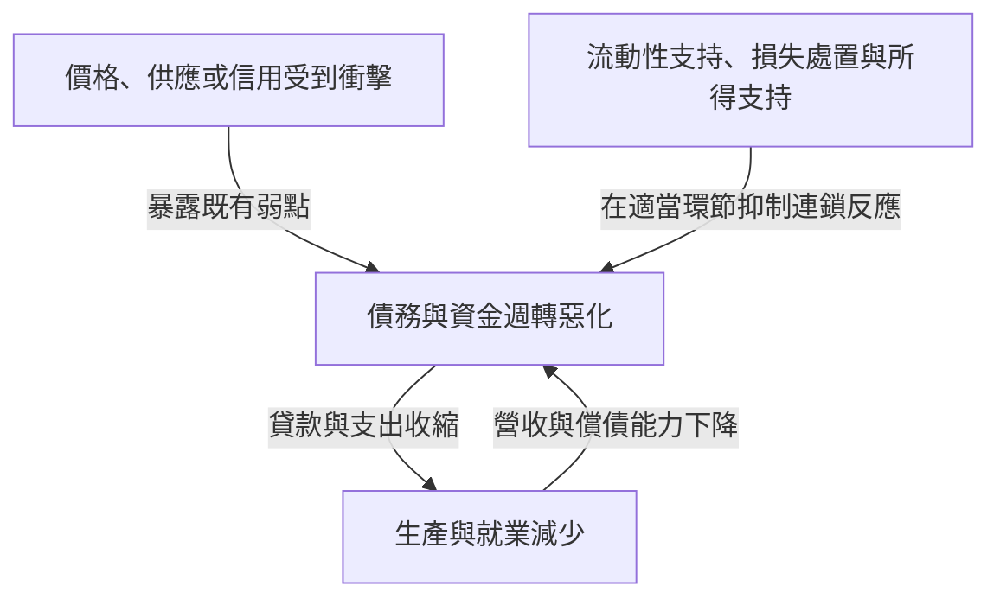
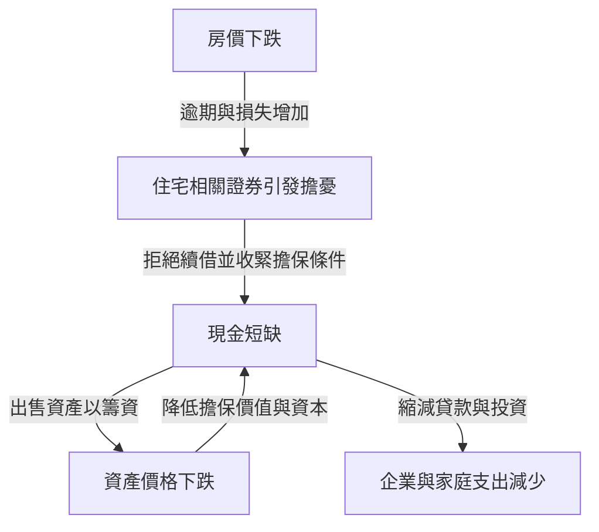

聽到雷曼危機，人們可能把銀行倒閉、股價暴跌和失業增加看成同一件事。但一家企業破產，為什麼會導致世界各地工廠減產、家庭收入下降？同樣是股市崩盤，1987年的黑色星期一為什麼沒有造成與1930年代大蕭條相同的後果？

理解經濟衝擊，不能只記住名稱與年份。最先發生了什麼變化？此前累積了哪些弱點？損失和恐慌從誰傳到了誰？把這三個問題分開，就能沿著因果關係梳理看似複雜的歷史。

本文選取1929年至2023年的16場代表性事件。這不是涵蓋所有國家和地區危機的年表，而是為了比較不同機制所作的選擇。這裡廣義使用「經濟衝擊」，不僅包括金融危機，也包括能源供應驟變、傳染病和貨幣制度變化。對於學術上仍有爭論的成因，我們不會把某一種解釋視為唯一答案。

## 首先理解衝擊與危機的區別

衝擊是突然改變經濟運作前提的事件，例如原油供應中斷、房價下跌、外國投資者撤資。危機則是既有制度與資金週轉無法吸收這些變化，連經濟活動的基礎功能都發生故障的狀態。

這類似於區分颱風本身、堤防的薄弱和洪水的擴散。但在經濟中，相當於堤防的行為也會隨人的判斷改變。銀行為了安全縮減貸款，可能使企業倒閉，反過來增加銀行損失。個體合理的防禦，可能在整體上放大危機。

需求衝擊表現為購買與投資支出減少。供給衝擊表現為原料、勞動力不足，產量減少或成本上升。金融衝擊則損害資金中介與支付銜接功能。實際危機中，這些因素往往重疊，性質也可能在過程中改變。

圖中各條箭頭並非總以相同強度發揮作用。充足資本、穩定融資與可信制度，可以讓損失發生後的連鎖反應變小。反過來，平時看似高效率的安排，也可能在極端情況下同時成為弱點。

## 掌握全貌的比較表

| 時期 | 事件 | 核心弱點與傳導機制 |
| --- | --- | --- |
| 1929年至1930年代 | 大蕭條 | 銀行恐慌、信用收縮、通縮與金本位約束 |
| 1971年 | 尼克森衝擊 | 美元兌金承諾的信任下降、貨幣制度轉型 |
| 1973—1974年 | 第一次石油危機 | 石油供應與價格驟變、進口國所得外流 |
| 約1978—1982年 | 第二次石油危機與貨幣緊縮 | 供應憂慮、通膨預期、對高利率的調整 |
| 1982年以後 | 拉丁美洲債務危機 | 外幣債務、浮動利率與外匯收入不足 |
| 1987年 | 黑色星期一 | 同向交易、市場流動性與結算問題 |
| 1990年代 | 日本泡沫破裂 | 擔保品價格下跌、不良貸款、長期償債調整 |
| 1994—1995年 | 墨西哥貨幣危機 | 資本流入逆轉、短期債務、美元連動償付負擔 |
| 1997—1998年 | 亞洲金融危機 | 幣別與期限錯配、資本外流與銀行危機 |
| 1998年 | 俄羅斯危機與LTCM危機 | 政府債務疑慮、避險交易與槓桿 |
| 約2000—2002年 | 網路泡沫破裂 | 獲利預期修正、股權融資與資本支出收縮 |
| 2007—2009年 | 全球金融危機與雷曼危機 | 住宅信貸、證券化、短期融資擠兌 |
| 2010年代前期 | 歐洲債務危機 | 銀行與政府信用連動、貨幣聯盟制度弱點 |
| 2020年 | 疫情衝擊 | 感染與行為變化使供需同時停頓 |
| 2021—2022年及以後 | 通膨與能源衝擊 | 需求恢復、供應約束、戰爭擾亂資源市場 |
| 2023年 | 美國銀行業動盪 | 利率風險、存款集中、資金迅速流出 |

表中時期指危機特徵較明顯的階段，並非全球統一的衰退期間。例如美國衰退的起點、日本經濟的谷底與股價最低點並不重合。「危機結束」也可能分別指金融市場穩定、就業恢復或債務處置完成，含義並不相同。

## 1929年股市崩盤與大蕭條：股票損失並不是全部

1929年秋美國股市崩盤，是大蕭條的代表性事件。但僅靠股價下跌，無法解釋隨後嚴重且漫長的低迷。美國經濟在崩盤之前已進入衰退，之後的銀行恐慌進一步損害信用與支出。

銀行一方面承諾在較短時間內償還存款，另一方面卻向企業和家庭發放長期貸款。如果許多存戶同時索取現金，即使資產並非全部毫無價值，也可能無法立即支付。當時美國尚無今天這樣的聯邦存款保險制度。

銀行倒閉與存款流失擴散後，企業更難借到營運資金，支付工資、購買原料和維持庫存都變得困難，就業與生產隨之減少。失業和所得下降又壓低消費，進一步削弱企業償債能力。這個過程會讓沒有持有股票的家庭也蒙受損失。

物價下跌也不一定是救濟。如果債務名目金額固定，營收和工資越低，償還就越吃力。年收入500萬日圓、負債500萬日圓，與收入降到350萬日圓、債務仍為500萬日圓，負擔明顯不同。這只是說明機制的假設例子，卻展示了通縮與債務互相惡化的過程。

金本位還使維護貨幣兌金信任與國內貨幣寬鬆發生衝突。為阻止黃金外流而收緊政策，有時會在衰退中進一步加劇資金緊張。保護主義和國際債務關係也疊加了惡化因素。[聯準會歷史資料](https://www.federalreservehistory.org/essays/banking-panics-1931-33)解釋了黃金外流與存款提取同時壓迫銀行的路徑。

大蕭條的教訓並非只要撐住股價就能解決一切，而是支付、信貸中介和存款信任一旦崩潰，金融資產損失可能轉化為生產能力的長期損傷。研究者對貨幣當局應對和金本位作用的權重有不同評價，但把原因歸結為一天的崩盤，過於粗糙。

## 1971年尼克森衝擊：兌換承諾難以持續

戰後的布列敦森林體系中，許多貨幣與美元維持固定匯率關係，美國則支持外國貨幣當局所持美元按一定條件兌換黃金。這並不是任何人都能把日常使用的所有美元紙鈔自由換成黃金的制度。

貿易和國際金融擴張需要全球可用的美元。但海外美元持有量越多，人們就越會對美國黃金儲備能否支撐兌換承諾產生疑問。擔憂上升後，搶先兌金的行為增加，制度因此更加不穩定。

1971年8月，尼克森總統宣布暫停美元兌換黃金等措施。此後還曾嘗試透過調整匯率維持制度，主要貨幣到1973年才逐步轉向浮動匯率。所以，不能理解為「1971年的某一天，全世界固定匯率同時結束」。[Federal Reserve History的解說](https://www.federalreservehistory.org/essays/gold-convertibility-ends)介紹了政策目的與制度轉型過程。

對日本企業而言，這意味著匯率成為經營計畫的重要波動因素。同樣的美元出口收入，日圓升值後換算成日圓就會減少；但進口成本也可能下降，因此出口企業與進口企業受到的影響並不一樣。

這主要是貨幣制度與政策衝擊，不宜硬套進銀行接連倒閉的危機類別。固定兌換比率可以穩定交易，但一旦維持承諾的條件消失，調整也可能十分劇烈。

## 1973—1974年第一次石油危機：生產成本躍升

1973年第四次中東戰爭背景下，阿拉伯產油國限制供應，並對美國等國實施禁運，原油價格急升。需要區分實施禁運的阿拉伯石油輸出國組織OAPEC，與範圍更廣的石油輸出國組織OPEC。供應措施、產油國價格政策與原本強勁的全球需求共同作用。[第一次石油危機的歷史資料](https://www.federalreservehistory.org/essays/oil-shock-of-1973-74)梳理了這個背景。

原油不僅是汽車燃料，也廣泛用於物流、發電和化工。短期內難以更換燃料或設備，所以即使供應只略有不足，價格也可能大幅波動。當需求和供給對價格的反應都不大時，大部分調整只能由價格承擔。

進口國為了獲得同樣數量的原油，必須向國外支付更多所得。企業若把成本轉嫁到價格上，家庭購買力就下降；若無法轉嫁，利潤就減少。兩條路徑都會損害消費與投資空間。

這裡可能出現物價上漲與經濟惡化並存，即停滯性通膨。即使因需求疲弱而大幅刺激支出，也不能立即增加原油和生產設備。反過來，若只盯住物價而猛烈緊縮，對就業的打擊又會擴大。

日本當時的混亂也不能完全由石油解釋，需求、金融環境和漲價預期同樣重要。後來節能和產業結構變化，改變了經濟對同類進口價格衝擊的承受力。供給衝擊的大小，不僅取決於資源價格，也取決於對該資源的依賴程度。

## 第二次石油危機與高利率轉向：壓低物價的過程也有代價

1978—1979年伊朗革命造成生產混亂，再次震動石油市場。但價格上漲不能簡單按損失的產量比例解釋。對未來供應進一步減少的擔憂，催生了增加庫存的需求。對未來的警戒會增加當前需求。[第二次石油危機的解說](https://www.federalreservehistory.org/essays/oil-shock-of-1978-79)同時討論了供應減少與預防性需求。

在通膨已經持續的經濟中，企業和勞動者會把下一輪漲價納入定價與工資決策。這並不意味著永遠只有工資推高物價。資源成本、需求、對貨幣政策的信任和契約安排，都會影響通膨的持續性。

美國在1979年出任聯準會主席的保羅・伏克爾領導下，推進以抑制通膨為重點的貨幣緊縮。利率上升壓低購屋和設備投資，對經濟與就業施加巨大負擔。1980年前後至1980年代初的衰退，不僅包含油價上漲，也包含對這次政策轉向的調整。

貨幣緊縮不是開採原油的政策，而是透過壓低支出與信用，改變物價將長期上漲的預期。它無法直接消除供給約束，所以抑制通膨時會產生實體經濟成本。[大通膨時期的歷史](https://www.federalreservehistory.org/essays/great-inflation)有助於理解政策判斷與物價的關係。

而且，美國升息的影響並不止於國內。對以美元借款的外國國家與企業，它表現為償債條件惡化。這正是理解隨後拉丁美洲債務危機的關鍵聯繫。

## 1982年以後的拉丁美洲債務危機：債務幣別與利率成為負擔

1970年代，產油國收入等資金推動了國際銀行貸款擴張。拉丁美洲國家也借入大量外幣資金。但能借到錢，不等於未來能靠外匯收入償還。

美元債務不能僅靠發行本國貨幣償還。借款人必須透過出口、海外資金流入或動用外匯存底等方式獲得美元。浮動利率契約還會隨國際利率上升增加利息支出。與此同時，全球經濟走弱會壓低出口和資源收入的成長。

1982年8月，墨西哥償債困難使危機公開化，此後許多國家被迫重組債務。國際銀行也持有巨額貸款，因此問題不僅屬於借款國。[拉丁美洲債務危機資料](https://www.federalreservehistory.org/essays/latin-american-debt-crisis)也從貸款方角度解釋了過程。

新增貸款一旦停止，依賴借新還舊維持的支付就難以繼續。即使試圖削減進口以獲得外匯，如果連生產所需的機器和零件都減少，創造未來收入的能力也會受損。財政調整、貨幣貶值與銀行問題交織，使一些國家陷入長期停滯。

教訓並不只是「借債不好」。重要的是借什麼貨幣、按什麼利率、何時償還，以及靠什麼收入支持。即使長期投資有社會價值，若期限與外匯收入安排不匹配，資金也可能中途耗盡。

## 1987年黑色星期一：原以為能賣出的市場變薄了

1987年10月19日，美國道瓊指數一天跌了22.6%。但這場崩盤並未立即使美國陷入大蕭條式銀行危機或經濟衰退。它是區分價格暴跌與金融功能全面崩潰的重要案例。

原因並非一條新聞，而是高估值擔憂、利率與匯率不安、市場結構等因素疊加。「投資組合保險」在下跌時賣出期貨等資產來限制損失，也被認為放大了拋售。名字帶有保險，並不意味著有人無條件補償損失。

一個投資者想透過賣出來降低風險，需要有人願意買。如果許多人對相同價格變化作出反應、同時賣出，原價格下買單就會不足，價格進一步下跌，引出下一輪拋售。

此外，現貨股票、期貨和選擇權在交易及結算上的差異，使資金需求更複雜。帳面上可以抵銷的交易，如果付款日不同，中間仍然需要現金。[Federal Reserve History](https://www.federalreservehistory.org/essays/stock-market-crash-of-1987)討論了這些市場結構與流動性支持。

中央銀行提供流動性的態度，以及金融機構繼續放貸，有助於抑制連鎖反應。由此可見，僅憑股價跌幅無法衡量危機深度。誰承受損失、借了多少債、承擔多少支付和信貸功能，都會改變同一價格變化的意義。

## 日本泡沫破裂：土地、銀行與企業資產負債表彼此相連

1980年代後期，日本股價與地價大漲。貨幣寬鬆、金融自由化下的銀行行為、土地擔保貸款以及升值預期共同作用。與其只歸因於廣場協議或低利率，不如觀察信用與資產價格的交互作用。

地價上漲後，同一塊土地能擔保借到更多資金。如果資金又用於購置房地產，價格便進一步上漲。當貸款越來越依賴擔保品未來能賣得更貴，而非計畫收益，價格上漲本身就成了借款的支撐。

經過貨幣緊縮和房地產貸款限制等措施，1990年代資產價格下跌，這套機制反向運轉。企業仍背負購入時的債務，但擔保品和資產價值已下降。銀行累積了難以收回的貸款，即不良貸款。[日本銀行關於泡沫的研究](https://www.imes.boj.or.jp/research/abstracts/english/me14-1-6.html)考察了信用與土地、股票價格的關係。

銀行因損失而減少資本後，新貸款更難發放。同時企業即使面對低利率，也可能優先還債而非投資。借貸雙方一起收縮支出，僅靠降息未必能讓投資恢復原狀。

若問題確認和損失處置延遲，可能一面繼續向弱企業放貸，一面無法給有前景的企業提供足夠資金。1997—1998年的金融動盪顯示，資產價格下跌後，銀行體系的脆弱性仍在。日本銀行將[1990年代以來的通縮與資產負債表調整](https://www.boj.or.jp/en/about/press/koen_2024/ko240527b.htm)視為長期停滯的重要背景。

不過，不能把此後日本經濟的所有問題都歸結為泡沫破裂。人口結構、生產力、國際競爭和政策等也有關。核心在於：當資產價格損失留在資產負債表上，即使股價暫時反彈，企業與銀行的行為也不會馬上恢復。

## 1994—1995年墨西哥貨幣危機：再融資停止，匯率防守就更困難

1994年，政治不安、美國升息等因素使墨西哥海外資金流入不穩。經常帳赤字需要用資本流入等方式彌補。赤字並不總意味著危機，但資金突然停止流入時，調整會十分嚴峻。

即使動用外匯存底支撐匯率，存底也有限。政府增發的Tesobonos是一種償付金額與美元連動的短期債務。為減少投資者對披索貶值的擔憂，這種安排卻增加了政府的匯率與再融資風險。

1994年12月匯率政策變化未能充分恢復信心，披索大幅貶值。美元連動債務的本幣負擔增加，投資者是否願意續借變成迫切問題。[IMF當時的檢討](https://www.imf.org/en/news/articles/2015/09/28/04/53/spmds9508)指出了短期資金與債務結構的脆弱性。

貶值有時有利於出口，卻也使外幣連動負債變重。因此，「貶值恢復競爭力就能解決問題」並不充分，因為資產負債表同時受傷。若企業和銀行惡化，連擴大出口所需資金都可能難以籌措。

這場危機說明，不僅要看政府債務總額，也要看未來幾個月必須償還多少。同樣規模的債務，償還分散在多年與集中在短期，對信心下降的承受力不同。

## 1997—1998年亞洲金融危機：私人外幣債務震動整個經濟

1997年7月，泰國放棄維持泰銖匯率，危機隨後擴散至印尼、韓國等國。但各國制度和弱點並不相同。把一切歸因於政府財政揮霍，也會忽略私人企業與銀行的借款。

許多交易以美元等外幣短期借款，再投資國內長期房地產開發或經營計畫。償債幣別與收入幣別不同，是貨幣錯配；償還時間與資金回收時間不同，是期限錯配。在匯率穩定、能夠續借時，這種組合的弱點不容易顯現。

但投資者急於收回資金，會增加外匯需求並壓低本幣。貶值使外幣債務負擔變重，強化對企業的擔憂；擔憂又引出更多資本外流，匯率與償債能力互相惡化。[IMF對金融部門的檢討](https://www.imf.org/external/pubs/ft/op/opfinsec/index.htm)梳理了銀行、企業弱點與匯率制度的關係。

例如，在1美元兌換100單位本幣時借入100萬美元，本金相當於1億單位本幣。若本幣貶至1美元兌150單位，同樣的美元本金就相當於1.5億單位。收入仍是本幣時，即使沒有新借款，負擔也會膨脹。出口收入或匯率避險會改變影響，所以這只是未作防護的假例。

為守住匯率而提高利率，可能抑制外流，卻也傷害國內借款人；容許貶值，則會損害外幣債務人的財務狀況。政策必須在這種困境中選擇，IMF援助條件以及財政、貨幣政策是否適當，至今仍有討論。

跨境傳染並不是因為相鄰就自動發生。共同貸款銀行、重疊出口市場、投資者把經濟體看作相似等，都是傳導路徑。共同債權人受損時，可能連問題較小國家的資金也一併收回。

## 1998年俄羅斯與LTCM危機：分散交易也可能同時虧損

1998年，俄羅斯財政與徵稅薄弱、資源價格低迷、融資不安交織，8月宣布盧布貶值及國內公債重組等措施。政府債務永遠安全的看法受到衝擊，全球投資者更重視安全性與變現能力。

在動盪中遭受重損的是避險基金長期資本管理公司LTCM。如果只把其策略理解為投資俄羅斯公債，就看不到問題範圍。關鍵在於，它以高槓桿從事預期相似金融產品價差收斂的交易等策略。

平時很小的價差，交易規模夠大也能獲利。但危機中大家集中買入容易變現的資產，價差不但不縮小，反而擴大。即使未來價差最終回歸的判斷正確，若此前就被要求追加擔保品，也不能一直等待。

即使分散在不同市場，若都依賴「市場流動性持續存在」這個共同前提，實質分散仍然很弱。危機時相關性上升，不只是數學數字變化，也意味著許多人因同一理由同時賣出。

紐約聯邦準備銀行協調相關金融機構商議，最終由私人金融機構注資。不能混同為聯邦準備銀行直接向LTCM投入公共資金紓困。[時任紐約聯邦準備銀行總裁的證詞](https://www.newyorkfed.org/newsevents/speeches/1998/mcd981001.html)解釋了這個分工。模型預測的長期價值，與明天付款所需現金，是兩回事。

## 網路泡沫破裂：技術是真的，股價未必合理

1990年代後期，網際網路改變產業的期待吸引資金流向IT與通訊企業。技術變革確實深遠，但有用技術普及，與每家企業都能獲得高利潤，並不是同一件事。

企業價值取決於未來利潤和現金流，以及這些收入折算到今天的價值。如果只關注市場規模，卻輕視取得客戶的成本、競爭、燒錢速度和追加投資，預期成長稍微下降，估值也可能大變。

2000年以後，過高獲利預期被修正，股權融資變難，企業削減人員和資本支出，通訊設備等過度投資也開始調整。除股價下跌削弱家庭財富外，維持經營的資金管道也收窄。[聯準會2001年年度報告](https://www.federalreserve.gov/boarddocs/rptcongress/annual01/ar01.pdf)記錄了當時投資與金融的變化。

把美國2001年衰退理解為只始於當年9月恐攻，也不準確。經濟此前已經轉弱，恐攻對旅遊等需求與不確定性構成額外打擊。重疊衝擊需要區分先後順序。

與以住宅金融為中心的2008年危機相比，這次損失更多由股票投資者承擔，透過銀行和短期融資市場放大的結構不同。股票價格下跌，並不意味著公司必須償還同等金額；債務則仍有還款義務。融資方式的不同，會影響對技術的失望轉化為多深的金融危機。

## 雷曼危機：住宅貸款損失使短期金融市場停轉

### 危機並非突然始於2008年9月

日本常說的雷曼衝擊，以美國投資銀行雷曼兄弟於2008年9月15日破產為象徵。但美國住宅市場和相關金融產品的問題早已發展。2007年短期融資市場緊張公開化，2008年春又發生貝爾斯登危機。

房價上漲使借貸雙方安心。即使還款困難，也能出售住宅或再融資的預期支撐著貸款。但房價下跌後，賣房仍不足以清償的情況增加，再融資前提也瓦解。[次級房貸危機解說](https://www.federalreservehistory.org/essays/subprime-mortgage-crisis)解釋了信用擴張與房價之間的互動。

僅說「償債能力低的人借了錢」遠遠不夠。還必須考察貸款審核、證券化誘因、投資者估值、金融機構資本和融資方式，才能解釋局部壞帳為什麼變成全球危機。

### 證券化並不會消滅風險

證券化的基本做法，是把住宅貸款集合起來，將還款產生的收入分配給投資者。透過劃分支付優先順序，可以形成先承擔損失與後承擔損失的部分，但整體損失不會因此消失。

把不同地區貸款混合，可以分散地區特有風險。可如果大範圍房價同時下跌，失業和再融資困難普遍出現，違約就會更加連動。評等較高的部分，在基礎假設瓦解後也可能受損。

產品越複雜，最終誰承擔哪部分損失就越不透明。即使自身損失小，只要不了解交易對手狀況，也會有理由拒絕放款。問題不僅是損失金額，還有損失歸屬的不確定性。

### 短期融資停止，就會被迫出售資產

投資銀行等機構透過附買回交易和短期證券融資，持有需要長期才能回收的資產。附買回交易具有類似證券擔保短期融資的性質。只要能不斷續借就能運轉，但貸款方拒絕展期，就必須立即拿出現金。

假設價值100的擔保品原本可借95，警惕上升後只能借80，就必須另籌15。這是解釋機制的假例。如果擔保品本身價格同時下跌，現金需求還會進一步增加。

為籌現金出售資產，會壓低市場價格。其他機構也會遭遇資產貶值或追加擔保要求，被迫跟著出售。雖然不是存戶在銀行門口排隊，卻具有短期資金提供者一起撤退的「擠兌」結構。

### 金融街的問題如何傳到工廠與家庭

雷曼破產後，對交易對手的不信任和短期市場混亂急劇加深，需要AIG援助、金融機構補充資本、央行提供流動性等多種措施。[全球金融危機概述](https://www.federalreservehistory.org/essays/great-recession-and-its-aftermath)梳理了從住宅市場到金融部門、再到實體經濟的路徑。

銀行減少貸款後，企業不僅難以進行設備投資，也難以獲得日常支付資金。家庭除了房屋和股票貶值，還因就業不安而延後購買耐久財。於是，即使沒有直接持有相關金融產品的出口企業，也會收到更少訂單。日本遭受的重大打擊，也與全球需求和貿易收縮有關。

低利率、國際資金流動、監管、薪酬誘因等因素各占多大權重，存在爭論。但住宅貸款損失、高槓桿、短期融資和風險不透明的結合，是不可忽略的。雷曼破產是重要的放大節點，並非一家企業製造了所有累積的問題。

## 歐洲債務危機：政府與銀行互相削弱

2009年底至2010年，希臘財政疑慮加劇，隨後信用恐慌擴散至多個歐元區國家。但不能把希臘財政問題原樣套在所有國家身上。愛爾蘭和西班牙的房地產與銀行問題尤其重要。

政府信用下降、公債價格下跌，會損害持有這些公債的銀行；政府為救助銀行增加負擔，又會加劇對財政的擔憂。銀行與政府原本互相支撐信用的關係，變成互相削弱。

歐元區成員使用共同貨幣，無法單獨貶值或設定本國政策利率。但危機初期，銀行監管、處置和財政風險分擔並未充分整合。貨幣一體化走在了危機處理制度一體化之前。

再融資利率越高，利息支出越多，債務可持續性就越差。基於擔憂的高利率，可能讓擔憂更接近現實。但也並非一切都是無根據的市場情緒，各國債務、生產力和銀行弱點同樣重要。[歐洲央行的危機檢討](https://www.ecb.europa.eu/press/key/date/2018/html/ecb.sp180511.en.html)解釋了國別差異與制度教訓。

財政緊縮意在恢復對債務的信任，但衰退中急劇減支也會減少所得和稅收。另一方面，援助涉及由誰承擔損失、如何防止未來過度借債。歐洲央行行動、金融援助機制和銀行聯盟建設，都是為了切斷這類惡性循環。

## 2020年疫情衝擊：最先停下的不是金融產品，而是經濟活動

新冠疫情同時限制人員流動、面對面服務、辦公室和工廠運作。不只是行政限制，人們為避免感染而主動改變行為，以及缺勤，也壓低經濟活動。其最初原因不同於通常的銀行危機。

供給側出現無法工作、零件不到貨、物流受阻；需求側則有旅遊、餐飲、娛樂支出下降，以及對收入和未來擔憂導致推遲購買。同時需求也從服務轉向商品，並非所有產業都同向下降。[IMF早期分析](https://www.imf.org/en/Blogs/Articles/2020/03/09/blog030920-limiting-the-economic-fallout-of-the-coronavirus-with-large-targeted-policies)區分了供需兩面。

營收突然停頓，租金和還款仍在繼續。本來能持續經營的企業，也可能因現金耗盡而倒閉。暫時停業由此轉化為僱用關係和交易網絡喪失的長期損傷。政策需要幫助企業和家庭跨過停頓期。

降息不能直接消除感染風險或零件短缺，必須結合醫療、公共衛生、所得支持、就業維持和週轉資金支持。金融市場現金需求也驟增，因此防止實體衝擊轉為金融功能失靈同樣重要。

恢復並不均衡。即使需求回升，關閉的設備、人員和國際物流未必同速恢復。初期「需求不足」，可能轉化為復甦期「特定供給跟不上」。這對理解下一階段通膨十分重要。

## 2021—2022年以後的通膨與能源衝擊：多重約束疊加

疫情後的通膨並非單一原因造成。需求恢復和結構變化、供應鏈混亂、勞動供給變化、各國財政貨幣環境等共同作用，權重隨國家和時期不同。用同一解釋包辦美國與歐洲，會遺漏重要差異。

能源市場從2021年起已趨緊，2022年2月俄羅斯入侵烏克蘭後，天然氣、石油、電力市場進一步劇烈波動。戰爭、供應削減、制裁和交易風險改變了供應路徑與成本。[國際能源署的整理](https://www.iea.org/topics/2022-energy-crisis)區分了入侵前的緊張與之後的加劇。

尤其天然氣需要管線、液化設備、船舶和接收設施，某地短缺不能立即由另一地資源補上。資源存在於地球上，與在需要時送達需要的地方，是兩回事。這種物理約束會放大經濟價格波動。

能源進口國的進口價格上升，推高企業成本與家庭生活費。補貼和限價可暫時減輕負擔，卻增加財政成本，設計不當還會削弱節約動機。支持誰、支持多久，是關鍵問題。

央行為防止通膨固化而升息，但利率不能直接增加天然氣供應。它透過需求和預期影響物價，也壓低住宅與設備投資，並讓既有金融資產發生損失。通膨率下降只表示漲價速度放緩，不代表生活成本已經回到從前。

## 2023年美國銀行動盪：安全債券也有利率風險

2023年3月矽谷銀行SVB倒閉，說明銀行危機並非只來自壞房貸。長期債券利率風險、存戶集中，以及依賴未獲存款保險全額保護的大額存款等因素結合起來。

固定利息債券通常在市場利率上升時跌價。新債券付息更高，舊低息債券若不降價就較難吸引買家。即使公債這類信用風險較低的資產，中途出售的價格也不保證恆定。

能夠持有到期，與今天為了應對存款流出而必須出售，損失的意義不同。帳面分類可能改變認列損失的時點，卻不能消除急於變現時的市場價格。銀行用可隨時提取的存款持有長期資產的基本結構，成為問題所在。

SVB客戶集中在科技等產業，存戶資金需求和判斷更容易同向變化。線上轉帳與資訊共享加快擠兌，但若只怪社群媒體，就會忽略此前已有的資產負債管理和監管弱點。[聯準會檢討報告](https://www.federalreserve.gov/publications/2023-April-SVB-Key-Takeaways.htm)同時討論了經營與監管。

同年擔憂也擴散至其他銀行，但各行資產和客戶結構並不相同。與其當作2008年住宅信貸危機的重演，不如追問誰以何種形式暴露在利率驟變之下。

## 貫穿歷史的四種機制

### 資本越薄，小跌幅越可能變成大損失

以 $A$ 表示資產、$D$ 表示負債、$E$ 表示權益資本，簡化資產負債表有：

$$
E=A-D,\qquad L=\frac{A}{E}
$$

$L$ 是這裡的槓桿定義。資產100、負債95、資本5，就是20倍。假設負債價值不變，資產損失3，資本就從5降至2。資產僅跌3%，資本卻損失60%。這個計算省略稅收、避險和資產結構，但直觀展示了損失放大。

只看價格穩定期，高槓桿可能顯得有效率。但波動擴大時，為保護資本而出售資產或削減貸款，可能增加他人損失。這是連接日本泡沫、LTCM和全球金融危機的視角。

### 流動性與償付能力不同，卻互相影響

償付能力問題，是相對未來可收回資產與收入而言，債務過重。流動性問題，則是即使最終能收回資產，當前可用於付款的現金不足。獲利企業也可能因週轉倒閉，正源於這個區別。

央行等填補暫時資金缺口，可能避免健全資產被賤賣。但如果資產價值確實不足，增加貸款本身不會消滅損失，還需要注資、債務重組或業務整理。

現實中很難立即區分兩者，流動性不足引發的拋售也可能毀掉償付能力，反過來對損失的疑慮又引發提款。「提供現金一定解決」和「虧損就應放任」這兩個極端，都無法掌握交互作用。

### 貨幣與利率契約會產生意外負擔

外幣債務按本幣計算的價值，可簡化為：

$$
D_{\mathrm{home}}=eD_{\mathrm{foreign}}
$$

其中 $e$ 是購買一單位外幣需要的本幣金額。本幣貶值使 $e$ 上升，即使外幣本金不變，負擔也會增加。但若有外幣收入或避險，必須把抵銷作用一併考慮。

另一方面，固定利息債券價格可透過折現未來付款來理解。若每期利息為 $C$、到期本金為 $F$、剩餘期數為 $T$、固定折現率為 $y$，簡單模型是：

$$
P=\sum_{t=1}^{T}\frac{C}{(1+y)^t}+\frac{F}{(1+y)^T}
$$

其他條件不變時，$y$ 上升會使 $P$ 下降。實際中各期限利率不同，還有信用風險和提前償還，不能只用此式為所有證券定價。但它說明了為什麼升息可能提高新貸款收益，同時降低現有長期債券價值。

### 國際聯繫既傳遞利益，也傳遞衝擊

危機跨境傳播有貿易、金融和共同價格等管道。一國衰退減少進口，會影響出口國工廠；全球銀行虧損，可能縮減看似無關國家的貸款；油價和美元利率變化，則會同時影響許多國家。

區分管道對政策很重要。出口訂單減少時，僅給銀行補資本不會讓訂單回來；若企業有訂單卻借不到營運資金，修復融資管道就有效。必須識別「全球衰退」一詞內部究竟哪條路徑受阻。

## 政策為什麼沒有萬靈丹

若核心是需求不足，貨幣寬鬆與財政支出可支持就業和生產。但供給約束嚴重時，不增供給而只推需求，可能加劇通膨。反過來，也不是供給衝擊就什麼都不做，對受衝擊家庭和企業的定向支持可另行考慮。

銀行危機中，維護支付和存款信任，與無條件救助管理階層、投資者必須區分。注資附帶條件、讓股東或部分債權人承擔損失、重整業務同時保留關鍵功能，都涉及損失分擔設計。

因為預期救助而承擔過度風險，稱為道德風險。但危機中拒絕一切支持，又可能拖累沒有製造問題的家庭與企業。因此，平時的資本和流動性監管、資訊揭露、處置準備，應與危機救助配套考慮。

財政空間也不只取決於債務餘額，還涉及本幣還是外幣、利率與期限、稅基、央行制度關係和政策信任。但本幣債務也不等於可以無成本無限支出，物價、匯率和資源約束仍構成邊界。

評估危機政策，還面臨無法直接觀察「不採取行動會怎樣」的困難。援助後經濟惡化，不一定說明無效；恢復也不代表全由政策造成。需要比較其他國家、時間差、初始條件和制度差異。

## 閱讀下一則經濟新聞時該問什麼

看到新衝擊，先確認什麼價格或數量變了。股價、原油、匯率、利率和出口訂單，直接影響的主體不同。接著想誰的資產減少，誰的債務或付款增加。

再看是否有資本吸收損失、近期到期債務是否很多、收入與債務幣別是否匹配，以及同向行動者是否過度集中。這些問題不僅適用於銀行，也適用於基金、企業、政府和家庭。

還要確認政策針對現金短缺、損失處置、需求不足還是供應不足。政策名稱相同，作用對象不同，效果與副作用也不同。股價回到危機前，與人們生活恢復，也不是同一件事。

這些問題不是預測崩盤日期的方法。發現弱點不意味著危機必然發生，政策和私人調整可能避免危機。歷史更能教會我們的不是日期預測，而是某事發生後，損失會沿什麼路徑擴散。

大蕭條與疫情衝擊的起因差別巨大，第一次石油危機與雷曼危機的核心約束也不同。但收入下降後支付承諾仍存在、短期現金不同於長期價值、大家同時自保可能使整體不穩定，這些機制反覆出現。

經濟衝擊史不只是失敗清單，而是理解個人、企業和國家的承諾在何種條件下有效、何時需要支撐的歷史。看清承諾結構，就能越過「又一次暴跌」的標題，同時看到本次獨有的問題和延續自過去的機制。

## 如何閱讀資料

正文從相應論點直接連結聯準會、IMF、日本銀行、歐洲央行和國際能源署的公開資料。應區分歷史事件記錄與政策當局對自身政策的評價。尤其對政策效果和危機成因權重，不同立場的資料可能有不同判斷。

資產負債表、匯率與擔保品的數字例子只是解釋機制的假例，並非特定銀行或國家的實際數據。另外，年報與危機當時的分析包含當時預測，不能把預測值誤當成後來確認的實際結果。
