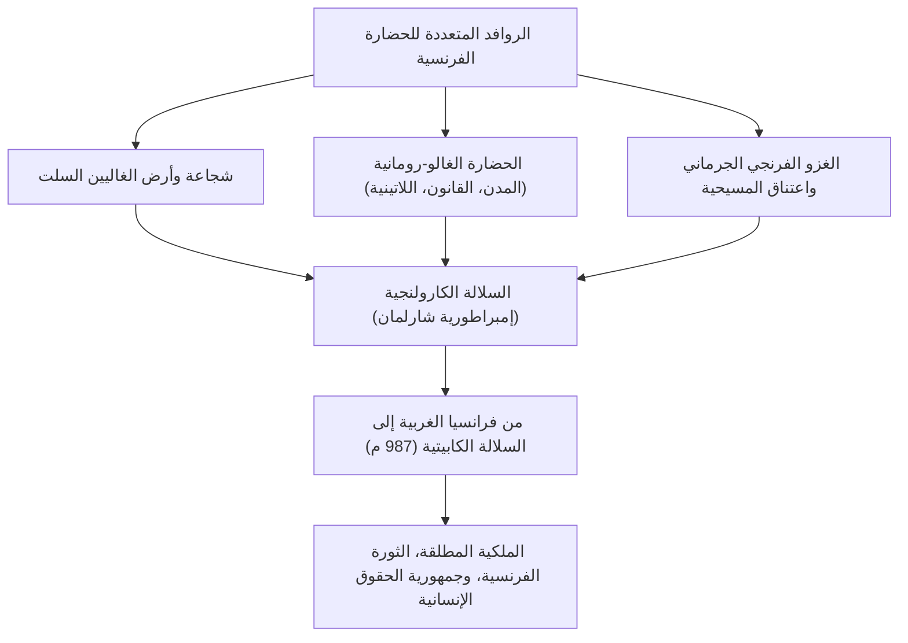
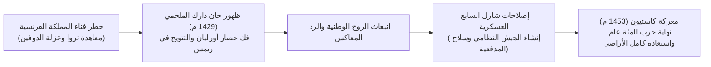
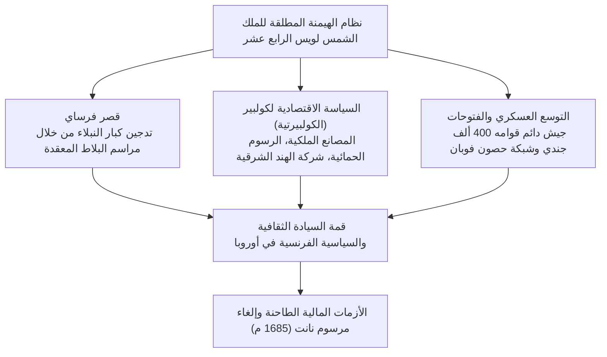
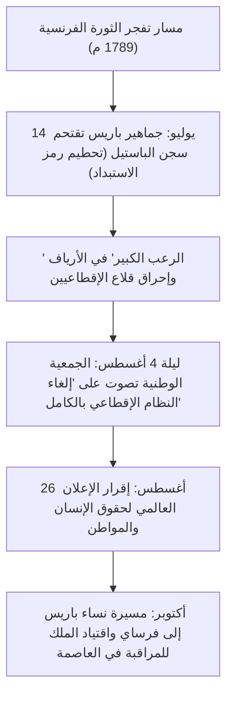
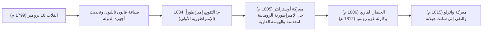
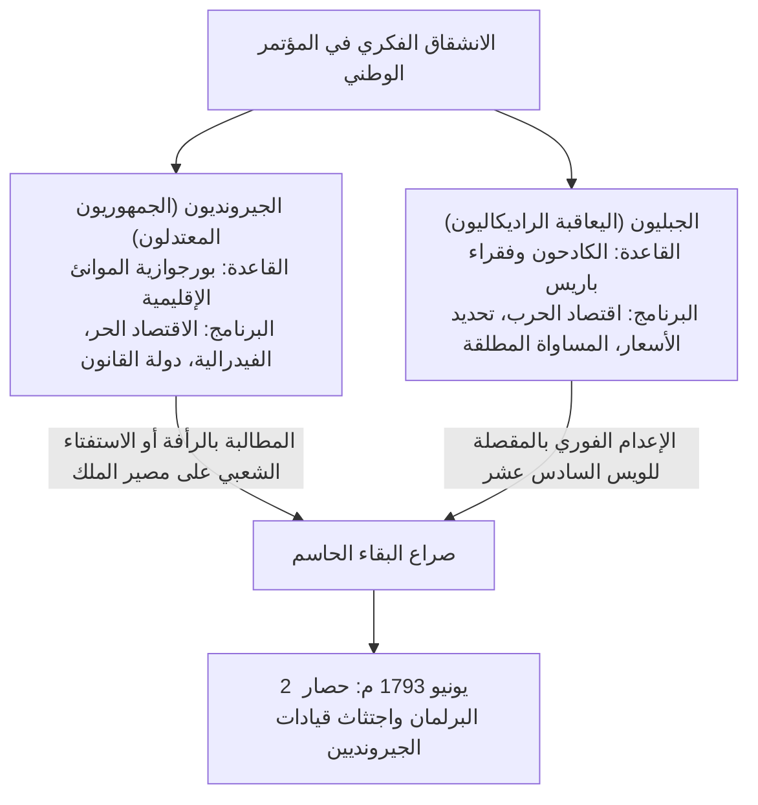

## 1. المقدمة: الحضارة الفرنسية كقلب نابض لأوروبا

### 1.1 الغاليون و*تعليقات على الحرب الغالية* ليوليوس قيصر

في الطرف الغربي من القارة الأوروبية، يمتد سداسي خصب وفسيح (L'Hexagone)، تحيط به مياه المحيط الأطلسي والبحر الأبيض المتوسط ونهر الراين وسلاسل جبال البرانس والألب. وقبل أن تُعرف هذه البقاع باسم "فرنسا"، كانت تُدعى "بلاد الغال" (*Gallia*)، موطن العديد من القبائل السلتية الباسلة.

بين عامي 58 و51 قبل الميلاد، قاد القائد الأعلى الروماني غايوس يوليوس قيصر، بعبقريته العسكرية الباردة والاستراتيجية، حملة غزو شاملة لإخضاع سائر أرجاء بلاد الغال. وقد وثّق عمله الكلاسيكي الخالد، *تعليقات على الحرب الغالية* (*Commentarii de Bello Gallico*)، بشاعة المعارك وضراوة المقاتلين الغاليين وطبيعة نظامهم القبلي بدقة متناهية.

في عام 52 قبل الميلاد، وتحت راية الزعيم الشاب لقبيلة الأرفيرني، فرسنغتوركس (Vercingetorix)، اتحدت سائر القبائل الغالية في ثورة عارمة ضد الهيمنة الرومانية. غير أنه في معركة أليسيا التاريخية الفاصلة، حيث شيّد قيصر خطوط حصار مزدوجة لا نظير لها (طوق حصار داخلي لخنق المدينة وجدار خارجي لصد قوات النجدة)، انهارت القوات الغالية تحت وطأة الجوع والحصار والهجمات المستميتة. وتقدم فرسنغتوركس ممتطياً جواده حتى خيمة قيصر، وألقى سلاحه أرضاً معلناً استسلامه.

في كنف السيادة الرومانية، خضعت بلاد الغال لعملية رَوْمنة سريعة وعميقة، مفسحة المجال لولادة الحضارة الغالو-رومانية المزدانة بشبكات الطرق المعبدة والقنوات المائية المعلقة (مثل قنطرة غار) والمدرجات الدائرية الشامخة (في آرل ونيم). وتلاشت اللهجات السلتية لتحل محلها اللاتينية الدارجة، التي شكلت الرحم الذي تولدت منه اللغة الفرنسية. لقد كانت هزيمة أليسيا المخاض العسير الذي أنجب فرنسا بصفتها الابنة البكر للحضارة اللاتينية الكلاسيكية.

---

### 1.2 اعتناق كلوفيس للمسيحية، المملكة الفرنجية، وإرث شارلمان

في القرن الخامس الميلادي، ومع انهيار الإمبراطورية الرومانية الغربية، عبرت قبائل الفرنجة الساليين — وهي فرع من الشعوب الجرمانية — نهر الراين متوغلة في شمال الغال. وفي عام 481 م، قام مؤسس الأسرة الميروفنجية، **كلوفيس الأول (Clovis I، فترة حكمه 481–511 م)**، بتوحيد القبائل وتأسيس المملكة الفرنجية.

وكان القرار الاستراتيجي الأبرز لكلوفيس هو تعميده ونبذه للوثنية في كاتدرائية ريمس عام 496 م واعتناقه المذهب الكاثوليكي (الأرثوذكسي النيقاوي). فبينما كانت معظم الشعوب الجرمانية الأخرى (القوط الغربيون، القوط الشرقيون، الوندال) تدين بالأريوسية، فإن قبول كلوفيس للمسيحية الكاثوليكية منحه دعماً مطلقاً من النبلاء الغالو-رومان ورجال الكنيسة، مما أضفى على التاج الفرنجي شرعية روحية راسخة في الغرب الأوروبي الوسيط.

وفي القرن الثامن الميلادي، وعقب نجاح شارل مارتيل في صد التوسع الإسلامي في معركة بلاط الشهداء (معركة تور وبواتييه، 732 م)، أسس نجله بيبين القصير السلالة الكارولنجية بمباركة البابوية. وفي عهد نجل بيبين، **شارلمان (قارلة العظيم: Charlemagne، حكمه 768–814 م)**، توحدت معظم أرجاء أوروبا الغربية (فرنسا المعاصرة، وألمانيا، وشمال إيطاليا، والأراضي المنخفضة) في إمبراطورية مسيحية مترامية الأطراف.

وفي يوم عيد الميلاد من عام 800 م، توّج البابا ليون الثالث شارلمان في كنيسة القديس بطرس بروما إمبراطوراً رومانياً، مجدداً لقب "إمبراطور الغرب". وقد أشعل عصر "النهضة الكارولنجية"، من خلال إحياء الدراسات اللاتينية وتنشيط المدارس الديرية، قناديل المعرفة في دياجير العصور الوسطى المبكرة.

إلا أنه بعد وفاة شارلمان، تسببت عادات الميراث الجرمانية في تفكك الدولة:
- **عام 843 م: معاهدة فردان**: قسمت الإمبراطورية إلى فرانسيا الغربية، وفرانسيا الوسطى، وفرانسيا الشرقية.
- **عام 870 م: معاهدة ميرسين**: جرى اقتسام أراضي فرانسيا الوسطى بين الشرق والغرب.
ومن بين تلك الكيانات، كانت فرانسيا الغربية (*Francia Occidentalis*) النواة الإقليمية والسياسية المباشرة لـ "مملكة فرنسا".

---

## 2. نشأة السلالة الكابيتية ومسار التوحيد الإقليمي

### 2.1 اعتلاء أوغ كابيه للعرش (987 م) والانطلاقة المتواضعة

في عام 987 م، وإثر انقطاع النسل الكارولنجي المباشر، انتخبت جمعية النبلاء والأمراء كونت باريس، **أوغ كابيه (Hugues Capet)**، ملكاً على البلاد، مدشنة بذلك عهد **السلالة الكابيتية (Capetian Dynasty)**.

في البداية، كانت السلطة الملكية الفعلية بالغة الضعف. ولم تكن رقعة الأراضي التابعة مباشرة للتاج (*domaine royal*) تتعدى شريطاً ضيقاً يحيط بباريس وأورليان يُعرف بـ "إيل دو فرانس" (Île-de-France). وكان كبار الإقطاعيين — كدوقات نورماندي، وأكيتين، وبورغونيا، وكونتات فلاندرز — يبسطون سيطرتهم على إمارات وجيوش تفوق بكثير مقدرات الملك، معتبرين إياه مجرد "الأول بين أنداد" (*primus inter pares*).

ومع ذلك، حظيت السلالة الكابيتية بميزتين مؤسسيتين حاسمتين:
1. **المسحة المقدسة بالزيت المبارك (*Sacre*)**: بتتويج الملك ومسحه في كاتدرائية ريمس، اكتسب هالة الموناركية ذات الحق الإلهي (الاعتقاد الشعبي بالملوك الشافين القادرين على مداواة داء الخنازير بلمسة أيديهم: *les rois thaumaturges*).
2. **استمرارية توريث الابن البكر دون انقطاع**: بأعجوبة بيولوجية استمرت لأكثر من 340 عاماً (من 987 إلى 1328 م)، لم تعانِ الأسرة من غياب وريث ذكر مباشر في أي جيل، مما رسّخ مبدأ الوراثة العرشية كأساس لا يتزعزع للدولة.

---

### 2.2 فيليب الثاني أوغست والتوسع الترابي الحاسم

الملك الذي ضاعف أملاك التاج عدة مرات وثبت رسمياً لقب "ملك فرنسا" (*Rex Franciae*) هو سابع ملوك السلالة، **فيليب الثاني أوغست (Philippe Auguste، حكمه 1180–1223 م)**.

في ذلك الحين، كانت سلالة بلانتاجنت الحاكمة في إنجلترا (هنري الثاني، وريتشارد قلب الأسد، وجون بلا أرض) تسيطر على أقاليم النورماندي، وأنجو، وأكيتين، مشكّلة "الإمبراطورية الأنجوية" التي طوقت الأملاك الملكية الفرنسية من كل صوب.

استغل فيليب أوغست الأخطاء القانونية والإقطاعية للملك جون، وقام في عام 1204 م بمصادرة وضم نورماندي، وأنجو، ومين، وتورين بحملات خاطفة.
وفي 27 يوليو 1214 م، وقعت **معركة بوفين (Battle of Bouvines)** الخالدة، حيث واجه الجيش الملكي الفرنسي بقيادة فيليب تحالفاً هائلاً نسقه جون مع إمبراطور الرومانية المقدسة أوتو الرابع وكونت فلاندرز. وحقق فيليب نصراً ساحقاً حطم قوى التحالف المعادي، وطرد النفوذ الإنجليزي من شمال فرنسا، ورفع الهيبة العسكرية للتاج الفرنسي إلى الذروة في الساحة الأوروبية.

كذلك، أنشأ فيليب أوغست جهازاً بيروقراطياً إدارياً مأجوراً من الطبقة البرجوازية الصاعدة — الموظفون الملكيون المعروفون بـ "البالي" في الشمال و"السينيشال" في الجنوب — لجباية الضرائب وإرساء العدالة باسم الملك. وجعل من باريس عاصمة دائمة للدولة، وشيّد حصن اللوفر، ورصف شوارع المدينة، وأحاطها بأسوار دفاعية منيعة.

---

### 2.3 فيليب الرابع الوسيم وتحدي السلطة البابوية (حادثة أناني وبابوية أفينيون)

في أواخر القرن الثالث عشر، واصل العاهل البراغماتي الصارم **فيليب الرابع الوسيم (Philippe IV le Bel، حكمه 1285–1314 م)** ترسيخ الدولة الإدارية المركزية.

وبغية تمويل نفقاته العسكرية المتزايدة، فرض فيليب ضرائب على أملاك رجال الدين، الأمر الذي أدخله في صدام مفتوح مع البابا بونيفاس الثامن، صاحب المرسوم الشهير *Unam Sanctam*، الذي أعلن فيه أن السلطة الروحية للبابا تعلو فوق كل عروش الأرض وسلاطينها.
- **عام 1302 م: أول انعقاد لمجلس طبقات الأمة (*États généraux*)**: دعا فيليب الرابع ممثلي الإكليروس والنبلاء وعامة سكان المدن إلى كاتدرائية نوتردام بباريس، محققاً إجماعاً وطنياً حاشداً لمواجهة روما.
- **عام 1303 م: حادثة أناني**: قاد مبعوث الملك غيوم دو نوغاريه غارة مسلحة على مقر إقامة البابا في بلدة أناني الإيطالية، حيث احتُجز البابا وأُهين علناً (ومات على إثر الصدمة بعد أسابيع قليلة).
- **1309–1377 م: أسر بابوية أفينيون**: ساهم فيليب في انتخاب بابا فرنسي، كليمنت الخامس، وقام بنقل الكرسي الرسولي إلى مدينة أفينيون في جنوب فرنسا، حيث بقيت البابوية تحت رقابة التاج الفرنسي لما يقرب من سبعين عاماً.
- وفضلاً عن ذلك، وجه فيليب تهم الهرطقة لفرسان الهيكل وحل تنظيمهم الثري، وصادر خزائنهم الهائلة لصالح المالية العامة للدولة.

واندثرت بذلك أوهام الهيمنة الثيوقراطية البابوية العالمية، مكرسة فرنسا كأول "دولة قومية ذات سيادة" (*Sovereign State*) في التاريخ الأوروبي.

---

### 2.4 حرب المئة عام وملحمة جان دارك الخالدة

عقب وفاة أبناء فيليب الوسيم دون ذرية من الذكور، آلت ولاية العهد لفرع فالوا في شخص فيليب السادس. ورداً على ذلك، ادعى ملك إنجلترا إدوارد الثالث، حفيد فيليب الرابع من جهة أمه، حقه في تاج فرنسا، فاندلعت حرب المئة عام في سنة 1337 م.

وفي معارك كريسي (1346 م)، وبواتييه (1356 م، حيث أُسر الملك الفرنسي جان الثاني)، وأجينكور (1415 م)، تعرض فرسان فرنسا المدرعون لمجازر مروعة أمام ضربات رماة السهام الطويلة الإنجليز (*longbow*). ومع انحياز دوقية بورغونيا إلى جانب الإنجليز، اعترفت معاهدة تروا المهينة عام 1420 م بالملك الإنجليزي هنري الخامس ولياً لعهد فرنسا. واضطر ولي العهد الشرعي (الدوفين)، شارل السابع، إلى الهروب جنوب نهر اللوار في مدنية بورج، وباتت فرنسا قاب قوسين أو أدنى من الفناء والاندثار.

وفي ربيع عام 1429 م، قدمت فتاة قروية لم تتجاوز السابعة عشرة من عمرها من قرية دومريمي، تُدعى **جان دارك (Jeanne d'Arc)**، وقابلت شارل السابع في قصر شينون. ومعلنة أنها تحمل تفويضاً إلهياً من رئيس الملائكة ميخائيل لفك حصار أورليان وقيادة ولي العهد ليتوج في ريمس، ارتدت درعاً بيضاء وقادت القوات صوب المدينة المحاصرة.

ألهم إيمان جان دارك الصامد عزائم الجنود الفرنسيين إلهاماً صاعقاً؛ وخلال تسعة أيام فقط، تحطم الحصار المضروب حول أورليان، واقتيد شارل السابع عبر خطوط العدو ليتوج ملكاً في كاتدرائية ريمس. ورغم أسر جان لاحقاً في كومبيين وتقديمها لمحاكمة تفتيش كيدية في روان حيث أُحرقت حية بتهمة الهرطقة عام 1431 م وهي ابنة تسعة عشر ربيعاً، فإن شعلة الوطنية التي أوقدتها لم تخبُ قط.

وأعاد شارل السابع تنظيم الخزانة، وأنشأ **أول جيش احترافي نظامي دائم في أوروبا (فرق الأوردونانس: *Compagnies d'ordonnance*)**، مدعوماً بسلاح مدفعية متطور قاده الأخوان بورو. وفي معركة كاستيون (1453 م)، سحقت المدافع الفرنسية فلول القوات الإنجليزية، مختتمة حرب المئة عام بانتصار فرنسي حاسم واسترداد كامل تراب الوطن باستثناء كاليه.

---

## 3. من الحروب الدينية إلى قمة الاستبداد الملكي في عهد البوربون

### 3.1 زلزال الإصلاح الديني والحروب الأهلية (1562–1598 م)

في أواسط القرن السادس عشر، تغلغلت عقائد الإصلاح البروتستانتي الكالفيني بسرعة مذهلة بين صفوف البرجوازية الحرفية وقطاعات من النبلاء، وأُطلق على هؤلاء اسم **الهوغونوت (Huguenots)**.

ومع ضعف السلطة الملكية في ظل توالي ملوك قاصرين، انفجرت صراعات ضارية بين العصبة الكاثوليكية المتعصبة بقيادة آل غيز من جهة، وأمراء الهوغونوت بقيادة آل بوربون (ملوك نافارا) والأدميرال دو كوليني، مشعلة حروباً أهلية استمرت لأكثر من ثلاثين عاماً.
- **24 أغسطس 1572 م: مذبحة سان بارثولوميو (St. Bartholomew's Day Massacre)**: بإيعاز من الملكة الأم كاترين دو ميديتشي، اغتالت الميليشيات الكاثوليكية آلاف القادة الهوغونوت والمواطنين المتجمعين في باريس تحت جنح الظلام، وسرعان ما امتدت المجازر للأقاليم حاصدة عشرات الآلاف من الأرواح.

وكان المنقذ الذي انتشل فرنسا من أتون الفناء المذهبي هو قائد الهوغونوت نفسه ووريث العرش، **هنري الرابع (Henri IV، حكمه 1589–1610 م)**، مؤسس سلالة البوربون.
مدركاً أن "باريس تستحق قداساً"، اعتنق الكاثوليكية لتوحيد قلوب رعيته، و**أصدر في عام 1598 م مرسوم نانت (Edict of Nantes) التاريخي**. وقد ضمن المرسوم بقاء الكاثوليكية ديانة رسمية للمملكة، غير أنه منح الهوغونوت حرية المعتقد، وحقوقاً مدنية كاملة، وقلاعاً عسكرية للحماية الذاتية (مثل لا روشيل). وقد شكل الفصل بين الولاء الوطني السياسي والانتماء الديني الخاص سابقة ملهمة للتسامح الديني الحديث.

---

### 3.2 نظرية "مصلحة الدولة العليا" لريشليو وأركان الملكية المطلقة

إثر اغتيال هنري الرابع على يد متطرف كاثوليكي، قاد حكومة الشاب لويس الثالث رجل دولة استثنائي في بروده ودهائه السياسي، هو الكاردينال **ريشليو (Armand Jean du Plessis, Cardinal de Richelieu)**.

تمحورت فلسفة ريشليو حول مبدأ **"مصلحة الدولة العليا" (*Raison d'État*)** — ومفاده أن بقاء الدولة ووحدتها وسيادتها تسمو فوق المشاعر الفردية والاعتبارات الدينية والامتيازات الطبقية.
- داخلياً: أخضع معقل الهوغونوت العسكري في لا روشيل بعد حصار بحري وبري صارم، مجرداً إياهم من نفوذهم السياسي العسكري (مع الإبقاء على حرية عبادتهم)، وهدم قلاع النبلاء المتمردين، وأرسل "المفوضين الملكيين" (*Intendants*) لحكم المقاطعات لضمان الإشراف المركزي على القضاء وجباية الضرائب.
- خارجياً: رغم كونه أميراً في الكنيسة الكاثوليكية، تحالف ريشليو دون تردد مع الأمراء البروتستانت في ألمانيا ومملكة السويد في حرب الثلاثين عاماً (1618–1648 م) لتقويض عائلة هابسبورغ (في النمسا وإسبانيا).

ومن خلال **صلح وستفاليا (1648 م)**، الذي أكمله خليفته الكاردينال مازاران، انتزعت فرنسا معظم إقليم الألزاس وغدت القوة المحورية المهيمنة على توازنات أوروبا.

---

### 3.3 الملك الشمس لويس الرابع عشر (حكمه 1643–1715 م): "أنا الدولة"

في عام 1661 م، وتزامناً مع رحيل مازاران، قرر **لويس الرابع عشر (Louis XIV)** البالغ من العمر 22 ربيعاً تولي مقاليد الحكم المباشر بنفسه دون رئيس للوزراء. مستنداً إلى نظرية "الحق الإلهي للملوك" التي صاغها الأسقف بوسويه، جسد أبهى صور الملكية المطلقة غير المقيدة.

#### ① قصر فرساي كأداة للهيمنة والترويض
بُني قصر فرساي في جنوب غربي باريس ليكون تحفة معمارية باروكية استثنائية، بقاعة المرايا وحدائقه الهندسية، ولم يكن مجرد مقر للمتعة والملذات.
مستحضراً تمرد النبلاء في صباه خلال فتنة "الفروند" (1648–1653 م)، ألزم الملك كبار أمراء الأقاليم بالعيش في كنفه، وشغلهم بالتنافس السخيف حول الحظوات الشرفية التافهة كالمساعدة في ارتداء قميص الملك في طقوس الاستيقاظ (*lever*) أو النوم (*coucher*)، مما أفرغ نزعتهم الثورية من محتواها.

#### ② المركنتيلية الكولبيرتية والقوة العسكرية
طبق وزير المالية جان-باتيست كولبير مذهباً حمائياً استراتيجياً ("الكولبيرتية")، ناشراً المصانع الكبرى للأقمشة الفاخرة والمرايا، وفارضاً رسوماً جمركية مشددة. ورفع وزير الحربية لوفوا قوام الجيش إلى 400 ألف مقاتل، في حين أحاط المارشال فوبان حدود الوطن بسياج من الحصون النجمية المنيعة (*Ceinture de fer*).

#### ③ ثمن الاستبداد: إلغاء مرسوم نانت والانهيار المالي
غير أن هذا المجد الصاخب استبطن أسباب الانحدار.
فالحروب التوسعية المتواصلة (حرب أيلولة، الحرب الهولندية، حرب عصبة أوغسبورغ، حرب الخلافة الإسبانية) استنزفت الخزينة بصورة بالغة.
وجاء الخطأ التاريخي الأفظع عام 1685 م عبر **مرسوم فونتن بلو (إلغاء مرسوم نانت)**. زاعماً أن فرنسا لم يعد بها هوغونوت، حظر الملك العبادة البروتستانتية. ففر ما بين 200 و300 ألف من أمهر التجار والصناع والمصرفيين إلى إنجلترا وهولندا وبروسيا، مما وجه ضربة موجعة للاقتصاد الوطني، مؤذناً ببداية أفول العصر الملكي الزاهر.

---

## 4. عصر التنوير وإعصار الثورة الفرنسية الكبرى (1789–1799 م)

### 4.1 تناقضات النظام القديم وانفجار الفكر التنويري

في القرن الثامن عشر، كان المجتمع الفرنسي يرسف تحت أعباء التراتبية الإقطاعية لـ **"النظام القديم" (*Ancien Régime*)**:
- **الطبقة الأولى (الإكليروس ورجال الدين، قرابة 100 ألف شخص)**: يمتلكون 10% من الأراضي الخصبة، ويجمعون العشور، ومعفون تماماً من الضرائب.
- **الطبقة الثانية (النبلاء، قرابة 400 ألف شخص)**: يمتلكون 25% من الأراضي، ويتمتعون بالإعفاء الضريبي، ويحتكرون المناصب العسكرية والقضائية الرفيعة.
- **الطبقة الثالثة (عامة الشعب والبرجوازيون والفلاحون، 25 مليون نسمة، 98% من السكان)**: يتحملون بمفردهم سائر الضرائب الباهظة (ضريبة الرؤوس، ضريبة الأرض، ضريبة الملح، السخرة)، ومحرومون كلياً من القرار السياسي.

وقد تصدى فلاسفة **عصر التنوير (*Enlightenment*)** لمقارعة هذه المظالم:
- **فولتير**: حارب التعصب الديني وكهنوت الكنيسة بسلاطة قلمه وسخريته، داعياً لحرية الضمير والتسامح (قضية كالاس).
- **مونتسكيو**: أسس في *روح القوانين* لنظرية الفصل بين السلطات التشريعية والتنفيذية والقضائية كضمانة ضد الاستبداد.
- **جان جاك روسو**: صاغ في *العقد الاجتماعي* مبدأ السيادة الشعبية المرتكزة على "الإرادة العامة" (*volonté générale*).
- **ديدرو ودالامبير**: أصدرا *الموسوعة*، ناشرين العقل والمنهج العلمي في مواجهة الخرافة والظلامية.

---

### 4.2 اقتحام الباستيل وإعلان حقوق الإنسان (1789 م)

أدت تكاليف حرب السنوات السبع، وتبذير لويس الخامس عشر، والدعم المالي والعسكري الضخم الذي قدمه لويس السادس عشر لحرب الاستقلال الأمريكية إلى إفلاس الخزينة. وأمام رفض النبلاء التخلي عن إعفاءاتهم، اضطر لويس السادس عشر إلى دعوة مجلس طبقات الأمة للانعقاد في فرساي في مايو 1789 م، بعد انقطاع دام 175 عاماً.

وحين تعذر الاتفاق على التصويت الفردي، أعلن نواب الطبقة الثالثة أنفسهم **"جمعية وطنية" (*Assemblée nationale*)**. ولما أوصدت أبواب قاعتهم، اجتمعوا في 20 يونيو في صالة ألعاب التنس القريبة، معلنين **"قسم ملعب التنس"** بعدم التفرق حتى كتابة دستور لفرنسا.

وحينما استقدم الملك ألوية المرتزقة حول العاصمة وعزل الوزير الإصلاحي نيكير، انفجر الغضب الشعبي في باريس.

وفي 26 أغسطس 1789 م، أقرت الجمعية التأسيسية **إعلان حقوق الإنسان والمواطن** (الذي صاغه لافاييت)، رافعة مبادئ كونية خالدة:
1. **"يولد الناس أحراراً ومتساوين في الحقوق، ويبقون كذلك."** (المادة الأولى)
2. **"الأمة هي المصدر الجوهري لكل سيادة."** (المادة الثالثة: السيادة الشعبية)
3. الحقوق الطبيعية الثابتة: الحرية، والملكية، والأمن، ومقاومة الطغيان.
4. المساواة أمام القانون، وقرينة البراءة، وحرية التعبير والاعتقاد، وقدسية الملكية الخاصة.

---

### 4.3 سقوط العرش والفظائع المقصلة في عهد الإرهاب

غير أن قاطرة الثورة انزلقت نحو الراديكالية المتطرفة. ففي يونيو 1791 م، دمرت محاولة هروب لويس السادس عشر وماري أنطوانيت الفاشلة التي أُحبطت في بلدة فارين (**واقعة فارين**) ما تبقى من ثقة الشعب بالملك.
ومع تهديد بروسيا والنمسا باجتياح باريس (إعلان بيلنيتز)، أعلنت فرنسا الحرب في أبريل 1792 م. وتوافدت فيالق المتطوعين من أرجاء الوطن وهي تنشد نشيد جيش الراين، الذي خُلد لاحقاً تحت اسم "المارسيليز".

- **انتفاضة 10 أغسطس 1792 م**: اقتحمت الجماهير المسلحة قصر التوييلري، معلقة سلطات الملك. وانتُخب المؤتمر الوطني الذي ألغى الملكية وأعلن **الجمهورية الأولى**.
- **21 يناير 1793 م**: أُعدم الملك لويس السادس عشر بالمقصلة في ساحة الثورة (ساحة الكونكورد حالياً) بتهمة الخيانة العظمى للأمة؛ ولحقت به الملكة ماري أنطوانيت في أكتوبر.

وفي ظل الحرب ضد تحالف الدول الأوروبية واندلاع تمرد الفلاحين الموالي للملكية في إقليم الفانديه، آلت مقاليد الحكم للجنة السلامة العامة بزعامة مكسيميليان روبسبير واليعاقبة.

رافعاً شعار أن **"الإرهاب بلا فضيلة كارثة، والفضيلة بلا إرهاب عاجزة"**، استهل روبسبير **عهد الإرهاب (*La Terreur*)**، مقدماً حوالي 40 ألف ضحية إلى شفرة المقصلة (بين نبلاء، ونواب جيرونديين معتدلين، وقادة ثوريين كبار مثل دانتون).
ورغم أن التعبئة العامة الشعبية أنقذت حدود الوطن، فإن ذعر الجميع من شفرة الإعدام دفع المؤتمر للتحالف ضد روبسبير، فكان **انقلاب 9 تيرميدور (27 يوليو 1794 م)**، حيث قيد روبسبير وأُعدم في اليوم التالي، واضعاً حداً لدوامة الإرهاب الأعمى.

---

## 5. صعود نابليون بونابرت والإمبراطورية الأولى

### 5.1 مستعيد النظام: من 18 برومير إلى التتويج الإمبراطوري

غرقت حكومة الإدارة التي خلفت عهد الإرهاب في الفساد والاضطرابات. وتطلعت الجماهير المنهكة إلى سلطة حازمة تحمي مكتسبات 1789 وتفرض الأمن. وهنا بزغ نجم العسكري الشاب الموهوب المنحدر من جزيرة كورسيكا: **نابليون بونابرت (1769–1821 م)**.

وبعد بروزه في حصار تولون وتألقه الأسطوري في الحملة الإيطالية (1796–1797 م)، أطاح نابليون بحكومة الإدارة عبر **انقلاب 18 برومير** في 9 نوفمبر 1799 م، مؤسساً عهد القنصلية وناصباً نفسه قنصلاً أولاً.

وتجلى الإنجاز الأكبر لبونابرت في **تحويل مبادئ الثورة إلى بنى تشريعية ومؤسساتية عصرية ودائمة**:
1. **القانون المدني الفرنسي (قانون نابليون، 1804 م)**: رسخ المساواة أمام القضاء، وعلمانية المعاملات المدنية، وحرية العقود، وقدسية الملكية الفردية. ولا يزال يمثل قمة القانون القاري في أرجاء العالم.
2. **الأسس المؤسسية**: إنشاء بنك فرنسا، واستقرار الفرنك الفضي، وإطلاق منظومة التعليم الثانوي العام (مدارس الليسيه، وشهادة البكالوريا)، وتأسيس وسام جوقة الشرف.
3. **كونكوردات 1801 م**: عقد مصالحة مع البابا بيوس السابع، معترفاً بالكاثوليكية ديانة لغالبية الشعب الفرنسي، مع الإبقاء على أراضي الكنيسة المصادرة وموظفيها تحت ولاية الدولة.

وفي 2 ديسمبر 1804 م، في كاتدرائية نوتردام بباريس، انتزع نابليون التاج من يدي البابا ووضعه بنفسه فوق هامته، معلناً قيام **الإمبراطورية الفرنسية الأولى** وتتويجه "إمبراطوراً للفرنسيين".

---

### 5.2 السيادة على القارة ومأساة الغزو الروسي

بفضل الجيش الكبير (*Grande Armée*) المستند إلى التجنيد الإجباري والتفوق في المناورات التكتيكية الخاطفة والتركيز الحاسم للنيران، بسط نابليون سلطانه على عموم أوروبا:
- **1805 م: معركة أوسترليتز (معركة الأباطرة الثلاثة)**: سحق الجيشين المشتركين لقيصر روسيا ألكسندر الأول وإمبراطور النمسا فرانسيس الثاني، ما أفضى إلى حل الإمبراطورية الرومانية المقدسة ذات الألف عام وتأسيس اتحاد الراين.
- **1806 م: سحق بروسيا**: في يينا وأورشتيد، ودخول قواته برلين في استعراض مهيب.

بيد أن بريطانيا ظلت شوكة عصية في خاصرته بفضل سيادتها على البحار بعد ترافلغار (1805 م). ففرض نابليون عام 1806 م **مرسوم برلين الخاص بالحصار القاري**، حامياً موانئ أوروبا بوجه التجارة البريطانية.

ولمعاقبة روسيا إثر خرقها للحصار وتجارتها مع لندن، زحف نابليون في صيف 1812 م بجيش جرار قوامه 600 ألف مقاتل صوب موسكو.
وطبق القائد الروسي كوتوزوف سياسة الأرض المحروقة وأشعل النيران في موسكو. ومع التراجع في شتاء قارس انخفضت فيه درجات الحرارة إلى 30 تحت الصفر، أفنى الجوع والبرد وغارات القوزاق الجيش الإمبراطوري، ولم ينجُ سوى بضعة آلاف من المنهكين.

وأشعلت سياسات نابليون الوطنية حمية الشعوب الأوروبية الثائرة ضده. فهُزم في معركة لايبزيغ (1813 م)، وتنازل عن العرش عام 1814 م ونُفي إلى إلبا. ورغم عودته الأسطورية في "حكم المئة يوم"، هُزم نهائياً في **معركة واترلو (1815 م)** أمام ويلينغتون وبلوخر. ونُفي إلى صخرة جزيرة سانت هيلانة النائية في المحيط الأطلسي ليفارق الحياة هناك عام 1821 م.

---

## 6. دورات الثورات في القرن التاسع عشر: من الاستعادة إلى الكومونة

عقب انهيار الإمبراطورية، أعاد مؤتمر فيينا عائلة البوربون إلى العرش ممثلة في لويس الثامن عشر (عهد الاستعادة). إلا أن الشعب الفرنسي لم يكن ليتنازل عن المساواة والحقوق. وهكذا غدا القرن التاسع عشر مختبراً هائلاً للأنظمة السياسية بين ملكية وإمبراطورية وجمهورية.

### 6.1 ثورة يوليو (1830 م) وثورة فبراير (1848 م)

- **1830 م: ثورة يوليو (الأيام الثلاثة المجيدة)**: عندما حاول شارل العاشر تعطيل الحريات الدستورية، بنى العمال والطلاب المتاريس في شوارع باريس (المشهد الخالد في لوحة ديلاكروا *الحرية تقود الشعب*). وهرب الملك ليعتلي لويس فيليب دوق أورليان العرش كـ "ملك للفرنسيين" (ملكية يوليو، الخاضعة لسلطان كبار رجال البنوك).
- **1848 م: ثورة فبراير**: مع تقدم الثورة الصناعية وتعاظم الطبقة العاملة ومطالبتها بالاقتراع العام، انهار حكم لويس فيليب وأُعلنت **الجمهورية الثانية**. غير أن إغلاق المحترفات الوطنية التي شيدها الاشتراكي لويس بلان لتشغيل العاطلين فجر انتفاضة يونيو الدامية التي قمعتها القوات الحكومية بلا رحمة.

---

### 6.2 الإمبراطورية الثانية لنابليون الثالث وهندسة باريس الكبرى

في هذا المناخ المضطرب، فاز ابن شقيق نابليون، **لويس-نابليون بونابرت**، برئاسة الجمهورية عام 1848 م بأغلبية ساحقة من أصوات الفلاحين.
وفي ديسمبر 1851 م، دبر انقلاباً عسكرياً حل بموجبه البرلمان، ليتوج نفسه في العام التالي إمبراطوراً تحت اسم **نابليون الثالث** (الإمبراطورية الثانية: 1852–1870 م).

عهد الإمبراطور لمحافظ باريس، البارون هوسمان، بـ **إعادة تشييد العاصمة الفرنسية بشكل كلي**:
- جرى هدم الأزقة العتيقة الموبوءة التي كانت تسهل بناء متاريس العصيان.
- وشُقت الجادات الفسيحة المستقيمة المنبثقة من قوس النصر، وزُودت بالإنارة وشبكات الصرف الصحي والحدائق الكبرى (غابة بولونيا).
- إن الصورة المعمارية المبهجة لـ "عاصمة الأنوار" اليوم تدين بجمالها إلى تلك الطفرة العمرانية في عهد الإمبراطورية الثانية.

بيد أن الانخراط في مغامرات خارجية عديدة (حرب القرم، ومساندة وحدة إيطاليا، وفشل الحملة المكسيكية) أفضى به إلى فخ بسمارك السياسي؛ فأعلن **الحرب الفرنسية البروسية عام 1870 م**. وسقط نابليون الثالث أسيراً في معركة سيدان مع جيشه، فتهاوت إمبراطوريته في لمح البصر.

---

### 6.3 عام 1871 م: تراجيديا كومونة باريس العظيمة

غضباً من الحصار الألماني وتواطؤ الحكومة المؤقتة برئاسة أدولف تيير الموقعة على اتفاق الاستسلام، رفض الحرس الوطني وعمال باريس إلقاء السلاح.
وفي 28 مارس 1871 م، أُعلنت في ساحة قصر البلدية **كومونة باريس (Commune de Paris)** — أول سلطة عمالية ديمقراطية ذاتية في تاريخ البشرية.

- اتخذت الكومونة قرارات اشتراكية رائدة: فصل الكنيسة عن الدولة، ومنع تشغيل الأطفال، وإسناد المصانع المغلقة لتعاونيات العمال، وإلغاء الجيش النظامي والاستعاضة عنه بالشعب المسلح.
- اجتاحت قوات حكومة فرساي باريس بعد أن أطلق الألمان سراح الأسرى للمساعدة في إخماد التمرد.
- وخلال **"الأسبوع الدامي" (*La Semaine sanglante*، من 21 إلى 28 مايو 1871 م)**، قُتل واستُشهد قرابة 20 ألفاً من ثوار الكومونة في معارك المتاريس والإعدامات الجماعية (أمام جدار الكومونيين بمقبرة بير لاشيز)، ونُفي عشرات الآلاف إلى المستعمرات العقابية البعيدة.

---

## 7. من الجمهورية الثالثة والحروب العالمية إلى ديغول والجمهورية الخامسة

### 7.1 الحقبة الجميلة وترسيخ العلمانية (اللاييكية)

وُلدت **الجمهورية الثالثة (1870–1940 م)** من رماد قمع الكومونة، لكنها أضحت أطول جمهوريات فرنسا المعاصرة عمراً، مستمرة لسبعين عاماً.
واشتُهرت الحقبة الممتدة حتى عام 1914 م بـ **"الحقبة الجميلة" (Belle Époque)**: إنشاء برج إيفل بمناسبة المعرض العالمي عام 1889 م، وازدهار الفنون الانطباعية، واختراع السينما على يد الأخوين لوميير.

إلا أن البلاد هزتها **"قضية دريفوس" (1894 م)** بعنف؛ إذ لُفقت تهمة التجسس لصالح ألمانيا للضابط اليهودي ألفريد دريفوس بدوافع معادية للسامية. ونشر الكاتب الكبير إميل زولا بيانه الشهير في جريدة *لورور* بعنوان **"أنا أتهم...!" (*J'accuse…!*)**. وانشطرت الأمة إلى معسكرين: يمين عسكري كهنوتي ومدافعين جمهوريين عن العدالة وحقوق الإنسان.

وقد توج انتصار أنصار دريفوس بإقرار **قانون فصل الكنائس عن الدولة لعام 1905 م**. وحيد مبدأ **العلمانية (*Laïcité*)** الفضاء العمومي والتعليم من التدخلات الدينية، معتبراً الإيمان شأناً شخصياً، ليشكل الركيزة الأساسية للهوية الجمهورية الفرنسية.

---

### 7.2 لهيب الحربين العالميتين ومقاومة شارل ديغول

- **الحرب العالمية الأولى (1914–1918 م)**: صُد الهجوم الألماني في معركة المارن. ورغم الانتصار في حرب الخنادق الشرسة (معركة فردان التي خلفت 700 ألف ضحية)، دفعت فرنسا ثمناً مروعاً: مقتل 1.4 مليون شاب وخراب الشمال الصناعي بالكامل.
- **كارثة 1940 م ونظام فيشي التابع**: في مايو 1940 م، التفت ألوية الدبابات النازية حول خط ماجينو عبر غابات الأردين، وسقطت فرنسا في ستة أسابيع. وأسس المارشال بيتان في فيشي حكومة خانعة متعاونة مع المحتل.

وفي 18 يونيو 1940 م، أطلق وكيل وزارة الحربية، العميد **شارل ديغول**، نداءه التاريخي الشهير من هيئة الإذاعة البريطانية في لندن:
> **"هل قيلت الكلمة الأخيرة؟ وهل مات الأمل؟ وهل الهزيمة نهائية؟ كلا! [...] فمهما حدث، فإن شعلة المقاومة الفرنسية يجب ألا تنطفئ ولن تنطفئ!"**

قاد ديغول حركة "فرنسا الحرة" من المنفى، ونسق شبكات المقاومة الداخلية عبر جان مولان. واستعادت المقاومة وفرقة لوكلير باريس في أغسطس 1944 م عقب إنزال النورماندي، لتقف فرنسا شامخة في معسكر الدول المنتصرة، وتنتزع مقعداً دائماً في مجلس الأمن الدولي.

---

### 7.3 ولادة الجمهورية الخامسة والدبلوماسية الاستقلالية

حينما أصاب الشلل مؤسسات الجمهورية الرابعة تحت وطأة التناحر الحزبي ومأساة حرب تحرير الجزائر (1954–1962 م)، استدعت الأمة ديغول عام 1958 م لإنقاذها من شبح الحرب الأهلية.

أسس ديغول **الجمهورية الخامسة (Cinquième République)** بدستور يعتمد على رئيس قوي منتخب بالاقتراع الشعبي المباشر:
- **الاعتراف باستقلال الجزائر (اتفاقيات إيفيان، 1962 م)**: تصفية التركة الاستعمارية.
- **تطوير قوة الردع النووي المستقلة (*Force de frappe*)**: رفض التبعية الكاملة للمظلة الذرية الأمريكية.
- **النهج الديغولي المستقل**: الانسحاب من القيادة العسكرية للناتو عام 1966 م، والاعتراف المبكر بالصين الشعبية عام 1964 م، ومعارضة التدخل الأمريكي في فيتنام، داعياً إلى عالم متعدد الأقطاب.

وجاءت هبة **مايو 1968 م** باعتصامات الطلاب وإضراب عشرة ملايين عامل لتهز المنظومة المحافظة، دافعة المجتمع نحو الحريات الفردية، وحقوق المرأة، والوعي البيئي الحديث.

---

## 4.5 في أعماق الثورة: صدام الجيرونديين والجبليين و*إعلان حقوق المرأة*

لم يكن الصراع العاصف في أروقة المؤتمر الوطني (1792–1795 م) تنازعاً على السلطة فحسب، بل تصادماً حول فلسفة الدولة:

### ① أوليمب دو غوج و*إعلان حقوق المرأة والمواطنة*
رغم العمومية الظاهرية لوثيقة عام 1789 م، فإنها قصرت المواطنة الفاعلة على الذكور الملاكين.
فنشرت الكاتبة المسرحية **أوليمب دو غوج (1748–1793 م)** عام 1791 م نصها الرائد **إعلان حقوق المرأة والمواطنة (*Déclaration des droits de la femme et de la citoyenne*)**، فاضحة ازدواجية الثوار:

> **"تولد المرأة حرة وتظل متساوية مع الرجل في سائر الحقوق."**
> **"إن كان للمرأة الحق في صعود منصة الإعدام، فيجب أن يكون لها الحق نفسه في صعود منبر البرلمان."**

طالبت بحق المرأة في الانتخاب، والتعليم، وحق التملك المتساوي. وقادها ذلك للإعدام بالمقصلة عام 1793 م بقرار من اليعاقبة بحجة "تجاهلها لفضائل جنسها". ويعد بيانها البذرة الكبرى للنسوية المعاصرة التي تبلورت في القرن العشرين مع كتاب *الجنس الآخر* لسيمون دو بوفوار.

---

## 5.3 الابتكار في العقيدة العسكرية النابليونية: نظام الفيالق والمناورة العملياتية

ارتكزت انتصارات نابليون الباهرة ضد الجيوش المتفوقة عددياً على ثورة في التكتيك وفن العمليات (*Operational Art*):

1. **تشكيل الفيالق المستقلة متعددة الأسلحة (*Corps d'Armée*)**:
   - عوضاً عن تسيير الجيش ككتلة عملاقة بطيئة، قسم بونابرت الجيش إلى فيالق مستقلة تضم كل منها ما بين 20 و30 ألف مقاتل تشمل المشاة والفرسان والمدفعية والمهندسين.
   - كان كل فيلق قادراً على صد عدو متفوق بمفرده لمدة تتراوح بين 24 و48 ساعة.
   - **"السير منفصلين، والقتال مجتمعين"**: كانت الفيالق تتحرك بسرعة عبر طرق متوازية معتمدة على التموين الميداني، لتنطبق فجأة على جناح العدو أو مؤخرته في ساعة الحسم.
2. **استراتيجية الموقع المركزي وتركيز القوى**:
   - حينما يقترب جيشان متحالفان للعدو من محورين، يندفع نابليون بالسرعة القصوى في الفجوة الفاصلة بينهما لقطع خطوط الاتصال.
   - وبواسطة مفرزة تشاغل وتثبت أحد الجيشين، يركز ثقل قواته الضاربة لسحق الجيش الآخر قبل أن يستدير ليدمر الأول.

---

## 7.4 أهوال تصفية الاستعمار: ديان بيان فو وحرب الجزائر (1954–1962 م)

بعد عام 1945 م، شكل انهيار ثاني أكبر إمبراطورية استعمارية في العالم صدمة مجتمعية وأخلاقية عنيفة:
### ① نهاية حرب الهند الصينية: ملحمة ديان بيان فو (1954 م)
في فيتنام، ولمواجهة حرب العصابات التي خاضتها قوات الفيت منه بقيادة هو تشي منه، بنى الجيش الفرنسي قاعدة محصنة في وادي ديان بيان فو لجذب العدو إلى معركة فاصلة.
غير أن الجنرال فو نغوين غياب قام بجهد بشري خارق بنقل مئات المدافع الثقيلة فوق قمم الغابات المحيطة بالوادي. وبعد شهرين من القصف المتواصل، سقطت القاعدة، واضطرت فرنسا للانسحاب من جنوب شرق آسيا إثر مؤتمر جنيف.

### ② حرب التحرير الجزائرية ومخاض ميلاد الجمهورية الخامسة
حين اندلعت الثورة المسلحة بقيادة جبهة التحرير الوطني (FLN) عام 1954 م، كانت الجزائر تُعتبر "أقاليم فرنسية تابعة للوطن الأم" يسكنها أكثر من مليون مستوطن أوروبي (*Pieds-Noirs*).
- لجأ المظليون الفرنسيون إلى التعذيب الممنهج والإعدامات الميدانية لاختراق شبكات الثوار في العاصمة (معركة الجزائر)، مما فجر إدانات أخلاقية واسعة تزعمها مفكرون مثل جان-بول سارتر.
- هدد تمرد كبار الضباط والمستوطنين في مايو 1958 م بإنزال مظلي في باريس، ما أسقط الجمهورية الرابعة ودفع بعودة ديغول.
- وبحكمته وواقعيته، متجاوزاً محاولات الاغتيال المتكررة من تنظيم الجيش السري الإرهابي المتطرف (OAS)، وقع ديغول **اتفاقيات إيفيان عام 1962 م**، معترفاً بالاستقلال التام للجزائر.

---

## 7.5 الانفجار الفكري ودولة الثقافة في فرنسا المعاصرة (سارتر، كامو، مالرو)

رغم انحسار نفوذها العسكري العالمي، حافظت فرنسا بعد الحرب العالمية الثانية على مركزها كعاصمة للفلسفة والإشعاع الأدبي العالمي.

### ① عملاقا الوجودية: القطيعة التاريخية بين سارتر وكامو
في مقاهي سان جيرمان دي بري، اجتاحت الفلسفة الوجودية عقول المفكرين:
- **سارتر (*الوجود والعدم*)**: "الوجود يسبق الماهية". فالإنسان لا تحدده طبيعة مسبقة، وهو محكوم عليه بالحرية وصنع ذاته من خلال الالتزام السياسي (*engagement*). وانحاز سارتر إلى الماركسية مبرراً العنف الثوري.
- **كامو (*الإنسان المتمرد*)**: رفض كامو التضحية بحياة الإنسان الحية في سبيل أي أيديولوجية خلاصية مجردة. وشكلت قطيعتهما أشهر مناظرة أخلاقية وفلسفية في القرن العشرين.

### ② أندريه مالرو وإنشاء وزارة الثقافة (1959 م)
عين ديغول الأديب أندريه مالرو كأول وزير للثقافة، فأسس نموذجاً تاريخياً للسياسة الثقافية الحكومية:
- إعلان واجب الدولة في **"إتاحة الروائع الفنية الكبرى للإنسانية لأكبر عدد ممكن من أبناء الشعب الفرنسي"**.
- تشييد شبكة من "دور الثقافة" (*Maisons de la Culture*) في مختلف المقاطعات.
- إطلاق مشاريع الغسل بالضغط العالي لقصور ومعالم باريس التاريخية لإزالة السواد وترميم بهائها، وإقرار قانون مالرو لحماية النسيج العمراني الأثري.

---

## 7.6 عهد ميتران والإصلاحات الكبرى وإلغاء عقوبة الإعدام (1981 م)

في عام 1981 م، انتُخب فرنسوا ميتران كأول رئيس اشتراكي في عهد الجمهورية الخامسة، مجرياً تحولات ديمقراطية واجتماعية جوهرية.

### ① روبرت بادينتير وطي صفحة الإعدام بالمقصلة (1981 م)
كانت فرنسا آخر دولة في أوروبا الغربية تنفذ حكم الإعدام بالمقصلة (وجرى آخر إعدام بها عام 1977 م).
وقاد وزير العدل روبرت بادينتير مرافعة تاريخية ملهمة أمام الجمعية الوطنية في وجه رأي عام كان أكثره يؤيد الإبقاء على العقوبة، ممرراً قانون الإلغاء التاريخي:
> **"لا يمكن للعدالة أن تكون قتلاً مقنناً. وإن حرمان الدولة من الحق في سلب حياة أي مواطن هو التجسيد الأسمى للكرامة الإنسانية."**

### ② المكتسبات العمالية واللامركزية
- خفض ساعات العمل الأسبوعية إلى 39 ساعة (التي خُفضت لاحقاً إلى 35 ساعة في حكومة جسبان).
- إقرار أسبوع خامس من العطلات مدفوعة الأجر، وزيادة الحد الأدنى للأجور والمساعدات الأسرية.
- إصدار قوانين اللامركزية (قوانين ديفر) التي نزعت السلطة التنفيذية من المحافظين ومنحتها للمجالس المحلية والإقليمية المنتخبة.

### ③ إيمانويل ماكرون وأطروحة السيادة الاستراتيجية الأوروبية
بانتخابه رئيساً عام 2017 م وهو في التاسعة والثلاثين من عمره، زعزع إيمانويل ماكرون المشهد الحزبي التقليدي. وفي خطابه التأسيسي بجامعة السوربون، دعا ماكرون إلى بناء **"سيادة استراتيجية أوروبية" (*Souveraineté européenne*)** لتمكين الاتحاد الأوروبي من الاعتماد على نفسه في الدفاع والتكنولوجيا والصناعة والطاقة في ظل الصراع الأمريكي الصيني والعدوان الروسي في أوكرانيا، مجدداً عقيدة الاستقلال الديغولية في واقع القرن الحادي والعشرين المتعدد الأقطاب.

---

## 8. الخاتمة: الشعلة الخالدة للحرية والمساواة والإخاء

إن كل من يتأمل في دروب التاريخ الفرنسي يشعر برهبة جليلة أمام حقيقة جوهرية: **شغف فرنسا الدائم بالعالمية والشمول (*Universalisme*)**.

فلم ترضَ الحضارة الفرنسية يوماً بالانكفاء على تراثها الضيق، بل دأبت من خلال الفلسفة والأدب والفنون ونيران الثورات على مساءلة الوجود البشري: ما هي كينونة الإنسان، وكيف يكون المجتمع عادلاً؟

إن المبادئ الخالدة التي خطها لهيب عام 1789 م — **"حرية، مساواة، إخاء" (*Liberté, Égalité, Fraternité*)** — تظل اليوم نبراساً لكل الدساتير الديمقراطية في شتى بقاع الأرض.

ورغم السجالات المحتدمة حول العلمانية، ومخاض الاندماج الأوروبي، والاحتجاجات الشعبية مثل حركة السترات الصفراء، فإن فرنسا ما زالت تجدد ثقتها في قوة العقل النقدي. وهذا السعي الباسل نحو كرامة الإنسان هو أثمن وأبهى إرث ورثته الحضارة الفرنسية للبشرية جمعاء.
