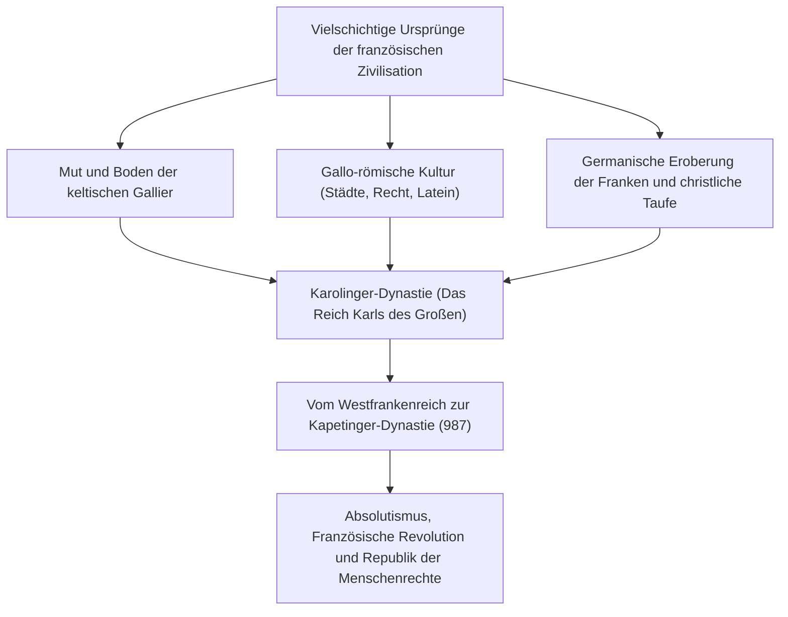
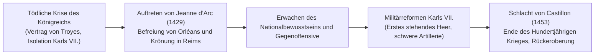
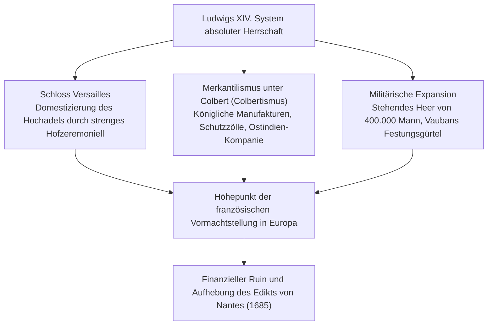
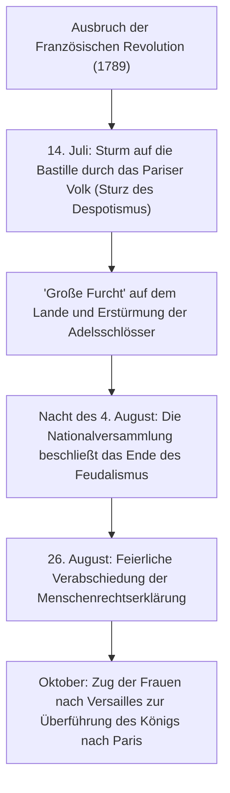
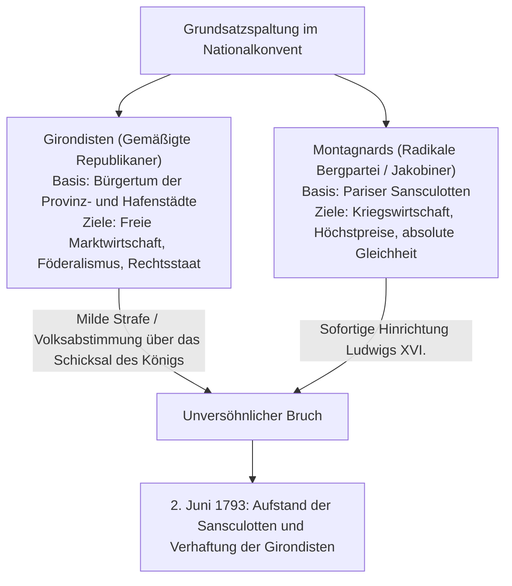

## 1. Einleitung: Die französische Zivilisation als Herz Europas

### 1.1 Die Gallier und Caesars *Gallischer Krieg*

Am westlichen Rand des europäischen Kontinents erstreckt sich ein fruchtbares Sechseck (L'Hexagone), begrenzt vom Atlantischen Ozean, dem Mittelmeer, dem Rhein, den Pyrenäen und den Alpen. Lange bevor dieses Land den Namen „Frankreich“ trug, war es das von zahlreichen keltischen Völkerschaften bewohnte „Gallien“ (*Gallia*).

Zwischen 58 v. Chr. und 51 v. Chr. setzte der römische Feldherr Gaius Julius Caesar sein kaltes militärisches Genie ein, um ganz Gallien zu unterwerfen. Caesars unvergänglicher Klassiker *Commentarii de Bello Gallico* (*Der Gallische Krieg*) schilderte die Tapferkeit der gallischen Krieger und das Gefüge ihrer Stammesgesellschaft mit beispielloser Präzision.

Im Jahr 52 v. Chr. erhoben sich unter der Führung des jungen Arvernerfürsten Vercingetorix alle gallischen Stämme zu einem gewaltigen Aufstand gegen Rom. Doch in der entscheidenden Schlacht um Alesia, wo Caesar eine bis dahin ungesehene doppelte Belagerungslinie errichtete (einen inneren Wall gegen die Festung und einen äußeren gegen das Entsatzheer), brach der gallische Widerstand unter Hunger und mörderischen Sturmangriffen zusammen. Hoch zu Ross ritt Vercingetorix vor das Zelt Caesars, warf seine Waffen zu Boden und ergab sich.

Unter römischer Herrschaft erlebte Gallien eine tiefgreifende Latinisierung; es entstand die blühende gallo-römische Kultur mit befestigten Römerstraßen, Aquädukten (wie dem Pont du Gard) und monumentalen Amphitheatern (Arles, Nîmes). Die keltischen Sprachen wichen dem Vulgärlatein, das zur Wiege des späteren Französisch wurde. Die Niederlage bei Alesia war die schmerzhafte Feuertaufe, durch die Frankreich als älteste Tochter der klassischen lateinischen Zivilisation ins Leben trat.

---

### 1.2 Die Taufe Chlodwigs, das Frankenreich und das Erbe Karls des Großen

Im 5. Jahrhundert, im Zuge des Zusammenbruchs des Weströmischen Reiches, überschritten die salischen Franken den Rhein und drangen nach Nordgallien vor. Im Jahr 481 vereinte der Begründer der Merowinger-Dynastie, **Chlodwig I. (Clovis I., Regierungszeit 481–511)**, die Stämme und schuf das Frankenreich.

Chlodwigs folgenschwerste Tat war seine feierliche Taufe im Jahr 496 in der Kathedrale von Reims, mit der er das katholische (nizänisch-athanasianische) Bekenntnis annahm. Während die meisten anderen germanischen Herrscher (Ostgoten, Westgoten, Vandalen) dem arianischen Glauben anhingen, sicherte Chlodwigs Übertritt zum orthodoxen Katholizismus der fränkischen Krone die bedingungslose Unterstützung des gallo-römischen Adels und der Kirche und begründete die unantastbare Legitimität des Reiches im mittelalterlichen Abendland.

Im 8. Jahrhundert schlug Hausmeier Karl Martell die islamische Expansion in der Schlacht von Tours und Poitiers (732) zurück. Sein Sohn Pippin der Jüngere begründete mit päpstlichem Segen die Dynastie der Karolinger. Unter Pippins Sohn, **Karl dem Großen (Charlemagne, Regierungszeit 768–814)**, wurde fast ganz Westeuropa (das heutige Frankreich, Deutschland, Norditalien und die Benelux-Länder) zu einem geeinten christlichen Imperium zusammengeschmiedet.

Am Weihnachtstag des Jahres 800 krönte Papst Leo III. Karl den Großen im Petersdom zu Rom zum Kaiser und erneuerte das weströmische Kaisertum. Die Karolingische Renaissance, die das Studium des klassischen Lateins und das Klosterwesen wiederbelebte, entzündete ein Leuchtfeuer der Gelehrsamkeit im Frühmittelalter.

Nach Karls Tod zerbrach das Reich jedoch infolge der germanischen Tradition der Realteilung unter den Söhnen:
- **843: Vertrag von Verdun**: Teilung in das Westfrankenreich, das Mittelreich und das Ostfrankenreich.
- **870: Vertrag von Meerssen**: Aufteilung des Mittelreiches zwischen Ost und West.
Aus dem Westfrankenreich (*Francia Occidentalis*) ging unmittelbar das spätere Königreich Frankreich hervor.

---

## 2. Die Ära der Kapetinger und der Weg zur territorialen Einigung

### 2.1 Die Thronbesteigung Hugo Capets (987) und die bescheidenen Anfänge

Als 987 die direkte karolingische Linie erlosch, wählte die Versammlung der Reichsgroßen den Grafen von Paris, **Hugo Capet (Hugues Capet)**, zum König. Damit begann die jahrhundertelange Herrschaft der **Kapetinger-Dynastie**.

In den Anfangsjahren war die königliche Macht verschwindend gering. Die Krondomäne (*domaine royal*) beschränkte sich auf einen schmalen Landstrich zwischen Paris und Orléans, die Île-de-France. Mächtige Feudalherren wie die Herzöge der Normandie, von Aquitanien und Burgund sowie die Grafen von Flandern beherrschten Ländereien und Heere, die denen der Krone weit überlegen waren, und betrachteten den König lediglich als „Ersten unter Gleichen“ (*primus inter pares*).

Dennoch besaßen die Kapetinger zwei entscheidende Vorzüge:
1. **Die Salbung mit heiligem Öl (*Sacre*)**: Bei der Krönung in der Kathedrale von Reims empfing der Herrscher sakrale Weihen und galt als von Gott eingesetzter König (Glaube an die Wundertätigkeit der Könige, die durch Handauflegen Skrofulose heilen konnten: *les rois thaumaturges*).
2. **Die lückenlose männliche Erbfolge**: Über mehr als 340 Jahre hinweg, von 987 bis 1328, riss die Kette der männlichen Thronfolger niemals ab, was die Erbmonarchie dauerhaft verankerte.

---

### 2.2 Philipp II. August und die territoriale Expansion

Der Herrscher, der die Krondomäne vervielfachte und erstmals mit voller Autorität den Titel „König von Frankreich“ (*Rex Franciae*) trug, war **Philipp II. August (Philippe Auguste, Regierungszeit 1180–1223)**.

Damals beherrschte das englische Haus Plantagenet (Heinrich II., Richard Löwenherz, Johann Ohneland) die Normandie, Anjou und Aquitanien und formte damit auf französischem Boden das mächtige „Angevinische Reich“.

Philipp August nutzte die Verfehlungen von König Johann Ohneland geschickt aus und annektierte 1204 im Handstreich die Normandie, Anjou, Maine und die Touraine.
Am 27. Juli 1214 kam es zur historischen **Schlacht von Bouvines**: Philipp Augusts königliches Heer traf auf die Koalition aus Johann Ohneland, dem deutschen Kaiser Otto IV. und dem Grafen von Flandern. Der französische Sieg zerschlug das Bündnis, drängte die Engländer aus Nordfrankreich zurück und erhob die französische Krone an die Spitze der europäischen Staatenwelt.

Philipp August schuf zudem ein besoldetes Beamtentum aus dem aufstrebenden Bürgertum – die Baillis im Norden und Seneschalle im Süden –, um Steuern einzutreiben und Recht zu sprechen. Er machte Paris zur dauerhaften Hauptstadt, errichtete die Festung des Louvre, ließ Straßen pflastern und gewaltige Wehrmauern bauen.

---

### 2.3 Philipp IV. der Schöne und der Bruch mit dem Papsttum (Anagni und Avignon)

Gegen Ende des 13. Jahrhunderts baute der kühle Machtpolitiker **Philipp IV. der Schöne (Philippe IV le Bel, Regierungszeit 1285–1314)** den zentralisierten Beamtenstaat weiter aus.

Um seine Kriege zu finanzieren, besteuerte Philipp den Klerus. Dies führte zum erbitterten Konflikt mit Papst Bonifatius VIII., der in der Bulle *Unam Sanctam* den päpstlichen Primat über alle weltlichen Herrscher beanspruchte.
- **1302: Erste Einberufung der Generalstände (*États généraux*)**: In der Kathedrale Notre-Dame versammelte Philipp Vertreter des Klerus, des Adels und des städtischen Bürgertums, um den Rückhalt der Nation gegen Rom zu sichern.
- **1303: Das Attentat von Anagni**: Ein Trupp unter Guillaume de Nogaret überfiel den Papst in seiner Residenz in Anagni; von der Demütigung erholte sich Bonifatius VIII. nicht mehr und starb kurz darauf.
- **1309–1377: Das Papsttum in Avignon**: Philipp setzte die Wahl des französischen Papstes Clemens V. durch und verlegte den Papstsitz nach Avignon in Südfrankreich, wodurch das Papsttum fast 70 Jahre unter französischer Kontrolle verblieb.
- Schließlich zerschlug er den mächtigen Templerorden unter dem Vorwurf der Ketzerei und zog dessen ungeheure Schätze für die Staatskasse ein.

Der universale Herrschaftsanspruch der Kirche im Mittelalter war gebrochen; Frankreich trat als erster wahrhafter europäischer „Souveränitätsstaat“ hervor.

---

### 2.4 Der Hundertjährige Krieg und das Wunder von Jeanne d’Arc

Nach dem Aussterben der direkten Kapetingerlinie bestieg Philipp VI. aus dem Hause Valois den Thron. Daraufhin erhob der englische König Eduard III., dessen Mutter eine Tochter Philipps des Schönen war, Anspruch auf die französische Krone – der Hundertjährige Krieg brach 1337 aus.

Bei Crécy (1346), Poitiers (1356, Gefangennahme König Johanns II.) und Azincourt (1415) wurde die französische Ritterschaft von den englischen Langbogenschützen vernichtend geschlagen. Als das Herzogtum Burgund sich mit England verbündete, enterbte der Vertrag von Troyes (1420) den Dauphin Karl zugunsten des englischen Königs Heinrich V. Der legitime Thronfolger Karl VII. war hinter die Loire nach Bourges geflohen; Frankreich stand am Abgrund der Auslöschung.

Im Frühjahr 1429 trat ein sechzehnjähriges Bauernmädchen aus Domrémy, **Jeanne d’Arc (Johanna von Orléans)**, vor Karl VII. in Chinon. Geleitet von göttlichen Visionen des Erzengels Michael gelobte sie, die Belagerung von Orléans aufzuheben und den Dauphin in Reims krönen zu lassen. In weißer Rüstung ritt sie an der Spitze der Truppen in die belagerte Stadt ein.

Jeannes unerschütterlicher Glaube entfachte den Kampfgeist der französischen Soldaten. Innerhalb von nur neun Tagen wurde die Belagerung von Orléans gebrochen und Karl VII. durch feindliches Gebiet nach Reims geführt, um gesalbt zu werden. Zwar wurde Jeanne später bei Compiègne gefangen genommen und 1431 in Rouen als Hexe auf dem Scheiterhaufen verbrannt, doch das Feuer des Patriotismus erlosch nie wieder.

Karl VII. ordnete die Finanzen und schuf das **erste stehende Berufsheer Europas (die Ordonnanzkompanien: *Compagnies d'ordonnance*)** sowie eine überlegene Artillerie. In der Schlacht von Castillon (1453) zerschmetterten die französischen Geschütze die englischen Linien: Der Hundertjährige Krieg endete mit der vollständigen Rückeroberung Frankreichs mit Ausnahme von Calais.

---

## 3. Von den Hugenottenkriegen zum Gipfel des Absolutismus

### 3.1 Die Erschütterung der Reformation und die Hugenottenkriege (1562–1598)

Mitte des 16. Jahrhunderts fand die Lehre Johannes Calvins rasche Verbreitung im Bürgertum und Teilen des Adels; diese französischen Protestanten wurden **Hugenotten** genannt.

Unter schwachen Herrschern entbrannte ein erbitterter Glaubenskrieg zwischen der radikal-katholischen Partei der Herzöge von Guise und den Hugenotten unter Führung des Hauses Bourbon und Admiral Coligny.
- **24. August 1572: Die Bartholomäusnacht (St. Bartholomew's Day Massacre)**: Auf Betreiben von Katharina von Medici wurden tausende protestantische Edelleute und Bürger, die zur Hochzeit Heinrichs von Navarra nach Paris gekommen waren, im Schlaf ermordet. Das Blutbad breitete sich landesweit aus und forderte zehntausende Todesopfer.

Die Rettung aus der nationalen Katastrophe brachte der Führer der Hugenotten und Erbe der Krone, **Heinrich IV. (Henri IV., Regierungszeit 1589–1610)**, Begründer des Hauses Bourbon.
Mit den Worten „Paris ist eine Messe wert“ konvertierte er zum Katholizismus, um das Volk zu einen, und erließ **1598 das historische Edikt von Nantes**. Es beließ den Katholizismus als Staatsreligion, gewährte den Hugenotten jedoch Gewissensfreiheit, Bürgerrechte und militärische Sicherheitsplätze (wie La Rochelle). Damit legte er den Grundstein für die moderne religiöse Toleranz.

---

### 3.2 Richelieus „Staatsräson“ und die Festigung der absoluten Monarchie

Nach der Ermordung Heinrichs IV. übernahm Kardinal **Richelieu (Armand Jean du Plessis)** als Leitender Minister für den jungen Ludwig XIII. die Geschicke des Landes.

Das Fundament von Richelieus Philosophie war die **„Staatsräson“ (*Raison d'État*)**: Das Überleben, die Souveränität und die Einheit des Staates stehen bedingungslos über individueller Moral, religiösen Gefühlen und aristokratischen Privilegien.
- Im Inneren brach er den militärischen Widerstand der Hugenotten durch die Belagerung von La Rochelle (während er ihre Religionsfreiheit beließ), schleifte die Burgen aufrührerischer Adliger und entsandte königliche Intendanten in alle Provinzen, um die Zentralgewalt durchzusetzen.
- Nach außen verbündete sich der katholische Kirchenfürst im Dreißigjährigen Krieg (1618–1648) ohne Zögern mit den protestantischen deutschen Fürsten und Schweden, um das Haus Habsburg (Österreich und Spanien) niederzuringen.

Der von seinem Nachfolger Kardinal Mazarin ausgehandelte **Westfälische Friede (1648)** brachte Frankreich weite Teile des Elsass und begründete seine Vormachtstellung in Europa.

---

### 3.3 Der Sonnenkönig Ludwig XIV. (Regierungszeit 1643–1715): „Der Staat bin ich“

Nach Mazarins Tod im Jahr 1661 übernahm der 22-jährige **Ludwig XIV. (Louis XIV.)** die persönliche Regentschaft. Gestützt auf die Lehre des Gottesgnadentums von Bischof Bossuet verkörperte er den Höhepunkt der absoluten Monarchie.

#### ① Versailles als Instrument der Disziplinierung
Südwestlich von Paris als Meisterwerk des Barock erbaut, war das Schloss von Versailles weit mehr als eine prunkvolle Residenz.
Eingedenk der Adelsrebellion der Fronde (1648–1653) verpflichtete der Sonnenkönig den Hochadel, am Hof zu leben. Durch kleinliche Ehren und Rituale beim Aufstehen (*lever*) und Zubettgehen (*coucher*) wurden die stolzen Aristokraten zu fügsamen Höflingen degradiert.

#### ② Colberts Wirtschaftspolitik und das Riesenheer
Finanzminister Jean-Baptiste Colbert entwickelte den Merkantilismus („Colbertismus“), schuf königliche Manufakturen für Luxusgüter (Gobelins, Spiegel) und baute den Außenhandel aus. Kriegsminister Louvois rüstete ein stehendes Heer von 400.000 Soldaten auf, während Marschall Vauban Frankreichs Grenzen mit einem uneinnehmbaren Netz sternförmiger Festungen sicherte.

#### ③ Der Preis des Ruhmes: Der Widerruf des Edikts von Nantes
Doch die Glorie forderte ihren Tribut.
Endlose Kriege (Holländischer Krieg, Pfälzischer Erbfolgekrieg, Spanischer Erbfolgekrieg) führten zum Staatsbankrott.
Der verhängnisvollste Fehler war 1685 das **Edikt von Fontainebleau (Widerruf des Edikts von Nantes)**: Mit dem Verbot des Protestantismus flohen zwischen 200.000 und 300.000 der fähigsten Kaufleute, Handwerker und Bankiers nach Holland, England und Preußen, was der französischen Wirtschaft einen schweren Schlag versetzte.

---

## 4. Die Aufklärung und der Sturm der Französischen Revolution (1789–1799)

### 4.1 Die Krise des Ancien Régime und der Geist der Aufklärung

Im 18. Jahrhundert litt Frankreich unter den starren Fesseln der ständischen Ordnung des **Ancien Régime**:
- **Erster Stand (Klerus, ca. 100.000)**: Besaß 10 % des Grundbesitzes und genoss Steuerfreiheit.
- **Zweiter Stand (Adel, ca. 400.000)**: Besaß 20–25 % des Bodens, zahlte kaum Steuern und besetzte alle Schlüsselpositionen in Verwaltung, Justiz und Armee.
- **Dritter Stand (Bürger und Bauern, ca. 25 Millionen, 98 % der Bevölkerung)**: Trug die gesamte Steuerlast, besaß jedoch keinerlei politische Mitspracherechte.

Gegen diese Missstände erhoben die Philosophen der **Aufklärung (*Enlightenment*)** ihre Stimme:
- **Voltaire** bekämpfte religiösen Fanatismus und trat für Gedanken- und Meinungsfreiheit ein.
- **Montesquieu** entwarf in *Vom Geist der Gesetze* die Lehre von der Gewaltenteilung.
- **Jean-Jacques Rousseau** forderte im *Gesellschaftsvertrag* die Volkssouveränität und die Unterordnung unter den Gemeinwillen (*volonté générale*).
- **Diderot und d’Alembert** schufen mit der *Encyclopédie* ein Monument der Vernunft und Wissenschaften zur Überwindung des Aberglaubens.

---

### 4.2 Der Sturm auf die Bastille und die Menschenrechtserklärung (1789)

Die Schuldenlast aus den Kriegen Ludwigs XV. und der finanziellen Unterstützung des Amerikanischen Unabhängigkeitskrieges trieb die Staatsfinanzen in den Ruin. Als die Reformversuche am Widerstand der Privilegierten scheiterten, musste Ludwig XVI. im Mai 1789 nach 175 Jahren erstmals wieder die Generalstände einberufen.

Als der Streit über den Abstimmungsmodus eskalierte, erklärten sich die Vertreter des Dritten Standes zur **Nationalversammlung (*Assemblée nationale*)**. Aus ihrem Saal ausgesperrt, leisteten sie am 20. Juni im Ballhaus den berühmten **Ballhausschwur**, sich niemals zu trennen, bis eine Verfassung geschaffen sei.

Als der König Truppen zusammenzog und Finanzminister Necker entließ, explodierte der Zorn der Pariser Bevölkerung.

Am 26. August 1789 verabschiedete die Nationalversammlung die **Erklärung der Menschen- und Bürgerrechte**:
1. **„Die Menschen werden frei und gleich an Rechten geboren und bleiben es.“** (Artikel 1)
2. **„Der Ursprung jeder Souveränität liegt wesensmäßig bei der Nation.“** (Artikel 3)
3. Unveräußerliche Rechte auf Freiheit, Eigentum, Sicherheit und Widerstand gegen Unterdrückung.
4. Gleichheit vor dem Gesetz, Unschuldsvermutung sowie Meinungs- und Religionsfreiheit.

---

### 4.3 Das Ende der Monarchie und die Schreckensherrschaft

Die Revolution radikalisierte sich rasch. Im Juni 1791 zerstörte der gescheiterte Fluchtversuch des Königs nach Varennes (**Flucht nach Varennes**) jegliches Vertrauen des Volkes.
Als Österreich und Preußen mit militärischer Intervention drohten, erklärte Frankreich im April 1792 den Krieg. Aus dem ganzen Land strömten Freiwillige zusammen und sangen das Kriegslied der Rheinarmee, die spätere *Marseillaise*.

- **Sturm auf die Tuilerien am 10. August 1792**: Sansculotten und Freiwillige setzten den König ab. Der neu gewählte Nationalkonvent rief die **Erste Republik** aus.
- **21. Januar 1793**: Ludwig XVI. wurde wegen Hochverrats auf der Place de la Révolution (heute Place de la Concorde) durch die Guillotine hingerichtet; im Oktober folgte ihm Marie-Antoinette aufs Schafott.

Angesichts der feindlichen Koalition und des royalistischen Bauernaufstands in der Vendée übernahm der Wohlfahrtsausschuss unter Maximilien Robespierre die Macht.

Robespierre proklamierte: **„Die Triebfeder der Volksregierung in Zeiten der Revolution ist zugleich die Tugend und der Schrecken: die Tugend, ohne die der Schrecken verderblich ist; der Schrecken, ohne den die Tugend ohnmächtig ist.“** In der **Schreckensherrschaft (*La Terreur*)** wurden rund 40.000 angebliche Feinde der Republik hingerichtet.
Trotz militärischer Erfolge durch die Massenmobilisierung (*levée en masse*) führte die ständige Angst vor der Guillotine zur Verschwörung im Konvent: Am **9. Thermidor (27. Juli 1794)** wurde Robespierre gestürzt und am Folgetag enthauptet.

---

## 5. Napoleon Bonaparte und das Erste Kaiserreich

### 5.1 Der Wiederhersteller der Ordnung: Vom 18. Brumaire zur Kaiserkrönung

Das Direktorium versank nach dem Sturz Robespierres in Korruption und Schwäche. Die Nation sehnte sich nach Ruhe und der Bewahrung der bürgerlichen Errungenschaften. Diese historische Rolle fiel dem jungen korsischen Artilleriegeneral **Napoleon Bonaparte (1769–1821)** zu.

Nach Ruhm bei der Belagerung von Toulon und glänzenden Siegen in Italien (1796–1797) stürzte Napoleon am 9. November 1799 im **Staatsstreich des 18. Brumaire** das Direktorium und ernannte sich zum Ersten Konsul.

Napoleons größtes Verdienst war die **Verankerung der Revolutionsideale in dauerhaften Institutionen und Gesetzen**:
1. **Der Code civil (Code Napoléon, 1804)**: Verankerte die Gleichheit aller Bürger vor dem Gesetz, die Religionsfreiheit, die Vertragsfreiheit und den Schutz des Privateigentums. Er bildet bis heute das Fundament des kontinentaleuropäischen Zivilrechts.
2. **Institutionelle Reformen**: Gründung der Banque de France, Schaffung des Franc germinal, Aufbau eines zentralen Schulwesens (Gymnasien, Universitätsakademien, Abitur) und Stiftung der Ehrenlegion.
3. **Das Konkordat von 1801**: Aussöhnung mit Papst Pius VII.; der Katholizismus wurde als Religion der Mehrheit der Franzosen anerkannt, die Kirche blieb jedoch staatlicher Aufsicht unterstellt.

Am 2. Dezember 1804 nahm Napoleon in der Kathedrale Notre-Dame zu Paris die Krone aus den Händen des Papstes und krönte sich selbst zum **Kaiser der Franzosen** (Erstes Kaiserreich).

---

### 5.2 Kontinentale Vormacht und die Katastrophe in Russland

Mit der Grande Armée errang Napoleon dank strategischer Geschwindigkeit und Konzentration der Kräfte überwältigende Triumphe:
- **1805: Schlacht von Austerlitz (Dreikaiserschlacht)**: Vernichtung der russisch-österreichischen Heere; Auflösung des tausendjährigen Heiligen Römischen Reiches Deutscher Nation und Bildung des Rheinbundes.
- **1806: Zusammenbruch Preußens**: Doppelschlacht von Jena und Auerstedt und Einzug in Berlin.

Allein Großbritannien blieb unbesiegt. Nach der Niederlage bei Trafalgar (1805) verhängte Napoleon 1806 mit dem Berliner Dekret die **Kontinentalsperre**, um England wirtschaftlich in die Knie zu zwingen.

Als Russland die Blockade brach, zog Napoleon im Juni 1812 mit über 600.000 Mann gen Osten.
Die russische Armee wich unter Kutusow aus und wandte die Taktik der verbrannten Erde an; Moskau ging in Flammen auf. Auf dem Rückzug bei minus 30 Grad wurde die Grande Armée von Kälte, Hunger und Kosakenangriffen vernichtet. Nur wenige zehntausend Soldaten kehrten lebend zurück.

Die von Napoleon geweckt werdenden Nationalbewegungen wandten sich nun gegen ihn. Nach der Völkerschlacht bei Leipzig (1813) dankte er 1814 ab und ging nach Elba ins Exil. Seine Rückkehr für die „Herrschaft der Hundert Tage“ endete in der **Schlacht bei Waterloo (1815)** gegen Wellington und Blücher. Verbannt auf die abgelegene Atlantikinsel St. Helena, starb Napoleon 1821.

---

## 6. Das 19. Jahrhundert: Kettenreaktion der Revolutionen

Nach Napoleons Sturz setzte der Wiener Kongress die Bourbonen unter Ludwig XVIII. wieder ein (Restauration). Doch das Rad der Geschichte ließ sich nicht zurückdrehen. Das 19. Jahrhundert wurde zum Experimentierfeld zwischen Monarchie, Republik und Kaisertum.

### 6.1 Die Julirevolution (1830) und die Februarrevolution (1848)

- **1830: Die Julirevolution (Les Trois Glorieuses)**: Als Karl X. die Verfassung aushebeln wollte, bauten Arbeiter und Studenten Barrikaden (Vorbild für Delacroix’ berühmtes Gemälde *Die Freiheit führt das Volk*). Karl X. floh; Louis-Philippe von Orléans wurde als „Bürgerkönig“ inthronisiert (Julimonarchie, beherrscht von Großbankiers).
- **1848: Die Februarrevolution**: Das infolge der Industrialisierung gewachsene Proletariat forderte das allgemeine Wahlrecht. Louis-Philippe dankte ab, die **Zweite Republik** wurde ausgerufen. Die Schließung der von Louis Blanc initiierten „Nationalwerkstätten“ für Arbeitslose führte zum blutigen Juniaufstand, der erbarmungslos niedergeschlagen wurde.

---

### 6.2 Das Zweite Kaiserreich Napoleons III. und der Umbau von Paris

Aus den Wirren ging der Neffe Napoleons, **Louis-Napoléon Bonaparte**, als strahlender Sieger der Präsidentschaftswahl von 1848 hervor.
Durch einen Staatsstreich im Dezember 1851 löste er das Parlament auf und ließ sich 1852 zum Kaiser **Napoleon III.** ausrufen (Zweites Kaiserreich: 1852–1870).

Napoleon III. beauftragte Baron Haussmann mit dem **monumentalen Umbau von Paris**:
- Abriss der engen, unhygienischen Gassen, die sich leicht für Barrikaden eigneten.
- Bau breiter Boulevards, die strahlenförmig vom Triumphbogen ausgingen, moderne Kanalisation, Gaslaternen und Stadtparks (Bois de Boulogne).
- Das weltberühmte Erscheinungsbild des modernen Paris entstand in dieser Epoche.

Nach außenpolitischen Abenteuern (Krimkrieg, Italien, Mexiko) ließ sich Napoleon III. 1870 von Bismarck in den **Deutsch-Französischen Krieg** treiben. In der Schlacht von Sedan geriet der Kaiser in Gefangenschaft; das Zweite Kaiserreich brach zusammen.

---

### 6.3 1871: Die Tragödie der Pariser Kommune

Aus Wut über die preußische Belagerung und die schmachvolle Kapitulation der provisorischen Regierung unter Thiers verweigerten die Pariser Arbeiter und die Nationalgarde die Entwaffnung.
Am 28. März 1871 wurde vor dem Rathaus die **Pariser Kommune (Commune de Paris)** ausgerufen – die erste Arbeiterregierung der Weltgeschichte.

- Sie verfügte revolutionäre Reformen: Trennung von Kirche und Staat, Verbot von Kinderarbeit, Übergabe verlassener Fabriken an Arbeiterkooperativen und Abschaffung des stehenden Heeres.
- Regierungstruppen eroberten die Stadt mit deutscher Hilfe zurück.
- In der **„Blutigen Maiwoche“ (*Semaine sanglante*, 21.–28. Mai 1871)** wurden rund 20.000 Kommunarden getötet (Gedenkmauer *Mur des Fédérés* auf dem Friedhof Père-Lachaise) und zehntausende in Strafkolonien verbannt.

---

## 7. Von der Dritten Republik zu den Weltkriegen, De Gaulle und der Fünften Republik

### 7.1 Die Belle Époque und die Verankerung der Laizität

Die aus den Trümmern der Kommune entstandene **Dritte Republik (1870–1940)** währte 70 Jahre und wurde zum Fundament des modernen Frankreichs.
Die Zeit bis 1914 ging als **„Belle Époque“** in die Geschichte ein: Bau des Eiffelturms zur Weltausstellung 1889, Blüte des Impressionismus und Erfindung des Kinos durch die Gebrüder Lumière.

Erschüttert wurde das Land durch die **Dreyfus-Affäre (1894)**. Die antisemitische Fehlverurteilung des jüdischen Hauptmanns Alfred Dreyfus wegen angeblichen Verrats an Deutschland veranlasste Émile Zola zu seinem Aufschrei **„J’accuse…!“ (Ich klage an!)**. Das Land spaltete sich in reaktionäre Militärs und republikanische Verteidiger der Menschenrechte.

Nach Dreyfus’ Rehabilitierung verabschiedeten die Republikaner das **Gesetz zur Trennung von Kirche und Staat von 1905**. Das Prinzip des **Laizismus (*Laïcité*)** – der strikten Verbannung der Religion aus dem staatlichen und schulischen Raum – wurde zum Herzstück des republikanischen Ethos.

---

### 7.2 Die Weltkriege und Charles de Gaulles Widerstand

- **Erster Weltkrieg (1914–1918)**: Der deutsche Vormarsch wurde an der Marne gestoppt. Nach zermürbenden Grabenkämpfen (Verdun mit 700.000 Opfern) siegte Frankreich, verlor jedoch 1,4 Millionen Soldaten und erlitt schwere Zerstörungen im Norden.
- **Zweiter Weltkrieg und das Vichy-Regime (1940)**: Die Wehrmacht umging die Maginot-Linie; Frankreich kapitulierte in sechs Wochen. Marschall Pétain errichtete in Vichy ein kollaborierendes Marionettenregime.

Am 18. Juni 1940 rief der nach London geflohene Brigadegeneral **Charles de Gaulle** über die BBC zum Widerstand auf:
> **„Hat Frankreich sein letztes Wort gesprochen? Gibt es keine Hoffnung mehr? Ist die Niederlage endgültig? Nein! […] Was immer geschehen mag: Die Flamme des französischen Widerstandes darf nicht erlöschen und wird nicht erlöschen!“**

De Gaulle organisierte das „Freie Frankreich“ und einte mit Jean Moulin die Résistance im Inland. 1944 befreite sich Paris selbst, und Frankreich sicherte sich seinen Platz als Siegermacht mit ständigem Sitz im UN-Sicherheitsrat.

---

### 7.3 Die Fünfte Republik und die gaullistische Diplomatie

Als die Vierte Republik im Algerienkrieg (1954–1962) kollabierte, wurde de Gaulle 1958 an die Macht gerufen.

Er schuf die Verfassung der **Fünften Republik (Cinquième République)** mit einem starken Präsidenten an der Spitze:
- **Anerkennung der algerischen Unabhängigkeit (Verträge von Évian, 1962)**: Ende des Kolonialreichs.
- **Eigene nukleare Abschreckungsmacht (*Force de frappe*)**: Unabhängigkeit vom US-Atomschirm.
- **Gaullistische Außenpolitik**: Austritt aus der militärischen NATO-Struktur (1966), frühe Anerkennung der Volksrepublik China (1964) und Verfechtung einer multipolaren Weltordnung.

Die Krise im **Mai 1968** mit Studentenunruhen und einem Generalstreik von 10 Millionen Arbeitern leitete den Wandel zu einer liberalen, feministischen und ökologisch bewussten Gesellschaft ein.

---

## 4.5 Im Tiefgrund der Revolution: Girondisten gegen Montagnards und die *Erklärung der Rechte der Frau*

Der Richtungsstreit im Nationalkonvent (1792–1795) berührte die Grundlagen des Staates:

### ① Olympe de Gouges und die *Erklärung der Rechte der Frau und Bürgerin*
Die Menschenrechtserklärung von 1789 galt de facto nur für wohlhabende Männer.
Die Schriftstellerin **Olympe de Gouges (1748–1793)** veröffentlichte 1791 die **Erklärung der Rechte der Frau und Bürgerin (*Déclaration des droits de la femme et de la citoyenne*)**:

> **„Die Frau wird frei geboren und bleibt dem Mann an Rechten gleich.“**
> **„Wenn die Frau das Recht hat, das Schafott zu besteigen, muss sie gleichermaßen das Recht haben, die Tribüne zu besteigen.“**

Sie forderte Wahlrecht, Bildungschancen und Eigentumsrechte für Frauen. 1793 ließen die Jakobiner sie auf der Guillotine hinrichten. Ihr Werk bildet die Geburtsstunde des modernen Feminismus.

---

## 5.3 Napoleons Militärdoktrin: Das Korpssystem und die Kunst der Bewegung

Napoleons Erfolge beruhten auf revolutionärer Organisation und operativer Kunst:
1. **Das System der Armeekorps (*Corps d'Armée*)**:
   - Gliederung des Heeres in selbstständige Korps von 20.000 bis 30.000 Mann mit eigener Infanterie, Kavallerie und Artillerie.
   - Jedes Korps konnte einen überlegenen Feind 24 bis 48 Stunden lang binden.
   - **„Getrennt marschieren, vereint schlagen“**: Rascher Vormarsch auf getrennten Straßen, gefolgt vom blitzartigen Zusammentreffen auf dem Schlachtfeld.
2. **Die Strategie der inneren Linie und Konzentration**:
   - Vorstoß in die Nahtstelle zweier verbündeter Heere zur Trennung ihrer Verbindung.
   - Fesselung eines Gegners mit schwachen Kräften bei gleichzeitiger Massierung der Hauptmacht zur Vernichtung des anderen.

---

## 7.4 Die Schmerzen der Dekolonisierung: Điện Biên Phủ und der Algerienkrieg (1954–1962)

Nach 1945 erschütterte der Verlust des zweitgrößten Kolonialreichs der Welt Frankreichs Selbstverständnis:
### ① Das Ende in Indochina: Die Schlacht um Điện Biên Phủ (1954)
Im Dschungel Vietnams verschanzte sich die französische Armee im Talkessel von Điện Biên Phủ. General Giap ließ schwere Geschütze von Hand auf unwegsame Berghöhen schaffen und nahm das Lager unter Dauerbeschuss. Nach zwei Monaten kapitulierte die Besatzung, was den Rückzug Frankreichs aus Indochina besiegelte.

### ② Der Algerienkrieg und die Geburt der Fünften Republik
Algerien galt seit 1830 als integraler Bestandteil Frankreichs mit über einer Million europäischen Siedlern (*Pieds-Noirs*). 1954 begann die Befreiungsfront FLN den bewaffneten Aufstand.
- Der Einsatz von Folter und willkürlichen Hinrichtungen durch Fallschirmjäger (Schlacht von Algier) löste Proteste französischer Intellektueller um Jean-Paul Sartre aus.
- Ein drohender Militärputsch algerienfranzösischer Generäle im Mai 1958 stürzte die Vierte Republik und brachte de Gaulle zurück an die Macht.
- Trotz Attentaten der rechtsextremen OAS schloss de Gaulle 1962 die **Verträge von Évian** und entließ Algerien in die Unabhängigkeit.

---

## 7.5 Explosion des modernen Denkens und der Kulturstaat (Sartre, Camus, Malraux)

Nach dem Krieg blieb Paris die intellektuelle Welthauptstadt.

### ① Existenzialismus: Sartre gegen Camus
In den Cafés von Saint-Germain-des-Prés prägten Jean-Paul Sartre und Albert Camus die Philosophie:
- **Sartre (*Das Sein und das Nichts*)**: „Die Existenz geht dem Wesen voraus.“ Der Mensch muss sich durch politisches Engagement (*engagement*) verwirklichen. Sartre rechtfertigte zeitweise revolutionäre Gewalt.
- **Camus (*Der Mensch in der Revolte*)**: Camus lehnte jede Ideologie ab, die Menschenleben für abstrakte Ziele opfert. Ihr Bruch spiegelte die ethischen Grundfragen des 20. Jahrhunderts wider.

### ② André Malraux und das Kulturministerium (1959)
Schriftsteller André Malraux schuf unter de Gaulle das erste moderne Kulturministerium:
- Kultur sollte **„für alle Bürger zugänglich gemacht werden“**.
- Bau von Kulturhäusern (*Maisons de la Culture*) in den Provinzen.
- Reinigung der historischen Pariser Fassaden und Denkmalschutzgesetz (*Loi Malraux*).

---

## 7.6 Die Ära Mitterrand und das Ende der Todesstrafe (1981)

1981 wurde mit François Mitterrand der erste sozialistische Präsident der Fünften Republik gewählt.

### ① Robert Badinter und die Abschaffung der Todesstrafe (September 1981)
Frankreich vollstreckte als letztes westeuropäisches Land Hinrichtungen mit der Guillotine (die letzte 1977). Justizminister Robert Badinter setzte im Parlament gegen den Widerstand der öffentlichen Meinung die Abschaffung durch:
> **„Gerechtigkeit darf kein Töten sein. Dem Staat das Recht abzusprechen, das Leben eines Bürgers zu nehmen, ist die höchste Bekräftigung der Menschenwürde.“**

### ② Ausbau des Sozialstaates
- Reduzierung der Wochenarbeitszeit auf 39 Stunden (später 35 Stunden unter Jospin).
- Fünf Wochen bezahlter Jahresurlaub; Erhöhung des Mindestlohns (SMIC).
- Dezentralisierungsgesetze zur Stärkung der Regionen und Departements.

### ③ Emmanuel Macron und die europäische Souveränität
2017 mit 39 Jahren gewählt, forderte Emmanuel Macron in seiner Sorbonne-Rede eine **europäische strategische Souveränität** in Verteidigung, Industrie und Energie, um Europas Rolle im multipolaren 21. Jahrhundert zu sichern.

---

## 8. Fazit: Das unvergängliche Licht von Freiheit, Gleichheit, Brüderlichkeit

Frankreichs Geschichte ist geprägt von einer tiefen Leidenschaft für den **Universalismus (*Universalisme*)**.
Die französische Zivilisation stellte in Philosophie, Literatur, Kunst und Revolution stets fundamentale Menschheitsfragen nach Freiheit und Gerechtigkeit.

Die Ideale der Trikolore – **„Liberté, Égalité, Fraternité“** – bilden heute das Fundament aller modernen demokratischen Verfassungen.
Trotz aller Debatten um Laizismus und europäischen Zusammenhalt bleibt Frankreichs Glaube an die Vernunft ein unschätzbares Erbe für die Menschheit.
