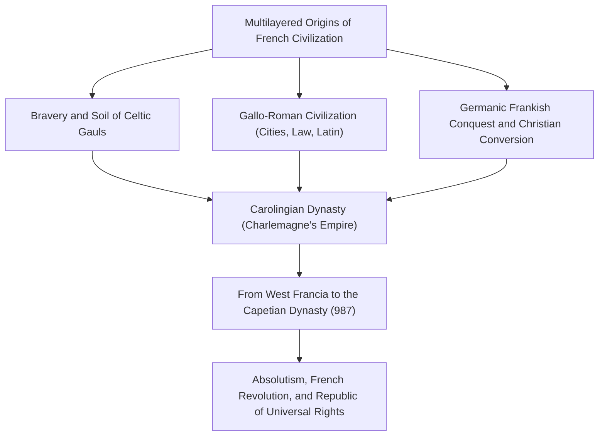
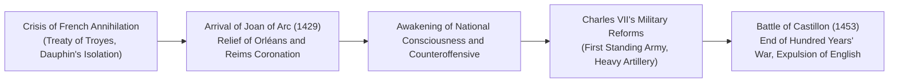
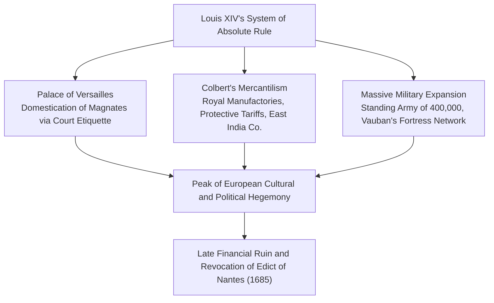
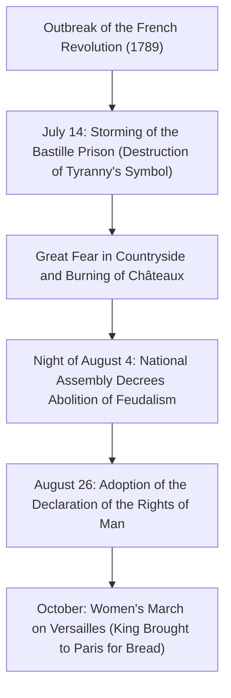
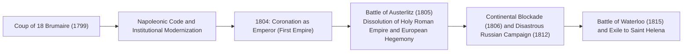
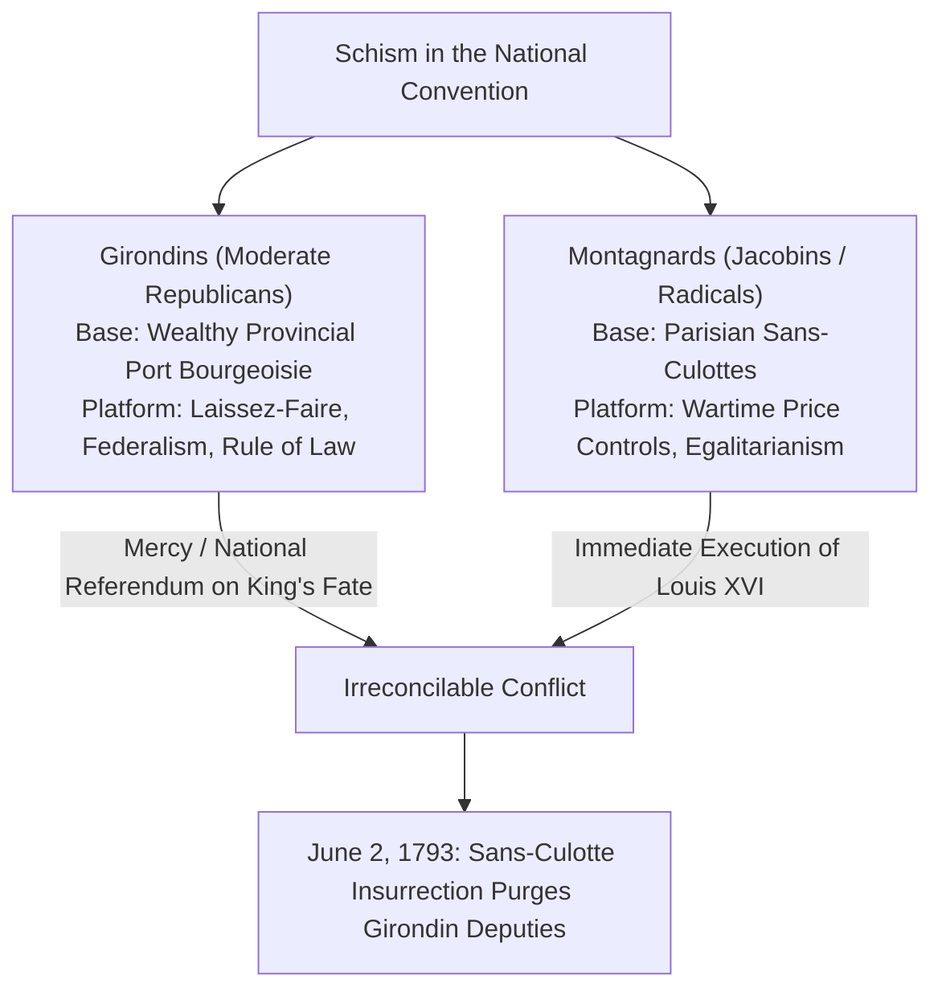

## 1. Introduction: French Civilization as the Heart of Europe

### 1.1 The Gauls and Caesar's *Commentaries on the Gallic War*

At the western edge of the European continent lies a fertile hexagon (L'Hexagone), bounded by the Atlantic Ocean, the Mediterranean Sea, the Rhine River, the Pyrenees, and the Alps. Long before this land was called "France," it was "Gallia" (Gaul), home to a multitude of Celtic tribes.

Between 58 BC and 51 BC, the Roman supreme commander Gaius Julius Caesar set out to conquer all of Gaul with his cold military genius. Caesar's immortal classic, *Commentarii de Bello Gallico* (*Commentaries on the Gallic War*), vividly recorded the bravery of the Gauls and the dynamics of their tribal society.

In 52 BC, under the young Arverni chieftain Vercingetorix, all the Gallic tribes united in a massive uprising against Rome. However, at the Battle of Alesia, where Caesar constructed an unprecedented double line of fortifications (an inner circumvallation and an outer contravallation against reinforcements), the Gallic forces were shattered by hunger and relentless assaults. Riding out on horseback before Caesar's tent, Vercingetorix threw down his armor and surrendered.

Under Roman rule, Gaul rapidly Romanized into a vibrant Gallo-Roman culture, crisscrossed with Roman roads, aqueducts (such as the Pont du Gard), and amphitheaters (Arles, Nîmes). The Celtic tongues faded, and Vulgar Latin took deep root, becoming the matrix of the future French language. The defeat at Alesia served as an agonizing rite of passage that birthed France as the eldest daughter of classical Latin civilization.

---

### 1.2 The Conversion of Clovis, the Frankish Kingdom, and Charlemagne's Legacy

In the 5th century, amidst the collapse of the Western Roman Empire, the Salian Franks—a Germanic confederation—crossed the Rhine and expanded across northern Gaul. In 481, Clovis I (reigned 481–511), founder of the Merovingian dynasty, unified the Frankish tribes and founded the Frankish Kingdom.

Clovis's historic decision came in 496 when he was baptized into Catholic (Nicene-Athanasian) Christianity at the Cathedral of Reims. While most other Germanic nations (Ostrogoths, Visigoths, Vandals) embraced the Arian heresy, Clovis's acceptance of orthodox Catholicism won the Frankish monarchy the ardent backing of the Gallo-Roman senatorial nobility and the Church hierarchy, securing supreme legitimacy as the architect of order in medieval Western Europe.

In the 8th century, after Charles Martel turned back the Islamic expansion at the Battle of Tours-Poitiers (732), his son Pepin the Short obtained papal approval to establish the Carolingian dynasty. Under Pepin's son, Charlemagne (Charles the Great, reigned 768–814), almost all of Western Europe—modern France, Germany, northern Italy, and the Low Countries—was forged into a single Christian empire.

On Christmas Day in the year 800, Pope Leo III placed the imperial crown upon Charlemagne's head at St. Peter's Basilica in Rome, reviving the Western Roman Empire. The Carolingian Renaissance, reviving Latin classics and monastic scholarship, ignited the torch of learning during the early Middle Ages.

However, after Charlemagne's death, the Germanic tradition of partible inheritance fractured the empire:
- **843: Treaty of Verdun**: Divided the empire into West Francia, Middle Francia, and East Francia.
- **870: Treaty of Meerssen**: Partitioned Middle Francia between the eastern and western realms.
Among these, West Francia (Francia Occidentalis) became the direct ancestral crucible of the Kingdom of France.

---

## 2. The Rise of the Capetian Dynasty and the Path to Territorial Unification

### 2.1 The Accession of Hugh Capet (987) and Modest Beginnings

In 987, when the direct Carolingian bloodline became extinct, the great magnates elected Hugh Capet, Count of Paris, as king, establishing the Capetian dynasty.

The authority of the early Capetian kings was extraordinarily fragile. The royal domain (*domaine royal*) was confined to a tiny sliver around Paris and Orléans known as the Île-de-France. Great feudal princes—the Dukes of Normandy, Aquitaine, and Burgundy, and the Counts of Flanders—held vast territories and armies vastly superior to those of the crown, regarding the king as merely "first among equals" (*primus inter pares*).

Yet the Capetians possessed two decisive structural strengths:
1. **Sacral Anointing (*Sacre*)**: Crowned and consecrated with the holy oil at Reims Cathedral, the king was venerated as a divinely ordained monarch endowed with spiritual authority (including the wonder-working belief of the royal touch curing scrofula: *les rois thaumaturges*).
2. **Unbroken Agnatic Succession**: Miraculously, for over 340 years between 987 and 1328, the Capetian dynasty never failed to produce a direct male heir, cementing hereditary royal authority irrevocably.

---

### 2.2 Philip II Augustus and Dramatic Territorial Expansion

The monarch who multiplied the royal domain several times over and established the true title of "King of France" (*Rex Franciae*) was Philip II Augustus (Philippe Auguste, reigned 1180–1223).

At that time, England's Plantagenet dynasty (Henry II, Richard the Lionheart, King John Lackland) controlled Anjou, Normandy, and Aquitaine, creating an "Angevin Empire" that overshadowed the French crown's own domain.

Capitalizing on King John's misrule and breaches of feudal law, Philip II executed a swift legal confiscation and annexed Normandy, Anjou, Maine, and Touraine in 1204.
On July 27, 1214, at the Battle of Bouvines, the French royal army under Philip II collided with a formidable coalition organized by King John, comprising Holy Roman Emperor Otto IV and the Count of Flanders. Philip's crushing victory shattered the Anglo-German coalition, expelled English dominion from northern France, and vaulted French royal prestige to the summit of European politics.

Furthermore, Philip II dispatched salaried crown officials recruited from the rising urban bourgeoisie—bailiffs (*baillis*) and seneschals (*sénéchaux*)—to oversee provincial justice and revenue collection. He designated Paris as the permanent capital, built the fortress of the Louvre, paved the streets, and constructed monumental defensive walls.

---

### 2.3 Philip IV the Fair and the Subjugation of Papal Power (Anagni and the Avignon Papacy)

At the turn of the 14th century, the cold realist Philip IV the Fair (Philippe IV le Bel, reigned 1285–1314) accelerated central bureaucratic rule.

To fund his military campaigns, Philip IV levied taxes on the French clergy, triggering a violent clash with Pope Boniface VIII, who proclaimed in *Unam Sanctam* that papal authority stood supreme over every temporal ruler on Earth.
- **1302: First Convocation of the Estates-General (*États généraux*)**: Philip IV summoned representatives of the clergy (First Estate), the nobility (Second Estate), and urban burghers (Third Estate) to Notre-Dame de Paris to mobilize national support against the papacy.
- **1303: Outrage of Anagni**: Philip's councillor Guillaume de Nogaret led an armed raid on Boniface VIII's palace at Anagni, capturing and humiliating the Pope (who died of shock and grief shortly thereafter).
- **1309–1377: The Avignon Papacy**: Philip secured the election of a French pope, Clement V, and relocated the papal seat to Avignon in southern France, keeping the papacy under French royal supervision for nearly 70 years.
- Furthermore, Philip accused the immensely wealthy Knights Templar of heresy, suppressed the order, and confiscated their wealth into the royal treasury.

The era of medieval universal papal supremacy collapsed, revealing France as Europe's first sovereign territorial state.

---

### 2.4 The Hundred Years' War and the Miracle of Joan of Arc

Following the extinction of the main Capetian line, Philip VI founded the Valois dynasty. In response, King Edward III of England, claiming descent through his mother Isabella, daughter of Philip IV, laid claim to the French crown, igniting the Hundred Years' War in 1337.

At Crécy (1346), Poitiers (1356, where King John II was captured), and Agincourt (1415), the pride of French feudal chivalry was repeatedly decimated by English longbowmen. When the Duchy of Burgundy allied with England, the 1420 Treaty of Troyes recognized King Henry V of England as heir to the French throne. The legitimate Dauphin, Charles VII, was driven south of the Loire to Bourges, leaving France teetering on the edge of extinction.

In the spring of 1429, a teenage peasant girl from Domrémy, Joan of Arc (Jeanne d'Arc), arrived before Charles VII at the Castle of Chinon. Bearing divine visions from Saint Michael instructing her to relieve the Siege of Orléans and crown the Dauphin at Reims, she donned white plate armor and rode directly into the beleaguered city.

Joan's unshakeable faith electrified French morale. In just nine days, she shattered the siege of Orléans and escorted Charles VII through enemy territory to be crowned in Reims Cathedral. Though later captured at Compiègne, subjected to a sham trial in Rouen, and burned at the stake in 1431 at age nineteen, the flame of patriotic unity she sparked could never be extinguished.

Charles VII modernized royal finances and created Western Europe's first permanent standing army—the Ordinance Companies (*Compagnies d'ordonnance*)—along with a dominant artillery corps. In 1453, French cannons annihilated the English at the Battle of Castillon, bringing the Hundred Years' War to a triumphant close with all of France liberated except Calais.

---

## 3. From the French Wars of Religion to the Zenith of Bourbon Absolutism

### 3.1 The Shock of the Reformation and the Wars of Religion (1562–1598)

By the mid-16th century, the Reformed theology of Jean Calvin spread rapidly across France, particularly among merchants, artisans, and sectors of the nobility, who became known as Huguenots.

As royal authority weakened under child monarchs, vicious sectarian rivalries pitted the militant Catholic House of Guise against the Huguenot leadership represented by the House of Bourbon (Kingdom of Navarre) and Admiral Gaspard de Coligny, erupting into more than three decades of devastating civil strife.
- **August 24, 1572: St. Bartholomew's Day Massacre**: Instigated by the queen mother Catherine de' Medici, Catholic mobs and royal guards slaughtered thousands of Huguenot leaders and citizens gathered in Paris under cover of night, triggering massacres across the provinces that claimed tens of thousands of lives.

The man who resolved this cataclysm was the Huguenot leader and heir to the Valois throne, Henri IV (reigned 1589–1610), founder of the Bourbon dynasty.
Declaring that "Paris is well worth a mass," Henri converted to Catholicism to unite the majority of the nation. In 1598, he promulgated the **Edict of Nantes**. While retaining Catholicism as the state religion, the edict granted Huguenots freedom of conscience, civil rights, and military bastions of security (such as La Rochelle). By decoupling religious conformity from national allegiance, Henri IV instituted an early milestone of modern religious toleration.

---

### 3.2 Richelieu's "Raison d'État" and the Foundations of Absolutism

Following Henri IV's assassination by a Catholic fanatic, the young Louis XIII was guided by his Chief Minister, the formidable Cardinal Richelieu (Armand Jean du Plessis).

The core of Richelieu's political philosophy was **"Raison d'État" (Reason of State)**—the doctrine that national survival, sovereignty, and unity supersede individual morality, religious sentiment, and aristocratic privileges:
- Domestically, Richelieu besieged and starved the Huguenot stronghold of La Rochelle, stripping their military independence while preserving freedom of worship. He demolished rebellious nobles' fortresses and blanketed the realm with royal royal commissioners—the Intendants—to subordinate local administration directly to the crown.
- Externally, though a cardinal of the Catholic Church, Richelieu aligned Catholic France with Protestant princes and Sweden in the Thirty Years' War (1618–1648) to crush the encircling Habsburg powers of Austria and Spain.

Under his successor, Cardinal Mazarin, the **1648 Peace of Westphalia** awarded France major territories in Alsace and established France as the preeminent power of continental Europe.

---

### 3.3 Louis XIV, the Sun King (Reigned 1643–1715): "L'État, c'est moi"

Upon Mazarin's death in 1661, twenty-two-year-old Louis XIV assumed personal rule. Grounded in Bishop Bossuet's formulation of the divine right of kings, Louis governed unbound by temporal checks, embodying absolute monarchy at its historical peak.

#### ① The Palace of Versailles as an Apparatus of Power
Built southwest of Paris as the pinnacle of Baroque architecture, the Palace of Versailles—with its Hall of Mirrors, grand geometric gardens, and gilded splendors—was far more than a royal residence.
Having witnessed the aristocratic rebellions of the Fronde (1648–1653) in his youth, Louis required the great nobility to reside at court. By turning access to royal rituals (the *lever* and *coucher*) into high-stakes competitions for trivial honors, he neutralized the aristocracy's political rebelliousness.

#### ② Colbert's Mercantilism and the Standing Army
Controller-General of Finances Jean-Baptiste Colbert implemented an aggressive mercantilist policy ("Colbertism"), founding royal manufactures (Gobelins tapestries, mirrors, luxury porcelain) to stimulate exports and enforcing strict tariffs. Minister of War Louvois built a peacetime standing army of 400,000 men, while Marshal Vauban engineered an impenetrable ring of geometric, star-shaped border fortresses (*Ceinture de fer*).

#### ③ The Cost of Glory: Revocation of the Edict of Nantes and Bankruptcy
Yet this imperial apex sowed seeds of decline.
Endless wars of expansion (War of Devolution, Franco-Dutch War, Nine Years' War, War of the Spanish Succession) bled the royal treasury dry.
The fatal miscalculation came in 1685 with the **Edict of Fontainebleau (Revocation of the Edict of Nantes)**. Declaring that Protestantism no longer existed in France, Louis banned Reformed worship. Between 200,000 and 300,000 of France's most industrious artisans, merchants, and financiers fled to the Netherlands, Britain, and Prussia, dealing an irreparable shock to French industry and beginning the monarchy's twilight.

---

## 4. The Enlightenment and the Upheaval of the French Revolution (1789–1799)

### 4.1 Contradictions of the Ancien Régime and the Intellectual Explosion

In the 18th century, French society groaned beneath the systemic paralysis of the **Ancien Régime (Old Regime)**:
- **First Estate (Clergy, ~100,000)**: Owned 10% of the land and enjoyed near-total tax exemption.
- **Second Estate (Nobility, ~400,000)**: Owned 20–25% of the land, paid virtually no taxes, and monopolized top judicial, administrative, and military offices.
- **Third Estate (Commoners, ~25,000,000, 98% of population)**: Shouldered the crushing burden of royal taxes (taille, capitation, gabelle), tithes, and feudal dues, yet were completely excluded from political governance.

The intellectual vanguard of the **Enlightenment** exposed these grotesque absurdities:
- **Voltaire**: Wielded razor-sharp satire against Catholic intolerance and dogmatism, championing freedom of speech and civil reason (the Calas affair).
- **Montesquieu**: In *The Spirit of the Laws*, formulated the separation of powers as the bulwark against tyranny.
- **Jean-Jacques Rousseau**: In *The Social Contract*, asserted popular sovereignty and posited that legitimate law reflects the "General Will" (*volonté générale*).
- **Diderot and d'Alembert**: Edited the *Encyclopédie*, organizing rational knowledge and empirical science to dismantle medieval superstitions.

---

### 4.2 The Fall of the Bastille and the Declaration of the Rights of Man (1789)

Disastrous royal extravagance under Louis XV, defeat in the Seven Years' War, and massive financial support for the American Revolutionary War brought the French treasury to bankruptcy. When privileged estates blocked reform proposals from ministers like Necker, Louis XVI was forced in May 1789 to convene the Estates-General at Versailles for the first time in 175 years.

When deadlock arose over voting procedure (by order or by head), Third Estate deputies declared themselves the **National Assembly (*Assemblée nationale*)**, the sole legitimate representatives of the nation. Barred from their hall, they convened on a nearby indoor tennis court on June 20, swearing the **Tennis Court Oath** never to separate until France possessed a written constitution.

When the king concentrated troops around Paris and dismissed the popular Necker, Parisian fury erupted.

Adopted on August 26, 1789, the **Declaration of the Rights of Man and of the Citizen** (drafted with Lafayette) established immortal principles:
1. **"Men are born and remain free and equal in rights."** (Article 1)
2. **"The principle of all sovereignty resides essentially in the nation."** (Article 3: Popular Sovereignty)
3. Inviolability of natural rights: liberty, property, security, and resistance to oppression.
4. Equality before the law, presumption of innocence, freedom of speech and religion, and the sacred right to property.

---

### 4.3 From the Fall of the Monarchy to the Reign of Terror

Radicalization soon outpaced moderate reform. In June 1791, Louis XVI and Marie Antoinette attempted to flee to the Austrian border, only to be intercepted at Varennes. The **Flight to Varennes** shattered any remaining popular trust in the crown.
When Austria and Prussia issued the Declaration of Pillnitz threatening military intervention, revolutionary France declared war in April 1792. Volunteers (*fédérés*) marched to Paris singing the "Chant de guerre pour l'armée du Rhin," soon immortalized as "La Marseillaise."

- **Insurrection of August 10, 1792**: Armed sans-culottes and volunteers stormed the Tuileries Palace, deposing the monarchy. The newly elected National Convention abolished the monarchy and proclaimed the **First Republic**.
- **January 21, 1793**: Louis XVI was convicted of high treason against the nation and guillotined at the Place de la Révolution (now Place de la Concorde); Marie Antoinette was executed that October.

Facing the First Coalition of European powers, peasant uprisings in the Vendée, and hyperinflation, executive power passed to Maximilien Robespierre and the Committee of Public Safety.

Robespierre declared that **"Terror without virtue is fatal; virtue without terror is impotent."** The Committee instituted the **Reign of Terror (*La Terreur*)**, guillotining around 40,000 perceived counter-revolutionaries, including royalists, Girondin moderates, and former comrades like Georges Danton.
Though the regime stabilized frontiers through mass conscription (*levée en masse*) and enforced price ceilings, the constant terror alienated the National Convention. On July 27, 1794 (**9 Thermidor Year II**), Robespierre was overthrown, sent to the guillotine the next day, and the Terror ended.

---

## 5. The Rise of Napoleon Bonaparte and the First French Empire

### 5.1 Restorer of Order: From 18 Brumaire to the Imperial Throne

As the post-Thermidor Directory foundered in corruption, instability, and royalist conspiracies, French society clamored for stability and the preservation of revolutionary gains. This demand was met by a young Corsican artillery genius: **Napoleon Bonaparte (1769–1821)**.

After winning fame at the Siege of Toulon and conquering northern Italy (1796–1797), Napoleon seized power on November 9, 1799, in the **Coup of 18 Brumaire**, establishing the Consulate with himself as First Consul.

Napoleon's enduring legacy lay in transforming revolutionary principles into enduring administrative and legal architecture:
1. **The French Civil Code (Napoleonic Code, 1804)**: Codified legal equality, freedom of religion, contractual liberty, inviolability of private property, and the patriarchal family. It remains the foundation of continental civil law worldwide.
2. **Institutional Foundations**: Established the Banque de France, standardized the Franc de Germinal, instituted centralized secular education (lycées, university academies, the baccalauréat), and founded the Legion of Honour.
3. **The Concordat of 1801**: Reconciled the state with Pope Pius VII, recognizing Catholicism as the religion of the majority of Frenchmen while keeping Church lands in secular hands and priests on state salaries.

On December 2, 1804, at Notre-Dame Cathedral in Paris, Napoleon took the crown from Pope Pius VII and placed it upon his own head, reigning as **Napoleon I, Emperor of the French**.

---

### 5.2 Continental Hegemony and the Catastrophe in Russia

With the Grand Army (*Grande Armée*), Napoleon swept across Europe through unprecedented operational speed and maneuver:
- **1805: Battle of Austerlitz (Battle of the Three Emperors)**: Annihilated the combined armies of Tsar Alexander I of Russia and Holy Roman Emperor Francis II, dissolving the millennium-old Holy Roman Empire and forming the Confederation of the Rhine.
- **1806: Defeat of Prussia**: Smashed the Prussian army at Jena-Auerstedt and entered Berlin.

Yet Britain, mistress of the seas, remained undefeated. Having lost naval superiority at Trafalgar (1805), Napoleon issued the **Berlin Decree (1806)** establishing the Continental Blockade to strangle British commerce.

When Russia broke the blockade to trade with Britain, Napoleon invaded Russia in June 1812 with an army of over 600,000.
Tsar Alexander I and General Kutuzov pursued a scorched-earth policy, abandoning Moscow to flames. Deep in the Russian interior, minus-30-degree blizzards and starvation devastated the Grand Army on its retreat. Fewer than 100,000 battered troops returned.

Napoleon's conquests awakened national resistance across Europe (the German Wars of Liberation, Spanish guerilla warfare). Defeated at Leipzig (1813), Napoleon abdicated in 1814 and was exiled to Elba. He escaped in 1815 for the "Hundred Days," but suffered final defeat at **Waterloo** against the Duke of Wellington and Field Marshal Blücher. Banished to the remote South Atlantic island of Saint Helena, Napoleon died in 1821.

---

## 6. The 19th-Century Cycle of Revolutions: From Restoration to the Paris Commune

Following Napoleon's fall, the Congress of Vienna restored the Bourbon dynasty under Louis XVIII. Yet the French nation, having experienced equality before the law, could not return to absolute rule. The 19th century became a testing ground of political regimes: constitutional monarchy, republic, and empire.

### 6.1 The July Revolution (1830) and the February Revolution (1848)

- **1830: July Revolution (*Les Trois Glorieuses*)**: When the ultra-royalist Charles X suspended the constitution, Parisian workers and students erected barricades and toppled the regime (the inspiration for Delacroix's *Liberty Leading the People*). Charles X fled, and the liberal Duke of Orléans, Louis-Philippe, was crowned "King of the French" (the July Monarchy, dominated by wealthy bankers).
- **1848: February Revolution**: As industrialization expanded the urban proletariat, demands for universal male suffrage ignited an insurrection. Louis-Philippe abdicated, proclaiming the **Second Republic**. Socialists like Louis Blanc introduced "National Workshops" for unemployed workers, but their sudden closure by conservative forces triggered the bloody June Days uprising.

---

### 6.2 Napoleon III's Second Empire and the Transformation of Paris

Amid the social turmoil, Napoleon's nephew, **Louis-Napoleon Bonaparte**, won the 1848 presidential election in a landslide.
In December 1851, he executed a coup d'état, dissolving the assembly, and in 1852 proclaimed himself **Napoleon III, Emperor of the French** (Second Empire: 1852–1870).

Napoleon III commissioned Baron Haussmann, Prefect of the Seine, to undertake the **Haussmannization of Paris**:
- Demolished cramped, unhygienic medieval alleys that favored rebel barricades.
- Constructed wide, straight boulevards radiating from monuments like the Arc de Triomphe, integrated with comprehensive sewer networks, gas illumination, and public parks (Bois de Boulogne).
- The iconic, luminous elegance of modern Paris was born during this Second Empire epoch.

However, after a series of foreign interventions (victory in the Crimean War, Italian unification support, and the disastrous Mexican adventure), Napoleon III was provoked into the **Franco-Prussian War (1870)** by Bismarck. At the Battle of Sedan, Napoleon III was captured along with his entire army, and the Second Empire disintegrated overnight.

---

### 6.3 1871: The Tragedy of the Paris Commune

Enraged by the Prussian siege, national humiliation, and the capitulation negotiated by Adolphe Thiers's conservative provisional government, the armed workers and National Guards of Paris refused to disarm.
On March 28, 1871, they proclaimed the **Paris Commune (Commune de Paris)**, the first working-class revolutionary government in human history.

- The Commune enacted radical democratic reforms: separation of church and state, abolition of child labor, worker self-management of abandoned factories, and remissions on rent.
- The provisional government at Versailles, with Prussian backing, launched an assault on the capital.
- During **"Bloody Week" (*La Semaine sanglante*, May 21–28)**, brutal street fighting ended in the massacre of roughly 20,000 Communards, culminating in the execution of defenders at the Federals' Wall (*Mur des Fédérés*) in Père Lachaise Cemetery, with tens of thousands deported to penal colonies.

---

## 7. From the Third Republic Through Two World Wars to De Gaulle's Fifth Republic

### 7.1 The Belle Époque and the Codification of Laïcité

Born from the ashes of the Commune, the **Third Republic (1870–1940)** proved to be France's most enduring modern regime, lasting 70 years.
Between the late 19th century and 1914, industrial expansion and artistic innovation defined the **Belle Époque ("Beautiful Era")**: the Eiffel Tower was erected for the 1889 Universal Exposition, Impressionism and Post-Impressionism flourished, and the Lumière brothers invented cinema.

Yet the era was rocked by the **Dreyfus Affair (1894)**. When Captain Alfred Dreyfus, an Alsatian Jewish officer, was falsely convicted of treason for spying for Germany, novelist Émile Zola published his incendiary open letter, **"J'accuse...!"** in *L'Aurore*. The nation fractured between conservative nationalists (army, monarchists, Church) and republican dreyfusards defending individual human rights and justice.

Vindicated by Dreyfus's exoneration, the triumphant republicans enacted the **1905 French Law on the Separation of the Churches and the State (*Loi de 1905*)**. By confining religion to the private sphere and establishing a strictly secular public sphere, the principle of **Laïcité (secularism)** became the bedrock of modern French civic identity.

---

### 7.2 The Two World Wars and Charles de Gaulle's Resistance

- **World War I (1914–1918)**: Invaded by Imperial Germany, French forces halted the German offensive at the Marne. Through brutal trench warfare—exemplified by the Battle of Verdun (700,000 casualties)—France and its Allies triumphed, but at a horrific cost: 1.4 million dead and industrial northern departments ruined.
- **World War II and the Fall of 1940**: In May 1940, Hitler's Panzer divisions bypassed the fortified Maginot Line through the Ardennes. France surrendered in six weeks. Marshal Philippe Pétain set up an authoritarian collaborationist regime in Vichy (*Régime de Vichy*).

On June 18, 1940, having escaped to London, Under-Secretary of State for War **Charles de Gaulle** broadcast a historic appeal via BBC radio:
> **"Has the last word been said? Must hope disappear? Is defeat final? No! ... Whatever happens, the flame of the French resistance must not be extinguished and will not be extinguished."**

Organizing "Free France" from London, De Gaulle unified internal underground movements (the Resistance led by Jean Moulin). Following the 1944 Normandy landings, Paris liberated itself, and France reclaimed its rank among the victorious great powers, securing a permanent seat on the UN Security Council.

---

### 7.3 The Fifth Republic and Gaullist Independent Diplomacy

When the post-war Fourth Republic collapsed under parliamentary factionalism and the crisis of the Algerian War (1954–1962), Charles de Gaulle was summoned from retirement in 1958.

De Gaulle drafted a new constitution establishing the **Fifth Republic (Cinquième République)**, centered on a powerful directly elected executive presidency:
- **Recognized Algerian Independence (Évian Accords, 1962)**: Liquidated the colonial empire.
- **Independent Nuclear Deterrent (*Force de frappe*)**: Rejected absolute reliance on the American nuclear umbrella.
- **Gaullist Sovereignty**: Withdrew from NATO's integrated military command (1966), extended early diplomatic recognition to the People's Republic of China (1964), and opposed American hegemony, championing a multipolar international order.

During the **May 1968 crisis**, student demonstrations and a general strike by 10 million workers challenged traditional authority, transforming France into a modern, individualist, feminist, and ecologically aware society.

---

## 4.5 Depths of the Revolution: The Girondin-Montagnard Clash and the *Declaration of the Rights of Woman*

The factional struggle in the National Convention (1792–1795) was an existential clash over political philosophy:

### ① Olympe de Gouges and the *Declaration of the Rights of Woman and of the Female Citizen*
The 1789 Declaration, while using universalist language, restricted active political rights to property-owning males.
Playwright **Olympe de Gouges (1748–1793)** published the **Declaration of the Rights of Woman and of the Female Citizen** in 1791, challenging patriarchal revolutionary hypocrisy:
> **"Woman is born free and remains equal to man in rights."**
> **"Woman has the right to mount the scaffold; she must equally have the right to mount the rostrum."**

She demanded women's suffrage, property rights, and access to education, defining marriage as an equal civil contract. For challenging the Jacobin regime, Robespierre sent her to the guillotine in 1793. Her pioneering manifesto is a cornerstone of modern feminism, paving the way for Simone de Beauvoir's *The Second Sex*.

---

## 5.3 Napoleon's Military Doctrine: The Corps System and Operational Art

Napoleon's victories stemmed from a revolution in military operational art:
1. **The Combined-Arms Army Corps (*Corps d'Armée*)**:
   - Rather than marching in a single unwieldy mass, Napoleon divided armies into self-contained corps of 20,000 to 30,000 men containing infantry, cavalry, and artillery.
   - Each corps could fight independently for 24 to 48 hours against superior enemy forces.
   - **"March divided, fight united"**: Corps moved rapidly along separate roads, foraging off the land, before converging simultaneously on the enemy flank or rear.
2. **The Strategy of the Central Position**:
   - When facing two allied armies, Napoleon thrust his main force between them, holding one in check while massing superior numbers to destroy the other in detail.

---

## 7.4 Agonies of Decolonization: Dien Bien Phu and the Algerian War (1954–1962)

Following World War II, the collapse of France's colonial empire tore the republic apart:
### ① End of the Indochina War: Battle of Dien Bien Phu (1954)
In Vietnam, French forces sought a set-piece battle against Ho Chi Minh's Viet Minh by establishing a fortified base in the valley of Dien Bien Phu.
General Vo Nguyen Giap hauled hundreds of heavy artillery pieces by hand onto surrounding jungle ridges. After two months of shelling, the French garrison fell, forcing France to withdraw from Southeast Asia at the Geneva Conference.

### ② The Algerian War and the Birth of the Fifth Republic
Governed since 1830 not as a colony but as three French departments, Algeria was home to one million European settlers (*Pieds-Noirs*). In 1954, the National Liberation Front (FLN) launched an armed rebellion.
- French paratroopers defeated urban insurgents through systematic torture and summary executions in the Battle of Algiers, sparking moral outrage led by intellectuals like Jean-Paul Sartre.
- When French generals and settlers in Algiers mutinied in 1958, threatening to parachute into Paris, the Fourth Republic collapsed, returning De Gaulle to power.
- Facing geopolitical reality, De Gaulle signed the **Évian Accords (1962)** granting Algerian independence, surviving assassination attempts by the terrorist OAS.

---

## 7.5 Explosion of Modern French Thought and the Cultural State (Sartre, Camus, Malraux)

After 1945, France maintained global preeminence as the capital of intellectual inquiry and the arts.

### ① Giants of Existentialism: Sartre vs. Camus
In the cafés of Saint-Germain-des-Prés, Jean-Paul Sartre and Albert Camus defined post-war philosophy:
- **Sartre (*Being and Nothingness*)**: "Existence precedes essence." Humanity is condemned to freedom and must define itself through political engagement (*engagement*). Sartre sympathized with Marxism, accepting revolutionary violence.
- **Camus (*The Rebel*)**: Algerian-born Camus rejected totalitarian violence and ideology, insisting that human life must never be sacrificed for historical abstractions. Their bitter public break symbolized 20th-century debates on ethics and political action.

### ② André Malraux and the Creation of the Ministry of Culture (1959)
Appointed by De Gaulle as France's first Minister of Cultural Affairs, writer André Malraux redefined cultural policy:
- Proclaimed the state's duty to make humanity's greatest cultural works accessible to all citizens.
- Established regional cultural centers (*Maisons de la Culture*).
- Launched the high-pressure cleaning of historic Parisian facades and established preserved historic districts (*Loi Malraux*).

---

## 7.6 The Mitterrand Era and the Abolition of the Death Penalty (1981)

In 1981, François Mitterrand became the Fifth Republic's first Socialist president, instituting transformative social democratic reforms.

### ① Robert Badinter and the Abolition of Capital Punishment (1981)
France was the last Western European nation to practice capital punishment by guillotine (the last execution taking place in 1977).
Minister of Justice Robert Badinter delivered a passionate speech before the National Assembly, defying public opinion to abolish the death penalty:
> **"Justice cannot be slaughter. Denying the state the right to take the life of a citizen is the ultimate affirmation of human dignity."**

### ② Labor and Social Welfare Expansion
- Reduced statutory workweek from 40 to 39 hours (later lowered to 35 hours under Lionel Jospin).
- Granted a fifth week of paid annual vacation; increased minimum wage (SMIC) and family allowances.
- Decentralization laws (Defferre Acts) transferring administrative power from prefects to regional councils.

### ③ Emmanuel Macron and European Strategic Autonomy
Elected president in 2017 at age 39, Emmanuel Macron disrupted traditional party politics. In his landmark Sorbonne address, Macron advocated **European Strategic Sovereignty**, urging the EU to build autonomous defense capabilities, technological resilience, and diplomatic agency in an age of US-China tensions and Russian aggression in Ukraine.

---

## 8. Conclusion: The Universal Flame of Liberty, Equality, Fraternity

To trace French history is to witness an unyielding devotion to universalism (*Universalisme*).
Beyond provincial traditions, French civilization has persistently interrogated fundamental questions—what is man, and what constitutes a just society—through the furnace of philosophy, literature, art, and revolution.

The revolutionary triad—**"Liberté, Égalité, Fraternité"**—endures as a beacon of universal human rights in modern democratic constitutions across the globe.
Amid ongoing debates over secularism (*Laïcité*), European integration, and social movements like the Yellow Vests, France continues to renew itself through the power of reason, leaving an indelible legacy for all humanity.
