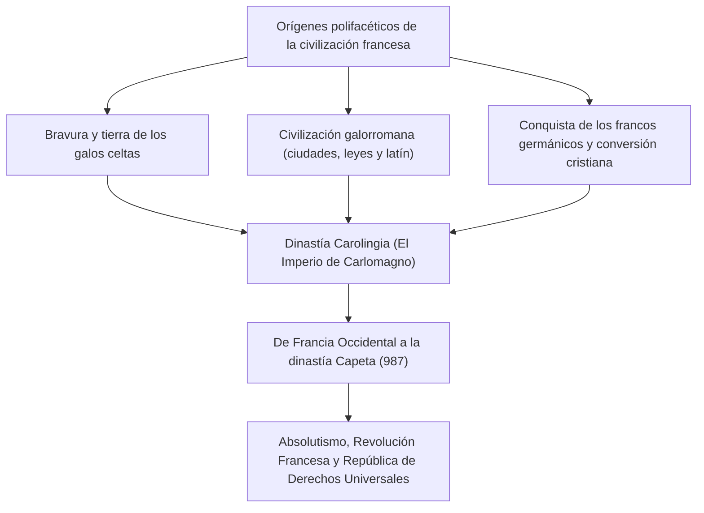
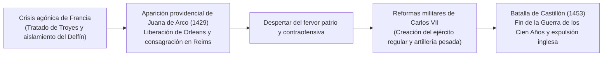
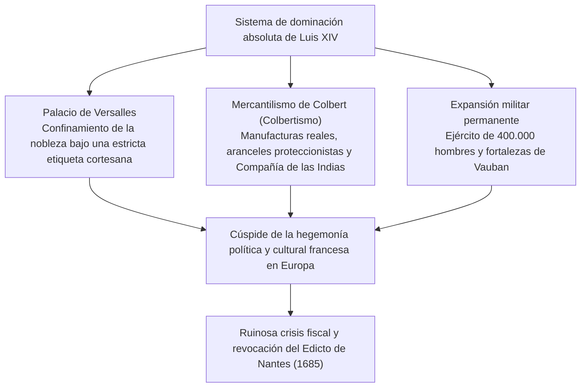
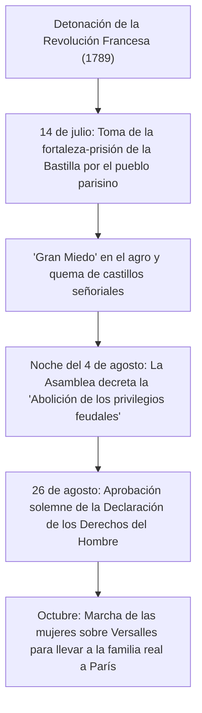
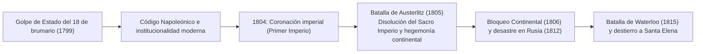
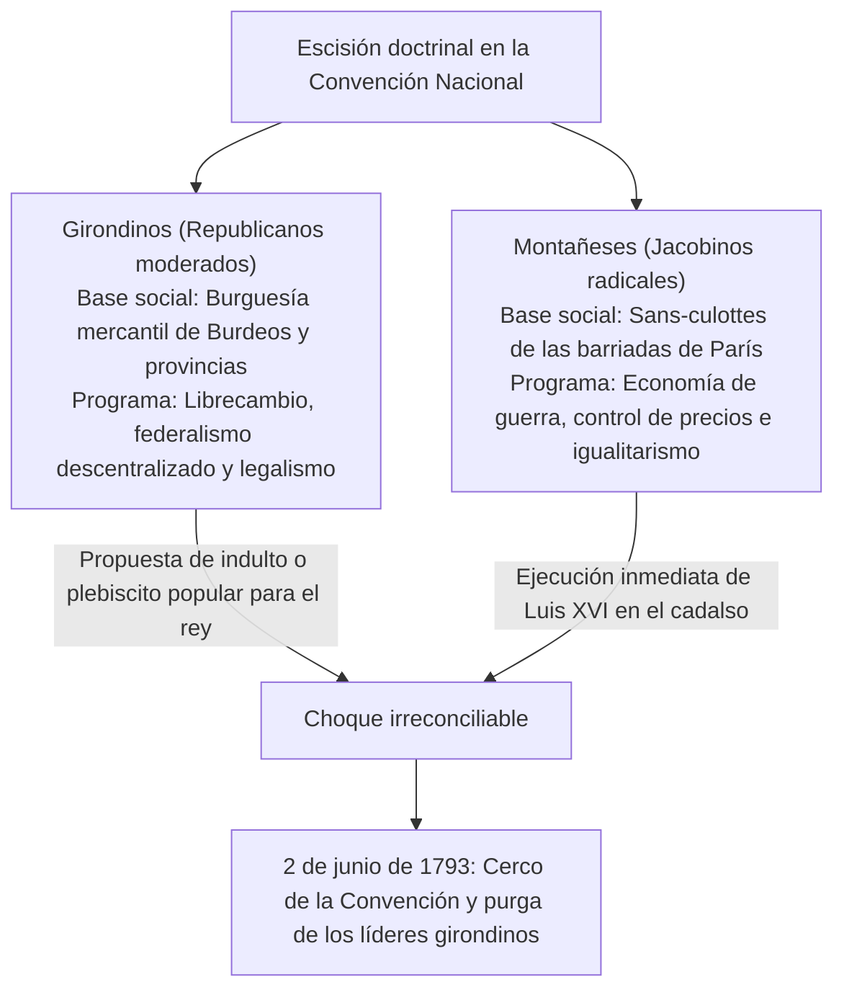

## 1. Introducción: La civilización francesa como corazón de Europa

### 1.1 Los galos y *La guerra de las Galias* de Julio César

En el extremo occidental del continente europeo se despliega un fértil hexágono (L'Hexagone), delimitado por el océano Atlántico, el mar Mediterráneo, el río Rin, los Pirineos y los Alpes. Mucho antes de que este territorio fuera llamado "Francia", era la "Galia" (Gallia), hogar de innumerables tribus de estirpe celta.

Entre los años 58 a. C. y 51 a. C., el comandante supremo de Roma, Cayo Julio César, con su frío y deslumbrante genio militar, emprendió la conquista metódica de toda la Galia. La obra inmortal escrita por el propio general, *La guerra de las Galias* (*Commentarii de Bello Gallico*), legó un registro minucioso sobre el valor indómito de los guerreros galos y la estructura de su sociedad tribal.

En el 52 a. C., bajo el liderazgo del joven caudillo de los arvernos, Vercingétorix, todas las tribus galas se unieron en un levantamiento general contra el yugo romano. No obstante, en la crucial Batalla de Alesia, donde César erigió un doble cerco fortificado sin precedentes (una línea interior de asedio y una muralla exterior contra los refuerzos), las tropas galas capitularon tras semanas de hambruna y sangrientos asaltos. Montado en su corcel, Vercingétorix compareció ante la tienda de campaña de César, arrojó sus armas a los pies del vencedor y se rindió.

Bajo el dominio imperial romano, la Galia experimentó una rápida y profunda romanización, dando nacimiento a la refinada cultura galorromana con sus calzadas, acueductos (como el Pont du Gard) y anfiteatros monumentales (Arlés, Nimes). Las lenguas celtas desaparecieron de forma paulatina frente al empuje del latín vulgar, que constituyó la matriz indiscutible de la futura lengua francesa. La derrota en Alesia representó el crisol del cual nacería Francia como la hija predilecta de la civilización latina clásica.

---

### 1.2 La conversión de Clodoveo, el Reino Franco y el legado de Carlomagno

En el siglo V, al compás del colapso del Imperio Romano de Occidente, los francos salios —pueblo de estirpe germánica— cruzaron el Rin para asentarse en el norte de la Galia. En el 481, **Clodoveo I (Clovis I, reinado 481–511)**, patriarca de la dinastía merovingia, unificó a las tribus guerreras y fundó el Reino Franco.

La decisión de mayor alcance histórico tomada por Clodoveo fue su solemne bautismo en el año 496 en la catedral de Reims, abrazando el catolicismo ortodoxo (credo niceno-atanasiano). Mientras otros pueblos germánicos (visigodos, ostrogodos y vándalos) profesaban la herejía arriana, la adhesión de Clodoveo a la ortodoxia romana granjeó a la monarquía franca el respaldo incondicional de la aristocracia senatorial galorromana y del clero, otorgándole una indiscutible legitimidad fundacional en el occidente medieval.

En el siglo VIII, tras la legendaria victoria de Carlos Martel deteniendo el avance islámico en la Batalla de Poitiers (732), su hijo Pipino el Breve fundó la dinastía Carolingia con la bendición papal. Bajo el reinado del hijo de Pipino, **Carlomagno (Carlos el Grande: Charlemagne, reinado 768–814)**, prácticamente toda Europa occidental (Francia, Alemania, el norte de Italia y los Países Bajos) quedó unificada bajo la corona de un único imperio cristiano.

El día de Navidad del año 800, en la basílica de San Pedro en Roma, el papa León III coronó emperador a Carlomagno, restaurando el título del Imperio Romano de Occidente. El renacimiento carolingio, enfocado en la recuperación del latín clásico y la fundación de escuelas monásticas, encendió una hoguera de erudición en plena Edad Media.

Sin embargo, tras la muerte de Carlomagno, la costumbre consuetudinaria germánica de la división hereditaria fragmentó el imperio:
- **843: Tratado de Verdún**: El territorio se dividió en Francia Occidental, Francia Media y Francia Oriental.
- **870: Tratado de Meerssen**: Francia Media fue absorbida y repartida entre sus dos vecinos.
De estas divisiones territoriales, Francia Occidental (Francia Occidentalis) constituyó la cuna y el embrión ininterrumpido del Reino de Francia.

---

## 2. El surgimiento de la dinastía Capeta y la unificación territorial

### 2.1 La coronación de Hugo Capeto (987) y los modestos comienzos

En el año 987, extinguido el linaje de los carolingios, los grandes magnates feudales eligieron como monarca al conde de París, **Hugo Capeto (Hugues Capet)**, dando inicio a la **dinastía de los Capetos**.

En sus comienzos, la autoridad de la corona capeta era insignificante. El dominio real directo (*domaine royal*) se reducía a una estrecha franja territorial entre París y Orleans, la denominada Île-de-France. Poderosos señores feudales, como los duques de Normandía, Aquitania y Borgoña, o los condes de Flandes, contaban con posesiones territoriales y contingentes militares muy superiores a los del rey, a quien solo consideraban el "primero entre sus iguales" (*primus inter pares*).

Pese a ello, los Capetos contaron con dos ventajas institucionales prodigiosas:
1. **La unción sagrada (*Sacre*)**: Al ser consagrado con los santos óleos en la catedral de Reims, el soberano recibía un aura de investidura divina (los reyes taumaturgos, a quienes la devoción popular atribuía el don de sanar las escrófulas con el tacto).
2. **La continuidad ininterrumpida de la primogenitura**: Durante tres siglos y medio, entre 987 y 1328, la dinastía Capeta engendró siempre un heredero varón directo en cada generación, fijando la legitimidad hereditaria de la corona de forma irreversible.

---

### 2.2 Felipe II Augusto y la gran expansión del reino

El soberano que multiplicó por cuatro el dominio territorial de la monarquía y afianzó por primera vez con pleno derecho el título de "Rey de Francia" (*Rex Franciae*) fue **Felipe II Augusto (Philippe Auguste, reinado 1180–1223)**.

En aquellos momentos, la dinastía Plantagenet de Inglaterra (Enrique II, Ricardo Corazón de León y Juan Sin Tierra) controlaba Normandía, Anjou y Aquitania, levantando en suelo continental el inmenso "Imperio Angevino", que empequeñecía al dominio capeto.

Aprovechando los desaciertos y la rebeldía feudal de Juan Sin Tierra, Felipe Augusto confiscó por vía judicial y militar Normandía, Anjou, Maine y Turena en 1204.
El 27 de julio de 1214, en la trascendental **Batalla de Bouvines**, el ejército real francés aplastó a la coalición formada por Juan Sin Tierra, el emperador germánico Otón IV y el conde de Flandes. Aquella aplastante victoria expulsó a las tropas inglesas del norte de Francia y elevó el prestigio internacional de la corona francesa a la cumbre política de Europa.

Felipe Augusto impulsó una burocracia profesional integrada por bailíos (*baillis*) y senescales (*sénéchaux*) reclutados entre la naciente burguesía para administrar justicia y recaudar tributos. Asimismo, convirtió a París en la capital indiscutible del reino, mandó construir la fortaleza del Louvre, empedró las calzadas urbanas y rodeó la ciudad con murallas de sillería.

---

### 2.3 Felipe IV el Hermoso y la sumisión del papado (Anagni y el pontificado de Aviñón)

A finales del siglo XIII, el frío y calculador monarca **Felipe IV el Hermoso (Philippe IV le Bel, reinado 1285–1314)** profundizó el centralismo monárquico.

Con el fin de financiar sus empresas bélicas, Felipe gravó con impuestos a las rentas del clero, desatando una colisión feroz con el papa Bonifacio VIII, autor de la bula *Unam Sanctam*, donde se proclamaba la supremacía papal universal sobre todo príncipe temporal.
- **1302: Convocatoria inaugural de los Estados Generales (*États généraux*)**: El rey convocó en Notre-Dame de París a representantes del clero, la nobleza y los burgueses de las ciudades para forjar un consenso nacional frente al Sumo Pontífice.
- **1303: El ultraje de Anagni**: El emisario real Guillermo de Nogaret encabezó un comando armado que asaltó la residencia papal en Anagni, reteniendo e intimidando a Bonifacio VIII, quien falleció a las pocas semanas aquejado de humillación y fiebre.
- **1309–1377: El Papado de Aviñón**: Felipe logró la elección de un pontífice francés, Clemente V, trasladando la Santa Sede a Aviñón, donde los pontífices permanecieron bajo la tutela y vigilancia de la corte francesa durante siete décadas.
- Además, Felipe IV instruyó un proceso inquisitorial contra la Orden de los Caballeros Templarios por supuesta herejía, abolió la orden y confiscó sus fabulosas riquezas en favor de las arcas del Estado.

El ideal medieval del poder pontificio universal quedaba superado, consolidando a Francia como el primer "Estado soberano" de Europa.

---

### 2.4 La Guerra de los Cien Años y la gesta de Juana de Arco

Extinguida la línea directa de los Capetos, ascendió al trono Felipe VI de Valois. En respuesta, el monarca inglés Eduardo III, nieto de Felipe el Hermoso por línea materna, reclamó la corona gala, desencadenando en 1337 la Guerra de los Cien Años.

En Crécy (1346), Poitiers (1356, donde el rey Juan II fue tomado prisionero) y Azincourt (1415), la orgullosa caballería feudal francesa sucumbió trágicamente frente a las ráfagas de flechas de los arqueros de tiro largo (*longbowmen*) ingleses. Con el ducado de Borgoña aliado con Inglaterra, el Tratado de Troyes de 1420 reconoció al rey Enrique V de Inglaterra como legítimo heredero del trono francés. El delfín legítimo, Carlos VII, fue arrinconado al sur del río Loira, sumiendo a Francia en peligro inminente de desaparición.

En la primavera de 1429, una joven campesina de dieciséis años natural de Domrémy, **Juana de Arco (Jeanne d'Arc)**, se presentó ante Carlos VII en el castillo de Chinon. Proclamando haber recibido un mandato divino del arcángel San Miguel para romper el asedio de Orleans y conducir al delfín a su coronación en Reims, vistió armadura blanca y se puso al frente del ejército de socorro.

El fervor inconmovible de Juana galvanizó el espíritu de las huestes francesas. En apenas nueve jornadas, rompió el sitio de Orleans y escoltó al delfín a través de comarcas enemigas para ser ungido formalmente en la catedral de Reims. Pese a caer prisionera en Compiègne y perecer en la hoguera de Ruán en 1431 a los diecinueve años condenada por un tribunal eclesiástico espurio, el fuego patriótico que había prendido jamás volvió a extinguirse.

Carlos VII consolidó las finanzas públicas y creó el **primer ejército regular permanente de Europa (las Compañías de Ordenanza: *Compagnies d'ordonnance*)**, respaldado por una imponente artillería. En la Batalla de Castillón (1453), los cañones franceses destrozaron a las tropas inglesas, concluyendo la contienda con la reconquista de toda Francia a excepción de Calais.

---

## 3. De las Guerras de Religión a la cúspide del absolutismo borbónico

### 3.1 El terremoto reformista y las Guerras de Religión (1562–1598)

A mediados del siglo XVI, las doctrinas calvinistas procedentes de Ginebra encontraron una rápida adhesión entre la burguesía industriosa y amplios sectores nobiliarios; estos protestantes franceses fueron bautizados como **hugonotes**.

Aprovechando la debilidad de sucesivos reyes menores de edad, las facciones cortesanas católicas lideradas por la Casa de Guisa y los líderes hugonotes encabezados por los Borbón y el almirante Coligny libraron una contienda civil de sangriento fanatismo durante más de tres décadas.
- **24 de agosto de 1572: La Matanza de San Bartolomé (St. Bartholomew's Day Massacre)**: Instigada por la reina madre Catalina de Médici, milicias y turbas católicas degollaron en París a miles de nobles y vecinos hugonotes congregados para un matrimonio de concordia, desatando una carnicería que se extendió por las provincias segando decenas de miles de vidas.

El líder que pacificó a la nación exhausta fue el propio adalid protestante y heredero de la corona, **Enrique IV (Henri IV, reinado 1589–1610)**, fundador de la Casa de Borbón.
Comprendiendo que la paz civil requería un compromiso con la mayoría, abjuró del protestantismo declarando que "París bien vale una misa", y en **1598 promulgó el histórico Edicto de Nantes**. Este documento preservó al catolicismo como religión oficial, pero concedió a los hugonotes amplia libertad de culto, derechos civiles y plazas fuertes de seguridad militar (como La Rochelle). La separación entre la lealtad política y la confesión religiosa privada representó un hito temprano en la historia de la tolerancia moderna.

---

### 3.2 La "Razón de Estado" de Richelieu y los cimientos del absolutismo

Tras el asesinato de Enrique IV a manos de un fanático regicida, el gobierno efectivo de Luis XIII recayó en una de las mentes políticas más lúcidas y desalmadas de Europa: el cardenal **Richelieu (Armand Jean du Plessis)**.

El eje rector de la filosofía de Richelieu fue la **"Razón de Estado" (*Raison d'État*)**: el principio dogmático de que la supervivencia soberana, la grandeza y la unidad de la monarquía justifican subordinar cualquier consideración ética personal, fervor religioso o privilegio estamental.
- En el frente interior, sitió y rindió por hambre la plaza de La Rochelle para disolver el poder militar protestante (respetando solo la libertad religiosa). Demolió sistemáticamente los castillos feudales rebeldes y desplegó en todas las provincias a los intendentes (*Intendants*), agentes directos de la corona facultados para recaudar impuestos e impartir justicia.
- En el plano exterior, pese a su investidura como príncipe de la Iglesia romana, Richelieu no vaciló en forjar alianzas militares con los príncipes protestantes alemanes y el reino de Suecia durante la Guerra de los Treinta Años (1618–1648), con el exclusivo objetivo de desarticular el cerco geopolítico de los Habsburgo austríacos y españoles.

La **Paz de Westfalia de 1648**, concertada por su sucesor el cardenal Mazarino, otorgó a Francia amplias posesiones en Alsacia y consolidó la supremacía militar gala en el teatro continental.

---

### 3.3 Luis XIV, el Rey Sol (reinado 1643–1715): "El Estado soy yo"

En 1661, al fallecer Mazarino, un joven **Luis XIV (Louis XIV)** de veintidós años asumió las riendas directas del reino. Guiado por la doctrina del derecho divino de los reyes formulada por el obispo Bossuet, gobernó libre de cualquier contrapeso institucional, encarnando el cenit histórico de la monarquía absoluta.

#### ① El Palacio de Versalles como mecanismo de domesticación
Erigido al suroeste de París como joya suprema del barroco civil, el Palacio de Versalles, con su Galería de los Espejos, sus jardines geométricos y su opulencia áurea, constituía un dispositivo de dominación sociopolítica.
Habiendo vivido de niño la revuelta nobiliaria de la Fronda (1648–1653), Luis XIV obligó a la alta aristocracia a residir en la corte, canalizando su combatividad hacia banales disputas de protocolo para disputarse el privilegio de sostener la camisa del monarca en el ritual de su despertar (*lever*) o acostarse (*coucher*).

#### ② El colbertismo y la maquinaria bélica
El intendente de finanzas Jean-Baptiste Colbert estructuró una agresiva política mercantilista, fundando manufacturas de titularidad estatal (tapices de Gobelinos, cristaleras de Saint-Gobain, encajes y porcelanas) para generar superávit comercial bajo aranceles de protección. El marqués de Louvois organizó una fuerza permanente de 400.000 combatientes, al tiempo que el mariscal Vauban blindaba las fronteras del reino con una red geométrica de ciudadelas estrelladas (*Ceinture de fer*).

#### ③ El precio de la desmesura: La revocación del Edicto de Nantes
Esta deslumbrante fachada escondía el germen de la decadencia.
Las constantes contiendas expansionistas (Guerra de Devolución, Guerra Franco-Holandesa, Guerra de los Nueve Años y Guerra de Sucesión Española) vaciaron por completo las arcas reales.
El grave despropósito político se consumó en 1685 con la firma del **Edicto de Fontainebleau (revocación del Edicto de Nantes)**. Al proclamar falsamente que ya no quedaban protestantes en Francia, proscribió sus ceremonias. Entre 200.000 y 300.000 laboriosos comerciantes, manufactureros y banqueros hugonotes huyeron rumbo a Holanda, Inglaterra y Prusia, asestando un golpe letal a la economía francesa y precipitando el crepúsculo de la corona.

---

## 4. Las Luces y la tempestad de la Revolución Francesa (1789–1799)

### 4.1 La crisis terminal del Antiguo Régimen y la Ilustración

Hacia finales del siglo XVIII, la sociedad gala languidecía aprisionada en la estructura estamental del **Antiguo Régimen (*Ancien Régime*)**:
- **Primer Estado (El clero, aprox. 100.000 personas)**: Dueño del 10% del suelo productivo, beneficiario del diezmo y exento de tributación.
- **Segundo Estado (La nobleza, aprox. 400.000 personas)**: Poseedor del 20 al 25% de la tierra, exento del fisco y acaparador de las altas dignidades del Estado, la judicatura y los mandos militares.
- **Tercer Estado (El pueblo llano, aprox. 25 millones, 98% de la población)**: Compuesto por campesinos, artesanos y burgueses, soportaba la totalidad de los tributos (talla, capitación, gabela) sin disfrutar de la menor injerencia en las decisiones públicas.

Frente a este orden caduco, el pensamiento de la **Ilustración (*Enlightenment*)** prendió la chispa intelectual:
- **Voltaire**: Combatió la intolerancia fanática de la Iglesia mediante una sátira mordaz, ensalzando la libertad de pensamiento y la justicia (caso Calas).
- **Montesquieu**: En *El espíritu de las leyes*, formuló la división e independencia de los poderes legislativo, ejecutivo y judicial como freno a la tiranía.
- **Jean-Jacques Rousseau**: En *El contrato social*, fundamentó el principio de la soberanía popular emanada de la "voluntad general" (*volonté générale*).
- **Diderot y D'Alembert**: Compilaron *La Enciclopedia*, estructurando el saber empírico y científico para barrer los prejuicios y supersticiones ancestrales.

---

### 4.2 La toma de la Bastilla y la Declaración de los Derechos del Hombre (1789)

Los exorbitantes dispendios de Luis XV, el fiasco en la Guerra de los Siete Años y la costosa ayuda militar suministrada por Luis XVI a la independencia de los Estados Unidos arruinaron el crédito público francés. Ante la negativa de los privilegiados a tributar, Luis XVI tuvo que convocar en Versalles los Estados Generales en mayo de 1789, inactivos desde hacía 175 años.

Tras bloquearse las sesiones sobre la modalidad de sufragio (por estamento o individual), los delegados del Tercer Estado se autoproclamaron **Asamblea Nacional (*Assemblée nationale*)**. Expulsados de su sala, se congregaron en un frontón cubierto el 20 de junio, jurando en el célebre **Juramento del Juego de Pelota** no separarse jamás hasta dotar a Francia de una constitución.

Cuando el monarca acantonó regimientos alrededor de la capital y despidió al ministro reformista Necker, la exasperación popular estalló en las calles parisinas.

Sancionada el 26 de agosto de 1789, la **Declaración de los Derechos del Hombre y del Ciudadano** (redactada con la colaboración de La Fayette) consagró preceptos imperecederos:
1. **"Los hombres nacen y permanecen libres e iguales en derechos."** (Artículo 1)
2. **"El principio de toda soberanía reside esencialmente en la Nación."** (Artículo 3: Soberanía nacional)
3. La consagración inalienable de la libertad, la propiedad, la seguridad y la resistencia a la opresión.
4. La igualdad formal ante la ley, la presunción de inocencia, la libertad de opinión religiosa y la inviolabilidad de la propiedad privada.

---

### 4.3 La caída de la monarquía y el Terror de la guillotina

La dinámica revolucionaria derivó hacia una rápida radicalización.
En junio de 1791, el intento de evasión de Luis XVI y María Antonieta hacia los dominios austríacos, interceptado en Varennes (**Fuga de Varennes**), destruyó por completo el aura sacra de la realeza ante el pueblo.
Con la amenaza de una invasión coaligada austro-prusiana (Declaración de Pillnitz), la Asamblea declaró la guerra en abril de 1792. Desde las provincias marcharon batallones entonando el himno de guerra del ejército del Rin, que pasaría a la inmortalidad como "La Marsellesa".

- **Insurrección del 10 de agosto de 1792**: Los sans-culottes y los milicianos asaltaron el palacio de las Tullerías, deponiendo al rey. La Convención Nacional abolió formalmente la monarquía y proclamó la **Primera República**.
- **21 de enero de 1793**: Luis XVI fue condenado por alta traición y decapitado en la guillotina en la plaza de la Revolución (actual plaza de la Concordia); en octubre del mismo año, María Antonieta corrió idéntica suerte.

Acosada por la Primera Coalición de potencias europeas y por el alzamiento campesino monárquico de la Vendée, la facción jacobina capitaneada por Maximilien Robespierre asumió el control del Comité de Salvación Pública.

Bajo la máxima de que **"el terror sin la virtud es desastroso; la virtud sin el terror es impotente"**, Robespierre implantó el periodo del **Terror (*La Terreur*)**, despachando al cadalso a cerca de 40.000 ciudadanos considerados contrarrevolucionarios, entre ellos la reina, los líderes girondinos y viejos camaradas como Georges Danton.
A pesar de salvar la integridad territorial mediante la leva en masa y el control de precios, el régimen de terror colectivo sembró el pánico en la propia asamblea. El 27 de julio de 1794 (**9 de Termidor del Año II**), Robespierre fue derrocado y ejecutado al día siguiente, disolviéndose el Terror.

---

## 5. El ascenso de Napoleón Bonaparte y el Primer Imperio

### 5.1 El restaurador del orden: De Brumario a la coronación imperial

El régimen postermidoriano del Directorio zozobró en una crónica parálisis de corrupción, bancarrota y conspiraciones de signo realista y jacobino. La sociedad gala reclamaba un liderazgo firme capaz de asegurar la estabilidad interior sin renunciar a las conquistas cívicas del 89. En este contexto emergió la descollante figura del general corso **Napoleón Bonaparte (1769–1821)**.

Consagrado en el asedio de Tolón y aclamado por sus fulgurantes campañas en Italia (1796–1797), Napoleón protagonizó el 9 de noviembre de 1799 el **Golpe de Estado del 18 de brumario**, disolvió el Directorio y estableció el Consulado, asumiendo el cargo de Primer Cónsul.

El aporte más trascendental de Napoleón residió en **transformar los principios abstractos de la Revolución en instituciones y leyes duraderas**:
1. **El Código Civil de los Franceses (Código Napoleónico, 1804)**: Garantizó la igualdad jurídica, la laicización civil del Estado, la libertad de contratación, el derecho irrestricto de propiedad y el orden familiar patriarcal. Se constituyó en el pilar del derecho continental contemporáneo en medio planeta.
2. **Modernización institucional**: Fundación del Banco de Francia y el franco germinal, centralización educativa estatal (liceos, academias universitarias y el bachillerato) y creación de la Legión de Honor.
3. **El Concordato de 1801**: Reconcilió al Estado francés con el papa Pío VII, declarando al catolicismo como la religión de la mayoría de los ciudadanos, pero manteniendo la enajenación de los bienes eclesiásticos bajo supervisión pública.

El 2 de diciembre de 1804, en la catedral de Notre-Dame de París, Napoleón tomó la corona de manos del papa y se la ciñó él mismo en la cabeza, proclamándose **Napoleón I, Emperador de los Franceses** (Primer Imperio).

---

### 5.2 La hegemonía continental y la tragedia en las estepas rusas

Con su Grande Armée, sustentada en la conscripción general y conducida con audaces maniobras de concentración y velocidad operativa, Napoleón sometió al continente:
- **1805: Batalla de Austerlitz (Batalla de los Tres Emperadores)**: Destrozó a las fuerzas aliadas del zar Alejandro I de Rusia y del emperador germánico Francisco II, poniendo punto final al milenario Sacro Imperio Romano Germánico y creando la Confederación del Rin.
- **1806: Doblegamiento de Prusia**: Arrasó los ejércitos prusianos en Jena y Auerstedt, desfilando triunfalmente por la Puerta de Brandeburgo en Berlín.

Sin embargo, el poderío naval de Gran Bretaña resistió inexpugnable. Tras la pérdida de la flota en Trafalgar (1805), Napoleón promulgó en 1806 el **Bloqueo Continental (Decreto de Berlín)**, pretendiendo asfixiar el comercio británico clausurando todos los puertos de Europa.

Para castigar al zar de Rusia por quebrantar el bloqueo mediante el tráfico de grano con Londres, Napoleón invadió el Imperio ruso en junio de 1812 a la cabeza de más de 600.000 soldados.
El general ruso Kutúzov empleó con rigor la estrategia de tierra quemada, dejando a Moscú pasto de las llamas. En la retirada invernal a través de desoladas llanuras a 30 grados bajo cero, el hambre, las plagas y los cosacos aniquilaron a la Grande Armée. Solo consiguieron salvarse unas decenas de miles de combatientes ateridos.

Habiendo despertado el sentimiento patriótico de los pueblos a los que había pretendido liberar (guerra de guerrillas en España, alzamiento de liberación alemán), el emperador fue cercado. Derrotado en Leipzig (1813), abdicó en 1814 y fue confinado en Elba. Retornó audazmente para gobernar durante los "Cien Días", pero sucumbió definitivamente en la **Batalla de Waterloo** ante Wellington y Blücher. Desterrado a la remota isla atlántica de Santa Elena, falleció en mayo de 1821.

---

## 6. El ciclo decimonónico de revoluciones: De la Restauración a la Comuna

A la caída del águila imperial, el Congreso de Viena restituyó a los Borbones en la persona de Luis XVIII (Restauración). Mas la sociedad gala, transformada por el derecho civil moderno, ya no toleraría el absolutismo de cuño tradicional. El siglo XIX fue un continuo campo de experimentación constitucional entre monarquías, imperios y repúblicas.

### 6.1 La Revolución de Julio (1830) y la Revolución de Febrero (1848)

- **1830: Revolución de Julio (*Las Tres Gloriosas*)**: La pretensión reaccionaria de Carlos X de abolir la libertad de prensa y el parlamento empujó a burgueses, estudiantes y obreros a alzar barricadas combativas (escenario inmortalizado por Delacroix en *La Libertad guiando al pueblo*). El soberano abdicó y fue entronizado el duque de Orleans, Luis Felipe I, proclamado "Rey de los franceses" (Monarquía de Julio, tutelada por la alta banca).
- **1848: Revolución de Febrero**: El descontento de una emergente clase obrera fruto de la Revolución Industrial, aunado a la exigencia del sufragio universal masculino, precipitó la caída de Luis Felipe y el nacimiento de la **Segunda República**. Pese a la creación de los "Talleres Nacionales" para auxiliar a los desempleados a instancias de Louis Blanc, su cierre gubernamental provocó las sangrientas jornadas de junio, brutalmente reprimidas.

---

### 6.2 El Segundo Imperio de Napoleón III y el nuevo París de Haussmann

En aquel clima de zozobra, el sobrino del emperador, **Carlos Luis Napoleón Bonaparte**, venció en las urnas presidenciales de 1848 respaldado por el voto campesino.
En diciembre de 1851 perpetró un golpe de Estado y en 1852 se proclamó emperador con el nombre de **Napoleón III** (Segundo Imperio: 1852–1870).

Napoleón III encomendó al prefecto del Sena, el barón Haussmann, una **remodelación urbanística integral de París**:
- Se arrasaron los nauseabundos y estrechos callejones medievales donde proliferaban las barricadas populares.
- Se trazaron anchos y rectilíneos bulevares que convergían en nudos monumentales como el Arco del Triunfo, complementados con alumbrado a gas, modernos alcantarillados y grandes parques boscosos (Bosque de Boulogne).
- El perfil cosmopolita y señorial que hoy distingue a la "Ciudad de la Luz" se concibió enteramente en esta etapa.

Sin embargo, tras involucrarse en múltiples guerras exteriores (Guerra de Crimea, unificación italiana y la catastrófica aventura en México), Napoleón III cayó en la trampa diplomática de Bismarck en 1870 declarando la **Guerra franco-prusiana**. Sorprendido en Sedán, el emperador fue capturado junto con su ejército, desplomándose el Segundo Imperio de forma fulminante.

---

### 6.3 1871: La tragedia inmortal de la Comuna de París

Indignados ante el asedio militar prusiano, la derrota y el armisticio entreguista negociado por el gobierno provisional de Adolphe Thiers, la milicia ciudadana (Guardia Nacional) y los trabajadores de París rechazaron entregar las armas.
El 28 de marzo de 1871, frente al Ayuntamiento capitalino, fue solemnemente proclamada la **Comuna de París (Commune de Paris)**, el primer gobierno de emancipación obrera en la historia universal.

- La Comuna decretó medidas de avanzada democracia socialista: laicidad del Estado, supresión del trabajo infantil, gestión de las fábricas abandonadas por cooperativas de obreros y supresión del ejército permanente en favor del pueblo en armas.
- Las tropas de Versalles del gobierno de Thiers, auxiliadas por prisioneros liberados por Bismarck, ejecutaron el asalto sobre la urbe insurrecta.
- Durante la **"Semana Sangrienta" (*La Semaine sanglante*, del 21 al 28 de mayo)**, la lucha se libró trinchera a trinchera; unos 20.000 partidarios de la Comuna fueron pasados por las armas en fusilamientos masivos (como en el Muro de los Federados del cementerio de Père-Lachaise) y decenas de miles fueron deportados a ultramar.

---

## 7. De la Tercera República a las guerras mundiales, De Gaulle y la Quinta República

### 7.1 La Belle Époque y la instauración de la Laicidad

Surgida sobre las cenizas humeantes de la represión comunera, la **Tercera República (1870–1940)**, concebida en un principio como un pacto transitorio, se convirtió en el régimen republicano más longevo de la Francia moderna, perdurando siete décadas.
El cambio de siglo hasta 1914 congregó una etapa de febril desarrollo técnico, prosperidad y creatividad bautizada como la **"Belle Époque"**: la inauguración de la Torre Eiffel para la Exposición Universal de 1889, la eclosión de la pintura impresionista y el nacimiento del cinematógrafo por los hermanos Lumière.

Esta sociedad se fracturó conmovida por el **"Caso Dreyfus" (1894)**. El capitán alsaciano de origen judío Alfred Dreyfus fue injustamente procesado y desterrado bajo el cargo falso de espionaje para Alemania. En un acto de valentía cívica, el célebre novelista Émile Zola publicó en el diario *L'Aurore* su célebre alegato **"¡Yo acuso...!" (*J'accuse…!*)**. La nación quedó polarizada entre la derecha militarista y clerical y los defensores de los derechos humanos y la legalidad republicana.

Con la plena rehabilitación de Dreyfus, la izquierda republicana promulgó la seminal **Ley de Separación de las Iglesias y del Estado de 1905 (*Loi de 1905*)**. Al privatizar la vivencia religiosa y desterrar cualquier tutela clerical de las instituciones y las aulas, el principio innegociable de la **Laicidad (*Laïcité*)** quedó erigido en dogma ciudadano de la República francesa.

---

### 7.2 El azote de las guerras mundiales y la Resistencia del general De Gaulle

- **Primera Guerra Mundial (1914–1918)**: Tropas francesas detuvieron la acometida imperial alemana en el Marne. Tras la pavorosa guerra de desgaste y trincheras ejemplificada en Verdún (700.000 bajas), Francia y sus aliados prevalecieron, pero a un coste atroz: 1,4 millones de jóvenes muertos y el norte industrial arrasado.
- **La debacle de 1940 y el colaboracionismo de Vichy**: En mayo de 1940, los carros de combate alemanes desbordaron la línea Maginot por los bosques de las Ardenas mediante la guerra relámpago (*Blitzkrieg*). Tras seis semanas de campaña militar, Francia cayó rendida. El anciano mariscal Pétain estableció en la ciudad balnearia de Vichy una dictadura servil y colaboracionista con el Tercer Reich.

El 18 de junio de 1940, habiendo escapado a Londres, el subsecretario de Guerra, general **Charles de Gaulle**, pronunció por los micrófonos de la BBC su inmortal alocución:
> **"¿Se ha dicho la última palabra? ¿Debe desaparecer la esperanza? ¿Es definitiva la derrota? ¡No! [...] Pase lo que pase, la llama de la resistencia francesa no debe apagarse y no se apagará."**

Articulando desde el exilio las fuerzas de la "Francia Libre" y unificando las redes clandestinas del interior bajo la coordinación de Jean Moulin, De Gaulle logró que París se liberara a sí misma en 1944 tras el desembarco de Normandía. En virtud de esta epopeya, Francia se sentó en la mesa de las potencias vencedoras y obtuvo un puesto permanente con derecho de veto en el Consejo de Seguridad de la ONU.

---

### 7.3 La Quinta República y la diplomacia soberanista de De Gaulle

La Cuarta República de posguerra zozobró en una crónica inestabilidad de gabinetes parlamentarios incapaces de encauzar la sangrienta Guerra de Independencia de Argelia (1954–1962). Al filo de la guerra civil en 1958, Francia volvió a apelar al liderazgo del general De Gaulle.

De Gaulle redactó una nueva carta magna que alumbró la **Quinta República (Cinquième République)**, fundada en una presidencia con amplios poderes ejecutivos emanada del sufragio universal directo:
- **Consagración de la independencia argelina (Acuerdos de Évian, 1962)**: Liquidación honrosa del imperio colonial.
- **Desarrollo de un arsenal nuclear disuasorio propio (*Force de frappe*)**: Rechazo del sometimiento absoluto a la doctrina militar estadounidense.
- **Doctrina exterior gaullista**: Retiro del mando militar integrado de la OTAN en 1966, reconocimiento pionero de la República Popular China en 1964 y condena de la intervención norteamericana en Vietnam, cimentando una política soberana e impulsora de un mundo multipolar.

Los sucesos de **Mayo del 68**, caracterizados por barricadas estudiantiles en el Barrio Latino y una huelga obrera de 10 millones de trabajadores, resquebrajaron las viejas estructuras patriarcales, impulsando a la sociedad hacia el individualismo moderno, el feminismo y las reivindicaciones ecológicas.

---

## 4.5 Profundidades de la Revolución: El duelo entre Girondinos y Montañeses y la *Declaración de los Derechos de la Mujer*

Los enconados debates librados en el seno de la Convención Nacional (1792–1795) representaron un combate existencial en torno al modelo de civilización:

### ① Olympe de Gouges y la *Declaración de los Derechos de la Mujer y de la Ciudadana*
La proclamación de 1789, pese a formularse bajo un lenguaje pretendidamente universalista, reservaba el ejercicio de los derechos de ciudadanía activa con exclusividad a los varones propietarios.
La escritora y dramaturga **Olympe de Gouges (1748–1793)** presentó en 1791 la **Declaración de los Derechos de la Mujer y de la Ciudadana (*Déclaration des droits de la femme et de la citoyenne*)**, increpando la hipocresía de los líderes revolucionarios:

> **"La mujer nace libre y permanece igual al hombre en derechos."**
> **"Si la mujer tiene el derecho de subir al cadalso, debe tener igualmente el derecho de subir a la tribuna."**

Olympe reclamó la plenitud del sufragio femenino, el acceso a la educación y la igualdad patrimonial, concibiendo el matrimonio como una asociación civil equitativa. No obstante, los jacobinos censuraron su osadía y Robespierre la mandó guillotinar en 1793 imputándole "haber olvidado los deberes de su sexo". Su lúcido manifiesto anticipó el feminismo contemporáneo que cristalizaría en el siglo XX en obras como *El segundo sexo* de Simone de Beauvoir.

---

## 5.3 Innovaciones del arte bélico napoleónico: El cuerpo de ejército y la maniobra estratégica

Las victorias sucesivas de Bonaparte sobre coaliciones numéricamente superiores obedecieron a una transformación radical de la doctrina y la organización bélica:

1. **La doctrina de los Cuerpos de Ejército combinados (*Corps d'Armée*)**:
   - Frente al anquilosado despliegue de una sola mole militar indivisible, Napoleón fragmentó sus ejércitos en cuerpos independientes y autónomos de 20.000 a 30.000 hombres, integrados por divisiones de infantería, regimientos de caballería, baterías de artillería e ingenieros.
   - Cada cuerpo disfrutaba de solvencia táctica para contener a fuerzas enemigas superiores durante uno o dos días en combate dilatorio.
   - **"Marchar separados, combatir juntos"**: Los diversos cuerpos se desplazaban velozmente por itinerarios paralelos abasteciéndose sobre el terreno, para confluir de improviso en el flanco o retaguardia enemiga en el momento del choque general.
2. **La maniobra por líneas interiores y concentración de esfuerzos**:
   - Ante la aproximación de dos ejércitos adversarios (por ejemplo, austríacos y rusos), Napoleón maniobraba con celeridad interponiéndose en la brecha central para cortar sus comunicaciones.
   - Destacando una fracción secundaria para aferrar y distraer a un ala enemiga, proyectaba la totalidad de su masa de maniobra para destrozar al otro contingente antes de acometer al primero.

---

## 7.4 El doloroso ocaso colonial: Dien Bien Phu y la Guerra de Argelia (1954–1962)

La segunda mitad del siglo XX se caracterizó por la traumática desarticulación del segundo imperio colonial más extenso del planeta.

### ① El final de la Guerra de Indochina: La derrota de Dien Bien Phu (1954)
En Vietnam, frente a la guerra de guerrillas del Viet Minh acaudillado por Ho Chi Minh, el alto mando francés concentró a sus tropas en la planicie fortificada de Dien Bien Phu buscando una batalla campal de desgaste.
Empero, el general Vo Nguyen Giap logró acarrear por selvas y peñascos cientos de cañones pesados en piezas desmontadas, rodeando la base gala desde las alturas. Tras dos meses de cerco asfixiante, el campamento francés fue exterminado, precipitando la salida de Francia de Indochina tras los Acuerdos de Ginebra.

### ② La Guerra de Argelia y el parto de la Quinta República
Incorporada desde 1830 no como simple colonia ultramarina sino como tres provincias integradas al territorio metropolitano, Argelia albergaba a más de un millón de descendientes europeos (*Pieds-Noirs*). En 1954, el Frente de Liberación Nacional (FLN) inició la lucha armada de liberación.
- Los paracaidistas franceses consiguieron someter las redes insurgentes en la capital mediante la aplicación masiva de tormentos y ejecuciones extrajudiciales (Batalla de Argel), generando una severa condena ética enarbolada por pensadores de la talla de Jean-Paul Sartre.
- El estamento militar ultranacionalista y los colonos protagonizaron en 1958 una sublevación armada en Argel con amagos de intervenir en París, colapsando la Cuarta República y devolviendo el poder a De Gaulle.
- Consciente de la inviabilidad histórica del dominio colonial y esquivando repetidos atentados de la extrema derecha armada (OAS), De Gaulle negoció y rubricó los **Acuerdos de Évian en 1962**, concediendo la soberanía nacional al pueblo argelino.

---

## 7.5 Floración intelectual y Estado cultural en la Francia contemporánea (Sartre, Camus, Malraux)

Aunque desprovista de su antigua preponderancia militar sobre el tablero geopolítico, Francia conservó su estatus como faro de la inteligencia y la alta cultura mundial.

### ① El existencialismo y la célebre querella entre Sartre y Camus
En los emblemáticos salones de los cafés Les Deux Magots y Café de Flore en el barrio de Saint-Germain-des-Prés, las doctrinas existencialistas de Jean-Paul Sartre y Albert Camus moldearon la sensibilidad de la posguerra.
- **Sartre (*El ser y la nada*)**: "La existencia precede a la esencia". Carente de un diseño preconcebido, el ser humano está condenado a construirse a sí mismo a través del compromiso libre y militante (*engagement*). Sartre se aproximó al comunismo y legitimó en parte el uso revolucionario de la fuerza.
- **Camus (*El hombre rebelde*)**: De extracción argelina modesta, Camus repudió frontalmente cualquier ideología de salvación histórica que pretendiera justificar la inmolación de seres humanos reales en aras de abstracciones totalitarias. Su ruptura representó el mayor duelo filosófico de la centuria.

### ② André Malraux y la creación del Ministerio de Asuntos Culturales (1959)
Nombrado por De Gaulle como el primer ministro de Cultura del país, el escritor André Malraux revolucionó el concepto de política pública cultural:
- Proclamó el deber ineludible del Estado de **"democratizar las obras cumbres de la humanidad, poniéndolas al alcance directo de todos los ciudadanos"**.
- Fundó una vasta red de "Casas de la Cultura" (*Maisons de la Culture*) por las provincias.
- Ordenó el lavado integral de las fachadas de monumentos y palacios históricos parisinos para rescatar su fulgor arquitectónico original, e implantó la Ley Malraux para la conservación de cascos históricos patrimoniales.

---

## 7.6 La era de Mitterrand y la abolición de la pena capital (1981)

En mayo de 1981, François Mitterrand se convirtió en el primer mandatario socialista de la Quinta República, encabezando un programa de profundas transformaciones sociales.

### ① Robert Badinter y la abolición de la guillotina (septiembre de 1981)
Francia mantenía la pena de muerte mediante la guillotina como un anacronismo judicial heredado del siglo XVIII (la última ejecución pública tuvo lugar en 1977).
El ministro de Justicia, Robert Badinter, superando una opinión pública mayoritariamente inclinada a conservar el castigo máximo, pronunció un magistral alegato ante la Asamblea Nacional:
> **"La justicia no puede ser una matanza. Prohibir al Estado el derecho de privar de la vida a un semejante constituye la afirmación suprema de la dignidad del ser humano."**

### ② Ampliación de los derechos laborales y descentralización
- Disminución de la jornada legal de trabajo de 40 a 39 horas semanales (anticipo de las 35 horas introducidas más tarde por Lionel Jospin).
- Aprobación de una quinta semana de vacaciones remuneradas al año y notables incrementos del salario mínimo (SMIC) y las ayudas familiares.
- Aprobación de las leyes Defferre de descentralización administrativa, confiriendo autonomía fiscal y competencias a los consejos regionales y departamentales frente a la tutela del prefecto estatal.

### ③ Emmanuel Macron y el concepto de la soberanía estratégica europea
Accediendo al palacio del Elíseo en 2017 a los treinta y nueve años, Emmanuel Macron hizo añicos el tradicional bipartidismo francés. En su discurso inaugural de la Sorbona, en un entorno de tensiones comerciales entre Washington y Pekín y la invasión rusa de Ucrania, Macron ha enarbolado el principio de la **Soberanía Estratégica Europea (*Souveraineté européenne*)**, abogando por la autonomía defensiva, energética e industrial común de la Unión Europea, proyectando el legado gaullista al mundo multipolar del siglo XXI.

---

## 8. Conclusión: La antorcha incombustible de Libertad, Igualdad y Fraternidad

Quien repasa las páginas de la historia de Francia se descubre sobrecogido ante una constante indeleble: **su pasión infinita por la universalidad (*Universalisme*)**.

Lejos de aislarse en un estrecho etnocentrismo, la civilización francesa ha interrogado una y otra vez el significado de la libertad del hombre y el fundamento de la justicia terrenal a través de los escritos de sus filósofos, las creaciones de sus artistas y las cenizas de sus revoluciones.

La divisa tricolor consagrada por el torbellino revolucionario de 1789 —**"Liberté, Égalité, Fraternité"**— palpita hoy con fuerza en las cartas magnas y en la conciencia cívica de todas las democracias del mundo.

A pesar de los arduos dilemas que suscitan la gestión de la laicidad en una sociedad multicultural, el encaje de la soberanía en la Unión Europea o los arrebatos de protestas cívicas como la revuelta de los Chalecos Amarillos, la nación gala renueva sin descanso su fe en el poder emancipador de la razón crítica. En esa intrépida trayectoria moral radica el legado imperecedero de Francia para la humanidad entera.
