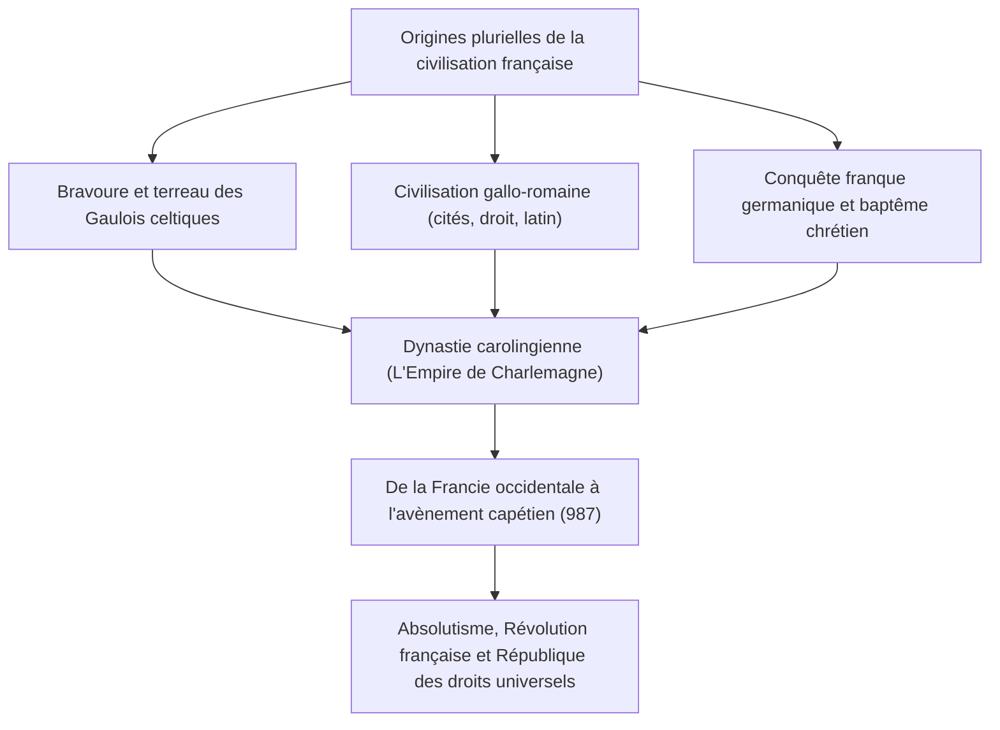
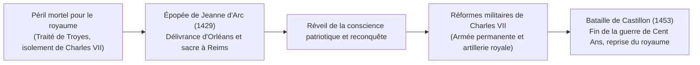
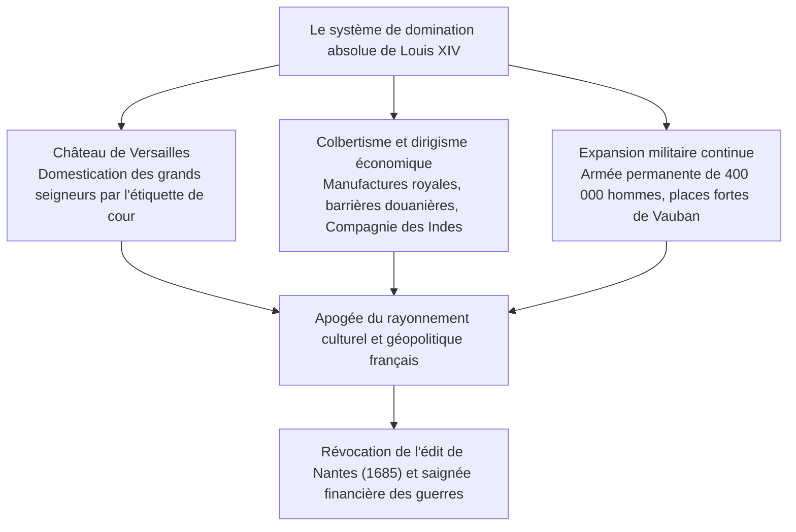
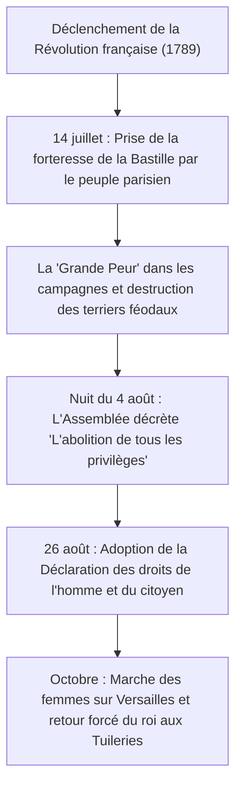
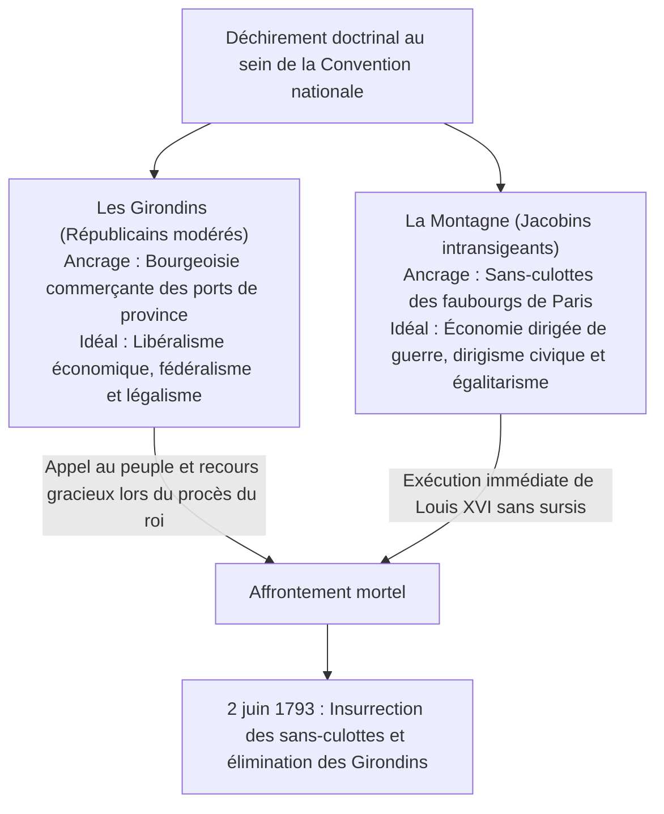

## 1. Introduction : La civilisation française au cœur de l'Europe

### 1.1 Les Gaulois et les *Commentaires sur la guerre des Gaules* de Jules César

À l'extrémité occidentale du continent européen s'étend un hexagone fertile (L'Hexagone), ceint par l'océan Atlantique, la mer Méditerranée, le Rhin, les Pyrénées et les Alpes. Bien avant que cette contrée ne prît le nom de « France », elle était la « Gaule » (*Gallia*), terre de multiples tribus d'origine celtique.

Entre 58 et 51 avant notre ère, le proconsul romain Caius Julius César mit en œuvre son génie militaire froid et méthodique pour soumettre l'ensemble des nations gauloises. Le chef-d'œuvre rédigé par César lui-même, les *Commentaires sur la guerre des Gaules* (*Commentarii de Bello Gallico*), consigna minutieusement la bravoure farouche des combattants gaulois et les ressorts de leur organisation tribale.

En 52 avant J.-C., sous la bannière du jeune chef des Arvernes, Vercingétorix, les peuples de Gaule scellèrent une coalition sans précédent et se soulevèrent contre Rome. Cependant, lors du siège d'Alésia, où César fit dresser une double enceinte fortifiée d'une ampleur inédite (une ligne intérieure de circonvallation et une contrevallation extérieure pour briser l'armée de secours), les contingents gaulois furent réduits par la famine et l'assaut systématique des légions. Vercingétorix s'avança à cheval devant la tente de César, jeta ses armes aux pieds du vainqueur et se rendit.

Désormais intégrée à l'orbe de Rome, la Gaule connut une romanisation fulgurante, enfantant la prestigieuse civilisation gallo-romaine jalonnée de voies impériales, d'aqueducs (le pont du Gard) et d'arènes imposantes (Arles, Nîmes). Les idiomes celtiques s'effacèrent devant le latin vulgaire, qui constitua le berceau de la langue française. Le revers d'Alésia représenta l'épreuve initiatique par laquelle la France naquit comme la fille aînée de la romanité classique.

---

### 1.2 La conversion de Clovis, le royaume des Francs et l'héritage de Charlemagne

Au Ve siècle, dans le fracas de l'effondrement de l'Empire romain d'Occident, les Francs saliens franchirent le Rhin et s'implantèrent en Gaule septentrionale. En 481, **Clovis Ier (règne 481–511)**, fondateur de la dynastie mérovingienne, rassembla les tribus et érigea le royaume des Francs.

Le coup de maître politique de Clovis intervint en 496 lors de son baptême dans la cathédrale de Reims par l'évêque saint Remi, embrassant le catholicisme nicéen. Alors que la plupart des envahisseurs germaniques (Wisigoths, Ostrogoths, Vandales) professaient l'hérésie arienne, l'adhésion de Clovis à l'orthodoxie romaine lui assura le soutien indéfectible des élites sénatoriales gallo-romaines et de l'Église, conférant à la monarchie franque une légitimité souveraine fondatrice en Occident.

Au VIIIe siècle, après que le maire du palais Charles Martel eut arrêté l'avancée arabo-musulmane à la bataille de Poitiers (732), son fils Pépin le Bref reçut l'onction papale et instaura la dynastie carolingienne. Sous le règne du fils de Pépin, **Charlemagne (Charles le Grand, règne 768–814)**, la quasi-totalité de l'Europe occidentale (la France moderne, l'Allemagne, le nord de l'Italie et les Pays-Bas) fut rassemblée au sein d'un empire chrétien unifié.

Le jour de Noël de l'an 800, dans la basilique Saint-Pierre de Rome, le pape Léon III posa la couronne impériale sur la tête de Charlemagne, rétablissant l'Empire d'Occident. La renaissance carolingienne, réhabilitant l'étude des lettres latines et le réseau des scriptoria monastiques, éclaira l'Europe d'un renouveau intellectuel décisif.

Toutefois, selon la tradition successorale franque du partage patrimonial, l'Empire fut démembré après la disparition de l'empereur :
- **843 : Traité de Verdun** : Division en Francie occidentale, Francie médiane et Francie orientale.
- **870 : Traité de Meerssen** : Partage de la Francie médiane entre ses deux voisines.
De ces lambeaux, la Francie occidentale (*Francia Occidentalis*) constitua le berceau territorial continu et direct du futur royaume de France.

---

## 2. L'enracinement des Capétiens et l'unification du royaume

### 2.1 L'élection d'Hugues Capet (987) et l'humilité des origines

En 987, à l'extinction de la lignée directe des descendants de Charlemagne, l'assemblée des grands barons porta au trône le duc des Francs et comte de Paris, **Hugues Capet**, fondant la prestigieuse **dynastie capétienne**.

À ses débuts, l'autorité royale réelle était insignifiante. Le domaine propre de la couronne (*domaine royal*) n'excédait guère une mince bande de terre enserrant Paris et Orléans, la future Île-de-France. Les grands feudataires — ducs de Normandie, d'Aquitaine, de Bourgogne, comtes de Flandre — commandaient des provinces bien plus vastes et des osts incomparablement plus puissants, ne daignant voir dans le roi qu'un simple « premier entre ses pairs » (*primus inter pares*).

Néanmoins, la royauté capétienne jouissait de deux privilèges institutionnels incomparables :
1. **L'onction sacrée du Sacre** : Consacré par le saint chrême en la cathédrale de Reims, le souverain était transfiguré en un monarque de droit divin (les rois thaumaturges, vénérés pour leur pouvoir miraculeux de guérir les écrouelles).
2. **Le miracle capétien de la primogéniture mâle** : Durant plus de trois siècles, de 987 à 1328, la couronne se transmit sans rupture de père en fils aîné, enracinant irréversiblement la coutume héréditaire de l'État monarchique.

---

### 2.2 Philippe II Auguste et le triomphe territorial de Bouvines

Le souverain qui décupla le domaine royal et osa revendiquer avec éclat le titre souverain de « Roi de France » (*Rex Franciae*) fut le septième monarque capétien, **Philippe II Auguste (Philippe Auguste, règne 1180–1223)**.

À cette époque, la dynastie anglaise des Plantagenêt (Henri II, Richard Cœur de Lion, Jean sans Terre) régnait sur un immense « Empire angevin » qui s'étendait de l'Écosse aux Pyrénées, enserrant mortellement le domaine royal français.

Saisissant les défaillances féodales de Jean sans Terre, Philippe Auguste prononça la commise et annexa coup sur coup la Normandie, l'Anjou, le Maine et la Touraine en 1204.
Le 27 juillet 1214, lors de la mémorable **bataille de Bouvines**, l'ost royal de Philippe Auguste fit face à la coalition nouée par Jean sans Terre avec l'empereur germanique Otton IV et le comte de Flandre. Par une victoire foudroyante, le roi écrasa la coalition ennemie, expulsa l'influence anglaise du nord du pays et hissa la monarchie française au zénith de la renommée européenne.

Philippe Auguste créa un corps de hauts fonctionnaires rétribués issus des classes bourgeoises urbaines — baillis au nord, sénéchaux au midi — afin d'assurer la justice royale et la perception fiscale. Il fixa la capitale permanente à Paris, fit ériger la forteresse du Louvre, paver les rues et ceindre la cité d'épaisses murailles.

---

### 2.3 Philippe IV le Bel et la soumission du Saint-Siège (Anagni et les papes d'Avignon)

À la fin du XIIIe siècle, l'intraitable souverain **Philippe IV le Bel (règne 1285–1314)** perfectionna l'appareil d'un État monarchique centralisé.

Pour subvenir aux charges de ses campagnes militaires, Philippe leva des subsides sur les biens ecclésiastiques (les décimes), se heurtant frontalement au pape Boniface VIII, auteur de la bulle *Unam Sanctam*, qui proclamait la suzeraineté pontificale absolue sur toutes les têtes couronnées de la Terre.
- **1302 : Première réunion des États généraux** : Philippe le Bel réunit en la cathédrale Notre-Dame de Paris les délégués du clergé, de la noblesse et des bourgeois des bonnes villes pour mobiliser la nation contre le pape.
- **1303 : L'attentat d'Anagni** : Son conseiller Guillaume de Nogaret mena un commando armé qui surprit le pontife en son palais d'Anagni, l'outrageant au point que Boniface VIII mourut de stupeur et de chagrin quelques semaines plus tard.
- **1309–1377 : La papauté d'Avignon** : Philippe favorisa l'élection d'un prélat français, Clément V, et installa le siège apostolique à Avignon, maintenant le Saint-Siège sous l'influence directe de la couronne de France durant sept décennies.
- Il fit également abattre et dissoudre le richissime ordre du Temple sous le chef d'hérésie, confisquant leurs avoirs immenses au profit des coffres du Trésor.

L'illusion médiévale d'un gouvernement théocratique universel s'effaçait, consacrant l'émergence de la France en tant que premier « État souverain » moderne.

---

### 2.4 La guerre de Cent Ans et l'épopée de Jeanne d'Arc

À la mort sans héritier direct des trois fils de Philippe le Bel, les pairs choisirent Philippe VI de Valois. En réplique, le roi d'Angleterre Édouard III, petit-fils de Philippe le Bel par sa mère Isabelle, revendiqua le trône capétien, ouvrant en 1337 l'interminable conflit de la guerre de Cent Ans.

À Crécy (1346), à Poitiers (1356, où le roi Jean le Bon fut fait captif) et à Azincourt (1415), la fine fleur de la chevalerie française fut anéantie par les nuées de flèches des archers gallois et anglais. Le duc de Bourgogne s'étant allié à l'Angleterre, le traité de Troyes de 1420 déshérita le dauphin Charles au profit du roi Henri V d'Angleterre. Réfugié à Bourges au sud de la Loire, le dauphin Charles VII paraissait à la veille d'une ruine définitive.

Au printemps de 1429, une humble paysanne lorraine de dix-sept ans originaire de Domrémy, **Jeanne d'Arc**, vint trouver Charles VII à Chinon. Affirmant avoir reçu des voix célestes et de l'archange saint Michel l'ordre divin de lever le siège d'Orléans et de faire sacrer le dauphin à Reims, elle revêtit une armure blanche et s'élança vers la ville assiégée.

La flamme mystique et indomptable de la Pucelle électrisa les régiments français. En neuf jours seulement, l'étau autour d'Orléans fut brisé et le dauphin fut conduit triomphalement à travers les lignes adverses jusqu'à la cathédrale de Reims pour y recevoir l'onction légitime. Bien qu'elle fût livrée à Compiègne, traînée devant un tribunal d'inquisition à Rouen et condamnée au bûcher en 1431, son sacrifice avait scellé l'unité nationale du peuple français.

Charles VII réforma l'administration fiscale et constitua la **première armée de métier permanente d'Europe (les Compagnies d'ordonnance)**, appuyée par une formidable artillerie de siège confiée aux frères Bureau. En 1453, les canons de la bataille de Castillon balayèrent définitivement l'armée anglaise : la guerre de Cent Ans s'achevait sur la reconquête intégrale de la patrie, à l'exception de Calais.

---

## 3. Des guerres de Religion au rayonnement de l'absolutisme

### 3.1 La fracture calviniste et le drame des guerres de Religion (1562–1598)

Au milieu du XVIe siècle, la prédication réformée de Jean Calvin se diffusa largement auprès des marchands, des gens de robe et d'une partie substantielle de la gentilhommerie, formant la communauté des **huguenots**.

Dans le vide politique provoqué par la succession de jeunes princes fragiles, l'antagonisme mortel entre la Ligue catholique dirigée par les ducs de Guise et la cause protestante conduite par les Bourbons et l'amiral de Coligny dégénéra en huit guerres civiles sanglantes étalées sur plus de trois décennies.
- **24 août 1572 : Massacre de la Saint-Barthélemy** : À l'instigation de Catherine de Médicis et des chefs catholiques, les chefs huguenots venus à Paris pour le mariage d'Henri de Navarre furent égorgés au cours de la nuit, le massacre s'étendant à la populace et aux provinces où périrent des dizaines de milliers d'âmes.

La réconciliation nationale ne fut rendue possible que par l'accession au trône du prince huguenot héritier de la couronne, **Henri IV (règne 1589–1610)**, premier monarque de la Maison de Bourbon.
Considérant que « Paris vaut bien une messe », il abjura le calvinisme pour rassembler ses sujets et **promulgue en 1598 l'Édit de Nantes**. Cet édit proclamait le catholicisme foi du royaume tout en accordant aux protestants une pleine liberté de conscience, des garanties civiles et des places fortes de sûreté militaire (comme La Rochelle). Cette dissociation entre citoyenneté politique et foi religieuse privée ouvrit la voie à la tolérance civile moderne.

---

### 3.2 Richelieu, la « Raison d'État » et les fondements de la monarchie absolue

Après le meurtre d'Henri IV par le fanatique Ravaillac, l'exercice réel du pouvoir sous la minorité de Louis XIII revint au cardinal de **Richelieu (Armand Jean du Plessis)**.

La pensée politique de Richelieu reposait sur un principe suprême : la **« Raison d'État »**, postulant que l'intérêt général de la nation, la sauvegarde du royaume et l'unité souveraine priment absolument sur toute morale individuelle, tout zèle confessionnel et toute prérogative seigneuriale.
- Sur le plan intérieur, il réduisit la place forte protestante de La Rochelle par un siège mémorable afin d'annihiler son pouvoir politique, rasa les forteresses des nobles comploteurs et délégua des intendants de justice, police et finances dans chaque province pour soumettre les autorités locales au pouvoir central.
- Sur la scène internationale, bien que prince de l'Église romaine, le cardinal n'hésita pas à subventionner et à s'allier aux princes protestants allemands et à la Suède dans la guerre de Trente Ans (1618–1648) afin de briser l'hégémonie continentale de la Maison d'Autriche et d'Espagne.

Par les **Traités de Westphalie (1648)**, parachevés par son disciple le cardinal Mazarin, la France s'adjoignit la plus grande partie de l'Alsace et devint le pivot géopolitique de l'Europe.

---

### 3.3 Louis XIV, le Roi-Soleil (règne 1643–1715) : « L'État, c'est moi »

En 1661, à la mort de Mazarin, **Louis XIV**, âgé de vingt-deux ans, décida d'assumer seul le gouvernement sans premier ministre. Nourri de la doctrine du droit divin développée par Bossuet, il incarna la majesté absolue du pouvoir monarchique.

#### ① Versailles ou la mécanique de l'obéissance
Érigé à l'ouest de Paris, le château de Versailles — avec sa galerie des Glaces, ses parterres ordonnés dessinés par Le Nôtre et ses splendeurs d'or — dépassait la simple magnificence architecturale.
Ayant gardé un souvenir cuisant de la révolte nobiliaire de la Fronde (1648–1653), le Roi-Soleil y regroupa l'aristocratie frondeuse, l'occupant à des querelles d'honneurs dérisoires comme l'attribution des chemises lors du petit et grand lever, anéantissant ainsi ses vélléités séditieuses.

#### ② Le colbertisme et la puissance des armes
Le contrôleur général des finances Jean-Baptiste Colbert instaura le mercantilisme étatique (« colbertisme »), stimulant la production de produits de luxe (Gobelins, manufactures de Saint-Gobain) et imposant des droits de douane protecteurs. Le marquis de Louvois dota la France d'une force militaire permanente de 400 000 soldats, tandis que le maréchal de Vauban ceignait le royaume d'un « pré carré » de citadelles polygonales inviolables.

#### ③ L'épreuve du déclin : La révocation de l'édit de Nantes
Cet éclat flamboyant masquait d'irréparables faiblesses.
Les guerres successives et ruineuses (guerre de Hollande, guerre de la Ligue d'Augsbourg, guerre de Succession d'Espagne) vidèrent les caisses publiques.
L'erreur fondamentale survint en 1685 lors de la signature de l'**édit de Fontainebleau (révocation de l'édit de Nantes)**. Sous prétexte que l'hérésie avait disparu, Louis XIV interdit le culte protestant. Entre 200 000 et 300 000 des plus habiles manufacturiers, négociants et marins s'enfuirent vers la Hollande, l'Angleterre et le Brandebourg, portant un coup dévastateur à l'économie nationale et sonnant le crépuscule de l'âge classique.

---

## 4. Le siècle des Lumières et la tourmente de la Révolution française (1789–1799)

### 4.1 L'impasse de l'Ancien Régime et l'effervescence intellectuelle

Au XVIIIe siècle, la société d'ordres de l'**Ancien Régime** étouffait sous ses contradictions systémiques :
- **Le Premier Ordre (le Clergé, env. 100 000 membres)** : Détenait 10 % du sol agraire, percevait la dîme et échappait à l'impôt direct.
- **Le Deuxième Ordre (la Noblesse, env. 400 000 membres)** : Possédait un quart des terres, ne payait presque aucun tribut fiscal et trustait les commandements d'armées et les hautes charges de justice.
- **Le Tiers État (le peuple, env. 25 millions d'habitants, soit 98 % des Français)** : Supportait le poids écrasant de la fiscalité (taille, capitation, gabelle, corvées) sans disposer du moindre levier d'action publique.

Contre ces archaïsmes se dressèrent les philosophes des **Lumières** :
- **Voltaire** pourfendit le fanatisme et les superstitions de l'intolérance religieuse au nom du libre examen de la raison (l'affaire Calas).
- **Montesquieu**, dans *De l'esprit des lois*, théorisa la stricte séparation des pouvoirs législatif, exécutif et judiciaire pour conjurer l'arbitraire.
- **Jean-Jacques Rousseau**, dans *Du contrat social*, formula le dogme de la souveraineté populaire, affirmant que la loi est l'expression de la « volonté générale ».
- **Diderot et d'Alembert** dirigèrent l'*Encyclopédie*, dressant l'inventaire des savoirs scientifiques et artisanaux pour émanciper l'esprit humain.

---

### 4.2 La prise de la Bastille et la Déclaration des droits de l'homme (1789)

Les dépenses somptuaires de Louis XV, le lourd revers de la guerre de Sept Ans et l'assistance massive consentie par Louis XVI à la guerre d'indépendance américaine conduisirent le Trésor à la banqueroute. Face au refus des notables d'abandonner leurs exemptions d'impôts, Louis XVI convoqua à Versailles les États généraux en mai 1789.

Bloqués sur la question du vote par tête ou par ordre, les représentants du Tiers État proclamèrent l'**Assemblée nationale**. Se voyant interdire leur salle de séance, ils s'assemblèrent au Jeu de paume le 20 juin et prêtèrent le **serment du Jeu de paume**, jurant de ne jamais se séparer avant d'avoir donné une constitution écrite à la France.

L'envoi de régiments de mercenaires aux portes de la capitale et le renvoi du ministre populaire Necker mirent le feu aux poudres.

Le 26 août 1789, l'Assemblée nationale constituante adopta la **Déclaration des droits de l'homme et du citoyen**, proclamant des vérités universelles :
1. **« Les hommes naissent et demeurent libres et égaux en droits. »** (Article 1er)
2. **« Le principe de toute souveraineté réside essentiellement dans la Nation. »** (Article 3)
3. La garantie inviolable de la liberté, de la propriété, de la sûreté et de la résistance à l'oppression.
4. L'égalité civique devant la loi, la présomption d'innocence, la liberté religieuse et d'opinion.

---

### 4.3 La chute de la royauté et la Terreur robespierriste

L'accélération révolutionnaire balaya les compromis constitutionnels. En juin 1791, la tentative de fuite de la famille royale interceptée à Varennes (**la fuite de Varennes**) brisa définitivement le lien mystique entre le monarque et la nation.
Les cours d'Autriche et de Prusse ayant menacé la France de représailles militaires (déclaration de Pillnitz), l'Assemblée vota la guerre en avril 1792. Les bataillons de volontaires provinciaux montèrent au front en chantant l'hymne de l'armée du Rhin, rebaptisé *La Marseillaise*.

- **Journée insurrectionnelle du 10 août 1792** : Les sans-culottes et les fédérés prirent d'assaut le palais des Tuileries, suspendant le roi. La Convention nationale élue aboli la royauté et proclama la **Première République**.
- **21 janvier 1793** : Louis XVI fut guillotiné place de la Révolution (actuelle place de la Concorde) pour haute trahison envers la patrie, suivi en octobre par Marie-Antoinette.

Face à la Première Coalition européenne et à l'insurrection vendéenne, le pouvoir échut au Comité de salut public dominé par Maximilien de Robespierre.

Affirmant que **« le ressort du gouvernement populaire en révolution est à la fois la vertu et la terreur : la vertu, sans laquelle la terreur est funeste ; la terreur, sans laquelle la vertu est impuissante »**, le régime instaura la **Terreur**. Quelque 40 000 suspects (nobles, prêtres réfractaires, Girondins et dantonistes) montèrent sur l'échafaud.
En dépit de la conscription massive (la levée en masse) qui sauva les frontières, l'angoisse de la guillotine poussa la Convention à renverser l'Incorruptible le **9 thermidor an II (27 juillet 1794)** : Robespierre fut exécuté le lendemain, mettant un terme à la Grande Terreur.

---

## 5. L'ère napoléonienne et le Premier Empire

### 5.1 De brumaire au sacre impérial : La refondation des institutions

L'instabilité du Directoire post-thermidorien, en proie aux coups de force royalistes et républicains, laissait les Français désireux d'ordre civil et de consolidation des acquis de 1789. Ce vœu fut incarné par le jeune général corse **Napoléon Bonaparte (1769–1821)**.

Héros du siège de Toulon et vainqueur éclatant de la campagne d'Italie (1796–1797), Bonaparte s'empara du pouvoir exécutif lors du **coup d'État du 18 brumaire an VIII (9 novembre 1799)**, instituant le Consulat dont il devint le Premier Consul.

L'immense legs de Napoléon réside dans **l'institutionnalisation durable des conquêtes juridiques et sociales de la Révolution** :
1. **Le Code civil des Français (Code Napoléon, 1804)** : Sanctuarisant l'égalité civile devant la loi, la laïcité de l'état civil, la liberté contractuelle et la propriété inviolable, il s'imposa comme le fondement incontesté du droit civil contemporain.
2. **Les « Masses de granit » institutionnelles** : Création de la Banque de France et du franc germinal, fondation de l'enseignement secondaire public (lycées, baccalauréat), institution des préfets et ordre de la Légion d'honneur.
3. **Le Concordat de 1801** : Conclu avec Pie VII, il réconcilia la République avec Rome en reconnaissant le catholicisme comme la foi de la majorité des citoyens, tout en maintenant les prêtres sous le statut de fonctionnaires rétribués et sans restituer les biens nationaux.

Le 2 décembre 1804, en la cathédrale Notre-Dame de Paris, Napoléon saisit la couronne des mains du souverain pontife et s'en coiffa lui-même, proclamé **Napoléon Ier, Empereur des Français** (Premier Empire).

---

### 5.2 L'hégémonie continentale et l'apocalypse de la campagne de Russie

À la tête de la Grande Armée, forte de la conscription nationale et de manœuvres foudroyantes de concentration, Napoléon plia l'Europe à sa volonté :
- **1805 : Bataille d'Austerlitz (la bataille des Trois Empereurs)** : Écrasement des armées conjointes du tsar Alexandre Ier et de l'empereur François II, dissolution du millénaire Saint-Empire romain germanique et création de la Confédération du Rhin.
- **1806 : Campagne de Prusse** : Triomphe à Iéna et entrée solennelle sous la porte de Brandebourg à Berlin.

Mais l'Angleterre, maîtresse invaincue des mers après Trafalgar (1805), demeurait hors de portée. Napoléon édicta le décret de Berlin instituant le **Blocus continental (1806)** pour asphyxier son commerce extérieur.

Pour contraindre le tsar Alexandre Ier, coupable d'enfreindre ce blocus commercial, Napoléon lança en juin 1812 une armée de 600 000 hommes au cœur des steppes russes.
Le maréchal Koutouzov appliqua la tactique de la terre brûlée, abandonnant Moscou aux flammes. Prise au piège de l'hiver russe à moins trente degrés, sans vivres ni abris, la Grande Armée fut massacrée durant la retraite par le froid, la faim et les charges des cosaques. Seuls quelques dizaines de milliers de fantômes en réchappèrent.

L'Empereur, jadis accueilli en libérateur du féodalisme, vit les peuples asservis se soulever en guerres de libération nationale (guérilla espagnole, soulèvement prussien). Battu à Leipzig en 1813, Napoléon dut abdiquer en 1814 et fut exilé à l'île d'Elbe. Revenu durant l'épopée des Cent-Jours en 1815, il tomba définitivement à la **bataille de Waterloo** sous les coups conjugués de Wellington et Blücher. Déporté sur l'îlot inhospitalier de Sainte-Hélène au sud de l'Atlantique, il y expira en mai 1821.

---

## 6. Le siècle des révolutions : De la Restauration à la Commune

Après la débâcle impériale, le congrès de Vienne rétablit la monarchie des Bourbons avec Louis XVIII (la Restauration). Cependant, les conquêtes juridiques et sociales de la Révolution s'étaient à jamais ancrées dans les consciences. Tout au long du XIXe siècle, la France se fit le laboratoire passionné de tous les régimes politiques.

### 6.1 Les Trois Glorieuses (1830) et la Révolution de Février (1848)

- **1830 : La Révolution de Juillet (les « Trois Glorieuses »)** : La tentative absolutiste de Charles X de suspendre les libertés fondamentales provoqua le soulèvement des ouvriers et étudiants sur les barricades (toile immortalisée par Delacroix : *La Liberté guidant le peuple*). Le roi s'enfuit et le duc d'Orléans devint Louis-Philippe Ier, « Roi des Français » (la Monarchie de Juillet, sous la tutelle de la grande bourgeoisie bancaire).
- **1848 : La Révolution de Février** : La montée en puissance du prolétariat d'usine et la revendication du suffrage universel balayèrent la monarchie d'affaires. Louis-Philippe abdiqua et la **Deuxième République** fut décrétée. Les « Ateliers nationaux » impulsés par Louis Blanc pour occuper les ouvriers au chômage furent toutefois fermés par les conservateurs, déclenchant l'insurrection tragique des journées de Juin, férocement réprimée.

---

### 6.2 Le Second Empire de Napoléon III et la métamorphose de Paris

Profitant du prestige de son oncle, **Louis-Napoléon Bonaparte** remporta triomphalement l'élection présidentielle de décembre 1848.
Par le coup d'État du 2 décembre 1851, il brisa l'Assemblée et se fit proclamer empereur sous le titre de **Napoléon III** en 1852 (Second Empire : 1852–1870).

Napoléon III chargea le préfet de la Seine, le baron Haussmann, d'une **gigantesque rénovation urbaine de Paris** :
- Démolition des venelles insalubres médiévales propices aux barricades rébellionnaires.
- Percement de grands boulevards rectilignes axés sur l'Arc de Triomphe, équipement en réseaux modernes d'adduction et d'égouts, réverbères à gaz et parcs publics (bois de Boulogne).
- La physionomie lumineuse et monumentale qui fascine aujourd'hui le monde entier date de cette grande transformation du Second Empire.

Cependant, après de multiples aventures extérieures (victoire en Crimée, guerre d'Italie, désastreuse expédition du Mexique), Napoléon III tomba dans le piège de la dépêche d'Ems tendu par Bismarck en déclarant la **guerre franco-prussienne de 1870**. À la bataille de Sedan, l'Empereur fut capturé avec son armée, entraînant l'effondrement immédiat du Second Empire.

---

### 6.3 1871 : La sanglante épopée de la Commune de Paris

Exaspérés par le siège prussien, la faim et les conditions capitulardes négociées par le gouvernement provisoire conservateur d'Adolphe Thiers, le peuple ouvrier et les gardes nationaux de Paris refusèrent de rendre leurs canons.
Le 28 mars 1871, devant l'Hôtel de Ville, ils proclamèrent la **Commune de Paris**, première expérience au monde de gouvernement ouvrier d'émancipation démocratique.

- La Commune adopta des résolutions prodigieusement avant-gardistes : séparation des Églises et de l'État, interdiction du travail de nuit et du travail des enfants, reprise des fabriques abandonnées par des coopératives ouvrières, gratuité de l'instruction et remplacement de l'armée par le peuple armé.
- Les troupes régulières de Versailles pénétrèrent dans la capitale avec le concours des Allemands.
- Durant la **« Semaine sanglante » (21–28 mai 1871)**, les combats de barricades firent rage. Environ 20 000 communards furent fusillés sans jugement (devant le mur des Fédérés au cimetière du Père-Lachaise) et des dizaines de milliers d'autres déportés en Nouvelle-Calédonie.

---

## 7. De la IIIe République aux guerres mondiales, De Gaulle et la Ve République

### 7.1 La Belle Époque et la consécration républicaine de la Laïcité

Née dans les décombres de l'insurrection de 1871, la **Troisième République (1870–1940)**, d'abord précaire, devint le régime constitutionnel le plus durable de l'histoire moderne de France, maintenant ses institutions durant soixante-dix ans.
L'essor de la fin du siècle jusqu'en 1914 s'inscrit dans la mémoire sous le vocable de **« Belle Époque »** : inauguration de la tour Eiffel pour l'Exposition universelle de 1889, génie pictural des impressionnistes, naissance du cinéma grâce aux frères Lumière.

La société fut toutefois ébranlée par l'**« Affaire Dreyfus » (1894)**. La condamnation inique du capitaine alsacien d'ascendance juive Alfred Dreyfus, sous la fausse accusation d'espionnage au profit de l'Allemagne, conduisit Émile Zola à publier dans *L'Aurore* son célèbre manifeste **« J'accuse… ! »**. La nation se divisa irrémédiablement entre la droite cléricale et militaire et les dreyfusards défenseurs des droits universels de l'Homme.

La réhabilitation définitive de Dreyfus porta au pouvoir les républicains radicaux qui firent voter la **Loi de séparation des Églises et de l'État de 1905**. En garantissant la stricte neutralité confessionnelle des espaces institutionnels publics et de l'école républicaine, le principe souverain de la **Laïcité** devint la pierre angulaire de l'identité civique française.

---

### 7.2 L'hécatombe des deux guerres mondiales et la flamme de la Résistance

- **Première Guerre mondiale (1914–1918)** : L'offensive germanique fut stoppée in extremis lors de la bataille de la Marne. Au terme d'une guerre de tranchées féroce (illustrée par l'enfer de Verdun et ses 700 000 victimes), la France remporta la victoire, mais au prix de 1,4 million de jeunes hommes fauchés et d'un appareil industriel du nord en ruines.
- **La débâcle de 1940 et le régime de Vichy** : En mai 1940, les Panzerdivisions nazies contournèrent la ligne Maginot par les Ardennes. En six semaines, les armées françaises furent balayées. Le maréchal Pétain instaura à Vichy un régime collaborationniste soumis aux diktats d'Hitler.

Le 18 juin 1940, réfugié à Londres, le sous-secrétaire d'État à la Guerre, le général **Charles de Gaulle**, lança sur les ondes de la BBC son retentissant appel :
> **« La France a-t-elle dit son dernier mot ? L'espérance doit-elle disparaître ? La défaite est-elle définitive ? Non ! […] Quoi qu'il arrive, la flamme de la résistance française ne doit pas s'éteindre et ne s'éteindra pas. »**

Bâtissant depuis l'exil la « France Libre » et unifiant la résistance intérieure sous la houlette de Jean Moulin, De Gaulle vit les résistants et la division Leclerc libérer Paris à l'été 1944. Par la seule force de sa volonté, il fit reconnaître la France au rang des puissances victorieuses, dotée d'un siège permanent au Conseil de sécurité des Nations unies.

---

### 7.3 La Ve République et la doctrine diplomatique gaullienne

Après l'instabilité de la IVe République parlementaire, incapable de résoudre le drame de la guerre d'Algérie (1954–1962), le pays au bord de la guerre civile rappela de Gaulle en 1958.

Le Général fit adopter une nouvelle constitution consacrant la **Cinquième République**, ordonnée autour d'un président élu au suffrage universel direct investi d'une haute autorité d'arbitrage :
- **Reconnaissance de l'indépendance de l'Algérie (accords d'Évian, 1962)** : Sortie du fardeau colonial.
- **Dotation d'une force de dissuasion nucléaire souveraine (*Force de frappe*)** : Refus du protectorat américain.
- **L'indépendance nationale du gaullisme** : Retrait du commandement militaire intégré de l'OTAN en 1966, reconnaissance précoce de la République populaire de Chine en 1964 et condamnation de l'ingérence américaine au Vietnam, soutenant l'avènement d'un monde multipolaire.

La crise de **Mai 68**, avec ses barricades étudiantes au Quartier latin et une grève générale de dix millions de travailleurs, ébranla le conservatisme patriarcal, ouvrant la France aux mutations contemporaines de l'émancipation féministe, individuelle et écologique.

---

## 4.5 Au cœur de la Révolution : Le duel Girondins-Montagnards et la *Déclaration des droits de la femme*

Les affrontements oratoires à la Convention nationale (1792–1795) engagèrent deux philosophies antagonistes de l'État :

### ① Olympe de Gouges et la *Déclaration des droits de la femme et de la citoyenne*
Le texte fondateur de 1789, malgré son universalisme proclamé, restreignait la citoyenneté active aux seuls hommes propriétaires.
L'auteure dramatique **Olympe de Gouges (1748–1793)** fit paraître en 1791 sa magistrale **Déclaration des droits de la femme et de la citoyenne**, mettant au jour les aveuglements des constituants masculins :

> **« La femme naît libre et demeure égale à l'homme en droits. »**
> **« La femme a le droit de monter sur l'échafaud ; elle doit avoir également celui de monter à la tribune. »**

Elle réclama le droit de vote pour les femmes, l'accès à toutes les fonctions publiques et l'égalité matrimoniale. Considérée comme subversive par les jacobins pour ses critiques acerbes contre Robespierre, elle fut guillotinée en 1793 sous l'accusation d'« avoir oublié les vertus qui conviennent à son sexe ». Son texte est le fondement historique des combats féministes qui trouveront leur accomplissement dans *Le Deuxième Sexe* de Simone de Beauvoir.

---

## 5.3 La doctrine militaire napoléonienne : Le système divisionnaire et l'art opératif

La suite ininterrompue des triomphes militaires de Napoléon contre des coalitions supérieures reposait sur une refonte conceptuelle de l'art militaire :

1. **L'institution du Corps d'Armée interarmes (*Corps d'Armée*)** :
   - Au lieu de déplacer une seule masse armée compacte, l'Empereur scinda ses troupes en grands corps autonomes de 20 000 à 30 000 hommes combinant infanterie, cavalerie, artillerie et sapeurs.
   - Chaque corps d'armée pouvait résister seul durant 24 à 48 heures face à des effectifs ennemis très supérieurs.
   - **« Marcher séparément, combattre ensemble »** : Les colonnes avançaient à marche forcée sur des axes distincts en vivant sur le pays, pour converger soudainement sur le flanc ou les arrières de l'ennemi le jour de la confrontation générale.
2. **La manœuvre par les lignes intérieures et le principe de concentration** :
   - Face à deux armées coalisées convergeant depuis deux directions opposées, Napoléon s'interposait vivement dans l'intervalle pour couper leurs communications.
   - Retenant l'une des armées par un corps d'observation restreint, il jetait la totalité de sa force de frappe pour écraser la seconde avant de faire demi-tour et battre la première.

---

## 7.4 Les déchirements de la décolonisation : Diên Biên Phu et la guerre d'Algérie (1954–1962)

Au lendemain de 1945, la dissolution du deuxième empire colonial de la planète provoqua un séisme moral au sein de la République.

### ① L'épilogue de la guerre d'Indochine : Le gouffre de Diên Biên Phu (1954)
Au Viêt Nam, face à la guerre d'usure du Viêt-minh de Hô Chi Minh, l'état-major français décida d'aménager un camp retranché aéroporté au fond de la cuvette de Diên Biên Phu pour forcer l'adversaire à la bataille rangée.
Or, le général Vo Nguyên Giap fit hisser à dos d'hommes des centaines de pièces d'artillerie lourde sur les crêtes de jungle dominant la garnison. Après cinquante-sept jours de pilonnage intense, le camp retranché tomba, contraignant la France à abandonner l'Asie du Sud-Est lors des accords de Genève.

### ② La tragédie de la guerre d'Algérie
Rattachée depuis 1830 comme partie intégrante du territoire français et divisée en départements où résidaient plus d'un million de pieds-noirs, l'Algérie vit le Front de libération nationale (FLN) déclencher la guerre d'indépendance à la Toussaint 1954.
- L'armée française utilisa la torture systématique et les exécutions sommaires pour briser les réseaux insurrectionnels de la capitale (la bataille d'Alger), suscitant l'indignation morale d'intellectuels engagés conduits par Jean-Paul Sartre.
- Le coup de force insurrectionnel des militaires et des activistes d'Alger en mai 1958 menaça la République d'une intervention parachutiste, provoquant l'agonie de la IVe République et le rappel de De Gaulle.
- Le Général choisit la lucidité historique et, surmontant les attentats de l'Organisation armée secrète (OAS), conclut les **accords d'Évian en 1962**, reconnaissant la pleine indépendance de la nation algérienne.

---

## 7.5 Le rayonnement intellectuel et l'État culturel (Sartre, Camus, Malraux)

Après 1945, alors que ses ambitions d'hégémonie géostratégique s'effaçaient, la France demeura la capitale universelle de l'esprit, des arts et de la philosophie.

### ① Les phares de l'existentialisme : Le différend historique entre Sartre et Camus
Aux terrasses des Deux Magots et du Café de Flore à Saint-Germain-des-Prés, l'existentialisme domina le débat intellectuel international :
- **Sartre (*L'Être et le Néant*)** : « L'existence précède l'essence ». Dépourvu de nature humaine préétablie, l'individu est condamné à être libre et doit s'accomplir par son engagement militant (*l'engagement*). Sartre se rapprocha du communisme, justifiant une certaine part de violence révolutionnaire.
- **Camus (*L'Homme révolté*)** : D'origine modeste en Algérie, Camus condamna absolument toute téléologie politique qui sacrifierait la vie humaine concrète sur l'autel d'idéologies abstraites. La rupture publique des deux amis marqua les débats éthiques du siècle.

### ② André Malraux et l'instauration du ministère de la Culture (1959)
Nommé premier titulaire du portefeuille des Affaires culturelles sous De Gaulle, l'écrivain André Malraux inventa une politique culturelle d'État pionnière dans le monde :
- Affirmation du devoir républicain de **« rendre accessibles au plus grand nombre d'hommes les œuvres capitales de l'humanité »**.
- Érection des « Maisons de la Culture » au cœur des cités provinciales.
- Nettoyage à haute pression des monuments historiques parisiens couverts de suie pour révéler la blondeur de leur pierre d'origine, et vote de la loi Malraux sur la sauvegarde des secteurs sauvegardés.

---

## 7.6 L'alternance socialiste sous Mitterrand et l'abolition de la peine de mort (1981)

En mai 1981, François Mitterrand devint le premier chef d'État socialiste de la Cinquième République, amorçant un cycle de réformes sociétales majeures.

### ① Robert Badinter et l'abolition républicaine de la guillotine (1981)
Héritière d'une longue tradition d'exécutions publiques depuis 1789, la France était le dernier pays de la Communauté européenne à appliquer encore le châtiment suprême (la dernière décapitation eut lieu en 1977).
Le garde des Sceaux, Robert Badinter, bravant une opinion publique majoritairement réticente, prononça devant l'Assemblée nationale un plaidoyer vibrant :
> **« La justice ne peut pas être une vengeance, elle ne peut pas être un meurtre légal. Refuser à l'État le pouvoir d'ôter la vie à un homme, c'est proclamer la dignité suprême de l'être humain. »**

### ② Les réformes économiques et sociétales
- Abaissement de la durée légale du travail hebdomadaire à 39 heures (qui préparera la réforme ultérieure des 35 heures de Lionel Jospin).
- Instauration d'une cinquième semaine de congés payés annuels, revalorisation du SMIC et des prestations familiales.
- Lois Defferre de décentralisation, transférant les pouvoirs administratifs exécutifs des préfets vers les conseils généraux et régionaux élus.

### ③ Emmanuel Macron et la souveraineté stratégique européenne
Élu en 2017 à l'âge de 39 ans, Emmanuel Macron bouscula les équilibres traditionnels de la vie politique. Dans son discours fondateur de la Sorbonne, face aux tensions géopolitiques mondiales et à l'invasion russe en Ukraine, il défend le principe d'une **Souveraineté européenne (*Souveraineté européenne / Autonomie stratégique*)**, plaidant pour une défense commune, une indépendance technologique et énergétique de l'Europe, perpétuant l'esprit gaullien dans les équilibres multipolaires du XXIe siècle.

---

## 8. Conclusion : Le flambeau universel de Liberté, Égalité, Fraternité

Quiconque médite sur le destin historique de la France demeure frappé par une exigence inaltérable : **son aspiration perpétuelle à l'universalisme (*Universalisme*)**.

Refusant de se cloîtrer dans un conservatisme étroit, la civilisation française n'a cessé d'interroger la condition humaine et les règles d'une société juste à travers l'audace de ses penseurs, le talent de ses artistes et l'ardeur de ses révolutions.

Le triptyque tricolore forgé dans les flammes de 1789 — **« Liberté, Égalité, Fraternité »** — demeure la boussole incontournable des démocraties éclairées à travers le monde.

Même au cœur des tensions contemporaines autour de la laïcité, des défis de la construction européenne ou des fièvres populaires périodiques, l'esprit de la France conserve cette inébranlable fidélité à la raison critique. C'est dans cette quête infatigable d'émancipation humaine que réside l'héritage sublime de l'Histoire de France.
