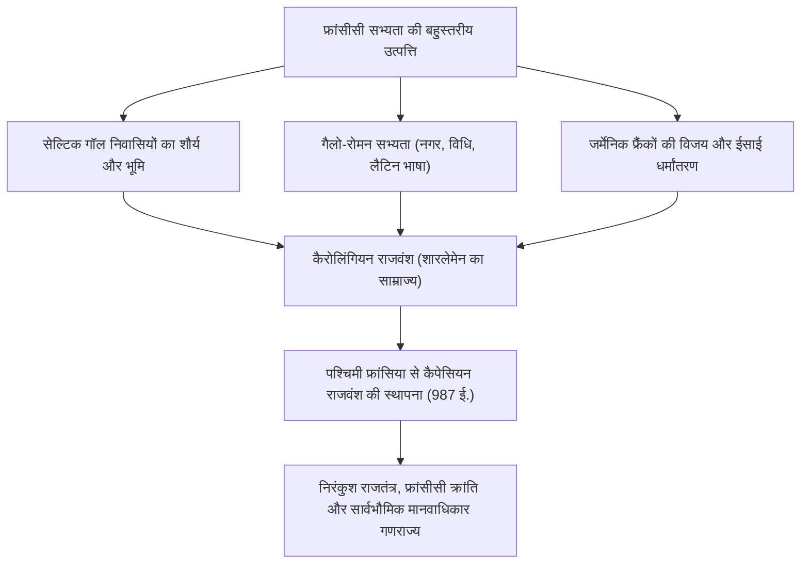
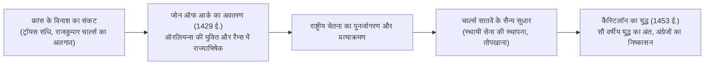
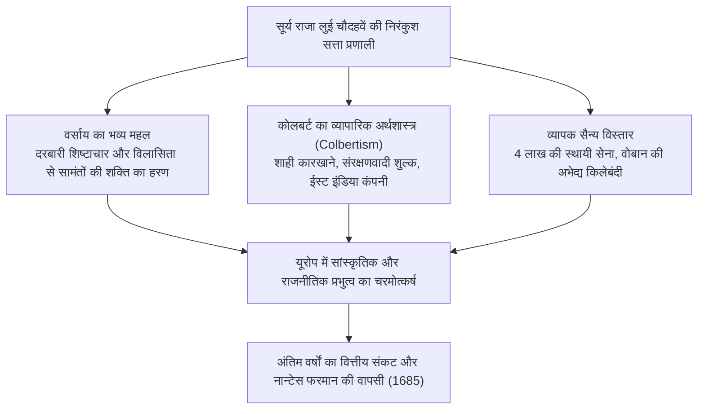
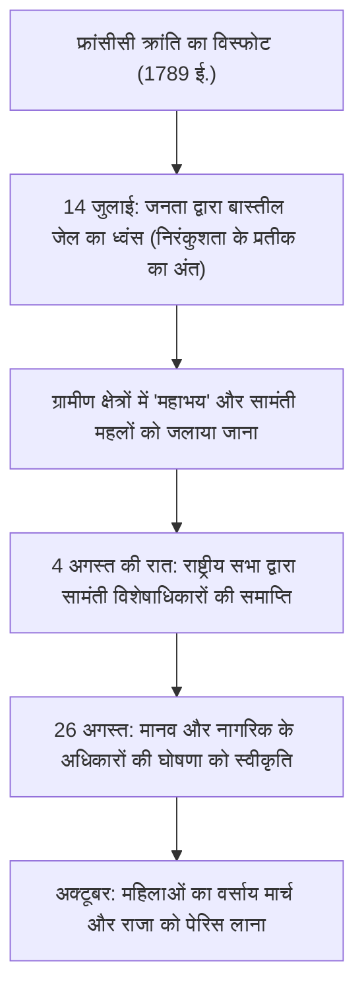
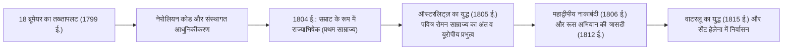
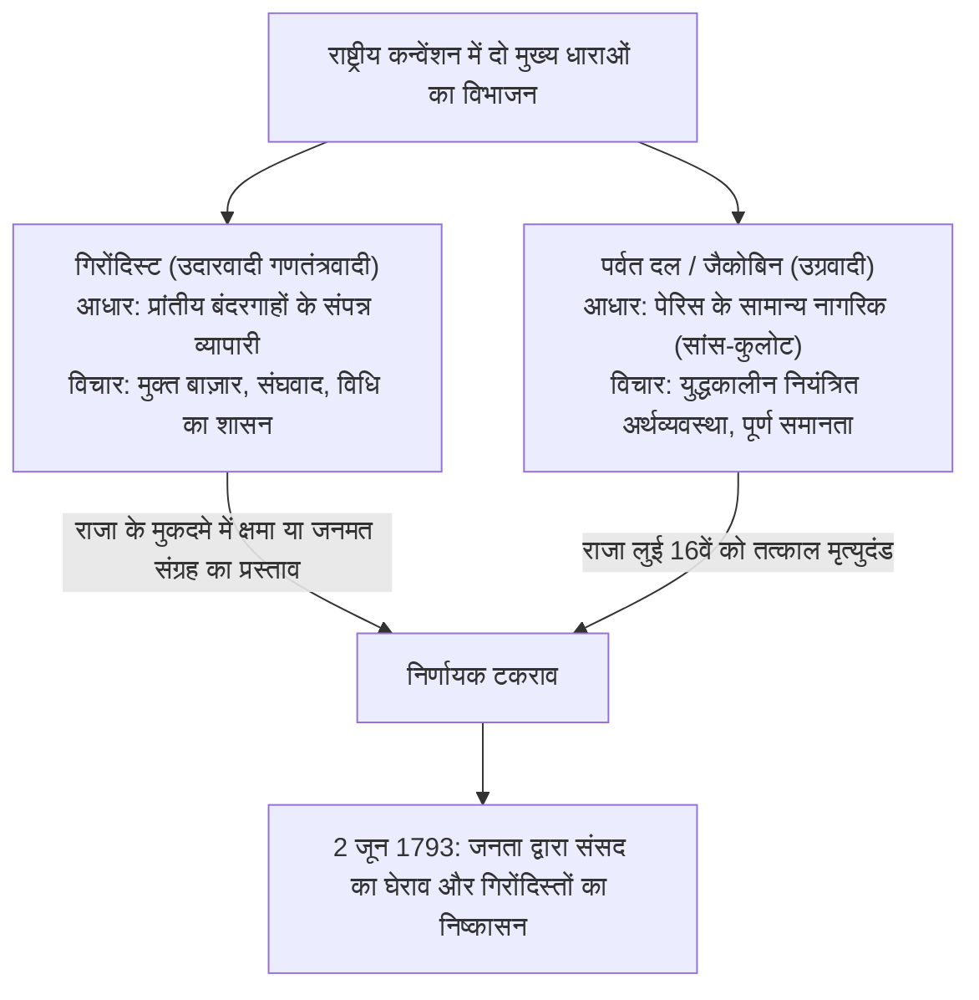

## 1. प्रस्तावना: यूरोप के हृदय के रूप में फ्रांसीसी सभ्यता

### 1.1 गॉल निवासी और जूलियस सीज़र की *गॉलिक युद्ध पर टिप्पणियाँ*

यूरोपीय महाद्वीप के पश्चिमी छोर पर अटलांटिक महासागर, भूमध्य सागर, राइन नदी, पिरेनीज पर्वतमाला और आल्प्स पर्वत से घिरा एक उपजाऊ षट्कोण (L'Hexagone) फैला हुआ है। इस भूभाग को "फ्रांस" कहे जाने से बहुत पहले, यह "गॉल" (*Gallia*) के नाम से जाना जाता था, जहाँ अनगिनत सेल्टिक जनजातियाँ निवास करती थीं।

ईसा पूर्व 58 से ईसा पूर्व 51 के बीच, रोमन सर्वोच्च सेनापति गायस जूलियस सीज़र ने अपनी विलक्षण सैन्य प्रतिभा से संपूर्ण गॉल को जीतने का अभियान छेड़ा। सीज़र द्वारा स्वयं रचित कालजयी ग्रंथ *गॉलिक युद्ध पर टिप्पणियाँ* (*Commentarii de Bello Gallico*) तत्कालीन गॉल योद्धाओं के अदम्य साहस और जनजातीय समाज की संरचना का सजीव दस्तावेज़ है।

ईसा पूर्व 52 में, अरवेर्नी जनजाति के युवा नायक वरसिंगेटोरिक्स (Vercingetorix) के नेतृत्व में सभी गॉल जनजातियों ने रोम के विरुद्ध ऐतिहासिक महाविद्रोह छेड़ दिया। किंतु अलेसिया के निर्णायक युद्ध (Battle of Alesia) में, जहाँ सीज़र ने दोहरे घेरेबंदी की अद्वितीय किलेबंदी की थी, गॉल सेनाएँ भीषण भुखमरी और हमलों के सम्मुख पराजित हो गईं। वरसिंगेटोरिक्स ने सीज़र के खेमे के सामने अपने अस्त्र-शस्त्र डालकर आत्मसमर्पण कर दिया।

रोम के आधिपत्य में आने के बाद गॉल का तीव्र गति से लैटिनकरण हुआ, जिससे सड़कों, जलसेतुओं (जैसे पोंट डू गार्ड) और विशाल रंगशालाओं (आर्ल्स, नीम्स) से सुसज्जित गैलो-रोमन सभ्यता का उदय हुआ। सेल्टिक भाषाएँ लुप्त हो गईं और सामान्य बोलचाल की लैटिन भाषा ने जड़ें जमाईं, जो आगे चलकर फ्रांसीसी भाषा की जननी बनी। अलेसिया की पराजय वह अग्निपरीक्षा थी जिसने फ्रांस को लैटिन शास्त्रीय सभ्यता की ज्येष्ठ पुत्री के रूप में जन्म दिया।

---

### 1.2 क्लोविस का धर्मांतरण, फ्रैंक साम्राज्य और शारलेमेन की विरासत

5वीं शताब्दी में, पश्चिमी रोमन साम्राज्य के पतन के बाद, जर्मेनिक मूल के सालियन फ्रैंक राइन नदी पार कर उत्तरी गॉल में प्रविष्ट हुए। 481 ईस्वी में मेरोविंगियन राजवंश के संस्थापक **क्लोविस प्रथम (Clovis I, शासनकाल 481–511 ई.)** ने जनजातियों को एकीकृत कर फ्रैंक साम्राज्य की नींव रखी।

क्लोविस का सबसे युगांतरकारी निर्णय 496 ईस्वी में रैम्स के कैथेड्रल में कैथोलिक ईसाई धर्म स्वीकार करना था। जब अधिकांश अन्य जर्मेनिक जातियाँ एरियनवाद की समर्थक थीं, तब क्लोविस द्वारा रूढ़िवादी कैथोलिक पंथ को अपनाने से फ्रैंक राजसत्ता को गैलो-रोमन कुलीन वर्ग और चर्च का असीम समर्थन प्राप्त हुआ, जिसने पश्चिमी यूरोप में उसकी वैधता को अमिट बना दिया।

8वीं शताब्दी में टूर्स-पोइटियर्स के युद्ध (732 ई.) में इस्लामी विस्तार को रोकने वाले चार्ल्स मार्टेल के पश्चात उनके पुत्र पेपिन द शॉर्ट ने पोप के समर्थन से कैरोलिंगियन राजवंश की स्थापना की। और पेपिन के पुत्र **शारलेमेन (महान चार्ल्स: Charlemagne, शासनकाल 768–814 ई.)** के अधीन लगभग पूरा पश्चिमी यूरोप (वर्तमान फ्रांस, जर्मनी, उत्तरी इटली और नीदरलैंड) एक ईसाई साम्राज्य में समाहित हो गया।

800 ईस्वी के क्रिसमस के दिन, रोम के सेंट पीटर बेसिलिका में पोप लियो तृतीय ने शारलेमेन का राज्याभिषेक कर "पश्चिमी रोमन सम्राट" की उपाधि का पुनरुत्थान किया। कैरोलिंगियन पुनर्जागरण ने लैटिन साहित्य और मठवासी ज्ञान की मशाल जलाकर अंधकारमय मध्यकाल को आलोकित किया।

परंतु शारलेमेन की मृत्यु के उपरांत जर्मेनिक बँटवारे की परंपरा से साम्राज्य खंडित हो गया:
- **843 ई.: वर्दुन की संधि**: साम्राज्य पश्चिमी फ्रांसिया, मध्य फ्रांसिया और पूर्वी फ्रांसिया में विभाजित हुआ।
- **870 ई.: मीरसेन की संधि**: मध्य क्षेत्र को पूर्व और पश्चिम के बीच बाँटा गया।
इनमें से पश्चिमी फ्रांसिया (*Francia Occidentalis*) ही आगे चलकर "फ्रांस साम्राज्य" का प्रत्यक्ष आधार बना।

---

## 2. कैपेसियन राजवंश का उदय और क्षेत्रीय एकीकरण का मार्ग

### 2.1 ह्यूग कैपेट का राज्याभिषेक (987 ई.) और प्रारंभिक चुनौतियाँ

987 ईस्वी में जब कैरोलिंगियन रक्त परंपरा समाप्त हो गई, तब सामंतों ने पेरिस के काउंट **ह्यूग कैपेट (Hugues Capet)** को राजा चुना, जिससे **कैपेसियन राजवंश (Capetian Dynasty)** का सूत्रपात हुआ।

शुरुआती दौर में राजसत्ता अत्यंत सीमित थी। राजा का प्रत्यक्ष नियंत्रण केवल पेरिस और ऑरलियन्स के आसपास के एक छोटे से क्षेत्र "इले-द-फ्रांस" (Île-de-France) तक ही सीमित था। नॉर्मंडी, एक्विटेन, बरगंडी और फ़्लैंडर्स के सामंत राजा की तुलना में कहीं अधिक शक्तिशाली सेनाओं और जागीरों के स्वामी थे और वे राजा को मात्र "समानों में प्रथम" (*primus inter pares*) मानते थे।

इसके बावजूद, कैपेसियन राजवंश के पास दो निर्णायक संस्थागत शक्तियाँ थीं:
1. **पवित्र लेप द्वारा अभिषेक (*Sacre*)**: रैम्स कैथेड्रल में पवित्र तेल से अभिषेक के कारण राजा को दैवीय सत्ता का प्रतीक माना गया (यह लोकविश्वास भी पनपा कि राजा के स्पर्श मात्र से कंठमाला रोग ठीक हो जाता है: *les rois thaumaturges*)।
2. **ज्येष्ठाधिकार की अटूट परंपरा**: 987 से 1328 ईस्वी तक लगभग 340 वर्षों तक हर पीढ़ी में पुरुष उत्तराधिकारी निर्बाध रूप से जन्म लेता रहा, जिसने वंशानुगत राजतंत्र को सुदृढ़ किया।

---

### 2.2 फिलिप द्वितीय ऑगस्टस और साम्राज्य का नाटकीय विस्तार

राजकीय भूमि का कई गुना विस्तार कर वास्तविक "फ्रांस के राजा" (*Rex Franciae*) का पद स्थापित करने वाले सातवें सम्राट **फिलिप द्वितीय ऑगस्टस (Philippe Auguste, शासनकाल 1180–1223 ई.)** थे।

उस समय इंग्लैंड के प्लांटागेनेट राजवंश (हेनरी द्वितीय, रिचर्ड द लायनहार्ट, जॉन लैकलैंड) ने नॉर्मंडी, अंजू और एक्विटेन को नियंत्रित कर फ्रांस के भीतर एक विशाल "एंजेविन साम्राज्य" खड़ा कर रखा था।

फिलिप ऑगस्टस ने सामंती नियमों के उल्लंघन का लाभ उठाकर 1204 ईस्वी में नॉर्मंडी, अंजू, मेन और टौरेन को जब्त कर लिया।
27 जुलाई 1214 को ऐतिहासिक **बूविन्स के युद्ध (Battle of Bouvines)** में फिलिप ऑगस्टस की सेना ने इंग्लैंड के राजा जॉन, पवित्र रोमन सम्राट ओटो चतुर्थ और फ़्लैंडर्स के काउंट की संयुक्त सेना को धूल चटा दी। इस विजय ने महाद्वीप से अंग्रेजी वर्चस्व को समाप्त कर दिया और फ्रांस की प्रतिष्ठा को यूरोप के शिखर पर पहुँचा दिया।

फिलिप ऑगस्टस ने वेतनभोगी अधिकारियों—बेलीफ (*baillis*) और सेनेशल (*sénéchaux*)—की नियुक्ति कर प्रशासनिक और न्यायिक व्यवस्था को केंद्रीय नियंत्रण में लिया। उन्होंने पेरिस को स्थायी राजधानी बनाया, लूवरे का किला बनवाया और नगर की सुरक्षा प्राचीरें खड़ी कीं।

---

### 2.3 फिलिप चतुर्थ और पोप की सत्ता का दमन (अनागनी कांड और एविग्नन निर्वासन)

13वीं शताब्दी के अंत में यथार्थवादी सम्राट **फिलिप चतुर्थ (Philippe IV le Bel, शासनकाल 1285–1314 ई., रूपवान फिलिप)** ने केंद्रीकृत नौकरशाही को चरम पर पहुँचाया।

युद्धों के खर्च के लिए पादरियों पर कर लगाने के कारण उनका विवाद पोप बोनिफेस आठवें से हुआ, जिन्होंने घोषणा की थी कि पोप की सत्ता पृथ्वी के सभी राजाओं से सर्वोच्च है।
- **1302 ई.: एस्टेट्स-जनरल (*États généraux*) की प्रथम बैठक**: फिलिप ने चर्च (प्रथम एस्टेट), कुलीन (द्वितीय एस्टेट) और नगरवासियों (तृतीय एस्टेट) को पेरिस के नोट्रे-डेम में बुलाकर राष्ट्रीय समर्थन प्राप्त किया।
- **1303 ई.: अनागनी का अपमान**: फिलिप के दूत गिलौम डी नोगारेट ने इटली के अनागनी में पोप पर हमला कर उन्हें बंदी बनाया और अपमानित किया (जिसके आघात से पोप का शीघ्र ही निधन हो गया)।
- **1309–1377 ई.: एविग्नन पोपशाही**: फिलिप ने फ्रांसीसी पोप क्लेमेंट पंचम का चुनाव कराकर पोप के आसन को दक्षिणी फ्रांस के एविग्नन में स्थानांतरित कराया, जिससे लगभग 70 वर्षों तक पोप फ्रांसीसी राजा के प्रभाव में रहे।
- इसके अतिरिक्त, उन्होंने अपार संपत्ति वाले टेम्पलर नाइट्स पर धर्मद्रोह का आरोप लगाकर उन्हें समाप्त कर दिया और उनकी संपत्ति राजकोष में मिला ली।

मध्यकालीन सार्वभौमिक पोप सत्ता का अंत हुआ और फ्रांस यूरोप का पहला "संप्रभु राष्ट्र-राज्य" (*Sovereign State*) बनकर उभरा।

---

### 2.4 सौ वर्षीय युद्ध और जोन ऑफ आर्क का चमत्कार

कैपेसियन प्रत्यक्ष शाखा के अंत के बाद जब वलोइस के फिलिप छठे गद्दी पर बैठे, तो इंग्लैंड के राजा एडवर्ड तृतीय ने अपनी माता के माध्यम से फ्रांसीसी गद्दी पर दावा ठोक दिया, जिससे 1337 ईस्वी में सौ वर्षीय युद्ध छिड़ गया।

क्रेसी (1346 ई.), पोइटियर्स (1356 ई., जहाँ राजा जॉन द्वितीय बंदी बने) और एगिनकोर्ट (1415 ई.) के युद्धों में फ्रांसीसी सामंती सेना अंग्रेजी धनुर्धरों के सामने पराजित होती रही। बरगंडी ने इंग्लैंड से संधि कर ली और 1420 की ट्रॉयस संधि द्वारा अंग्रेजी राजा हेनरी पंचम को फ्रांस का उत्तराधिकारी मान लिया गया। वैध राजकुमार (डॉफिन) चार्ल्स सातवें लोइरे नदी के दक्षिण में बुर्ज में सिमट कर रह गए; फ्रांस विनाश की कगार पर था।

1429 के वसंत में, दोम्रेमी गाँव की 16 वर्षीय किसान कन्या **जोन ऑफ आर्क (Jeanne d'Arc)** शिनॉन के महल में चार्ल्स सातवें से मिलने पहुँची। महादूत माइकल के ईश्वरीय संदेश का हवाला देते हुए कि वह ऑरलियन्स का घेरा तोड़कर राजा का रैम्स में राज्याभिषेक कराए, उसने श्वेत कवच धारण किया और सेना का नेतृत्व किया।

जोन के अगाध विश्वास ने फ्रांसीसी सैनिकों में नई जान फूँक दी। केवल नौ दिनों में ऑरलियन्स का घेरा तोड़ दिया गया और चार्ल्स सातवें का रैम्स कैथेड्रल में राज्याभिषेक संपन्न हुआ। यद्यपि बाद में जोन को पकड़ लिया गया और 1431 में रूऑन में धर्मद्रोह के झूठे मुकदमे में 19 वर्ष की आयु में जीवित जला दिया गया, परंतु उसके द्वारा प्रज्वलित देशभक्ति की ज्योति कभी नहीं बुझी।

चार्ल्स सातवें ने वित्तीय व्यवस्था को पुनर्गठित किया और **यूरोप की पहली स्थायी पेशेवर सेना (ऑर्डिनेंस कंपनियाँ: *Compagnies d'ordonnance*)** तथा शक्तिशाली तोपखाने का निर्माण किया। 1453 में कैस्टिलॉन के युद्ध में तोपों की मार से अंग्रेजी सेना ध्वस्त हो गई और कैले को छोड़कर पूरे फ्रांस को मुक्त करा लिया गया।

---

## 3. धर्मयुद्ध से बोरबॉन निरंकुशता के चरमोत्कर्ष तक

### 3.1 सुधार आंदोलन का आघात और धर्मयुद्ध (1562–1598 ई.)

16वीं शताब्दी के मध्य में जीन कैल्विन द्वारा प्रतिपादित प्रोटेस्टेंट मत व्यापारियों और कुलीनों में तेजी से फैला, जिन्हें **ह्यूगनॉट (Huguenots)** कहा गया।

राजसत्ता की कमजोरी के दौरान कट्टर कैथोलिक गीस घराने और प्रोटेस्टेंट बोरबॉन घराने तथा एडमिरल कोलिग्नी के बीच तीन दशकों से अधिक समय तक भीषण गृहयुद्ध चला।
- **24 अगस्त 1572: सेंट बार्थोलोम्यू दिवस का नरसंहार**: राजमाता कैथरीन डी मेडिसी की शह पर पेरिस में एकत्र हुए हजारों ह्यूगनॉट नेताओं और नागरिकों की रात के अंधेरे में हत्या कर दी गई, जो पूरे देश में फैल गई और जिसमें लाखों लोग मारे गए।

इस गृहयुद्ध को समाप्त करने का श्रेय ह्यूगनॉट नेता और बोरबॉन राजवंश के संस्थापक **हेनरी चतुर्थ (Henri IV, शासनकाल 1589–1610 ई.)** को जाता है।
"पेरिस एक प्रार्थना (मास) के योग्य है" कहते हुए उन्होंने राष्ट्रहित में कैथोलिक धर्म अपनाया और **1598 में ऐतिहासिक "नान्टेस का फरमान" (Edict of Nantes) जारी किया**। इसने कैथोलिक धर्म को राजधर्म रखते हुए भी ह्यूगनॉट्स को अंतरात्मा की स्वतंत्रता, नागरिक अधिकार और सुरक्षा दुर्ग (जैसे ला रोशेल) प्रदान किए। यह आधुनिक धार्मिक सहिष्णुता की आधारशिला बना।

---

### 3.2 रिशलू का "राज्य का तर्क" (रेज़ों देता) और निरंकुशता की नींव

हेनरी चतुर्थ की हत्या के बाद अल्पवयस्क लुई तेरहवें के शासन में सत्ता की बागडोर कूटनीतिज्ञ कार्डिनल **रिशलू (Cardinal de Richelieu)** के हाथों में आई।

रिशलू के दर्शन का मूल मंत्र था **"राज्य का तर्क" (*Raison d'État*)** — अर्थात राष्ट्र की संप्रभुता, एकता और सुरक्षा व्यक्तिगत नैतिकता, धार्मिक आस्था या कुलीन विशेषाधिकारों से सर्वोपरि है।
- आंतरिक रूप से, उन्होंने ला रोशेल के प्रोटेस्टेंट सैन्य दुर्ग को समाप्त कर उनकी राजनीतिक शक्ति छीन ली, विद्रोही सामंतों के किलों को ध्वस्त किया और प्रांतीय शासन की निगरानी के लिए सीधे राजा के प्रति उत्तरदायी "इंटेन्डेंट" (शाही दूत) नियुक्त किए।
- बाह्य रूप से, कैथोलिक कार्डिनल होने के बावजूद, उन्होंने तीस वर्षीय युद्ध (1618–1648 ई.) में प्रोटेस्टेंट जर्मन रियासतों और स्वीडन से गठबंधन कर अपने कट्टर प्रतिद्वंद्वी हैब्सबर्ग साम्राज्य (ऑस्ट्रिया व स्पेन) को परास्त किया।

उनके उत्तराधिकारी कार्डिनल मजारीन द्वारा संपन्न **1648 की वेस्टफेलिया संधि** ने फ्रांस को अलसास का विशाल क्षेत्र दिलवाया और उसे यूरोप की महाशक्ति बना दिया।

---

### 3.3 सूर्य राजा लुई चौदहवाँ (शासनकाल 1643–1715 ई.): "मैं ही राज्य हूँ"

1661 में मजारीन की मृत्यु के पश्चात 22 वर्षीय **लुई चौदहवें (Louis XIV)** ने स्वयं शासन की बागडोर सँभाली। बिशप बॉसुएट के "राजाओं के दैवीय अधिकार" के सिद्धांत पर आधारित उनका शासन निरंकुश राजतंत्र का सर्वोच्च शिखर था।

#### ① सत्ता के साधन के रूप में वर्साय का महल
पेरिस के दक्षिण-पश्चिम में निर्मित बारोक स्थापत्य का शिखर वर्साय का महल केवल ऐश्वर्य का प्रतीक नहीं था।
बचपन में फ्रोंडे (1648–1653 ई.) के सामंती विद्रोह को देख चुके सम्राट ने सभी बड़े कुलीनों को वर्साय में रहने के लिए बाध्य किया। उन्हें राजा के जागने (*lever*) और सोने (*coucher*) के समय कमीज पहनाने जैसे तुच्छ दरबारी सम्मानों में उलझाकर उनकी राजनीतिक शक्ति को पूरी तरह निष्प्रभावी कर दिया।

#### ② कोलबर्ट का अर्थशास्त्र और सेना
वित्त नियंत्रक जीन-बैप्टिस्ट कोलबर्ट ने निर्यात बढ़ाने और धन संचय के लिए शाही कारखाने (दर्पण, वस्त्र, चीनी मिट्टी) स्थापित किए और संरक्षणवादी नीतियाँ अपनाईं। युद्ध मंत्री लूवोइस ने 4 लाख सैनिकों की स्थायी सेना बनाई, जबकि प्रतिभाशाली इंजीनियर वोबान ने सीमाओं पर तारों के आकार के अभेद्य किलों का जाल बिछाया।

#### ③ वैभव का मूल्य: नान्टेस फरमान की वापसी
किंतु यह गौरव क्षणभंगुर सिद्ध हुआ।
निरंतर युद्धों (डच युद्ध, नौ वर्षीय युद्ध, स्पेनिश उत्तराधिकार युद्ध) ने राजकोष को खाली कर दिया।
सबसे घातक भूल 1685 का **फॉन्टेनब्लू का फरमान (नान्टेस फरमान का निरसन)** था। "फ्रांस में अब कोई प्रोटेस्टेंट नहीं है" घोषित कर उन्होंने उपासना पर प्रतिबंध लगा दिया। परिणामस्वरूप 2 से 3 लाख कुशल कारीगर, व्यापारी और साहूकार हॉलैंड, इंग्लैंड और प्रशा भाग गए, जिससे अर्थव्यवस्था को गहरा आघात पहुँचा।

---

## 4. प्रबोधन काल और फ्रांसीसी क्रांति का महाविस्फोट (1789–1799 ई.)

### 4.1 प्राचीन व्यवस्था के अंतर्विरोध और प्रबोधन का उदय

18वीं शताब्दी का फ्रांसीसी समाज मध्यकालीन तीन वर्गों की विषमतापूर्ण व्यवस्था—**"प्राचीन व्यवस्था" (*Ancien Régime*)**—के बोझ तले कराह रहा था:
- **प्रथम एस्टेट (पादरी वर्ग, लगभग 1 लाख)**: 10% भूमि का स्वामी और करों से पूरी तरह मुक्त।
- **द्वितीय एस्टेट (कुलीन वर्ग, लगभग 4 लाख)**: 25% भूमि का स्वामी, कर-मुक्त तथा सभी उच्च पदों पर आसीन।
- **तृतीय एस्टेट (आम जनता, लगभग 2.5 करोड़, 98% जनसंख्या)**: सारे कर (टैली, नमक कर, दशमांश, बेगार) चुकाने के बाद भी किसी राजनीतिक अधिकार से वंचित।

इस सामाजिक अन्याय पर **प्रबोधन काल (Enlightenment)** के दार्शनिकों ने तीखे प्रहार किए:
- **वोल्टेयर**: धार्मिक कट्टरता और असहिष्णुता की आलोचना कर अभिव्यक्ति की स्वतंत्रता का समर्थन किया (कैलास मामला)।
- **मोंटेस्क्यू**: *द स्पिरिट ऑफ लॉज* में शक्ति पृथक्करण के सिद्धांत की वकालत की।
- **जीन-जैक्स रूसो**: *सामाजिक अनुबंध* (Social Contract) में लोकप्रिय संप्रभुता और "सामान्य इच्छा" (*volonté générale*) की अवधारणा प्रस्तुत की।
- **दिदरो और डी'अलेम्बर्ट**: *विश्वकोश* (Encyclopédie) का संपादन कर वैज्ञानिक ज्ञान और विवेक से अंधविश्वासों को तोड़ा।

---

### 4.2 बास्तील का पतन और मानवाधिकारों की घोषणा (1789 ई.)

लुई 15वें की फिजूलखर्ची और लुई 16वें द्वारा अमेरिकी स्वतंत्रता संग्राम में भारी आर्थिक सहायता के कारण राजकोष दिवालिया हो गया। जब कुलीनों ने कर सुधारों का विरोध किया, तो मई 1789 में वर्साय में 175 वर्षों बाद एस्टेट्स-जनरल की बैठक बुलाई गई।

मतदान प्रणाली पर विवाद होने पर तृतीय एस्टेट के प्रतिनिधियों ने स्वयं को **राष्ट्रीय सभा (*Assemblée nationale*)** घोषित कर दिया। सभागार बंद मिलने पर वे पास के टेनिस कोर्ट में एकत्र हुए और 20 जून को संविधान निर्माण तक अलग न होने की **"टेनिस कोर्ट की शपथ"** ली।

राजा द्वारा सेना तैनात करने और वित्त मंत्री नेकर को बर्खास्त करने पर पेरिस की जनता का आक्रोश भड़क उठा।

26 अगस्त 1789 को स्वीकृत **मानव और नागरिक के अधिकारों की घोषणा** (लाफायेट द्वारा प्रारूपित) ने शाश्वत सिद्धांत स्थापित किए:
1. **"मनुष्य स्वतंत्र जन्म लेते हैं और अधिकारों में समान रहते हैं।"** (अनुच्छेद 1)
2. **"समस्त संप्रभुता का मूल स्रोत राष्ट्र में निहित है।"** (अनुच्छेद 3: लोकप्रिय संप्रभुता)
3. स्वतंत्रता, संपत्ति, सुरक्षा और दमन के विरुद्ध प्रतिरोध के प्राकृतिक अधिकार।
4. कानून के समक्ष समानता, विचार और अभिव्यक्ति की स्वतंत्रता, तथा संपत्ति की पवित्रता।

---

### 4.3 राजतंत्र का अंत और आतंक का शासन

क्रांति तेजी से उग्र रूप धारण करती गई। जून 1791 में राजा लुई 16वें और रानी मैरी एंटोनेट के भागने का प्रयास वारेनेस में विफल हो गया (**वारेनेस का पलायन**), जिससे राजतंत्र की प्रतिष्ठा समाप्त हो गई।
ऑस्ट्रिया और प्रशा द्वारा युद्ध की धमकी के जवाब में अप्रैल 1792 में फ्रांस ने युद्ध की घोषणा कर दी। युद्ध में जा रहे स्वयंसेवकों का गीत *ला मार्सिलेस* आगे चलकर राष्ट्रगान बना।

- **10 अगस्त 1792 का विद्रोह**: पेरिस के सांस-कुलोट और स्वयंसेवकों ने ट्यूलरीज महल पर धावा बोलकर राजा को पदच्युत कर दिया। राष्ट्रीय कन्वेंशन ने राजतंत्र की समाप्ति और **प्रथम गणराज्य** की घोषणा की।
- **21 जनवरी 1793**: लुई 16वें को देशद्रोह के आरोप में गिलोटिन पर चढ़ा दिया गया; अक्टूबर में रानी मैरी एंटोनेट को भी यही दंड मिला।

विदेशी आक्रमणों और वेंडी के किसान विद्रोह के संकट में सत्ता मैक्सिमिलियन रोबेस्पिएरे के नेतृत्व वाले जैकोबिन क्लब के हाथ में आ गई।

रोबेस्पिएरे ने कहा कि **"सदाचार के बिना आतंक विनाशकारी है, और आतंक के बिना सदाचार शक्तिहीन है"**। उन्होंने **आतंक का शासन (*La Terreur*)** स्थापित किया, जिसमें लगभग 40,000 संदिग्धों (कुलीनों, गिरोंदिस्तों और दांतों जैसे नेताओं) को गिलोटिन पर चढ़ा दिया गया।
यद्यपि व्यापक लामबंदी (*levée en masse*) से सीमाओं की रक्षा हुई, किंतु अत्यधिक भय के कारण 27 जुलाई 1794 (**9 थर्मिडोर**) को रोबेस्पिएरे का तख्तापलट कर उन्हें स्वयं गिलोटिन पर चढ़ा दिया गया, जिससे आतंक का शासन समाप्त हुआ।

---

## 5. नेपोलियन बोनापार्ट का उत्कर्ष और प्रथम साम्राज्य

### 5.1 व्यवस्था के पुनर्स्थापक: 18 ब्रूमेयर से सम्राट के ताज तक

थर्मिडोर के बाद की डायरेक्टरी सरकार भ्रष्टाचार और अस्थिरता में घिर गई। जनता व्यवस्था और क्रांति की उपलब्धियों की सुरक्षा चाहती थी। इस समय कोर्सिका में जन्मे युवा तोपखाना अधिकारी **नेपोलियन बोनापार्ट (1769–1821 ई.)** का उदय हुआ।

टूलॉन की विजय और इटली अभियान (1796–1797 ई.) से ख्याति प्राप्त करने वाले नेपोलियन ने 9 नवंबर 1799 को **18 ब्रूमेयर का तख्तापलट** कर डायरेक्टरी को भंग कर दिया और प्रथम कौंसल बन बैठे।

नेपोलियन का ऐतिहासिक योगदान केवल युद्ध विजय नहीं, बल्कि **क्रांति के मूल्यों को स्थायी कानूनों और संस्थाओं में ढालना** था:
1. **नेपोलियन कोड (नागरिक संहिता, 1804 ई.)**: कानून के समक्ष समानता, धार्मिक स्वतंत्रता, अनुबंध की स्वतंत्रता और निजी संपत्ति की सुरक्षा की गारंटी। यह आज भी वैश्विक नागरिक कानून की आधारशिला है।
2. **आधुनिक संस्थाएँ**: बैंक ऑफ फ्रांस की स्थापना, फ्रैंक मुद्रा का स्थिरीकरण, केंद्रीयकृत शिक्षा प्रणाली (लाइकी, बैकलॉरिएट) और लीजन ऑफ ऑनर की स्थापना।
3. **1801 का कॉनकॉर्डेट**: पोप पायस सातवें से समझौता कर कैथोलिक धर्म को बहुसंख्यकों का धर्म माना, लेकिन चर्च की संपत्ति वापस करने से इनकार किया।

2 दिसंबर 1804 को पेरिस के नोट्रे-डेम कैथेड्रल में नेपोलियन ने पोप के हाथों से ताज लेकर स्वयं अपने सिर पर रखा और **"फ्रांसीसियों के सम्राट नेपोलियन प्रथम"** के रूप में राज्याभिषेक किया।

---

### 5.2 महाद्वीपीय प्रभुत्व और रूस अभियान का महाविनाश

नेपोलियन की विशाल सेना (*Grande Armée*) ने अपनी तीव्र गतिशीलता और एकाग्र मारक क्षमता से समूचे यूरोप पर विजय प्राप्त की:
- **1805 ई.: ऑस्टरलिट्ज़ का युद्ध (तीन सम्राटों का युद्ध)**: रूस के ज़ार अलेक्जेंडर प्रथम और ऑस्ट्रिया के सम्राट फ्रांसिस द्वितीय की संयुक्त सेना को नष्ट कर एक हज़ार वर्ष पुराने पवित्र रोमन साम्राज्य का अंत कर दिया।
- **1806 ई.: प्रशा की पराजय**: जेना के युद्ध में विजय प्राप्त कर बर्लिन में प्रवेश।

किंतु समुद्र पर राज करने वाले ब्रिटेन को हराना असंभव था। 1805 के ट्राफलगर युद्ध में नौसैनिक पराजय के बाद नेपोलियन ने 1806 में **महाद्वीपीय नाकाबंदी (बर्लिन डिक्री)** लागू की ताकि ब्रिटिश व्यापार को नष्ट किया जा सके।

जब रूस ने इस नाकाबंदी का उल्लंघन किया, तो जून 1812 में नेपोलियन ने 6 लाख सैनिकों के साथ रूस पर आक्रमण कर दिया।
रूसी सेनापति कुतुज़ोव ने झुलसी धरती की नीति अपनाई और मॉस्को को आग के हवाले कर दिया। शून्य से 30 डिग्री नीचे के शीतकाल में वापसी के दौरान भूख, ठंड और कॉस्सैक हमलों से नेपोलियन की सेना नष्ट हो गई; केवल कुछ हजार सैनिक ही जीवित लौट सके।

विजित देशों में उभरी राष्ट्रीय चेतना ने नेपोलियन को घेर लिया। 1813 में लीपज़िग के युद्ध में हार के बाद उन्हें एल्बा द्वीप पर निर्वासित कर दिया गया। 1815 में लौटकर "सौ दिनों का शासन" किया, परंतु **वाटरलू के युद्ध (1815 ई.)** में वेलिंगटन और ब्लशर की सेनाओं से पराजित हुए। दक्षिण अटलांटिक के सेंट हेलेना द्वीप पर निर्वासित होकर 1821 में उनका निधन हो गया।

---

## 6. 19वीं सदी का क्रांतियों का दौर: पुनर्स्थापना से पेरिस कम्यून तक

नेपोलियन के पतन के बाद विएना कांग्रेस ने लुई 18वें के नेतृत्व में बोरबॉन राजवंश को पुनर्स्थापित किया। किंतु समानता का स्वाद चख चुकी फ्रांसीसी जनता निरंकुशता को स्वीकार नहीं कर सकती थी। 19वीं सदी राजतंत्र, साम्राज्य और गणराज्य के प्रयोगों की प्रयोगशाला बन गई।

### 6.1 जुलाई क्रांति (1830 ई.) और फरवरी क्रांति (1848 ई.)

- **1830 ई.: जुलाई क्रांति (तीन गौरवशाली दिन)**: चार्ल्स दसवें के दमनकारी अध्यादेशों के विरुद्ध जनता ने पेरिस में बैरिकेड्स खड़े कर दिए (डेलाक्रोइक्स की अमर कृति *लिबर्टी लीडिंग द पीपल* का संदर्भ)। चार्ल्स भागे और लुई-फिलिप को "फ्रांसीसियों का राजा" बनाया गया (जुलाई राजतंत्र / बैंकरों का शासन)।
- **1848 ई.: फरवरी क्रांति**: औद्योगिक क्रांति के कारण बढ़े मजदूर वर्ग ने मताधिकार के लिए विद्रोह किया। लुई-फिलिप ने गद्दी छोड़ी और **द्वितीय गणराज्य** की स्थापना हुई। बेरोजगारों के लिए स्थापित "राष्ट्रीय कार्यशालाओं" को बंद करने पर जून का खूनी मजदूर विद्रोह हुआ जिसे क्रूरता से दबा दिया गया।

---

### 6.2 नेपोलियन तृतीय का द्वितीय साम्राज्य और पेरिस का कायाकल्प

उथल-पुथल के बीच 1848 के राष्ट्रपति चुनाव में नेपोलियन के भतीजे **लुई-नेपोलियन बोनापार्ट** ने प्रचंड जीत हासिल की।
दिसंबर 1851 में तख्तापलट कर संसद भंग की और 1852 में स्वयं को सम्राट **नेपोलियन तृतीय** घोषित किया (द्वितीय साम्राज्य: 1852–1870 ई.)।

नेपोलियन तृतीय ने बैरन हॉसमैन को **पेरिस के ऐतिहासिक पुनर्गठन** का दायित्व सौंपा:
- मध्यकालीन संकरी और अस्वच्छ गलियों को तोड़ा गया जहाँ बैरिकेड्स बनाना आसान था।
- विस्तृत और चौड़े बुलेवार्ड बनाए गए, सीवेज और गैस की बत्तियाँ लगाई गईं और बुलोन के जंगल जैसे भव्य पार्क बनाए गए।
- आधुनिक "रोशनी के शहर" (City of Light) का शानदार स्वरूप इसी कालखंड की देन है।

विदेश नीति में कई युद्धों के बाद 1870 में बिस्मार्क की कूटनीति के जाल में फँसकर फ्रांस **फ्रेंको-प्रशिया युद्ध** में उलझ गया। सेडान के युद्ध में नेपोलियन तृतीय के बंदी बनते ही द्वितीय साम्राज्य का अंत हो गया।

---

### 6.3 1871 ई.: पेरिस कम्यून की वीरगाथा और त्रासदी

प्रशिया की घेराबंदी और थियर्स की अंतरिम सरकार के अपमानजनक आत्मसमर्पण के विरुद्ध पेरिस के मजदूरों और नेशनल गार्ड ने हथियार डालने से इनकार कर दिया।
28 मार्च 1871 को पेरिस के सिटी हॉल के सामने **इतिहास की पहली मजदूर वर्ग की लोकतांत्रिक सरकार "पेरिस कम्यून" (Commune de Paris)** की घोषणा की गई।

- कम्यून ने चर्च और राज्य का पृथक्करण, बाल श्रम पर रोक, खाली पड़े कारखानों का मजदूरों द्वारा संचालन और स्थायी सेना की समाप्ति जैसे क्रांतिकारी सामाजिक कदम उठाए।
- वर्साय की सरकारी सेना ने जर्मन समर्थन से पेरिस पर धावा बोला।
- **"खूनी सप्ताह" (*La Semaine sanglante*, 21–28 मई 1871 ई.)** के दौरान 20,000 कम्यूनार्ड्स को मार डाला गया (पेरे लाशेज़ कब्रिस्तान की "फेडरेट्स दीवार") और हजारों को निर्वासित किया गया।

---

## 7. तृतीय गणराज्य, दो विश्व युद्ध, डी गॉल और पंचम गणराज्य

### 7.1 बेले एपोक और धर्मनिरपेक्षता (लाइसिते) की स्थापना

कम्यून के दमन के बाद स्थापित **तृतीय गणराज्य (1870–1940 ई.)** 70 वर्षों तक चला और आधुनिक फ्रांस की बुनियाद बना।
1914 से पूर्व का यह कालखंड **"बेले एपोक" (Belle Époque: सुंदर युग)** कहलाया: 1889 के विश्व मेले के लिए एफिल टॉवर का निर्माण, प्रभाववादी कला का प्रसार और ल्यूमियर भाइयों द्वारा सिनेमा का आविष्कार।

इस युग का सबसे बड़ा सामाजिक संकट **"ड्रेफस मामला" (1894 ई.)** था। यहूदी कैप्टन अल्फ्रेड ड्रेफस पर जर्मनी के लिए जासूसी का झूठा आरोप लगाया गया। उपन्यासकार एमिल ज़ोला ने *ल'ऑरोर* अखबार में **"मैं आरोप लगाता हूँ!" (*J'accuse…!*)** शीर्षक से खुला पत्र लिखा। पूरा देश रूढ़िवादी सेना समर्थकों और मानवाधिकारवादी गणतंत्रवादियों में बँट गया।

ड्रेफस के निर्दोष सिद्ध होने के बाद 1905 में **चर्च और राज्य के पृथक्करण का कानून (*Loi de 1905*)** पारित हुआ। सार्वजनिक जीवन से धर्म के प्रभाव को अलग करने वाला **"लाइसिते" (Laïcité)** का सिद्धांत आधुनिक फ्रांसीसी पहचान की रीढ़ बन गया।

---

### 7.2 दो विश्व युद्धों की विभीषिका और चार्ल्स डी गॉल का प्रतिरोध

- **प्रथम विश्व युद्ध (1914–1918 ई.)**: मार्ने के युद्ध में जर्मन आक्रमण को रोका गया। वर्दुन की भीषण खाई की लड़ाई (7 लाख हताहत) के बाद फ्रांस विजयी हुआ, परंतु 14 लाख युवा मारे गए और उत्तरी औद्योगिक क्षेत्र तबाह हो गया।
- **1940 का पतन और विशी सरकार**: मई 1940 में नाजी पैंजर डिवीजनों ने मैजिनॉट लाइन को चकमा दिया; छह सप्ताह में फ्रांस ने घुटने टेक दिए। मार्शल पेतें ने विशी में नाजी सहयोग वाली कठपुतली सरकार बनाई।

18 जून 1940 को लंदन पहुँचे ब्रिगेडियर जनरल **चार्ल्स डी गॉल** ने बीबीसी से ऐतिहासिक आह्वान किया:
> **"क्या फ्रांस ने अपना अंतिम शब्द कह दिया है? क्या सारी आशाएँ समाप्त हो गई हैं? क्या पराजय अंतिम है? नहीं! [...] कुछ भी हो जाए, फ्रांसीसी प्रतिरोध की ज्वाला कभी नहीं बुझनी चाहिए और न ही बुझेगी!"**

लंदन से "स्वतंत्र फ्रांस" का संगठन कर और जीन मूलिन के माध्यम से भूमिगत प्रतिरोध आंदोलन को एकजुट कर, डी गॉल ने 1944 में पेरिस को स्वयं मुक्त कराया और फ्रांस को संयुक्त राष्ट्र सुरक्षा परिषद के स्थायी सदस्य के रूप में पुनः स्थापित किया।

---

### 7.3 पंचम गणराज्य की स्थापना और स्वतंत्र कूटनीति

चतुर्थ गणराज्य जब अल्जीरियाई स्वतंत्रता संग्राम (1954–1962 ई.) के कारण गृहयुद्ध के कगार पर आ गया, तो 1958 में डी गॉल को पुनः सत्ता सौंपी गई।

डी गॉल ने नया संविधान बनाकर सीधे जनता द्वारा चुने जाने वाले शक्तिशाली राष्ट्रपति पर आधारित **पंचम गणराज्य (Cinquième République)** का गठन किया:
- **अल्जीरिया की स्वतंत्रता की मान्यता (एवियन समझौता, 1962 ई.)**: औपनिवेशिक युग का अंत।
- **स्वतंत्र परमाणु शक्ति (*Force de frappe*)**: अमेरिका के परमाणु छत्र पर पूर्ण निर्भरता से इनकार।
- **गॉलिस्ट संप्रभु कूटनीति**: 1966 में नाटो के एकीकृत सैन्य ढांचे से बाहर निकलना, 1964 में चीन को मान्यता देना और एक बहुध्रुवीय विश्व का समर्थन करना।

**मई 1968 के छात्र-मजदूर आंदोलन** ने पारंपरिक रूढ़िवादी समाज को तोड़कर फ्रांस को आधुनिक नारीवाद, व्यक्तिवाद और पर्यावरण चेतना के नए युग में प्रवेश कराया।

---

## 4.5 क्रांति के अंतर्मन में: गिरोंदिस्ट बनाम जैकोबिन और *महिला अधिकारों की घोषणा*

राष्ट्रीय कन्वेंशन (1792–1795 ई.) का वैचारिक संघर्ष मात्र सत्ता की लड़ाई नहीं, बल्कि राष्ट्र दर्शन की टकराहट थी:

### ① ओलिम्प डी गूज और *महिला और महिला नागरिक के अधिकारों की घोषणा*
1789 की घोषणा में सार्वभौमिक भाषा के बावजूद केवल संपत्तिशाली पुरुषों को अधिकार दिए गए थे।
नाटककार **ओलिम्प डी गूज (1748–1793 ई.)** ने 1791 में **महिला और महिला नागरिक के अधिकारों की घोषणा (*Déclaration des droits de la femme et de la citoyenne*)** प्रकाशित कर पुरुष प्रधान पाखंड पर कड़ा प्रहार किया:

> **"महिला स्वतंत्र जन्म लेती है और अधिकारों में पुरुष के समान रहती है।"**
> **"यदि महिला को फांसी के तख्ते पर चढ़ने का अधिकार है, तो उसे संसद के मंच पर बोलने का भी अधिकार होना चाहिए।"**

उन्होंने महिलाओं के मताधिकार और संपत्ति के समान अधिकार की मांग की। जैकोबिन नेताओं ने उन्हें "अपनी लैंगिक मर्यादा भूलने" का दोषी ठहराकर 1793 में गिलोटिन पर चढ़ा दिया। उनका घोषणापत्र 20वीं सदी में सिमोन डी बोउवार के *द सेकंड सेक्स* जैसे आधुनिक नारीवादी दर्शन की प्रेरणा बना।

---

## 5.3 नेपोलियन की सैन्य रणनीति: कोर प्रणाली और संचलन कला

नेपोलियन की निरंतर विजयों का रहस्य सैन्य संगठन और संचलन कला (*Operational Art*) की क्रांति में निहित था:

1. **संयुक्त शस्त्र सेना कोर प्रणाली (*Corps d'Armée*)**:
   - पूरी सेना को एक बड़े समूह में चलाने के बजाय नेपोलियन ने 20,000 से 30,000 सैनिकों के आत्मनिर्भर "कोर" बनाए, जिनमें पैदल सेना, घुड़सवार, तोपखाना और इंजीनियर शामिल थे।
   - प्रत्येक कोर 24 से 48 घंटे तक अकेले बड़े शत्रु को रोके रखने में सक्षम था।
   - **"अलग-अलग मार्च करो, एक साथ लड़ो"**: विभिन्न रास्तों से तेजी से आगे बढ़कर निर्णायक क्षण में शत्रु की बगल या पीछे अचानक एकत्र हो जाना।
2. **केंद्रीय स्थिति और शक्ति संकेंद्रण की रणनीति**:
   - दो दिशाओं से आ रहे शत्रु दलों के बीच तेजी से घुसकर उनका संपर्क काटना।
   - एक शत्रु को छोटी टुकड़ी से रोककर पूरी मुख्य शक्ति से दूसरे को नष्ट करना, फिर पहले पर आक्रमण करना।

---

## 7.4 वि-औपनिवेशीकरण की पीड़ा: दिएन बिएन फु और अल्जीरियाई युद्ध (1954–1962 ई.)

1945 के बाद विश्व के दूसरे सबसे बड़े औपनिवेशिक साम्राज्य का पतन फ्रांस के लिए अत्यंत पीड़ादायक रहा:
### ① हिंदचीन युद्ध का अंत: दिएन बिएन फु का युद्ध (1954 ई.)
वियतनाम में हो ची मिन्ह के विएत मिन्ह छापामारों से निपटने के लिए फ्रांसीसी सेना ने दिएन बिएन फु की घाटी में मोर्चा बनाया।
किंतु जनरल वो न्गुयेन गियाप ने जंगलों और पहाड़ों से भारी तोपें खींचकर घाटी को घेर लिया। दो महीने की भीषण तोपबारी के बाद फ्रांसीसी चौकी का पतन हुआ, जिससे जिनेवा समझौते द्वारा फ्रांस को दक्षिण-पूर्व एशिया छोड़ना पड़ा।

### ② अल्जीरियाई युद्ध और पंचम गणराज्य का जन्म
1830 से फ्रांस का आंतरिक हिस्सा माने जाने वाले और 10 लाख से अधिक यूरोपीय नागरिकों (*Pieds-Noirs*) के घर अल्जीरिया में 1954 में राष्ट्रीय मुक्ति मोर्चा (FLN) ने सशस्त्र विद्रोह कर दिया।
- राजधानी में विद्रोहियों को दबाने के लिए फ्रांसीसी कमांडो द्वारा दी गई यातनाओं (अल्जीयर्स का युद्ध) ने सार्त्र जैसे बौद्धिकों में गहरा नैतिक रोष पैदा किया।
- अल्जीरियाई सेना और चरमपंथियों द्वारा 1958 में तख्तापलट की धमकी ने चतुर्थ गणराज्य को गिराकर डी गॉल को सत्ता में लौटाया।
- डी गॉल ने यथार्थवादी रुख अपनाते हुए दक्षिणपंथी आतंकी संगठन ओएएस के हमलों के बावजूद 1962 के **एवियन समझौते** द्वारा अल्जीरिया को पूर्ण स्वतंत्रता प्रदान की।

---

## 7.5 समकालीन फ्रांसीसी चिंतन और सांस्कृतिक राज्य (सार्त्र, कामू, मालरो)

सैन्य शक्ति में पीछे रहने के बावजूद द्वितीय विश्व युद्ध के बाद फ्रांस विश्व की बौद्धिक और सांस्कृतिक राजधानी बना रहा।

### ① अस्तित्ववाद के महानायक: सार्त्र बनाम कामू का ऐतिहासिक विवाद
सेंट-जर्मेन-डेस-प्रेस के कैफे में ज्यां-पॉल सार्त्र और अल्बर्ट कामू के अस्तित्ववाद ने पूरी दुनिया को प्रभावित किया:
- **सार्त्र (*बीइंग एंड नथिंगनेस*)**: "अस्तित्व सार से पहले आता है"। मनुष्य पहले से तय किसी नियति का मोहताज नहीं है; उसे कर्म (*engagement*) के माध्यम से स्वयं का निर्माण करना होगा। सार्त्र ने मार्क्सवाद के पक्ष में क्रांति की हिंसा का समर्थन किया।
- **कामू (*द रेबेल*)**: कामू ने किसी भी अमूर्त विचारधारा के नाम पर मानव जीवन की बलि चढ़ाने का कड़ा विरोध किया। दोनों का विवाद 20वीं सदी की नैतिकता और स्वतंत्रता की सबसे बड़ी बहस बना।

### ② आंद्रे मालरो और संस्कृति मंत्रालय की स्थापना (1959 ई.)
डी गॉल के शासन में प्रथम संस्कृति मंत्री बने लेखक आंद्रे मालरो ने राज्य की सांस्कृतिक नीति का वैश्विक मॉडल तैयार किया:
- **"मानवता की सर्वश्रेष्ठ कलाकृतियों को विशेषाधिकार प्राप्त वर्ग से मुक्त कर हर नागरिक तक पहुँचाना राज्य का दायित्व है"** घोषित किया।
- प्रांतों में "संस्कृति गृह" (*Maisons de la Culture*) की स्थापना की।
- पेरिस की ऐतिहासिक इमारतों से धुआं और कालिख हटाने के लिए उच्च दबाव से सफाई अभियान चलाया (मालरो कानून द्वारा ऐतिहासिक धरोहर संरक्षण)।

---

## 7.6 मितरां युग के सामाजिक सुधार और मृत्युदंड का उन्मूलन (1981 ई.)

1981 में फ्रांस्वा मितरां पंचम गणराज्य के पहले समाजवादी राष्ट्रपति चुने गए, जिन्होंने युगांतरकारी सुधार किए।

### ① रॉबर्ट बैडिन्टर और गिलोटिन का अंत (सितंबर 1981 ई.)
फ्रांस पश्चिमी यूरोप का अंतिम देश था जहाँ गिलोटिन से मृत्युदंड दिया जाता था (अंतिम फांसी 1977 में हुई थी)।
न्याय मंत्री रॉबर्ट बैडिन्टर ने भारी जनविरोध के बावजूद संसद में ऐतिहासिक भाषण देकर मृत्युदंड समाप्त कराया:
> **"न्याय कभी कत्लेआम नहीं हो सकता। राज्य द्वारा किसी नागरिक का जीवन छीनने के अधिकार को नकारना ही मानवीय गरिमा का सर्वोच्च प्रमाण है।"**

### ② श्रमिक कल्याण और विकेंद्रीकरण
- कार्य सप्ताह घटाकर 39 घंटे किया गया (जो बाद में 35 घंटे हुआ)।
- पाँच सप्ताह का सवेतन अवकाश और न्यूनतम मजदूरी में भारी वृद्धि।
- विकेंद्रीकरण कानूनों द्वारा प्रांतीय परिषदों को व्यापक अधिकार सौंपे गए।

### ③ इमैनुएल मैक्रों और यूरोपीय रणनीतिक संप्रभुता
2017 में 39 वर्ष की आयु में चुने गए सबसे युवा राष्ट्रपति इमैनुएल मैक्रों ने पारंपरिक दलगत राजनीति को बदल दिया। सोरबोन विश्वविद्यालय के भाषण में उन्होंने अमेरिका-चीन प्रतिद्वंद्विता और यूक्रेन संकट के दौर में यूरोप की अपनी रक्षा, तकनीक और ऊर्जा आत्मनिर्भरता के लिए **"यूरोपीय रणनीतिक संप्रभुता" (*Souveraineté européenne*)** का आह्वान किया, जो 21वीं सदी में गॉलिस्ट परंपरा को आगे बढ़ा रहा है।

---

## 8. निष्कर्ष: स्वतंत्रता, समानता और बंधुत्व की अमर ज्योति

फ्रांस के इतिहास का अध्ययन करने वाला प्रत्येक व्यक्ति इसमें प्रवाहित **"सार्वभौमिकता (*Universalisme*) की अदम्य आकांक्षा"** से प्रभावित हुए बिना नहीं रह सकता।

संकीर्ण सीमाओं से परे जाकर "मानव क्या है और न्यायपूर्ण समाज कैसा होना चाहिए" जैसे शाश्वत प्रश्नों को दर्शन, साहित्य, कला और क्रांतियों के माध्यम से पूछने वाली सभ्यता का नाम फ्रांस है।

1789 की क्रांति के तिरंगे आदर्श — **"Liberté, Égalité, Fraternité" (स्वतंत्रता, समानता, बंधुत्व)** — आज विश्व भर के लोकतांत्रिक संविधानों में मानवाधिकारों की आधारशिला बने हुए हैं।

लाइसिते (धर्मनिरपेक्षता) के विवादों, यूरोपीय संघ की चुनौतियों और येलो वेस्ट जैसे जनआंदोलनों के बावजूद, आलोचनात्मक विवेक और स्वयं को निरंतर परिष्कृत करने का गौरव ही फ्रांस का संपूर्ण इतिहास द्वारा मानवता को दिया गया महानतम उपहार है।
