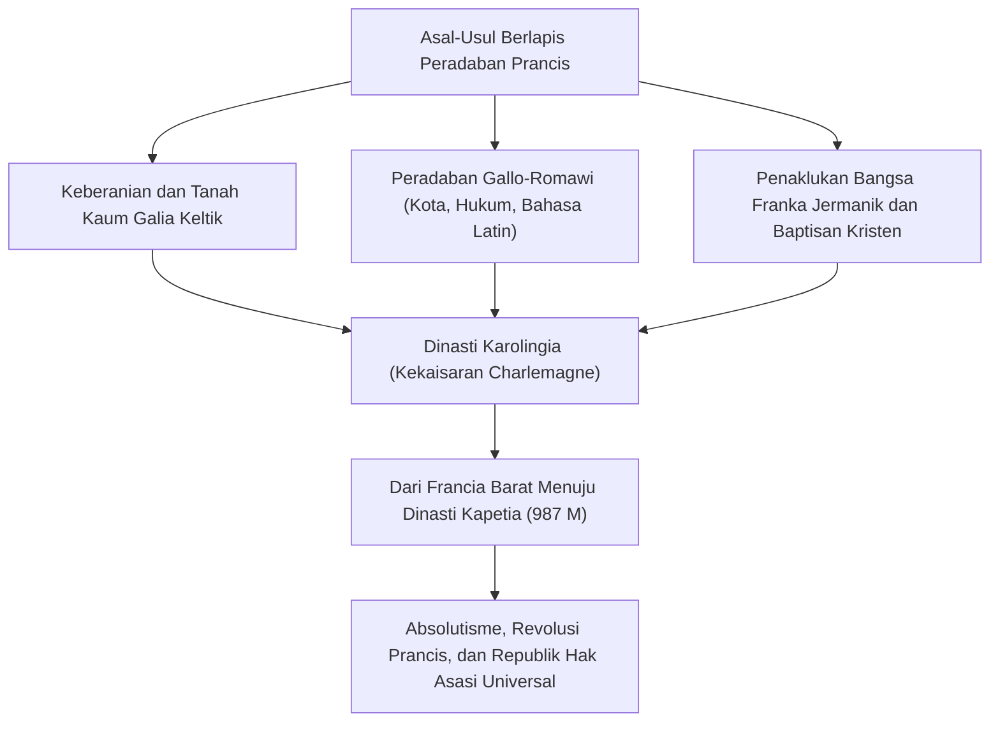
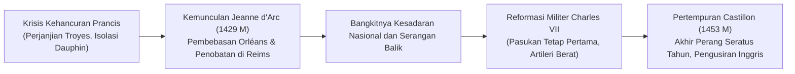
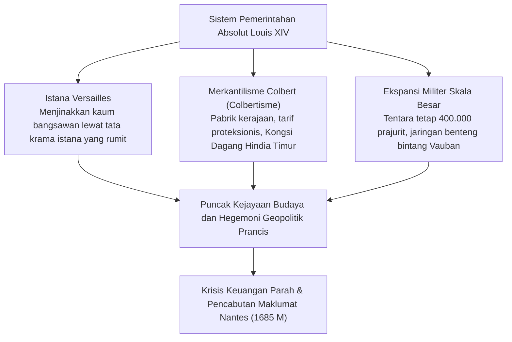
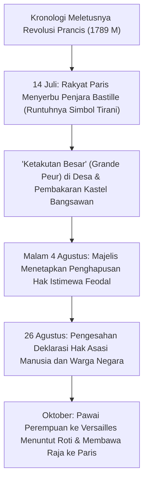
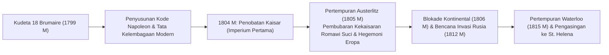
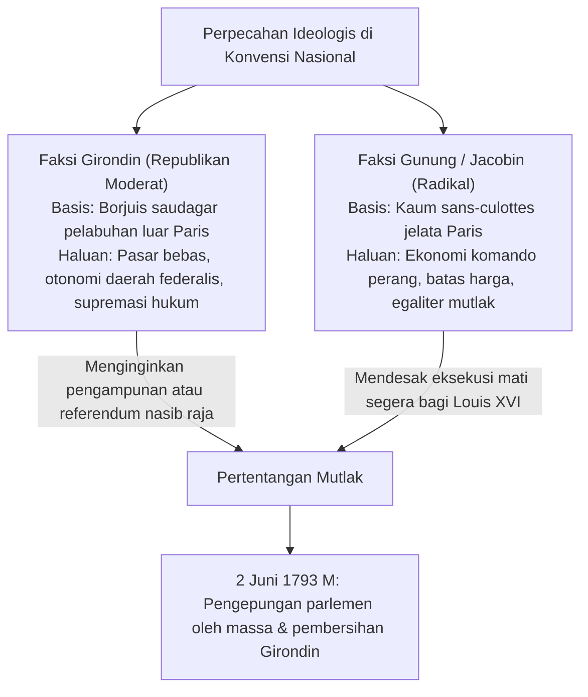

## 1. Pendahuluan: Peradaban Prancis sebagai Jantung Eropa

### 1.1 Bangsa Galia dan *Catatan tentang Perang Galia* Karya Julius Caesar

Di ujung barat benua Eropa terbentang sebuah heksagon subur (L'Hexagone), yang dikelilingi oleh Samudra Atlantik, Laut Mediterania, Sungai Rhine, Pegunungan Pirenia, dan Pegunungan Alpen. Jauh sebelum wilayah ini dinamai "Prancis", tanah ini dikenal sebagai "Galia" (*Gallia*), rumah bagi beraneka suku bangsa Keltik.

Antara tahun 58 SM dan 51 SM, panglima tertinggi Romawi, Gaius Julius Caesar, dengan kejeniusan militernya yang dingin dan metodis, melancarkan penaklukan atas seluruh wilayah Galia. Karya klasik abadi yang ditulis sendiri oleh Caesar, *Catatan tentang Perang Galia* (*Commentarii de Bello Gallico*), mencatat secara terperinci keberanian para pejuang Galia serta dinamika tatanan masyarakat kesukuan mereka.

Pada tahun 52 SM, di bawah kepemimpinan panglima muda suku Arverni, Vercingetorix, segenap suku Galia bersatu dalam pemberontakan akbar melawan kekuasaan Romawi. Akan tetapi, dalam Pertempuran Alesia yang menentukan, tempat Caesar mendirikan benteng kepungan ganda yang belum pernah ada tandingannya (garis kepungan dalam untuk mengurung benteng dan tembok luar untuk menangkal bala bantuan), pasukan Galia hancur akibat kelaparan hebat dan serangan gencar legiun Romawi. Sambil menunggang kudanya, Vercingetorix melangkah ke hadapan tenda Caesar, melemparkan senjatanya ke tanah, dan menyatakan menyerah.

Di bawah naungan kekuasaan Romawi, Galia mengalami proses Romanisasi yang sangat pesat, melahirkan peradaban Gallo-Romawi yang maju dengan jaringan jalan raya Romawi, saluran air akuaduk (seperti Pont du Gard), serta gelanggang amfiteater megah (Arles, Nîmes). Bahasa Keltik lambat laun memudar dan digantikan oleh bahasa Latin vulgar, yang menjadi rahim bagi lahirnya bahasa Prancis di kemudian hari. Kekalahan di Alesia adalah ujian getir yang melahirkan Prancis sebagai putri sulung peradaban Latin klasik.

---

### 1.2 Pembaptisan Clovis, Kerajaan Franka, dan Warisan Charlemagne

Pada abad ke-5 M, di tengah runtuhnya Kekaisaran Romawi Barat, suku Franka Salia — salah satu cabang bangsa Jermanik — menyeberangi Sungai Rhine dan merangsek ke Galia utara. Pada tahun 481 M, peletak dasar Dinasti Merovingia, **Clovis I (berkuasa 481–511 M)**, menyatukan suku-suku Franka dan mendirikan Kerajaan Franka.

Langkah politik paling monumental yang diambil Clovis adalah keputusannya untuk dibaptis ke dalam agama Kristen Katolik (ortodoksi Nicea) pada tahun 496 M di Katedral Reims. Di saat sebagian besar penguasa suku Jermanik lainnya (Visigoth, Ostrogoth, Vandal) memeluk ajaran heresi Arianisme, penerimaan Clovis terhadap Katolisisme ortodoks memberinya dukungan penuh dari kaum bangsawan senator Gallo-Romawi dan hierarki gereja, sekaligus mengukuhkan legitimasi sakral kerajaan Franka di Eropa Barat pada Abad Pertengahan.

Pada abad ke-8 M, setelah Charles Martel memukul mundur ekspansi pasukan Islam dalam Pertempuran Tours-Poitiers (732 M), putranya, Pepin yang Pendek, meraih restu kepausan untuk mendirikan Dinasti Karolingia. Di bawah kepemimpinan putra Pepin, **Charlemagne (Karel yang Agung, berkuasa 768–814 M)**, hampir seluruh daratan Eropa Barat (Prancis modern, Jerman, Italia utara, dan Negeri-Negeri Rendah) disatukan ke dalam satu imperium Kristen terpadu.

Pada Hari Natal tahun 800 M, bertempat di Basilika Santo Petrus di Roma, Paus Leo III memahkotai Charlemagne sebagai Kaisar Romawi Barat. Renaisans Karolingia, yang menghidupkan kembali sastra Latin klasik dan tradisi kesarjanaan monastik, menyalakan lentera intelektual di tengah kegelapan Abad Pertengahan awal.

Kendati demikian, seusai wafatnya Charlemagne, tradisi pembagian warisan bangsa Jermanik memecah-belah kekaisaran tersebut:
- **Tahun 843 M: Perjanjian Verdun**: Kekaisaran dibagi menjadi Francia Barat, Francia Tengah, dan Francia Timur.
- **Tahun 870 M: Perjanjian Meerssen**: Francia Tengah dibagi antara wilayah timur dan barat.
Di antara pecahan wilayah tersebut, Francia Barat (*Francia Occidentalis*) menjadi cikal bakal langsung Kerajaan Prancis.

---

## 2. Berdirinya Dinasti Kapetia dan Perjalanan Unifikasi Teritorial

### 2.1 Penobatan Hugues Capet (987 M) dan Permulaan yang Bersahaja

Pada tahun 987 M, ketika garis keturunan langsung Karolingia terputus, majelis para bangsawan agung memilih Pangeran Paris, **Hugues Capet**, sebagai raja, menandai lahirnya **Dinasti Kapetia (Capetian Dynasty)**.

Pada masa-masa awalnya, kekuasaan takhta Kapetia sangatlah rapuh. Wilayah kekuasaan langsung mahkota (*domaine royal*) hanya mencakup sebidang tanah sempit di sekitar Paris dan Orléans yang disebut Île-de-France. Penguasa feodal besar — seperti Adipati Normandia, Aquitaine, Bourgogne, dan Pangeran Flandria — menguasai wilayah serta angkatan bersenjata yang jauh melampaui kekuatan raja, dan hanya menganggap raja sebagai "yang pertama di antara yang setara" (*primus inter pares*).

Kendati demikian, Dinasti Kapetia memiliki dua keunggulan struktural yang menentukan:
1. **Pengurapan Suci Minyak Sakral (*Sacre*)**: Dimahkotai dan diurapi dengan minyak suci di Katedral Reims, sang raja dipandang memiliki otoritas rohani yang dianugerahkan langsung oleh Tuhan (kepercayaan rakyat pada raja taumaturgi yang sanggup menyembuhkan penyakit skrofula hanya dengan sentuhan tangan).
2. **Keteraturan Suksesi Primogenitur**: Secara luar biasa, selama lebih dari 340 tahun antara tahun 987 M dan 1328 M, takhta Kapetia tidak pernah mengalami kekosongan pewaris laki-laki langsung, sehingga tradisi monarki turun-temurun mengakar tanpa terbantahkan.

---

### 2.2 Philippe II Auguste dan Perluasan Wilayah Kekuasaan

Raja yang melipatgandakan wilayah kekuasaan mahkota dan dengan tegas menuntut gelar agung "Raja Prancis" (*Rex Franciae*) adalah penguasa ketujuh, **Philippe II Auguste (Philippe Auguste, berkuasa 1180–1223 M)**.

Kala itu, Dinasti Plantagenet dari Inggris (Henry II, Richard si Hati Singa, dan John Lackland) menguasai wilayah Anjou, Normandia, dan Aquitaine, membentuk "Kemaharajaan Angevina" di tanah Prancis yang luasnya jauh melampaui wilayah raja Prancis sendiri.

Memanfaatkan pelanggaran hukum feodal yang dilakukan John Lackland, Philippe Auguste secara tegas menyita dan mencaplok Normandia, Anjou, Maine, dan Touraine pada tahun 1204 M.
Pada 27 Juli 1214 M, dalam **Pertempuran Bouvines** yang menentukan sejarah, pasukan kerajaan Prancis di bawah pimpinan Philippe Auguste berhadapan dengan koalisi besar yang dihimpun Raja John bersama Kaisar Romawi Suci Otto IV dan Pangeran Flandria. Kemenangan telak Prancis melumpuhkan koalisi tersebut, mengusir kekuasaan Inggris dari utara Prancis, dan melambungkan wibawa monarki Prancis ke puncak perpolitikan Eropa.

Philippe Auguste juga membangun birokrasi pemerintahan profesional yang digaji langsung oleh kas negara — yakni para *bailli* di utara dan *sénéchal* di selatan — yang direkrut dari kalangan borjuis perkotaan untuk menegakkan hukum dan mengumpulkan pajak. Ia menetapkan Paris sebagai ibu kota abadi, mendirikan benteng Louvre, mempaving jalanan kota, serta membangun tembok pertahanan kokoh.

---

### 2.3 Philippe IV yang Tampan dan Penundukan Otoritas Kepausan (Anagni dan Avignon)

Menjelang akhir abad ke-13, seorang raja pragmatis dan bertangan dingin, **Philippe IV yang Tampan (Philippe IV le Bel, berkuasa 1285–1314 M)**, kian memperkokoh birokrasi terpusat.

Demi membiayai operasi militernya, Philippe IV memungut pajak atas kaum rohaniwan, yang memicu benturan dahsyat dengan Paus Bonifasius VIII yang mengeluarkan bulla *Unam Sanctam*, yang menegaskan bahwa kekuasaan paus berada di atas segala raja duniawi.
- **Tahun 1302 M: Sidang Pertama Tiga Golongan (*États généraux*)**: Philippe IV mengumpulkan utusan rohaniwan (Golongan Pertama), bangsawan (Golongan Kedua), dan warga kota (Golongan Ketiga) di Katedral Notre-Dame Paris untuk menggalang konsensus nasional guna menentang kepausan.
- **Tahun 1303 M: Peristiwa Penyerbuan Anagni**: Utusan raja, Guillaume de Nogaret, memimpin penyerbuan bersenjata ke kediaman paus di Anagni, menahan dan mempermalukan Bonifasius VIII (yang meninggal dunia tak lama kemudian akibat syok berat).
- **Tahun 1309–1377 M: Kepausan Avignon**: Philippe memuluskan terpilihnya paus berkebangsaan Prancis, Klemens V, dan memindahkan takhta kepausan ke Avignon di selatan Prancis, menjadikan institusi gereja berada di bawah pengawasan kerajaan selama hampir 70 tahun.
- Selain itu, Philippe IV membubarkan ordo Kesatria Templar yang sangat kaya raya atas tuduhan heresi dan menyita seluruh aset kekayaan mereka ke dalam kas kerajaan.

Klaim universalitas kepausan abad pertengahan pun runtuh, memperlihatkan Prancis sebagai negara berdaulat (*Sovereign State*) modern pertama di Eropa.

---

### 2.4 Perang Seratus Tahun dan Mukjizat Jeanne d'Arc

Setelah garis keturunan langsung Kapetia terputus, Philippe VI dari Wangsa Valois naik takhta. Sebagai tanggapan, Raja Edward III dari Inggris, yang mengklaim hak waris melalui ibunya, putri Philippe yang Tampan, menuntut mahkota Prancis, sehingga meletuslah Perang Seratus Tahun pada tahun 1337 M.

Dalam Pertempuran Crécy (1346 M), Poitiers (1356 M, tempat Raja Jean II ditawan), dan Agincourt (1415 M), kavaleri lapis baja Prancis berkali-kali dihancurkan oleh hujan panah busur panjang (*longbow*) Inggris. Adipati Bourgogne membelot ke pihak Inggris, dan Perjanjian Troyes tahun 1420 M bahkan mengakui Raja Henry V dari Inggris sebagai pewaris takhta Prancis. Putra mahkota (Dauphin) yang sah, Charles VII, terdesak ke selatan Sungai Loire di Bourges, menempatkan Prancis di ambang kehancuran total.

Pada musim semi tahun 1429 M, seorang gadis petani berusia 16 tahun dari desa Domrémy, **Jeanne d'Arc**, menghadap Charles VII di Puri Chinon. Menyatakan bahwa dirinya menerima mandat ilahi dari Malaikat Mikail untuk membebaskan Orléans dan mengantar sang Dauphin dimahkotai di Reims, ia mengenakan zirah perang putih dan memimpin bala tentara menuju kota yang terkepung itu.

Keyakinan tak tergoyahkan Jeanne d'Arc mengobarkan moral tempur prajurit Prancis. Hanya dalam waktu sembilan hari, pengepungan Orléans berhasil dipatahkan, dan Charles VII dikawal melintasi garis musuh untuk dimahkotai di Katedral Reims. Kendati Jeanne d'Arc kemudian ditangkap di Compiègne dan dihukum bakar di tiang pancang di Rouen pada tahun 1431 M pada usia sembilan belas tahun melalui pengadilan inkuisisi palsu, api patriotisme yang dinyalakannya tak pernah padam.

Charles VII menata ulang sistem keuangan kerajaan dan mendirikan **tentara tetap profesional pertama di Eropa (Kompi Ordonansi: *Compagnies d'ordonnance*)** serta memperkuat korps artileri meriam. Pada Pertempuran Castillon (1453 M), artileri Prancis meluluhlantakkan pasukan Inggris, mengakhiri Perang Seratus Tahun dengan kemenangan gemilang Prancis yang berhasil merebut kembali seluruh negerinya kecuali Calais.

---

## 3. Dari Perang Agama Menuju Puncak Absolutisme Wangsa Bourbon

### 3.1 Guncangan Reformasi dan Perang Agama Prancis (1562–1598 M)

Pada pertengahan abad ke-16, teologi Protestan yang dipelopori oleh Jean Calvin menyebar luas di kalangan pedagang, perajin, dan sebagian kaum bangsawan Prancis; kaum Protestan ini dikenal sebagai **Huguenot**.

Di tengah melemahnya wibawa raja-raja muda, persaingan sengit antara kubu Katolik militan yang dipimpin oleh Wangsa Guise melawan para pemimpin Huguenot dari Wangsa Bourbon (Kerajaan Navarra) dan Laksamana Coligny meledak menjadi perang saudara berdarah selama lebih dari tiga dasawarsa.
- **24 Agustus 1572 M: Pembantaian Hari Santo Bartolomeus**: Atas desakan ibu suri Catherine de' Medici, para pemimpin dan warga Huguenot yang berkumpul di Paris dibantai di tengah malam gulita, memicu gelombang pembantaian di seluruh negeri yang menewaskan puluhan ribu jiwa.

Sosok yang berhasil mengakhiri perang saudara bernuansa agama ini adalah pemimpin kaum Huguenot sekaligus pewaris takhta Wangsa Valois, **Henri IV (berkuasa 1589–1610 M)**, pendiri Wangsa Bourbon.
Menyadari bahwa "Paris sepadan dengan sebuah misa", ia memeluk agama Katolik demi merangkul mayoritas rakyat, dan **pada tahun 1598 M memberlakukan Maklumat Nantes (Edict of Nantes)**. Maklumat ini menetapkan Katolisisme sebagai agama resmi negara, namun tetap memberikan kebebasan beribadah, hak-hak sipil, serta hak memegang benteng pertahanan militer (seperti La Rochelle) kepada kaum Huguenot. Langkah ini menjadi tonggak awal toleransi beragama modern.

---

### 3.2 Doktrin "Raison d'État" Richelieu dan Fondasi Absolutisme

Setelah Henri IV tewas dibunuh oleh seorang fanatik agama, kendali pemerintahan di masa muda Louis XIII dipegang oleh negarawan bertangan besi, Kardinal **Richelieu (Armand Jean du Plessis)**.

Inti filosofi politik Richelieu adalah **"Alasan Negara" (*Raison d'État*)** — sebuah prinsip bahwa kedaulatan, integritas, dan kepentingan negara berada di atas pertimbangan moral pribadi, sentimen keagamaan, maupun hak istimewa kaum bangsawan.
- Di dalam negeri, ia mengepung dan menundukkan benteng La Rochelle guna mencabut hak-hak militer kaum Protestan (sembari tetap menjamin kebebasan beribadah), meruntuhkan kastel bangsawan pembangkang, dan menyebarkan para pengawas kerajaan (*Intendant*) ke segenap pelosok negeri untuk menegakkan kendali sentral.
- Di luar negeri, meskipun ia adalah seorang pangeran Gereja Katolik, Richelieu tak ragu bersekutu dengan para pangeran Protestan Jerman dan Swedia dalam Perang Tiga Puluh Tahun (1618–1648 M) guna menghancurkan cengkeraman dinasti Habsburg Austria dan Spanyol.

Melalui **Perjanjian Perdamaian Westfalen (1648 M)** yang dirampungkan oleh penggantinya, Kardinal Mazarin, Prancis memperoleh sebagian besar wilayah Alsace dan mengukuhkan posisinya sebagai kekuatan terhebat di benua Eropa.

---

### 3.3 Raja Matahari Louis XIV (Berkuasa 1643–1715 M): "L'État, c'est moi"

Pada tahun 1661 M, seusai wafatnya Mazarin, **Louis XIV** yang baru berusia 22 tahun memutuskan untuk memegang kendali pemerintahan secara pribadi tanpa mengangkat perdana menteri. Berlandaskan doktrin hak ilahi raja-raja yang dirumuskan oleh Uskup Bossuet, ia memimpin monarki absolut hingga mencapai titik puncaknya.

#### ① Istana Versailles sebagai Mesin Penjinak Kekuasaan
Dibangun di barat daya Paris sebagai adikarya arsitektur Barok, Istana Versailles — dengan Galeri Kaca, taman geometris yang tertata rapi, dan kemegahan ornamen emasnya — memiliki fungsi politik yang mendalam.
Mengingat trauma pemberontakan bangsawan semasa kecilnya (La Fronde, 1648–1653 M), Louis XIV mewajibkan para bangsawan tinggi untuk bermukim di istana, menyibukkan mereka dengan persaingan kehormatan sepele seperti hak membawakan kemeja raja saat bangun tidur (*lever*) atau menjelang tidur (*coucher*), sehingga mematikan ambisi pemberontakan mereka.

#### ② Merkantilisme Colbert dan Tentara Tetap
Pengawas Keuangan Jean-Baptiste Colbert menerapkan kebijakan merkantilisme yang agresif ("Colbertisme"), mendirikan industri manufaktur mewah milik negara (kain permadani Gobelins, kaca cermin, porselen) guna mendongkrak ekspor dan menerapkan tarif bea masuk proteksionis. Menteri Perang Louvois memperbesar kekuatan tentara tetap menjadi 400.000 personel, sementara Marsekal Vauban membentengi perbatasan Prancis dengan sabuk benteng berbentuk bintang yang kokoh (*Ceinture de fer*).

#### ③ Harga Sebuah Kemegahan: Pencabutan Maklumat Nantes
Akan tetapi, puncak kejayaan tersebut menyimpan benih kemunduran.
Perang penaklukan yang berkepanjangan (Perang Devolusi, Perang Prancis-Belanda, Perang Sembilan Tahun, Perang Suksesi Spanyol) menguras kas negara hingga ke titik nadir.
Kesalahan paling fatal terjadi pada tahun 1685 M melalui **Maklumat Fontainebleau (Pencabutan Maklumat Nantes)**. Dengan menyatakan bahwa ajaran Protestan sudah tiada di Prancis, Louis XIV melarang peribadatan kaum Huguenot. Akibatnya, antara 200.000 hingga 300.000 saudagar, perajin terampil, dan pemodal ulung melarikan diri ke Belanda, Inggris, dan Prusia, memukul perekonomian nasional dan mengawali senjakala monarki mutlak.

---

## 4. Abad Pencerahan dan Badai Revolusi Prancis (1789–1799 M)

### 4.1 Kontradiksi Rezim Kuno dan Ledakan Gagasan Pencerahan

Pada abad ke-18, masyarakat Prancis terbelenggu dalam sistem hierarki warisan abad pertengahan yang dikenal sebagai **Rezim Kuno (*Ancien Régime*)**:
- **Golongan Pertama (Rohaniwan, ±100.000 jiwa)**: Menguasai 10% lahan subur dan menikmati kebebasan bebas pajak.
- **Golongan Kedua (Bangsawan, ±400.000 jiwa)**: Menguasai 20–25% tanah, bebas dari pajak, serta memonopoli jabatan tinggi dalam pemerintahan, peradilan, dan militer.
- **Golongan Ketiga (Rakyat jelata, borjuis, petani, ±25 juta jiwa, 98% penduduk)**: Memikul seluruh beban pajak (taille, pajak kepala, gabelle, persepuluhan, kerja paksa) tanpa memiliki hak politik sama sekali.

Ketidakadilan sosial ini dibongkar secara tajam oleh para pemikir **Abad Pencerahan (*Enlightenment*)**:
- **Voltaire**: Mengecam fanatisme dan intoleransi gereja lewat sindiran tajam, memperjuangkan kebebasan berpendapat dan nalar (kasus Calas).
- **Montesquieu**: Dalam *Semangat Hukum*, merumuskan pemisahan kekuasaan (trias politika) antara eksekutif, legislatif, dan yudikatif guna mencegah tirani.
- **Jean-Jacques Rousseau**: Dalam *Kontrak Sosial*, menegaskan kedaulatan rakyat yang berakar pada "Kehendak Umum" (*volonté générale*).
- **Diderot dan d'Alembert**: Menyusun *Encyclopédie*, menghimpun khazanah ilmu pengetahuan rasional untuk membebaskan masyarakat dari takhayul.

---

### 4.2 Penyerbuan Penjara Bastille dan Deklarasi Hak Asasi Manusia (1789 M)

Pemborosan kas negara era Louis XV, kekalahan dalam Perang Tujuh Tahun, serta pinjaman dana raksasa dari Louis XVI untuk menyokong Perang Kemerdekaan Amerika Serikat membuat perbendaharaan Prancis bangkrut. Penolakan kaum bangsawan terhadap rencana pemungutan pajak memaksa Louis XVI menghidupkan kembali majelis Tiga Golongan (*États généraux*) pada Mei 1789 M setelah mati suri selama 175 tahun.

Ketika perdebatan mengenai tata cara pemungutan suara menemui jalan buntu, delegasi Golongan Ketiga memisahkan diri dan memproklamasikan **Majelis Nasional (*Assemblée nationale*)**. Karena ruangan sidang mereka digembok oleh raja, mereka berkumpul di lapangan tenis tertutup pada 20 Juni dan mengikrarkan **Sumpah Lapangan Tenis**, berjanji tidak akan bubar sebelum rampung menyusun konstitusi tertulis bagi Prancis.

Ketika raja mengerahkan pasukan ke sekeliling Paris dan memecat Jacques Necker, kemarahan rakyat Paris meledak tak terbendung.

Disahkan pada 26 Agustus 1789 M, **Deklarasi Hak Asasi Manusia dan Warga Negara** (yang dirumuskan bersama Lafayette) memancarkan nilai-nilai luhur universal:
1. **"Manusia dilahirkan bebas dan tetap memiliki hak-hak yang setara."** (Pasal 1)
2. **"Prinsip segala kedaulatan pada hakikatnya berakar pada Bangsa."** (Pasal 3: Kedaulatan Rakyat)
3. Hak-hak asasi alami: kebebasan, kepemilikan harta, keamanan, dan perlawanan terhadap penindasan.
4. Kesetaraan di muka hukum, asas praduga tak bersalah, kebebasan menyatakan pendapat dan beragama, serta kesakralan hak milik pribadi.

---

### 4.3 Tumbangnya Monarki dan Pemerintahan Teror Guillotine

Akan tetapi, arus revolusi bergerak menuju radikalisasi ekstrem. Pada Juni 1791 M, upaya Louis XVI dan Marie Antoinette untuk melarikan diri ke perbatasan Austria digagalkan di Varennes (**Pelarian ke Varennes**), menghancurkan kepercayaan rakyat terhadap keluarga kerajaan.
Ketika Austria dan Prusia mengancam akan campur tangan militer (Deklarasi Pillnitz), Prancis menyatakan perang pada April 1792 M. Para sukarelawan dari berbagai penjuru berbaris menuju ibu kota sambil menyanyikan lagu barisan tentara Rhine yang kelak diabadikan sebagai lagu kebangsaan, *La Marseillaise*.

- **Pemberontakan 10 Agustus 1792 M**: Kaum sans-culottes dan sukarelawan menyerbu Istana Tuileries, melengserkan raja dari takhtanya. Konvensi Nasional dibentuk, monarki dihapuskan, dan **Republik Pertama** diproklamasikan.
- **21 Januari 1793 M**: Louis XVI dieksekusi dengan pisau guillotine di Place de la Révolution (kini Place de la Concorde) atas dakwaan pengkhianatan terhadap negara; disusul oleh Marie Antoinette pada Oktober tahun yang sama.

Di tengah ancaman Koalisi Pertama kekuatan Eropa dan pemberontakan petani loyalis monarki di Vendée, tampuk kepemimpinan diambil alih oleh faksi radikal Jacobin pimpinan Maximilien Robespierre.

Robespierre berprinsip bahwa **"teror tanpa kebajikan adalah petaka; kebajikan tanpa teror adalah ketakberdayaan"**, melancarkan masa **Pemerintahan Teror (*La Terreur*)**. Sekitar 40.000 orang — mulai dari bangsawan, anggota faksi moderat Girondin, hingga kawan seperjuangan seperti Danton — tewas di tiang pancang guillotine.
Kendati mobilisasi massa militer (*levée en masse*) berhasil memukul mundur serbuan musuh asing, rasa dicekam ketakutan membuat para anggota dewan berbalik melawan Robespierre. Pada **Kudeta 9 Thermidor Tahun II (27 Juli 1794 M)**, Robespierre ditangkap dan dieksekusi keesokan harinya, mengakhiri Teror Merah.

---

## 5. Kebangkitan Napoleon Bonaparte dan Imperium Pertama

### 5.1 Pemulih Ketertiban: Dari 18 Brumaire Menuju Mahkota Kaisar

Pemerintahan Direktori yang menggantikan Jacobin terjerumus dalam korupsi, kelemahan wibawa, dan gejolak politik berkepanjangan. Rakyat merindukan hadirnya sosok pemimpin tegas yang sanggup memulihkan stabilitas seraya mempertahankan capaian revolusi. Sosok tersebut muncul dalam diri perwira jenius asal Pulau Korsika: **Napoleon Bonaparte (1769–1821 M)**.

Setelah memikat bangsa lewat kemenangannya di Pengepungan Toulon dan kampanye cemerlang di Italia (1796–1797 M), Napoleon melancarkan **Kudeta 18 Brumaire** pada 9 November 1799 M, menggulingkan Direktori, dan mengangkat dirinya sebagai Konsul Pertama.

Pencapaian teragung Napoleon melampaui kemenangan militer semata: ia berhasil **memformalkan semangat revolusi menjadi tata hukum dan kelembagaan modern yang permanen**:
1. **Kitab Undang-Undang Hukum Perdata Prancis (Kode Napoleon, 1804 M)**: Mengukuhkan kesetaraan di muka hukum, pemisahan urusan agama dari perdata, kebebasan berkontrak, kepemilikan properti pribadi yang tak dapat diganggu gugat, dan tatanan keluarga yang tertib. Kitab ini menjadi kiblat hukum perdata di sebagian besar belahan dunia.
2. **Peletakan Institusi Modern**: Pembentukan Bank Prancis (Banque de France), stabilisasi mata uang franc germinal, sentralisasi pendidikan umum (sekolah menengah lycée, ujian baccalauréat), dan pembentukan bintang kehormatan Légion d'honneur.
3. **Konkordat 1801 M**: Berdamai dengan Paus Pius VII, mengakui Katolisisme sebagai "agama mayoritas warga negara", tetapi tetap mempertahankan tanah sitaan gereja di tangan pemilik baru dan menempatkan rohaniwan sebagai pegawai yang digaji negara.

Pada 2 Desember 1804 M di Katedral Notre-Dame Paris, Napoleon mengambil sendiri mahkota dari tangan Sri Paus dan meletakkannya di atas kepalanya sendiri, memproklamasikan dirinya sebagai **Napoleon I, Kaisar Bangsa Prancis** (Kekaisaran Pertama).

---

### 5.2 Kejayaan Menguasai Daratan Eropa dan Petaka di Belantara Rusia

Didukung oleh pasukan tempur *Grande Armée*, yang dipersenjatai semangat wajib militer serta keunggulan manuver mobilitas kilat Napoleon, Prancis mendominasi daratan Eropa:
- **Tahun 1805 M: Pertempuran Austerlitz (Pertempuran Tiga Kaisar)**: Menghancurkan gabungan balatentara Tsar Aleksandr I dari Rusia dan Kaisar Francis II dari Austria, membubarkan Kekaisaran Romawi Suci yang berusia seribu tahun, dan membentuk Konfederasi Rhine.
- **Tahun 1806 M: Takluknya Prusia**: Melibas tentara Prusia di Jena-Auerstedt dan berparade melintasi Gerbang Brandenburg di Berlin.

Namun, Inggris yang menguasai lautan pasca-Pertempuran Trafalgar (1805 M) tetap tak tergoyahkan. Napoleon membalas pada tahun 1806 M dengan mengeluarkan **Dekret Berlin tentang Blokade Kontinental**, yang melarang seluruh pelabuhan Eropa berdagang dengan Inggris.

Guna menghukum Kekaisaran Rusia yang melanggar blokade perdagangan dengan London, Napoleon menghimpun 600.000 prajurit untuk menyerbu Rusia pada Juni 1812 M.
Panglima Rusia Kutuzov menerapkan taktik bumi hangus dan mengorbankan Moskow dilalap api. Di tengah gerak mundur melintasi padang salju bersuhu minus 30 derajat Celsius, pasukan *Grande Armée* dihancurkan oleh kelaparan, hipotermia, dan serbuan gerilya Cossack. Hanya beberapa puluh ribu prajurit yang berhasil pulang dengan selamat.

Napoleon yang awalnya disambut sebagai pembawa pembebasan feodalisme justru membangkitkan nasionalisme bangsa-bangsa Eropa untuk melawannya. Tumbang dalam Pertempuran Leipzig (1813 M), ia turun takhta pada tahun 1814 M dan diasingkan ke Pulau Elba. Sempat meloloskan diri dan berkuasa kembali dalam "Pemerintahan Seratus Hari", Napoleon akhirnya dipukul mutlak dalam **Pertempuran Waterloo (1815 M)** oleh bala tentara Wellington dan Blücher. Diasingkan ke pulau terpencil Saint Helena di Samudra Atlantik selatan, ia mengembuskan napas terakhir pada Mei 1821 M.

---

## 6. Siklus Revolusi Abad ke-19: Dari Restorasi Menuju Komune Paris

Seusai kejatuhan Napoleon, Kongres Wina memulihkan takhta Wangsa Bourbon di bawah Louis XVIII (Restorasi). Namun, bangsa Prancis yang telah merasakan kesetaraan hukum menolak kembali ke belenggu monarki mutlak. Sepanjang abad ke-19, Prancis menjadi kancah pergulatan aneka rezim: kerajaan konstitusional, imperium, dan republik.

### 6.1 Revolusi Juli (1830 M) dan Revolusi Februari (1848 M)

- **Tahun 1830 M: Revolusi Juli (*Tiga Hari Kejayaan*)**: Upaya reaksioner Raja Charles X mencabut kebebasan pers memicu kaum buruh dan mahasiswa membangun barikade perlawanan (momen yang diabadikan Eugene Delacroix dalam lukisan mahsyur *Kemerdekaan Memimpin Rakyat*). Charles X melarikan diri, dan Louis-Philippe dari Wangsa Orléans dinobatkan sebagai "Raja Warga Prancis" (Monarki Juli, di bawah dominasi kaum pemodal dan bankir).
- **Tahun 1848 M: Revolusi Februari**: Perkembangan industrialisasi memperbanyak populasi kaum buruh yang menuntut hak pilih universal. Louis-Philippe dipaksa lengser dan **Republik Kedua** diproklamasikan. Kebijakan "Bengkel Nasional" yang digagas sosialis Louis Blanc untuk menampung pengangguran kemudian ditutup oleh pihak konservatif, memicu Pemberontakan Juni yang ditumpas secara berdarah.

---

### 6.2 Imperium Kedua Napoleon III dan Renovasi Akbar Paris

Di tengah ketidakpastian sosial, keponakan kaisar terdahulu, **Louis-Napoleon Bonaparte**, memenangkan pemilihan presiden tahun 1848 M secara mutlak berkat dukungan petani pedesaan.
Pada Desember 1851 M, ia melancarkan kudeta membubarkan parlemen, dan setahun kemudian menobatkan dirinya sebagai Kaisar **Napoleon III** (Kekaisaran Kedua: 1852–1870 M).

Napoleon III memberi wewenang penuh kepada Prefek Sungai Seine, Baron Haussmann, untuk memimpin **renovasi tata ruang kota Paris secara radikal**:
- Menggusur lorong-lorong sempit kumuh abad pertengahan yang kerap menjadi sarang pembangunan barikade pemberontak.
- Membuka jalan-jalan raya lebar nan lurus (*boulevard*) yang memancar dari Monumen Arc de Triomphe, melengkapinya dengan sistem saluran air bawah tanah modern, penerangan lampu gas, serta taman-taman publik (seperti Bois de Boulogne).
- Keindahan panorama "Kota Cahaya" yang memikat dunia hari ini lahir dari perombakan besar di era Kekaisaran Kedua ini.

Namun, rentetan petualangan militer di luar negeri (Perang Krimea, intervensi di Italia, serta kegagalan ekspedisi ke Meksiko) berujung pada jebakan diplomatik Bismarck yang menjerumuskan Prancis ke kancah **Perang Prancis-Prusia (1870 M)**. Dalam Pertempuran Sedan, Napoleon III tertawan bersama pasukannya, dan Kekaisaran Kedua runtuh seketika.

---

### 6.3 Tahun 1871 M: Tragedi Epik Komune Paris

Dipicu oleh kemarahan atas pengepungan tentara Prusia serta perjanjian gencatan senjata yang memalukan dari pemerintahan sementara pimpinan Adolphe Thiers, para buruh dan Garda Nasional Paris menolak meletakkan senjata.
Pada 28 Maret 1871 M di hadapan Balai Kota Paris, diproklamasikanlah **Komune Paris (Commune de Paris)** — pemerintahan buruh demokratis mandiri pertama dalam sejarah peradaban manusia.

- Komune Paris melahirkan kebijakan sosial yang sangat progresif: pemisahan urusan agama dari negara, pelarangan mempekerjakan anak, pengelolaan pabrik yang ditinggalkan majikan oleh serikat buruh, dan penghapusan tentara reguler untuk digantikan oleh rakyat bersenjata.
- Pasukan resmi pemerintah Thiers di Versailles, dengan dukungan tentara Prusia, melancarkan serbuan besar-besaran untuk merebut kembali Paris.
- Selama **"Pekan Berdarah" (*La Semaine sanglante*, 21–28 Mei 1871 M)**, pertempuran jalanan berlangsung sengit. Sekitar 20.000 pejuang Komune dieksekusi secara massal (di antaranya di Tembok Federasi di Pemakaman Père-Lachaise), dan puluhan ribu lainnya dibuang ke koloni tahanan seberang lautan.

---

## 7. Dari Republik Ketiga Menuju Perang Dunia, De Gaulle, dan Republik Kelima

### 7.1 Era Belle Époque dan Pengukuhan Prinsip Laïcité

Ditegakkan di atas puing-puing penumpasan Komune, **Republik Ketiga (1870–1940 M)** yang awalnya tampak rapuh justru bertahan kokoh selama 70 tahun dan menjadi fondasi Prancis modern.
Kurun waktu menjelang tahun 1914 dikenang dengan sebutan **"Belle Époque" (Zaman Kejayaan yang Indah)**: Menara Eiffel didirikan menyemarakkan Pameran Dunia 1889 M, seni lukis Impresionisme mekar semerbak, dan sinema modern diciptakan oleh Lumière bersaudara.

Akan tetapi, tatanan ini diguncang hebat oleh **"Peristiwa Dreyfus" (1894 M)**. Kapten Alfred Dreyfus, seorang perwira Yahudi berdarah Alsace, dijatuhi hukuman atas tuduhan palsu menjadi mata-mata Jerman. Novelis terkemuka Émile Zola menerbitkan surat terbuka di harian *L'Aurore* berjudul **"J'accuse…!" (Saya Menggugat!)**. Bangsa Prancis terbelah antara faksi militeristik-klerikal melawan kaum dreyfusard yang membela kebenaran dan hak asasi manusia.

Pemulihan nama baik Dreyfus mengantarkan faksi republikan meloloskan **Undang-Undang Pemisahan Gereja dan Negara Tahun 1905 (*Loi de 1905*)**. Menjamin netralitas mutlak institusi publik dan pendidikan dari campur tangan agama serta menempatkan keyakinan sebagai urusan pribadi, asas **Laïcité (sekularisme)** menjadi napas dasar kewarganegaraan Republik Prancis.

---

### 7.2 Ujian Dua Perang Dunia dan Kobaran Api Perlawanan De Gaulle

- **Perang Dunia I (1914–1918 M)**: Serbuan pasukan Kekaisaran Jerman berhasil dibendung di Sungai Marne. Melalui perang parit yang sangat mengerikan (seperti di neraka Verdun dengan 700.000 korban), Prancis dan sekutunya menang, namun harus ditebus dengan tewasnya 1,4 juta pemuda dan luluhlantaknya kawasan industri utara.
- **Petaka Invasi 1940 M dan Rezim Boneka Vichy**: Pada Mei 1940 M, divisi panzer Nazi memotong pertahanan Garis Maginot melalui Hutan Ardennes. Hanya dalam enam minggu, militer Prancis menyerah kalah. Marsekal Philippe Pétain mendirikan rezim kolaborator di kota Vichy yang tunduk pada kehendak Hitler.

Pada 18 Juni 1940 M, setelah meloloskan diri ke London, Wakil Menteri Perang Brigadir Jenderal **Charles de Gaulle** menyampaikan pidato bersejarahnya melalui radio BBC:
> **"Apakah kata terakhir sudah terucap? Apakah harapan harus sirna? Apakah kekalahan ini sudah mutlak? Tidak! [...] Apa pun yang terjadi, api perlawanan rakyat Prancis tidak boleh padam dan tidak akan pernah padam!"**

Mengorganisasi gerakan "Prancis Merdeka" dari pengasingan dan menyatukan sel-sel perlawanan bawah tanah (Résistance) lewat tangan Jean Moulin, De Gaulle mengawal pembebasan Paris pada tahun 1944 M seusai Pendaratan Normandia. Melalui tekad bajanya, Prancis berhasil diakui sebagai salah satu negara pemenang perang dan meraih kursi permanen di Dewan Keamanan PBB.

---

### 7.3 Lahirnya Republik Kelima dan Diplomasi Berdaulat Gaullisme

Kala Republik Keempat lumpuh akibat pertikaian parlementer dan krisis berdarah Perang Kemerdekaan Aljazair (1954–1962 M), Prancis yang di ambang perang saudara memanggil kembali De Gaulle pada tahun 1958 M.

De Gaulle merombak tatanan konstitusi dan memelopori lahirnya **Republik Kelima (Cinquième République)** yang bertumpu pada kekuasaan eksekutif presiden kuat yang dipilih langsung oleh rakyat:
- **Pengakuan Kemerdekaan Aljazair (Perjanjian Évian, 1962 M)**: Menuntaskan beban imperialisme masa lalu.
- **Kemandirian Kekuatan Penangkal Nuklir (*Force de frappe*)**: Menolak ketergantungan mutlak pada payung nuklir Amerika Serikat.
- **Garis Luar Negeri Berdaulat Gaullisme**: Menarik Prancis dari komando militer terintegrasi NATO pada tahun 1966 M, menjadi negara Barat pertama yang mengakui Republik Rakyat Tiongkok pada tahun 1964 M, serta mengecam intervensi Amerika di Vietnam, konsisten mengusung tatanan dunia multipolar.

Pergolakan **Mei 1968 (May 68)**, yang memadukan aksi unjuk rasa mahasiswa dan pemogokan umum sepuluh juta buruh, meruntuhkan nilai-nilai otoritarian kuno serta membuka gerbang bagi transformasi sosial menuju kesetaraan gender, individualisme modern, dan kepedulian ekologis.

---

## 4.5 Pergolakan Batin Revolusi: Polarisasi Girondin vs Montagnard dan *Deklarasi Hak-Hak Perempuan*

Pergulatan politik di dalam tubuh Konvensi Nasional (1792–1795 M) bukanlah sekadar perebutan takhta kekuasaan, melainkan benturan pandangan filosofis tentang arah masa depan bangsa:

### ① Olympe de Gouges dan *Deklarasi Hak-Hak Perempuan dan Warga Negara Perempuan*
Deklarasi tahun 1789 M, kendati mengumandangkan bahasa kesetaraan universal, pada kenyataannya membatasi hak politik aktif hanya bagi kaum lelaki berharta.
Dramawan terkemuka **Olympe de Gouges (1748–1793 M)** menerbitkan traktat **Deklarasi Hak-Hak Perempuan dan Warga Negara Perempuan (*Déclaration des droits de la femme et de la citoyenne*)** pada tahun 1791 M, membongkar kemunafikan para pemimpin revolusi laki-laki:

> **"Perempuan dilahirkan merdeka dan tetap setara dengan laki-laki dalam hak-haknya."**
> **"Bila perempuan berhak menaiki panggung tiang gantungan, maka ia semestinya berhak pula menaiki mimbar dewan perwakilan."**

Ia menuntut hak pilih bagi kaum wanita, akses yang sama terhadap jabatan publik, dan pengakuan perkawinan sebagai ikatan perdata yang setara. Karena menentang rezim Robespierre, ia dihukum pancung pada tahun 1793 M atas tuduhan "melupakan kodrat kewanitaannya". Pemikirannya menjadi dasar pijakan feminisme modern yang disempurnakan oleh Simone de Beauvoir dalam *The Second Sex*.

---

## 5.3 Pembaruan Doktrin Militer Napoleon: Sistem Korps dan Kecepatan Manuver

Keberhasilan gemilang Napoleon menundukkan pasukan koalisi berakar pada revolusi pengorganisasian taktik perang (*Operational Art*):

1. **Pembentukan Korps Gabungan Seluruh Satuan (*Corps d'Armée*)**:
   - Alih-alih mengerahkan bala tentara raksasa dalam satu rombongan lamban, Napoleon membagi pasukannya menjadi korps-korps mandiri berkekuatan 20.000 hingga 30.000 prajurit yang memadukan infanteri, kavaleri, artileri, dan zeni.
   - Tiap korps memiliki daya tahan taktis untuk menghadapi pasukan musuh yang lebih besar selama 24 hingga 48 jam secara mandiri.
   - **"Maju terpisah, bertempur serempak" (*March divided, fight united*)**: Pasukan berderap cepat melalui jalur-jalur berbeda sembari memenuhi logistik secara lokal, lalu secara mendadak memusatkan kekuatan di sisi sayap atau lambung belakang pertahanan musuh di hari pertempuran besar.
2. **Manuver Posisi Sentral dan Pemusatan Kekuatan**:
   - Saat menghadapi dua pasukan sekutu musuh yang bergerak dari dua arah berbeda, Napoleon menusuk ke celah di antara keduanya untuk memutus komunikasi.
   - Dengan menempatkan pasukan penahan untuk memperlambat satu sisi, ia menghimpun seluruh kekuatan utama untuk menggulung sisi lainnya sebelum berbalik melibas musuh pertama.

---

## 7.4 Kepedihan Dekolonisasi: Dien Bien Phu dan Perang Aljazair (1954–1962 M)

Setelah tahun 1945 M, keruntuhan imperium kolonial terbesar kedua di dunia meninggalkan luka sosial yang sangat perih bagi Prancis:
### ① Akhir Perang Indochina: Titik Nadir di Dien Bien Phu (1954 M)
Di Vietnam, untuk mematahkan taktik gerilya Viet Minh pimpinan Ho Chi Minh, militer Prancis membangun benteng pertahanan di lembah cekungan Dien Bien Phu untuk memancing pertempuran terbuka.
Namun, Jenderal Vo Nguyen Giap secara luar biasa mengerahkan tenaga manusia menggotong ratusan meriam berat mendaki punggung bukit rimba yang mengitari pangkalan Prancis. Setelah dihujani tembakan artileri tanpa henti selama dua bulan, benteng tersebut takluk, memaksa Prancis angkat kaki dari Asia Tenggara melalui Perjanjian Jenewa.

### ② Perang Aljazair dan Lahirnya Republik Kelima
Telah dikuasai sejak 1830 M dan diposisikan bukan sebagai koloni biasa melainkan sebagai "wilayah provinsi Prancis" yang dihuni lebih dari satu juta warga keturunan Eropa (*Pieds-Noirs*), Aljazair meledak dalam perlawanan bersenjata Front Pembebasan Nasional (FLN) pada tahun 1954 M.
- Pasukan lintas udara Prancis menggunakan praktik penyiksaan dan eksekusi sepihak untuk membongkar sel-sel pejuang di ibu kota (Pertempuran Algiers), memicu gelombang kecaman moral dari para cendekiawan terkemuka seperti Jean-Paul Sartre.
- Pemberontakan para jenderal militer dan pemukim di Aljazair pada Mei 1958 M mengancam akan menerjunkan pasukan payung ke Paris, melumpuhkan Republik Keempat dan mengantar De Gaulle kembali berkuasa.
- Membaca keniscayaan zaman dan selamat dari berbagai upaya pembunuhan oleh kelompok teroris ekstrem kanan OAS, De Gaulle menandatangani **Perjanjian Évian pada tahun 1962 M**, merestui kemerdekaan penuh bagi bangsa Aljazair.

---

## 7.5 Ledakan Pemikiran Kontemporer dan Negara Pelindung Budaya (Sartre, Camus, Malraux)

Kendati pengaruh hegemoni militernya surut seusai Perang Dunia II, Prancis tetap menyandang mahkota sebagai episentrum kebudayaan dan intelektual dunia.

### ① Raksasa Eksistensialisme: Perseteruan Sartre vs Camus
Di kedai-kedai kopi Saint-Germain-des-Prés, pemikiran eksistensialisme Jean-Paul Sartre dan Albert Camus memikat dunia:
- **Sartre (*Being and Nothingness*)**: "Eksistensi mendahului esensi". Manusia tidak memiliki takdir bawaan yang sudah digariskan; ia bebas dan harus menentukan dirinya sendiri lewat aksi nyata (*engagement*). Sartre bersimpati pada Marxisme dan memaklumi kekerasan revolusioner.
- **Camus (*The Rebel*)**: Lahir dari keluarga miskin di Aljazair, Camus menolak pengorbanan nyawa manusia atas nama ideologi utopis mana pun. Keretakan hubungan persahabatan kedua tokoh ini menjadi perdebatan etika paling monumental di abad ke-20.

### ② André Malraux dan Pembentukan Kementerian Kebudayaan (1959 M)
Ditunjuk oleh De Gaulle sebagai Menteri Urusan Kebudayaan pertama di Prancis, sastrawan André Malraux menciptakan cetak biru kebijakan kebudayaan negara:
- Mengukuhkan kewajiban negara untuk **"menyebarluaskan karya seni termegah umat manusia kepada sebanyak mungkin rakyat Prancis"**.
- Membangun jaringan balai seni "Rumah Kebudayaan" (*Maisons de la Culture*) di daerah-daerah.
- Membersihkan kerak jelaga hitam pada fasad bangunan bersejarah di Paris menggunakan semprotan bertekanan tinggi untuk mengembalikan kilau aslinya, serta merumuskan Undang-Undang Malraux guna melindungi kawasan cagar budaya perkotaan.

---

## 7.6 Masa Pemerintahan Mitterrand dan Penghapusan Hukuman Mati (1981 M)

Pada tahun 1981 M, François Mitterrand terpilih sebagai presiden sosialis pertama dalam sejarah Republik Kelima, memelopori serangkaian reformasi sosial-demokratik yang mendasar.

### ① Robert Badinter dan Berakhirnya Era Guillotine (1981 M)
Prancis merupakan negara Eropa Barat terakhir yang masih menerapkan hukuman mati pancung dengan mesin guillotine (eksekusi terakhir dilaksanakan pada tahun 1977 M).
Menteri Kehakiman Robert Badinter, di tengah penolakan sebagian besar opini publik, berpidato dengan penuh wibawa di hadapan Majelis Nasional hingga berhasil meloloskan undang-undang penghapusan hukuman mati:
> **"Keadilan tidak boleh berupa tindakan pembantaian. Menolak wewenang negara untuk mencabut nyawa rakyatnya adalah penegasan tertinggi terhadap martabat kemanusiaan."**

### ② Perluasan Kesejahteraan Kaum Pekerja
- Pemangkasan jam kerja resmi menjadi 39 jam sepekan (yang kemudian diturunkan menjadi 35 jam di era Lionel Jospin).
- Pemberian hak cuti berbayar tahunan selama lima pekan, disertai kenaikan upah minimum (SMIC) dan tunjangan keluarga.
- Pengesahan undang-undang desentralisasi (UU Defferre), mengalihkan kekuasaan administratif dari para prefek utusan pusat kepada dewan perwakilan daerah terpilih.

### ③ Emmanuel Macron dan Wacana Kedaulatan Strategis Eropa
Terpilih pada tahun 2017 M pada usia 39 tahun, Emmanuel Macron memecahkan dominasi dwipartai konvensional. Dalam pidatonya di Universitas Sorbonne, di tengah persaingan adidaya Amerika Serikat-Tiongkok serta agresi Rusia di Ukraina, Macron menyerukan urgensi **Kedaulatan Strategis Eropa (*Souveraineté européenne*)**, mendorong kemandirian pertahanan, industri, dan energi Eropa, meneruskan garis diplomasi independen warisan De Gaulle di abad ke-21.

---

## 8. Kesimpulan: Obor Abadi Kebebasan, Kesetaraan, dan Persaudaraan

Merenungi bentangan panjang sejarah Prancis akan mempertemukan kita pada satu benang merah yang tak pernah putus: **hasrat mendalam terhadap nilai-nilai universalitas (*Universalisme*)**.

Peradaban Prancis tidak pernah membatasi dirinya pada tradisi lokal yang sempit. Melalui filsafat, sastra, kesenian, dan kobaran api revolusi, Prancis senantiasa menguji pertanyaan-pertanyaan hakiki tentang harkat manusia dan bagaimana membangun masyarakat yang berkeadilan.

Trilogia agung yang lahir dari kancah revolusi 1789 M — **"Liberté, Égalité, Fraternité" (Kebebasan, Kesetaraan, Persaudaraan)** — kini bernapas sebagai norma hak asasi manusia dalam konstitusi-konstitusi negara demokrasi di segenap penjuru bumi.

Kendati masa kini diwarnai dinamika penerapan sekularisme (*Laïcité*), tantangan integrasi Eropa, serta gelombang demonstrasi rakyat seperti gerakan Rompi Kuning, bangsa Prancis senantiasa menyalakan kembali kepercayaannya pada nalar kritis. Keteguhan dalam memperjuangkan pembebasan manusia inilah warisan termegah yang dipersembahkan oleh sejarah Prancis bagi peradaban dunia.
