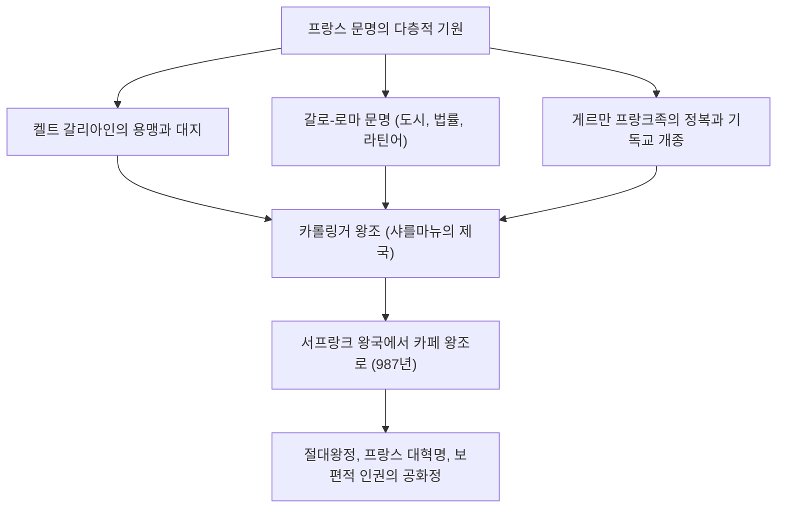
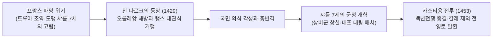
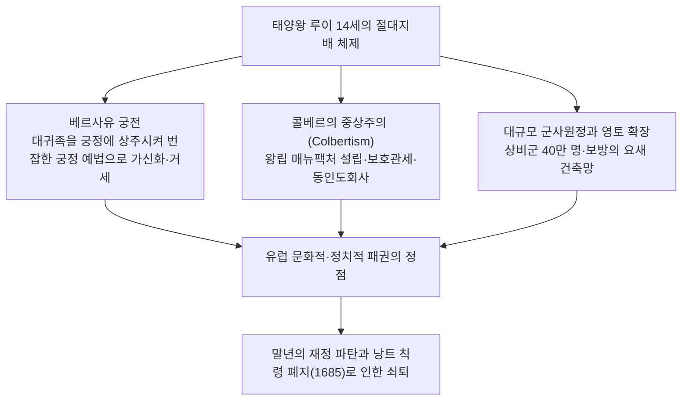
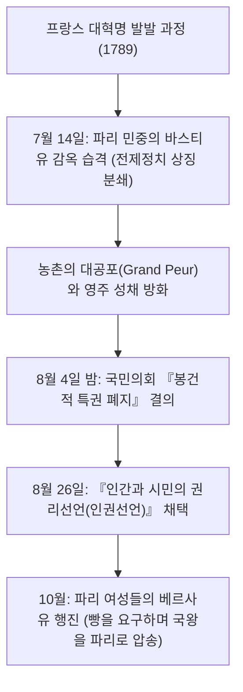
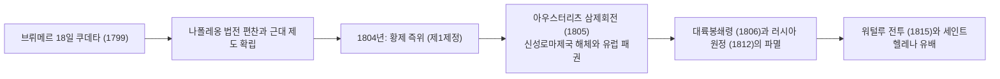
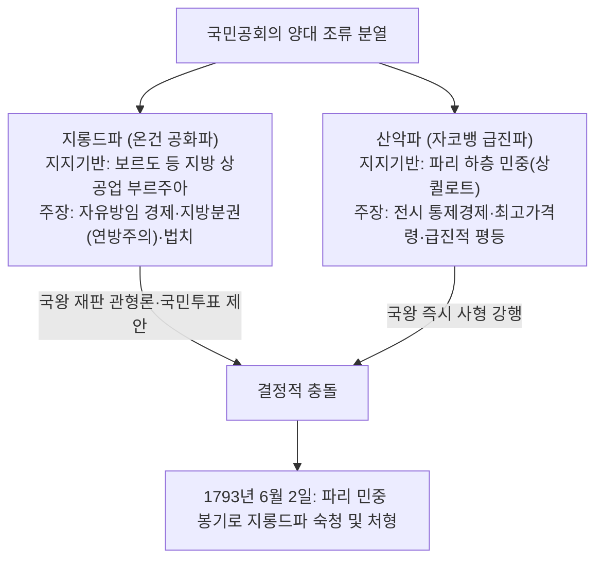

## 1. 서론: 유럽의 심장으로서의 프랑스 문명

### 1.1 갈리아인과 카이사르의 『갈리아 전기』

유럽 대륙의 서쪽 끝, 대서양과 지중해, 라인강, 피레네산맥, 알프스산맥으로 둘러싸인 비옥한 거대 육각형 영토(L'Hexagone, 렉사곤). 이 땅이 "프랑스"로 불리기 이전, 이곳은 수많은 켈트계 부족들이 할거하던 "갈리아(Gallia)"의 땅이었다.

기원전 58년부터 기원전 51년에 걸쳐 로마의 최고사령관 가이우스 율리우스 카이사르는 냉철하고 탁월한 군사적 천재성을 발휘하여 갈리아 전역 정복에 착수했다. 카이사르가 직접 저술한 불후의 고전 『갈리아 전기(Commentarii de Bello Gallico)』는 당시 갈리아인들의 용맹함과 부족 사회의 역학을 생생하게 기록하고 있다.

기원전 52년, 아르베르니족의 젊은 영도자 베르킨게토릭스(Vercingetorix)의 지휘 아래 모든 갈리아 부족이 결속하여 반로마 대봉기를 일으켰다. 그러나 카이사르가 사상 유례없는 이중 포위망(내부 공성벽과 외부 구원군 차단벽)을 구축한 "알레시아 전투(Battle of Alesia)"에서 갈리아군은 굶주림과 맹렬한 공세 끝에 궤멸당했다. 말을 타고 카이사르의 막사 앞으로 나아간 베르킨게토릭스는 자신의 무구를 벗어 던지고 투항했다.

로마의 지배에 들어간 갈리아는 로마 가도, 수도교(퐁 뒤 가르), 원형경기장(아를, 님)이 건설되면서 급속도로 라틴화(갈로-로마 문화)되었다. 켈트어는 점차 소멸하고 민중 라틴어가 뿌리를 내리며 훗날 "프랑스어"의 모태가 되었다. 알레시아에서의 비극적 패배는 프랑스라는 국가가 라틴 고전 문명의 맏딸로 탄생하기 위한 고통스러운 통과의례였다.

---

### 1.2 클로비스의 개종과 프랑크 왕국, 샤를마뉴의 유산

5세기 서로마 제국이 붕괴하는 혼란 속에서 게르만계 살리카 프랑크족이 라인강을 건너 북부 갈리아로 진출했다. 481년 메로빙거 왕조의 시조 **클로비스 1세(Clovis I, 재위 481–511)**가 부족들을 통합하고 프랑크 왕국을 건국했다.

클로비스의 역사적 영단은 496년 랭스 대성당에서 가톨릭(아타나시오파 정통 기독교)으로 개종하고 세례를 받은 것이었다. 당시 대다수 게르만 민족(동고트족, 서고트족, 반달족)이 이단으로 규정된 아리우스파를 신봉했던 반면, 클로비스의 정통 가톨릭 수용은 갈로-로마 귀족층과 교회 조직의 열렬한 지지를 이끌어내며 서유럽 중세 질서의 정통 수호자라는 확고한 정당성을 획득했다.

8세기 이슬람 제국의 침략을 투르-푸아티에 전투(732년)에서 격퇴한 궁재 카를 마르텔을 거쳐, 그의 아들 피핀 3세가 교황의 승인을 얻어 카롤링거 왕조를 열었다. 그리고 피핀의 아들 **샤를마뉴(카를 대제: Charlemagne, 재위 768–814)**의 치세 하에서 서유럽의 거의 전역(현재의 프랑스, 독일, 북이탈리아, 저지대 국가)이 하나의 기독교 제국으로 통합되었다.

서기 800년 크리스마스, 로마 성 베드로 대성당에서 교황 레오 3세는 샤를마뉴에게 제관을 씌우며 "서로마 황제" 부활을 선언했다. 카롤링거 르네상스를 통한 라틴 고전 복원과 수도원 학문 진흥은 암흑의 중세에 지성의 등불을 밝혔다.

그러나 샤를마뉴 사후, 게르만 분할상속 전통으로 인해 제국은 분열되었다.
- **843년 베르됭 조약**: 제국이 서프랑크, 중프랑크, 동프랑크의 3개국으로 분할.
- **870년 메르센 조약**: 중프랑크 영토를 동서 양국이 분할 흡수.
이 중 서프랑크 왕국(Francia Occidentalis)이 훗날 "프랑스 왕국(France)"의 직접적인 모태가 되었다.

---

## 2. 카페 왕조의 성립과 영토 통합의 궤적

### 2.1 위그 카페의 즉위(987년)와 미약한 출발

987년 카롤링거 직계 혈통이 단절되자 대제후들의 선거를 통해 파리 백작 **위그 카페(Hugues Capet)**가 국왕으로 선출되면서 **"카페 왕조(Capetian Dynasty)"**가 개창되었다.

초기 카페 왕조의 권력은 극도로 미약했다. 국왕의 직할령(도멘 루아얄)은 파리와 오를레앙 주변의 "일드프랑스(Île-de-France)"라 불리는 좁은 회랑에 불과했다. 노르망디 공작, 아키텐 공작, 플랑드르 백작, 부르고뉴 공작 등 대제후들은 왕권을 압도하는 광대한 영지와 군사력을 과시하며 국왕을 단순한 "동등한 자들 중의 수석(Primus inter pares)"으로 여겼다.

그러나 카페 왕조에는 두 가지 결정적인 제도적 강점이 있었다.
1. **성유 도유에 의한 대관 성례(Sacre)**: 랭스 대성당에서 성유 도유를 받고 왕관을 씀으로써 신으로부터 직접 통치권을 부여받은 "성스러운 왕"으로서의 영적 권위(국왕의 손길로 연주창을 치료한다는 기적 신앙: 로와 투마튀르주)를 확립했다.
2. **장자상속의 기적적인 연속성**: 987년부터 1328년에 이르는 340여 년 동안 단 한 번도 직계 남계 후계자가 끊어지지 않아 세습 왕권을 확고부동하게 굳힐 수 있었다.

---

### 2.2 필리프 2세(존엄왕)와 왕실 영토의 비약적 확장

카페 왕조의 직할령을 수배로 확장하고 진정한 "프랑스 국왕(Rex Franciae)"의 위상을 확립한 인물은 제7대 국왕 **필리프 2세(Philippe Auguste, 재위 1180–1223: 존엄왕 오귀스트)**였다.

당시 잉글랜드의 플랜태저넷 왕조(헨리 2세, 리처드 1세, 실지왕 존)는 앙주, 노르망디, 아키텐을 지배하며 프랑스 내에 프랑스 국왕 직할령의 수배에 달하는 "앙주 제국"을 구축하고 있었다.

필리프 2세는 실지왕 존의 실정과 봉건법 위반을 빌미로 1204년 노르망디, 앙주, 멘, 투렌을 전격 몰수·병합했다.
1214년 7월 27일, 운명적인 **"부빈 전투(Battle of Bouvines)"**에서 필리프 2세가 이끄는 프랑스 왕군은 존 왕과 결탁한 신성로마제국 황제 오토 4세 및 플랑드르 백작 연합군과 격돌했다. 필리프 2세는 대승을 거두어 잉글랜드 세력을 프랑스 북부에서 완전히 축출하고 유럽 대륙에서 프랑스 왕권의 군사적 위신을 정점에 올려놓았다.

나아가 필리프 2세는 신흥 시민계급에서 유급 관료인 바이이(Bailli)와 세네샬(Sénéchal)을 등용해 지방에 파견함으로써 국왕 직속 사법·조세 체계를 구축했다. 파리를 항구적 수도로 확정하고 루브르 요새를 축조했으며, 도로를 포장하고 견고한 성벽을 둘렀다.

---

### 2.3 필리프 4세와 교황권의 굴복 (아나니 사건과 아비뇽 유수)

13세기 말, 냉철한 현실주의 군주 **필리프 4세(Philippe IV le Bel, 재위 1285–1314: 미남왕)**는 중앙집권 관료제를 더욱 가속화했다.

전쟁 비용을 마련하기 위해 성직자 과세를 단행한 필리프 4세는 "교황의 권위는 지상의 모든 세속 군주보다 우월하다"고 선언한 교황 보니파시오 8세와 정면 충돌했다.
- **1302년 삼부회(États généraux) 최초 소집**: 필리프 4세는 파리 노트르담 대성당에 성직자(제1신분), 귀족(제2신분), 도시 평민(제3신분) 대표를 소집하여 교황에 맞서기 위한 거국적 지지를 확보했다.
- **1303년 아나니 사건**: 측근 기욤 드 노가레를 이탈리아로 파견하여 아나니 별장에 머물던 교황 보니파시오 8세를 급습·감금했다(교황은 치욕을 견디지 못하고 얼마 지나지 않아 분사했다).
- **1309–1377년 교황의 아비뇽 유수**: 프랑스인 교황 클레멘스 5세를 옹립하고 교황청을 남프랑스 아비뇽으로 강제 이전시켜 약 70년간 교황을 프랑스 왕권의 감시 아래 두었다.
- 또한 막대한 부를 자랑하던 템플 기사단을 이단으로 몰아 해체하고 전 재산을 국고로 환수했다.

중세를 지배하던 보편적 교황권의 시대는 종언을 고하고, 프랑스는 유럽 최초의 근대적 "주권국가(Sovereign State)" 골격을 드러내기 시작했다.

---

### 2.4 백년전쟁과 잔 다르크의 기적

카페 직계가 단절된 후 발루아 왕조의 필리프 6세가 즉위하자, 모계를 통해 카페 가문의 혈통을 이어받은 잉글랜드 국왕 에드워드 3세가 프랑스 왕위 계승권을 주장하며 1337년 백년전쟁이 발발했다.

크레시 전투(1346년), 푸아티에 전투(1356년, 국왕 장 2세 포로), 아쟁쿠르 전투(1415년)에서 프랑스 기사단은 잉글랜드 장궁병의 화망 앞에 궤멸적인 참패를 거듭했다. 부르고뉴 공국이 잉글랜드와 결탁하고, 1420년 트루아 조약에 의해 잉글랜드 국왕 헨리 5세가 프랑스 왕위 계승자로 인정받자, 정통 왕세자(도팽) 샤를 7세는 루아르강 이남의 부르주로 쫓겨나 프랑스는 패망 직전에 몰렸다.

1429년 봄, 북동부 동레미 마을의 16세 양치기 소녀 **잔 다르크(Jeanne d'Arc)**가 시농성의 샤를 7세를 찾아왔다. "오를레앙의 포위를 풀고 왕세자를 랭스에서 대관시키라"는 대천사 미카엘의 계시를 전한 그녀는 순백의 갑주를 입고 포위된 전략 요충지 오를레앙으로 출진했다.

잔 다르크의 굳건한 신념은 프랑스군의 사기를 폭발적으로 고무시켰고, 단 9일 만에 오를레앙의 포위를 분쇄했다. 적진을 뚫고 랭스 대성당에서 샤를 7세의 대관식을 거행시켰다. 이후 콩피에뉴에서 사로잡혀 루앙에서 마녀재판을 받고 1431년 19세의 나이로 화형에 처해졌으나, 그녀가 지핀 애국심의 불꽃은 꺼지지 않았다.

샤를 7세는 재정 체계를 정비하고 귀족 사병에 의존하지 않는 **유럽 최초의 상비군(칙령대: Compagnies d'ordonnance)**과 강력한 포병대를 창설했다. 1453년 카스티용 전투에서 대포를 앞세워 잉글랜드군을 격파함으로써, 백년전쟁은 칼레를 제외한 전 영토를 수복한 프랑스의 완전한 승리로 끝났다.

---

## 3. 위그노 전쟁에서 부르봉 절대왕정의 절정까지

### 3.1 종교개혁의 충격과 위그노 전쟁(1562–1598)

16세기 중엽, 프랑스 출신 장 칼뱅이 창시한 프로테스탄트 개혁주의 교리는 상공업자와 일부 귀족층 사이에 급속히 확산되었고, 이들은 **"위그노(Huguenots)"**라 불렸다.

왕권이 쇠약해진 틈을 타 가톨릭 강경파 기즈 공작 가문과 위그노 영수인 부르봉 가문(나바라 왕가) 및 콜리니 제독 사이에 30여 년에 걸친 참혹한 내전인 위그노 전쟁이 발발했다.
- **1572년 8월 24일 성 바르톨로메오 축일 학살(St. Bartholomew's Day Massacre)**: 모후 카트린 드 메디시스의 사주로 파리에 모여 있던 위그노 지도부와 신도 수천 명이 한밤중에 기습 학살되었고, 유혈극은 전국으로 확산되어 수만 명이 목숨을 잃었다.

이 광기 어린 종교 내전을 수습한 영웅이 바로 위그노 영수이자 발루아 왕조 단절 후 부르봉 왕조를 창건한 **앙리 4세(Henri IV, 재위 1589–1610)**였다.
"파리는 미사를 드릴 가치가 있다"며 대다수 국민의 화합을 위해 가톨릭으로 개종한 그는 **1598년 역사적인 「낭트 칙령(Edict of Nantes)」을 반포**했다. 가톨릭을 국교로 유지하면서도 위그노에게 신앙의 자유, 시민권, 군사 안전 보장 거점(라로셸 등)을 허용했다. 국가 통합을 위해 개인의 내면적 신앙의 자유를 공인한 이 칙령은 근대 종교적 관용의 위대한 선구적 이정표가 되었다.

---

### 3.2 리슐리외의 "국가이성(레종 데타)"과 절대왕정의 초석

앙리 4세가 광신적 가톨릭교도에게 암살된 후, 어린 루이 13세를 보좌하여 재상이 된 인물은 차가운 지성을 지닌 추기경 **리슐리외(Armand Jean du Plessis, Cardinal de Richelieu)**였다.

리슐리외 정치철학의 핵심은 **"국가이성(Raison d'État)"**—국가의 통일, 국익, 주권의 수호는 개인의 도덕이나 종교적 감정, 귀족의 특권을 초월한다는 절대적 원리였다.
- 대내적으로는 위그노의 군사적 자립 요새였던 라로셸을 포위 함락시켜 군사적 특권을 박탈(신앙의 자유만 보장)했다. 반역을 꾀하는 귀족들의 성채를 파괴하고 국왕 직속 지방감찰관(앵탕당: Intendant)을 파견하여 지방 행정을 중앙에 철저히 예속시켰다.
- 대외적으로는 자신이 가톨릭 추기경임에도 불구하고 독일 30년 전쟁(1618–1648)에서 신교도 제후 및 스웨덴과 동맹을 맺고 숙적 합스부르크 가문(오스트리아·스페인)을 협공하여 궤멸시켰다.

후계자 마자랭 추기경이 주도한 1648년 **베스트팔렌 조약**을 통해 프랑스는 알자스 대부분을 획득하며 유럽 최강대국으로 자리매김했다.

---

### 3.3 태양왕 루이 14세(재위 1643–1715): "짐이 곧 국가다"

1661년 마자랭이 사망하자 22세의 **루이 14세(Louis XIV)**는 친정을 선언했다. 보쉬에 주교가 체계화한 "왕권신수설"을 바탕으로 지상의 어떤 권력에도 구속받지 않는 절대군주제의 극점에 군림했다.

#### ① 권력의 장치로서의 베르사유 궁전
파리 남서쪽에 건설된 바로크 건축의 극치 베르사유 궁전. 거울의 방, 기하학적 프랑스식 정원, 황금빛 장식으로 가득한 이 궁전은 단순한 거처가 아니었다.
유년기 프롱드의 난(1648–1653)으로 왕권을 위협했던 반항적인 대귀족들을 궁정에 집단 거주시키고, 왕의 기상과 취침 의식에서 누가 셔츠를 입혀줄 것인가와 같은 사소한 명예 경쟁에 몰두하게 만듦으로써 귀족들의 정치적 야심을 완전히 거세했다.

#### ② 콜베르의 중상주의와 상비군
재무총감 장바티스트 콜베르는 국부를 증대하기 위해 고블랭 직포, 거울, 도자기 등 왕립 매뉴팩처를 육성하고 보호무역 정책을 강력히 추진했다. 육군대신 루부아는 군대를 40만 명 규모로 증강했고, 천재적 군사공학자 보방 원수는 국경선 전역에 기하학적 별 모양의 요새망(철의 장벽)을 구축했다.

#### ③ 영광의 대가: 낭트 칙령 폐지와 재정 위기
그러나 영광의 정점은 오래가지 못했다.
루이 14세는 끊임없는 침략 전쟁(상속전쟁, 네덜란드 전쟁, 팔츠 계승전쟁, 스페인 왕위계승전쟁)에 막대한 국부를 탕진하여 국가 재정을 파탄 직전으로 몰아넣었다.
결정적 실책은 1685년의 **「퐁텐블로 칙령(낭트 칙령 폐지)」**이었다. "프랑스에 더 이상 위그노는 없다"며 개신교 신앙을 전면 금지하자, 20만~30만 명에 달하는 가장 근면하고 유능한 상공업자, 기술자, 금융업자들이 네덜란드, 영국, 프로이센으로 망명했다. 프랑스 경제는 회복 불능의 타격을 입었고 왕정의 몰락이 시작되었다.

---

## 4. 계몽사상과 프랑스 대혁명(1789–1799)의 격동

### 4.1 앙시앵 레짐의 모순과 계몽주의의 폭발

18세기 프랑스 사회는 중세 이래의 신분제 계급 구조인 **"앙시앵 레짐(Ancien Régime: 구체제)"**의 극심한 모순 속에서 신음하고 있었다.

- **제1신분(성직자, 약 10만 명)**: 전국 토지의 10%를 소유하며 완전 면세 특권을 향유.
- **제2신분(귀족, 약 40만 명)**: 전국 토지의 20~25%를 소유하고 면세 특권과 고위 관직, 군 사령관직을 독점.
- **제3신분(평민, 약 2,500만 명·인구의 98%)**: 무거운 세금(타이유세, 인두세, 소금세, 십일조, 영주 부역)을 전담하면서도 정치적 권리는 완전히 박탈당함.

이러한 부조리를 날카롭게 고발한 것이 18세기 **"계몽사상(Enlightenment)"**이었다.
- **볼테르**: 가톨릭교회의 광신과 불관용을 통렬한 풍자로 비판하고 표현과 이성의 자유를 옹호(칼라스 사건 재심 투쟁).
- **몽테스키외**: 『법의 정신』에서 3권 분립을 주창하여 전제정치를 해체할 이론적 틀을 제시.
- **장 자크 루소**: 『사회계약론』에서 주권재민을 선언하고 개인의 자유의지 총합인 "일반의지(Volonté générale)"에 기반한 민주공화정을 주장.
- **디드로와 달랑베르**: 『백과전서』를 편찬하여 과학과 이성의 지식을 집대성해 미신과 편견을 타파.

---

### 4.2 바스티유 감옥 습격과 인권선언(1789년)

루이 15세의 낭비와 7년 전쟁 패배, 그리고 루이 16세의 미국 독립전쟁에 대한 천문학적 군사비 지원으로 왕실 재정은 파산했다. 특권층이 네케르 등 재무장관의 개혁안을 거부하자, 루이 16세는 1789년 5월 베르사유에서 175년 만에 삼부회를 소집했다.

표결 방식(신분별 1표인가, 1인 1표인가)을 둘러싸고 대립이 격화되자, 제3신분 대표들은 스스로를 국민의 유일한 정당한 대표기구인 **"국민의회(Assemblée nationale)"**로 선포했다. 회의장이 폐쇄되자 실내 테니스 코트에 모여 "헌법을 제정할 때까지 결코 해산하지 않는다"는 **"테니스 코트의 서약"**을 맺었다.

국왕이 군대를 파리 주변에 집결시키고 개혁파 네케르를 파면하자 파리 시민들의 분노는 폭발했다.

1789년 8월 26일 라파예트가 기안하여 채택된 **「인권선언(Declaration of the Rights of Man and of the Citizen)」**은 인류 보편의 불멸의 원칙을 천명했다.
1. **"인간은 자유롭고 평등한 권리를 가지고 태어났다."** (제1조)
2. **"모든 주권의 원천은 본질적으로 국민에게 있다."** (제3조: 국민주권)
3. 자유, 재산, 안전, 압제에 대한 저항권(양도할 수 없는 천부인권).
4. 법 앞의 평등, 죄형법정주의, 무죄추정, 사상과 신앙의 자유, 소유권의 신성불가침.

---

### 4.3 왕정 폐지와 단두대의 공포정치

그러나 혁명은 급진화의 소용돌이로 치달았다.
1791년 6월 루이 16세와 왕비 마리 앙투아네트가 오스트리아로 탈출하려다 국경 인근에서 발각된 **"바렌 도주 사건"**으로 국왕에 대한 국민적 신뢰는 완전히 증발했다.
오스트리아와 프로이센이 필니츠 선언으로 개입을 위협하자, 프랑스는 1792년 4월 대외전쟁에 돌입했다. 각지에서 상경한 의용군이 부른 행진곡 "라 마르세예즈"는 훗날 국가가 되었다.

- **1792년 8월 10일 봉기**: 파리의 상퀼로트(하층 민중)와 의용군이 튈르리 궁전을 습격하여 왕권을 정지시켰다. 국민공회가 소집되어 왕정 폐지와 **"제1공화국"**이 선포되었다.
- **1793년 1월 21일**: 루이 16세가 "국민에 대한 반역죄"로 혁명광장(현 콩코르드 광장) 단두대(기요틴)에서 처형되었다(10월에는 마리 앙투아네트도 처형).

제1차 대프랑스 동맹군이 국경을 침공하고 방데 지방에서 대규모 반혁명 농민 반란이 일어나는 내우외환 속에서 권력을 장악한 것은 막시밀리앵 로베스피에르의 급진 자코뱅파였다.

로베스피에르는 **"덕성 없는 공포는 파멸적이며, 공포 없는 덕성은 무력하다"**며 반대파를 닥치는 대로 처형하는 **"공포정치(La Terreur)"**를 자행했다. 왕비, 지롱드파 지도자, 관용을 호소한 당통에 이르기까지 약 4만 명이 처형되었다.
최고가격령, 총동원 징집제, 혁명력 도입 등 극단적 전시 독재를 펼쳤으나, 독재에 질린 의원들에 의해 1794년 7월 27일 **"테르미도르 9일의 쿠데타"**가 일어나 로베스피에르 자신이 단두대에서 처형되며 공포정치는 막을 내렸다.

---

## 5. 나폴레옹 보나파르트의 대두와 제1제정

### 5.1 질서의 회복자: 브뤼메르 쿠데타에서 황제 대관까지

테르미도르 이후의 총재정부가 무능과 부패, 좌우 폭동으로 흔들리자 국민들은 "질서의 회복"과 "혁명 성과의 공고화"를 갈망했다. 이러한 기대를 한 몸에 받으며 등장한 인물이 코르시카섬 출신의 젊은 포병 장교 **나폴레옹 보나파르트(Napoléon Bonaparte, 1769–1821)**였다.

툴롱 포위전에서 두각을 나타내고 이탈리아 원정(1796–1797)에서 오스트리아군을 연파하여 영웅으로 떠오른 나폴레옹은 1799년 11월 9일 **"브뤼메르 18일 쿠데타"**를 일으켜 총재정부를 전복하고 제1통령에 취임했다.

나폴레옹의 진정한 위대함은 군사적 승리를 넘어 **"혁명의 기본정신을 근대 국가의 영구적인 법과 제도로 정착시켰다"**는 점에 있다.
1. **프랑스 민법전(나폴레옹 법전, 1804년)**: "법 앞의 평등", "종교의 자유", "계약의 자유", "사유재산권의 절대불가침", "세속적 가족 질서"를 명문화했다. 대륙법 체계의 최고봉이자 전 세계 근대 법전의 모범이 되었다.
2. **근대 제도 확립**: 프랑스은행 설립과 프랑화 안정, 중앙집권적 교육제도(리세, 바칼로레아 학위제), 레지옹 도뇌르 훈장 제정.
3. **1801년 정교협약(콘코르다트)**: 교황 비오 7세와 화해하여 가톨릭을 "다수 국민의 종교"로 인정하되 몰수된 교회 재산 반환을 거부하고 교회를 국가의 관리 아래 두었다.

1804년 12월 2일 파리 노트르담 대성당에서 나폴레옹은 교황의 손에서 관을 받아 스스로 머리에 얹고 **"프랑스인의 황제 나폴레옹 1세"**로 즉위했다(제1제정).

---

### 5.2 대륙 제패의 영광과 러시아 원정의 파멸

나폴레옹의 대육군(Grande Armée)은 국민징집제에 기초한 압도적 기동력과 집중 타격 전술로 유럽 전역을 석권했다.
- **1805년 아우스터리츠 전투(삼제회전)**: 러시아 황제 알렉산드르 1세와 신성로마제국 황제 프란츠 2세의 연합군을 완파하고 1,000년 역사의 신성로마제국을 해체시켰다(라인 동맹 결성).
- **1806년 예나-아우어슈테트 전투**: 프로이센을 격파하고 베를린에 입성.

그러나 제해권을 장악한 영국만은 굴복시키지 못했다. 1805년 트라팔가르 해전에서 넬슨 제독에게 패배한 나폴레옹은 1806년 **「대륙봉쇄령(베를린 칙령)」**을 내려 유럽 대륙과 영국의 모든 통상을 금지했다.

이 봉쇄령을 어기고 영국과 밀무역을 재개한 러시아 제국을 응징하기 위해 1812년 나폴레옹은 60만 대군을 이끌고 러시아 원정을 감행했다.
그러나 쿠투조프 장군이 이끄는 러시아군의 철저한 청야전술과 모스크바 대화재, 영하 30도를 밑도는 혹한의 동장군이 군대를 덮쳤다. 퇴각로에서 기아와 동사로 군대는 전멸했고 살아 돌아온 병사는 수만 명에 불과했다.

해방자로 환영받던 나폴레옹은 각국의 민족의식을 일깨웠고 이제 침략자로서 포위되었다. 1813년 라이프치히 제국민 전투에서 패배하여 엘바섬으로 유배되었다. 1815년 탈출하여 "백일천하"를 꾀했으나 **워털루 전투**에서 웰링턴 공작의 영국·프로이센 연합군에 최종 패배했다. 남대서양의 절해고도 세인트헬레나섬으로 유배되어 1821년 파란만장한 생을 마감했다.

---

## 6. 19세기 혁명의 연쇄: 왕정복고에서 파리 코뮌까지

나폴레옹 몰락 후 빈 회의의 정통주의에 의해 루이 18세가 복위하며 부르봉 왕정이 부활했다(복고왕정). 그러나 이미 자유와 평등을 맛본 프랑스 국민은 전제군주제의 멍에로 돌아갈 수 없었다. 19세기 프랑스는 왕정, 제정, 공화정이 격렬하게 교체되는 "정치 체제의 거대한 실험장"이었다.

### 6.1 7월 혁명(1830년)과 2월 혁명(1848년)

- **1830년 7월 혁명(영광의 3일)**: 반동 전제정치를 획책한 샤를 10세에 맞서 파리 시민들이 바리케이드를 치고 무장봉기했다(들라크루아의 명화 『민중을 이끄는 자유의 여신』의 배경). 샤를 10세는 망명했고 자유주의 귀족 오를레앙 공 루이 필리프가 "프랑스 국민의 왕"으로 추대되었다(7월 왕정 / 금융 부르주아지의 지배).
- **1848년 2월 혁명**: 산업혁명 진전과 함께 급증한 노동자 계급이 보통선거권을 요구하며 봉기했다. 루이 필리프가 퇴위하고 **"제2공화국"**이 수립되었다. 사회주의자 루이 블랑이 입각하여 실업자 구제를 위한 "국립작업장"이 설치되었으나, 보수파가 이를 폐쇄하자 6월 봉기가 일어나 유혈 진압되었다.

---

### 6.2 나폴레옹 3세의 제2제정과 파리 대개조

혼란 속에서 1848년 대통령 선거에서 압도적 승리를 거둔 인물은 나폴레옹의 조카 **루이 나폴레옹**이었다.
1851년 쿠데타로 의회를 해산하고 이듬해 황제 **나폴레옹 3세**로 즉위했다(제2제정: 1852–1870).

나폴레옹 3세는 센현 지사 오스만 남작에게 명하여 역사적인 **"파리 대개조"**를 단행했다.
- 중세 이래의 불결하고 바리케이드가 구축되기 쉬운 미로 같은 좁은 골목들을 철거.
- 개선문을 중심으로 방사형으로 뻗어 나가는 거대한 대로(블루바르)를 뚫고 근대적 상하수도망, 가스 가등, 공원(불로뉴 숲)을 정비.
- 오늘날 전 세계인을 매료시키는 아름다운 "빛의 도시 파리"의 도시 경관은 바로 이 제2제정기에 완성되었다.

그러나 대외전쟁(크림전쟁 승리, 이탈리아 통일 지원, 멕시코 원정 실패)을 거듭한 끝에 1870년 비스마르크의 프로이센과 **보불전쟁(프로이센-프랑스 전쟁)**에 돌입했다. 스당 전투에서 나폴레옹 3세 자신이 포로로 잡히는 굴욕적인 참패를 당하며 제2제정은 하루아침에 붕괴했다.

---

### 6.3 1871년: 파리 코뮌의 비장한 비극

프로이센군의 파리 포위와 항복 조약, 티에르 임시정부의 굴욕적 강화에 반발하여 파리의 노동자와 국민방위대는 무장해제를 거부하고 봉기했다.
1871년 3월 28일 시청 광장에서 선포된 정부가 바로 **인류 역사상 최초의 노동자 계급에 의한 자치정부 "파리 코뮌(Commune de Paris)"**이다.

- 여성 참정권, 정교분리, 아동노동 금지, 버려진 공장의 노동자 자주관리, 상비군 폐지 등 놀랍도록 진보적인 사회민주주의 정책을 펼쳤다.
- 그러나 베르사유로 후퇴했던 임시정부군은 프로이센의 지원을 받아 파리로 총공세를 개시했다(5월 21일~28일: **피의 일주일**).
- 처절한 시가전 끝에 약 2만 명의 코뮌 전사가 학살·총살되었고(페르 라셰즈 묘지의 "연맹병의 벽"), 수만 명이 유형지로 유배되었다.

---

## 7. 제3공화국에서 양차 대전, 그리고 드골과 제5공화국

### 7.1 벨 에포크와 라이시테(정교분리)의 확립

파리 코뮌의 유혈 탄압 속에서 타협으로 탄생한 **"제3공화국(1870–1940)"**은 가장 취약해 보였으나 70년간 지속되었다.
19세기 말부터 1914년에 걸쳐 산업 발전과 평화를 구가한 이 시기는 **"벨 에포크(Belle Époque: 아름다운 시절)"**로 불린다. 1889년 파리 만국박람회를 위해 에펠탑이 세워졌고, 인상파 미술이 만개했으며, 뤼미에르 형제가 영화를 발명했다.

이 시기를 뒤흔든 최대의 사상적 위기가 바로 **"드레퓌스 사건(1894년)"**이었다. 유대계 육군 대위 알프레드 드레퓌스가 독일 간첩 누명을 쓰고 유죄 판결을 받자, 대문호 에밀 졸라는 신문 『로로르』 1면에 **"나는 고발한다!(J'accuse…!)"**라는 공개서한을 발표했다. 군의 위신을 중시하는 보수파와 진실·인권을 옹호하는 공화파로 국론이 두 동강 났다.

결국 드레퓌스의 무죄를 입증해낸 공화파는 1905년 **「정교분리법(라이시테법: Loi de 1905)」**을 제정했다. 공공 영역에서 종교의 개입을 철저히 배제하고 신앙을 개인의 사적 영역으로 한정하는 **"라이시테(Laïcité)"** 원칙은 현대 프랑스 공화국 정신의 절대적 근간이 되었다.

---

### 7.2 두 차례의 세계대전과 샤를 드골의 레지스탕스

- **제1차 세계대전(1914–1918)**: 독일군의 침략을 마른 전투에서 결사 저지했다. 베르됭 전투(사상자 70만 명) 등 처절한 참호전 끝에 승리했으나 북부 산업지대가 폐허가 되고 140만 명의 젊은이가 희생되었다.
- **제2차 세계대전의 패배와 비시 괴뢰정권(1940)**: 나치 독일 기갑사단의 전격전 앞에 난공불락을 자랑하던 "마지노선"은 우회당했고 개전 6주 만에 프랑스는 항복했다. 제1차 대전의 영웅 페탱 원수는 남부 비시에 대독 협력(콜라보라시옹) 괴뢰정부를 세웠다.

1940년 6월 18일, 홀로 런던으로 탈출한 국방차관 **샤를 드골(Charles de Gaulle)** 장군은 BBC 라디오 방송을 통해 전 세계 프랑스 국민을 향해 역사적 연설을 토해냈다.
> **"프랑스는 전투에서 졌다. 그러나 프랑스는 전쟁에서 진 것이 아니다!……프랑스 레지스탕스의 불꽃은 결코 꺼져서는 안 되며, 꺼지지도 않을 것이다!"**

런던에서 "자유 프랑스"를 조직한 드골은 장 물랭 등을 통해 국내 지하 저항운동(레지스탕스)을 하나로 규합했다. 1944년 노르망디 상륙작전 이후 파리를 자력으로 해방시켰고, 프랑스는 전승 5대 강국(UN 안보리 상임이사국)의 지위를 기적적으로 탈환했다.

---

### 7.3 제5공화국의 창설과 독자적 자주외교 철학

전후 제4공화국이 군소정당 난립으로 무기력해지고 알제리 독립전쟁(1954–1962)으로 국가가 내전 위기에 직면한 1958년, 국민은 다시 드골을 불러냈다.

드골은 헌법을 개정하여 직접선거로 선출되는 강력한 대통령제를 골자로 하는 **"제5공화국(Cinquième République)"**을 출범시켰다.
- **알제리 독립 승인(1962년 에비앙 협정)**: 식민 제국주의 유산 청산.
- **독자적 핵 억지력(포스 드 프랍: Force de frappe) 구축**: 미국의 핵우산에 절대적으로 의존하는 것을 거부.
- **드골주의(Gaullism) 외교**: 1966년 NATO 군사기구 탈퇴, 1964년 서방 최초 대중국 수교, 미국의 베트남 전쟁 개입 비판 등 국가 주권의 완전한 독립과 다극주의 외교를 관철했다.

1968년 **"5월 혁명(May 68)"**에서는 파리 대학생들의 봉기와 1,000만 노동자 총파업이 일어나 전통적 권위주의가 무너지고 현대적 개인주의, 페미니즘, 생태주의가 만개하는 문화적 대전환을 맞이했다.

---

## 4.5 혁명의 심연: 지롱드파 vs 산악파의 격돌과 『여성의 권리 선언』

프랑스 대혁명 국민공회(1792–1795)에서 전개된 치열한 정쟁은 단순한 권력 다툼을 넘어선 국가철학의 근원적 충돌이었다.

### ① 올랭프 드 구주와 『여성과 여성 시민의 권리 선언』
1789년 인권선언은 인류 보편의 이름 아래 선포되었으나 실제로는 재산을 가진 남성 유산자에게만 권리를 제한한 "남권선언"에 불과했다.
극작가 **올랭프 드 구주(Olympe de Gouges, 1748–1793)**는 1791년 **『여성과 여성 시민의 권리 선언(Déclaration des droits de la femme et de la citoyenne)』**을 발표하며 혁명 남성들의 위선을 통렬히 고발했다.

> **"여성은 자유롭게 태어나며 권리에 있어 남성과 평등하다."**
> **"여성에게 단두대에 오를 권리가 있다면, 당연히 의정 연단에 오를 권리도 있어야 한다."**

그녀는 여성 참정권, 재산권, 교육 평등을 요구하고 결혼을 대등한 사회계약으로 재정의했다. 그러나 로베스피에르 등 자코뱅 지도부는 그녀를 "자신의 성별을 잊고 국가를 전복하려 했다"는 죄목으로 1793년 단두대로 보냈다. 그녀의 선구적 사상은 20세기 시몬 드 보부아르의 『제2의 성』으로 이어지는 현대 페미니즘의 위대한 원천이 되었다.

---

## 5.3 나폴레옹 군사 독트린의 혁신: 군단제와 작전술의 기하학

나폴레옹이 유럽 연합군을 상대로 파죽지세의 연승을 거둘 수 있었던 비밀은 군사 조직과 작전술(Operational Art)의 혁명적 재편에 있었다.

1. **제병협동 "군단제(Corps d'Armée)" 창설**:
   - 나폴레옹은 수십만 대군을 하나의 둔중한 덩어리로 기동시키는 대신 보병, 기병, 포병, 공병을 유기적으로 통합한 **"군단(2만~3만 명 규모)"**으로 분할했다.
   - 각 군단은 독자적으로 24~48시간 동안 우세한 적군을 저지(지연전)할 수 있는 완결된 전투력을 갖추었다.
   - **"분진합격(March divided, fight united)"**: 각 군단이 여러 갈래 도로를 통해 맹렬한 속도로 진격하다가(현지 징발로 신속화), 결전의 순간 적의 측면과 후방으로 번개같이 집결하여 수적 우위를 형성했다.
2. **내선작전(Central Position)과 병력 집중의 원칙**:
   - 두 방향에서 협공해 오는 적 동맹군(예: 오스트리아군과 러시아군) 사이로 신속히 파고들어 연결선을 차단.
   - 한쪽 군대를 소수 견제부대로 묶어두는 동안 주력을 집중하여 다른 한쪽을 각개격파하는 수학적 기동전을 펼쳤다.

---

## 7.4 탈식민지화의 극통: 디엔비엔푸와 알제리 전쟁(1954–1962)

제2차 세계대전 후 프랑스를 가장 깊이 찢어발긴 상처는 세계 2위 규모를 자랑하던 식민제국의 해체 과정이었다.

### ① 인도차이나 전쟁의 종언: 디엔비엔푸 전투(1954년)
베트남에서 호찌민의 베트민 게릴라전에 맞서 프랑스군은 산악 분지 디엔비엔푸에 요새 진지를 구축하고 결전을 시도했다.
그러나 보응우옌잡 장군이 이끄는 베트민군은 정글 능선에 인력만으로 수백 문의 중포를 끌고 올라가 요새를 내려다보는 포병 진지를 구축했다. 두 달간의 맹렬한 포격 끝에 프랑스 수비대는 전멸·항복했다. 이로써 프랑스는 동남아시아에서 완전히 철수했다.

### ② 알제리 전쟁과 제5공화국의 탄생
1830년 이래 단순한 식민지가 아니라 "프랑스 본토의 일부(현)"로 간주되며 100만 명 이상의 유럽계 정착민(피에누아르)이 살던 알제리에서 1954년 민족해방전선(FLN)이 무장봉기했다.
- 프랑스 공수부대는 알제 시내 테러 조직 소탕을 명분으로 조직적 고문과 초법적 처형을 자행(알제의 전투)했고, 사르트르 등 지식인 사회에 거대한 윤리적 충격을 던졌다.
- 알제리 독립에 결사반대하던 군부와 정착민들은 1958년 쿠데타를 일으켜 파리 진격을 위협했고, 제4공화국이 붕괴하며 드골이 정계에 복귀했다.
- 드골은 현실을 직시하고 극우 비밀군사조직(OAS)의 암살 위협을 뚫고 1962년 **에비앙 협정**을 체결하여 알제리의 독립을 전격 승인했다.

---

## 7.5 현대 프랑스 사상의 폭발과 문화국가의 창조 (사르트르·카뮈·말로)

2차 대전 이후 프랑스는 군사적 패권에서는 물러났으나 "세계 지성과 문화의 수도"로서 독보적 광채를 발했다.

### ① 실존주의의 두 거성: 사르트르 vs 카뮈의 역사적 결렬
생제르맹데프레의 카페(레되마고, 카페드플로르)를 무대로 장 폴 사르트르와 알베르 카뮈의 실존주의(Existentialism)가 세계를 휩쓸었다.
- **사르트르 『존재와 무』**: "실존은 본질에 앞선다." 인간은 정해진 본질 없이 자신의 자유로운 선택과 현실 참여(앙가주망)로 스스로를 창조해야 한다. 사르트르는 마르크스주의에 공명하며 혁명의 폭력을 일정 부분 옹호했다.
- **카뮈 『반항하는 인간』**: 알제리 출신 카뮈는 어떤 숭고한 이데올로기라 할지라도 구체적 인간의 생명을 수단으로 희생시키는 전체주의적 폭력을 단호히 거부했다.
- 두 지성의 결렬은 20세기 자유와 정의, 윤리와 폭력을 둘러싼 인류 사상사의 가장 뜨거운 논쟁이었다.

### ② 앙드레 말로와 "문화부" 창설(1959년)
드골 정부 초대 문화부 장관으로 취임한 작가 앙드레 말로(André Malraux)는 근대 국가 문화정책의 불멸의 전형을 세웠다.
- **"인류가 창조한 최고의 예술을 소수 특권층에서 해방시켜 가장 많은 국민에게 누리게 할 국가의 의무"**를 천명.
- 지방 도시에 복합문화시설인 "문화의 집(Maison de la Culture)"을 대거 건립.
- 파리 역사적 건축물의 그을음을 고압 세척하여 하얀 본래의 빛을 되찾게 하고(말로법을 통한 역사지구 보존제도 도입), 문화유산 보존을 국가 주권의 핵심 과제로 승격시켰다.

---

## 7.6 미테랑 정권의 사회개혁과 사형제 폐지(1981년)

1981년 프랑수아 미테랑(François Mitterrand)이 제5공화국 최초의 사회당 출신 대통령으로 당선되며 프랑스 현대 사회를 규정하는 역사적 사회민주주의 개혁이 단행되었다.

### ① 로베르 바당테르와 사형제 완전 폐지(1981년 9월)
프랑스는 혁명 이래 단두대 사형 전통을 유지해 온 서유럽 최후의 사형 집행국이었다(마지막 단두대 집행은 1977년).
법무장관 로베르 바당테르(Robert Badinter)는 여론의 다수가 사형 유지를 지지하는 역풍 속에서 의회에서 역사적인 명연설을 펼쳐 사형 폐지 법안을 통과시켰다.
> **"정의는 결코 살육이 될 수 없다. 국가가 국민의 목숨을 앗아갈 권리를 거부하는 것이야말로 인간 존엄성의 궁극적 증명이다."**

### ② 노동 및 복지 제도의 획기적 확충
- 법정 근로시간 단축(주 40시간에서 39시간으로 단축, 이후 조스팽 내각에서 주 35시간제로 발전).
- 연간 유급휴가 5주 확대, 최저임금(SMIC) 및 가족수당 대폭 인상.
- 지방분권화법(드페르법)을 제정하여 도지사의 권한을 축소하고 지방의회로 대폭 권한 이양.

### ③ 21세기 마크롱 정권과 "유럽 전략적 주권" 구상
2017년 39세의 역대 최연소로 당선된 에마뉘엘 마크롱(Emmanuel Macron)은 전통 좌우 양당 구도를 해체했다. 소르본 대학 연설에서 마크롱은 미중 패권경쟁과 러시아의 우크라이나 침공이라는 격변 속에서 유럽이 독자적 방위력과 산업·에너지를 확보하는 **"유럽 주권(Souveraineté européenne / 전략적 자율성)"**을 제창하며 드골주의 자주외교 전통을 21세기 다극화 세계에서 계승해 가고 있다.

---

## 8. 결론: 자유(Liberté), 평등(Égalité), 박애(Fraternité)의 영원한 등불

프랑스의 통사를 되짚어보는 자는 누구나 그 역사 속에 도도히 흐르는 **"보편성(Universalism)을 향한 끝없는 열망"**에 경탄하게 된다.

자국만의 특수주의에 머무르지 않고, "인간이란 무엇인가, 정의로운 사회란 어떠해야 하는가"라는 인류 전체의 근원적 질문을 철학과 문학, 예술, 그리고 혁명의 용광로 속에서 치열하게 탐구해 온 문명이 바로 프랑스였다.

프랑스 대혁명이 내건 **"자유(Liberté), 평등(Égalité), 박애(Fraternité)"**라는 삼색기의 이상은 오늘날 전 세계 모든 민주주의 헌법의 보편적 인권 규범으로 살아 숨 쉬고 있다.

라이시테(세속주의)를 둘러싼 갈등, EU 통합과 국가주권의 고뇌, 노란 조끼 운동과 같은 격렬한 사회적 저항 속에서도 이성의 힘으로 자정작용을 거치며 끊임없이 스스로를 갱신해 온 지성의 자부심. 그 위대한 궤적이야말로 프랑스 통사가 인류에게 남긴 최고의 유산이다.
