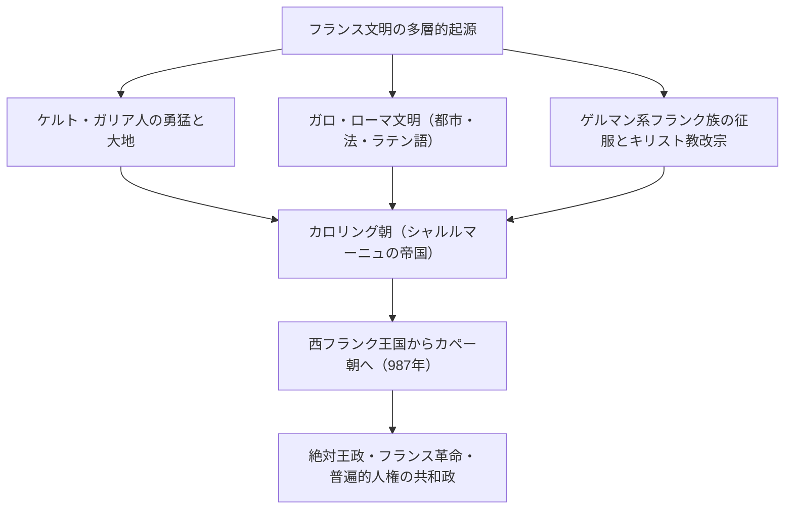
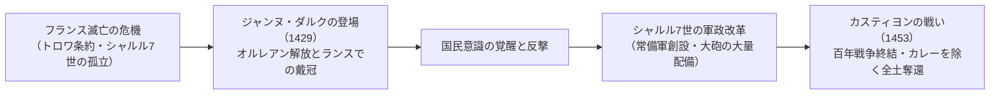
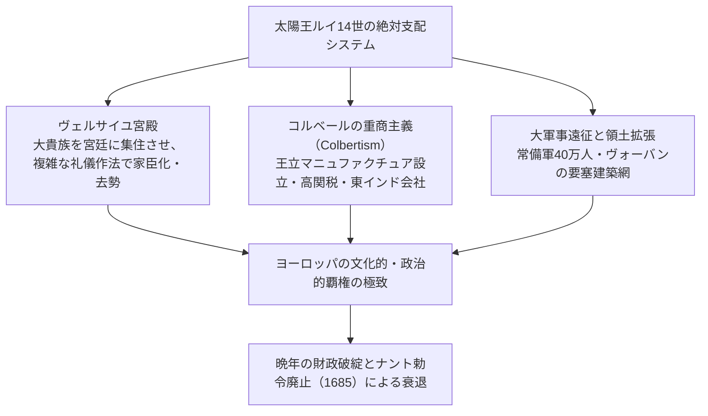
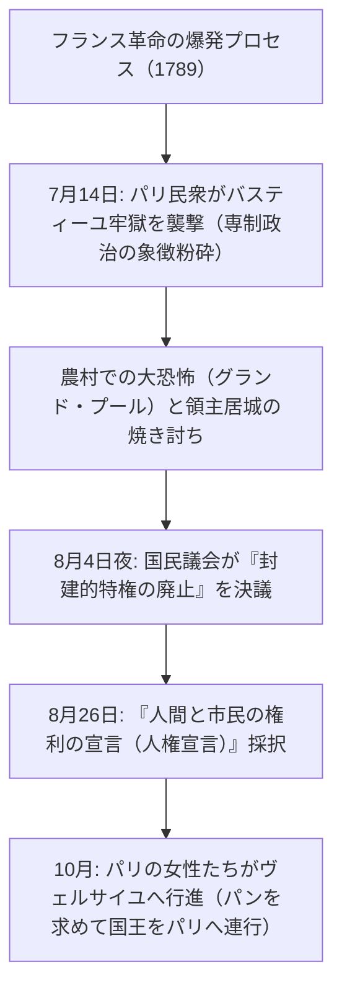
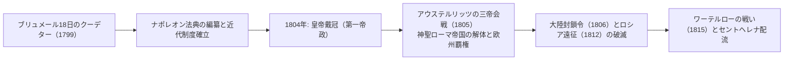
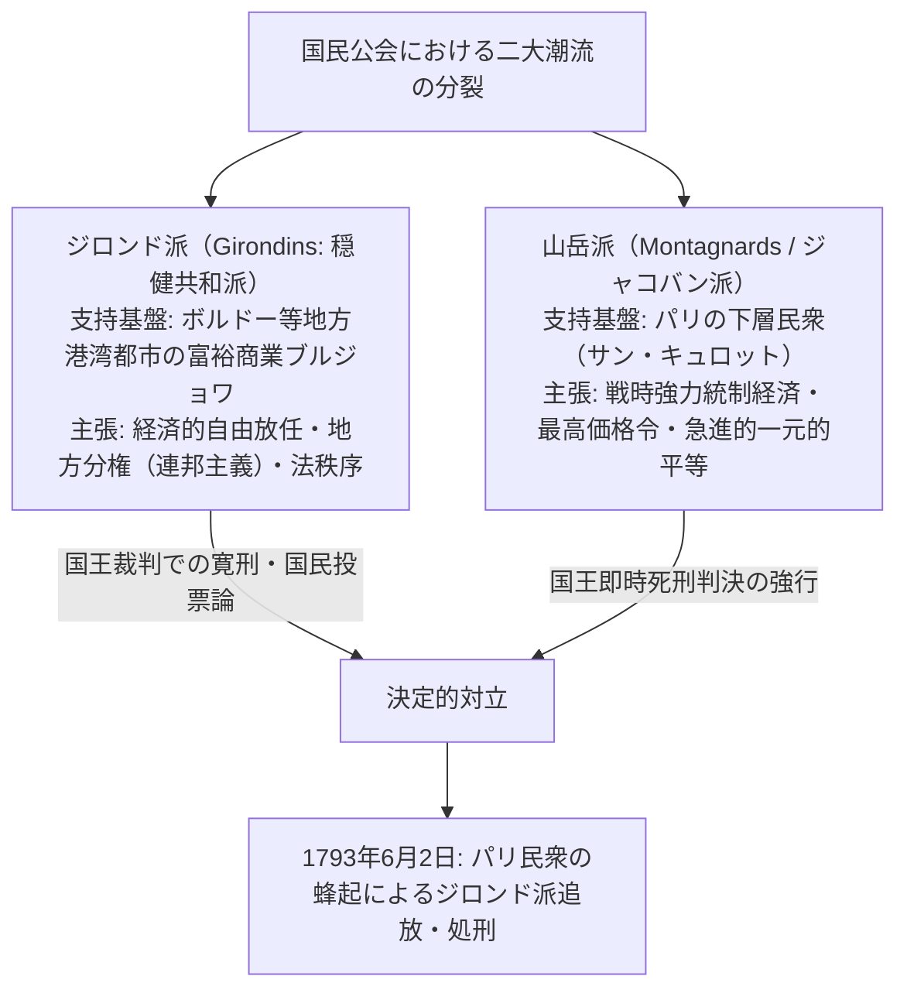

## 1. 序論：ヨーロッパの心臓としてのフランス文明

### 1.1 ガリア人とカエサルの『ガリア戦記』

ヨーロッパ大陸の西端、大西洋、地中海、ライン川、ピレネー山脈、アルプス山脈に囲まれた肥沃な大六角形（L'Hexagone: レグザゴン）。この地が「フランス」と呼ばれる以前、そこは無数のケルト系諸部族が割拠する「ガリア（Gallia）」の地であった。

紀元前58年から紀元前51年にかけて、ローマの最高司令官ガイウス・ユリウス・カエサルは、その冷徹な軍事的天才をもって全ガリアの征服に乗り出した。カエサルが自ら著した不朽の古典『ガリア戦記（Commentarii de Bello Gallico）』は、当時のガリア人の勇猛さと部族社会の生態を克明に記録している。

紀元前52年、アルウェルニ族の若き指導者ウェルキンゲトリクス（Vercingetorix）の下で全ガリア部族が結束し、反ローマの大蜂起を起こした。しかし、カエサルによる空前絶後の二重包囲陣（内側の包囲壁と外側の増援遮断壁）が敷かれた「アレシアの戦い（Battle of Alesia）」において、飢餓と猛攻の末にガリア軍は壊滅。馬に乗ったウェルキンゲトリクスはカエサルの陣幕の前に進み出て、自らの武具を投げ捨てて降伏した。

ローマの支配下に入ったガリアは、ローマ街道、水道橋（ポン・デュ・ガール）、円形闘技場（アルル、ニーム）が建設され、急速にラテン化（ガロ・ローマ文化）した。ケルト語は消滅し、民衆ラテン語が浸透して後の「フランス語」の母胎となった。アレシアでの敗北は、フランスという国家がラテン古典文明の長子として誕生するための受難の通過儀礼であった。

---

### 1.2 クローヴィスの改宗とフランク王国、シャルルマーニュの遺産

5世紀、西ローマ帝国の崩壊とともに、ライン川を越えてゲルマン系の一支族であるサリカ・フランク族が北ガリアへ進出した。481年、メロヴィング朝の祖**クローヴィス（Clovis I, 在位481–511）** が部族を統一し、フランク王国を創始した。

クローヴィスの歴史的英断は、496年、ランスの大聖堂においてカトリック（アタナシウス派キリスト教）へと改宗したことである。当時、他のゲルマン系諸民族（東ゴート族、西ゴート族、ヴァンダル族）の多くは異端のアリウス派を奉じていたが、クローヴィスが正統派カトリックを受容したことで、フランク王権は旧ローマ系貴族や教会組織の絶大な支持を獲得し、西欧中世の秩序形成者としての正統性を手に入れた。

8世紀、イスラム帝国の侵入をトゥール・ポワティエ間の戦い（732年）で撃退した宮宰カール・マルテルを経て、その息子ピピン3世が教皇の承認を得てカロリング朝を創始。そしてピピンの子**カール大帝（シャルルマーニュ: Charlemagne, 在位768–814）** のもとで、西ヨーロッパのほぼ全域（現在のフランス、ドイツ、北イタリア、低地諸国）がひとつのキリスト教帝国へと統合された。

西暦800年のクリスマス、ローマのサン・ピエトロ大聖堂において、教皇レオ3世はシャルルマーニュに帝冠を授け、「西ローマ皇帝」を復活させた。カロリング・ルネサンスによるラテン語古典の復興と修道院文化の振興は、暗黒の中世に知性の光を灯した。

しかし、カール大帝の死後、ゲルマンの伝統である分割相続により帝国は分裂した。
- **843年：ヴェルダン条約**: 帝国は西フランク、中部フランク、東フランクの3つに分割された。
- **870年：メルセン条約**: 中部フランク領を東西で分割。
このうち、西フランク王国（西側領土）こそが、後の「フランス王国（France）」の直接の母体となったのである。

---

## 2. カペー朝の成立と領土統合の軌跡

### 2.1 ユーグ・カペーの即位（987年）と微小な出発

987年、カロリング朝の血統が断絶すると、大諸侯たちの選挙によってパリ伯**ユーグ・カペー（Hugues Capet）** が国王に選出され、ここに**「カペー朝（Capetian Dynasty）」** が成立した。

初期のカペー朝の権力は、驚くほど脆弱であった。国王の直轄領はパリとオルレアン周辺のイル・ド・フランスと呼ばれる狭小な地域に過ぎず、ノルマンディー公、アキテーヌ公、フランドル伯、ブルゴーニュ公といった大諸侯たちは、王権を遥かに凌駕する広大な領地と軍事力を誇り、国王を単なる「同輩中の首席（Primus inter pares）」として軽視していた。

しかし、カペー朝には2つの決定的な強みがあった。
1. **聖油による聖別（サクレ: Sacre）**: ランスの大聖堂で国王が戴冠・塗油されることで、神から直接統治権を授かった「聖なる王」としての霊的権威（国王が手で触れると瘰癧が治癒するという奇跡信仰：ロワ・トゥマチュルジュ）を獲得した。
2. **長子相続の連続性**: 奇跡的にも、987年から1328年に至る340年余りの間、一度も直系男子の後継者が途絶えることがなく、世襲王権を不可逆的に固めることができた。

---

### 2.2 フィリップ2世（尊厳王）と領土の劇的拡大

カペー朝の直轄領を一挙に数倍へと拡大させ、真の「フランス国王（Rex Franciae）」の地位を確立したのが、第7代国王**フィリップ2世（Philippe Auguste, 在位1180–1223: 尊厳王）** である。

当時、イングランドのプランタジネット朝（ヘンリー2世、リチャード獅子心王、ジョン失地王）は、アンジュー伯領、ノルマンディー公領、アキテーヌ公領を支配し、フランス国内に国王直轄領の数倍に達する「アンジュー帝国」を築いていた。

フィリップ2世は、ジョン失地王の失政と封建法違反を突き、1204年にノルマンディー、アンジュー、メーヌ、トゥーレーヌを電撃的に没収・併合した。
1214年7月27日、**「ブーヴィーヌの戦い（Battle of Bouvines）」** において、フィリップ2世率いるフランス王軍は、ジョン王が結託した神聖ローマ皇帝オットー4世とフランドル伯の連合軍と激突。激戦の末に完全勝利を収め、イングランド勢力を大陸から駆逐するとともに、フランス王権のヨーロッパにおける軍事的威信を頂点へと押し上げた。

さらに、フィリップ2世は「セネシャル（代官）」や「バイイ（地方官）」と呼ばれる国王直属の有給官僚を新興市民階層から登用して地方に派遣し、王室直轄の司法・徴税機構を確立。パリを恒久的な首都と定め、ルーヴル要塞を築き、道路を舗装して都市の防壁を建設した。

---

### 2.3 フィリップ4世と教皇権の打破（アナーニ事件・アヴィニョン捕囚）

13世紀末、冷徹な現実主義者**フィリップ4世（Philippe IV le Bel, 在位1285–1314: 端麗王）** は、集権的官僚制をさらに推し進めた。

軍費調達のため、国内の聖職者への課税を断行したフィリップ4世は、「教皇の権威は地上のすべての世俗権力に優越する」と宣言した教皇ボニファティウス8世と激しく対立した。
- **1302年：三部会（États généraux）の初招集**: フィリップ4世はパリのノートルダム大聖堂に聖職者（第一身分）、貴族（第二身分）、都市市民（第三身分）の代表を招集し、教皇に対抗するための国民的合意を調達した。
- **1303年：アナーニ事件**: 側近ギヨーム・ド・ノガレをイタリアに派遣し、アナーニの別荘にいた教皇ボニファティウス8世を急襲・拘束（教皇は屈辱のあまり憤死）。
- **1309–1377年：教皇のアヴィニョン捕囚**: フランス人教皇クレメンス5世を擁立し、教皇庁を南フランスのアヴィニョンへと強制移転させ、約70年間にわたり教皇をフランス王権の監視下に置いた。
- さらに莫大な財産を誇っていたテンプル騎士団を異端として告発・解体し、その全財産を国庫に没収した。

中世を支配した普遍的教皇権の時代は終わりを告げ、フランスはヨーロッパで最初の「主権国家（Sovereign State）」としての骨格を露わにしたのである。

---

### 2.4 百年戦争とジャンヌ・ダルクの奇跡

カペー直系の断絶後、ヴァロワ朝のフィリップ6世が即位すると、母方を通じてカペー家の血を引くイングランド王エドワード3世がフランス王位継承権を主張し、1337年に「百年戦争」が勃発した。

クレシーの戦い（1346年）、ポワティエの戦い（1356年：国王ジャン2世が捕虜となる）、アザンクールの戦い（1415年）において、フランス騎士軍はイギリス長弓隊の前に壊滅的敗北を重ねた。ブルゴーニュ公国がイングランドと同盟を結び、1420年のトロワ条約により、イングランド王ヘンリー5世がフランス王位継承者と認められ、正統な王太子（ドーファン）シャルル7世はロワール川以南のブールジュへと追い詰められ、フランス国家は滅亡の瀬戸際に立たされた。

1429年春、北東部ドンレミ村の羊飼いの少女**ジャンヌ・ダルク（Jeanne d'Arc）** がシノン城のシャルル7世のもとに現れた。「オルレアンの包囲を解き、王太子をランスで戴冠させよ」という大天使ミカエルの神の啓示を告げた彼女は、白甲冑に身を包み、包囲された要衝オルレアンへと突入した。

ジャンヌの不屈の信念はフランス兵の士気を爆発的に奮い立たせ、わずか9日間でオルレアンの包囲を粉砕。ランス大聖堂においてシャルル7世の戴冠式を挙行させた。後にコンピエーニュで捕らえられ、ルーアンで異端裁判にかけられたジャンヌは、1431年に19歳で火刑に処されたが、彼女が灯した愛国心の炎が消えることはなかった。

シャルル7世は官僚制度と財務制度を改革し、騎士の私兵に頼らない**「世界最初の常備軍（勅令隊: Compagnies d'ordonnance）」** と砲兵部隊を創設。1453年のカスティヨンの戦いでイングランド軍を破り、百年戦争はフランスの完全勝利で終結した。

---

## 3. ユグノー戦争からブルボン絶対王政の極致

### 3.1 宗教改革の激震とユグノー戦争（1562–1598）

16世紀半ば、フランス出身のジャン・カルヴァンが創始したプロテスタント教義（カルヴァン派）は、商工業者や一部の貴族層の間に急速に浸透し、彼らは**「ユグノー（Huguenot）」** と呼ばれた。

王権が弱体化する中、カトリック派の首魁ギーズ公爵家と、ユグノー派の指導者ブルボン家（ナバラ王家）およびコリニー提督との間で、30年以上に及ぶ泥沼の内戦「ユグノー戦争」が勃発した。
- **1572年8月24日：サン・バルテルミの虐殺（St. Bartholomew's Day Massacre）**: 王母カトリーヌ・ド・メディシスの画策により、パリに集まっていたユグノーの指導者や市民数千人が夜陰に乗じて一斉に虐殺され、流血は全国へと拡大した（数万人が殺害された）。

この狂気の宗教的内乱を終結させたのが、ユグノーの首領であり、ヴァロワ朝断絶後にブルボン朝の初代国王となった**アンリ4世（Henri IV, 在位1589–1610）** である。
「パリはミサ（カトリック）に値する」と語って自らカトリックへと改宗し、国民の多数派の信認を得るとともに、**1598年に「ナントの勅令（Edict of Nantes）」を発布**。カトリックを国教としつつも、ユグノーに対して信教の自由と市民権、特定の安全保障都市（ラ・ロシェル等）の保持を承認した。国家の統合のために個人の内面の信仰の自由を公認したこの勅令は、近代的な信教の寛容の先駆けとなった。

---

### 3.2 リシュリューの「国家理性（レゾン・デタ）」と絶対王政の基礎

アンリ4世が狂信的なカトリック教徒によって暗殺された後、幼君ルイ13世を支えて宰相となったのが、冷徹な知性を持つ枢機卿**リシュリュー（Armand Jean du Plessis, Cardinal de Richelieu）** である。

リシュリューの政治哲学の核心は、**「国家理性（Raison d'État: レゾン・デタ）」** ――すなわち、国家の統一、国益、そして主権の維持は、個人の道徳や宗教的感情、貴族の特権を遥かに超越するという絶対的原理であった。
- 国内においては、ユグノーの軍事的自立拠点であったラ・ロシェル要塞を兵糧攻めで陥落させ、その軍事的特権を剥奪（信仰の自由のみを保障）。反抗的な大貴族の居城を破壊し、国王親任の地方監察官（アンタンダン: Intendant）を全土に派遣して地方行政を直轄化した。
- 対外政策においては、自らがカトリックの枢機卿でありながら、ドイツの三十年戦争（1618–1648）において新教徒（プロテスタント諸侯やスウェーデン）と同盟を結び、宿敵ハプスブルク家（オーストリア・スペイン）を東西から挟撃して徹底的に叩き潰した。

後継者マザラン枢機卿が主導した1648年の**ウェストファリア条約**により、フランスはアルザス地方の大部分を獲得し、ヨーロッパの最強国としての地歩を固めた。

---

### 3.3 太陽王ルイ14世（在位1643–1715）：「朕は国家なり」

1661年、マザランの死とともに22歳の**ルイ14世（Louis XIV）** は自ら政治を執る「親政」を宣言した。ボシュエ司教が理論化した「王権神授説」に基づき、地上のいかなる権力にも拘束されない絶対君主制の頂点に君臨した。

#### ① ヴェルサイユ宮殿という権力装置
パリの南西に建設されたバロック建築の極致「ヴェルサイユ宮殿」。鏡の間、幾何学的なフランス式庭園、黄金の装飾に満ちたこの宮殿は、単なる王の豪邸ではなかった。
かつてフロンドの乱（1648–1653年）で王権に牙を剥いた反抗的な大貴族たちを宮廷に呼び寄せて住まわせ、王の起床（ルヴェ）や就寝（クーシェ）の儀礼で誰が王のシャツを着せるかといった瑣末な名誉争いに没頭させることで、貴族の政治的野心を完全に骨抜き（去勢）にしたのである。

#### ② コルベールの重商主義と常備軍
財務総監ジャン＝バティスト・コルベールは、富の総量を増大させるため、王立マニュファクチュア（ゴブラン織り、鏡、陶磁器）を設立して輸出産業を育成し、保護貿易政策を徹底した。陸軍大臣ルーヴォワは軍隊を40万人に増強し、天才的軍事技術者ヴォーバン元帥が国境線に幾何学的な星形要塞網（ヴォーバンの防衛施設群）を構築した。

#### ③ 栄光の代償：ナント勅令の廃止と財政危機
しかし、栄光の頂点は長く続かなかった。
ルイ14世は度重なる侵略戦争（南ネーデルラント継承戦争、オランダ侵略戦争、ファルツ継承戦争、スペイン継承戦争）に莫大な国富を浪費し、国家財政を破綻の淵へと追い込んだ。
決定的な愚行は、1685年の**「フォンテーヌブロー勅令（ナント勅令の廃止）」** である。「フランスにはもはやユグノーは存在しない」としてプロテスタント信仰を全面禁止した結果、約20万から30万人に及ぶ最も勤勉で優秀な商工業者、職人、金融業者が、オランダ、イギリス、プロイセンへと亡命。フランス経済は壊滅的な打撃を受け、王政の落日は始まった。

---

## 4. 啓蒙思想とフランス革命（1789–1799）の狂乱

### 4.1 アンシャン・レジームの矛盾と啓蒙思想の爆発

18世紀のフランス社会は、中世以来の身分制階級構造――**「アンシャン・レジーム（Ancien Régime: 旧体制）」** の深刻な機能不全に喘いでいた。

- **第一身分（聖職者: 約10万人）**: 全国土の10%を所有し、免税特権を享受。
- **第二身分（貴族: 約40万人）**: 全国土の20〜25%を所有し、免税特権を享受し、高位官職や軍司令官を独占。
- **第三身分（平民: 約2500万人・人口の98%）**: 重税（タイユ税、人頭税、塩税、十分の一税、領主裁判権）を一身に背負いながら、政治的発言権を完全に剥奪されていた。

この不条理を鋭く告発したのが、18世紀の**「啓蒙思想（Enlightenment）」** である。
- **ヴォルテール**: カトリック教会の狂信と不寛容を痛烈な諷刺で批判し、言論と理性の自由を擁護（カラス事件の再審闘争）。
- **モンテスキュー**: 『法の精神』において三権分立を論じ、専制政治の解体を説く。
- **ジャン＝ジャック・ルソー**: 『社会契約論』において、主権は人民にあり、個人の自由意志の統合である「一般意思（Volonté générale）」に基づく直接民主制を主張。
- **ディドロとダランベール**: 『百科全書』を編纂し、科学と理性の知を体系化して民衆の迷信を打破した。

---

### 4.2 バスティーユの陥落と人権宣言（1789年）

ルイ15世の放蕩と七年戦争の敗北、そしてルイ16世によるアメリカ独立戦争への巨額の軍事支援により、フランス王室の財政は完全に破綻した。財務総監ネッケルらの改革提案が特権身分の抵抗に遭うと、1789年5月、ヴェルサイユにおいて175年ぶりに「三部会」が招集された。

議決方式（身分ごと1票か、議員1人1票か）をめぐって紛糾すると、第三身分の代表たちは自らを国民の唯一正当な代表機関である**「国民議会（Assemblée nationale）」** と宣言。屋内球戯場に集まり、「憲法を制定するまでは決して解散しない」という**「球戯場の誓い（テニスコートの誓い）」** を立てた。

ルイ16世が軍隊をパリ周辺に集結させ、改革派のネッケルを罷免すると、パリ市民の怒りは沸点に達した。

1789年8月26日に採択された**「人権宣言（Declaration of the Rights of Man and of the Citizen）」**（ラファイエット起草）は、以下の不朽の原則を定式化した。
1. **「人は生まれながらにして自由であり、権利において平等である。」**（第1条）
2. **「すべての主権の根源は、本質的に国民に存する。」**（第3条：国民主権）
3. 自由、所有権、安全、および圧制への抵抗の権利（自然権の不可侵）。
4. 法律の前の平等、罪刑法定主義、信教と思想の自由、所有権の神聖不可侵。

---

### 4.3 王権の停止からギロチンの恐怖政治へ

しかし、革命は急進化の坂を転がり落ちていった。
1791年6月、ルイ16世と王妃マリー・アントワネットがオーストリアへの逃亡を図って国境付近で捕らえられた**「ヴァレンヌ逃亡事件」** により、国民の国王に対する信頼は完全に消滅した。
オーストリアとプロイセンが干渉を宣言（ピルニッツ宣言）すると、1792年4月、フランスは対外戦争に突入。全国から集まった義勇軍が歌った行進曲「ラ・マルセイエーズ」が後の国歌となった。

- **1792年8月10日事件**: パリのサン・キュロット（下層民衆）と義勇兵がテュイルリー宮殿を襲撃し、王権を完全に停止。国民公会が招集され、王政廃止と**「第一共和政」** が宣言された。
- **1793年1月21日**: 国王ルイ16世が「国民に対する反逆罪」で革命広場（現コンコルド広場）においてギロチン（断頭台）で処刑された（10月にはマリー・アントワネットも処刑）。

イギリスが第1次対仏大同盟を結成し、ヴァンデ地方で大規模な農民反乱（ヴァンデの反乱）が起きる未曾有の内憂外患の中、権力を掌握したのがマクシミリアン・ロベスピエール率いる急進左派「ジャコバン派」であった。

公安委員会を率いるロベスピエールは、**「美徳なき恐怖は破滅的であり、恐怖なき美徳は無力である」** として、反対派を次々とギロチンへ送り込む**「恐怖政治（La Terreur）」** を断行した。王妃、ジロンド派指導者、さらには寛容を訴えたダントンに至るまで、約4万人が処刑された。
最高価格令、徴兵制、革命暦（反キリスト教化）の導入など極限の戦時独裁を敷いたが、独裁への恐怖に駆られたブルジョワジー勢力によって、1794年7月27日、**「テルミドール9日のクーデター」** が勃発。ロベスピエール自身が断頭台の露と消え、恐怖政治は幕を閉じた。

---

## 5. ナポレオン・ボナパルトの台頭と第一帝政

### 5.1 秩序の回復者：ブリュメールのクーデターから皇帝戴冠へ

テルミドール後の総裁政府が無能と腐敗、左右の暴動に揺れる中、国民が熱望したのは「秩序の回復」と「革命の成果の定着」であった。その期待を一身に背負って登場したのが、地中海のコルシカ島出身の若き天才軍人**ナポレオン・ボナパルト（Napoléon Bonaparte, 1769–1821）** である。

トゥーロン攻囲戦で頭角を現し、イタリア遠征（1796–1797年）でオーストリア軍を連破してヨーロッパに名を轟かせたナポレオンは、1799年11月9日、**「ブリュメール18日のクーデター」** を断行して総裁政府を打倒し、自らを第一統領とする統領政府を樹立した。

ナポレオンの真の偉大さは、軍事的勝利以上に、**「革命の精神を近代国家の恒久的な法と制度へと昇華させたこと」** にある。
1. **フランス民法典（ナポレオン法典, 1804年）**: 「法の前の平等」「信教の自由」「契約の自由」「私的所有権の絶対不可侵」「家族の家父長制秩序」を定式化。現代大陸法体系の最高峰であり、世界中の近代法典の規範となった。
2. **制度改革**: フランス銀行の設立とフラン通貨の安定、中央集権的教育制度（リセ、大学区制、バカロレア）、レジオンドヌール勲章の創設。
3. **コンコルダート（政教協約, 1801年）**: 教皇ピウス7世と和解し、カトリックを「大多数の国民の宗教」として承認しつつ、教会領の返還を拒絶して国家管理下に置いた。

1804年12月2日、パリのノートルダム大聖堂において、ナポレオンは教皇から冠を奪い取り、自らの手で頭上に載せ、**「フランス人の皇帝ナポレオン1世」** として戴冠した（第一帝政）。

---

### 5.2 大陸制覇の栄光とロシア遠征の破滅

ナポレオンのグランダルメ（大陸軍）は、国民徴兵制に基づく圧倒的な動員力と、ナポレオンの神速の機動・集中戦術によって全ヨーロッパを席巻した。
- **1805年：アウステルリッツの戦い（三帝会戦）**: ロシア皇帝アレクサンドル1世と神聖ローマ皇帝フランツ2世の連合軍を壊滅させ、1000年続いた神聖ローマ帝国を消滅させた（ライン同盟の結成）。
- **プロイセンの撃破（イエナ・アウエルシュタットの戦い, 1806年）**: ベルリンに入城。

しかし、唯一撃破できなかったのが、制海権を握るイギリスであった。1805年のトラファルガー海戦においてネルソン提督に敗北したナポレオンは、1806年に**「大陸封鎖令（ベルリン勅令）」** を発布し、欧州大陸諸国とイギリスとの一切の通商を禁止した。

この封鎖令に違反してイギリスへの穀物密輸出を再開したロシア帝国を懲罰するため、1812年、ナポレオンは60万の大軍を率いてロシア遠征を敢行した。
しかし、クトゥーゾフ将軍率いるロシア軍の徹底した「焦土作戦」とモスクワ大火、そして氷点下30度に達する極寒の「冬将軍」が軍を襲った。退却路で飢餓と凍死により軍は全滅し、生還できた兵士はわずか数万人であった。

諸国民の解放者として歓迎されたナポレオンは、各地の民族意識（ドイツ・ナショナリズムやスペインのゲリラ戦）を目覚めさせ、侵略者として包囲された。1813年のライプツィヒ諸国民戦争で敗北し、エルバ島へ配流。1815年に脱出して「百日天下」を試みたが、**ワーテルローの戦い** においてウェリントン公率いるイギリス・プロイセン軍に敗北。南大西洋の孤島セントヘレナ島へと流刑に処され、1821年に波乱の生涯を閉じた。

---

## 6. 19世紀の革命の連鎖：王政復古からパリ・コミューンまで

ナポレオン失脚後、ウィーン会議（正統主義）によりルイ18世が迎えられ、ブルボン朝が復活した（復古王政）。しかし、一度自由と平等を味わったフランス国民は、もはや絶対王政の軛に戻ることはできなかった。19世紀のフランスは、君主制、帝政、共和政が激しく入れ替わる「革命の実験場」となった。

### 6.1 七月革命（1830年）と二月革命（1848年）

- **1830年：七月革命**: 反動的専制を進めたシャルル10世に対し、パリ市民がバリケードを築いて武装蜂起（ウジェーヌ・ドラクロワが描いた名画『民衆を導く自由の女神』の舞台）。シャルル10世は亡命し、自由主義貴族のオルレアン公ルイ・フィリップが「フランス国民の王」として擁立された（七月王政 / 銀行家ら富裕ブルジョワジーの支配）。
- **1848年：二月革命**: 産業革命の進行に伴い増大した労働者階級が、選挙権拡大（普通選挙）を求めて蜂起。ルイ・フィリップは退位し、**「第二共和政」** が樹立された。社会主義者ルイ・ブランが入閣し、「国立作業場（失業者救済）」が設置されたが、農民の反発を受けて閉鎖されると六月蜂起が勃発し、血の弾圧を受けた。

---

### 6.2 ナポレオン3世の第二帝政とパリ大改造

混乱の第二共和政において、大統領選挙で圧倒的勝利を収めたのは、ナポレオンの甥である**ルイ・ナポレオン**であった。
1851年、クーデターによって議会を解散し、翌1852年に皇帝**ナポレオン3世**として即位した（第二帝政: 1852–1870年）。

ナポレオン3世は、セーヌ県知事オスマン男爵に命じて**「パリ大改造」** を断行した。
- 中世以来の不衛生で迷路のような狭い路地（革命のバリケードが築かれやすい）を一掃。
- 凱旋門を中心に放射状に広がる巨大な大通り（ブールバール）を建設し、近代的な上下水道網、ガス灯、公園（ブローニュの森）を整備。
- 今日の世界中の人々を魅了する美しい「光の都パリ」の都市景観は、この第二帝政期に完成した。

しかし、対外戦争（クリミア戦争の勝利、イタリア統一支援、メキシコ出兵の惨憺たる失敗）を重ねた末、1870年、ビスマルク率いるプロイセンとの**普仏戦争**に突入。セダン（スダン）の戦いにおいて、ナポレオン3世自らが捕虜となる屈辱的惨敗を喫し、第二帝政は瞬時に瓦解した。

---

### 6.3 1871年：パリ・コミューンの壮絶な悲劇

プロイセン軍によるパリ包囲と降伏協定、ティエール率いる仮政府の屈辱的な講和に対し、パリの労働者や市民兵（国民軍）は武装解除を拒否して蜂起した。
1871年3月28日、市庁舎前で宣言されたのが、**人類史上最初の労働者階級による自治政権「パリ・コミューン（Commune de Paris）」** である。

- 婦人参政権、政教分離、児童労働の禁止、工場接収による労働者自主管理、常備軍の廃止など、驚異的な急進的社会民主主義政策を打ち出した。
- しかし、ヴェルサイユに逃れた臨時政府軍はプロイセン軍の支援を受けてパリへ総攻撃を開始（5月21日〜28日：**血の週間**）。
- 市街地での凄惨なバリケード市街戦の末、約2万人のコミューン戦士が虐殺・銃殺され（ペール・ラシェーズ墓地の「連邦兵の壁」）、数万人が流刑地へと送られた。

---

## 7. 第三共和政から二つの大戦、そしてド・ゴールと第五共和政

### 7.1 ベル・エポックとライシテ（政教分離）の確立

パリ・コミューンの血の弾圧の中から誕生した「第三共和政（1870–1940）」は、最も脆弱に見えながら70年にわたり存続した。
19世紀末から1914年にかけて、産業の発展と平和を享受したこの時代は**「ベル・エポック（Belle Époque: 美しき時代）」** と呼ばれる。1889年のパリ万国博覧会のために建設されたエッフェル塔、印象派美術の開花、映画の発明（リュミエール兄弟）が世界を魅了した。

この時代を揺るがした最大の思想的危機が**「ドレフュス事件（1894年）」** である。ユダヤ系の陸軍大尉アルフレド・ドレフュスが、ドイツのスパイ容疑で無実のまま有罪判決を受けた軍部と反ユダヤ主義の不正に対し、文豪エミール・ゾラが新聞『オロール』紙上に**「私は告発する！（J'accuse…!）」** と題する公開書簡を発表。国家の威信と個人の人権・正義のどちらを優先すべきかを巡り、国論は真っ二つに割れた。

ドレフュスの名誉回復を果たした共和派は、1905年に**「政教分離法（ライシテ法: Loi de 1905）」** を制定。公共空間から宗教の影響力を完全に排除し、信仰を個人の私的領域へと限定する「ライシテ（Laïcité）」の原則は、現代フランスの国家精神の絶対的根幹となった。

---

### 7.2 二つの世界大戦とド・ゴールのレジスタンス

- **第一次世界大戦（1914–1918）**: ドイツ軍の侵入を受け、マルヌの戦いで首都陥落を阻止。ヴェルダンの戦い（死傷者70万人）をはじめとする過酷な塹壕戦の末に勝利したが、北部工業地帯は灰燼に帰し、140万人もの若者が命を落とした。
- **第二次世界大戦の電撃戦とヴィシー傀儡政権（1940）**: ナチス・ドイツの機甲師団による電撃戦の前に、難攻不落と過信された「マジノ線」は迂回され、開戦からわずか6週間でフランス軍は降伏。第一次大戦の英雄ペタン元帥は南部ヴィシーに対独協力（コラボラシオン）の傀儡政権を樹立した。

1940年6月18日、イギリスへ単身脱出した陸軍次官**シャルル・ド・ゴール（Charles de Gaulle）** は、BBCのラジオ放送を通じて全世界のフランス国民に向けて歴史的演説を行った。
> **「フランスは戦闘に負けた。だが、戦争に負けたわけではない！……フランスのレジスタンスの炎は決して消えてはならないし、消えることはない！」**

ロンドンに「自由フランス」を組織したド・ゴールは、国内の共産党や労働者による地下抵抗運動（レジスタンス）を統合。1944年のノルマンディー上陸作戦を経てパリを自らの手で解放し、戦勝国五大国（国連安保理常任理事国）の地位を奇跡的に奪還したのである。

---

### 7.3 第五共和政の創始と自律外交の哲学

戦後の第四共和政が小党分立の議院内閣制により機能不全に陥り、アルジェリア独立戦争（1954–1962）の危機によって国家が内戦寸前に直面した1958年、国民は再びド・ゴールを呼び戻した。

ド・ゴールは憲法を全面改定し、強大な行政権を持つ直接公選の大統領制を中核とする**「第五共和政（Cinquième République）」** を樹立した。
- **アルジェリアの独立承認（エビアン協定, 1962年）**: 植民地主義からの完全な清算。
- **独自の核抑止力（フォース・ド・フラップ）の保持**: アメリカの核の傘に完全に依存することを拒絶。
- **NATO軍事機構からの脱退（1966年）**、中華人民共和国の早期承認（1964年）、米国のベトナム介入批判など、**「国家主権の絶対的独立と多極主義外交（ド・ゴール主義: Gaullism）」** を貫徹した。

1968年の「五月危機（May 68）」では、パリ大学の学生蜂起と1000万人規模の労働者ゼネストが勃発し、伝統的な権威主義的モラルが崩壊、現代的な個人主義・フェミニズム・環境意識の時代へと社会は大きく変容した。

---

---

## 4.5 革命の深淵：ジロンド派 vs 山岳派の激突と『女性の権利宣言』

フランス革命の国民公会（1792–1795）において繰り広げられた権力闘争は、単なる政治抗争を超えた「国家哲学の根源的激突」であった。

### ① オランプ・ド・グージュと『女性および女性市民の権利宣言』
1789年の「人権宣言」は、普遍的人類の名を冠しながら、その実態は「活動的市民」としての男性有産者にのみ権利を限定した「男権宣言」に過ぎなかった。
劇作家**オランプ・ド・グージュ（Olympe de Gouges, 1748–1793）**は、1791年に**『女性および女性市民の権利宣言（Déclaration des droits de la femme et de la citoyenne）』**を発表し、痛烈な批判を突きつけた。

> **「女性は生まれながらにして自由であり、権利において男性と平等である。」**
> **「女性が断頭台に登る権利があるならば、当然に演壇（議壇）に登る権利もなければならない。」**

彼女は女性の参政権、財産権、教育の平等を求め、婚姻を男女対等の社会契約と定義した。しかし、ロベスピエールら男性革命指導者たちはこれを容れず、彼女を「自らの性別を忘れ、国家を転覆しようとした」として1793年にギロチン台へと送った。彼女の先駆的思想は、20世紀シモーヌ・ド・ボーヴォワール『第二の性』に至るフェミニズムの至高の原点となった。

---

## 5.3 ナポレオン軍事ドクトリンの革新：軍団制と作戦術の幾何学

ナポレオンがなぜ全ヨーロッパの連合軍を相手に破竹の連勝を重ねることができたのか。その秘密は、軍事組織と作戦術（Operational Art）の革命的再編にあった。

1. **諸兵科連合「軍団制（Corps d'Armée）」の創設**:
   - ナポレオンは数十万の大軍を一つの塊として動かすのではなく、歩兵・騎兵・砲兵を自給自足的にパッケージ化した**「軍団（Corps: 2万〜3万人規模）」**へと分割した。
   - 各軍団は独立して数日間にわたり優勢な敵軍を拘束（遅滞戦闘）できる能力を持っていた。
   - **「別れて行軍し、合して戦う（March divided, fight united）」**: 複数の軍団が別々の道路を猛スピードで進軍し（補給を現地徴発で迅速化）、決戦の瞬間、敵の背後や側面に電撃的に集結して数的優位を形成した。
2. **内線作戦（Central Position）と集中（Concentration of Force）**:
   - 二方向から迫る敵同盟軍（例：オーストリア軍とロシア軍）に対し、その中間地点へと素早く突入して敵の連絡線を遮断。
   - 一方の軍を牽制部隊で抑えている間に、全主力を集中してもう一方の軍を各個撃破する数学的機動戦を展開した。

---

## 7.4 脱植民地化の激痛：ディエンビエンフーとアルジェリア戦争（1954–1962）

第二次世界大戦後、フランスを最も深く引き裂いたのは、世界第2位の広大さを誇った植民地帝国の崩壊プロセスであった。

### ① インドシナ戦争の終焉：ディエンビエンフーの戦い（1954年）
ベトナムにおいてホー・チ・ミン率いるベトミン（ベトナム独立同盟）のゲリラ戦に対し、フランス軍は山岳盆地ディエンビエンフーに要塞陣地を築いて決戦を挑んだ。
しかし、ヴォー・グエン・ザップ将軍率いるベトミン軍は、密林の険しい山頂に人力で数百門の重砲を運び上げて要塞を見下ろす砲兵陣地を構築。2ヶ月に及ぶ猛砲撃の末にフランス軍守備隊は全滅・降伏した。これによりフランスは東南アジアから完全撤退し、ジュネーヴ協定によってベトナムの南北分断が確定した。

### ② アルジェリア戦争の内通と第五共和政への胎動
1830年以来「海外植民地ではなくフランス本土の一部（県）」として統治され、100万人以上のフランス系入植者（ピエ・ノワール）が暮らしていたアルジェリアにおいて、1954年に民族解放戦線（FLN）が武装蜂起した。
- フランス軍空挺部隊は首都アルジェのテロ組織を壊滅させるため、体系的な拷問と超法規的処刑を横行させ（アルジェの戦い）、知識人（サルトルら）の間で道徳的抗議の嵐が吹き荒れた。
- アルジェリアの独立を頑として拒絶する現地軍部とピエ・ノワールは、1958年に反乱を起こしてパリ進軍を予告。国家崩壊の危機において、ド・ゴールが全権を掌握する契機となった。
- ド・ゴールは最終的に現実主義に徹し、激しい極右軍部テロ（OASによるド・ゴール暗殺未遂事件）を生き延びて、1962年の**エビアン協定**によりアルジェリアの独立を承認した。

---

## 7.5 フランス現代思想の爆発と文化国家の創造（サルトル・カミュ・マルロー）

第二次世界大戦後のフランスは、軍事的大国としての地位を後退させる一方、「世界の知性と文化の首都」としての比類なき輝きを放ち続けた。

### ① 実存主義の二大巨星：サルトル vs カミュの歴史的決裂
サン＝ジェルマン＝デ＝プレのカフェ（ドゥ・マゴ、カフェ・ド・フロール）を拠点に、世界を席巻したのがジャン＝ポール・サルトルとアルベール・カミュの実存主義（Existentialism）であった。
- **サルトル『存在と無』**: 「実存は本質に先立つ」。人間はあらかじめ決められた本質を持たず、自らの自由な選択とアンガージュマン（社会参加）によって自己を創造しなければならない。サルトルはソ連共産党に接近し、歴史の進歩のための暴力を一定程度容認した。
- **カミュ『反抗的人間』**: アルジェリア出身のカミュは、いかなる崇高なイデオロギーであっても、人間の生命を手段として犠牲にすることを断固拒絶した（全体主義的革命批判）。
- 二人の決裂は、20世紀における「自由と正義、暴力と倫理」をめぐる世界最高峰の思想論争となった。

### ② アンドレ・マルローと「文化省」の創設（1959年）
ド・ゴール政権下で初代文化相に就任した作家アンドレ・マルロー（André Malraux）は、近代国家における「文化政策」の歴史的モデルを確立した。
- **「人間が生み出した最高峰の芸術を、特権階級から解放し、最も多くのフランス国民に届けること」**を国の公的責務として宣言。
- 地方都市に総合文化施設「文化の家（Maison de la Culture）」を次々と建設。
- パリの歴史的建築物のファサードの黒ずんだ煤煙汚れを一斉に高圧洗浄して白い輝きを取り戻させ（マルロー法による歴史的街並み保全地区の創設）、文化財の保護と都市の美観を国家主権の中心課題へと引き上げたのである。

---

## 7.6 ミッテラン政権の社会改革と死刑廃止（1981年）

1981年、フランソワ・ミッテラン（François Mitterrand）が第五共和政下で初となる社会党出身の大統領に選出された。共産党との統一左翼政権を発足させたミッテランは、フランス現代社会を規定する歴史的な社会民主主義的改革を断行した。

### ① ロベール・バダンテールと死刑制度の完全廃止（1981年9月）
フランスは革命以来、ギロチンによる公開死刑の伝統を引きずり、西欧諸国の中で最後まで死刑制度を維持していた（最後のギロチン死刑執行は1977年）。
法相ロベール・バダンテールは、国民世論の過半数が死刑存続を支持する逆風の中、国民議会で歴史的演説を行い、死刑廃止法案を可決させた。

> **「正義とは、決して殺戮であってはならない。国家が自ら国民の命を奪う権利を否定することこそが、人間的尊厳の究極の証明である。」**

### ② 労働・社会福祉の抜本的拡充
- 法定労働時間の短縮（週40時間から39時間へ、後のジョスパン内閣で「週35時間労働制」へ移行）。
- 有給休暇の年間5週間への延長、最低賃金（SMIC）および家族手当の大幅引き上げ。
- 主要銀行や化学・鉄鋼などの巨大企業11社の国有化（後に現実主義に舵を切り一部民営化）。
- 地方分権化法（ドフェール法）による中央官僚（県知事）の権限削減と、地方自治体（県・地域圏）への大幅な権限移譲。

自由市場競争の過酷さから市民の生活を守り、休暇と文化的教養の享受を市民の普遍的権利と位置づける「フランス型生活様式（Art de vivre）」の制度的基盤が、ここに完成したのである。

### ③ 21世紀のマクロン政権と「欧州戦略的主権」の構想
2017年に史上最年少の39歳で大統領に就任したエマニュエル・マクロン（Emmanuel Macron）は、従来の左右二大政党（社会党・共和党）の枠組みを解体した。ソルボンヌ大学での演説において、マクロンは米中二大超大国の覇権対立とロシアのウクライナ侵攻に直面する世界の中で、ヨーロッパが独自の防衛力、産業競争力、エネルギー自給を確立すべきとする**「欧州主権（Souveraineté européenne / 戦略的自立）」**を提唱。ド・ゴール以来の「独自外交」の遺伝子をEU全体のスケールへと拡大し、多極化する21世紀世界におけるフランスの存在感を示し続けている。

## 8. 結論：自由（Liberté）、平等（Égalité）、友愛（Fraternité）の普遍的灯火

フランスの歴史を辿る者は、そこに流れる「普遍性（Universalism）への尽きることのない情熱」に打たれざるを得ない。

自国の特殊な伝統にとどまらず、「人間とは何か、社会はいかにあるべきか」という人類全体に関わる根本問題を、哲学、文学、芸術、そして革命の炎を通じて問い続けてきたのがフランスという文明であった。

フランス革命が掲げた**「自由（Liberté）、平等（Égalité）、友愛（Fraternité）」** という三色旗の理念は、今日、世界中のあらゆる民主主義憲法において普遍的人権の規範として息づいている。

多民族化に伴うライシテ（世俗主義）の軋轢、EU統合と主権の維持の葛藤、激化する社会抗議運動（黄色いベスト運動等）に揺れながらも、理性の力によって社会的不公正に立ち向かい、常に自らを更新し続ける知性の誇り。その偉大なる精神の軌跡こそが、フランス通史が人類に遺した最高の遺産なのである。
