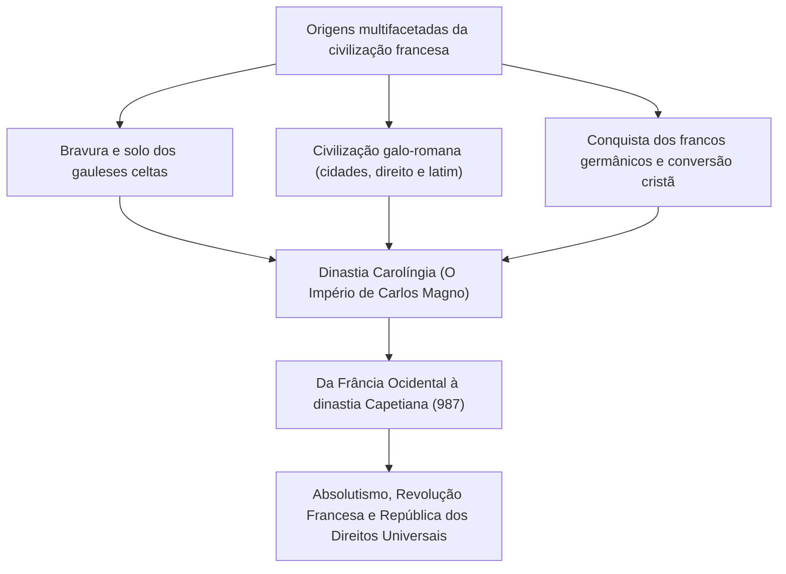
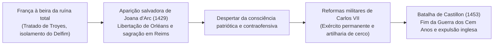
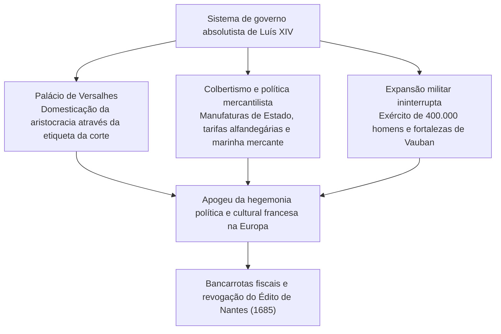
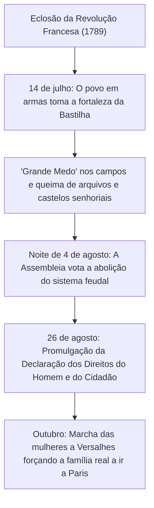
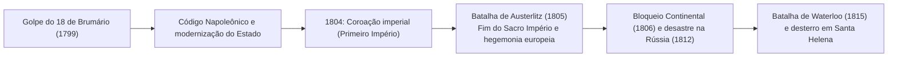
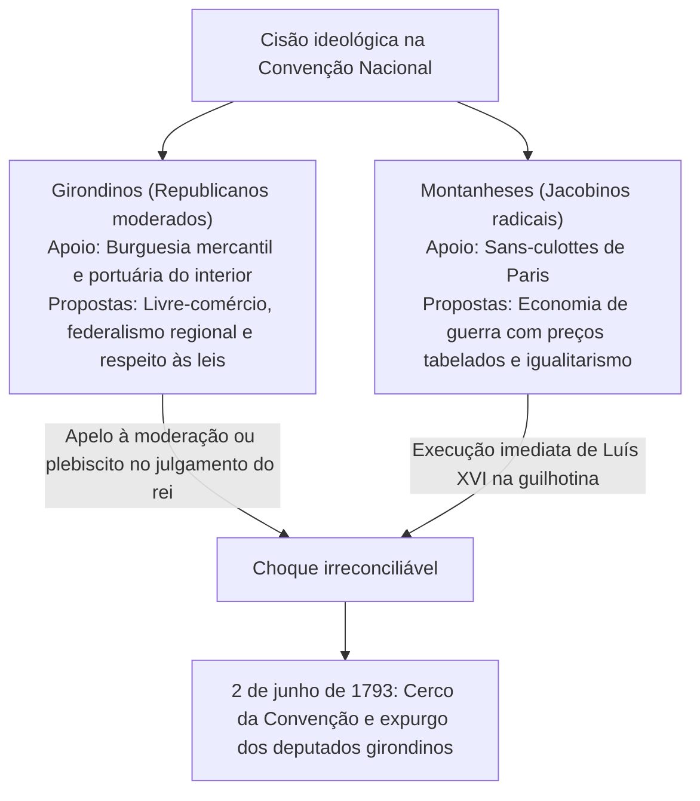

## 1. Introdução: A civilização francesa como coração da Europa

### 1.1 Os gauleses e os *Comentários sobre a Guerra das Gálias* de Júlio César

No extremo ocidental do continente europeu estende-se um fértil hexágono (L'Hexagone), delimitado pelo oceano Atlântico, pelo mar Mediterrâneo, pelo rio Reno, pelos Pireneus e pelos Alpes. Muito antes de esta terra ser chamada de "França", ela era a "Gália" (*Gallia*), pátria de inúmeras tribos de estirpe celta.

Entre 58 a.C. e 51 a.C., o comandante supremo de Roma, Caio Júlio César, com seu frio e formidável gênio militar, lançou-se à conquista sistemática de toda a Gália. A obra clássica redigida pelo próprio general, *Comentários sobre a Guerra das Gálias* (*Commentarii de Bello Gallico*), registrou com riqueza de detalhes a bravura dos combatentes gauleses e o funcionamento de sua sociedade tribal.

Em 52 a.C., sob a liderança do jovem chefe dos arvernos, Vercingetórix, todas as tribos gaulesas se uniram em um levante maciço contra Roma. Contudo, na decisiva Batalha de Alésia, onde César ergueu uma fortificação dupla sem precedentes (uma linha interna de cerco e uma muralha externa contra tropas de socorro), os gauleses sucumbiram à fome e a ataques implacáveis. Montado em seu cavalo, Vercingetórix avançou até a tenda de César, atirou suas armas ao chão e rendeu-se.

Sob o domínio romano, a Gália foi rapidamente latinizada, florescendo na cultura galo-romana com suas estradas pavimentadas, aquedutos (como a Pont du Gard) e imponentes anfiteatros (Arles, Nîmes). Os dialetos celtas desapareceram gradualmente diante do latim vulgar, que se tornou a matriz da futura língua francesa. A derrota em Alésia foi o doloroso rito de passagem pelo qual a França nasceu como a filha primogênita da civilização latina clássica.

---

### 1.2 A conversão de Clóvis, o Reino Franco e o legado de Carlos Magno

No século V, em meio ao colapso do Império Romano do Ocidente, os francos sálios cruzaram o Reno e avançaram pelo norte da Gália. Em 481, **Clóvis I (Clovis I, reinado 481–511)**, fundador da dinastia merovíngia, unificou as tribos e estabeleceu o Reino Franco.

A decisão histórica de Clóvis ocorreu em 496, ao ser batizado na fé católica (ortodoxia nicena) na catedral de Reims. Enquanto a maioria dos outros povos germânicos (visigodos, ostrogodos, vândalos) aderira à heresia ariana, o acolhimento do catolicismo tradicional por Clóvis garantiu à monarquia franca o apoio ardente da aristocracia galo-romana e da hierarquia eclesiástica, consolidando sua legitimidade como pilar da ordem medieval ocidental.

No século VIII, após Carlos Martel barrar o avanço islâmico na Batalha de Poitiers (732), seu filho Pepino, o Breve, obteve a bênção papal para fundar a dinastia Carolíngia. Sob o governo do filho de Pepino, **Carlos Magno (Charlemagne, reinado 768–814)**, quase toda a Europa Ocidental (França moderna, Alemanha, norte da Itália e Países Baixos) uniu-se em um único império cristão.

No dia de Natal do ano 800, na basílica de São Pedro em Roma, o papa Leão III coroou Carlos Magno imperador, restaurando o Império Romano do Ocidente. O renascimento carolíngio, ao recuperar o latim clássico e impulsionar as escolas monásticas, acendeu uma chama de erudição na Alta Idade Média.

Porém, com a morte de Carlos Magno, o costume germânico da partilha hereditária fragmentou o império:
- **843: Tratado de Verdun**: Divisão do território em Frância Ocidental, Frância Média e Frância Oriental.
- **870: Tratado de Meerssen**: Partilha da Frância Média entre o reino oriental e o ocidental.
Dentre esses reinos, a Frância Ocidental (*Francia Occidentalis*) constituiu a matriz geográfica e política contínua do Reino da França.

---

## 2. A ascensão da dinastia Capetiana e a consolidação do território

### 2.1 A aclamação de Hugo Capeto (987) e os começos modestos

Em 987, extinta a linhagem direta dos carolíngios, os grandes senhores feudais elegeram o conde de Paris, **Hugo Capeto (Hugues Capet)**, como rei, inaugurando a gloriosa **dinastia Capetiana**.

Em seus primeiros passos, a autoridade real era surpreendentemente frágil. As terras sob posse direta da coroa (*domaine royal*) resumiam-se a uma estreita faixa entre Paris e Orléans, a Île-de-France. Duques e condes poderosos — da Normandia, Aquitânia, Borgonha e Flandres — possuíam territórios e exércitos imensamente superiores aos do rei, enxergando-o apenas como o "primeiro entre pares" (*primus inter pares*).

Não obstante, os capetos desfrutavam de duas vantagens institucionais singulares:
1. **A unção com o Santo Óleo (*Sacre*)**: Ao ser sagrado e ungido na catedral de Reims, o monarca recebia a aura de uma autoridade de direito divino (o mito dos reis taumaturgos, a quem o povo atribuía o dom de curar a escrófula pelo toque das mãos).
2. **A primogenitura ininterrupta**: Por quase 350 anos, de 987 a 1328, a coroa foi transmitida sem quebra de pai para filho homem, fixando com solidez o princípio hereditário da monarquia.

---

### 2.2 Filipe II Augusto e a expansão territorial

O soberano que multiplicou os domínios reais e assumiu com autoridade indiscutível o título de "Rei da França" (*Rex Franciae*) foi **Filipe II Augusto (Philippe Auguste, reinado 1180–1223)**.

Naquela altura, a dinastia Plantageneta da Inglaterra (Henrique II, Ricardo Coração de Leão e João Sem Terra) dominava Anjou, Normandia e Aquitânia, erguendo o imenso "Império Angevino", que ofuscava o território dos reis franceses.

Valendo-se das falhas feudais de João Sem Terra, Filipe Augusto confiscou e anexou legalmente a Normandia, Anjou, Maine e Touraine em 1204.
Em 27 de julho de 1214, na histórica **Batalha de Bouvines**, o exército de Filipe Augusto colidiu com a poderosa aliança formada por João Sem Terra, pelo imperador germânico Otão IV e pelo conde de Flandres. A esmagadora vitória francesa desmantelou a coalizão, varreu a presença militar inglesa do norte da França e ergueu o prestígio da coroa gala ao topo da Europa.

Filipe Augusto organizou uma burocracia estatal assalariada, recrutando bailios (*baillis*) e senescais (*sénéchaux*) na burguesia urbana para administrar impostos e a justiça real. Estabeleceu Paris como capital permanente, construiu o palácio-fortaleza do Louvre, calçou ruas e cercou a cidade com muralhas protetoras.

---

### 2.3 Filipe IV, o Belo, e o confronto com o Papado (Anagni e Avinhão)

No final do século XIII, o pragmático monarca **Filipe IV, o Belo (Philippe IV le Bel, reinado 1285–1314)** impulsionou com rigor o centralismo régio.

Para cobrir os custos de suas guerras, Filipe tributou os bens eclesiásticos, gerando violenta colisão com o papa Bonifácio VIII, que na bula *Unam Sanctam* afirmara a superioridade do poder papal sobre todos os príncipes terrenos.
- **1302: Primeira convocação dos Estados Gerais (*États généraux*)**: O rei reuniu na catedral de Notre-Dame de Paris representantes do clero, da nobreza e dos burgueses das cidades para respaldar sua oposição à Sé Romana.
- **1303: O atentado de Anagni**: O conselheiro Guillaume de Nogaret chefiou uma incursão armada que cercou e humilhou Bonifácio VIII em seu palácio italiano (o papa faleceu pouco depois, abalado pelo ultraje).
- **1309–1377: O Papado de Avinhão**: Filipe promoveu a eleição de um papa francês, Clemente V, e transferiu a sede pontifícia para Avinhão, no sul da França, mantendo a Igreja sob a órbita da monarquia por cerca de 70 anos.
- Filipe também acusou a Ordem dos Templários de heresia, dissolvendo a poderosa confraria militar e confiscando seus imensos tesouros para a coroa.

O universalismo teocrático medieval ruiu, abrindo espaço para a França erguer-se como o primeiro Estado soberano da Europa moderna.

---

### 2.4 A Guerra dos Cem Anos e o milagre de Joana d'Arc

Com a extinção da linhagem direta dos capetos, ascendeu ao trono Filipe VI de Valois. Em represália, o rei Eduardo III da Inglaterra, neto materno de Filipe, o Belo, exigiu a coroa da França, precipitando a Guerra dos Cem Anos em 1337.

Em Crécy (1346), Poitiers (1356, onde o rei João II foi capturado) e Azincourt (1415), as cargas da cavalaria pesada francesa foram dizimadas pelos arqueiros ingleses. Com o ducado da Borgonha alinhado a Londres, o Tratado de Troyes (1420) deserdou o delfim Carlos e designou o rei Henrique V da Inglaterra como herdeiro da França. Isolado ao sul do rio Loire, em Bourges, o legítimo herdeiro Carlos VII via o país à beira do colapso definitivo.

Na primavera de 1429, uma jovem camponesa de dezesseis anos, natural de Domrémy, **Joana d'Arc (Jeanne d'Arc)**, apresentou-se a Carlos VII no castelo de Chinon. Afirmando ter recebido mensagens do arcanjo São Miguel para libertar Orléans e conduzir o príncipe a Reims para ser sagrado, vestiu armadura branca e marchou para a cidade cercada.

A fé inabalável de Joana reacendeu o entusiasmo das tropas francesas. Em apenas nove dias, o cerco de Orléans foi quebrado e Carlos VII atravessou linhas inimigas para ser coroado na catedral de Reims. Embora Joana tenha sido capturada em Compiègne e queimada viva em Rouen em 1431, aos dezenove anos, após julgamento inquisitorial fraudulento, a chama de unidade nacional que ela acendera jamais se apagou.

Carlos VII reformulou os tributos régios e instituiu o **primeiro exército permanente da Europa (as Companhias de Ordenança: *Compagnies d'ordonnance*)**, além de uma moderna artilharia. Na Batalha de Castillon (1453), as baterias francesas esmagaram as forças inglesas, concluindo a Guerra dos Cem Anos com a recuperação total da França, exceto Calais.

---

## 3. Das Guerras de Religião ao esplendor do absolutismo Bourbon

### 3.1 A convulsão da Reforma e as Guerras de Religião (1562–1598)

Em meados do século XVI, o calvinismo arrebatou parcelas expressivas da burguesia mercantil e da nobreza francesa; esses protestantes ficaram conhecidos como **huguenotes**.

Com a monarquia fragilizada por reis jovens e inaptos, irromperam hostilidades sangrentas entre a facção católica liderada pela Casa de Guise e os líderes huguenotes encabeçados pela Casa de Bourbon e pelo almirante Coligny, arrastando o reino a três décadas de guerras civis.
- **24 de agosto de 1572: O Massacre da Noite de São Bartolomeu**: Sob as ordens da rainha-mãe Catarina de Médici, milhares de nobres e civis huguenotes reunidos em Paris foram massacrados durante a noite, espalhando uma onda de assassinatos por todo o país que custou dezenas de milhares de vidas.

A pacificação da nação foi obra do líder huguenote e herdeiro da dinastia Valois, **Henrique IV (Henri IV, reinado 1589–1610)**, fundador da Casa de Bourbon.
Compreendendo que "Paris bem vale uma missa", converteu-se ao catolicismo para unir os franceses e, em **1598, promulgou o memorável Édito de Nantes**. O diploma manteve o catolicismo como culto oficial, mas outorgou aos protestantes ampla liberdade de consciência, direitos civis e praças de segurança militar (como La Rochelle). A concessão estatal de tolerância civil representou um avanço pioneiro para o mundo moderno.

---

### 3.2 A "Razão de Estado" de Richelieu e as bases do absolutismo

Após o assassinato de Henrique IV por um fanático religioso, o governo de Luís XIII foi guiado pela mão de ferro do cardeal **Richelieu (Armand Jean du Plessis)**.

O alicerce da conduta de Richelieu era a **"Razão de Estado" (*Raison d'État*)**: o postulado de que a conservação soberana, a coesão interna e o interesse supremo do Estado devem sobrepor-se a escrúpulos morais individuais, paixões confessionais e prerrogativas feudais.
- No front doméstico, subjugou o bastião huguenote de La Rochelle pela fome (preservando apenas a liberdade de crença), demoliu fortificações nobiliárquicas insurgentes e distribuiu intendentes (*Intendants*) em todas as províncias para supervisionar a justiça e o fisco.
- No front externo, apesar de ser príncipe da Igreja romana, Richelieu financiou e aliou-se a príncipes protestantes germânicos e à Suécia durante a Guerra dos Trinta Anos (1618–1648) com o objetivo de quebrar o cerco dos Habsburgo da Áustria e Espanha.

A **Paz de Vestfália (1648)**, concluída pelo cardeal Mazarino, garantiu à França grande parte da Alsácia e fez do reino o fiel da balança geopolítica do continente.

---

### 3.3 Luís XIV, o Rei Sol (reinado 1643–1715): "O Estado sou eu"

Com o falecimento de Mazarino em 1661, **Luís XIV (Louis XIV)**, aos 22 anos, decidiu reinar sem primeiro-ministro. Apoiando-se na doutrina do direito divino formulada pelo bispo Bossuet, personificou a forma mais pura da monarquia absoluta.

#### ① Versalhes como mecanismo de enquadramento
Construído a sudoeste de Paris como monumento máximo do barroco, o Palácio de Versalhes — com sua Galeria dos Espelhos, jardins geométricos e esplendor dourado — não era mero retiro de recreio real.
Lembrando-se dos motins da Fronda (1648–1653) de sua infância, o monarca confinou os nobres à corte, transformando antigos líderes feudais em cortesãos ansiosos por honras triviais, como ajudá-lo a vestir o chambre ao levantar (*lever*) ou ao deitar (*coucher*).

#### ② O colbertismo e as forças armadas
O controlador-geral das finanças Jean-Baptiste Colbert ergueu manufaturas reais de produtos requintados (tapeçarias dos Gobelins, cristais, espelhos) e aplicou tarifas protecionistas para acumular reservas de ouro e prata. O ministro Louvois organizou um contingente de 400.000 soldados regulares, enquanto o marechal Vauban erguia um cinturão impenetrável de cidadelas estreladas nas fronteiras.

#### ③ A fatura do fausto: O Édito de Fontainebleau
Entretanto, a magnificência cobrou seu preço.
Guerras constantes de prestígio (Guerra de Devolução, Guerra Franco-Holandesa, Guerra dos Nove Anos e Guerra de Sucessão Espanhola) exauriram as finanças da coroa.
O desastre culminou em 1685 com o **Édito de Fontainebleau (revogação do Édito de Nantes)**. Ao decretar que o protestantismo deixara de existir no reino, Luís XIV baniu os cultos reformados. Cerca de 250.000 industriais, artesãos qualificados e financistas huguenotes fugiram para a Holanda, Inglaterra e Prússia, debilitando a economia e assinalando o início da decadência do Antigo Regime.

---

## 4. O Iluminismo e a tormenta da Revolução Francesa (1789–1799)

### 4.1 O impasse do Antigo Regime e a eclosão das Luzes

No século XVIII, a sociedade francesa asfixiava sob a estrutura arcaica dos três estados do **Antigo Regime (*Ancien Régime*)**:
- **Primeiro Estado (Clero, cerca de 100.000 pessoas)**: Dono de 10% das terras produtivas, recolhia dízimos e não pagava impostos.
- **Segundo Estado (Nobreza, cerca de 400.000 pessoas)**: Possuía de 20 a 25% do solo, mantinha imunidade fiscal e monopolizava a magistratura e o comando do exército.
- **Terceiro Estado (Povo e burguesia, cerca de 25 milhões, 98% da nação)**: Arcava com a quase totalidade dos tributos (talha, capitação, corveia e dízimo), privado de qualquer participação política real.

Esse edifício anacrônico foi desmontado pelas ideias do **Iluminismo (*Enlightenment*)**:
- **Voltaire**: Bateu-se com ironia contra o fanatismo religioso, reivindicando a tolerância civil e a liberdade de pensamento (caso Calas).
- **Montesquieu**: Em *O Espírito das Leis*, formulou a divisão e equilíbrio entre os poderes executivo, legislativo e judiciário.
- **Jean-Jacques Rousseau**: Em *O Contrato Social*, proclamou a soberania popular e a fidelidade à "Vontade Geral" (*volonté générale*).
- **Diderot e d'Alembert**: Editaram a monumental *Enciclopédia*, difundindo a ciência e a razão para afastar o obscurantismo.

---

### 4.2 A Tomada da Bastilha e a Declaração dos Direitos do Homem (1789)

O endividamento decorrente dos gastos de Luís XV e da ajuda financeira e militar dada por Luís XVI à independência dos Estados Unidos arruinou a Fazenda Real. Face à resistência dos aristocratas a pagar impostos, Luís XVI convocou em Versalhes os Estados Gerais em maio de 1789, inativos havia 175 anos.

Impacientes com a votação por estamento, os deputados do Terceiro Estado autoproclamaram-se **Assembleia Nacional**. Trancados para fora de seu plenário, reuniram-se num salão esportivo em 20 de junho e proferiram o solene **Juramento do Jogo da Péla**, jurando não se dispersar até darem uma constituição ao país.

A concentração de tropas mercenárias em Paris e a destituição do ministro reformista Necker detonaram a insurreição popular.

Sancionada em 26 de agosto de 1789, a **Declaração dos Direitos do Homem e do Cidadão** consagrou preceitos imortais:
1. **"Os homens nascem e permanecem livres e iguais em direitos."** (Artigo 1º)
2. **"O princípio de toda a soberania reside essencialmente na Nação."** (Artigo 3º)
3. Direitos inalienáveis: liberdade, propriedade, segurança e resistência à opressão.
4. Igualdade perante a lei, presunção de inocência, liberdade de manifestação e inviolabilidade da posse particular.

---

### 4.3 O fim da realeza e a carnificina do Terror

A dinâmica revolucionária logo se radicalizou. Em junho de 1791, a fuga desastrada de Luís XVI e Maria Antonieta, interceptada na localidade de Varennes (**Fuga de Varennes**), acabou com a fé do povo na sinceridade do rei.
Diante da declaração hostil de Pillnitz firmada por Áustria e Prússia, a França declarou guerra em abril de 1792. Voluntários marcharam cantando o hino do Exército do Reno, a futura *Marselhesa*.

- **Insurreição de 10 de agosto de 1792**: Sans-culottes e voluntários armados invadiram o palácio das Tulherias, suspendendo as funções reais. A Convenção Nacional proclamou a **Primeira República**.
- **21 de janeiro de 1793**: Luís XVI foi guilhotinado na praça da Revolução (atual praça da Concórdia) sob a acusação de conspiração contra a pátria; em outubro, Maria Antonieta foi executada da mesma forma.

Com exércitos estrangeiros nas fronteiras e a revolta camponesa da Vendeia conflagrada, a liderança passou aos jacobinos radicais liderados por Maximilien Robespierre.

Sob a premissa de que **"o terror sem a virtude é funesto; a virtude sem o terror é impotente"**, Robespierre instaurou o regime do **Terror (*La Terreur*)**, despachando cerca de 40.000 pessoas para o cadafalso (monarquistas, moderados girondinos e antigos correligionários como Danton).
Embora a mobilização geral em massa (*levée en masse*) tenha contido as tropas inimigas, o pavor generalizado levou a Convenção a conspirar contra o Incorruptível. No golpe do **9 de Termidor do Ano II (27 de julho de 1794)**, Robespierre foi preso e guilhotinado no dia seguinte, cessando o Terror.

---

## 5. A ascensão de Napoleão Bonaparte e o Primeiro Império

### 5.1 O restaurador da ordem: Do 18 de Brumário à consagração imperial

O regime do Diretório afundou em corrupção, fraqueza fiscal e conspirações de monarquistas e jacobinos. A população ansiava por um braço forte capaz de garantir a tranquilidade pública e consolidar as conquistas de 1789. Essa esperança cristalizou-se no jovem oficial corso **Napoleão Bonaparte (1769–1821)**.

Famoso pelo triunfo em Toulon e pelas fabulosas vitórias na campanha da Itália (1796–1797), Napoleão desfechou em 9 de novembro de 1799 o **Golpe do 18 de Brumário**, destituiu o Diretório e assumiu como Primeiro Cônsul.

A maior herança de Bonaparte residiu em **converter as aspirações revolucionárias em códigos e instituições perenes**:
1. **O Código Civil Francês (Código Napoleônico, 1804)**: Estabeleceu a igualdade formal de todos perante a lei, o casamento civil, a liberdade de contrato, o direito absoluto de propriedade e a estrutura familiar patriarcal. Tornou-se o modelo do direito continental no mundo inteiro.
2. **Arquitetura institucional**: Criação do Banco da França e do franco germinal, implantação da rede de ensino secundário laico (liceus e o exame do bacharelado) e instituição da Legião de Honra.
3. **A Concordata de 1801**: Firmou a conciliação com o papa Pio VII, definindo o catolicismo como a religião professada pela maioria dos cidadãos, mantendo as propriedades confiscadas na mão de seus novos proprietários e o clero sob remuneração estatal.

Em 2 de dezembro de 1804, na catedral de Notre-Dame de Paris, Napoleão pegou a coroa das mãos do pontífice e coroou a si mesmo, sagrando-se **Napoleão I, Imperador dos Franceses** (Primeiro Império).

---

### 5.2 A conquista da Europa e o túmulo nas estepes da Rússia

À frente da *Grande Armée*, movida pelo recrutamento universal e conduzida com manobras audazes de concentração de força e rapidez de marcha, Napoleão dobrou os soberanos da Europa:
- **1805: Batalha de Austerlitz (Batalha dos Três Imperadores)**: Aniquilou os contingentes reunidos do czar Alexandre I e do imperador Francisco II, desfazendo o milenar Sacro Império Romano-Germânico e instituindo a Confederação do Reno.
- **1806: Rendição da Prússia**: Esmagou o exército prussiano em Jena e marchou em triunfo pelas ruas de Berlim.

No entanto, a Grã-Bretanha reteve o controle dos mares após a Batalha de Trafalgar (1805). Napoleão respondeu em 1806 com o **Bloqueio Continental (Decreto de Berlim)**, vedando todos os portos europeus aos navios e mercadorias britânicos.

Quando o Império Russo reabriu suas trocas comerciais com Londres, Napoleão reuniu mais de 600.000 homens para invadir a Rússia em junho de 1812.
O comandante Kutuzov empregou a tática de terra queimada, deixando Moscou ser destruída pelas chamas. Aconchegada no inverno russo a 30 graus negativos, a *Grande Armée* desintegrou-se durante a retirada, fustigada pela fome, pelo gelo e pelos ataques cossacos. Menos de 10% dos soldados sobreviveram.

Antes saudado como portador da liberdade dos povos, Napoleão acabou despertando os sentimentos patrióticos nacionais contra si mesmo. Derrotado na Batalha das Nações em Leipzig (1813), abdicou em 1814 e foi desterrado na ilha de Elba. Regressou triunfante nos "Cem Dias" em 1815, mas foi derrotado em definitivo na **Batalha de Waterloo** por Wellington e Blücher. Confinado na remota ilha de Santa Helena, faleceu em maio de 1821.

---

## 6. O século XIX e as ondas revolucionárias: Da Restauração à Comuna

Após a queda de Napoleão, o Congresso de Viena restituiu os Bourbons no trono através de Luís XVIII (Restauração). Todavia, o povo francês, ciente de sua cidadania, não mais aceitaria o absolutismo. O século XIX transformou-se em um grande laboratório de modelos políticos: monarquia, império e república.

### 6.1 A Revolução de Julho (1830) e a Revolução de Fevereiro (1848)

- **1830: A Revolução de Julho (*Os Três Dias Gloriosos*)**: Ante as medidas repressivas de Carlos X para amordaçar a imprensa e calar o parlamento, as classes trabalhadoras e estudantes ergueram barricadas (cena celebrizada por Delacroix na obra *A Liberdade Guiando o Povo*). Carlos X fugiu e o duque de Orléans foi aclamado como Luís Filipe I, o "Rei dos Franceses" (Monarquia de Julho, atrelada à alta burguesia financeira).
- **1848: A Revolução de Fevereiro**: O contingente operário cresceu com a industrialização e passou a exigir o sufrágio universal. Luís Filipe abdicou e foi instalada a **Segunda República**. A criação das "Oficinas Nacionais" por Louis Blanc para atender aos desempregados e seu posterior encerramento pelo governo geraram as jornadas sangrentas de junho, duramente reprimidas.

---

### 6.2 Napoleão III, o Segundo Império e o renascimento de Paris

Nas eleições presidenciais de 1848, o sobrinho do imperador, **Luís Napoleão Bonaparte**, venceu com votação estrondosa.
Em dezembro de 1851 perpetrou um golpe de Estado e, em 1852, coroou-se imperador sob o título de **Napoleão III** (Segundo Império: 1852–1870).

Napoleão III delegou ao barão Haussmann, prefeito do Sena, a missão de **reestruturar urbanisticamente a cidade de Paris**:
- Demolição dos becos medievais estreitos e infectos, que facilitavam o levante de barricadas.
- Abertura de largas avenidas (*boulevards*) partindo do Arco do Triunfo, implantação de rede moderna de água e esgoto, iluminação a gás e áreas verdes (Bosque de Bolonha).
- O traçado elegante e monumental da Paris de hoje é fruto dessa grande reforma do Segundo Império.

No entanto, após sucessivas incursões militares no exterior (Crimeia, Itália e a trágica expedição ao México), Napoleão III aceitou as provocações de Bismarck em 1870 e envolveu-se na **Guerra Franco-Prussiana**. Na Batalha de Sedan, o imperador e seu exército foram capturados, provocando a queda imediata do regime.

---

### 6.3 1871: A tragédia épica da Comuna de Paris

Fartos do cerco prussiano e do acordo humilhante firmado pelo governo provisório de Adolphe Thiers em Versalhes, a Guarda Nacional e a classe trabalhadora parisiense negaram-se a entregar as armas.
Em 28 de março de 1871, proclamou-se em frente ao Hôtel de Ville a **Comuna de Paris (Commune de Paris)**, o primeiro governo operário de democracia autônoma da história.

- A Comuna aplicou medidas sociais arrojadas: separação entre Estado e Igreja, proibição do trabalho infantil, autogestão de indústrias abandonadas e extinção do exército permanente em prol do povo armado.
- Com a conivência das forças alemãs, o governo oficial enviou tropas para recuperar Paris.
- Na terrível **"Semana Sangrenta" (*Semaine sanglante*, 21 a 28 de maio de 1871)**, cerca de 20.000 partidários da Comuna foram fuzilados (junto ao Muro dos Federados no cemitério do Père-Lachaise) e milhares deportados para colônias penais ultramarinas.

---

## 7. Da Terceira República às guerras mundiais, De Gaulle e a Quinta República

### 7.1 A Belle Époque e a consolidação da Laicidade

Nascida sobre as cinzas da repressão à Comuna, a **Terceira República (1870–1940)** superou sua fragilidade inicial e tornou-se a ordem constitucional mais duradoura da França contemporânea, durando setenta anos.
O final do século até 1914 celebrizou-se como a **"Belle Époque"**: ereção da Torre Eiffel para a Exposição Universal de 1889, exuberância artística do impressionismo e a invenção do cinema pelos irmãos Lumière.

Esse período foi sacudido pelo dramático **"Caso Dreyfus" (1894)**. O oficial judeu-alsaciano Alfred Dreyfus foi falsamente incriminado e condenado por espionagem pró-germânica. O grande escritor Émile Zola publicou no jornal *L'Aurore* sua célebre carta **"Eu Acuso...!" (*J'accuse…!*)**. O país dividiu-se entre conservadores pró-militares e os partidários de Dreyfus, defensores da verdade e dos direitos humanos.

Com a reabilitação de Dreyfus, os republicanos no poder aprovaram a **Lei de Separação das Igrejas e do Estado de 1905**. Ao consagrar a neutralidade do Estado e restringir a fé ao foro íntimo dos indivíduos, o princípio inegociável da **Laicidade (*Laïcité*)** firmou-se como esteio republicano.

---

### 7.2 O sacrifício das guerras mundiais e o heroísmo de De Gaulle

- **Primeira Guerra Mundial (1914–1918)**: A investida alemã foi detida na Batalha do Marne. Em meio aos horrores das trincheiras (como o massacre de Verdun com 700.000 baixas), a França e os Aliados saíram vencedores, mas ao custo de 1,4 milhão de mortos e da desolação do parque industrial do norte.
- **A invasão de 1940 e o Regime de Vichy**: Em maio de 1940, os blindados nazistas contornaram a Linha Maginot pelas Ardenas. Em seis semanas, o exército francês capitulou. O marechal Pétain instalou em Vichy um regime fantoche e colaboracionista com os ocupantes alemães.

Em 18 de junho de 1940, refugiado em Londres, o general **Charles de Gaulle** proferiu seu imortal discurso pela rádio BBC:
> **"A França disse sua última palavra? A esperança deve desaparecer? A derrota é definitiva? Não! [...] Aconteça o que acontecer, a chama da resistência francesa não deve apagar-se e não se apagará."**

Coordenando no exílio a "França Livre" e unificando as células de combate clandestinas sob a liderança de Jean Moulin, De Gaulle viu Paris libertar-se em 1944. A bravura nacional assegurou à França um lugar entre os vencedores e uma cadeira permanente no Conselho de Segurança da ONU.

---

### 7.3 A Quinta República e a autonomia diplomática gaullista

Após a instabilidade parlamentar da Quarta República, incapaz de resolver o dilema da Guerra da Argélia (1954–1962), a nação convocou De Gaulle em 1958.

De Gaulle concebeu a constituição da **Quinta República (Cinquième République)**, estruturada em torno de uma presidência forte eleita por sufrágio universal direto:
- **Independência da Argélia (Acordos de Évian, 1962)**: Fim da era colonial.
- **Poder nuclear dissuasório próprio (*Force de frappe*)**: Recusa de submissão ao comando de Washington.
- **Doutrina diplomática gaullista**: Saída da estrutura militar da OTAN em 1966, reconhecimento pioneiro de Pequim em 1964 e oposição à guerra americana no Vietnã, advogando por uma ordem internacional multipolar.

Os levantes de **Maio de 68**, que combinaram protestos estudantis com a greve de dez milhões de operários, romperam com a moral arcaica, impulsionando a sociedade em direção ao feminismo, ao individualismo moderno e à consciência ambiental.

---

## 4.5 Nas profundezas da Revolução: O embate Girondinos vs. Montanheses e a *Declaração dos Direitos da Mulher*

O conflito interno travado na Convenção Nacional (1792–1795) expressou duas visões antagônicas sobre o destino da República:

### ① Olympe de Gouges e a *Declaração dos Direitos da Mulher e da Cidadã*
O documento proclamado em 1789 restringia a cidadania plena apenas aos homens detentores de patrimônio.
A dramaturga **Olympe de Gouges (1748–1793)** publicou em 1791 a **Declaração dos Direitos da Mulher e da Cidadã (*Déclaration des droits de la femme et de la citoyenne*)**, desmascarando a contradição dos revolucionários:

> **"A mulher nasce livre e permanece igual ao homem em direitos."**
> **"Se a mulher tem o direito de subir ao cadafalso, deve ter igualmente o direito de subir à tribuna."**

Olympe exigiu o voto para as mulheres, acesso às funções públicas e o reconhecimento do casamento como pacto civil de igualdade. Rejeitada pelos jacobinos, foi guilhotinada em 1793 por ordem de Robespierre. Seu pioneirismo lançou as bases do feminismo que desaguaria no século XX em obras capitais como *O Segundo Sexo*, de Simone de Beauvoir.

---

## 5.3 O método militar napoleônico: Corpos de Exército e manobra operacional

A superioridade de Napoleão contra as coligações adversárias decorreu de uma profunda reformulação na arte da guerra (*Operational Art*):

1. **A instituição dos Corpos de Exército combinados (*Corps d'Armée*)**:
   - Em vez de deslocar o exército como um monólito lento, Napoleão distribuiu as tropas em corpos autônomos de 20.000 a 30.000 combatentes reunindo infantaria, cavalaria, artilharia e engenheiros.
   - Cada corpo tinha vigor tático para conter inimigos superiores por 24 a 48 horas em batalha defensiva.
   - **"Marchar separados, lutar juntos"**: Os diferentes corpos marchavam com rapidez por vias distintas, recolhendo mantimentos locais, para convergir sobre a retaguarda ou flanco inimigo no momento do ataque decisivo.
2. **A estratégia da posição central e concentração**:
   - Perante duas forças inimigas convergindo em pinça, Bonaparte avançava pelo centro para cortar o contato entre elas.
   - Enquanto uma força secundária continha um dos exércitos inimigos, a força principal destruía o outro antes de retornar para liquidar o primeiro.

---

## 7.4 As dores da descolonização: Dien Bien Phu e a Guerra da Argélia (1954–1962)

A desagregação do império colonial francês causou profundos abalos sociais após 1945:
### ① O crepúsculo na Indochina: A Batalha de Dien Bien Phu (1954)
No Vietnã, o comando francês instalou um campo fortificado no vale de Dien Bien Phu para forçar as forças do Viet Minh de Ho Chi Minh a um combate convencional.
Entretanto, o general Vo Nguyen Giap transportou centenas de canhões pesados pelos cumes da selva, cercando a base com fogo cerrado. Após semanas de cerco asfixiante, a guarnição gala rendeu-se, precipitando a saída da França do Sudeste Asiático nos Acordos de Genebra.

### ② O drama da Argélia e o parto da Quinta República
Considerada desde 1830 como departamentos integrantes do solo francês, onde viviam mais de um milhão de colonos europeus (*Pieds-Noirs*), a Argélia assistiu à insurreição da Frente de Libertação Nacional (FLN) em 1954.
- Para desarticular a rede de guerrilha em Argel, os paraquedistas empregaram métodos de tortura e fuzilamentos sumários (Batalha de Argel), gerando viva repulsa entre pensadores liderados por Jean-Paul Sartre.
- O motim de oficiais nacionalistas e colonos em Argel em 1958 abalou as instituições da Quarta República, devolvendo o poder ao general De Gaulle.
- Diante do imperativo histórico e sobrevivendo a attentados da organização terrorista de extrema-direita OAS, De Gaulle firmou os **Acordos de Évian em 1962**, concedendo a independência ao povo argelino.

---

## 7.5 Efervescência intelectual e o Estado cultural (Sartre, Camus, Malraux)

Mesmo perdendo o protagonismo bélico global, a França permaneceu a pátria indiscutível da reflexão filosófica e das letras.

### ① Os gigantes do existencialismo: A disputa entre Sartre e Camus
Nas mesas dos cafés Les Deux Magots e Café de Flore em Saint-Germain-des-Prés, o existencialismo assumiu a vanguarda do pensamento:
- **Sartre (*O Ser e o Nada*)**: "A existência precede a essência". Desprovido de um destino predefinido, o homem está condenado a ser livre e deve constituir-se pelo engajamento político (*engagement*). Sartre aproximou-se do comunismo e consentiu com formas de violência revolucionária.
- **Camus (*O Homem Revoltado*)**: De origens modestas na Argélia, Camus rejeitou que vidas humanas pudessem ser sacrificadas no altar de ideologias utópicas. O rompimento público entre ambos marcou o século XX.

### ② André Malraux e a fundação do Ministério da Cultura (1959)
Primeiro ministro de Assuntos Culturais do governo De Gaulle, o escritor André Malraux fundou uma concepção moderna de política pública:
- Defendeu a obrigação da República em **"democratizar os grandes tesouros artísticos da humanidade perante a maioria da população"**.
- Criou uma rede de Casas da Cultura (*Maisons de la Culture*) nas províncias.
- Mandou lavar os monumentos e palácios históricos de Paris cobertos de fuligem e estabeleceu áreas urbanas preservadas (Lei Malraux).

---

## 7.6 A experiência socialista com Mitterrand e o fim da pena de morte (1981)

Em 1981, François Mitterrand tornou-se o primeiro presidente socialista da Quinta República, implementando expressivas reformas institucionais e sociais.

### ① Robert Badinter e a erradicação da guilhotina (1981)
Herdeira de uma longa prática de penas capitais desde o século XVIII, a França foi o último país da Europa Ocidental a banir a pena de morte (a última execução ocorreu em 1977).
O ministro da Justiça, Robert Badinter, enfrentando uma opinião pública contrária, fez aprovar na Assembleia Nacional a extinção da pena capital:
> **"A justiça não pode ser um ato de abate. Rejeitar o direito do Estado de matar seus cidadãos é a manifestação máxima da dignidade da pessoa humana."**

### ② Conquistas trabalhistas e descentralização
- Redução da jornada semanal de trabalho para 39 horas (prenúncio das 35 horas introduzidas depois por Lionel Jospin).
- Instituição da quinta semana de férias anuais remuneradas e aumentos expressivos do salário mínimo (SMIC).
- Leis de descentralização (Leis Defferre), conferindo autonomia aos conselhos regionais e departamentais face ao poder central.

### ③ Emmanuel Macron e o conceito de soberania estratégica europeia
Eleito em 2017 aos 39 anos, Emmanuel Macron transformou o panorama partidário tradicional. Em seu célebre discurso na Universidade de Sorbonne, diante das tensões entre Estados Unidos e China e do conflito na Ucrânia, propôs o conceito de **Soberania Estratégica Europeia (*Souveraineté européenne*)**, defendendo a unificação de defesas e a autonomia energética e industrial, prolongando a matriz da diplomacia gaullista no século XXI.

---

## 8. Conclusão: A tocha perpétua de Liberdade, Igualdade e Fraternidade

Ao percorrer a história da França, torna-se evidente um elemento determinante: **a busca contínua pela universalidade (*Universalisme*)**.

Recusando os limites do particularismo, a civilização francesa interrogou reiteradamente a essência do homem e a fundação de uma sociedade justa, servindo-se da filosofia, das letras, das artes e dos embates revolucionários.

A tríade consagrada em 1789 — **"Liberté, Égalité, Fraternité"** — mantém-se como bússola inegociável nos ordenamentos constitucionais e democráticos do mundo moderno.

A despeito dos desafios da laicidade, da coesão na União Europeia e das tensões sociais como o movimento dos Coletes Amarelos, a França renova sem cessar sua fé no poder da reflexão crítica. Essa dedicação à emancipação constitui o legado maior da história francesa para a humanidade.
