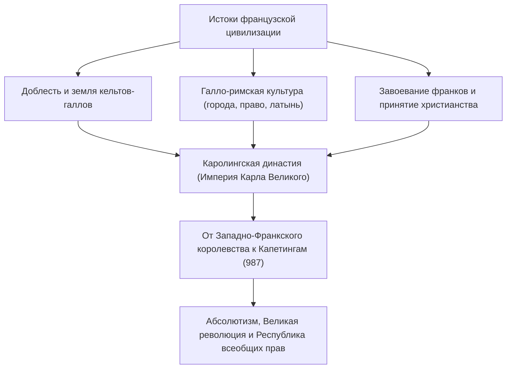
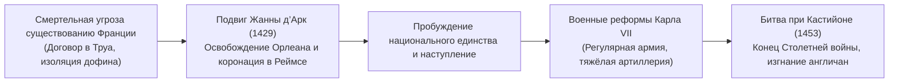
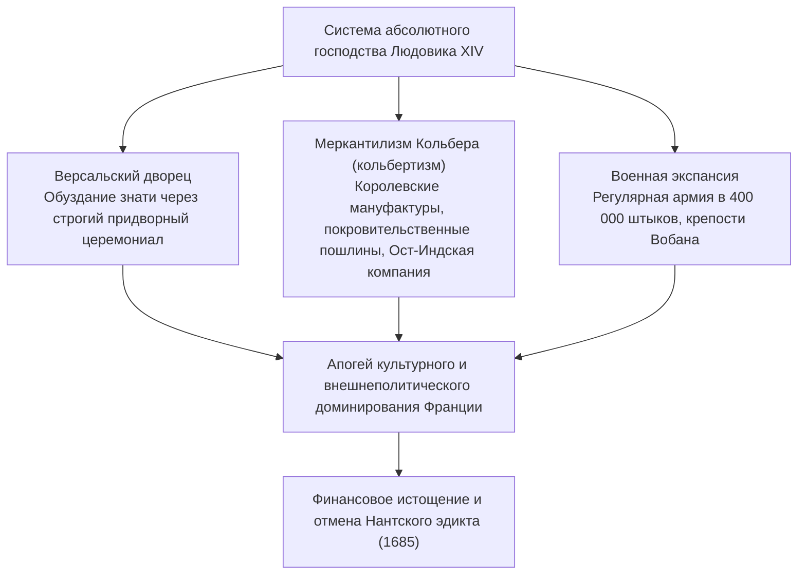
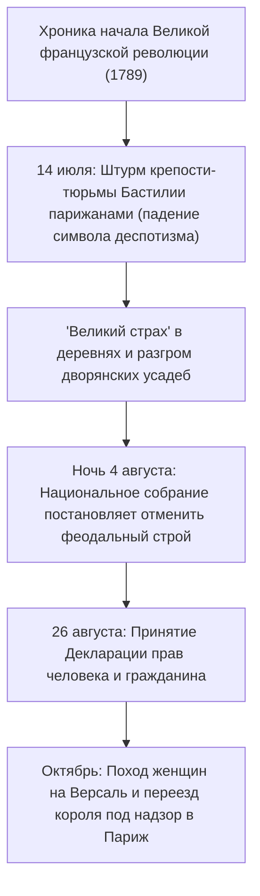
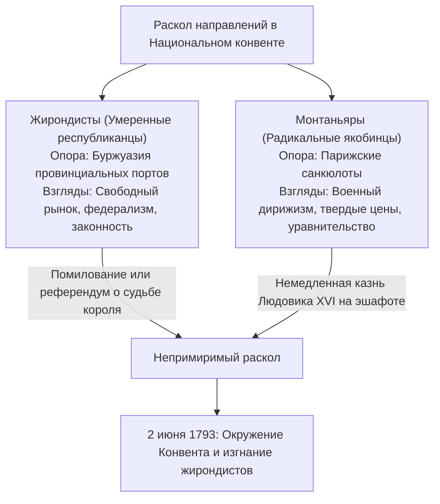

## 1. Введение: Французская цивилизация как сердце Европы

### 1.1 Галлы и «Записки о Галльской войне» Юлия Цезаря

На крайнем западе европейского континента раскинулся плодородный шестиугольник (L'Hexagone), омываемый водами Атлантического океана и Средиземного моря, очерченный рекой Рейн, горными грядами Пиренеев и Альп. Задолго до того, как эта земля обрела имя «Франция», она звалась «Галлией» (*Gallia*) — краем, населённым бесчисленными кельтскими племенами.

В период с 58 по 51 год до н. э. полководец Римской республики Гай Юлий Цезарь благодаря своему хладнокровному полководческому гению предпринял покорение всей Галлии. Бессмертный исторический труд самого военачальника — «Записки о Галльской войне» (*Commentarii de Bello Gallico*) — запечатлел воинскую доблесть галльских племён и сложную структуру их родоплеменного строя.

В 52 году до н. э. под предводительством молодого вождя арвернов Верцингеторига вспыхнуло общегалльское восстание против римского владычества. Однако в грандиозной битве при Алезии, где Цезарь возвёл беспрецедентные двойные фортификационные укрепления (внутреннюю циркумвалационную линию для блокады крепости и внешнюю контрвалационную для отражения деблокирующего войска), силы восставших были сломлены голодом и натиском легионов. Верцингеториг верхом выехал к шатру Цезаря, бросил к его ногам доспехи и сложил оружие.

Под властью Рима Галлия стремительно романизировалась, породив утончённую галло-римскую культуру с мощёными дорогами, акведуками (такими как Пон-дю-Гар) и монументальными амфитеатрами (Арль, Ним). Кельтские наречия растворились в народной латыни, ставшей колыбелью будущего французского языка. Трагедия Алезии явилась суровым крещением, в котором Франция родилась как старшая дочь классической латинской цивилизации.

---

### 1.2 Крещение Хлодвига, Франкское королевство и наследие Карла Великого

В V веке, на фоне крушения Западной Римской империи, салические франки форсировали Рейн и закрепились в северной Галлии. В 481 году основатель династии Меровингов **Хлодвиг I (Clovis I, годы правления 481–511)** сплотил племена и основал Франкское королевство.

Судьбоносным решением Хлодвига стало принятие христианства в католической (ортодоксально-никейской) традиции в 496 году в соборе Реймса. В то время как другие германские правители (вестготы, остготы, вандалы) исповедовали арианство, принятие Хлодвигом кафолического вероучения обеспечило королевской власти всецелую поддержку галло-римской сенаторской знати и епископата, заложив священную основу средневекового порядка в Западной Европе.

В VIII веке майордом Карл Мартелл остановил продвижение арабских армий в битве при Пуатье (732 г.). Его сын Пипин Короткий с благословения папы римского положил начало династии Каролингов. А при сыне Пипина, **Карле Великом (Charlemagne, годы правления 768–814)**, почти вся Западная Европа (территории современных Франции, Германии, Северной Италии и Нидерландов) объединилась в единую христианскую империю.

В праздник Рождества 800 года в базилике Святого Петра в Риме папа Лев III возложил на голову Карла императорскую корону, возродив Западную Римскую империю. Каролингское возрождение, возродившее изучение классической латыни и книжную культуру монастырей, зажгло светоч просвещения в раннем Средневековье.

Однако после кончины Карла Великого древнегерманский обычай раздела наследства между сыновьями расколол державу:
- **843 г.: Верденский договор**: Раздел империи на Западное, Срединное и Восточное королевства.
- **870 г.: Мерсенский договор**: Раздел Срединного королевства между восточными и западными франками.
Именно Западно-Франкское королевство (*Francia Occidentalis*) стало прямой исторической колыбелью Французского королевства.

---

## 2. Утверждение династии Капетингов и объединение земель

### 2.1 Избрание Гуго Капета (987 г.) и скромное начало

В 987 году, со смертью последнего представителя каролингского дома, собрание знати избрало королём графа Парижского **Гуго Капета (Hugues Capet)**, положив начало многовековой **династии Капетингов**.

В первые десятилетия реальная власть короны была ничтожной. Собственные владения монарха (*domaine royal*) ограничивались узкой полосой между Парижем и Орлеаном — регионом Иль-де-Франс. Могущественные герцоги Нормандии, Аквитании, Бургундии и графы Фландрии владели территориями и дружинами, многократно превосходившими силы монарха, относясь к королю лишь как к «первому среди равных» (*primus inter pares*).

Тем не менее Капетинги обладали двумя неоспоримыми преимуществами:
1. **Сакральное помазание святым елеем (*Sacre*)**: Коронуясь в Реймсском соборе, монарх обретал ореол божественной благодати (вера в чудодейственную силу королей исцелять золотуху прикосновением руки: *les rois thaumaturges*).
2. **Беспрерывная прямая преемственность по мужской линии**: На протяжении 340 лет (с 987 по 1328 год) династия непрерывно передавала престол от отца к старшему сыну, навечно закрепив принцип наследственной монархии.

---

### 2.2 Филипп II Август и триумфальное расширение державы

Монархом, приумножившим королевский домен в несколько раз и утвердившим статус подлинного «Короля Франции» (*Rex Franciae*), стал седьмой правитель династии — **Филипп II Август (Philippe Auguste, годы правления 1180–1223)**.

В то время английская династия Плантагенетов (Генрих II, Ричард Львиное Сердце и Иоанн Безземельный) владела Нормандией, Анжу и Аквитанией, создав колоссальную «Анжуйскую империю», заслонявшую владения французского монарха.

Воспользовавшись феодальными нарушениями Иоанна Безземельного, Филипп Август в 1204 году конфисковал и присоединил Нормандию, Анжу, Мэн и Турень.
27 июля 1214 года в грандиозной **битве при Бувине** французское рыцарство во главе с Филиппом разгромило коалицию Иоанна Безземельного, германского императора Оттона IV и графа Фландрского. Победа при Бувине изгнала англичан из северной Франции и вознесла авторитет французской короны на вершину европейской политики.

Филипп создал оплачиваемый чиновничий аппарат из городской буржуазии — бальи и сенешалей — для надзора за судом и сбором податей. Он провозгласил Париж постоянной столицей, воздвиг крепость Лувр, вымостил городские мостовые и возвёл мощные крепостные стены.

---

### 2.3 Филипп IV Красивый и подчинение папства (Ананьи и Авиньон)

В конце XIII века хладнокровный государственник **Филипп IV Красивый (Philippe IV le Bel, годы правления 1285–1314)** ускорил строительство централизованной бюрократии.

Чтобы пополнить казну для военных нужд, Филипп обложил налогами французское духовенство, что привело к острому столкновению с папой Бонифацием VIII, автором буллы *Unam Sanctam*, провозгласившей верховенство наместника Христа над всеми земными государями.
- **1302 г.: Первый созыв Генеральных штатов (*États généraux*)**: Король собрал в соборе Парижской Богоматери представителей духовенства, дворянства и горожан для национального сплочения против папских притязаний.
- **1303 г.: Инцидент в Ананьи**: Королевский легат Гийом де Ногаре ворвался в резиденцию папы в итальянском городе Ананьи и подверг понтифика оскорблениям (от потрясения Бонифаций VIII вскоре скончался).
- **1309–1377 гг.: Авиньонское пленение пап**: Филипп добился избрания французского кардинала Климента V и перенёс папский престол в Авиньон на юге Франции, удерживая римскую курию под контролем короны почти 70 лет.
- Кроме того, Филипп обвинил могущественный и баснословно богатый орден тамплиеров в ереси, распустил его и конфисковал все богатства в королевскую казну.

Универсалистские притязания средневекового Рима пали, знаменуя становление Франции как первого суверенного государства Европы.

---

### 2.4 Столетняя война и спасительный подвиг Жанны д’Арк

После угасания прямой ветви Капетингов на престол взошёл Филипп VI Валуа. В ответ английский монарх Эдуард III, внук Филиппа Красивого по материнской линии, заявил права на французскую корону, что привело к Столетней войне (1337–1453).

При Креси (1346 г.), Пуатье (1356 г., где король Иоанн II Добрый попал в плен) и Азенкуре (1415 г.) французская конница потерпела сокрушительные поражения от английских лучников. После перехода Бургундии на сторону англичан договор в Труа (1420 г.) объявил наследником французской короны английского короля Генриха V. Законный дофин Карл VII бежал за Луару в Бурж; само существование французского государства висело на волоске.

Весной 1429 года семнадцатилетняя крестьянская девушка из Домреми **Жанна д’Арк (Jeanne d'Arc)** явилась к дофину в замок Шинон. Объявив, что архангел Михаил поручил ей снять осаду с Орлеана и короновать дофина в Реймсе, она облачилась в белые латы и повела войска на помощь осаждённому городу.

Непоколебимая вера Орлеанской девы вселила небывалый порыв в сердца солдат. Всего за девять дней блокада Орлеана была снята, а Карл VII через вражеские заслоны был доставлен в Реймс для коронации. Несмотря на пленение в Компьене и сожжение на костре в Руане в 1431 году по сфабрикованному обвинению в ереси, зажжённое ею пламя патриотизма уже невозможно было угасить.

Карл VII упорядочил подати и создал **первую в европейской истории постоянную наёмную армию (ордонансовые роты: *Compagnies d'ordonnance*)** и грозную полевую артиллерию. В битве при Кастийоне (1453 г.) французские орудия разгромили английские войска: Столетняя война завершилась триумфом Франции и возвращением всех земель, кроме Кале.

---

## 3. От религиозных войн к вершинам абсолютизма Бурбонов

### 3.1 Раскол Реформации и Гугенотские войны (1562–1598)

В середине XVI века реформационное учение Жана Кальвина нашло горячий отклик среди городского сословия и дворянства; сторонников протестантизма во Франции стали называть **гугенотами**.

На фоне слабости престола вспыхнула трёхсотлетняя религиозная распря между ревностными католиками во главе с герцогами де Гиз и гугенотскими вождями из дома Бурбонов и адмиралом де Колиньи.
- **24 августа 1572 г.: Варфоломеевская ночь (St. Bartholomew's Day Massacre)**: По наущению королевы-матери Екатерины Медичи католические отряды устроили в Париже резню протестантской знати, собравшейся на свадьбу Генриха Наваррского. Кровавая бойня перекинулась на провинции, унеся десятки тысяч жизней.

Преодолеть братоубийственный раскол сумел вождь гугенотов и наследник престола **Генрих IV (Henri IV, годы правления 1589–1610)**, основатель династии Бурбонов.
Сказав легендарную фразу «Париж стоит мессы», он перешёл в католичество во имя мира и в **1598 году даровал Нантский эдикт**. Этот указ закрепил статус католицизма как государственной веры, но предоставил гугенотам свободу вероисповедания, гражданские права и крепости безопасности (включая Ла-Рошель). Разделение гражданской верности монарху и религиозной совести стало вехой на пути к современной веротерпимости.

---

### 3.2 Кардинал Ришелье: «Государственный интерес» и основы абсолютизма

После гибели Генриха IV от кинжала фанатика Равальяка бразды правления при юном Людовике XIII принял кардинал **Ришелье (Armand Jean du Plessis)**.

Краеугольным камнем философии Ришелье стал принцип **«государственного интереса» (*Raison d'État*)**: благо, единство и мощь государства стоят неизмеримо выше личных пристрастий, религиозных предрассудков и аристократических вольностей.
- Во внутренней политике он осадил и взял цитадель Ла-Рошель, лишив гугенотов военной самостоятельности (сохранив свободу богослужения), разрушил мятежные дворянские замки и наводнил провинции интендантами (*Intendants*) — королевскими наместниками, подотчётными лишь трону.
- Во внешней политике, будучи кардиналом Католической церкви, Ришелье ради сокрушения гегемонии австрийских и испанских Габсбургов без колебаний вступил в Тридцатилетнюю войну (1618–1648 гг.) в союзе с протестантскими князьями Германии и Швецией.

По условиям **Вестфальского мира 1648 года**, заключённого его преемником кардиналом Мазарини, Франция присоединила большую часть Эльзаса и стала сильнейшей державой на континенте.

---

### 3.3 Людовик XIV, «Король-солнце» (годы правления 1643–1715): «Государство — это я»

В 1661 году, после кончины Мазарини, 22-летний **Людовик XIV (Louis XIV)** объявил о единоличном правлении. Опираясь на доктрину божественного права монарха, сформулированную епископом Боссюэ, он довёл абсолютную монархию до апогея.

#### ① Версаль как инструмент политического подчинения
Возведённый к юго-западу от Парижа шедевр барокко — Версальский дворец с его Зеркальной галереей и геометрическими садами — служил грандиозным механизмом контроля.
Помня смуту Фронды (1648–1653 гг.), Король-солнце собрал всю мятежную аристократию при дворе, превратив гордых сеньоров в придворных льстецов, сражавшихся за право подать королю сорочку при пробуждении (*lever*) или отходе ко сну (*coucher*).

#### ② Кольбертизм и регулярная армия
Генеральный контролёр финансов Жан-Батист Кольбер насаждал политику меркантилизма («кольбертизм»), создавая государственные мануфактуры (гобелены, зеркала, фарфор) и защищая экспорт таможенными барьерами. Военный министр Лувуа создал армию численностью 400 000 солдат, а фортификатор маршал Вобан опоясал границы неприступной цепью бастионных крепостей.

#### ③ Цена величия: Отмена Нантского эдикта и разорение
Но чрезмерное честолюбие обернулось кризисом.
Бесконечные войны (Голландская война, Война за пфальцское наследство, Война за испанское наследство) истощили казну.
Фатальным ударом стал **эдикт Фонтенбло (1685 г.)**, отменивший Нантский эдикт. Заявив, что протестантов во Франции больше нет, король запретил кальвинистское богослужение. От 200 до 300 тысяч искусных ремесленников, купцов и банкиров бежали в Англию, Голландию и Пруссию, что нанесло сокрушительный удар по экономике и ознаменовало закат эпохи расцвета Бурбонов.

---

## 4. Эпоха Просвещения и буря Великой французской революции (1789–1799)

### 4.1 Кризис Старого порядка и пламя Просвещения

К концу XVIII века социальное устройство **Старого порядка (*Ancien Régime*)** зашло в глухой тупик:
- **Первое сословие (духовенство, ок. 100 тыс. человек)**: Владело 10% земель, взимало десятину и не платило прямых налогов.
- **Второе сословие (дворянство, ок. 400 тыс. человек)**: Располагало четвертью земельных угодий, пользовалось налоговым иммунитетом и монополизировало государственные должности и офицерские чины.
- **Третье сословие (простолюдины, ок. 25 млн человек, 98% населения)**: Несло на своих плечах всё налоговое бремя (талья, подушный оклад, габель, сеньориальные повинности), будучи полностью отстранено от управления.

Это общественное противоречие разоблачили мыслители **Просвещения (*Enlightenment*)**:
- **Вольтер**: Бичевал религиозный фанатизм и мракобесие, отстаивая свободу мысли и слова (дело Каласа).
- **Монтескьё**: В трактате «О духе законов» сформулировал принцип разделения властей как противоядие от тирании.
- **Жан-Жак Руссо**: В «Общественном договоре» провозгласил народовластие и верховенство «общей воли» (*volonté générale*).
- **Дидро и Д'Аламбер**: Создали монументальную «Энциклопедию», систематизировав научные знания для освобождения человеческого разума от предрассудков.

---

### 4.2 Взятие Бастилии и Декларация прав человека (1789 г.)

Расточительность Людовика XV, поражение в Семилетней войне и огромные затраты на поддержку Войны за независимость США опустошили королевскую казну. Когда привилегированные сословия отказались поступиться налоговыми льготами, Людовик XVI в мае 1789 года созвал Генеральные штаты — впервые за 175 лет.

Столкнувшись с отказом от посословного голосования, депутаты третьего сословия объявили себя **Национальным собранием (*Assemblée nationale*)**. Оказавшись перед запертыми дверями зала заседаний, они собрались 20 июня в Зале для игры в мяч и принесли знаменитую **Клятву в зале для игры в мяч**, поклявшись не расходиться, пока не утвердят конституцию.

Стягивание наёмных полков к Парижу и отставка популярного министра Неккера привели к народному взрыву.

Принятая 26 августа 1789 года **Декларация прав человека и гражданина** утвердила незыблемые основы современного общества:
1. **«Все люди рождаются свободными и равными в правах.»** (Статья 1)
2. **«Источником суверенной власти является нация.»** (Статья 3)
3. Неотъемлемые естественные права: свобода, собственность, безопасность и сопротивление угнетению.
4. Равенство перед законом, презумпция невиновности, свобода слова и совести, неприкосновенность частной собственности.

---

### 4.3 Падение трона и эпоха якобинского террора

Революция стремительно радикализировалась. В июне 1791 года попытка короля бежать за границу, сорванная в Варенне (**Вареннский кризис**), окончательно подорвала веру народа в монархию.
В ответ на угрозу австро-прусской интервенции (Пильницкая декларация) в апреле 1792 года Франция объявила войну. В Париж хлынули отряды добровольцев, распевавшие боевой гимн Рейнской армии — будущую «Марсельезу».

- **Восстание 10 августа 1792 года**: Вооружённые санкюлоты и федеstatus взяли штурмом Тюильри, свергнув монархию. Избранный Национальный конвент провозгласил **Первую республику**.
- **21 января 1793 года**: Людовик XVI был гильотинирован на площади Революции (ныне площадь Согласия) за измену нации; в октябре та же участь постигла Марию-Антуанетту.

В условиях наступления интервентов и крестьянского восстания в Вандее власть сосредоточилась в руках Комитета общественного спасения во главе с Максимилианом Робеспьером.

Провозгласив, что **«террор без добродетели губителен, а добродетель без террора бессильна»**, якобинцы развязали **эпоху Террора (*La Terreur*)**. Жертвами гильотины стали около 40 000 человек — от дворян до умеренных жирондистов и соратников Дантона.
Несмотря на спасение республики через всеобщую воинскую повинность (*levée en masse*), диктатура террора вызвала панику в Конвенте. В результате **Термидорианского переворота 9 термидора II года (27 июля 1794 г.)** Робеспьер был арестован и на следующий день казнён, положив конец террору.

---

## 5. Взлёт Наполеона Бонапарта и Первая империя

### 5.1 Восстановитель порядка: От 18 брюмера к императорскому венцу

Сменившая якобинцев Директория погрязла в казнокрадстве и интригах. Общество требовало твёрдой руки для наведения порядка и защиты завоеваний революции. Таким лидером стал корсиканский генерал **Наполеон Бонапарт (1769–1821)**.

Прославившись при осаде Тулона и в Итальянском походе (1796–1797 гг.), Наполеон совершил 9 ноября 1799 года **переворот 18 брюмера**, упразднил Директорию и стал Первым консулом.

Главным историческим деянием Наполеона стало **претворение идей революции в прочную ткань законов и государственных институтов**:
1. **Гражданский кодекс (Кодекс Наполеона, 1804 г.)**: Закрепил равенство перед законом, секуляризацию брака, свободу договоров и священное право частной собственности. Он стал фундаментом континентального права во всём мире.
2. **Государственные институты**: Учреждение Банка Франции, введение стабильного франка жерминаль, создание государственной системы лицеев и экзамена на бакалавриат, учреждение ордена Почётного легиона.
3. **Конкордат 1801 года**: Примирение с папой Пием VII вернуло католицизму статус религии большинства французов, но церковь осталась под финансовым и административным контролем государства.

2 декабря 1804 года в соборе Парижской Богоматери Наполеон взял корону из рук папы и сам возложил её себе на голову, став **Наполеоном I, императором французов** (Первая империя).

---

### 5.2 Покорение Европы и крушение в снегах России

Опираясь на Великую армию (*Grande Armée*), набиравшуюся по всеобщей повинности и маневрировавшую с молниеносной быстротой, Наполеон покорил континент:
- **1805 г.: Битва при Аустерлице (битва трёх императоров)**: Разгром русско-австрийских войск повлёк ликвидацию тысячелетней Священной Римской империи и создание Рейнского союза.
- **1806 г.: Разгром Пруссии**: Победа при Йене и триумфальный въезд в Берлин.

Однако Англия, владычица морей после Трафальгара (1805 г.), оставалась непокорённой. В ответ Наполеон провозгласил **Континентальную блокаду (1806 г.)**, закрыв для британских товаров все европейские порты.

Когда Россия нарушила блокаду, возобновив торговлю с Лондоном, Наполеон в июне 1812 года во главе 600-тысячной армии вторгся в пределы Российской империи.
Фельдмаршал Кутузов применил тактику выжженной земли, оставив Москву пожарам. На обратном пути при 30-градусном морозе, под ударами казаков, мороза и голода Великая армия перестала существовать. Спастись удалось лишь жалким остаткам войск.

Пробуждённое Наполеоном национальное самосознание народов обернулось против него. Разгромленный в «Битве народов» при Лейпциге (1813 г.), он отрёкся от престола в 1814 году и был сослан на Эльбу. Возвращение на «Сто дней» окончилось поражением при **Ватерлоо (1815 г.)** от Веллингтона и Блюхера. Заточенный на скалистом острове Святой Елены, Наполеон скончался в мае 1821 года.

---

## 6. Цикл революций XIX века: От Реставрации до Парижской коммуны

Венский конгресс вернул трон Бурбонам в лице Людовика XVIII (Реставрация). Однако французское общество, вкусившее гражданского равенства, уже не могло вернуться в оковы деспотизма. XIX век стал грандиозной лабораторией смены форм правления: монархии, империи и республики.

### 6.1 Июльская революция (1830 г.) и Февральская революция (1848 г.)

- **1830 г.: Июльская революция («Три славных дня»)**: Попытка Карла X отменить конституционные свободы вызвала восстание парижан (сюжет полотна Делакруа «Свобода, ведущая народ»). Карл бежал, а трон занял Луи-Филипп Орлеанский — «король-гражданин» (Июльская монархия, власть верхушки финансовой буржуазии).
- **1848 г.: Февральская революция**: Рост рабочего класса в ходе промышленного переворота и требование всеобщего избирательного права свергли монархию. Была провозглашена **Вторая республика**. Закрытие учреждённых Луи Бланом «национальных мастерских» для безработных привело к трагическому Июньскому восстанию, жестоко подавленному армией.

---

### 6.2 Вторая империя Наполеона III и перестройка Парижа

На президентских выборах 1848 года победу одержал племянник великого полководца **Луи-Наполеон Бонапарт**.
В декабре 1851 года он совершил государственный переворот, а в 1852 году провозгласил себя императором **Наполеоном III** (Вторая империя: 1852–1870 гг.).

Наполеон III поручил префекту Сены барону Осману **радикальную перестройку Парижа**:
- Были снесены трущобы и узкие средневековые улочки, удобные для баррикад.
- Проложены широкие прямые бульвары, лучами расходящиеся от Триумфальной арки, создана система канализации, газового освещения и общественных парков (Булонский лес).
- Современный облик Парижа как великолепного «Города света» родился именно в эту эпоху.

Однако авантюрная внешняя политика ввергла Францию в 1870 году во **Франко-прусскую войну**. Катастрофа при Седане, где Наполеон III сдался в плен вместе с армией, привела к мгновенному крушению Второй империи.

---

### 6.3 1871 год: Подвиг и трагедия Парижской коммуны

Возмущённые немецкой осадой и капитуляцией буржуазного правительства Адольфа Тьера, рабочие и Национальная гвардия Парижа отказались сдать оружие.
28 марта 1871 года перед Ратушей была провозглашена **Парижская коммуна (Commune de Paris)** — первое в истории рабочее правительство.

- Коммуна приняла смелые преобразования: отделение церкви от государства, запрет детского труда, передача брошенных заводов в руки рабочих кооперативов и упразднение постоянной армии.
- Правительство Тьера при содействии Бисмарка начало штурм Парижа.
- В ходе **«Кровавой майской недели» (21–28 мая 1871 г.)** около 20 000 коммунаров были расстреляны (в том числе у Стены коммунаров на кладбище Пер-Лашез), а десятки тысяч отправлены на каторгу в колонии.

---

## 7. От Третьей республики к мировым войнам, де Голлю и современности

### 7.1 Прекрасная эпоха и торжество светскости (Лаицизм)

Возникшая на пепелище Коммуны **Третья республика (1870–1940 гг.)** оказалась самым долговечным строем современной Франции, просуществовав 70 лет.
Период до 1914 года остался в памяти как **«Прекрасная эпоха» (Belle Époque)**: возведение Эйфелевой башни к выставке 1889 года, триумф импрессионизма и рождение кинематографа благодаря братьям Люмьер.

Тягчайшим кризисом рубежа веков стало **«Дело Дрейфуса» (1894 г.)**. Ложное обвинение еврейского офицера Альфреда Дрейфуса в шпионаже в пользу Германии побудило писателя Эмиля Золя опубликовать манифест **«Я обвиняю…!» (*J'accuse…!*)**. Общество раскололось на реакционеров-антисемитов и республиканцев, защищавших права человека.

Победа сторонников Дрейфуса привела к принятию исторического **Закона о разделении церквей и государства 1905 года**. Принцип **лаицизма (*Laïcité*)** — полного вытеснения религиозного влияния из государственных институтов и школ — стал краеугольным камнем французской гражданской нации.

---

### 7.2 Испытание мировыми войнами и Сопротивление де Голля

- **Первая мировая война (1914–1918 гг.)**: Немецкое наступление было остановлено в битве на Марне. Ценой колоссальных потерь в окопной войне (битва при Вердене — 700 000 жертв) Франция победила, потеряв 1,4 млн сыновей и получив разрушенные северные департаменты.
- **Разгром 1940 года и режим Виши**: В мае 1940 года танковые клинья вермахта обошли линию Мажино через Арденны. За шесть недель Франция капитулировала. Маршал Петен создал в Виши коллаборационистский марионеточный режим.

18 июня 1940 года вылетевший в Лондон бригадный генерал **Шарль де Голль** обратился к нации по радио BBC:
> **«Разве сказано последнее слово? Разве надежда должна угаснуть? Разве поражение окончательно? Нет! […] Что бы ни случилось, пламя французского Сопротивления не должно угаснуть и не угаснет!»**

Сплотив за рубежом «Свободную Францию» и объединив партизанские сети через Жана Мулена, де Голль добился освобождения Парижа в 1844 году. Франция триумфально вошла в число держав-победительниц, получив статус постоянного члена Совета Безопасности ООН.

---

### 7.3 Пятая республика и суверенная дипломатия де Голля

Когда Четвёртая республика зашла в тупик парламентских склок и кризиса войны в Алжире (1954–1962 гг.), страна в 1958 году призвала де Голля.

Де Голль принял конституцию **Пятой республики (Cinquième République)** с сильной президентской властью, избираемой всенародно:
- **Признание независимости Алжира (Эвианские соглашения, 1962 г.)**: Окончание колониальной эпохи.
- **Создание ядерных сил сдерживания (*Force de frappe*)**: Отказ от слепого подчинения ядерному зонтику США.
- **Голлистская внешняя политика**: Выход из военной структуры НАТО в 1966 году, признание КНР в 1964 году и отстаивание многополярного мира.

События **«Красного мая» 1968 года**, соединившие студенческие протесты и забастовку 10 миллионов рабочих, разрушили патриархальный уклад, открыв путь современной эпохе феминизма, экологии и личных свобод.

---

## 4.5 В недрах революции: Борьба жирондистов с монтаньярами и «Декларация прав женщины»

Идейное противостояние в Национальном конвенте (1792–1795 гг.) стало фундаментальной битвой за модель государства:

### ① Олимпия де Гуж и «Декларация прав женщины и гражданки»
Декларация 1789 года, провозглашая всеобщность, наделяла активными правами лишь мужчин-собственников.
Драматург **Олимпия де Гуж (1748–1793)** опубликовала в 1791 году манифест **«Декларация прав женщины и гражданки» (*Déclaration des droits de la femme et de la citoyenne*)**, бросив вызов мужскому лицемерию революционеров:

> **«Женщина рождается свободной и равной мужчине в правах.»**
> **«Если женщина имеет право всходить на эшафот, она должна иметь право всходить и на трибуну.»**

Она потребовала для женщин избирательных прав и равного права собственности. Однако якобинцы обвинили её в измене и отправили на гильотину в 1793 году. Её манифест предвосхитил идеи Симоны де Бовуар («Второй пол») и всего современного феминизма.

---

## 5.3 Военное искусство Наполеона: Система армейских корпусов и оперативное искусство

Победы Наполеона над коалициями превосходящих сил базировались на революции в военном искусстве (*Operational Art*):

1. **Создание общевойсковых корпусов (*Corps d'Armée*)**:
   - Вместо единой неповоротливой армейской массы Наполеон разделил армию на автономные корпуса по 20–30 тысяч бойцов, включавшие пехоту, кавалерию, артиллерию и сапёров.
   - Каждый корпус мог в одиночку сдерживать превосходящие силы неприятеля от 24 до 48 часов.
   - **«Порознь маршировать, вместе сражаться»**: Корпуса шли параллельными дорогами с высокой скоростью, снабжаясь на месте, и стремительно сходились во фланг или тыл противника в день генерального сражения.
2. **Стратегия центральной позиции и концентрации**:
   - При сближении армий противника с двух направлений Наполеон врезался клином между ними, разрывая их связь.
   - Сковывая одну армию заслоном, он обрушивал всю мощь на другую, разбивая коалицию по частям.

---

## 7.4 Мучительная деколонизация: Дьенбьенфу и Алжирская война (1954–1962 гг.)

После 1945 года распад второй по величине колониальной империи мира стал тяжелейшим потрясением для нации:
### ① Финал войны в Индокитае: Крах при Дьенбьенфу (1954 г.)
Во Вьетнаме против партизан Хо Ши Мина французское командование создало укреплённую базу в котловине Дьенбьенфу.
Однако генерал Во Нгуен Зяп вручную поднял сотни орудий на горные хребты. После двух месяцев осады гарнизон пал, вынудив Францию уйти из Индокитая по Женевским соглашениям.

### ② Алжирская трагедия и рождение Пятой республики
Алжир считался неотъемлемой частью Франции, где жили более миллиона европейцев (*Pieds-Noirs*). В 1954 году Фронт национального освобождения (FLN) поднял восстание.
- Массовые пытки и бессудные расправы парашютистов в битве за Алжир вызвали нравственный протест французских интеллектуалов во главе с Жан-Полем Сартром.
- Мятеж генералов и поселенцев в 1958 году, грозивший высадкой десанта в Париже, сокрушил Четвёртую республику и вернул к власти де Голля.
- Проявив реализм и пережив покушения праворадикалов из OAS, де Голль подписал в 1962 году **Эвианские соглашения**, признав независимость Алжира.

---

## 7.5 Интеллектуальный взрыв и культурное государство (Сартр, Камю, Мальро)

После 1945 года Франция оставалась признанной мировой столицей философии и искусства.

### ① Титаны экзистенциализма: Раскол Сартра и Камю
В кафе Сен-Жермен-де-Пре экзистенциализм покорил умы человечества:
- **Сартр («Бытие и ничто»)**: «Существование предшествует сущности». Человек обречён на свободу и утверждает себя через политическое действие (*engagement*). Сартр оправдывал насилие во имя революции.
- **Камю («Бунтующий человек»)**: Камю категорически отвергал оправдание гибели живых людей абстрактными идеологиями. Разрыв мыслителей стал центральной моральной дискуссией XX века.

### ② Андре Мальро и создание Министерства культуры (1959 г.)
Писатель Андре Мальро на посту первого министра культуры заложил основы государственной культурной политики:
- Провозгласил цель: **«Сделать величайшие творения человечества доступными наибольшему числу французов»**.
- Создал сеть Домов культуры (*Maisons de la Culture*) в провинциях.
- Организовал очистку фасадов исторических зданий Парижа от вековой копоти и принял закон о сохранении исторических кварталов (Закон Мальро).

---

## 7.6 Эпоха Миттерана и отмена смертной казни (1981 г.)

В 1981 году Франсуа Миттеран стал первым президентом-социалистом Пятой республики, проведя масштабные реформы.

### ① Робер Бадентер и ликвидация гильотины (1981 г.)
Франция дольше всех в Западной Европе сохраняла казнь на гильотине (последняя состоялась в 1977 году).
Министр юстиции Робер Бадентер вопреки общественному мнению добился в парламенте отмены смертной казни:
> **«Правосудие не может быть убийством. Отказ государства от права лишать человека жизни — высшее утверждение человеческого достоинства.»**

### ② Социальные завоевания
- Сокращение рабочей недели до 39 часов (позже до 35 часов при Жоспене).
- Пятая неделя оплачиваемого отпуска; повышение минимального размера оплаты труда (SMIC).
- Законы о децентрализации, передавшие полномочия регионам от назначаемых префектов.

### ③ Эмманюэль Макрон и стратегический суверенитет Европы
Избранный в 2017 году в возрасте 39 лет, Эмманюэль Макрон разрушил классическую партийную систему. В Сорбоннской речи он выдвинул концепцию **Европейского стратегического суверенитета (*Souveraineté européenne*)**, призывая ЕС укреплять автономию в обороне, технологиях и энергетике, продолжая традицию голлизма в XXI веке.

---

## 8. Заключение: Вечный светоч Свободы, Равенства и Братства

Каждый, кто изучает историю Франции, поражается её **неустанному стремлению к универсализму (*Universalisme*)**.

Французская цивилизация через горнило философии, литературы, искусства и революционных бурь всегда искала ответы на фундаментальные вопросы человеческого бытия: что есть свобода и каким должно быть справедливое общество.

Триединый девиз революции — **«Свобода, Равенство, Братство» (*Liberté, Égalité, Fraternité*)** — сияет сегодня в основах конституций всех свободных демократий мира.

Несмотря на споры о светскости, европейской интеграции и социальных движениях вроде «жёлтых жилетов», французский дух сохраняет верность критическому разуму. Этот благородный путь и есть бесценное наследие Франции для всего человечества.
