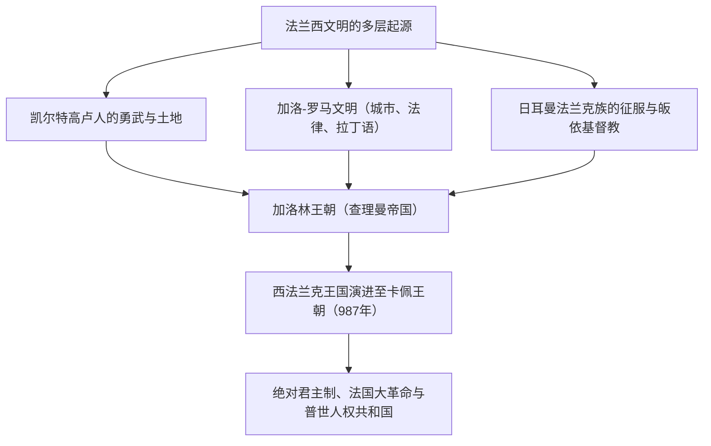
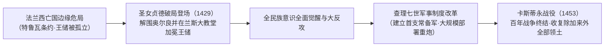
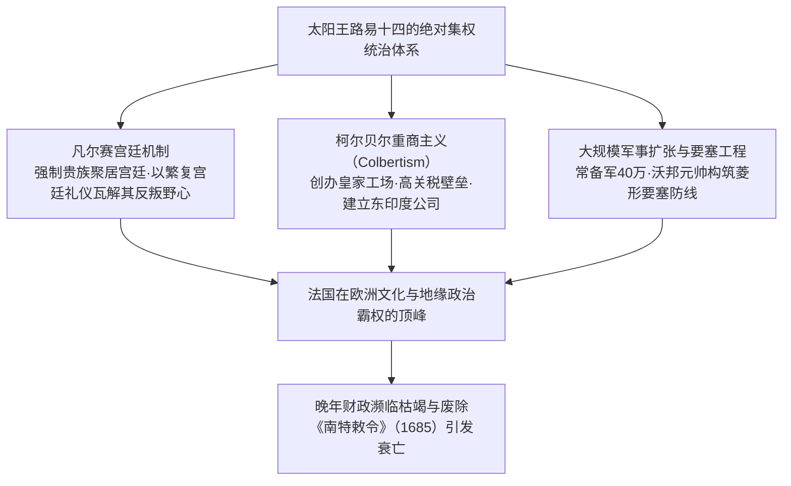
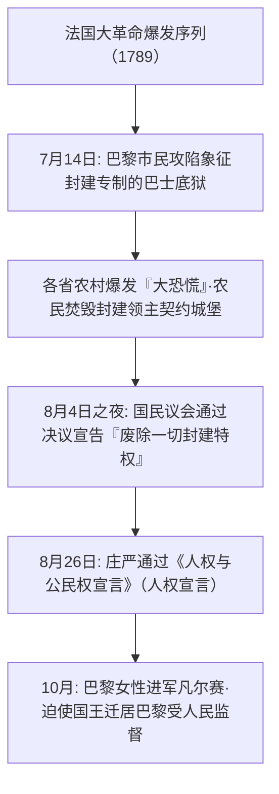
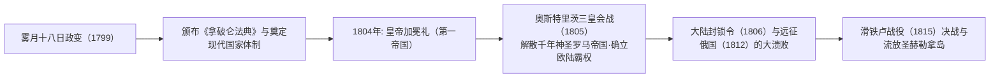
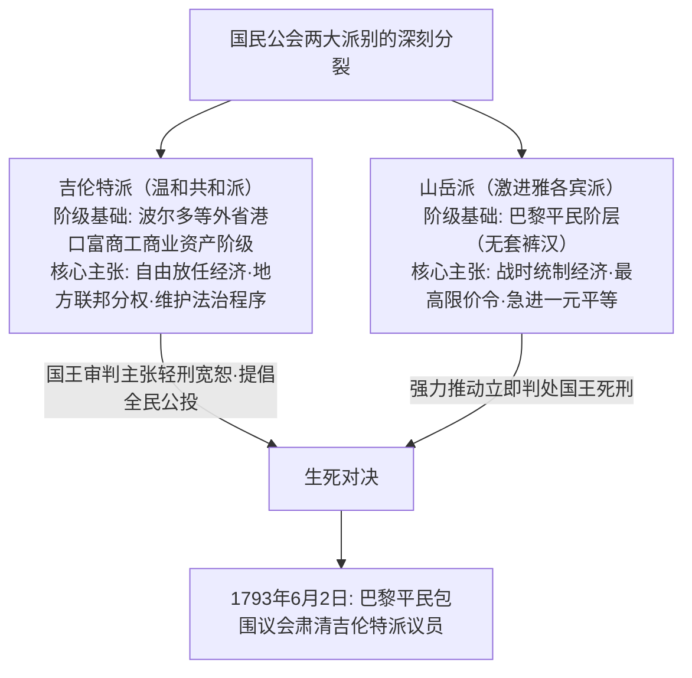

## 1. 引言：作为欧洲心脏的法兰西文明

### 1.1 高卢人与恺撒的《高卢战记》

在欧洲大陆的最西端，大西洋、地中海、莱茵河、比利牛斯山脉和阿尔卑斯山脉环抱着一块肥沃的六边形土地（L'Hexagone）。在这片土地被称为“法兰西”之前，它是凯尔特各部族割据纷争的“高卢”（Gallia）。

公元前58年至公元前51年，罗马统帅盖乌斯·尤利乌斯·恺撒凭借其冷酷卓越的军事天才，展开了对整个高卢的征服征程。恺撒亲笔写下的不朽经典《高卢战记》（Commentarii de Bello Gallico），翔实记录了当时高卢人的勇猛剽悍与部落社会的生态机制。

公元前52年，在阿维尔尼部族年轻领袖维钦托利（Vercingetorix）的号召下，全高卢部族结成同盟，爆发了反抗罗马统治的空前大起义。然而，在著名的“阿莱西亚之战”（Battle of Alesia）中，恺撒构筑了前所未有的双重包围阵地（内层包围城池、外层阻击援军），高卢联军在粮尽与猛攻之下彻底溃败。维钦托利单骑走出阵营，将武器掷于恺撒帐前，俯首投降。

纳入罗马统治版图的高卢迅速拉丁目化，罗马大道、高架引水道（如加尔桥）以及圆形竞技场（阿尔勒、尼姆）拔地而起，形成了独具特色的“加洛-罗马文化”（Gallo-Roman）。古凯尔特语逐渐消亡，通俗拉丁语在此生根发芽，成为日后“法语”的母体。阿莱西亚的惨败，宛如一场阵痛式的洗礼，催生了作为古典拉丁文明长女的法兰西国家雏形。

---

### 1.2 克洛维皈依、法兰克王国与查理曼的遗产

公元5世纪，随着西罗马帝国的瓦解崩溃，属于日耳曼部族分支的萨利安法兰克人跨过莱茵河，向北高卢挺进。公元481年，墨洛温王朝奠基人**克洛维一世（Clovis I，在位481–511年）**统一各部族，正式建立了法兰克王国。

克洛维最具远见卓识的重大决断，是于公元496年在兰斯大教堂受洗，皈依罗马天主教（阿塔纳修派基督教）。当时其他绝大多数日耳曼民族（东哥特、西哥特、汪达尔等）均信奉被视为异端分子的阿里乌斯派，而克洛维对天主教正统教义的接纳，使法兰克王权赢得了高卢罗马旧贵族与教会阶层的全力支持，一举确立了其作为西欧中世纪秩序缔造者的无上合法性。

公元8世纪，宫相查理·马特在图尔-普瓦捷战役（732年）中击溃阿拉伯伊斯兰大军北进；其子矮子丕平在教皇支持下开创了加洛林王朝。而在丕平之子**查理大帝（查理曼: Charlemagne，在位768–814年）**统治时期，西欧绝大部分版图（包括现代法国、德国、意大利北部和低地国家）被整合进一个统一的基督教帝国。

公元800年圣诞节，在罗马圣伯多禄大殿，教皇利奥三世为查理曼加冕，重塑了“西罗马皇帝”尊号。加洛林文艺复兴大力复兴古典拉丁文与修道院学术文化，为中世纪欧洲点亮了理性的微光。

然而，查理大帝去世后，日耳曼传统的诸子均分继承法导致帝国走向分裂：
- **公元843年《凡尔登条约》**: 帝国被一分为三，即西法兰克、中法兰克与东法兰克。
- **公元870年《墨尔森条约》**: 东西两王国瓜分了中法兰克的大部分领地。
其中，西法兰克王国（Francia Occidentalis）正是后来“法兰西王国”（France）最直接的历史前身。

---

## 2. 卡佩王朝的崛起与领土统一进程

### 2.1 于格·卡佩登基（987年）与微末的起点

公元987年，加洛林直系血脉断绝，法兰西各路封建大领主推选巴黎伯爵**于格·卡佩（Hugues Capet）**为王，由此开启了统治法国达数百年的**“卡佩王朝”（Capetian Dynasty）**。

初期的卡佩王权孱弱至极。国王能够直接控制的王室直辖领地（Domaine royal），仅仅局限于巴黎与奥尔良周边被称为“法兰西岛”（Île-de-France）的狭窄地带。诸如诺曼底公爵、阿基坦公爵、佛兰德伯爵、勃艮第公爵等大诸侯，其领土版图与军队实力皆远迈王室，仅把国王视作“同侪之首”（Primus inter pares）而虚与委蛇。

然而，卡佩王室牢牢掌握着两项决定性的制度优势：
1. **圣油涂抹受洗的加冕圣礼（Sacre）**: 国王在兰斯大教堂接受圣油涂抹与教皇使节加冕，被赋予受命于天的“神圣君主”神秘权威，甚至民间坚信国王之手能通过抚摸治愈瘰疬病（奇迹之王信仰）。
2. **长子继承制的奇迹般延续**: 自987年至于1328年的340余年间，卡佩王朝未曾有一代断绝直系男嗣，使得世袭君权在潜移默化中不可逆转地根深蒂固。

---

### 2.2 腓力二世（奥古斯都）与王室领土的剧增

真正让王室直辖领地翻倍扩张、确立“法兰西国王”（Rex Franciae）崇高威权的，是第七任君主**腓力二世（Philippe Auguste，在位1180–1223年，尊称为奥古斯都/尊严王）**。

彼时，英格兰金雀花王朝（亨利二世、理查一世、无地王约翰）凭借联姻与继承，掌控着安茹、诺曼底、阿基坦等广袤疆土，在法国境内构筑了规模远超法国国王领地的“安茹帝国”。

腓力二世敏锐抓住无地王约翰施政紊乱及违抗封建法律的破绽，于1204年果断下达没收令，兵不血刃般兼并了诺曼底、安茹、曼恩与图赖讷。
1214年7月27日，在决定性的**“布汶战役”（Battle of Bouvines）**中，腓力二世亲率法兰西军，与无地王约翰结盟的神圣罗马帝国皇帝奥托四世及佛兰德伯爵联军爆发决战。法军大获全胜，粉碎了英德反法同盟，将英格兰势力基本逐出法国北部，使法兰西王权的欧陆政治声望登峰造极。

同时，腓力二世从新兴市民阶层中选任受薪官吏（王室代官法官：Bailli与Sénéchal），建立起直属于王室的司法与财税官僚体制。他正式将巴黎定为固定首都，修建卢浮宫要塞，铺设城市石板路并修筑护城城墙。

---

### 2.3 腓力四世与压制罗马教皇权（阿纳尼事件与阿维农之囚）

13世纪末，铁腕现实主义君主**腓力四世（Philippe IV le Bel，在位1285–1314年，美男子）**进一步深化了集权官僚制。

为筹措对外战争军费，腓力四世强行向法国教士征税，与宣称“教皇权力凌驾于世间一切世俗君王”的教皇卜尼法斯八世爆发剧烈冲突。
- **1302年：首度召开三级会议（États généraux）**: 腓力四世在巴黎圣母院召集教士（第一等级）、贵族（第二等级）和城市市民（第三等级）代表，借此凝聚国民共识以对抗罗马教廷。
- **1303年：阿纳尼事件**: 腓力派遣重臣诺加雷突袭教皇在意大利阿纳尼的行宫，拘捕并羞辱了卜尼法斯八世（教皇受惊愤懑而死）。
- **1309–1377年：阿维农之囚**: 腓力四世扶植法国籍教皇克雷芒五世，强行将教廷迁往法国南部的阿维农，使教皇在近70年间沦为法国王权的附庸与政治工具。
- 此外，腓力四世将富可敌国的圣殿骑士团罗织异端罪名彻底取缔，将其全部财富没收充公进入王室国库。

中世纪跨国界的普世教权自此跌落神坛，法兰西显露出欧洲第一个近代“主权国家”（Sovereign State）的硬核轮廓。

---

### 2.4 百年战争与圣女贞德的奇迹

卡佩直系绝嗣后，瓦卢瓦王朝的腓力六世登基。英格兰国王爱德华三世依凭母亲为腓力四世之女的血缘关系，公开要求继承法兰西王位，于1337年引爆了持续百年的漫长战争。

在克雷西战役（1346年）、普瓦捷战役（1356年法王约翰二世被俘）和阿金库尔战役（1415年）中，骄横的法兰西重装骑士在英格兰长弓兵的弹幕下遭遇毁灭性惨败。勃艮第公国倒向英格兰，1420年签订的《特鲁瓦条约》甚至剥夺了法兰西王储查理的继承权，改奉英王亨利五世为法国王位继承人。正统王储查理七世被逼退守至卢瓦尔河以南的布尔日，法兰西面临亡国灭种的悬崖边缘。

1429年春，来自东北部栋雷米村落的十六岁农家少女**圣女贞德（Jeanne d'Arc）**来到希农城堡求见查理七世。她宣告自己受大天使米迦勒的天启神谕，誓要解救奥尔良之围，护送王储前往兰斯加冕。身着白色铠甲的贞德跃马挥旗，直奔被围困危殆的要塞奥尔良。

贞德无与伦比的坚定信仰激发出法军火山喷发般的战斗意志，仅用九天便彻底击溃围城英军，随后护送查理七世穿过敌境，在兰斯大教堂庄严完成加冕典礼。虽然后来贞德在康边不幸被俘，遭宗教裁判所罗织异端罪名，于1431年被焚死于鲁昂广场，年仅19岁，但她点燃的法兰西爱国主义烈火已不可熄灭。

查理七世以此为契机大举整肃国家财政，摆脱对贵族私兵的依赖，建立了**欧洲首支正规常备军（敕令军: Compagnies d'ordonnance）**并组建了强大的炮兵兵团。在1453年的卡斯蒂永战役中，法军大炮彻底粉碎英军阵线，百年战争以法兰西收复除加来以外的全部领土宣告全胜结束。

---

## 3. 从胡格诺宗教战争到波旁绝对君主制顶峰

### 3.1 宗教改革冲击与胡格诺战争（1562–1598）

16世纪中叶，法国本土神学家让·加尔文创立的归正宗新教神学迅速在法国工商业阶层和部分贵族中间传播开来，这些新教徒被称为**“胡格诺”（Huguenots）**。

在王权衰退与幼君即位的动荡期，天主教极端势力的首领吉斯家族与新教胡格诺派领袖波旁家族（纳瓦拉王室）及科利尼海军上将之间，爆发了长达三十余载的血腥内战——胡格诺战争。
- **1572年8月24日：圣巴多罗买大屠杀（St. Bartholomew's Day Massacre）**: 在王太后凯瑟琳·德·美第奇策划推动下，巴黎军警与天主教暴民趁夜突袭聚集在城内参加婚礼的新教领袖与信众，屠杀迅速蔓延全国，造成数万新教徒横尸街头。

挽救这个陷入宗教狂热与内耗深渊之国家的，正是胡格诺派领袖、在瓦卢瓦王朝绝嗣后继任法王的波旁王朝始祖**亨利四世（Henri IV，在位1589–1610年）**。
为了实现民族和解，他审时度势地说出“巴黎值得一场弥撒”，毅然改信天主教以抚平大多数国民的情绪，并于**1598年颁布具有里程碑意义的《南特敕令》（Edict of Nantes）**。敕令在维护天主教为国教的同时，正式赋予胡格诺新教徒信仰自由、民事权利以及在部分设防城市（如拉罗谢尔）驻军的自卫特权。国家为了政治整合而承认公民个人的信仰自由，成为近代宗教宽容制度的先声。

---

### 3.2 黎塞留的“国家理性”与绝对王权奠基

在亨利四世被天主教狂热分子刺杀身亡后，辅佐幼主路易十三执掌大权的，是拥有钢铁般冷静理智的宰相**黎塞留红衣主教（Cardinal de Richelieu）**。

黎塞留政治哲学的核心支柱是**“国家理性”（Raison d'État）**——即国家主权、统一与国家利益的至高性，必须凌驾于个体的道德说教、宗教狂热及贵族特权之上。
- 在对内统治上，他历经围困攻克了新教军事大本营拉罗谢尔，剥夺其政治军事特权（仅保留宗教信仰自由）；同时严令摧毁叛服无常的贵族城堡，向全国各省派驻直属于国王的行政监察官（Intendant），实现了中央对地方政务与财税的严密直接管控。
- 在对外战略上，作为天主教会红衣主教的黎塞留，却在德意志三十年战争（1618–1648年）中毫不犹豫地与新教德意志诸侯及瑞典结盟，东西夹击痛击宿敌哈布斯堡家族（奥地利与西班牙天主教同盟）。

其继任者马扎然枢机主教主持签署的1648年**《威斯特伐利亚和约》**，为法国夺得阿尔萨斯大部领地，确立了法国在欧陆无人撼动的霸主地位。

---

### 3.3 太阳王路易十四（在位1643–1715年）：“朕即国家”

1661年马扎然离世，年仅22岁的**路易十四（Louis XIV）**宣布不再设立宰相，开启由君主亲自独揽政柄的“亲政”。他以波舒哀主教的“君权神授说”为理论依据，将摆脱世俗制约的绝对君主专制推向了人类历史的极致。

#### ① 凡尔赛宫作为权力规训机器
位于巴黎西南郊的凡尔赛宫，是巴洛克建筑艺术的巅峰。宏伟的镜厅、工整严谨的法国古典园林、金碧辉煌的宫室，其功能远非单供帝王享乐。
经历了幼年投石党之乱（1648–1653年）的大贵族叛乱洗礼，路易十四将全法国的大贵族尽数召入凡尔赛宫定居，用争夺为国王起床（Lever）穿衣递鞋等琐碎微小的虚荣恩宠，彻底消弭了封建大领主的政治反抗意志。

#### ② 柯尔贝尔的重商主义与精锐常备军
财政大臣让-巴蒂斯特·柯尔贝尔推行强硬的重商主义政策，扶植戈夫兰挂毯、镜面玻璃、精美陶瓷等皇家手工工场，鼓励对外高附加值出口并施加保护性关税。陆军大臣卢瓦组建了达40万之众的欧陆最庞大常备正规军，天才军事工程师沃邦元帅更在王国漫长边境线上修筑起坚不可摧的几何星形要塞防御链（铁壁防线）。

#### ③ 荣耀的代价：废除《南特敕令》与国力衰竭
然而盛极必衰。
路易十四晚年深陷连绵无休的霸权战争（遗产战争、法荷战争、大同盟战争、西班牙王位继承战争），国库财富被消耗殆尽。
最为致命的政治倒退，是1685年签署的**《枫丹白露敕令》（彻底废除《南特敕令》）**。他宣布法国已无新教徒，严厉取缔新教信仰。导致20万至30万最为勤勉精明的工商业精英、航海家、银行家和技工逃离法国，流亡至荷兰、英国与普鲁士，重创了法国制造业根基，敲响了绝对君主制的末路丧钟。

---

## 4. 启蒙思想与法国大革命（1789–1799）的狂飙

### 4.1 旧制度的危机与启蒙理性的爆发

18世纪的法国社会，深陷在中世纪残存的三级身份制度——**“旧制度”（Ancien Régime）**的窒息枷锁之中：
- **第一等级（教士，约10万人）**: 垄断全国10%的优质土地，独享免税特权。
- **第二等级（贵族，约40万人）**: 占有全国20–25%的土地，坐享免税优待，独揽政府高级官职、法官与军队将领要职。
- **第三等级（平民，约2500万人，占总人口98%）**: 独自背负着繁重苛捐杂税（土地税、人头税、盐税、什一税以及封建劳役），在政治决策上却毫无发言权。

针对这种荒诞不经的体制弊病，18世纪的**启蒙运动（Enlightenment）**投下了震撼人心的理性火种：
- **伏尔泰**: 以犀利锋芒的讽刺笔触猛烈抨击教会的专横与狂热，积极呼吁言论自由与宽容法治（著名的卡拉斯案再审平反）。
- **孟德斯鸠**: 在《论法的精神》中系统阐发立法、行政、司法三权分立制衡理论，为瓦解专制主义提供了法理武器。
- **让-雅克·卢梭**: 在《社会契约论》中倡导“主权在民”，提出法律应代表全体自由个体的“公意”（Volonté générale）。
- **狄德罗与达朗贝尔**: 编纂鸿篇巨制《百科全书》，向蒙昧社会广泛播撒科学、实证与理性精神。

---

### 4.2 攻占巴士底狱与《人权宣言》（1789年）

路易十五的骄奢淫逸、七年战争的惨败，加上路易十六向北美独立战争倾注的巨额军费贷款，使法国国库陷入彻底崩溃。当特权阶级极力抵制财政大臣内克尔等人的征税改革时，路易十六被迫于1789年5月在凡尔赛召集了已中断175年的三级会议。

由于在表决方式（是按等级表决还是按人头表决）上僵持不下，第三等级代表毅然宣布成立代表全体国民唯一合法代议机构的**“国民议会”（Assemblée nationale）**。在被国王关闭会场后，代表们移步室内网球场，庄严立下“在制定出宪法之前绝不解散”的**“网球厅宣誓”**。

随着路易十六调集正规军包围巴黎并罢免改革派内克尔，巴黎市民的愤怒彻底点燃。

1789年8月26日通过的**《人权与公民权宣言》（Declaration of the Rights of Man and of the Citizen）**（由拉法耶特起草主持），确立了人类文明史上具有永久普世意义的核心法则：
1. **“人生而自由，在权利上始终平等。”**（第一条）
2. **“一切主权的本原，根本上存在于国民之中。”**（第三条：人民主权）
3. 自由、财产、安全以及反抗压迫是不可剥夺的天赋自然权利。
4. 法律面前人人平等、罪刑法定、无罪推定、言论信仰自由，以及神圣不可侵犯的财产权。

---

### 4.3 废黜王权与断头台下的恐怖统治

然而，革命迅速滑向急剧激进化的深渊。
1791年6月，路易十六携王后玛丽·安托瓦内特试图潜逃出境投靠外国反动势力，却在边境小镇瓦雷纳被民兵识破截回（**瓦雷纳逃亡事件**），国王在国民心中的声誉荡然无存。
面对奥地利和普鲁士联合发表威胁革命政权的皮尔尼茨宣言，法国于1792年4月对奥宣战。全国各地志愿军奔赴前线，他们高唱的进军战歌《马赛曲》，日后成为了法国国歌。

- **1792年8月10日起义**: 巴黎无套裤汉市民与义勇军攻占杜伊勒里宫，正式废黜国王。国民公会旋即成立，正式宣布废除君主制，建立**法兰西第一共和国**。
- **1793年1月21日**: 路易十六以“叛国罪”在革命广场（今协和广场）被推上断头台处决；同年10月王后玛丽·安托瓦内特亦被送上断头台。

面对反法同盟兵临城下、旺代地区爆发大规模反革命农民暴动以及恶性通货膨胀，罗伯斯庇尔领导的激进雅各宾派掌控了救国委员会。

罗伯斯庇尔信奉**“没有美德的恐怖是毁灭性的，没有恐怖的美德是软弱无力的”**，全面开启了腥风血雨的**“恐怖统治”（La Terreur）**。王后、吉伦特派领袖乃至呼吁宽容的丹东等约4万人被处死。
雅各宾派实行全面物价管制、全国总动员全民征兵以及激进的非基督教化革命历法，虽然挽救了军事危局，但其人人自危的极端恐怖引发了资产阶级内部的强烈恐慌。1794年7月27日（**热月9日政变**），罗伯斯庇尔被国民公会合力逮捕推上断头台，恐怖统治戛然而止。

---

## 5. 拿破仑·波拿巴的崛起与第一帝国

### 5.1 秩序恢复者：从雾月政变到加冕称帝

热月政变后的督政府充斥着贪腐无能与混乱党争，面对内外危机束手无策，法国社会普遍渴望一位既能恢复稳定秩序、又能捍卫大革命成果的强有力领袖。科西嘉岛出身的炮兵天才军官**拿破仑·波拿巴（Napoléon Bonaparte，1769–1821年）**应运而生。

土伦战役崭露头角、意大利战役（1796–1797年）连挫奥军威震全欧后，拿破仑于1799年11月9日发动**“雾月十八日政变”**，推翻督政府，建立执政府并亲任第一执政。

拿破仑的伟大功绩，在于他不仅是一位军事征服者，更将**大革命的核心原则凝固为现代国家的法典与永恒体制**：
1. **《法国民法典》（拿破仑法典，1804年）**: 确认法律面前人人平等、宗教信仰自由、契约自由、私有财产神圣不可侵犯以及世俗婚姻家庭法制。它是大陆法系的顶峰集大成者，成为近现代世界绝大多数国家民法的蓝本。
2. **现代行政与教育体制**: 组建法兰西银行、稳定金法郎货币体系，创办高度集权世俗的国家教育体系（公立中学、学区大学与高中毕业会考制Baccalauréat），创立法国荣誉军团勋章。
3. **1801年教务专约**: 与教皇庇护七世达成妥协，宣布天主教为“大多数国民的宗教”，但坚决拒绝退还被收归国有的教会地产，将教会完全纳入国家管理秩序之中。

1804年12月2日，在巴黎圣母院的加冕典礼上，拿破仑亲手从教皇庇护七世手中拿过皇冠戴在自己头上，正式成为**“法兰西人的皇帝拿破仑一世”**（法兰西第一帝国）。

---

### 5.2 横扫欧陆的辉煌与远征俄国的崩溃

依靠全民兵役制所激发的磅礴兵源动员力，以及拿破仑超绝的大军团协同与高机动穿插战术，法军所向披靡。
- **1805年：奥斯特里茨战役（三皇会战）**: 拿破仑以精妙绝伦的诱敌战术全歼俄皇亚历山大一世与神圣罗马帝国皇帝弗朗茨二世的联军，彻底终结了延续千年的神圣罗马帝国（改组建立莱茵邦联）。
- **1806年耶拿战役**: 击溃普鲁士王国，昂首骑兵进驻柏林。

然而，掌握着制海权的英国始终是拿破仑难以征服的死敌。特拉法尔加海战（1805年）法西联合舰队惨败于纳尔逊将军后，拿破仑于1806年颁布**《大陆封锁令》（柏林敕令）**，严禁欧陆各国与英国开展任何商贸往来。

面对公然打破封锁令、私自向英国出口粮食的沙皇俄国，拿破仑于1812年夏天亲率60余万大军发动了远征俄国的浩大战争。
然而，俄军统帅库图佐夫采取坚壁清野战略并主动焚毁莫斯科。在俄国广袤无垠的冻原上，零下三十度的极度严寒、粮食匮乏与哥萨克骑兵的袭扰，将这支不可一世的大军葬送于冰天雪地中。最终生还撤出的法军残部不足数万人。

拿破仑曾经作为“封建制度解放者”唤醒了欧洲各民族的民族意识，如今反遭觉醒的各民族联手围攻。1813年莱比锡民族会战告负，拿破仑被迫退位流放厄尔巴岛。1815年他奇迹般潜回巴黎展开“百日王朝”，但在**滑铁卢战役**中惜败于威灵顿公爵与布吕歇尔元帅率领的反法联军。拿破仑最终被流放至南大西洋孤岛圣赫勒拿，于1821年赍恨离世。

---

## 6. 19世纪革命浪潮的轮回：从波旁复辟到巴黎公社

拿破仑倒台后，维也纳会议扶植路易十八重登王位（波旁复辟王朝）。然而尝过自由与平等滋味的法国人民，绝不再甘心屈从于封建专制的枷锁。整个19世纪，法国成为君主制、帝制与共和政体激烈交替的“政治制度大试验场”。

### 6.1 七月革命（1830年）与二月革命（1848年）

- **1830年：七月革命（光荣的三日）**: 查理十世推行极端倒退的专制法令激怒巴黎市民，工人和学生筑起街垒发动武装暴动（德拉克罗瓦经典画作《自由引导人民》的历史现场）。查理十世落荒而逃，自由派大贵族推举奥尔良公爵路易·菲利普为“法兰西人的国王”（七月王朝 / 金融大资产阶级的统治）。
- **1848年：二月革命**: 随着工业革命纵深发展，日益壮大的产业工人阶级为争取普选权发动起义。路易·菲利普退位，**法兰西第二共和国**成立。空想社会主义者路易·勃朗入阁并创办救济失业工人的“国家工场”，但保守派掌权后将其强行关闭，引爆了悲壮的六月起义并遭到残酷流血镇压。

---

### 6.2 拿破仑三世的第二帝国与巴黎大改造

在混乱政局中，拿破仑的侄儿**路易-拿破仑·波拿巴**凭借其叔父的崇高声望，在1848年总统大选中以压倒性优势当选。
1851年12月他发动军事政变解散议会，次年正式登基称帝，史称**拿破仑三世**（法兰西第二帝国：1852–1870年）。

拿破仑三世全权委任塞纳省长奥斯曼男爵，大刀阔斧推行了载入史册的**“巴黎大改造”**工程：
- 彻底拆毁了中世纪遗留下来的肮脏逼仄、极易被叛军筑起街垒的狭窄小巷。
- 以凯旋门为中心开辟出呈放射状分布的宏伟林荫大道（Boulevards），修建了全套现代地下给排水网络、煤气路灯系统与开阔的公共绿地公园（如布洛涅森林）。
- 如今闻名遐迩、令全球游客叹为观止的“花都巴黎”典雅城市风貌，正是在这一时期彻底奠定的。

然而，在对外卷入克里米亚战争、支持意大利统一战争以及灾难性的墨西哥远征后，1870年拿破仑三世落入俾斯麦的陷阱，盲目挑起**普法战争**。在色当会战中法军一败涂地，拿破仑三世沦为俘虏，第二帝国轰然坍塌。

---

### 6.3 1871年：巴黎公社的悲壮史诗

普鲁士大军围困巴黎并迫使梯也尔资产阶级临时政府签订屈辱投降条约，巴黎的工人阶级与国民自卫军毅然拒绝缴械。
1871年3月28日，在巴黎市政厅广场前，宣告成立了**人类历史上第一个无产阶级民主自治政权——巴黎公社（Commune de Paris）**。

- 巴黎公社颁布了一系列震撼世界的民主先驱政策：政教分离、废除童工、没收逃亡资本家工厂交由工人自治管理、实行公职人员薪酬限额以及废除常备军。
- 逃亡凡尔赛的临时政府军队在普鲁士军队的战俘释放协助下，向巴黎发起毁灭性反扑。
- 在5月21日至28日的**“流血周”（La Semaine sanglante）**中，公社战士浴血奋战在每一道街垒，最终约两万名公社战士惨遭处决屠杀（拉雪兹神甫公墓的“公社社员墙”），数万人被流放至海外殖民地集中营。

---

## 7. 从第三共和国、两次世界大战到戴高乐与第五共和国

### 7.1 美好年代与世俗化立法的确立

在一片血泊中诞生妥协建立的**第三共和国（1870–1940年）**，最初看似脆弱不堪，却成为了法国近代存续时间最长（长达70年）的共和政体。
19世纪末至1914年间，法国充分享受着工业繁荣与和平生活，这个黄金时期被后世由衷赞颂为**“美好年代”（Belle Époque）**。埃菲尔铁塔为1889年巴黎世博会拔地而起，印象派艺术百花齐放，卢米埃尔兄弟发明了现代电影。

这一时期法国内部最深层的政治震荡，是**“德雷福斯事件”（1894年）**。犹太裔陆军上尉阿尔弗雷德·德雷福斯蒙冤被军方判定为德国间谍，针对军部偏见与反犹主义狂潮，文学巨匠埃米尔·左拉在《黎明报》头版发表了振聋发聩的公开信**《我控诉…！》（J'accuse…!）**。全法国就此撕裂为捍卫军队国家威权的保守派与捍卫人权真理的德雷福斯派共和派。

最终洗雪冤屈的共和派彻底巩固了政权，并于1905年颁布了举世闻名的**《政教分离法》（世俗化法，Loi de 1905）**。法律确立了宗教全面退出公共教育与政治空间的原则，国家不承认、不资助任何宗教，将信仰严格归还给个人私域。这一**“世俗主义”（Laïcité）**原则，构成了现代法兰西国家价值观念的坚实基石。

---

### 7.2 两次世界大战的炼狱与戴高乐的抵抗运动

- **第一次世界大战（1914–1918年）**: 德军大举突入法国，法军在马恩河战役挽狂澜于既倒。经过凡尔登战役（伤亡70余万人）等极其惨烈的堑壕绞杀战，法国最终赢得了战争胜利，但付出了北部工业区夷为平地、140万青年战死沙场的惨绝代价。
- **第二次世界大战溃败与维希伪政权（1940年）**: 纳粹德国装甲兵团实施“闪击战”绕过耗费巨资修建的“马奇诺防线”，开战仅六周法国军队便土崩瓦解。一战功勋贝当元帅在南部维希建立起对德妥协附庸的傀儡政权。

1940年6月18日，只身飞抵伦敦的国防部次长**夏尔·戴高乐（Charles de Gaulle）**将军，通过英国BBC电台向全球法国同胞发出了彪炳史册的广播演说：
> **“难道所有的希望都破灭了吗？难道失败已成定局了吗？不！……无论发生什么，法兰西抵抗运动的火焰决不能熄灭，也决不会熄灭！”**

戴高乐在伦敦组建“自由法国”，并派出让·穆兰等特工潜回本土，整合了包括共产党游击队在内的地下抵抗运动。1944年诺曼底登陆后，巴黎在起义中解放，戴高乐带领法国以战胜国姿态屹立，奇迹般夺得了联合国安理会五大常任理事国之一的崇高席位。

---

### 7.3 第五共和国的创立与独立自主的外交哲学

战后的第四共和国因政党纷争内耗严重，加之阿尔及利亚独立战争（1954–1962年）引发军方兵变，国家濒临内战解体边缘。1958年，处于危机中的国民再次恳请戴高乐出山执政。

戴高乐主导全面修改宪法，确立了以直接普选产生、拥有强大实权的大总统制为核心的**“法兰西第五共和国”（Cinquième République）**：
- **承认阿尔及利亚独立（1962年《埃维昂协议》）**: 终结旧殖民帝国包袱。
- **打造完全自主的核威慑力量（打击力量: Force de frappe）**: 坚拒彻底依赖美国的核保护伞。
- **践行“戴高乐主义”独立外交**: 1966年宣布退出北约军事一体化机构、1964年率先承认中华人民共和国、公开抨击美国介入越南战争，坚定奉行捍卫国家独立与倡导国际多极化的外交路线。

在**1968年“五月风暴”**中，巴黎大学生起义与全国千万工人大罢工交织在一起，传统的威权保守道德体系被打破，推动法国全面迈入当代个人主义、女权主义与生态意识繁荣的新社会。

---

## 4.5 革命深处的思想交锋：吉伦特派与山岳派的博弈及《女性权利宣言》

法国大革命国民公会（1792–1795年）内部的残酷政争，绝非单纯的权力倾轧，而是关乎建国哲学根本方向的决裂碰撞。

### ① 奥兰普·德古热与《女性与女性公民权利宣言》
1789年通过的《人权宣言》，字面上使用全人类名义，在实际操作中却将“积极公民”政治权利严格局限于有产阶级男性，实为一份“男权宣言”。
女剧作家**奥兰普·德古热（Olympe de Gouges，1748–1793年）**于1791年愤然发表了著名的**《女性与女性公民权利宣言》（Déclaration des droits de la femme et de la citoyenne）**，对男性革命家的虚伪提出了掷地有声的控诉：

> **“女性生而自由，在权利上与男性平等。”**
> **“既然女性有权登上断头台，那么她同样应当有权登上演讲台！”**

她大声疾呼女性选举权、同等财产权与接受教育权，将婚姻重新定义为男女平等的民事契约。然而当时的雅各宾派男性革命领袖视其为大逆不道，罗伯斯庇尔以“遗忘自身性别、妄图颠覆国家”为罪名，于1793年将她推上了断头台。德古热的超前思想，成为了20世纪西蒙娜·德·波伏娃《第二性》等现代女性主义哲学的至高起点。

---

## 5.3 拿破仑军事思想的跨时代革新：军团制与机动作战艺术

拿破仑之所以能在欧陆战场上屡破数倍于己的敌国反法联军，根本秘密在于其对军事组织体制和作战艺术（Operational Art）的颠覆性革新。

1. **诸兵种合成“军团制”（Corps d'Armée）的创举**:
   - 拿破仑打破了传统军队作为一个臃肿大方阵缓慢推进的弊端，将数十万大军细分为各个独立自足的**“军团”（每个军团约2万至3万人）**，各自配备专属步兵、骑兵、炮兵与工兵。
   - 每个军团都能凭借诸兵种协同能力，独立抗击优势敌军一至两天的正面猛攻。
   - **“分进合击”（March divided, fight united）**: 各军团沿着不同公路以惊人速度分散推进（就地征粮以轻装急进），在决战发起时突然以雷霆万钧之势集结到敌军侧翼或后方，达成局部绝对优势兵力。
2. **内线作战与兵力绝对集中原理**:
   - 当面对从两个不同战略方向包抄逼近的联军（如奥军与俄军）时，拿破仑会率领主力以闪电机动切入两军结合部，切断其相互联络。
   - 派遣一支精干牵制部队阻击其中一路，自己则集中全军主力以雷霆之势击破另一路，随后回师再战，实现各个击破。

---

## 7.4 去殖民化的剧痛：奠边府与阿尔及利亚战争（1954–1962）

第二次世界大战结束后，对法国社会撕裂最深的一道伤口，是其全球第二大殖民帝国的惨痛崩解。

### ① 印度支那战争的终局：奠边府战役（1954年）
在越南战场，面对胡志明领导的越盟游击战，法国远征军选择在奠边府山谷盆地建立空降设防基地，企图引诱越盟展开正规决战。
然而，武元甲大将指挥数十万军民，纯凭人力将数百门重型大炮拆解搬上密林丛生的险峻山巅，构筑起俯瞰法军工事的严密炮兵阵地。在历时两个月的猛烈炮击与壕堑包围下，法军守军全军覆没投降。此役迫使法国彻底撤出东南亚，日内瓦协定随之确认了越南的南北分裂。

### ② 阿尔及利亚战争与第五共和国诞生的阵痛
自1830年以来，阿尔及利亚就并非普通殖民地，而是被法律定义为“法国本土省份”，居住着超过100万欧洲裔移民（黑脚: Pieds-Noirs）。1954年阿尔及利亚民族解放阵线（FLN）爆发全面武装起义。
- 法军伞兵部队为镇压阿尔及尔的城市反抗网络，实施了系统性的残酷刑讯逼供和法外处决（阿尔及尔之战），在萨特等法国内外知识分子群体中激起了巨大的道德声讨浪潮。
- 坚决反对阿尔及利亚独立的驻军军官团与极端殖民者于1958年在阿尔及尔发动军事叛乱，威胁空降占领巴黎，逼停了第四共和国并请出戴高乐重新出山。
- 戴高乐最终顺应时代大势，冒着遭遇极右翼秘密军组织（OAS）多次暗杀的生死风险，于1962年签署**《埃维昂协议》**，正式承认阿尔及利亚独立主权。

---

## 7.5 当代法国思想的迸发与文化国家的构筑（萨特、加缪、马尔罗）

二战后的法国，在地缘军事层面退居二线，却在“全球文化思想之都”的殿堂上绽放出了不可替代的璀璨光芒。

### ① 存在主义双子星：萨特与加缪的世纪决裂
在巴黎左岸圣日耳曼德佩区的双偶咖啡馆与花神咖啡馆里，让-保罗·萨特与阿尔贝·加缪的存在主义哲学（Existentialism）风靡世界。
- **萨特《存在与虚无》**: 提出“存在先于本质”，认为人并不具备预先设定的宿命，必须通过自我意志的选择与积极介入社会政治（Engagement）来确立自我。萨特倾向马克思主义，在一定程度上认可革命进步所伴随的暴力代价。
- **加缪《反抗者》**: 阿尔及利亚贫民出身的加缪，坚决反对任何打着崇高乌托邦旗号屠杀牺牲具体个人生命的极权主义暴行。
- 两人的决裂，成为了20世纪关于自由、正义、伦理与暴力最为深邃经典的哲学论战。

### ② 安德烈·马尔罗与“文化部”的奠基（1959年）
在戴高乐总统支持下出任法国首任文化部长的著名作家安德烈·马尔罗（André Malraux），开创了近代主权国家的国家文化政策典范：
- 提出**“国家必须将人类最高艺术成就从特权精英手中解放，普及给最广大法国人民”**的宪章式理念。
- 在外省遍设“文化之家”（Maison de la Culture）。
- 启动对巴黎全城历史古建筑外立面的高压冲洗工程（拂去工业烟尘重焕历史光芒），并通过《马尔罗法》开创历史街区整体保护制度，将文化遗产保护提升至国家主权高度。

---

## 7.6 密特朗的社会民主改革与死刑废除（1981年）

1981年，弗朗索瓦·密特朗（François Mitterrand）当选第五共和国首位社会党籍总统，开启了左翼执政联盟的深刻社会民主主义改革。

### ① 罗贝尔·巴丹泰与彻底废除死刑（1981年9月）
法国大革命以来保留的断头台死刑传统延续了两个世纪，是西欧最后一个依然执行死刑的国家（最后一次断头台斩首迟至1977年）。
司法部长罗贝尔·巴丹泰（Robert Badinter）顶住多数国民民意支持保留死刑的重重阻力，在国民议会发表了载入史册的雄辩演讲，促使废除死刑法案以绝对优势获得通过：
> **“司法绝不能是屠杀。断然拒绝国家剥夺公民生命的权力，是对人类尊严的最高确认。”**

### ② 劳动保障与社会福利的根本性扩张
- 缩短法定工作时间（从每周40小时减至39小时，日后若斯潘政府进一步推行“35小时工作制”）。
- 全民带薪年假延长至每年5周，大幅调高法定最低工资（SMIC）和家庭津贴。
- 实施重大地方分权法案（德费尔法），削减中央任命省长的行政特权，向省和各大区民选议会大幅下放地方自治权力。

### ③ 马克龙与21世纪“欧洲主权”新构想
2017年以39岁之龄当选法国历史上最年轻总统的埃马纽埃尔·马克龙（Emmanuel Macron），打破了传统左右两党轮流执政的格局。在索邦大学的著名演讲中，面对中美大国博弈及俄乌冲突的地缘变局，马克龙提出建设**“欧洲战略主权”（Souveraineté européenne / 战略自主）**的宏大主张，推动欧洲共同防御与产业自立，续写戴高乐主义在21世纪全球多极化浪潮中的时代新篇。

---

## 8. 结语：自由、平等、博爱的永恒之光

回眸法兰西民族波澜壮阔的通史，世人无不为其血液中流淌的**“对普世性（Universalism）的极致追求”**所震撼。

法兰西文明从不仅满足于维护狭隘的本土经验，而是通过哲学批判、文学巨著、艺术觉醒与革命风暴，反复叩问关乎全人类命运的根本命题——何为自由之真谛，何为正义之社会。

法国大革命锻造的**“自由（Liberté）、平等（Égalité）、博爱（Fraternité）”**三色旗崇高理想，早已深植于现代全球民主宪政的核心脉络之中。

尽管当代法国仍直面世俗主义与多元社会的磨合裂变、欧盟一体化与国家主权的拉锯阵痛，但凭借理性探索自我重塑的精神力量，法兰西历史赋予人类的崇高遗产，必将在时光长河中熠熠生辉。
