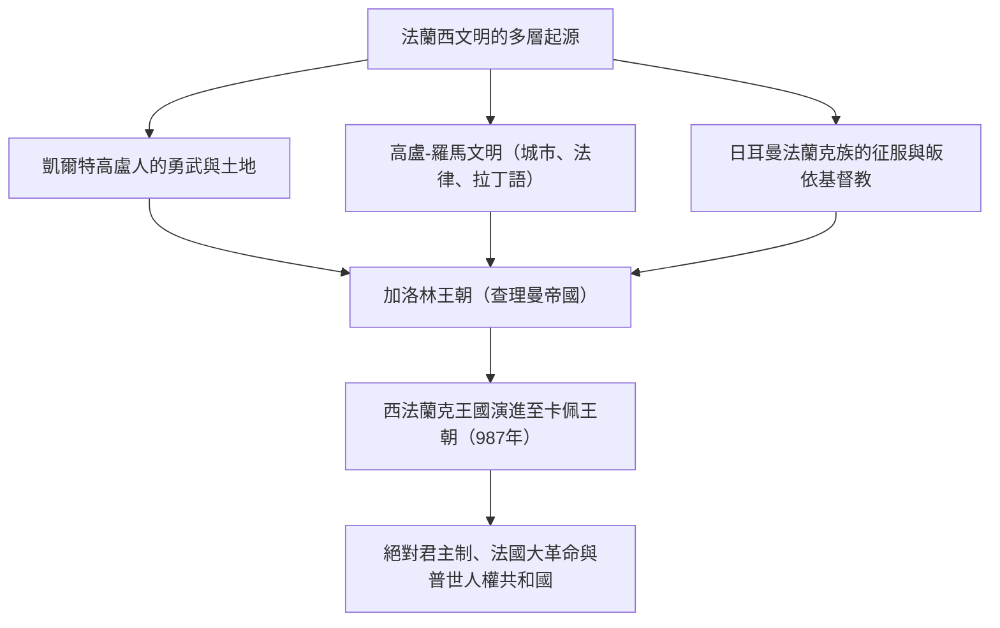
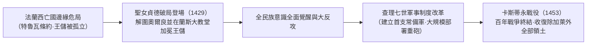
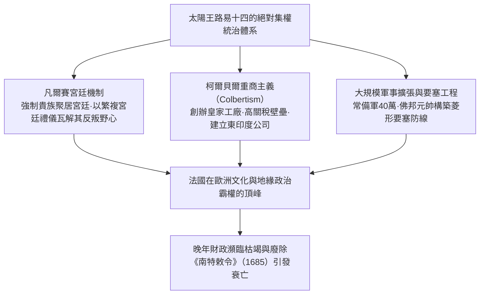
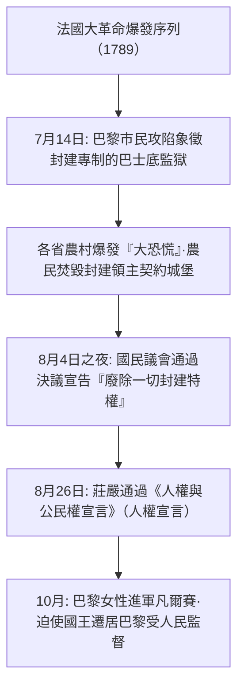
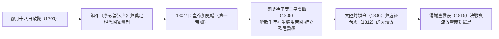
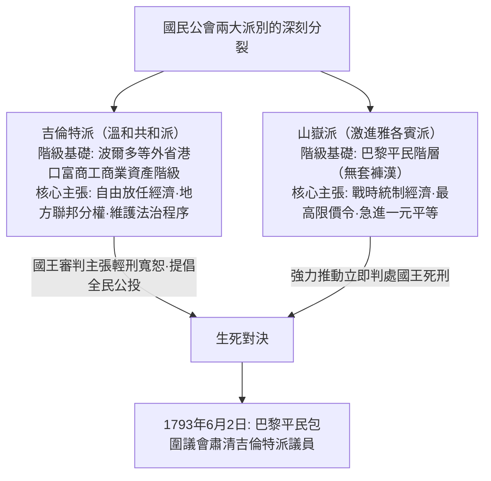

## 1. 引言：作為歐洲心臟的法蘭西文明

### 1.1 高盧人與凱撒的《高盧戰記》

在歐洲大陸的最西端，大西洋、地中海、萊茵河、庇里牛斯山脈與阿爾卑斯山脈環抱著一塊肥沃的六邊形土地（L'Hexagone）。在這片土地被稱為「法蘭西」之前，它是凱爾特各部族割據紛爭的「高盧」（Gallia）。

西元前58年至西元前51年間，羅馬最高統帥蓋烏斯·尤利烏斯·凱撒憑藉其冷酷卓越的軍事天才，展開了對整個高盧的征服征程。凱撒親筆撰寫的不朽經典《高盧戰記》（Commentarii de Bello Gallico），翔實記錄了當時高盧人的勇猛剽悍與部落社會的生態面貌。

西元前52年，在阿維爾尼部族年輕領袖維欽托利（Vercingetorix）的號召下，全高盧部族結成同盟，爆發了反抗羅馬統治的空前大起義。然而，在著名的「阿萊西亞之戰」（Battle of Alesia）中，凱撒構築了前所未有的雙重包圍陣線（內層包圍城池、外層阻擊援軍），高盧聯軍在糧盡與猛攻之下徹底潰敗。維欽托利單騎走出陣營，將兵刃投擲於凱撒帳前，俯首投降。

納入羅馬統治版圖的高盧迅速拉丁化，羅馬大道、高架引水道（如嘉德水道橋）以及圓形競技場（亞爾、尼姆）拔地而起，形成了獨具特色的「高盧-羅馬文化」（Gallo-Roman）。古凱爾特語逐漸消亡，通俗拉丁語在此生根發芽，成為日後「法語」的母體。阿萊西亞的慘敗，宛如一場陣痛式的洗禮，催生了作為古典拉丁文明長女的法蘭西國家雛形。

---

### 1.2 克洛維皈依、法蘭克王國與查理曼的遺產

西元5世紀，隨著西羅馬帝國的崩潰解體，屬於日耳曼部族分支的薩利安法蘭克人跨過萊茵河，向北高盧挺進。西元481年，墨洛溫王朝奠基人**克洛維一世（Clovis I，在位481–511年）**統一各部族，正式建立了法蘭克王國。

克洛維最具遠見卓識的重大決斷，是於西元496年在蘭斯大教堂受洗，皈依羅馬天主教（阿塔納修派基督教）。當時其他絕大多數日耳曼民族（東哥德、西哥德、汪達爾等）均信奉被視為異端的阿里烏派，而克洛維對天主教正統教義的接納，使法蘭克王權贏得了高盧羅馬舊貴族與教會階層的全力支持，一舉確立了其作為西歐中世紀秩序締造者的至高合法性。

西元8世紀，宮相查理·馬特在圖爾-普瓦捷戰役（732年）中擊退阿拉伯伊斯蘭大軍北進；其子矮子丕平在教宗支持下開創了加洛林王朝。而在丕平之子**查理大帝（查理曼: Charlemagne，在位768–814年）**統治時期，西歐絕大部分版圖（包括現代法國、德國、義大利北部與低地國家）被整合進一個統一的基督教帝國。

西元800年聖誕節，在羅馬聖伯多祿大殿，教宗良三世為查理曼加冕，重塑了「西羅馬皇帝」尊號。加洛林文藝復興大力復興古典拉丁文與修道院學術文化，為中世紀歐洲點亮了理性的微光。

然而，查理大帝去世後，日耳曼傳統的諸子均分繼承法導致帝國走向分裂：
- **西元843年《凡爾登條約》**: 帝國被一分為三，即西法蘭克、中法蘭克與東法蘭克。
- **西元870年《墨爾森條約》**: 東西兩王國瓜分了中法蘭克的大部分領地。
其中，西法蘭克王國（Francia Occidentalis）正是後來「法蘭西王國」（France）最直接的歷史前身。

---

## 2. 卡佩王朝的崛起與領土統一進程

### 2.1 于格·卡佩登基（987年）與微末的起點

西元987年，加洛林直系血脈斷絕，法蘭西各路封建大領主推選巴黎伯爵**于格·卡佩（Hugues Capet）**為王，由此開啟了統治法國達數百年的**「卡佩王朝」（Capetian Dynasty）**。

初期的卡佩王權孱弱至極。國王能夠直接控制的王室直轄領地（Domaine royal），僅僅局限於巴黎與奧爾良周邊被稱為「法蘭西島」（Île-de-France）的狹窄地帶。諸如諾曼第公爵、亞奎丹公爵、法蘭德斯伯爵、勃艮第公爵等大諸侯，其領土版圖與軍隊實力皆遠邁王室，僅把國王視作「同儕之首」（Primus inter pares）而虛與委蛇。

然而，卡佩王室牢牢掌握著兩項決定性的制度優勢：
1. **聖油塗抹受洗的加冕聖禮（Sacre）**: 國王在蘭斯大教堂接受聖油塗抹與教宗使節加冕，被賦予受命於天的「神聖君主」神秘權威，甚至民間堅信國王之手能透過撫摸治癒瘰癧病（奇蹟之王信仰）。
2. **長子繼承制的奇蹟般延續**: 自987年直至1328年的340餘年間，卡佩王朝未曾有一代斷絕直系男嗣，使得世襲君權在潛移默化中不可逆轉地根深蒂固。

---

### 2.2 腓力二世（奧古斯都）與王室領土的劇增

真正讓王室直轄領地翻倍擴張、確立「法蘭西國王」（Rex Franciae）崇高威權的，是第七任君主**腓力二世（Philippe Auguste，在位1180–1223年，尊稱為奧古斯都/尊嚴王）**。

彼時，英格蘭金雀花王朝（亨利二世、理查一世、無地王約翰）憑藉聯姻與繼承，掌控著安茹、諾曼第、亞奎丹等廣袤疆土，在法國境內構築了規模遠超法國國王領地的「安茹帝國」。

腓力二世敏銳抓住無地王約翰施政紊亂及違抗封建法律的破綻，於1204年果斷下達沒收令，兵不血刃般兼併了諾曼第、安茹、曼恩與圖賴訥。
1214年7月27日，在決定性的**「布汶戰役」（Battle of Bouvines）**中，腓力二世親率法蘭西軍，與無地王約翰結盟的神聖羅馬帝國皇帝奧托四世及法蘭德斯伯爵聯軍爆發決戰。法軍大獲全勝，粉碎了英德反法同盟，將英格蘭勢力基本逐出法國北部，使法蘭西王權的歐陸政治聲望登峰造極。

同時，腓力二世從新興市民階層中選任受薪官吏（王室代官法官：Bailli與Sénéchal），建立起直屬於王室的司法與財稅官僚體制。他正式將巴黎定為固定首都，修建羅浮宮要塞，鋪設城市石板路並修築護城城牆。

---

### 2.3 腓力四世與壓制羅馬教宗權（阿納尼事件與亞維儂之囚）

13世紀末，鐵腕現實主義君主**腓力四世（Philippe IV le Bel，在位1285–1314年，美男子）**進一步深化了集權官僚制。

為籌措對外戰爭軍費，腓力四世強行向法國教士徵稅，與宣稱「教宗權力凌駕於世間一切世俗君王」的教宗博義八世爆發劇烈衝突。
- **1302年：首度召開三級會議（États généraux）**: 腓力四世在巴黎聖母院召集教士（第一階級）、貴族（第二階級）和城市市民（第三階級）代表，藉此凝聚國民共識以對抗羅馬教廷。
- **1303年：阿納尼事件**: 腓力派遣重臣諾加雷突襲教宗在義大利阿納尼的行宮，拘捕並羞辱了博義八世（教宗受驚憤懣而死）。
- **1309–1377年：亞維儂之囚**: 腓力四世扶植法國籍教宗克勉五世，強行將教廷遷往法國南部的亞維儂，使教宗在近70年間淪為法國王權的附庸與政治工具。
- 此外，腓力四世將富可敵國的聖殿騎士團羅織異端罪名徹底取締，將其全部財富沒收充公進入王室國庫。

中世紀跨國界的普世教權自此跌落神壇，法蘭西顯露出歐洲第一個近代「主權國家」（Sovereign State）的硬核輪廓。

---

### 2.4 百年戰爭與聖女貞德的奇蹟

卡佩直系絕嗣後，瓦盧瓦王朝的腓力六世登基。英格蘭國王愛德華三世依憑母親為腓力四世之女的血緣關係，公開要求繼承法蘭西王位，於1337年引爆了持續百年的漫長戰爭。

在克雷西戰役（1346年）、普瓦捷戰役（1356年法王約翰二世被俘）和阿金庫爾戰役（1415年）中，驕橫的法蘭西重裝騎士在英格蘭長弓兵的彈幕下遭遇毀滅性慘敗。勃艮第公國倒向英格蘭，1420年簽訂的《特魯瓦條約》甚至剝奪了法蘭西王儲查理的繼承權，改奉英王亨利五世為法國王位繼承人。正統王儲查理七世被逼退守至羅亞爾河以南的布爾日，法蘭西面臨亡國滅種的懸崖邊緣。

1429年春，來自東北部棟雷米村落的十六歲農家少女**聖女貞德（Jeanne d'Arc）**來到希農城堡求見查理七世。她宣告自己受大天使米迦勒的天啟神諭，誓要解救奧爾良之圍，護送王儲前往蘭斯加冕。身著白色鎧甲的貞德躍馬揮旗，直奔被圍困危殆的要塞奧爾良。

貞德無與倫比的堅定信仰激發出法軍火山噴發般的戰鬥意志，僅用九天便徹底擊潰圍城英軍，隨後護送查理七世穿過敵境，在蘭斯大教堂莊嚴完成加冕典禮。雖然後來貞德在康邊不幸被俘，遭宗教裁判所羅織異端罪名，於1431年被焚死於盧昂廣場，年僅19歲，但她點燃的法蘭西愛國主義烈火已不可熄滅。

查理七世以此為契機大舉整肅國家財政，擺脫對貴族私兵的依賴，建立了**歐洲首支正規常備軍（敕令軍: Compagnies d'ordonnance）**並組建了強大的砲兵兵團。在1453年的卡斯蒂永戰役中，法軍大砲徹底粉碎英軍陣線，百年戰爭以法蘭西收復除加萊以外的全部領土宣告全勝結束。

---

## 3. 從胡格諾宗教戰爭到波旁絕對君主制頂峰

### 3.1 宗教改革衝擊與胡格諾戰爭（1562–1598）

16世紀中葉，法國本土神學家讓·喀爾文創立的歸正宗新教神學迅速在法國工商業階層和部分貴族中間傳播開來，這些新教徒被稱為**「胡格諾」（Huguenots）**。

在王權衰退與幼君即位的動盪期，天主教極端勢力的首領吉斯家族與新教胡格諾派領袖波旁家族（納瓦拉王室）及科利尼海軍上將之間，爆發了長達三十餘載的血腥內戰——胡格諾戰爭。
- **1572年8月24日：聖巴多羅買大屠殺（St. Bartholomew's Day Massacre）**: 在王太后凱薩琳·德·麥地奇策劃推動下，巴黎軍警與天主教暴民趁夜突襲聚集在城內參加婚禮的新教領袖與信眾，屠殺迅速蔓延全國，造成數萬新教徒橫屍街頭。

挽救這個陷入宗教狂熱與內耗深淵之國家的，正是胡格諾派領袖、在瓦盧瓦王朝絕嗣後繼任法王的波旁王朝始祖**亨利四世（Henri IV，在位1589–1610年）**。
為了實現民族和解，他審時度勢地說出「巴黎值得一場彌撒」，毅然改信天主教以撫平大多數國民的情緒，並於**1598年頒布具有里程碑意義的《南特敕令》（Edict of Nantes）**。敕令在維護天主教為國教的同時，正式賦予胡格諾新教徒信仰自由、民事權利以及在部分設防城市（如拉羅謝爾）駐軍的自衛特權。國家為了政治整合而承認公民個人的信仰自由，成為近代宗教寬容制度的先聲。

---

### 3.2 黎塞留的「國家理性」與絕對王權奠基

在亨利四世被天主教狂熱分子刺殺身亡後，輔佐幼主路易十三執掌大權的，是擁有鋼鐵般冷靜理智的宰相**黎塞留樞機主教（Cardinal de Richelieu）**。

黎塞留政治哲學的核心支柱是**「國家理性」（Raison d'État）**——即國家主權、統一與國家利益的至高性，必須凌駕於個體的道德說教、宗教狂熱及貴族特權之上。
- 在對內統治上，他歷經圍困攻克了新教軍事大本營拉羅謝爾，剝奪其政治軍事特權（僅保留宗教信仰自由）；同時嚴令摧毀叛服無常的貴族城堡，向全國各省派駐直屬於國王的行政監察官（Intendant），實現了中央對地方政務與財稅的嚴密直接掌控。
- 在對外戰略上，作為天主教會樞機主教的黎塞留，卻在德意志三十年戰爭（1618–1648年）中毫不猶豫地與新教德意志諸侯及瑞典結盟，東西夾擊痛擊宿敵哈布斯堡家族（奧地利與西班牙天主教同盟）。

其繼任者馬薩林樞機主教主持簽署的1648年**《威斯特伐利亞和約》**，為法國奪得亞爾薩斯大部領地，確立了法國在歐陸無人撼動的霸主地位。

---

### 3.3 太陽王路易十四（在位1643–1715年）：「朕即國家」

1661年馬薩林離世，年僅22歲的**路易十四（Louis XIV）**宣布不再設立宰相，開啟由君主親自獨攬政柄的「親政」。他以波舒哀主教的「君權神授說」為理論依據，將擺脫世俗制約的絕對君主專制推向了人類歷史的極致。

#### ① 凡爾賽宮作為權力規訓機器
位於巴黎西南郊的凡爾賽宮，是巴洛克建築藝術的巔峰。宏偉的鏡廳、工整嚴謹的法國古典園林、金碧輝煌的宮室，其功能遠非單供帝王享樂。
經歷了幼年投石黨之亂（1648–1653年）的大貴族叛亂洗禮，路易十四將全法國的大貴族盡數召入凡爾賽宮定居，用爭奪為國王起床（Lever）穿衣遞鞋等瑣碎微小的虛榮恩寵，徹底消弭了封建大領主的政治反抗意志。

#### ② 柯爾貝爾的重商主義與精銳常備軍
財政大臣讓-巴蒂斯特·柯爾貝爾推行強硬的重商主義政策，扶植高布林掛毯、鏡面玻璃、精美陶瓷等皇家手工工廠，鼓勵對外高附加價值出口並施加保護性關稅。陸軍大臣盧瓦組建了達40萬之眾的歐陸最龐大常備正規軍，天才軍事工程師佛邦元帥更在王國漫長邊境線上修築起堅不可摧的幾何星形要塞防禦鏈（鐵壁防線）。

#### ③ 榮耀的代價：廢除《南特敕令》與國力衰竭
然而盛極必衰。
路易十四晚年深陷連綿無休的霸權戰爭（權力轉移戰爭、法荷戰爭、大同盟戰爭、西班牙王位繼承戰爭），國庫財富被消耗殆盡。
最為致命的政治倒退，是1685年簽署的**《楓丹白露敕令》（徹底廢除《南特敕令》）**。他宣布法國已無新教徒，嚴厲取締新教信仰。導致20萬至30萬最為勤勉精明的工商業精英、航海家、銀行家和技工逃離法國，流亡至荷蘭、英國與普魯士，重創了法國製造業根基，敲響了絕對君主制的末路喪鐘。

---

## 4. 啟蒙思想與法國大革命（1789–1799）的狂飆

### 4.1 舊制度的危機與啟蒙理性的爆發

18世紀的法國社會，深陷在中世紀殘存的三級身分制度——**「舊體制」（Ancien Régime）**的窒息枷鎖之中：
- **第一階級（教士，約10萬人）**: 壟斷全國10%的優質土地，獨享免稅特權。
- **第二階級（貴族，約40萬人）**: 占有全國20–25%的土地，坐享免稅優待，獨攬政府高級官職、法官與軍隊將領要職。
- **第三階級（平民，約2500萬人，占總人口98%）**: 獨自背負著繁重苛捐雜稅（土地稅、人頭稅、鹽稅、什一稅以及封建勞役），在政治決策上卻毫無發言權。

針對這種荒誕不經的體制弊病，18世紀的**啟蒙運動（Enlightenment）**投下了震撼人心的理性火種：
- **伏爾泰**: 以犀利鋒芒的諷刺筆觸猛烈抨擊教會的專橫與狂熱，積極呼籲言論自由與寬容法治（著名的卡拉斯案再審平反）。
- **孟德斯鳩**: 在《論法的精神》中系統闡發立法、行政、司法三權分立制衡理論，為瓦解專制主義提供了法理武器。
- **讓-雅克·盧梭**: 在《社會契約論》中倡導「主權在民」，提出法律應代表全體自由個體的「公意」（Volonté générale）。
- **狄德羅與達朗貝爾**: 編纂鴻篇巨製《百科全書》，向蒙昧社會廣泛播撒科學、實證與理性精神。

---

### 4.2 攻占巴士底監獄與《人權宣言》（1789年）

路易十五的驕奢淫逸、七年戰爭的慘敗，加上路易十六向北美獨立戰爭傾注的巨額軍費貸款，使法國國庫陷入徹底崩潰。當特權階級極力抵制財政大臣內克爾等人的徵稅改革時，路易十六被迫於1789年5月在凡爾賽召集了已中斷175年的三級會議。

由於在表決方式（是按階級表決還是按人頭表決）上僵持不下，第三階級代表毅然宣布成立代表全體國民唯一合法代議機構的**「國民議會」（Assemblée nationale）**。在被國王關閉會場後，代表們移步室內網球場，莊嚴立下「在制定出憲法之前絕不解散」的**「網球廳宣誓」**。

隨著路易十六調集正規軍包圍巴黎並罷免改革派內克爾，巴黎市民的憤怒徹底點燃。

1789年8月26日通過的**《人權與公民權宣言》（Declaration of the Rights of Man and of the Citizen）**（由拉法耶特起草主持），確立了人類文明史上具有永久普世意義的核心法則：
1. **「人生而自由，在權利上始終平等。」**（第一條）
2. **「一切主權的本原，根本上存在於國民之中。」**（第三條：人民主權）
3. 自由、財產、安全以及反抗壓迫是不可剝奪的天賦自然權利。
4. 法律面前人人平等、罪刑法定、無罪推定、言論信仰自由，以及神聖不可侵犯的財產權。

---

### 4.3 廢黜王權與斷頭台下的恐怖統治

然而，革命迅速滑向急劇激進化的深淵。
1791年6月，路易十六攜王后瑪麗·安東妮試圖潛逃出境投靠外國反動勢力，卻在邊境小鎮瓦雷納被民兵識破截回（**瓦雷納逃亡事件**），國王在國民心中的聲譽蕩然無存。
面對奧地利和普魯士聯合發表威脅革命政權的皮爾尼茨宣言，法國於1792年4月對奧宣戰。全國各地志願軍奔赴前線，他們高唱的進軍戰歌《馬賽曲》，日後成為了法國國歌。

- **1792年8月10日起義**: 巴黎無套褲漢市民與義勇軍攻占杜樂麗宮，正式廢黜國王。國民公會旋即成立，正式宣布廢除君主制，建立**法蘭西第一共和**。
- **1793年1月21日**: 路易十六以「叛國罪」在革命廣場（今協和廣場）被推上斷頭台處決；同年10月王后瑪麗·安東妮亦被送上斷頭台。

面對反法同盟兵臨城下、旺代地區爆發大規模反革命農民暴動以及惡性通貨膨脹，羅伯斯比爾領導的激進雅各賓派掌控了救國委員會。

羅伯斯比爾信奉**「沒有美德的恐怖是毀滅性的，沒有恐怖的美德是軟弱無力的」**，全面開啟了腥風血雨的**「恐怖統治」（La Terreur）**。王后、吉倫特派領袖乃至呼籲寬容的丹東等約4萬人被處死。
雅各賓派實行全面物價管制、全國總動員全民徵兵以及激進的非基督教化革命曆法，雖然挽救了軍事危局，但其人人自危的極端恐怖引發了資產階級內部的強烈恐慌。1794年7月27日（**熱月9日政變**），羅伯斯比爾被國民公會合力逮捕推上斷頭台，恐怖統治戛然而止。

---

## 5. 拿破崙·波拿巴的崛起與第一帝國

### 5.1 秩序恢復者：從霧月政變到加冕稱帝

熱月政變後的督政府充斥著貪腐無能與混亂黨爭，面對內外危機束手無策，法國社會普遍渴望一位既能恢復穩定秩序、又能捍衛大革命成果的強有力領袖。科西嘉島出身的砲兵天才軍官**拿破崙·波拿巴（Napoléon Bonaparte，1769–1821年）**應運而生。

土倫戰役嶄露頭角、義大利戰役（1796–1797年）連挫奧軍威震全歐後，拿破崙於1799年11月9日發動**「霧月十八日政變」**，推翻督政府，建立執政府並親任第一執政。

拿破崙的偉大功績，在於他不僅是一位軍事征服者，更將**大革命的核心原則凝固為現代國家的法典與永恆體制**：
1. **《法國民法典》（拿破崙法典，1804年）**: 確認法律面前人人平等、宗教信仰自由、契約自由、私有財產神聖不可侵犯以及世俗婚姻家庭法制。它是大陸法系的頂峰集大成者，成為近現代世界絕大多數國家民法的藍本。
2. **現代行政與教育體制**: 組建法蘭西銀行、穩定金法郎貨幣體系，創辦高度集權世俗的國家教育體系（公立中學、學區大學與高中畢業會考制Baccalauréat），創立法國榮譽軍團勳章。
3. **1801年教務專約**: 與教宗庇護七世達成妥協，宣布天主教為「大多數國民的宗教」，但堅決拒絕退還被收歸國有的教會地產，將教會完全納入國家管理秩序之中。

1804年12月2日，在巴黎聖母院的加冕典禮上，拿破崙親手從教宗庇護七世手中拿過皇冠戴在自己頭上，正式成為**「法蘭西人的皇帝拿破崙一世」**（法蘭西第一帝國）。

---

### 5.2 橫掃歐陸的輝煌與遠征俄國的崩潰

依靠全民兵役制所激發的磅礡兵源動員力，以及拿破崙超絕的大軍團協同與高機動穿插戰術，法軍所向披靡。
- **1805年：奧斯特里茨戰役（三皇會戰）**: 拿破崙以精妙絕倫的誘敵戰術全殲俄皇亞歷山大一世與神聖羅馬帝國皇帝弗朗茨二世的聯軍，徹底終結了延續千年的神聖羅馬帝國（改組建立萊茵邦聯）。
- **1806年耶拿戰役**: 擊潰普魯士王國，昂首騎兵進駐柏林。

然而，掌握著制海權的英國始終是拿破崙難以征服的死敵。特拉法加海戰（1805年）法西聯合艦隊慘敗於納爾遜將軍後，拿破崙於1806年頒布**《大陸封鎖令》（柏林敕令）**，嚴禁歐陸各國與英國開展任何商貿往來。

面對公然打破封鎖令、私自向英國出口糧食的沙皇俄國，拿破崙於1812年夏天親率60餘萬大軍發動了遠征俄國的浩大戰爭。
然而，俄軍統帥庫圖佐夫採取堅壁清野戰略並主動焚毀莫斯科。在俄國廣袤無垠的凍原上，零下三十度的極度嚴寒、糧食匱乏與哥薩克騎兵的襲擾，將這支不可一世的大軍葬送於冰天雪地中。最終生還撤出的法軍殘部不足數萬人。

拿破崙曾經作為「封建制度解放者」喚醒了歐洲各民族的民族意識，如今反遭覺醒的各民族聯手圍攻。1813年萊比錫民族會戰告負，拿破崙被迫退位流放厄爾巴島。1815年他奇蹟般潛回巴黎展開「百日王朝」，但在**滑鐵盧戰役**中惜敗於威靈頓公爵與布呂歇爾元帥率領的反法聯軍。拿破崙最終被流放至南大西洋孤島聖赫勒拿，於1821年抱憾離世。

---

## 6. 19世紀革命浪潮的輪迴：從波旁復辟到巴黎公社

拿破崙倒台後，維也納會議扶植路易十八重登王位（波旁復辟王朝）。然而嘗過自由與平等滋味的法國人民，絕不再甘心屈從於封建專制的枷鎖。整個19世紀，法國成為君主制、帝制與共和政體激烈交替的「政治制度大試驗場」。

### 6.1 七月革命（1830年）與二月革命（1848年）

- **1830年：七月革命（光榮的三日）**: 查理十世推行極端倒退的專制法令激怒巴黎市民，工人和學生築起街壘發動武裝暴動（德拉克羅瓦經典畫作《自由引導人民》的歷史現場）。查理十世落荒而逃，自由派大貴族推舉奧爾良公爵路易·菲利普為「法蘭西人的國王」（七月王朝 / 金融大資產階級的統治）。
- **1848年：二月革命**: 隨著工業革命縱深發展，日益壯大的產業工人階級為爭取普選權發動起義。路易·菲利普退位，**法蘭西第二共和**成立。空想社會主義者路易·布朗入閣並創辦救濟失業工人的「國家工廠」，但保守派掌權後將其強行關閉，引爆了悲壯的六月起義並遭到殘酷流血鎮壓。

---

### 6.2 拿破崙三世的第二帝國與巴黎大改造

在混亂政局中，拿破崙的侄兒**路易-拿破崙·波拿巴**憑藉其叔父的崇高聲望，在1848年總統大選中以壓倒性優勢當選。
1851年12月他發動軍事政變解散議會，次年正式登基稱帝，史稱**拿破崙三世**（法蘭西第二帝國：1852–1870年）。

拿破崙三世全權委任塞納省長奧斯曼男爵，大刀闊斧推行了載入史冊的**「巴黎大改造」**工程：
- 徹底拆毀了中世紀遺留下來的骯髒逼仄、極易被叛軍築起街壘的狹窄小巷。
- 以凱旋門為中心開闢出呈放射狀分布的宏偉林蔭大道（Boulevards），修建了全套現代地下給排水網絡、煤氣路燈系統與開闊的公共綠地公園（如布洛涅森林）。
- 如今聞名遐邇、令全球遊客嘆為觀止的「花都巴黎」典雅城市風貌，正是在這一時期徹底奠定的。

然而，在對外捲入克里米亞戰爭、支持義大利統一戰爭以及災難性的墨西哥遠征後，1870年拿破崙三世落入俾斯麥的陷阱，盲目挑起**普法戰爭**。在色當會戰中法軍一敗塗地，拿破崙三世淪為俘虜，第二帝國轟然坍塌。

---

### 6.3 1871年：巴黎公社的悲壯史詩

普魯士大軍圍困巴黎並迫使梯也爾資產階級臨時政府簽訂屈辱投降條約，巴黎的工人階級與國民自衛軍毅然拒絕繳械。
1871年3月28日，在巴黎市政廳廣場前，宣告成立了**人類歷史上第一個無產階級民主自治政權——巴黎公社（Commune de Paris）**。

- 巴黎公社頒布了一系列震撼世界的民主先驅政策：政教分離、廢除童工、沒收逃亡資本家工廠交由工人自治管理、實行公職人員薪資限額以及廢除常備軍。
- 逃亡凡爾賽的臨時政府軍隊在普魯士軍隊的戰俘釋放協助下，向巴黎發起毀滅性反撲。
- 在5月21日至28日的**「流血週」（La Semaine sanglante）**中，公社戰士浴血奮戰在每一道街壘，最終約兩萬名公社戰士慘遭處決屠殺（拉雪茲神父公墓的「公社社員牆」），數萬人被流放至海外殖民地集中營。

---

## 7. 從第三共和、兩次世界大戰到戴高樂與第五共和

### 7.1 美好年代與世俗化立法的確立

在一片血泊中誕生妥協建立的**第三共和（1870–1940年）**，最初看似脆弱不堪，卻成為了法國近代存續時間最長（長達70年）的共和政體。
19世紀末至1914年間，法國充分享受著工業繁榮與和平生活，這個黃金時期被後世由衷讚頌為**「美好年代」（Belle Époque）**。艾菲爾鐵塔為1889年巴黎世博會拔地而起，印象派藝術百花齊放，盧米埃兄弟發明了現代電影。

這一時期法國內部最深層的政治震盪，是**「德雷福斯事件」（1894年）**。猶太裔陸軍上尉阿爾弗雷德·德雷福斯蒙冤被軍方判定為德國間諜，針對軍部偏見與反猶主義狂潮，文學巨匠埃米爾·左拉在《黎明報》頭版發表了振聾發聵的公開信**《我控訴…！》（J'accuse…!）**。全法國就此撕裂為捍衛軍隊國家威權的保守派與捍衛人權真理的德雷福斯派共和派。

最終洗雪冤屈的共和派徹底鞏固了政權，並於1905年頒布了舉世聞名的**《政教分離法》（世俗化法，Loi de 1905）**。法律確立了宗教全面退出公共教育與政治空間的原則，國家不承認、不資助任何宗教，將信仰嚴格歸還給個人私域。這一**「世俗主義」（Laïcité）**原則，構成了現代法蘭西國家價值觀念的堅實基石。

---

### 7.2 兩次世界大戰的煉獄與戴高樂的抵抗運動

- **第一次世界大戰（1914–1918年）**: 德軍大舉突入法國，法軍在馬恩河戰役挽狂瀾於既倒。經過凡爾登戰役（傷亡70餘萬人）等極其慘烈的塹壕絞殺戰，法國最終贏得了戰爭勝利，但付出了北部工業區夷為平地、140萬青年戰死沙場的慘絕代價。
- **第二次世界大戰潰敗與維希偽政權（1940年）**: 納粹德國裝甲兵團實施「閃擊戰」繞過耗費巨資修建的「馬其諾防線」，開戰僅六週法國軍隊便土崩瓦解。一戰功勳貝當元帥在南部維希建立起對德妥協附庸的傀儡政權。

1940年6月18日，只身飛抵倫敦的國防部次長**夏爾·戴高樂（Charles de Gaulle）**將軍，透過英國BBC電台向全球法國同胞發出了彪炳史冊的廣播演說：
> **「難道所有的希望都破滅了嗎？難道失敗已成定局了嗎？不！……無論發生什麼，法蘭西抵抗運動的火焰決不能熄滅，也決不會熄滅！」**

戴高樂在倫敦組建「自由法國」，並派出尚·穆蘭等特工潛回本土，整合了包括共產黨游擊隊在內的地下抵抗運動。1944年諾曼第登陸後，巴黎在起義中解放，戴高樂帶領法國以戰勝國姿態屹立，奇蹟般奪得了聯合國安理會五大常任理事國之一的崇高席位。

---

### 7.3 第五共和的創立與獨立自主的外交哲學

戰後的第四共和因政黨紛爭內耗嚴重，加之阿爾及利亞獨立戰爭（1954–1962年）引發軍方兵變，國家瀕臨內戰解體邊緣。1958年，處於危機中的國民再次懇請戴高樂出山執政。

戴高樂主導全面修改憲法，確立了以直接普選產生、擁有強大實權的大總統制為核心的**「法蘭西第五共和」（Cinquième République）**：
- **承認阿爾及利亞獨立（1962年《埃維昂協議》）**: 終結舊殖民帝國包袱。
- **打造完全自主的核威懾力量（打擊力量: Force de frappe）**: 堅拒徹底依賴美國的核保護傘。
- **踐行「戴高樂主義」獨立外交**: 1966年宣布退出北約軍事一體化機構、1964年率先承認中華人民共和國、公開抨擊美國介入越南戰爭，堅定奉行捍衛國家獨立與倡導國際多極化的外交路線。

在**1968年「五月風暴」**中，巴黎大學生起義與全國千萬工人大罷工交織在一起，傳統的威權保守道德體系被打破，推動法國全面邁入當代個人主義、女權主義與生態意識繁榮的新社會。

---

## 4.5 革命深處的思想交鋒：吉倫特派與山嶽派的博弈及《女性權利宣言》

法國大革命國民公會（1792–1795年）內部的殘酷政爭，絕非單純的權力傾軋，而是關乎建國哲學根本方向的決裂碰撞。

### ① 奧蘭普·德古熱與《女性與女性公民權利宣言》
1789年通過的《人權宣言》，字面上使用全人類名義，在實際操作中卻將「積極公民」政治權利嚴格局限於有產階級男性，實為一份「男權宣言」。
女劇作家**奧蘭普·德古熱（Olympe de Gouges，1748–1793年）**於1791年憤然發表了著名的**《女性與女性公民權利宣言》（Déclaration des droits de la femme et de la citoyenne）**，對男性革命家的虛偽提出了擲地有聲的控訴：

> **「女性生而自由，在權利上與男性平等。」**
> **「既然女性有權登上斷頭台，那麼她同樣應當有權登上演講台！」**

她大聲疾呼女性選舉權、同等財產權與接受教育權，將婚姻重新定義為男女平等的民事契約。然而當時的雅各賓派男性革命領袖視其為大逆不道，羅伯斯比爾以「遺忘自身性別、妄圖顛覆國家」為罪名，於1793年將她推上了斷頭台。德古熱的超前思想，成為了20世紀西蒙·波娃《第二性》等現代女性主義哲學的至高起點。

---

## 5.3 拿破崙軍事思想的跨時代革新：軍團制與機動作戰藝術

拿破崙之所以能在歐陸戰場上屢破數倍於己的敵國反法聯軍，根本秘密在於其對軍事組織體制和作戰藝術（Operational Art）的顛覆性革新。

1. **諸兵種合成「軍團制」（Corps d'Armée）的創舉**:
   - 拿破崙打破了傳統軍隊作為一個臃腫大方陣緩慢推進的弊端，將數十萬大軍細分為各個獨立自足的**「軍團」（每個軍團約2萬至3萬人）**，各自配備專屬步兵、騎兵、砲兵與工兵。
   - 每個軍團都能憑藉諸兵種協同能力，獨立抗擊優勢敵軍一至兩天的正面猛攻。
   - **「分進合擊」（March divided, fight united）**: 各軍團沿著不同公路以驚人速度分散推進（就地徵糧以輕裝急進），在決戰發起時突然以雷霆萬鈞之勢集結到敵軍側翼或後方，達成局部絕對優勢兵力。
2. **內線作戰與兵力絕對集中原理**:
   - 當面對從兩個不同戰略方向包抄逼近的聯軍（如奧軍與俄軍）時，拿破崙會率領主力以閃電機動切入兩軍結合部，切斷其相互聯絡。
   - 派遣一支精幹牽制部隊阻擊其中一路，自己則集中全軍主力以雷霆之勢擊破另一路，隨後回師再戰，實現各個擊破。

---

## 7.4 去殖民化的劇痛：奠邊府與阿爾及利亞戰爭（1954–1962）

第二次世界大戰結束後，對法國社會撕裂最深的一道傷口，是其全球第二大殖民帝國的慘痛崩解。

### ① 印度支那戰爭的終局：奠邊府戰役（1954年）
在越南戰場，面對胡志明領導的越盟游擊戰，法國遠征軍選擇在奠邊府山谷盆地建立空降設防基地，企圖引誘越盟展開正規決戰。
然而，武元甲大將指揮數十萬軍民，純憑人力將數百門重型大砲拆解搬上密林叢生的險峻山巔，構築起俯瞰法軍工事的嚴密砲兵陣地。在歷時兩個月的猛烈砲擊與壕塹包圍下，法軍守軍全軍覆沒投降。此役迫使法國徹底撤出東南亞，日內瓦協定隨之確認了越南的南北分裂。

### ② 阿爾及利亞戰爭與第五共和誕生的陣痛
自1830年以來，阿爾及利亞就並非普通殖民地，而是被法律定義為「法國本土省份」，居住著超過100萬歐洲裔移民（黑腳: Pieds-Noirs）。1954年阿爾及利亞民族解放陣線（FLN）爆發全面武裝起義。
- 法軍傘兵部隊為鎮壓阿爾及爾的城市反抗網絡，實施了系統性的殘酷刑訊逼供和法外處決（阿爾及爾之戰），在沙特等法國內外知識分子群體中激起了巨大的道德聲討浪潮。
- 堅決反對阿爾及利亞獨立的駐軍軍官團與極端殖民者於1958年在阿爾及爾發動軍事叛亂，威脅空降占領巴黎，逼停了第四共和並請出戴高樂重新出山。
- 戴高樂最終順應時代大勢，冒著遭遇極右翼秘密軍組織（OAS）多次暗殺的生死風險，於1962年簽署**《埃維昂協議》**，正式承認阿爾及利亞獨立主權。

---

## 7.5 當代法國思想的迸發與文化國家的構築（沙特、卡繆、馬爾羅）

二戰後的法國，在地緣軍事層面退居二線，卻在「全球文化思想之都」的殿堂上綻放出了不可替代的璀璨光芒。

### ① 存在主義雙子星：沙特與卡繆的世紀決裂
在巴黎左岸聖日耳曼德佩區的雙偶咖啡館與花神咖啡館裡，尚-保羅·沙特與阿爾貝·卡繆的存在主義哲學（Existentialism）風靡世界。
- **沙特《存在與虛無》**: 提出「存在先於本質」，認為人並不具備預先設定的宿命，必須透過自我意志的選擇與積極介入社會政治（Engagement）來確立自我。沙特傾向馬克思主義，在一定程度上認可革命進步所伴隨的暴力代價。
- **卡繆《反抗者》**: 阿爾及利亞貧民出身的卡繆，堅決反對任何打著崇高烏托邦旗號屠殺犧牲具體個人生命的極權主義暴行。
- 兩人的決裂，成為了20世紀關於自由、正義、倫理與暴力最為深邃經典的哲學論戰。

### ② 安德烈·馬爾羅與「文化部」的奠基（1959年）
在戴高樂總統支持下出任法國首任文化部長的著名作家安德烈·馬爾羅（André Malraux），開創了近代主權國家的國家文化政策典範：
- 提出**「國家必須將人類最高藝術成就從特權精英手中解放，普及給最廣大法國人民」**的憲章式理念。
- 在外省遍設「文化之家」（Maison de la Culture）。
- 啟動對巴黎全城歷史古建築外立面的高壓沖洗工程（拂去工業煙塵重煥歷史光芒），並透過《馬爾羅法》開創歷史街區整體保護制度，將文化遺產保護提升至國家主權高度。

---

## 7.6 密特朗的社會民主改革與死刑廢除（1981年）

1981年，弗朗索瓦·密特朗（François Mitterrand）當選第五共和首位社會黨籍總統，開啟了左翼執政聯盟的深刻社會民主主義改革。

### ① 羅貝爾·巴丹泰與徹底廢除死刑（1981年9月）
法國大革命以來保留的斷頭台死刑傳統延續了兩個世紀，是西歐最後一個依然執行死刑的國家（最後一次斷頭台斬首遲至1977年）。
司法部長羅貝爾·巴丹泰（Robert Badinter）頂住多數國民民意支持保留死刑的重重阻力，在國民議會發表了載入史冊的雄辯演講，促使廢除死刑法案以絕對優勢獲得通過：
> **「司法絕不能是屠殺。斷然拒絕國家剝奪公民生命的權力，是對人類尊嚴的最高確認。」**

### ② 勞動保障與社會福利的根本性擴張
- 縮短法定工作時間（從每週40小時減至39小時，日後若斯潘政府進一步推行「35小時工作制」）。
- 全民帶薪年假延長至每年5週，大幅調高法定最低工資（SMIC）和家庭津貼。
- 實施重大地方分權法案（德費爾法），削減中央任命省長的行政特權，向省和各大區民選議會大幅下放地方自治權力。

### ③ 馬克宏與21世紀「歐洲主權」新構想
2017年以39歲之齡當選法國歷史上最年輕總統的艾曼紐·馬克宏（Emmanuel Macron），打破了傳統左右兩黨輪流執政的格局。在索邦大學的著名演講中，面對中美大國博弈及俄烏衝突的地緣變局，馬克宏提出建設**「歐洲戰略主權」（Souveraineté européenne / 戰略自主）**的宏大主張，推動歐洲共同防禦與產業自立，續寫戴高樂主義在21世紀全球多極化浪潮中的時代新篇。

---

## 8. 結語：自由、平等、博愛的永恆之光

回眸法蘭西民族波瀾壯闊的通史，世人無不為其血液中流淌的**「對普世性（Universalism）的極致追求」**所震撼。

法蘭西文明從不僅滿足於維護狹隘的本土經驗，而是透過哲學批判、文學巨著、藝術覺醒與革命風暴，反覆叩問關乎全人類命運的根本命題——何為自由之真諦，何為正義之社會。

法國大革命鍛造的**「自由（Liberté）、平等（Égalité）、博愛（Fraternité）」**三色旗崇高理想，早已深植於現代全球民主憲政的核心脈絡之中。

儘管當代法國仍直面世俗主義與多元社會的磨合裂變、歐盟一體化與國家主權的拉鋸陣痛，但憑藉理性探索自我重塑的精神力量，法蘭西歷史賦予人類的崇高遺產，必將在時光長河中熠熠生輝。
