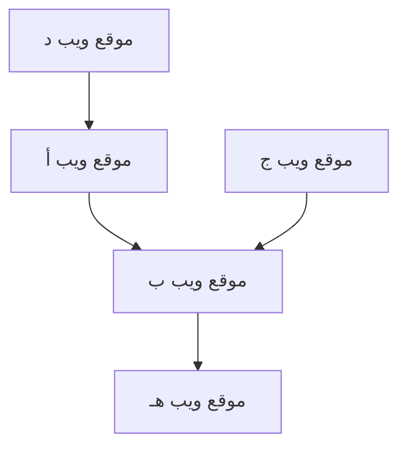

## 1. ولادة جوجل: خوارزمية PageRank
في عام 1998، تم تأسيسها من قبل لاري بيج وسيرجي برين.

## 2. تأسيس نموذج الإعلانات (AdWords)
أصبحت الإعلانات المرتبطة بالبحث "AdWords (إعلانات جوجل حاليًا)" الركيزة الأساسية لإيرادات جوجل.

## 3. الهواتف المحمولة ونظام أندرويد
في عام 2005، استحوذت على شركة Android وتم إطلاقه كنظام تشغيل هواتف محمولة مفتوح المصدر.

## 4. نحو شركة تعطي الأولوية للذكاء الاصطناعي
تحت قيادة الرئيس التنفيذي سوندار بيتشاي، تم تغيير المسار من "الأولوية للهواتف المحمولة" إلى "الأولوية للذكاء الاصطناعي". ورقة بحث نموذج Transformer (2017) أصبحت الأساس لثورة الذكاء الاصطناعي التوليدي الحديثة، بما في ذلك ChatGPT.

$$
\text{الانتباه}(Q, K, V) = \text{softmax}\left(\frac{QK^T}{\sqrt{d_k}}\right)V
$$
